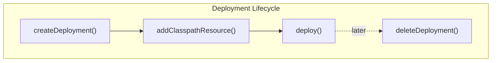

# Advanced Deployment Builder

The `DeploymentBuilder` API provides fine-grained control over process definition deployments beyond the default classpath scanning. It supports duplicate filtering, tenant isolation, scheduled activation, validation control, and more.

## Basic Deployment

```java
Deployment deployment = repositoryService.createDeployment()
    .addClasspathResource("process.bpmn")
    .name("My Deployment")
    .deploy();
```

## Resource Addition Methods

```java
repositoryService.createDeployment()
    // From classpath
    .addClasspathResource("process.bpmn")

    // From InputStream
    .addInputStream("custom.bpmn", new FileInputStream("custom.bpmn"))

    // From Spring Resource
    .addInputStream("resource.bpmn", springResource)

    // From string content
    .addString("inline.bpmn", bpmnXmlString)

    // From bytes
    .addBytes("binary.bpmn", bpmnBytes)

    // From ZIP archive
    .addZipInputStream(new ZipInputStream(zipStream))

    // From BpmnModel (programmatic)
    .addBpmnModel("generated.bpmn", bpmnModel)
    .deploy();
```

The `addInputStream(String resourceName, Resource resource)` overload (Spring `Resource`) auto-extracts resources whose name ends in `.bar`, `.zip`, or `.jar` entry-by-entry — as if `addZipInputStream(...)` had been called — instead of storing the archive as a single resource.

## Duplicate Filtering

Prevents creating a new version when resources haven't changed:

```java
Deployment deployment = repositoryService.createDeployment()
    .enableDuplicateFiltering()
    .addClasspathResource("process.bpmn")
    .deploy();

// If process.bpmn is identical to what's already deployed,
// the existing deployment is returned instead of creating a new version
```

When enabled, the new deployment is compared against previously deployed resources and, if identical, the existing deployment is returned instead of creating a new version.

### How the comparison actually works

- **Comparison target is the latest same-named deployment** (`DeployCmd.getLatestDeployment` / `deploymentsDiffer`): without a tenant, only the single latest deployment with the same name (`findLatestDeploymentByName`) is compared; with a tenant, *all* deployments with the same name **and** tenant ID are queried (ordered by ID descending) and the newest one is used.
- **Only the new deployment's resources are iterated** (`deploymentsDifferDefault`). A resource that is missing from the saved deployment counts as a difference, but *dropping* a resource from the new deployment does not trigger a redeployment.
- **Generated resources skip the byte comparison**: for each resource present in both deployments, the byte arrays are compared only if the saved resource is not *generated* (`ResourceEntity.isGenerated()` — created by the engine during deployment rather than provided as a resource).
- **With a manifest or enforced version set, resources are not compared at all**: the comparison is by **release version** (`ProjectManifest` version → `projectReleaseVersion`) or by **deployment version** (enforced app version), respectively.

## Deployment Key

```java
repositoryService.createDeployment()
    .key("monthly-orders")
    .addClasspathResource("process.bpmn")
    .deploy();

// Query by key
List<Deployment> deployments = repositoryService.createDeploymentQuery()
    .deploymentKey("monthly-orders")
    .list();
```

The key provides a stable identifier across versions, useful for querying all deployments of a particular logical group.

## Tenant Isolation

```java
repositoryService.createDeployment()
    .tenantId("tenant-123")
    .addClasspathResource("process.bpmn")
    .deploy();

// Query tenant-specific deployments
repositoryService.createDeploymentQuery()
    .deploymentTenantId("tenant-123")
    .list();
```

## Versioning, App Version & Rollback

Deployments carry a `version`, and the builder can derive deployment versioning from an application project manifest or enforce a specific app version:

```java
Deployment deployment = repositoryService.createDeployment()
    .setProjectManifest(projectManifest)   // org.activiti.core.common.project.model.ProjectManifest
    .setEnforcedAppVersion(2)              // optional
    .addClasspathResource("process.bpmn")
    .deploy();
```

- **Project manifest** (`setProjectManifest`): the deployment's `projectReleaseVersion` is set from `manifest.getVersion()`. With duplicate filtering enabled and a manifest set, `DeployCmd` compares deployments **by release version** (`Deployment.getProjectReleaseVersion()`) instead of by resources, and `applyUpgradeLogic` sets the new deployment's version to *the latest existing deployment's version + 1*. `BpmnDeployer.setProcessDefinitionVersionsAndIds` then stamps that deployment version onto every deployed process definition (instead of the usual per-key auto-increment), and `setProcessDefinitionAppVersion` stamps the same value as the process definition's `appVersion`.
- **Enforced app version** (`setEnforcedAppVersion`): the new deployment is given exactly the provided version, and with duplicate filtering enabled it is compared to the existing deployment **by version** rather than by release version or resources.
- **Rollback** (`DeployCmd.checkForRollback`): when duplicate filtering resolves the latest same-named deployment, and the engine is flagged as a post-rollback deployment (`ProcessEngineConfigurationImpl.isRollbackDeployment()`, Spring Boot property `activiti.deploy.after-rollback`, default `false`) and that latest deployment's version is **greater** than the enforced app version, the latest (newer) deployment is deleted via a non-cascade `DeleteDeploymentCmd`, and the deployment whose version equals the enforced app version becomes the comparison/upgrade target instead.

## Scheduled Activation

Deploy now, activate later:

```java
Date activationDate = new Date(System.currentTimeMillis() + 3600000); // 1 hour

repositoryService.createDeployment()
    .activateProcessDefinitionsOn(activationDate)
    .addClasspathResource("new-process.bpmn")
    .deploy();

// Process definitions are deployed but SUSPENDED until the activation date
// The async job executor activates them automatically
```

## Validation Control

```java
// Skip XML schema validation
repositoryService.createDeployment()
    .disableSchemaValidation()
    .addClasspathResource("process.bpmn")
    .deploy();

// Skip BPMN execution validation
repositoryService.createDeployment()
    .disableBpmnValidation()
    .addClasspathResource("process.bpmn")
    .deploy();

// Skip both (not recommended for production)
repositoryService.createDeployment()
    .disableSchemaValidation()
    .disableBpmnValidation()
    .addClasspathResource("process.bpmn")
    .deploy();
```

Disabling validation is useful for prototyping or when working with non-standard BPMN extensions that pass schema validation but fail execution validation.

## Deployment Properties

```java
repositoryService.createDeployment()
    .deploymentProperty("customProperty", "value")
    .addClasspathResource("process.bpmn")
    .deploy();
```

**Note: these properties are inert metadata.** `deploymentProperty(String, Object)` stores key-value pairs in a map on the `DeploymentBuilderImpl` only (readable via its `getDeploymentProperties()`); nothing in the engine reads or persists that map. The values are not written to the database, and the `Deployment` interface has no property accessors — it exposes only `getId`, `getName`, `getDeploymentTime`, `getCategory`, `getKey`, `getTenantId`, `getVersion`, and `getProjectReleaseVersion`. Do not rely on deployment properties for runtime behavior.

## Name and Category

```java
repositoryService.createDeployment()
    .name("Q4 Process Updates")
    .category("finance")
    .addClasspathResource("process.bpmn")
    .deploy();
```

## Deployment Object

After deploying, the `Deployment` object provides metadata:

```java
Deployment deployment = repositoryService.createDeployment()
    .name("My Deployment")
    .addClasspathResource("process.bpmn")
    .deploy();

String id = deployment.getId();
String name = deployment.getName();
Date deploymentTime = deployment.getDeploymentTime();
Integer version = deployment.getVersion();
String projectReleaseVersion = deployment.getProjectReleaseVersion();
```

`getVersion()` returns the deployment's version (see [Versioning, App Version & Rollback](#versioning-app-version--rollback)) and `getProjectReleaseVersion()` returns the version taken from the project manifest, if one was set at deploy time.

## Deleting Deployments

```java
// Delete deployment and its process definitions
repositoryService.deleteDeployment(deploymentId);

// Cascade: also delete running and historical process instances
repositoryService.deleteDeployment(deploymentId, true);
```



### What cascade delete removes

Both modes go through `DeleteDeploymentCmd` → `DeploymentEntityManagerImpl.deleteDeployment(deploymentId, cascade)`:

| Removed | `cascade = true` | `cascade = false` |
|---------|:---:|:---:|
| Deployment entity and its resources | yes | yes |
| All process definitions of the deployment | yes | yes |
| Running process instances of those definitions | yes | **no** (instances are left orphaned) |
| History process instances of those definitions | yes | **no** |
| Process-definition identity links (e.g. candidate starters) | yes | yes |
| Event subscriptions of those definitions (timer/signal/message starts) | yes | yes |
| `ACT_PROCDEF_INFO` rows of those definitions | yes | yes |
| Timer start jobs (`timer-start-event`) of those definitions | yes | yes |
| Models linked to the deployment | no | no |

Two more behaviors apply in **both** modes (`DeploymentEntityManagerImpl.deleteDeployment`):

- **Previous-version start events are re-attached** (`restorePreviousStartEventsIfNeeded`): if the deleted definition is the *latest* version of its key, the timer/signal/message start events of the previous version are restored so the process can still be started.
- **Linked models survive** with their `deploymentId` set to `null` (`updateRelatedModels`) — a model is a source with its own lifecycle and is not deleted together with the deployment.

> **Note on the interface javadoc:** `RepositoryService.deleteDeployment(String)` documents `@throws RuntimeException if there are still runtime or history process instances or jobs`. `DeleteDeploymentCmd` performs **no such validation** — in non-cascade mode the definitions are simply deleted and any running or historic instances are left behind (orphaned).

## Complete Example

```java
Deployment deployment = repositoryService.createDeployment()
    .name("Order Management v2.3")
    .key("order-management")
    .category("sales")
    .tenantId("tenant-001")
    .enableDuplicateFiltering()
    .activateProcessDefinitionsOn(futureDate)
    .deploymentProperty("changelog", "Added payment validation step") // builder-side metadata only — not persisted
    .addClasspathResource("processes/order.bpmn")
    .addClasspathResource("processes/payment.bpmn")
    .addString("override.bpmn", customBpmnXml)
    .deploy();

log.info("Deployed: {} (ID: {})", deployment.getName(), deployment.getId());
```

## Related Documentation

- [Spring Auto-Deployment Modes](./auto-deployment-modes.md) — Automatic classpath deployment
- [Process Instance Suspension](./process-instance-suspension.md) — Managing suspended definitions
