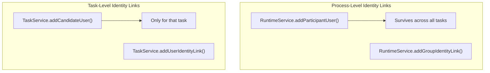

# Process-Level Identity Links

Identity links at the process instance level associate users and groups with running processes. This is separate from task-level identity links and enables process-wide access control, participation tracking, and audit information.

## API

### Adding Identity Links

```java
// Add a user with a specific link type
runtimeService.addUserIdentityLink(
    processInstanceId, "userId", "participant");

// Add a group
runtimeService.addGroupIdentityLink(
    processInstanceId, "groupId", "participant");

// Convenience methods (implicitly set type to "participant")
runtimeService.addParticipantUser(processInstanceId, "userId");
runtimeService.addParticipantGroup(processInstanceId, "groupId");

// Note: addParticipantUser() / addParticipantGroup() create PARTICIPANT-type links,
// not "candidate" links. Use addUserIdentityLink(..., "candidate") /
// addGroupIdentityLink(..., "candidate") for candidate links.
```

### Removing Identity Links

```java
runtimeService.deleteUserIdentityLink(processInstanceId, "userId", "participant");
runtimeService.deleteGroupIdentityLink(processInstanceId, "groupId", "participant");

// Convenience methods
runtimeService.deleteParticipantUser(processInstanceId, "userId");
runtimeService.deleteParticipantGroup(processInstanceId, "groupId");
```

### Querying Identity Links

```java
List<IdentityLink> links = runtimeService
    .getIdentityLinksForProcessInstance(processInstanceId);

for (IdentityLink link : links) {
    System.out.println(link.getUserId() + " / " + link.getGroupId()
        + " - type: " + link.getType()
        + " - process: " + link.getProcessInstanceId());
}
```

### The `details` Field

Beyond user, group, and type, an identity link can carry an optional `details` payload — a `byte[]` of serialized data associated with the link. The API javadoc documents the field as carrying the **JWT subject** (`sub` claim) of the identity that the link belongs to. It is persisted in the `DETAILS_` column of both `ACT_RU_IDENTITYLINK` and `ACT_HI_IDENTITYLINK`.

Both the `RuntimeService` and `TaskService` expose a `details` overload — but **for user links only** (there is no group-level `details` overload):

| Service | Method |
|---------|--------|
| `RuntimeService` | `void addUserIdentityLink(String processInstanceId, String userId, String identityLinkType, byte[] details)` |
| `TaskService` | `void addUserIdentityLink(String taskId, String userId, String identityLinkType, byte[] details)` |

The payload is read back through `IdentityLink.getDetails()`:

```java
import java.nio.charset.StandardCharsets;

import org.activiti.engine.task.IdentityLink;

// Store serialized details (e.g. the JWT subject) on a process-level link
byte[] jwtSubject = "sub-uuid-123".getBytes(StandardCharsets.UTF_8);
runtimeService.addUserIdentityLink(processInstanceId, "userId", "participant", jwtSubject);

// The task-level equivalent
taskService.addUserIdentityLink(taskId, "userId", "assignee", jwtSubject);

// Read the details back
List<IdentityLink> links = runtimeService.getIdentityLinksForProcessInstance(processInstanceId);
for (IdentityLink link : links) {
    if ("userId".equals(link.getUserId())) {
        byte[] received = link.getDetails();
    }
}
```

### Historic Identity Links

Runtime identity links disappear with the task or process instance. The `HistoryService` keeps them in the `ACT_HI_IDENTITYLINK` table and exposes two lookup methods:

| Method | Returns |
|--------|---------|
| `historyService.getHistoricIdentityLinksForTask(String taskId)` | `List<HistoricIdentityLink>` persisted for the given (possibly completed) task |
| `historyService.getHistoricIdentityLinksForProcessInstance(String processInstanceId)` | `List<HistoricIdentityLink>` persisted for the given (possibly completed) process instance |

```java
import java.util.List;

import org.activiti.engine.history.HistoricIdentityLink;

// Links recorded for a (possibly completed) task
List<HistoricIdentityLink> taskLinks =
    historyService.getHistoricIdentityLinksForTask(taskId);

// Links recorded for a (possibly completed) process instance
List<HistoricIdentityLink> processLinks =
    historyService.getHistoricIdentityLinksForProcessInstance(processInstanceId);
```

**The task variant synthesizes extra links.** Besides the persisted rows, `GetHistoricIdentityLinksForTaskCmd` reads the historic task and appends an in-memory `assignee` link when the task had an assignee and an `owner` link when it had an owner. These synthesized links are not stored in `ACT_HI_IDENTITYLINK` — they are derived from the historic task row at query time. The process instance variant returns only the persisted rows.

See also: [History Service](../api-reference/engine-api/history-service.md).

## Identity Link Types

`IdentityLinkType` defines five native link types (in source order):

| Type | Constant | Purpose |
|------|----------|---------|
| `assignee` | `IdentityLinkType.ASSIGNEE` | The user a task is assigned to |
| `candidate` | `IdentityLinkType.CANDIDATE` | Can claim tasks within process |
| `owner` | `IdentityLinkType.OWNER` | The user who owns a task and can monitor it |
| `starter` | `IdentityLinkType.STARTER` | The user who started a process instance (or subprocess) |
| `participant` | `IdentityLinkType.PARTICIPANT` | General participation |
| `custom` | — | Application-specific types (any string accepted by the `addUserIdentityLink` / `addGroupIdentityLink` overloads) |

The `starter`, `assignee`, `owner`, and `participant` rows are usually maintained by the engine itself — see [Automatic Identity Links](#automatic-identity-links) below.

## Automatic Identity Links

You do not have to create every identity link yourself — the engine maintains two of them for you.

### `starter` — created on process (and subprocess) start

When a process instance is created, the engine links the **currently authenticated user** to it with type `starter`:

- `ExecutionEntityManagerImpl.createProcessInstanceExecution()` adds the link via `addIdentityLink(execution, authenticatedUserId, null, IdentityLinkType.STARTER)` whenever `Authentication.getAuthenticatedUserId()` is not `null`.
- `ExecutionEntityManagerImpl.createSubprocessInstance()` does the same for subprocess instances.

If no user is authenticated when the instance is started (for example, an unauthenticated `startProcessInstanceByKey()` call), no `starter` link is created.

### `participant` — automatic involvement with the process instance

Whenever a user is linked to a **task**, the engine automatically involves that user with the task's **process instance** as `participant`:

- **Adding a user identity link to a task** — `IdentityLinkEntityManagerImpl.addIdentityLink(TaskEntity, ...)` calls `involveUser(processInstance, userId, IdentityLinkType.PARTICIPANT)` after inserting the task link, whenever the link has a `userId` and the task belongs to a process instance. This applies to any task link type (`assignee`, `candidate`, `owner`, ...).
- **Completing a task** — `AbstractCompleteTaskCmd` involves the authenticated user completing the task as `participant` on the process instance.
- **Assigning an assignee or owner** — `TaskEntityManagerImpl.changeTaskAssignee()` and `changeTaskOwner()` involve the new assignee/owner as `participant`.

Two details worth knowing:

- `involveUser()` is idempotent — a user already linked to the process instance is not linked a second time.
- Only **user** links trigger automatic involvement; group links never create `participant` links.

## Use Cases

### Tracking Process Participants

```java
// Record who is involved in this process using explicit "participant" links
runtimeService.addUserIdentityLink(processInstanceId, "initiator", "participant");
runtimeService.addUserIdentityLink(processInstanceId, "reviewer", "participant");
runtimeService.addGroupIdentityLink(processInstanceId, "approval-team", "participant");

// Later: query for audit
List<IdentityLink> participants = runtimeService
    .getIdentityLinksForProcessInstance(processInstanceId);
```

### Process-Level Access Control

```java
// Only allow certain users to query or interact with the process
boolean canAccess(String userId, String processInstanceId) {
    List<IdentityLink> links = runtimeService
        .getIdentityLinksForProcessInstance(processInstanceId);
    return links.stream()
        .anyMatch(link -> userId.equals(link.getUserId()));
}
```

### Dynamic Group Association

```java
// Associate the department group with the process for visibility
runtimeService.addGroupIdentityLink(
    processInstanceId, "department-" + departmentId, "participant");
```

## Process vs Task Identity Links

| Aspect | Process Identity Link | Task Identity Link |
|--------|----------------------|-------------------|
| Scope | Entire process instance | Single task |
| API | `RuntimeService` | `TaskService` / `DelegateTask` |
| Persistence | Survives across tasks | Only for that task |
| Use case | Audit, access control | Claiming, assignment |



## Related Documentation

- [Process Definition Authorization](./process-definition-authorization.md) — Candidate starters
- [Variables and Variable Scope](../bpmn/reference/variables.md) — Task variables
