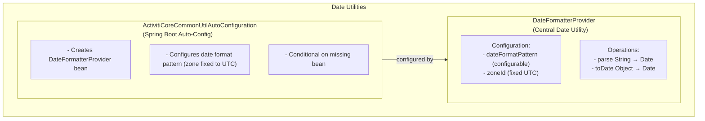
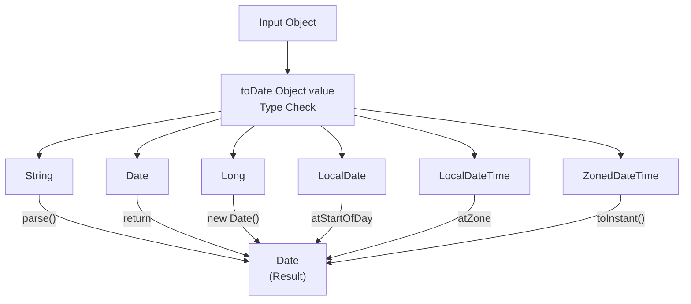

# Activiti Common Util Module - Technical Documentation

**Module:** `activiti-core-common/activiti-common-util`

---

## Table of Contents

- [Overview](#overview)
- [Architecture](#architecture)
- [Key Classes and Their Responsibilities](#key-classes-and-their-responsibilities)
- [DateFormatterProvider](#dateformatterprovider)
- [Auto-Configuration](#auto-configuration)
- [Usage Examples](#usage-examples)
- [Best Practices](#best-practices)
- [API Reference](#api-reference)
- [Troubleshooting](#troubleshooting)

---

## Overview

The **activiti-common-util** module provides essential utility classes for date formatting, parsing, and conversion across the Activiti platform. It offers a centralized, configurable approach to handling date/time operations with support for multiple date types and timezone-aware processing.

### Key Features

- **Date Formatting & Parsing**: Flexible date pattern support
- **Type Conversion**: Convert between various date/time types
- **Timezone Awareness**: ZoneId support for proper timezone handling
- **Spring Boot Integration**: Auto-configuration with customizable patterns
- **NOT Thread-Safe**: `DateFormatterProvider` has a mutable setter (`setDateFormatPattern`) — do not share instances across threads without synchronization
- **Exception Handling**: Robust error handling for invalid dates

### Module Structure

<DirectoryTree rootName="activiti-common-util" expandAll dotWalk showFirst={5}>
  <DirectoryTree.Dir name="src">
    <DirectoryTree.Dir name="main">
      <DirectoryTree.Dir name="java">
        <DirectoryTree.Dir name="org">
          <DirectoryTree.Dir name="activiti">
            <DirectoryTree.Dir name="common">
              <DirectoryTree.Dir name="util">
                <DirectoryTree.File name="DateFormatterProvider.java" />
                <DirectoryTree.Dir name="conf">
                  <DirectoryTree.File name="ActivitiCoreCommonUtilAutoConfiguration.java" />
                </DirectoryTree.Dir>
              </DirectoryTree.Dir>
            </DirectoryTree.Dir>
          </DirectoryTree.Dir>
        </DirectoryTree.Dir>
      </DirectoryTree.Dir>
    </DirectoryTree.Dir>
  </DirectoryTree.Dir>
</DirectoryTree>

---

## Architecture

### Component Diagram



### Date Conversion Flow



---

## Key Classes and Their Responsibilities

### DateFormatterProvider

**Purpose:** Central utility for date formatting, parsing, and type conversion.

**Responsibilities:**
- Parse date strings using configurable patterns
- Convert various date/time types to `java.util.Date`
- Handle timezone-aware operations
- Provide flexible date pattern support
- Manage timezone (fixed to UTC)

**Configuration:**
- `dateFormatPattern`: Date format pattern (default: `yyyy-MM-dd[['T']HH:mm:ss[.SSS][XXX]]`)
- `zoneId`: Timezone for date operations (fixed to `ZoneOffset.UTC`; read via `getZoneId()`, cannot be changed)

**Supported Input Types:**
- `String` - Parsed using configured pattern
- `Date` - Returned as-is
- `Long` - Converted from milliseconds
- `LocalDate` - Converted with timezone
- `LocalDateTime` - Converted with timezone
- `ZonedDateTime` - Converted to instant

**When to Use:** For all date parsing and conversion operations in Activiti applications.

**Design Pattern:** Provider pattern with configurable behavior

**Thread Safety:** NOT thread-safe. The class has a mutable setter (`setDateFormatPattern`) that can change the configuration at any time. If shared across threads, external synchronization is required, or each thread should use its own instance.

**Example:**
```java
@Autowired
private DateFormatterProvider dateFormatterProvider;

public Date parseDate(String dateStr) {
    return dateFormatterProvider.parse(dateStr);
}

public Date convertToDate(Object value) {
    return dateFormatterProvider.toDate(value);
}
```

---

### ActivitiCoreCommonUtilAutoConfiguration

**Purpose:** Spring Boot auto-configuration for date utilities.

**Responsibilities:**
- Create `DateFormatterProvider` bean
- Configure date format pattern from properties
- Enable conditional bean creation
- Integrate with Spring context

**When to Use:** Automatically applied when module is on classpath.

**Design Pattern:** Auto-configuration pattern

---

## DateFormatterProvider

### Date Parsing

```java
public class DateFormatterProvider {
    
    private String dateFormatPattern;
    private ZoneId zoneId = ZoneOffset.UTC;
    
    /**
     * Parse a date string using the configured pattern.
     * 
     * @param value The date string to parse
     * @return Parsed Date object
     * @throws DateTimeException if parsing fails
     */
    public Date parse(String value) throws DateTimeException {
        DateTimeFormatter dateTimeFormatter = new DateTimeFormatterBuilder()
            .appendPattern(getDateFormatPattern())
            .toFormatter()
            .withZone(getZoneId());
        
        try {
            // Try parsing as ZonedDateTime first
            ZonedDateTime zonedDateTime = dateTimeFormatter.parse(value, ZonedDateTime::from);
            return Date.from(zonedDateTime.toInstant());
        } catch (DateTimeException e) {
            // Fall back to LocalDate parsing
            LocalDate localDate = dateTimeFormatter.parse(String.valueOf(value), LocalDate::from);
            return Date.from(localDate.atStartOfDay().atZone(getZoneId()).toInstant());
        }
    }
}
```

### Type Conversion

```java
/**
 * Convert various object types to Date.
 * 
 * Supported types:
 * - String: Parsed using configured pattern
 * - Date: Returned as-is
 * - Long: Converted from milliseconds timestamp
 * - LocalDate: Converted with timezone
 * - LocalDateTime: Converted with timezone
 * - ZonedDateTime: Converted to instant
 * 
 * @param value The object to convert
 * @return Converted Date object
 * @throws DateTimeException if conversion fails
 */
public Date toDate(Object value) {
    if (value instanceof String) {
        return parse((String) value);
    }
    
    if (value instanceof Date) {
        return (Date) value;
    }
    
    if (value instanceof Long) {
        return new Date((long) value);
    }
    
    if (value instanceof LocalDate) {
        return Date.from(((LocalDate) value).atStartOfDay(getZoneId()).toInstant());
    }
    
    if (value instanceof LocalDateTime) {
        return Date.from(((LocalDateTime) value).atZone(getZoneId()).toInstant());
    }
    
    if (value instanceof ZonedDateTime) {
        return Date.from(((ZonedDateTime) value).toInstant());
    }
    
    throw new DateTimeException(
        MessageFormat.format("Error while parsing date. Type: {0}, value: {1}", 
            value.getClass().getName(), value)
    );
}
```

### Configuration

```java
public class DateFormatterProvider {
    
    public DateFormatterProvider(String dateFormatPattern) {
        this.dateFormatPattern = dateFormatPattern;
    }
    
    public String getDateFormatPattern() {
        return dateFormatPattern;
    }
    
    public void setDateFormatPattern(String dateFormatPattern) {
        this.dateFormatPattern = dateFormatPattern;
    }
    
    // The zone is pinned to UTC in the field initializer and cannot be
    // changed; getZoneId() always returns ZoneOffset.UTC.
    public ZoneId getZoneId() {
        return zoneId;
    }
}
```

---

## Auto-Configuration

### Spring Boot Integration

```java
@AutoConfiguration
public class ActivitiCoreCommonUtilAutoConfiguration {
    
    /**
     * Auto-configure DateFormatterProvider bean.
     * 
     * @param dateFormatPattern Pattern for date formatting
     * @return Configured DateFormatterProvider
     */
     @Bean
     @ConditionalOnMissingBean
     public DateFormatterProvider dateFormatterProvider(
             @Value("${spring.activiti.date-format-pattern:yyyy-MM-dd[['T']HH:mm:ss[.SSS][XXX]]}")
             String dateFormatPattern) {
        return new DateFormatterProvider(dateFormatPattern);
    }
}
```

### Custom Configuration

```java
@Configuration
public class CustomDateConfig {
    
    /**
     * Override default date format pattern.
     * Only the pattern is configurable — the zone is always UTC.
     */
    @Bean
    public DateFormatterProvider customDateFormatterProvider() {
        return new DateFormatterProvider("dd/MM/yyyy HH:mm:ss");
    }
}
```

---

## Usage Examples

### Basic Date Parsing

```java
@Service
public class DateParsingService {
    
    @Autowired
    private DateFormatterProvider dateFormatterProvider;
    
    public Date parseIsoDate(String isoDate) {
        // "2024-01-15T10:30:00.000Z"
        return dateFormatterProvider.parse(isoDate);
    }
    
    public Date parseSimpleDate(String simpleDate) {
        // "2024-01-15"
        return dateFormatterProvider.parse(simpleDate);
    }
}
```

### Converting Various Types

```java
@Service
public class DateConversionService {
    
    @Autowired
    private DateFormatterProvider dateFormatterProvider;
    
    public void convertAllTypes() {
        // String to Date
        Date fromString = dateFormatterProvider.toDate("2024-01-15T10:30:00Z");
        
        // Date to Date (no-op)
        Date fromDate = dateFormatterProvider.toDate(new Date());
        
        // Long (timestamp) to Date
        Date fromLong = dateFormatterProvider.toDate(1705312200000L);
        
        // LocalDate to Date
        Date fromLocalDate = dateFormatterProvider.toDate(LocalDate.of(2024, 1, 15));
        
        // LocalDateTime to Date
        Date fromLocalDateTime = dateFormatterProvider.toDate(
            LocalDateTime.of(2024, 1, 15, 10, 30)
        );
        
        // ZonedDateTime to Date
        Date fromZonedDateTime = dateFormatterProvider.toDate(
            ZonedDateTime.of(2024, 1, 15, 10, 30, 0, 0, ZoneOffset.UTC)
        );
    }
}
```

### Custom Date Format

```java
@Configuration
public class DateFormatConfig {
    
    @Bean
    public DateFormatterProvider usDateFormatProvider() {
        // Only the pattern varies between providers; the zone is always UTC.
        return new DateFormatterProvider("MM/dd/yyyy HH:mm:ss");
    }
}

@Service
public class UsDateService {
    
    @Autowired
    @Qualifier("usDateFormatProvider")
    private DateFormatterProvider dateFormatterProvider;
    
    public Date parseUsDate(String usDate) {
        // "01/15/2024 10:30:00"
        return dateFormatterProvider.parse(usDate);
    }
}
```

### Handling Process Variables

```java
@Component
public class ProcessVariableDateHandler {
    
    @Autowired
    private DateFormatterProvider dateFormatterProvider;

    @Autowired
    private RuntimeService runtimeService;

    public void handleProcessVariable(String executionId, String variableName, Object value) {
        // Convert process variable to Date
        Date dateValue = dateFormatterProvider.toDate(value);

        // Set it on the running execution (org.activiti.engine.RuntimeService)
        runtimeService.setVariable(executionId, variableName, dateValue);
    }

    public boolean isDateBeforeToday(Object dateValue) {
        Date date = dateFormatterProvider.toDate(dateValue);
        Date today = new Date();
        return date.before(today);
    }
}
```

### Timezone Handling

**Important:** `DateFormatterProvider` always operates in UTC — the zone is pinned to `ZoneOffset.UTC` and can only be read via `getZoneId()`, never changed. To represent a timestamp from another timezone, include the zone offset in the input string (the default pattern supports an optional `XXX` offset), or convert with `java.time` before calling `toDate()`:

```java
@Service
public class TimezoneAwareDateService {

    @Autowired
    private DateFormatterProvider dateFormatterProvider;

    public Date parseOffsetDate(String dateStr) {
        // "2024-01-15T10:30:00-05:00" — the offset is honored, the result is an instant
        return dateFormatterProvider.parse(dateStr);
    }

    public Date convertToUtc(LocalDateTime localTime, String sourceTimezone) {
        // Interpret a local value in the given zone, then hand it to the provider
        ZonedDateTime zoned = localTime.atZone(ZoneId.of(sourceTimezone));
        return dateFormatterProvider.toDate(zoned);
    }
}
```

### Error Handling

```java
@Service
public class SafeDateService {
    
    @Autowired
    private DateFormatterProvider dateFormatterProvider;
    
    public Optional<Date> safeParse(String dateStr) {
        try {
            Date date = dateFormatterProvider.parse(dateStr);
            return Optional.of(date);
        } catch (DateTimeException e) {
            log.warn("Failed to parse date: {}", dateStr, e);
            return Optional.empty();
        }
    }
    
    public Date parseWithDefault(String dateStr, Date defaultValue) {
        try {
            return dateFormatterProvider.parse(dateStr);
        } catch (DateTimeException e) {
            log.debug("Using default date for invalid input: {}", dateStr);
            return defaultValue;
        }
    }
    
    public Date convertWithValidation(Object value) {
        if (value == null) {
            throw new IllegalArgumentException("Date value cannot be null");
        }
        
        try {
            return dateFormatterProvider.toDate(value);
        } catch (DateTimeException e) {
            throw new IllegalArgumentException(
                "Invalid date format for value: " + value, e);
        }
    }
}
```

---

## Best Practices

### 1. Use ISO 8601 Format

```java
// GOOD - ISO 8601 (default)
// Pattern: yyyy-MM-dd[['T']HH:mm:ss[.SSS][XXX]]
DateFormatterProvider provider = new DateFormatterProvider(
    "yyyy-MM-dd[['T']HH:mm:ss[.SSS][XXX]]"
);

// BAD - Ambiguous format
DateFormatterProvider provider = new DateFormatterProvider("MM/dd/yyyy");
```

### 2. Include the Timezone in the Data

The provider always parses in UTC, so carry the offset in the value itself:

```java
// GOOD - Timestamp carries its own offset; stored as an instant
DateFormatterProvider provider = new DateFormatterProvider(
    "yyyy-MM-dd[['T']HH:mm:ss[.SSS][XXX]]"
);
Date date = provider.parse("2024-01-15T10:30:00-05:00");

// BAD - Zoneless value is interpreted as UTC
Date ambiguous = provider.parse("2024-01-15 10:30:00");
```

### 3. Handle Parsing Exceptions

```java
// GOOD - Try-catch for parsing
try {
    Date date = dateFormatterProvider.parse(userInput);
    processDate(date);
} catch (DateTimeException e) {
    log.error("Invalid date format: {}", userInput, e);
    throw new BadRequestException("Invalid date");
}

// BAD - No error handling
Date date = dateFormatterProvider.parse(userInput);
```

### 4. Use toDate() for Flexible Input

```java
// GOOD - Handles multiple types
public void setDateVariable(Object value) {
    Date date = dateFormatterProvider.toDate(value);
    repository.save(date);
}

// BAD - Assumes String input
public void setDateVariable(String value) {
    Date date = dateFormatterProvider.parse(value);
    repository.save(date);
}
```

### 5. Configure Pattern Once

```java
// GOOD - Central configuration
@Configuration
public class DateConfig {
    @Bean
    public DateFormatterProvider dateFormatterProvider() {
        return new DateFormatterProvider("yyyy-MM-dd HH:mm:ss");
    }
}

// BAD - Multiple configurations
@Service
public class Service1 {
    private DateFormatterProvider provider1 = new DateFormatterProvider("pattern1");
}

@Service
public class Service2 {
    private DateFormatterProvider provider2 = new DateFormatterProvider("pattern2");
}
```

---

## API Reference

### DateFormatterProvider

**Constructor:**

```java
public DateFormatterProvider(String dateFormatPattern)
```

**Configuration Methods:**

```java
/**
 * Get the date format pattern.
 */
public String getDateFormatPattern();

/**
 * Set the date format pattern.
 */
public void setDateFormatPattern(String dateFormatPattern);

/**
 * Get the timezone for date operations.
 * Always returns {@code ZoneOffset.UTC} — the zone is immutable.
 */
public ZoneId getZoneId();
```

**Parsing Methods:**

```java
/**
 * Parse a date string using the configured pattern.
 * 
 * @param value The date string to parse
 * @return Parsed Date object
 * @throws DateTimeException if parsing fails
 */
public Date parse(String value) throws DateTimeException;

/**
 * Convert various object types to Date.
 * 
 * @param value The object to convert (String, Date, Long, LocalDate, 
 *              LocalDateTime, ZonedDateTime)
 * @return Converted Date object
 * @throws DateTimeException if conversion fails
 */
public Date toDate(Object value);
```

---

### ActivitiCoreCommonUtilAutoConfiguration

**Bean Methods:**

```java
/**
 * Auto-configure DateFormatterProvider bean.
 * 
 * @param dateFormatPattern Pattern for date formatting
 * @return Configured DateFormatterProvider
 */
@Bean
@ConditionalOnMissingBean
public DateFormatterProvider dateFormatterProvider(String dateFormatPattern);
```

---

## Configuration Properties

The `DateFormatterProvider` bean accepts a date format pattern via its constructor parameter. The default pattern `yyyy-MM-dd[['T']HH:mm:ss[.SSS][XXX]]` supports:
- Full ISO 8601: `2024-01-15T10:30:00.000Z`
- Date only: `2024-01-15`
- Date with time: `2024-01-15 10:30:00`
- With milliseconds: `2024-01-15T10:30:00.123`
- With timezone: `2024-01-15T10:30:00+05:30`

---

## Troubleshooting

### DateTimeException: Text '2024-01-15' could not be parsed

**Problem:** Date string doesn't match configured pattern

**Solution:**
1. Check the configured date format pattern
2. Ensure date string matches pattern
3. Use flexible pattern with optional components

### Timezone Mismatch

**Problem:** Dates appear in wrong timezone

**Solution:**
1. Remember `DateFormatterProvider` always operates in UTC — `getZoneId()` returns `ZoneOffset.UTC` and the zone cannot be changed
2. Include the zone offset in date strings — the default pattern supports an optional `XXX` offset
3. Convert to local timezone only for display

```java
DateFormatterProvider provider = new DateFormatterProvider(pattern);
// provider.getZoneId() is always ZoneOffset.UTC
Date date = provider.parse("2024-01-15T10:30:00-05:00");
```

### Null Pointer Exception on toDate()

**Problem:** Passing null to toDate()

**Solution:**
1. Check for null before conversion
2. Use Optional for safe conversion
3. Provide default value

```java
public Date safeToDate(Object value) {
    if (value == null) {
        return null;  // or return defaultValue
    }
    return dateFormatterProvider.toDate(value);
}
```

### Unsupported Type Exception

**Problem:** Passing unsupported type to toDate()

**Solution:**
1. Check supported types before conversion
2. Convert to supported type first
3. Add custom type handling

```java
public Date convert(Object value) {
    if (value instanceof MyCustomDate) {
        value = ((MyCustomDate) value).toInstant();
    }
    return dateFormatterProvider.toDate(value);
}
```

---

## Supported Date Types

| Input Type | Description | Example |
|------------|-------------|---------|
| `String` | Parsed using configured pattern | `"2024-01-15T10:30:00Z"` |
| `Date` | Returned as-is | `new Date()` |
| `Long` | Milliseconds since epoch | `1705312200000L` |
| `LocalDate` | Date without time | `LocalDate.of(2024, 1, 15)` |
| `LocalDateTime` | Date with time, no timezone | `LocalDateTime.of(2024, 1, 15, 10, 30)` |
| `ZonedDateTime` | Full date-time with timezone | `ZonedDateTime.now()` |

---

## See Also

- [Parent Module Documentation](../overview.md)
- [Spring Application](./spring-application.md)
- [Expression Language](./expression-language.mdx)
