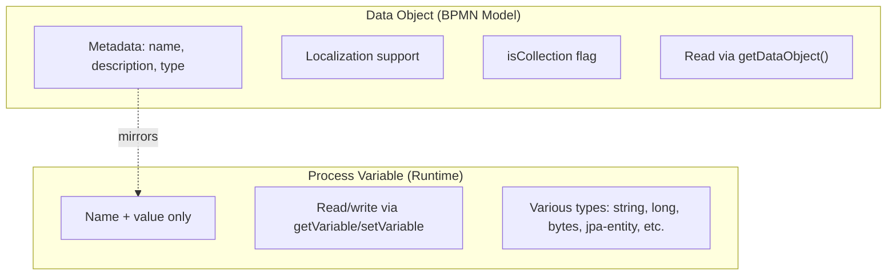

# Data Objects and Data Stores

BPMN Data Objects and Data Stores provide a way to model data associated with a process at the diagram level, carrying metadata such as name, description, type, and collection status. They are distinct from process variables — data objects represent the **data model** of a process, while variables hold the **runtime values**.

## Data Object

A Data Object represents a piece of data relevant to the process. It carries metadata about the data item, including localization support for name and description.

```xml
<dataObject id="orderData" name="Order Data"/>
```

### Data Object Properties

| Property | Description |
|----------|-------------|
| `name` | Display name with localization support |
| `description` | Human-readable description with localization |
| `itemSubjectRef` | Reference to a data type definition |
| `isCollection` | Whether the data object represents a collection |

### Valued Data Objects

Data objects with initial values. The type is selected via the `itemSubjectRef` attribute and the value is provided as a `<activiti:value>` child element:

```xml
<!-- xmlns:activiti="http://activiti.org/bpmn" required -->
<dataObject id="defaultName" name="Default Name" itemSubjectRef="xsd:string">
  <extensionElements>
    <activiti:value>Unknown</activiti:value>
  </extensionElements>
</dataObject>
<dataObject id="maxRetries" name="Max Retries" itemSubjectRef="xsd:int">
  <extensionElements>
    <activiti:value>3</activiti:value>
  </extensionElements>
</dataObject>
<dataObject id="isActive" name="Is Active" itemSubjectRef="xsd:boolean">
  <extensionElements>
    <activiti:value>true</activiti:value>
  </extensionElements>
</dataObject>
```

Supported `itemSubjectRef` values: `xsd:string`, `xsd:int`, `xsd:long`, `xsd:double`, `xsd:boolean`, `xsd:datetime`.

## Data Store

A Data Store represents an external repository of data that the process reads from or writes to. Unlike data objects (which are process-scoped), data stores are **process-independent**.

```xml
<dataStore id="customerDb" name="Customer Database" itemSubjectRef="jdbc://customers">
  <dataState>active</dataState>
</dataStore>
```

The `<dataState>` child element is parsed from its text content and applies to data stores and data store references only — not to data objects.

### Data Store Reference

A Data Store Reference links a process activity to an external data store:

```xml
<dataStoreReference id="refCustomerDb" name="Customer DB Ref" dataStoreRef="customerDb"/>
```

## Runtime API

### Querying Data Objects

Data objects are **read-only at runtime** — they mirror process variables and are populated automatically from BPMN-valued data objects.

```java
// Get all data objects visible from an execution scope
Map<String, DataObject> allDataObjects = runtimeService.getDataObjects(executionId);

// Get data objects with localization support
Map<String, DataObject> localizedObjects = runtimeService.getDataObjects(executionId, "en", true);

// Get data objects by specific names
Map<String, DataObject> namedObjects = runtimeService.getDataObjects(executionId, List.of("orderData", "shipmentData"));

// Get local data objects (scoped to execution, no parent scope)
Map<String, DataObject> localObjects = runtimeService.getDataObjectsLocal(executionId);
```

To set or delete data, use standard process variables:

```java
// Set the underlying variable (data object will reflect it)
runtimeService.setVariable(processInstanceId, "orderData", orderObject);

// Delete the underlying variable
runtimeService.removeVariable(processInstanceId, "orderData");
```

### Task-Scoped Data Objects

The engine's `TaskService` exposes task-scoped equivalents of the data object API. A task's scope is the execution scope of that task — the data objects visible from the task, including parent scopes — and the locale/localization-fallback behavior is identical to the execution-scoped API above. All overloads throw `ActivitiObjectNotFoundException` when no task exists for the given id.

| Method | Description |
|--------|-------------|
| `getDataObjects(String taskId)` | All data objects visible from the task's scope |
| `getDataObjects(String taskId, String locale, boolean withLocalizationFallback)` | Same, with localized name and description |
| `getDataObjects(String taskId, Collection<String> dataObjectNames)` | Data objects filtered by name |
| `getDataObjects(String taskId, Collection<String> dataObjectNames, String locale, boolean withLocalizationFallback)` | Name filter with localized name and description |
| `getDataObject(String taskId, String dataObject)` | A single data object, or `null` if undefined |
| `getDataObject(String taskId, String dataObjectName, String locale, boolean withLocalizationFallback)` | A single data object with localized name and description, or `null` if undefined |

```java
// All data objects visible from the task's scope (including parent scopes)
Map<String, DataObject> taskDataObjects = taskService.getDataObjects(taskId);

// A single data object by name — null when the data object is not defined
DataObject orderData = taskService.getDataObject(taskId, "orderData");
```

See the [TaskService reference](../../api-reference/engine-api/task-service.md) for the full task-scoped API.

### Data Object Interface

```java
public interface DataObject {
    String getName();                       // Name with locale fallback
    String getLocalizedName();              // Localized display name
    String getDescription();                // Human-readable description
    Object getValue();                      // Runtime value
    String getType();                       // Data type name
    String getDataObjectDefinitionKey();    // BPMN element ID that defined this
}
```

## Data Objects vs Process Variables

| Aspect | Data Object | Process Variable |
|--------|-------------|------------------|
| Metadata | Name, description, type, localization | Name and value only |
| BPMN modeling | Visible in process diagram | Not modeled in BPMN |
| API | `getDataObject()` (read-only); use `setVariable()`/`removeVariable()` to modify | `getVariable()`, `setVariable()` |
| Collection flag | `isCollection` property | Not tracked |



## Use Cases

### Documenting Process Data Model

```xml
<process id="orderProcess">
  <!-- Data objects document what data the process handles -->
  <dataObject id="order" name="Order" isCollection="false">
    <documentation>Customer order with line items</documentation>
  </dataObject>
  <dataObject id="shipments" name="Shipments" isCollection="true">
    <documentation>Related shipments for this order</documentation>
  </dataObject>
  <dataObject id="payments" name="Payments" isCollection="true"/>
  ...
</process>
```

### External System Reference

```xml
<!-- Reference to external data source -->
<dataStore id="erpSystem" name="ERP System" itemSubjectRef="rest://erp/api/v1"/>

<dataStoreReference id="erpRef" name="ERP Data" dataStoreRef="erpSystem"/>
```

## Related Documentation

- [Variables and Variable Scope](../reference/variables.md) — Process variables
- [JPA Entity Variables](../integration/jpa-process-variables.md) — Storing JPA entities as process variables
- [Service Task](./service-task.md) — Reading/writing data objects in delegates
