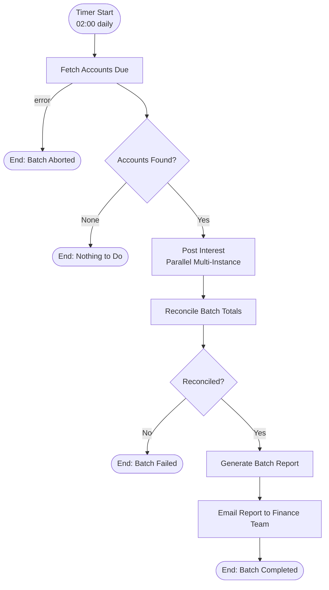
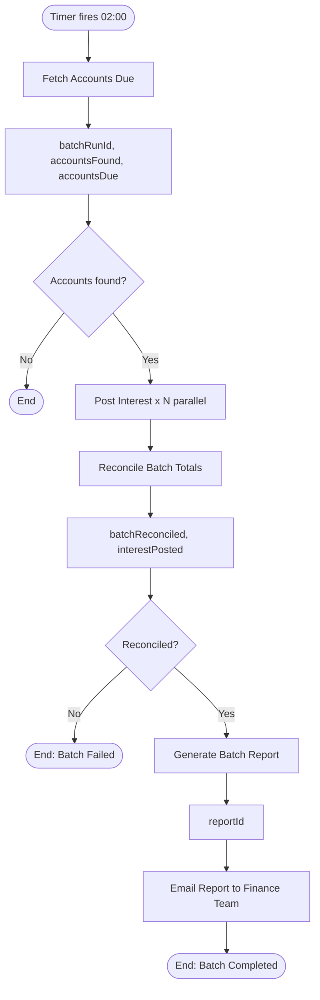

# Batch Interest Posting Process

The batch interest posting process runs every night at 02:00: it extracts the accounts with interest due from the ledger, posts interest on each account **in parallel**, reconciles the batch totals, and emails a report to the finance back office. It contains **no user tasks** — a fully unattended process whose lifecycle is driven by the engine itself.

This is the Activiti answer to "we have a batch job, do we still want a process engine for it?": yes — you get scheduling, parallelism, retry, state, history, and auditing for free.

## Process Overview



## Key Features

- **Timer Start Event** - Cron schedule (`0 0 2 * * ?`) built into the process definition
- **Zero User Tasks** - Fully unattended; no human in the loop
- **Parallel Multi-Instance** - One service task instance per account, all running concurrently over `${accountsDue}`
- **Automatic Job Retry** - `activiti:failedJobRetryTimeCycle="R3/PT5M"`
- **Reconciliation Gate** - The batch only completes when totals reconcile; otherwise it terminates in a visible, auditable state

---

## Step-by-Step Walkthrough

### Step 1: Timer Start Event (Cron)

**Element ID:** `batchStartEvent`

```xml
<bpmn:startEvent id="batchStartEvent" name="Nightly Interest Batch">
  <bpmn:outgoing>flowToFetchAccounts</bpmn:outgoing>
  <bpmn:timerEventDefinition>
    <bpmn:timeCycle>0 0 2 * * ?</bpmn:timeCycle>
  </bpmn:timerEventDefinition>
</bpmn:startEvent>
```

**Purpose:** Schedules a new process instance every day at 02:00.

**How it works:**
- A **timer start event** creates a process instance automatically when the schedule fires — no REST call, no cron daemon, no job runner
- `timeCycle` accepts **Quartz cron** expressions (`0 0 2 * * ?` = 02:00 daily) or ISO 8601 repeat specs (`R/PT1H` = every hour)
- Each firing starts a **new** instance, so batch runs are isolated, individually auditable process instances
- The schedule lives in the *model* — changing the run time means redeploying the process, which is exactly the control a bank wants (a change is versioned and traceable)

**Manual Trigger:**
The same process can be started on demand (for re-runs or backfills):
```java
processRuntime.start(ProcessPayloadBuilder.start()
    .withProcessDefinitionKey("batchInterestPostingProcess")
    .withName("Manual interest posting run")
    .build());
```

---

### Step 2: Fetch Accounts Due (Async Service Task)

**Element ID:** `fetchAccountsDueTask`

```xml
<bpmn:serviceTask id="fetchAccountsDueTask"
                  name="Fetch Accounts with Interest Due"
                  implementation="accountExtractService"
                  activiti:async="true">
  <bpmn:incoming>flowToFetchAccounts</bpmn:incoming>
  <bpmn:outgoing>flowToAccountsFoundGateway</bpmn:outgoing>
</bpmn:serviceTask>

<bpmn:boundaryEvent id="extractError"
                    name="Ledger Extract Failed"
                    attachedToRef="fetchAccountsDueTask">
  <bpmn:outgoing>flowToExtractErrorHandler</bpmn:outgoing>
  <bpmn:errorEventDefinition errorRef="extractErrorDef"/>
</bpmn:boundaryEvent>
```

**Error Definition:**
```xml
<bpmn:error id="extractErrorDef" name="LedgerExtractError" errorCode="LEDGER001"/>
```

**Service Delegate:** `AccountExtractService`

**Implementation:**
```java
@Component("accountExtractService")
public class AccountExtractService implements Connector {

    @Autowired
    private ServiceProperties serviceProperties;

    @Override
    public IntegrationContext apply(IntegrationContext integrationContext) {
        try {
            List<AccountDue> accounts = callLedgerExtract();
            integrationContext.addOutBoundVariable("batchRunId", "BATCH-" + LocalDateTime.now().format(DateTimeFormatter.ofPattern("yyyyMMddHHmmss")));
            integrationContext.addOutBoundVariable("accountsFound", !accounts.isEmpty());
            integrationContext.addOutBoundVariable("accountsDue", accounts);
        } catch (LedgerException e) {
            throw new BpmnError("LEDGER001", "Ledger extract failed: " + e.getMessage());
        }
        return integrationContext;
    }
}
```

**Output Variables:**
- `batchRunId` - Unique run identifier (used in reports and audit)
- `accountsFound` - Boolean
- `accountsDue` - Array of account records to post

**Failure outcome:**
```xml
<bpmn:endEvent id="batchAbortedEndEvent" name="Batch Aborted">
  <bpmn:incoming>flowToExtractErrorHandler</bpmn:incoming>
  <bpmn:terminateEventDefinition/>
</bpmn:endEvent>
```

If the ledger is down at 02:00, the batch *aborts* — it does not guess, does not post partial data. The failed instance is visible in the process instance list and can be re-run manually (Step 1's manual trigger) once the ledger is back.

---

### Step 3: Accounts Found Gateway

**Element ID:** `accountsFoundGateway`

```xml
<bpmn:exclusiveGateway id="accountsFoundGateway" name="Accounts Found?">
  <bpmn:incoming>flowToAccountsFoundGateway</bpmn:incoming>
  <bpmn:outgoing>flowToPostInterest</bpmn:outgoing>
  <bpmn:outgoing>flowToBatchNoOp</bpmn:outgoing>
</bpmn:exclusiveGateway>
```

**Conditions:**
```xml
<bpmn:sequenceFlow id="flowToPostInterest" name="Yes"
                   sourceRef="accountsFoundGateway" targetRef="postInterestTask">
  <bpmn:conditionExpression>${accountsFound == true}</bpmn:conditionExpression>
</bpmn:sequenceFlow>

<bpmn:sequenceFlow id="flowToBatchNoOp" name="No"
                   sourceRef="accountsFoundGateway" targetRef="batchNoOpEndEvent">
  <bpmn:conditionExpression>${accountsFound == false}</bpmn:conditionExpression>
</bpmn:sequenceFlow>
```

**No-Op Path:**
```xml
<bpmn:endEvent id="batchNoOpEndEvent" name="Nothing to Do">
  <bpmn:incoming>flowToBatchNoOp</bpmn:incoming>
</bpmn:endEvent>
```

**Why an explicit no-op?** A night with no interest due (holiday, system cutover) is a *successful* empty run, not a failure. Modelling it separately keeps "nothing to do" out of the failure statistics.

---

### Step 4: Post Interest (Parallel Multi-Instance Service Task)

**Element ID:** `postInterestTask`

```xml
<bpmn:serviceTask id="postInterestTask"
                  name="Post Interest"
                  implementation="interestPostingService"
                  activiti:async="true"
                  activiti:failedJobRetryTimeCycle="R3/PT5M">
  <bpmn:incoming>flowToPostInterest</bpmn:incoming>
  <bpmn:outgoing>flowToReconcileBatch</bpmn:outgoing>

  <bpmn:multiInstanceLoopCharacteristics isSequential="false"
                                         activiti:collection="${accountsDue}"
                                         activiti:elementVariable="account">
  </bpmn:multiInstanceLoopCharacteristics>
</bpmn:serviceTask>
```

**Multi-Instance Configuration:**

| Attribute | Value | Purpose |
|-----------|-------|---------|
| `isSequential` | `false` | **Parallel** - all accounts post concurrently |
| `activiti:collection` | `${accountsDue}` | The list of accounts from the extract |
| `activiti:elementVariable` | `account` | Per-instance name for the current account |
| `activiti:failedJobRetryTimeCycle` | `R3/PT5M` | Retry a failed job 3 times at 5-minute intervals |

**How it works:**
1. The engine creates **one execution token per element** of `accountsDue` and runs them in parallel (bounded by the async executor thread pool)
2. Each token executes the *same* service task, with `account` holding that token's element — the connector posts interest for exactly one account
3. When **all** instances complete, the task completes and the flow continues to reconciliation
4. `activiti:collection` and `activiti:elementVariable` are read from the `activiti:` extension namespace by the BPMN converter

**Automatic Job Retry:**
- Each instance runs as a job (the task is `activiti:async="true"`)
- If the ledger call fails *transiently* (timeout, lock), the job does not fail the batch — it is re-scheduled **3 times at 5-minute intervals**
- Only after the retries are exhausted does the failure surface (and fail the instance), which the reconciliation gate then turns into a visible `batchFailed` outcome
- Contrast: the committee approval in the main process uses a **completion condition** for early exit; the batch loop deliberately has **none** — every account must post

**Service Delegate:** `InterestPostingService`

**Implementation:**
```java
@Component("interestPostingService")
public class InterestPostingService implements Connector {

    @Autowired
    private ServiceProperties serviceProperties;

    @Override
    public IntegrationContext apply(IntegrationContext integrationContext) {
        // The element variable: this instance's account (one per parallel token)
        AccountDue account = (AccountDue) integrationContext.getInBoundVariables().get("account");

        BigDecimal interest = callLedgerPost(account);

        logger.info("Posted {} interest on account {} (run {})",
            interest, account.getAccountNumber(),
            integrationContext.getBusinessKey());

        return integrationContext;
    }
}
```

**Note on parallel writes:** Each instance posts to a *different* account, so there are no write conflicts; the shared total is computed later by the reconciliation task from the ledger, not accumulated in process variables (avoids races).

---

### Step 5: Reconcile Batch Totals (Service Task)

**Element ID:** `reconcileBatchTask`

```xml
<bpmn:serviceTask id="reconcileBatchTask"
                  name="Reconcile Batch Totals"
                  implementation="batchReconciliationService">
  <bpmn:incoming>flowToReconcileBatch</bpmn:incoming>
  <bpmn:outgoing>flowToReconciliationGateway</bpmn:outgoing>
</bpmn:serviceTask>
```

**Service Delegate:** `BatchReconciliationService`

**Purpose:** Reads back the interest actually posted to the ledger for this run and compares it to the expected total from the extract.

**Implementation:**
```java
@Component("batchReconciliationService")
public class BatchReconciliationService implements Connector {

    @Override
    public IntegrationContext apply(IntegrationContext integrationContext) {
        @SuppressWarnings("unchecked")
        List<AccountDue> accounts = (List<AccountDue>) integrationContext.getInBoundVariables().get("accountsDue");
        String batchRunId = (String) integrationContext.getInBoundVariables().get("batchRunId");

        BigDecimal expected = accounts.stream()
            .map(AccountDue::getInterestAmount)
            .reduce(BigDecimal.ZERO, BigDecimal::add);

        BigDecimal actual = readPostedTotal(batchRunId);

        boolean reconciled = expected.compareTo(actual) == 0;
        integrationContext.addOutBoundVariable("batchReconciled", reconciled);
        integrationContext.addOutBoundVariable("interestPosted", actual);

        return integrationContext;
    }
}
```

**Output Variables:**
- `batchReconciled` - Boolean reconciliation result
- `interestPosted` - Total interest actually posted (BigDecimal)

---

### Step 6: Reconciliation Gateway

**Element ID:** `reconciliationGateway`

```xml
<bpmn:exclusiveGateway id="reconciliationGateway" name="Reconciled?">
  <bpmn:incoming>flowToReconciliationGateway</bpmn:incoming>
  <bpmn:outgoing>flowToGenerateReport</bpmn:outgoing>
  <bpmn:outgoing>flowToBatchFailed</bpmn:outgoing>
</bpmn:exclusiveGateway>
```

**Conditions:**
```xml
<bpmn:sequenceFlow id="flowToGenerateReport" name="Yes"
                   sourceRef="reconciliationGateway" targetRef="generateBatchReportTask">
  <bpmn:conditionExpression>${batchReconciled == true}</bpmn:conditionExpression>
</bpmn:sequenceFlow>

<bpmn:sequenceFlow id="flowToBatchFailed" name="No"
                   sourceRef="reconciliationGateway" targetRef="batchFailedEndEvent">
  <bpmn:conditionExpression>${batchReconciled == false}</bpmn:conditionExpression>
</bpmn:sequenceFlow>
```

**Failure Path:**
```xml
<bpmn:endEvent id="batchFailedEndEvent" name="Batch Failed">
  <bpmn:incoming>flowToBatchFailed</bpmn:incoming>
  <bpmn:terminateEventDefinition/>
</bpmn:endEvent>
```

**Why terminate on mismatch?** A reconciliation mismatch means money was posted incorrectly (or lost) — that is a **financial incident**, not a data quirk. The terminated instance with its variables (`interestPosted`, `accountsDue`, `batchRunId`) is the incident record; the finance team re-runs affected accounts out-of-band. No automatic "fix" should run on a money discrepancy.

---

### Step 7: Generate Batch Report (Service Task)

**Element ID:** `generateBatchReportTask`

```xml
<bpmn:serviceTask id="generateBatchReportTask"
                  name="Generate Batch Report"
                  implementation="batchReportService">
  <bpmn:incoming>flowToGenerateReport</bpmn:incoming>
  <bpmn:outgoing>flowToEmailReport</bpmn:outgoing>
</bpmn:serviceTask>
```

**Service Delegate:** `BatchReportService`

**Output Variables:**
- `reportId` - Report identifier

---

### Step 8: Email Report to Finance Team (Service Task)

**Element ID:** `emailBatchReportTask`

```xml
<bpmn:serviceTask id="emailBatchReportTask"
                  name="Email Report to Finance Team"
                  implementation="batchReportEmailService">
  <bpmn:incoming>flowToEmailReport</bpmn:incoming>
  <bpmn:outgoing>flowToBatchCompleted</bpmn:outgoing>
</bpmn:serviceTask>
```

**Service Delegate:** `BatchReportEmailService`

**Purpose:** Sends the batch report to the finance back office distribution list. Note this is a *service* task — the batch still has no user tasks; the finance team *receives* the report, they don't *work* a task.

**Constants:**
```json
"emailBatchReportTask": {
  "smtpServer": {"value": "smtp.bank.example"},
  "fromAddress": {"value": "loans@bank.example"},
  "toAddress": {"value": "finance-backoffice@bank.example"},
  "emailTemplate": {"value": "interest_batch_report"}
}
```

---

### Step 9: End Event (Batch Completed)

**Element ID:** `batchCompletedEndEvent`

```xml
<bpmn:endEvent id="batchCompletedEndEvent" name="Batch Completed">
  <bpmn:incoming>flowToBatchCompleted</bpmn:incoming>
</bpmn:endEvent>
```

**Purpose:** Normal completion of a successful batch run.

---

## Process Statistics

| Metric | Value |
|--------|-------|
| **Total Elements** | 13 |
| **Start Events** | 1 (timer, cron) |
| **End Events** | 4 (2 terminate, 2 normal) |
| **User Tasks** | **0** |
| **Service Tasks** | 5 (2 async) |
| **Exclusive Gateways** | 2 |
| **Boundary Events** | 1 (error) |
| **Multi-Instance** | 1 (parallel, collection-based) |

---

## Key Patterns Demonstrated

### 1. Timer Start Event (Cron)

```xml
<startEvent id="batchStartEvent">
  <timerEventDefinition>
    <timeCycle>0 0 2 * * ?</timeCycle>
  </timerEventDefinition>
</startEvent>
```

**Schedule formats:**

| Format | Example | Meaning |
|--------|---------|---------|
| Quartz cron | `0 0 2 * * ?` | Daily at 02:00 |
| Quartz cron | `0 0 2 ? * MON-FRI` | Weekdays at 02:00 |
| ISO 8601 repeat | `R/PT1H` | Every hour |

**Benefits over an external scheduler:**
- The schedule is *inside the model* — versioned, auditable, changed with a deployment
- Each run is a process instance: state, variables, history, and a re-run path for free
- Suspend/resume of the process definition pauses the batch (maintenance window)

### 2. Parallel Multi-Instance Over a Collection

```xml
<multiInstanceLoopCharacteristics isSequential="false"
                                  activiti:collection="${accountsDue}"
                                  activiti:elementVariable="account">
</multiInstanceLoopCharacteristics>
```

**When to use:**
- The work items are *data* (a list from an extract), known only at runtime
- Items are independent and embarrassingly parallel
- All items must complete before the next step (no completion condition here — contrast with the committee approval's early exit)

**Contrast with the committee approval (main process):**

| | Committee Approval | Batch Posting |
|---|---|---|
| `isSequential` | `true` (seniority order) | `false` (parallel) |
| Assignee | `${approver}` per instance | none (service task) |
| Completion condition | `${approved == false}` (early exit) | none (all must post) |

### 3. Automatic Job Retry

```xml
<serviceTask ... activiti:async="true"
             activiti:failedJobRetryTimeCycle="R3/PT5M"/>
```

**Retry cycle format:** `R<n>/PT<m>M` = retry `n` times, one attempt every `m` minutes.

**When to use:**
- The failure is *transient* (network timeout, database lock) and a re-attempt is safe and idempotent
- You want the engine to absorb short blips without failing the whole batch

**Idempotency note:** The posting service must be idempotent per account (the ledger rejects a double-post with the same run/account key), because a retried job re-executes the full connector.

### 4. Reconciliation Gate

A batch that posts money must *prove* what it posted. The reconciliation task reads the ledger back, and the gateway makes the mismatch a first-class, terminating outcome — visible, variable-rich, and re-runnable.

---

## Variable Flow



---

## Error Scenarios

| Scenario | Trigger | Outcome |
|----------|---------|---------|
| Ledger down at 02:00 | Extract error boundary | Terminate (aborted) - re-run manually |
| Transient post failure | Job retry (3x / 5 min) | Auto-recovered, or batch fails |
| No accounts due | Gateway decision | Successful no-op end |
| Totals mismatch | Reconciliation gate | Terminate (batch failed) - financial incident |

---

## Scheduling & Operations Notes

- **Async executor is required.** The batch's async tasks and the timer are driven by the async executor (enabled by default via `spring.activiti.async-executor-activate`). With it disabled, timer starts and async jobs will not fire.
- **Thread pool sizing.** The parallel fan-out is bounded by the async executor pool (`spring.activiti.async-executor.core-pool-size` / `max-pool-size`). A 10,000-account batch will not spawn 10,000 threads — it drains through the pool.
- **Suspend for maintenance.** Suspending the process definition pauses future timer firings; already-running instances continue.
- **Re-runs.** A failed or aborted run is re-triggered with the manual start (Step 1). The `batchRunId` variable distinguishes runs in reports and the ledger.

---

## Configuration

### Service Properties

```yaml
services:
  ledger:
    api-url: https://ledger.bank.example/api
  email:
    smtp-server: smtp.bank.example
    from-address: loans@bank.example
```

### Extension JSON Constants

```json
"emailBatchReportTask": {
  "smtpServer": {"value": "smtp.bank.example"},
  "fromAddress": {"value": "loans@bank.example"},
  "toAddress": {"value": "finance-backoffice@bank.example"},
  "emailTemplate": {"value": "interest_batch_report"}
}
```

---

## Best Practices Illustrated

1. **The Engine Is the Scheduler** - Cron in the model, runs as auditable instances
2. **No Humans, No Dead Ends** - Every failure mode terminates in a visible, re-runnable state
3. **Parallel Where Independent** - One token per account, bounded by the executor pool
4. **Retry the Transient, Fail the Real** - Job retry for blips, termination for money mismatches
5. **Prove What You Posted** - Reconciliation against the ledger before "success"

---

## Next Steps

- [Complete BPMN Files](bpmn-files.md) - Full ready-to-deploy XML for all four processes
- [Service Delegates](service-delegates.md) - Java implementations
- [Process Extensions](process-extensions.md) - Variable mappings and constants

---

**Related Documentation:**
- [Start Events](../../bpmn/events/start-event.md)
- [Multi-Instance](../../bpmn/reference/multi-instance.md)
- [Async Configuration](../../bpmn/reference/async-execution.md)
- [Error Handling](../../bpmn/reference/error-handling.md)
