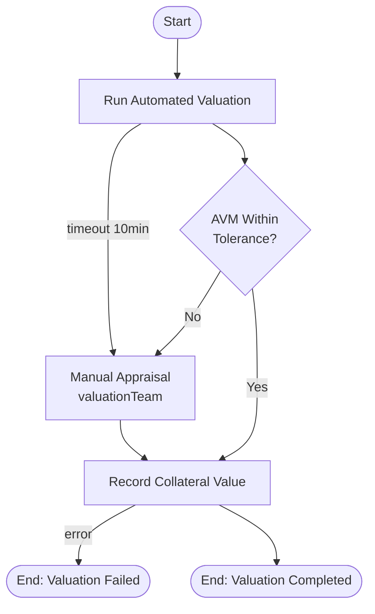
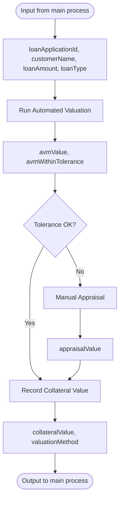

# Collateral Valuation Sub-Process

The collateral valuation process values the asset securing a loan. It runs an automated valuation model (AVM) first and falls back to a manual appraisal by the valuation team when the model is out of tolerance, times out, or the loan type requires a physical inspection. This sub-process demonstrates async execution, timer-boundary fallback, and error termination.

## Process Overview



## Key Features

- **Async Service Task** - Non-blocking AVM execution
- **Timer Boundary Event** - 10-minute timeout falls back to manual appraisal (not termination)
- **Human Fallback** - Out-of-tolerance valuations route to the valuation team
- **Error Termination** - A failed recording stops the whole loan (collateral value is mandatory)

---

## Step-by-Step Walkthrough

### Step 1: Start Event

**Element ID:** `collateralStartEvent`

```xml
<bpmn:startEvent id="collateralStartEvent" name="Valuation Started">
  <bpmn:outgoing>flowToRunAvm</bpmn:outgoing>
</bpmn:startEvent>
```

**Purpose:** Entry point when called from the main process.

**Called via:**
```xml
<!-- In loanApprovalProcess.bpmn -->
<bpmn:callActivity id="collateralCallActivity"
                   calledElement="collateralValuationProcess"/>
```

**Input Variables (from main process):**
- `loanApplicationId` - Application identifier
- `customerName` - Applicant name
- `loanAmount` - Requested amount
- `loanType` - PERSONAL, MORTGAGE, or BUSINESS

---

### Step 2: Run Automated Valuation (Async Service Task)

**Element ID:** `runAutomatedValuationTask`

```xml
<bpmn:serviceTask id="runAutomatedValuationTask"
                  name="Run Automated Valuation"
                  implementation="automatedValuationService"
                  activiti:async="true">
  <bpmn:incoming>flowToRunAvm</bpmn:incoming>
  <bpmn:outgoing>flowToAvmGateway</bpmn:outgoing>
</bpmn:serviceTask>

<!-- Timer boundary event (sibling, not child of the serviceTask) -->
<bpmn:boundaryEvent id="avmTimeoutEvent"
                    name="AVM Timeout"
                    attachedToRef="runAutomatedValuationTask"
                    cancelActivity="true">
  <bpmn:outgoing>flowToManualAppraisalFromTimeout</bpmn:outgoing>
  <bpmn:timerEventDefinition>
    <bpmn:timeDuration>PT10M</bpmn:timeDuration>
  </bpmn:timerEventDefinition>
</bpmn:boundaryEvent>
```

**Key Features:**

1. **Async Execution:** `activiti:async="true"`
   - The AVM call runs in the async executor
   - Doesn't block a database connection while the model crunches comparable sales
   - Makes the timer boundary meaningful (a synchronous task would finish before the timer could be observed)

2. **Timer Boundary:** 10-minute timeout
   - `PT10M` = 10 minutes (ISO 8601)
   - `cancelActivity="true"` - interrupts the AVM task and routes to **manual appraisal** — a slow AVM becomes a human job, not a failed loan

**Service Delegate:** `AutomatedValuationService`

**Implementation:**
```java
@Component("automatedValuationService")
public class AutomatedValuationService implements Connector {

    @Autowired
    private ServiceProperties serviceProperties;

    @Override
    public IntegrationContext apply(IntegrationContext integrationContext) {
        String loanApplicationId = (String) integrationContext.getInBoundVariables().get("loanApplicationId");
        BigDecimal loanAmount = toBigDecimal(integrationContext.getInBoundVariables().get("loanAmount"));
        String loanType = (String) integrationContext.getInBoundVariables().get("loanType");

        // Run the AVM (comp-sales based valuation)
        ValuationResult result = callAvm(loanApplicationId, loanAmount, loanType);

        double tolerance = serviceProperties.getValuation().getTolerance();
        boolean withinTolerance = result.getConfidence() >= (1 - tolerance);

        integrationContext.addOutBoundVariable("avmValue", result.getValue());
        integrationContext.addOutBoundVariable("avmWithinTolerance", withinTolerance);

        return integrationContext;
    }
}
```

**Configuration:**
```yaml
services:
  valuation:
    avm-url: https://avm.bank.example/api
    tolerance: 0.15
```

**Constants (from extension JSON):**
```json
"runAutomatedValuationTask": {
  "avmEndpoint": {"value": "https://avm.bank.example/api"},
  "tolerance": {"value": 0.15}
}
```

---

### Step 3: AVM Tolerance Gateway

**Element ID:** `avmGateway`

```xml
<bpmn:exclusiveGateway id="avmGateway" name="AVM Within Tolerance?">
  <bpmn:incoming>flowToAvmGateway</bpmn:incoming>
  <bpmn:outgoing>flowToManualAppraisal</bpmn:outgoing>
  <bpmn:outgoing>flowToRecordValuation</bpmn:outgoing>
</bpmn:exclusiveGateway>
```

**Conditions:**
```xml
<!-- Out of tolerance -> manual appraisal -->
<bpmn:sequenceFlow id="flowToManualAppraisal"
                   name="No"
                   sourceRef="avmGateway"
                   targetRef="manualAppraisalTask">
  <bpmn:conditionExpression>${avmWithinTolerance == false}</bpmn:conditionExpression>
</bpmn:sequenceFlow>

<!-- Within tolerance -> record directly -->
<bpmn:sequenceFlow id="flowToRecordValuation"
                   name="Yes"
                   sourceRef="avmGateway"
                   targetRef="recordValuationTask">
  <bpmn:conditionExpression>${avmWithinTolerance == true}</bpmn:conditionExpression>
</bpmn:sequenceFlow>
```

**Business Logic:**
- AVM confidence ≥ 85% (tolerance 0.15) → use the model value
- Otherwise → a licensed appraiser must inspect the asset

---

### Step 4: Manual Appraisal (User Task)

**Element ID:** `manualAppraisalTask`

```xml
<bpmn:userTask id="manualAppraisalTask"
               name="Manual Appraisal"
               activiti:candidateGroups="valuationTeam">
  <bpmn:incoming>flowToManualAppraisalFromTimeout</bpmn:incoming>
  <bpmn:incoming>flowToManualAppraisal</bpmn:incoming>
  <bpmn:outgoing>flowToRecordValuationFromManual</bpmn:outgoing>
  <bpmn:extensionElements>
    <activiti:formProperty id="appraisalValue" name="appraisalValue" type="bigdecimal"/>
  </bpmn:extensionElements>
</bpmn:userTask>
```

**Purpose:** A licensed appraiser from the valuation team inspects the asset and records its market value.

**Key Features:**
- **Candidate group:** `valuationTeam` - any appraiser in the team can claim it
- **Two incoming flows** - both the AVM timeout path and the out-of-tolerance path converge here
- **Form Property:** `appraisalValue` - the appraiser's figure (bigdecimal)

**Runtime Completion:**
```java
taskRuntime.complete(
    TaskPayloadBuilder.complete()
        .withTaskId(taskId)
        .withVariable("appraisalValue", new BigDecimal("245000.00"))
        .build()
);
```

**Why a user task here?**
- Low-confidence AVMs on secured lending are a regulatory red line — a human appraisal is required
- The task also catches AVM timeouts, so the valuation stage always has a deterministic outcome

---

### Step 5: Record Collateral Value (Service Task)

**Element ID:** `recordValuationTask`

```xml
<bpmn:serviceTask id="recordValuationTask"
                  name="Record Collateral Value"
                  implementation="valuationRecordingService">
  <bpmn:incoming>flowToRecordValuation</bpmn:incoming>
  <bpmn:incoming>flowToRecordValuationFromManual</bpmn:incoming>
  <bpmn:outgoing>flowToValuationCompleted</bpmn:outgoing>
</bpmn:serviceTask>

<bpmn:boundaryEvent id="valuationRecordingError"
                    name="Recording Failed"
                    attachedToRef="recordValuationTask">
  <bpmn:outgoing>flowToValuationFailed</bpmn:outgoing>
  <bpmn:errorEventDefinition errorRef="valuationRecordingErrorDef"/>
</bpmn:boundaryEvent>
```

**Error Definition:**
```xml
<bpmn:error id="valuationRecordingErrorDef" name="ValuationRecordingError" errorCode="VAL001"/>
```

**Service Delegate:** `ValuationRecordingService`

**Implementation:**
```java
@Component("valuationRecordingService")
public class ValuationRecordingService implements Connector {

    @Override
    public IntegrationContext apply(IntegrationContext integrationContext) {
        BigDecimal avmValue = toBigDecimal(integrationContext.getInBoundVariables().get("avmValue"));
        BigDecimal appraisalValue = toBigDecimal(integrationContext.getInBoundVariables().get("appraisalValue"));

        // Manual appraisal wins when present; otherwise the AVM value stands
        boolean manual = appraisalValue != null;
        BigDecimal collateralValue = manual ? appraisalValue : avmValue;

        recordCollateral(collateralValue, manual ? "MANUAL" : "AVM");

        integrationContext.addOutBoundVariable("collateralValue", collateralValue);
        integrationContext.addOutBoundVariable("valuationMethod", manual ? "MANUAL" : "AVM");

        return integrationContext;
    }
}
```

**Output Variables:**
- `collateralValue` - The recorded collateral value (BigDecimal)
- `valuationMethod` - `AVM` or `MANUAL`

**Why terminate on error?** A secured loan without a recorded collateral value cannot be disbursed — failing fast surfaces the integration problem to the loan team instead of letting a loan proceed on an unvalued asset.

---

### Step 6: End Event (Valuation Completed)

**Element ID:** `valuationCompletedEndEvent`

```xml
<bpmn:endEvent id="valuationCompletedEndEvent" name="Valuation Completed">
  <bpmn:incoming>flowToValuationCompleted</bpmn:incoming>
</bpmn:endEvent>
```

**Failure Path:**
```xml
<bpmn:endEvent id="valuationFailedEndEvent" name="Valuation Failed">
  <bpmn:incoming>flowToValuationFailed</bpmn:incoming>
  <bpmn:terminateEventDefinition/>
</bpmn:endEvent>
```

**Purpose:** Normal completion of the valuation process.

**Output Variables (returned to main process):**
- `collateralValue` - Valuated amount
- `valuationMethod` - AVM or MANUAL

---

## Process Statistics

| Metric | Value |
|--------|-------|
| **Total Elements** | 9 |
| **Start Events** | 1 |
| **End Events** | 2 (1 normal, 1 terminate) |
| **User Tasks** | 1 |
| **Service Tasks** | 2 (1 async) |
| **Exclusive Gateways** | 1 |
| **Boundary Events** | 2 (1 timer, 1 error) |

---

## Key Patterns Demonstrated

### 1. Timer Boundary as Fallback

```xml
<boundaryEvent id="avmTimeoutEvent" attachedToRef="runAutomatedValuationTask" cancelActivity="true">
  <timerEventDefinition>
    <timeDuration>PT10M</timeDuration>
  </timerEventDefinition>
</boundaryEvent>
```

**When to use:**
- When a slow external system should degrade to a manual path instead of failing
- Combined with an async service task, so the timer and the work actually race

**ISO 8601 Duration Formats:**
- `PT30S` - 30 seconds
- `PT10M` - 10 minutes
- `PT1H` - 1 hour
- `P1D` - 1 day

### 2. Converging Human Fallback

The manual appraisal task receives **two** incoming flows (timeout + out-of-tolerance), and both AVM and manual results converge on the recording task. The recording delegate decides which value stands — a clean "last authoritative source wins" rule.

### 3. Terminate on Critical Failure

```xml
<endEvent id="valuationFailedEndEvent">
  <terminateEventDefinition/>
</endEvent>
```

**Effect:** Immediately ends the entire loan process instance, not just this sub-process.

---

## Variable Flow



---

## Error Scenarios

| Scenario | Trigger | Outcome |
|----------|---------|---------|
| AVM slow | 10-minute boundary | Manual appraisal |
| AVM low confidence | Tolerance check | Manual appraisal |
| Recording failure | API error | Terminate |
| Appraisal value missing | Analyst error | Recording uses AVM value |

---

## Configuration

### Service Properties

```yaml
services:
  valuation:
    avm-url: https://avm.bank.example/api
    tolerance: 0.15
```

### Extension JSON Constants

```json
"runAutomatedValuationTask": {
  "avmEndpoint": {"value": "https://avm.bank.example/api"},
  "tolerance": {"value": 0.15}
}
```

---

## Best Practices Illustrated

1. **Automate First, Humanize Second** - AVM handles the common case; humans handle the exceptions
2. **Timeouts Degrade Gracefully** - A slow model becomes a human job, not a dead loan
3. **Single Recording Point** - Both valuation paths converge on one auditable write
4. **Fail Fast on Critical Data** - No collateral value, no loan

---

## Next Steps

- [Loan Disbursement Sub-Process](disbursement-process.md) - Disbursement with error fallback and inclusive gateway
- [Batch Interest Posting Process](batch-processing-process.md) - The unattended nightly batch
- [Service Delegates](service-delegates.md) - Java implementations

---

**Related Documentation:**
- [Boundary Events](../../bpmn/events/boundary-event.md)
- [Async Configuration](../../bpmn/reference/async-execution.md)
- [User Tasks](../../bpmn/elements/user-task.md)
