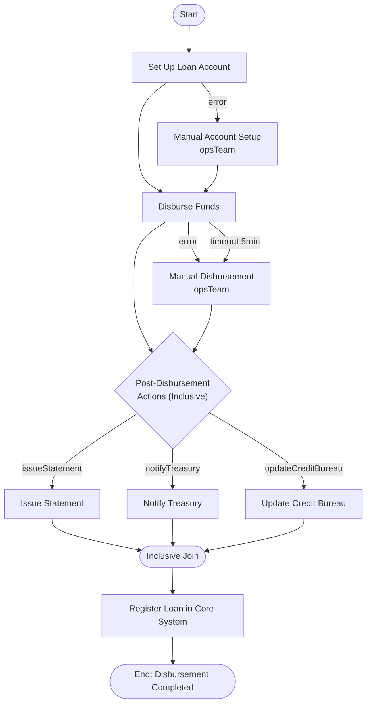
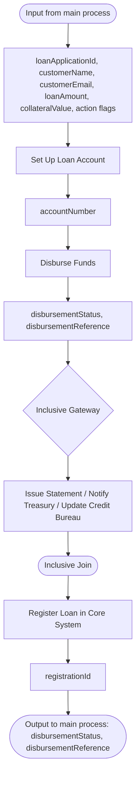

# Loan Disbursement Sub-Process

The disbursement process moves the money: it sets up the loan account in the core banking system, disburses the funds, and runs the conditional post-disbursement actions (statement, treasury notice, credit bureau update) behind an inclusive gateway. This sub-process demonstrates **error boundaries that fall back to a human** instead of terminating, dual boundary events, and inclusive gateway routing.

## Process Overview



## Key Features

- **Error Boundary with Manual Fallback** - Core banking and wire failures route to the operations team
- **Dual Boundaries** - The disbursement task has *both* an error boundary and a timer boundary
- **Inclusive Gateway** - Post-disbursement actions run conditionally, in parallel
- **Reusable Executor** - The sub-process decides nothing about *what* to do post-disbursement; the flags come in from the caller

---

## Step-by-Step Walkthrough

### Step 1: Start Event

**Element ID:** `disbursementStartEvent`

```xml
<bpmn:startEvent id="disbursementStartEvent" name="Disbursement Started">
  <bpmn:outgoing>flowToSetupAccount</bpmn:outgoing>
</bpmn:startEvent>
```

**Purpose:** Entry point when called from the main process.

**Called via:**
```xml
<!-- In loanApprovalProcess.bpmn -->
<bpmn:callActivity id="disbursementCallActivity"
                   calledElement="loanDisbursementProcess"/>
```

**Input Variables (from main process):**
- `loanApplicationId` - Application identifier
- `customerName` - Applicant name
- `customerEmail` - Contact email
- `loanAmount` - Disbursement amount
- `collateralValue` - Valuated collateral (for the core system record)
- `issueStatement`, `notifyTreasury`, `updateCreditBureau` - Post-disbursement action flags (literal values mapped at the call site)

---

### Step 2: Set Up Loan Account (Service Task)

**Element ID:** `setupLoanAccountTask`

```xml
<bpmn:serviceTask id="setupLoanAccountTask"
                  name="Set Up Loan Account"
                  implementation="accountSetupService">
  <bpmn:incoming>flowToSetupAccount</bpmn:incoming>
  <bpmn:outgoing>flowToDisburseFunds</bpmn:outgoing>
</bpmn:serviceTask>

<bpmn:boundaryEvent id="accountSetupError"
                    name="Account Setup Failed"
                    attachedToRef="setupLoanAccountTask">
  <bpmn:outgoing>flowToManualAccountSetup</bpmn:outgoing>
  <bpmn:errorEventDefinition errorRef="accountSetupErrorDef"/>
</bpmn:boundaryEvent>
```

**Error Definition:**
```xml
<bpmn:error id="accountSetupErrorDef" name="AccountSetupError" errorCode="CORE001"/>
```

**Service Delegate:** `AccountSetupService`

**Purpose:** Creates the loan account (and the associated deposit leg) in the core banking system.

**Manual Fallback:**
```xml
<bpmn:userTask id="manualAccountSetupTask"
               name="Manual Account Setup"
               activiti:candidateGroups="opsTeam">
  <bpmn:incoming>flowToManualAccountSetup</bpmn:incoming>
  <bpmn:outgoing>flowToDisburseFromManualSetup</bpmn:outgoing>
  <bpmn:extensionElements>
    <activiti:formProperty id="accountNumber" name="accountNumber" type="string"/>
  </bpmn:extensionElements>
</bpmn:userTask>
```

**Why manual fallback (vs. terminate)?**
- A failed core-banking API call is a *business incident* — the operations team creates the account through the back office and completes the task with the `accountNumber`
- The process (and all its context — amounts, references, approval trail) is preserved
- Error boundary events are always **interrupting** in Activiti: the failed service task is cancelled and the error flow is taken; `cancelActivity` has no effect on error events

**Output Variables:**
- `accountNumber` - The created (or manually entered) loan account number

---

### Step 3: Disburse Funds (Async Service Task)

**Element ID:** `disburseFundsTask`

```xml
<bpmn:serviceTask id="disburseFundsTask"
                  name="Disburse Funds"
                  implementation="fundDisbursementService"
                  activiti:async="true">
  <bpmn:incoming>flowToDisburseFunds</bpmn:incoming>
  <bpmn:incoming>flowToDisburseFromManualSetup</bpmn:incoming>
  <bpmn:outgoing>flowToPostDisbursementGateway</bpmn:outgoing>
</bpmn:serviceTask>

<!-- Error boundary (sibling, not child of the serviceTask) -->
<bpmn:boundaryEvent id="disbursementError"
                    name="Disbursement Failed"
                    attachedToRef="disburseFundsTask">
  <bpmn:outgoing>flowToManualDisbursement</bpmn:outgoing>
  <bpmn:errorEventDefinition errorRef="disbursementErrorDef"/>
</bpmn:boundaryEvent>

<!-- Timer boundary (sibling, not child of the serviceTask) -->
<bpmn:boundaryEvent id="disbursementTimeoutEvent"
                    name="Disbursement Timeout"
                    attachedToRef="disburseFundsTask"
                    cancelActivity="true">
  <bpmn:outgoing>flowToManualDisbursementFromTimeout</bpmn:outgoing>
  <bpmn:timerEventDefinition>
    <bpmn:timeDuration>PT5M</bpmn:timeDuration>
  </bpmn:timerEventDefinition>
</bpmn:boundaryEvent>
```

**Error Definition:**
```xml
<bpmn:error id="disbursementErrorDef" name="DisbursementError" errorCode="PAY001"/>
```

**Key Features:**

1. **Dual boundary events** - The task can fail in two distinct ways:
   - *The wire was rejected* (error) → the operations team investigates and re-sends
   - *The wire hung* (5-minute timeout) → the operations team checks the SWIFT status and confirms or re-sends
   - Both boundaries are interrupting, and both converge on the **same** manual task, which therefore declares two incoming flows

2. **Async execution** - `activiti:async="true"` so the wire call runs in the async executor; combined with the timer boundary this is what makes the timeout observable

**Service Delegate:** `FundDisbursementService`

**Implementation:**
```java
@Component("fundDisbursementService")
public class FundDisbursementService implements Connector {

    @Autowired
    private ServiceProperties serviceProperties;

    @Override
    public IntegrationContext apply(IntegrationContext integrationContext) {
        String loanApplicationId = (String) integrationContext.getInBoundVariables().get("loanApplicationId");
        String accountNumber = (String) integrationContext.getInBoundVariables().get("accountNumber");
        BigDecimal loanAmount = toBigDecimal(integrationContext.getInBoundVariables().get("loanAmount"));

        try {
            WireResult wire = callTreasury(loanApplicationId, accountNumber, loanAmount);
            integrationContext.addOutBoundVariable("disbursementStatus", "DISBURSED");
            integrationContext.addOutBoundVariable("disbursementReference", wire.getReference());
        } catch (WireException e) {
            // Surface as a BPMN error so the boundary event takes over
            throw new BpmnError("PAY001", "Wire transfer rejected: " + e.getMessage());
        }

        return integrationContext;
    }
}
```

**Configuration:**
```yaml
services:
  treasury:
    wire-endpoint: https://treasury.bank.example/wires
```

**Manual Fallback:**
```xml
<bpmn:userTask id="manualDisbursementTask"
               name="Manual Disbursement"
               activiti:candidateGroups="opsTeam">
  <bpmn:incoming>flowToManualDisbursement</bpmn:incoming>
  <bpmn:incoming>flowToManualDisbursementFromTimeout</bpmn:incoming>
  <bpmn:outgoing>flowToPostDisbursementFromManual</bpmn:outgoing>
  <bpmn:extensionElements>
    <activiti:formProperty id="disbursementReference" name="disbursementReference" type="string"/>
  </bpmn:extensionElements>
</bpmn:userTask>
```

**Runtime Completion:**
```java
taskRuntime.complete(
    TaskPayloadBuilder.complete()
        .withTaskId(taskId)
        .withVariable("disbursementStatus", "MANUAL_DISBURSED")
        .withVariable("disbursementReference", "SWIFT-998877")
        .build()
);
```

---

### Step 4: Post-Disbursement Actions (Inclusive Gateway)

**Element ID:** `postDisbursementGateway`

```xml
<bpmn:inclusiveGateway id="postDisbursementGateway" name="Post-Disbursement Actions">
  <bpmn:incoming>flowToPostDisbursementGateway</bpmn:incoming>
  <bpmn:incoming>flowToPostDisbursementFromManual</bpmn:incoming>
  <bpmn:outgoing>flowToIssueStatement</bpmn:outgoing>
  <bpmn:outgoing>flowToNotifyTreasury</bpmn:outgoing>
  <bpmn:outgoing>flowToUpdateCreditBureau</bpmn:outgoing>
</bpmn:inclusiveGateway>
```

**Purpose:** Runs **every** post-disbursement action whose condition is true — not just one, not all of them unconditionally.

**Sequence Flow Conditions:**
```xml
<bpmn:sequenceFlow id="flowToIssueStatement" name="Statement"
                   sourceRef="postDisbursementGateway" targetRef="issueStatementTask">
  <bpmn:conditionExpression>${issueStatement == true}</bpmn:conditionExpression>
</bpmn:sequenceFlow>

<bpmn:sequenceFlow id="flowToNotifyTreasury" name="Treasury"
                   sourceRef="postDisbursementGateway" targetRef="notifyTreasuryTask">
  <bpmn:conditionExpression>${notifyTreasury == true}</bpmn:conditionExpression>
</bpmn:sequenceFlow>

<bpmn:sequenceFlow id="flowToUpdateCreditBureau" name="Credit Bureau"
                   sourceRef="postDisbursementGateway" targetRef="updateCreditBureauTask">
  <bpmn:conditionExpression>${updateCreditBureau == true}</bpmn:conditionExpression>
</bpmn:sequenceFlow>
```

**The three action tasks:**
```xml
<bpmn:serviceTask id="issueStatementTask"
                  name="Issue Statement"
                  implementation="statementService">
  <bpmn:incoming>flowToIssueStatement</bpmn:incoming>
  <bpmn:outgoing>flowToPostDisbursementJoinFromStatement</bpmn:outgoing>
</bpmn:serviceTask>

<bpmn:serviceTask id="notifyTreasuryTask"
                  name="Notify Treasury"
                  implementation="treasuryNotificationService">
  <bpmn:incoming>flowToNotifyTreasury</bpmn:incoming>
  <bpmn:outgoing>flowToPostDisbursementJoinFromTreasury</bpmn:outgoing>
</bpmn:serviceTask>

<bpmn:serviceTask id="updateCreditBureauTask"
                  name="Update Credit Bureau"
                  implementation="creditBureauUpdateService">
  <bpmn:incoming>flowToUpdateCreditBureau</bpmn:incoming>
  <bpmn:outgoing>flowToPostDisbursementJoinFromCreditBureau</bpmn:outgoing>
</bpmn:serviceTask>
```

**Why inclusive (vs. exclusive/parallel)?**

| Gateway | Semantics | Fit here? |
|---------|-----------|-----------|
| Exclusive | Exactly one branch | No - a loan usually needs *several* of these actions |
| Parallel | All branches, no conditions | No - a small personal loan may skip the credit bureau |
| **Inclusive** | All true branches, in parallel | Yes - each flag independently toggles one action |

**Flags come from the caller.** The main process maps them as literal inputs on the call activity (`"type": "value"`), so this sub-process stays a dumb, reusable executor. If no flag is true at runtime, an inclusive gateway would take no outgoing flow — the caller therefore guarantees at least one flag is set.

---

### Step 5: Inclusive Join

**Element ID:** `postDisbursementJoinGateway`

```xml
<bpmn:inclusiveGateway id="postDisbursementJoinGateway" name="">
  <bpmn:incoming>flowToPostDisbursementJoinFromStatement</bpmn:incoming>
  <bpmn:incoming>flowToPostDisbursementJoinFromTreasury</bpmn:incoming>
  <bpmn:incoming>flowToPostDisbursementJoinFromCreditBureau</bpmn:incoming>
  <bpmn:outgoing>flowToRegisterLoan</bpmn:outgoing>
</bpmn:inclusiveGateway>
```

**Purpose:** Waits for all *taken* branches to complete before continuing.

**Note:** Only the branches actually activated in Step 4 contribute tokens to this join — skipped branches don't delay it.

---

### Step 6: Register Loan in Core System (Service Task)

**Element ID:** `loanRegisteredTask`

```xml
<bpmn:serviceTask id="loanRegisteredTask"
                  name="Register Loan in Core System"
                  implementation="coreSystemRegistrationService">
  <bpmn:incoming>flowToRegisterLoan</bpmn:incoming>
  <bpmn:outgoing>flowToDisbursementCompleted</bpmn:outgoing>
</bpmn:serviceTask>
```

**Service Delegate:** `CoreSystemRegistrationService`

**Purpose:** Writes the funded loan record (account, amount, collateral value, disbursement reference) to the core system so general ledger and reporting see it.

**Output Variables:**
- `registrationId` - Core system loan record ID

---

### Step 7: End Event (Disbursement Completed)

**Element ID:** `disbursementCompletedEndEvent`

```xml
<bpmn:endEvent id="disbursementCompletedEndEvent" name="Disbursement Completed">
  <bpmn:incoming>flowToDisbursementCompleted</bpmn:incoming>
</bpmn:endEvent>
```

**Purpose:** Normal completion of the disbursement process.

**Output Variables (returned to main process):**
- `disbursementStatus` - `DISBURSED` or `MANUAL_DISBURSED`
- `disbursementReference` - Wire reference

---

## Process Statistics

| Metric | Value |
|--------|-------|
| **Total Elements** | 15 |
| **Start Events** | 1 |
| **End Events** | 1 |
| **User Tasks** | 2 |
| **Service Tasks** | 6 (1 async) |
| **Inclusive Gateways** | 2 |
| **Boundary Events** | 3 (2 error, 1 timer) |

---

## Key Patterns Demonstrated

### 1. Error Boundary with Manual Fallback

```xml
<boundaryEvent id="disbursementError" attachedToRef="disburseFundsTask">
  <errorEventDefinition errorRef="disbursementErrorDef"/>
</boundaryEvent>
```

**When to use:**
- The failure is a *recoverable business incident* (failed wire, rejected transfer)
- A team exists to handle the exception manually
- The process context must survive the failure

**Contrast with the Order Management example**, where a payment failure loops to automated retries — money movement failures here are rare enough and important enough that a human takes over immediately.

### 2. Dual Boundary Events on One Task

The disbursement task carries **both** an error boundary (wire rejected) and a timer boundary (wire hung). Both are interrupting and both feed the same manual task. Model this whenever a task has two distinct failure modes with the same recovery.

### 3. Inclusive Gateway for Conditional Fan-Out

```xml
<inclusiveGateway id="postDisbursementGateway"/>
```

**When to use:**
- Multiple independent follow-up actions, each toggled by its own condition
- The number of active actions is data-driven (here, flags mapped at the call site)

### 4. Literal Inputs at the Call Site

The `issueStatement` / `notifyTreasury` / `updateCreditBureau` flags are mapped with `"type": "value"` on the call activity — the *caller* decides the post-disbursement behaviour, keeping this sub-process reusable by refinance, top-up, and drawdown flows.

---

## Variable Flow



---

## Error Scenarios

| Scenario | Trigger | Outcome |
|----------|---------|---------|
| Core banking API down | Error boundary | Manual account setup (ops team) |
| Wire rejected | Error boundary | Manual disbursement (ops team) |
| Wire hung | 5-minute boundary | Manual disbursement (ops team) |
| Action flag false at join | Inclusive semantics | Branch skipped, no delay |

---

## Configuration

### Service Properties

```yaml
services:
  treasury:
    wire-endpoint: https://treasury.bank.example/wires
  core-banking:
    api-url: https://core.bank.example/api
```

### Extension JSON Constants

```json
"disburseFundsTask": {
  "wireEndpoint": {"value": "https://treasury.bank.example/wires"},
  "currency": {"value": "USD"}
}
```

---

## Best Practices Illustrated

1. **Fail to a Human, Not to a Dead End** - Money movement errors preserve process context
2. **One Manual Task, Two Triggers** - Converge error and timeout paths onto a single recovery task
3. **Caller Decides, Executor Runs** - Literal inputs keep sub-processes reusable
4. **Inclusive Over Parallel** - Conditional fan-out without forcing all branches

---

## Next Steps

- [Batch Interest Posting Process](batch-processing-process.md) - The unattended nightly batch
- [Service Delegates](service-delegates.md) - Complete Java implementations
- [Process Extensions](process-extensions.md) - Variable mappings and constants

---

**Related Documentation:**
- [Inclusive Gateways](../../bpmn/gateways/inclusive-gateway.md)
- [Boundary Events](../../bpmn/events/boundary-event.md)
- [Error Handling](../../bpmn/reference/error-handling.md)
- [Async Configuration](../../bpmn/reference/async-execution.md)
