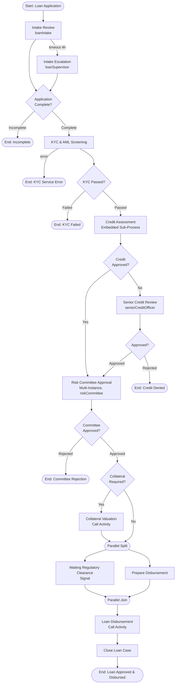

# Bank Loan Workflow - Loan Approval Process

The main process orchestrates the complete loan lifecycle, coordinating work across eight bank teams: intake review and escalation, KYC/AML screening, credit assessment (embedded sub-process), senior review, risk committee approval, collateral valuation, regulatory clearance, and disbursement.

## Process Diagram



## Step-by-Step Walkthrough

### Step 1: Message Start Event

**Element ID:** `startEvent`

```xml
<bpmn:startEvent id="startEvent" name="Loan Application Received">
  <bpmn:outgoing>flowToIntakeReview</bpmn:outgoing>
  <bpmn:messageEventDefinition messageRef="loanApplicationMessage"/>
</bpmn:startEvent>
```

**Purpose:** Initiates the process when a new loan application message arrives.

**Why a message event?**
- Decouples process start from specific triggers
- Can be activated by the core banking front end, a message queue, or a batch import
- Enables event-driven intake from multiple channels

**Message Definition:**
```xml
<bpmn:message id="loanApplicationMessage" name="loanApplicationReceived"/>
```

**Runtime Trigger:**
```java
processRuntime.start(MessagePayloadBuilder.start("loanApplicationReceived")
    .withVariable("loanApplicationId", "LN-001")
    .withVariable("customerName", "Jane Smith")
    // ... more variables
    .build());
```

---

### Step 2: Intake Review User Task

**Element ID:** `intakeReviewTask`

```xml
<bpmn:userTask id="intakeReviewTask"
               name="Intake Review"
               activiti:candidateGroups="loanIntake">
  <bpmn:incoming>flowToIntakeReview</bpmn:incoming>
  <bpmn:outgoing>flowToIntakeGateway</bpmn:outgoing>
  <bpmn:extensionElements>
    <activiti:formProperty id="intakeNotes" name="intakeNotes" type="string"/>
  </bpmn:extensionElements>
</bpmn:userTask>
```

**Purpose:** The intake team verifies the application package is complete (income documents, ID, purpose) before it enters credit processing.

**Key Features:**
- **Candidate group:** `loanIntake` - any intake team member can claim this task (resolved against `GROUP_loanIntake` authorities in Spring Security)
- **Form Property:** `intakeNotes` - free-text verification notes (defined via `activiti:formProperty` in extensionElements)
- **Boundary Event:** 4-hour timeout with supervisor escalation

**Boundary Timer Event:**
```xml
<bpmn:boundaryEvent id="intakeTimeoutEvent"
                    name="Intake Timeout"
                    attachedToRef="intakeReviewTask"
                    cancelActivity="true">
  <bpmn:outgoing>flowToIntakeEscalation</bpmn:outgoing>
  <bpmn:timerEventDefinition>
    <bpmn:timeDuration>PT4H</bpmn:timeDuration>
  </bpmn:timerEventDefinition>
</bpmn:boundaryEvent>
```

**Timeout Handling - Escalation, Not Termination:**

```xml
<bpmn:userTask id="intakeEscalationTask"
               name="Intake Escalation"
               activiti:candidateGroups="loanSupervisor">
  <bpmn:incoming>flowToIntakeEscalation</bpmn:incoming>
  <bpmn:outgoing>flowToIntakeGatewayFromEscalation</bpmn:outgoing>
</bpmn:userTask>
```

Unlike the Order Management example (where a timeout ends the process), a bank loan application that sits untouched for 4 hours is *escalated*, not abandoned:

- `cancelActivity="true"` - interrupts the intake task and follows the timeout path
- `PT4H` = 4 hours in ISO 8601 duration format
- The supervisor's decision re-enters the **same gateway** as the normal path, so the loan continues with full context

**Input Variables:**
- `loanApplicationId` - Application identifier
- `customerName` - Applicant full name
- `loanAmount` - Requested amount
- `loanType` - PERSONAL, MORTGAGE, or BUSINESS

**Output Variables:**
- `applicationComplete` - Boolean verification result
- `intakeNotes` - Verification notes

---

### Step 3: Intake Gateway

**Element ID:** `intakeGateway`

```xml
<bpmn:exclusiveGateway id="intakeGateway" name="Application Complete?">
  <bpmn:incoming>flowToIntakeGateway</bpmn:incoming>
  <bpmn:incoming>flowToIntakeGatewayFromEscalation</bpmn:incoming>
  <bpmn:outgoing>flowToKycScreening</bpmn:outgoing>
  <bpmn:outgoing>flowToApplicationIncomplete</bpmn:outgoing>
</bpmn:exclusiveGateway>
```

**Purpose:** Routes flow based on application completeness. Note the **two incoming flows** - the normal intake path and the supervisor escalation path converge here.

**Sequence Flow Conditions:**

```xml
<!-- Complete path -->
<bpmn:sequenceFlow id="flowToKycScreening"
                   name="Complete"
                   sourceRef="intakeGateway"
                   targetRef="kycScreeningTask">
  <bpmn:conditionExpression>${applicationComplete == true}</bpmn:conditionExpression>
</bpmn:sequenceFlow>

<!-- Incomplete path -->
<bpmn:sequenceFlow id="flowToApplicationIncomplete"
                   name="Incomplete"
                   sourceRef="intakeGateway"
                   targetRef="applicationIncompleteEndEvent">
  <bpmn:conditionExpression>${applicationComplete == false}</bpmn:conditionExpression>
</bpmn:sequenceFlow>
```

**Error Path:**
```xml
<bpmn:endEvent id="applicationIncompleteEndEvent" name="Application Incomplete">
  <bpmn:terminateEventDefinition/>
</bpmn:endEvent>
```

**Terminate Event:** Ends the entire process instance immediately. The applicant is notified (by the REST layer) to resubmit a complete package, which starts a *new* process instance.

---

### Step 4: KYC & AML Screening Service Task

**Element ID:** `kycScreeningTask`

```xml
<bpmn:serviceTask id="kycScreeningTask"
                  name="KYC &amp; AML Screening"
                  implementation="kycScreeningService"
                  activiti:async="true">
  <bpmn:incoming>flowToKycScreening</bpmn:incoming>
  <bpmn:outgoing>flowToKycGateway</bpmn:outgoing>
</bpmn:serviceTask>
```

**Purpose:** Automated Know-Your-Customer and Anti-Money-Laundering screening against sanctions and watch lists.

**Implementation Reference:**
- `implementation="kycScreeningService"` - refers to `@Component("kycScreeningService")`
- `activiti:async="true"` - the screening call runs as an async job, so the transaction that reached this node releases its database connection while the external call is in flight

**Service Delegate:**
```java
@Component("kycScreeningService")
public class KycScreeningService implements Connector {

    @Autowired
    private ServiceProperties serviceProperties;

    @Override
    public IntegrationContext apply(IntegrationContext integrationContext) {
        String customerName = (String) integrationContext.getInBoundVariables().get("customerName");
        String loanType = (String) integrationContext.getInBoundVariables().get("loanType");

        // Call the screening engine (sanctions, PEP, watch lists)
        ScreeningResult result = callScreeningEngine(customerName, loanType);

        integrationContext.addOutBoundVariable("kycPassed", result.isPassed());
        integrationContext.addOutBoundVariable("kycReference", result.getReference());

        return integrationContext;
    }
}
```

**Boundary Error Event:**
```xml
<bpmn:boundaryEvent id="kycScreeningError"
                    name="KYC Engine Unavailable"
                    attachedToRef="kycScreeningTask">
  <bpmn:outgoing>flowToKycErrorHandler</bpmn:outgoing>
  <bpmn:errorEventDefinition errorRef="kycScreeningErrorDef"/>
</bpmn:boundaryEvent>
```

**Error Definition:**
```xml
<bpmn:error id="kycScreeningErrorDef" name="KycScreeningError" errorCode="KYC001"/>
```

**Why error boundary?**
- Handles screening-engine failures gracefully
- Error boundary events are always **interrupting** in Activiti: when the error is thrown, the attached service task is cancelled and the error flow (`flowToKycErrorHandler`) is taken. The `cancelActivity` attribute has no effect on error events
- The delegate throws `BpmnError` with the error code when the engine is unreachable or returns an ambiguous (non-decisive) result

---

### Step 5: KYC Gateway

**Element ID:** `kycGateway`

```xml
<bpmn:exclusiveGateway id="kycGateway" name="KYC Passed?">
  <bpmn:incoming>flowToKycGateway</bpmn:incoming>
  <bpmn:outgoing>flowToCreditAssessment</bpmn:outgoing>
  <bpmn:outgoing>flowToKycFail</bpmn:outgoing>
</bpmn:exclusiveGateway>
```

**Conditions:**
```xml
<!-- Passed path -->
<bpmn:sequenceFlow id="flowToCreditAssessment"
                   name="Passed"
                   sourceRef="kycGateway"
                   targetRef="creditAssessmentSubProcess">
  <bpmn:conditionExpression>${kycPassed == true}</bpmn:conditionExpression>
</bpmn:sequenceFlow>

<!-- Failed path -->
<bpmn:sequenceFlow id="flowToKycFail"
                   name="Failed"
                   sourceRef="kycGateway"
                   targetRef="kycFailEndEvent">
  <bpmn:conditionExpression>${kycPassed == false}</bpmn:conditionExpression>
</bpmn:sequenceFlow>
```

**Why terminate on KYC failure?** A failed screening is a compliance stop. The application cannot proceed to credit processing — a new instance would be required after a compliance resolution outside the workflow.

---

### Step 6: Credit Assessment (Embedded Sub-Process)

**Element ID:** `creditAssessmentSubProcess`

```xml
<bpmn:subProcess id="creditAssessmentSubProcess" name="Credit Assessment">
  <bpmn:incoming>flowToCreditAssessment</bpmn:incoming>
  <bpmn:outgoing>flowToCreditGateway</bpmn:outgoing>

  <bpmn:startEvent id="creditAssessmentStartEvent" name="Assessment Started">
    <bpmn:outgoing>flowToPullCreditReport</bpmn:outgoing>
  </bpmn:startEvent>

  <bpmn:serviceTask id="pullCreditReportTask"
                    name="Pull Credit Report"
                    implementation="creditReportService"
                    activiti:async="true">
    <bpmn:incoming>flowToPullCreditReport</bpmn:incoming>
    <bpmn:outgoing>flowToCreditAnalysis</bpmn:outgoing>
  </bpmn:serviceTask>

  <bpmn:userTask id="creditAnalysisTask"
                 name="Credit Analysis"
                 activiti:candidateGroups="creditAnalysis"
                 activiti:dueDate="${creditAnalysisDueDate}">
    <bpmn:incoming>flowToCreditAnalysis</bpmn:incoming>
    <bpmn:outgoing>flowToCreditScoring</bpmn:outgoing>
    <bpmn:extensionElements>
      <activiti:formProperty id="riskNotes" name="riskNotes" type="string"/>
    </bpmn:extensionElements>
  </bpmn:userTask>

  <!-- Non-cancelling boundary event (sibling, not child of the userTask) -->
  <bpmn:boundaryEvent id="complianceFlagEvent"
                      name="Compliance Flag"
                      attachedToRef="creditAnalysisTask"
                      cancelActivity="false">
    <bpmn:outgoing>flowToComplianceReview</bpmn:outgoing>
    <bpmn:messageEventDefinition messageRef="complianceFlagMessage"/>
  </bpmn:boundaryEvent>

  <bpmn:userTask id="complianceReviewTask"
                 name="Compliance Review"
                 activiti:candidateGroups="complianceTeam">
    <bpmn:incoming>flowToComplianceReview</bpmn:incoming>
    <bpmn:outgoing>flowToComplianceHandledEnd</bpmn:outgoing>
  </bpmn:userTask>

  <bpmn:serviceTask id="creditScoringTask"
                    name="Compute Credit Score"
                    implementation="creditScoringService">
    <bpmn:incoming>flowToCreditScoring</bpmn:incoming>
    <bpmn:outgoing>flowToCreditAssessmentEnd</bpmn:outgoing>
  </bpmn:serviceTask>

  <bpmn:endEvent id="creditAssessmentEndEvent" name="Assessment Completed">
    <bpmn:incoming>flowToCreditAssessmentEnd</bpmn:incoming>
  </bpmn:endEvent>

  <bpmn:endEvent id="complianceHandledEndEvent" name="Compliance Review Completed">
    <bpmn:incoming>flowToComplianceHandledEnd</bpmn:incoming>
  </bpmn:endEvent>
</bpmn:subProcess>
```

**Purpose:** A self-contained credit assessment flow: pull the report, have a credit analyst assess it, then compute the score.

**Key Features:**

1. **Embedded sub-process** - The flow lives *inside* `loanApprovalProcess`. It has its own start and end events, but shares the parent's process variables. This is the difference from a call activity, which starts a *separate* process instance.

2. **Dynamic due date** - `activiti:dueDate="${creditAnalysisDueDate}"` evaluates the variable at task-creation time, so SLAs can be set per application type.

3. **Non-cancelling message boundary** - A compliance officer can raise a flag on the *running* credit analysis:
   - `cancelActivity="false"` - the flag spawns a **parallel** path; `creditAnalysisTask` keeps running
   - The flag routes to `complianceReviewTask` (the `complianceTeam`), which ends at `complianceHandledEndEvent` *without re-entering the credit path* - the gateway only ever sees the credit task's own token
   - **Scoping rule:** a boundary event's handler must live in the *same scope* as the attached activity, which is why the compliance review and its end event are inside the sub-process

**Sub-Process Output Variables** (shared with the parent, no mapping needed):
- `creditReport` - Raw report payload (JSON)
- `creditScore` - Computed score
- `riskRating` - LOW / MEDIUM / HIGH
- `creditApproved` - Automated decision (score ≥ 650 and rating ≠ HIGH)
- `riskNotes` - Analyst notes

**Message Definition:**
```xml
<bpmn:message id="complianceFlagMessage" name="complianceFlagRaised"/>
```

---

### Step 7: Credit Gateway

**Element ID:** `creditGateway`

```xml
<bpmn:exclusiveGateway id="creditGateway" name="Credit Approved?">
  <bpmn:incoming>flowToCreditGateway</bpmn:incoming>
  <bpmn:outgoing>flowToRiskApproval</bpmn:outgoing>
  <bpmn:outgoing>flowToSeniorReview</bpmn:outgoing>
</bpmn:exclusiveGateway>
```

**Conditions:**
```xml
<!-- Auto-approved path -->
<bpmn:sequenceFlow id="flowToRiskApproval"
                   name="Approved"
                   sourceRef="creditGateway"
                   targetRef="riskApprovalTask">
  <bpmn:conditionExpression>${creditApproved == true}</bpmn:conditionExpression>
</bpmn:sequenceFlow>

<!-- Senior review path -->
<bpmn:sequenceFlow id="flowToSeniorReview"
                   name="Not Approved"
                   sourceRef="creditGateway"
                   targetRef="seniorReviewTask">
  <bpmn:conditionExpression>${creditApproved == false}</bpmn:conditionExpression>
</bpmn:sequenceFlow>
```

**Business Logic:**
- Score ≥ 650 with a LOW or MEDIUM risk rating → straight to the committee
- Otherwise → senior credit officer review first (see Step 8)

---

### Step 8: Senior Credit Review (Fallback Path)

**Element ID:** `seniorReviewTask`

```xml
<bpmn:userTask id="seniorReviewTask"
               name="Senior Credit Review"
               activiti:candidateGroups="seniorCreditOfficer">
  <bpmn:incoming>flowToSeniorReview</bpmn:incoming>
  <bpmn:outgoing>flowToSeniorReviewGateway</bpmn:outgoing>
  <bpmn:extensionElements>
    <activiti:formProperty id="seniorReviewApproved" name="seniorReviewApproved" type="boolean"/>
  </bpmn:extensionElements>
</bpmn:userTask>
```

**Purpose:** Human review for borderline credit cases - the senior officer can override the automated decision in either direction.

**Senior Review Gateway:**
```xml
<bpmn:exclusiveGateway id="seniorReviewGateway" name="Senior Approved?">
  <bpmn:incoming>flowToSeniorReviewGateway</bpmn:incoming>
  <bpmn:outgoing>flowToRiskApprovalFromSenior</bpmn:outgoing>
  <bpmn:outgoing>flowToCreditDenial</bpmn:outgoing>
</bpmn:exclusiveGateway>
```

**Conditions:**
```xml
<bpmn:sequenceFlow id="flowToRiskApprovalFromSenior" name="Approved"
                   sourceRef="seniorReviewGateway" targetRef="riskApprovalTask">
  <bpmn:conditionExpression>${seniorReviewApproved == true}</bpmn:conditionExpression>
</bpmn:sequenceFlow>

<bpmn:sequenceFlow id="flowToCreditDenial" name="Rejected"
                   sourceRef="seniorReviewGateway" targetRef="creditDenialEndEvent">
  <bpmn:conditionExpression>${seniorReviewApproved == false}</bpmn:conditionExpression>
</bpmn:sequenceFlow>
```

**Denial Path:**
```xml
<bpmn:endEvent id="creditDenialEndEvent" name="Credit Denied">
  <bpmn:terminateEventDefinition/>
</bpmn:endEvent>
```

**Why manual review?**
- Not all credit decisions can be automated - borderline cases need judgment
- The senior officer's decision is a form variable (`seniorReviewApproved`), so the gateway stays declarative

---

### Step 9: Risk Committee Approval (Multi-Instance)

**Element ID:** `riskApprovalTask`

```xml
<bpmn:userTask id="riskApprovalTask"
               name="Risk Committee Approval"
               activiti:candidateGroups="riskCommittee"
               activiti:assignee="${approver}">
  <bpmn:incoming>flowToRiskApproval</bpmn:incoming>
  <bpmn:incoming>flowToRiskApprovalFromSenior</bpmn:incoming>
  <bpmn:outgoing>flowToCommitteeDecisionGateway</bpmn:outgoing>
  <bpmn:extensionElements>
    <activiti:formProperty id="approved" name="approved" type="boolean"/>
  </bpmn:extensionElements>

  <bpmn:multiInstanceLoopCharacteristics isSequential="true"
                                         activiti:collection="${riskApprovers}"
                                         activiti:elementVariable="approver">
    <bpmn:completionCondition>${approved == false}</bpmn:completionCondition>
  </bpmn:multiInstanceLoopCharacteristics>
</bpmn:userTask>
```

**Multi-Instance Configuration:**

| Attribute | Value | Purpose |
|-----------|-------|---------|
| `isSequential` | `true` | One committee member at a time, in list order |
| `activiti:collection` | `${riskApprovers}` | The ordered list of approver IDs (a process variable) |
| `activiti:elementVariable` | `approver` | Per-instance name for the current approver |
| `activiti:assignee` | `${approver}` | Each instance is assigned to its committee member |
| `completionCondition` | `${approved == false}` | Exit immediately when any member rejects |

**How it works:**
1. The engine iterates `riskApprovers` (e.g. `["r.chen", "m.okafor"]`) and creates one task instance per element
2. Instance 1 is assigned to `r.chen`; when they complete with `approved=true`, instance 2 starts for `m.okafor`
3. If any member completes with `approved=false`, the completion condition is satisfied and the loop stops **without** asking the remaining members
4. The task as a whole completes, and the *last written* `approved` value drives the next gateway

**Built-in Multi-Instance Variables:**
- `nrOfInstances` - Total number of instances (size of the collection)
- `nrOfCompletedInstances` - Number of completed instances
- `loopCounter` - Current iteration counter

**Why collection-based (vs. `loopCardinality`)?**
- The committee roster is **data**, not model structure - it can change per application (e.g. extra approver for large business loans) without redeploying
- `activiti:collection` and `activiti:elementVariable` are read from the `activiti:` extension namespace by the BPMN converter
- Per-instance assignment via `activiti:assignee="${approver}"` gives each member *their own* task, while `activiti:candidateGroups="riskCommittee"` acts as a fallback for visibility

---

### Step 10: Committee Decision Gateway

**Element ID:** `committeeDecisionGateway`

```xml
<bpmn:exclusiveGateway id="committeeDecisionGateway" name="Committee Approved?">
  <bpmn:incoming>flowToCommitteeDecisionGateway</bpmn:incoming>
  <bpmn:outgoing>flowToCollateralGateway</bpmn:outgoing>
  <bpmn:outgoing>flowToCommitteeRejection</bpmn:outgoing>
</bpmn:exclusiveGateway>
```

**Conditions:**
```xml
<!-- Approved path -->
<bpmn:sequenceFlow id="flowToCollateralGateway"
                   name="Approved"
                   sourceRef="committeeDecisionGateway"
                   targetRef="collateralGateway">
  <bpmn:conditionExpression>${approved == true}</bpmn:conditionExpression>
</bpmn:sequenceFlow>

<!-- Rejected path -->
<bpmn:sequenceFlow id="flowToCommitteeRejection"
                   name="Rejected"
                   sourceRef="committeeDecisionGateway"
                   targetRef="committeeRejectionEndEvent">
  <bpmn:conditionExpression>${approved == false}</bpmn:conditionExpression>
</bpmn:sequenceFlow>
```

**Rejection Path:**
```xml
<bpmn:endEvent id="committeeRejectionEndEvent" name="Committee Rejection">
  <bpmn:terminateEventDefinition/>
</bpmn:endEvent>
```

**Why a gateway after multi-instance?**
- The completion condition only decides *when the loop stops*, not *what happens next*
- The gateway makes the business decision explicit in the model

---

### Step 11: Collateral Gateway & Valuation Call Activity

**Element IDs:** `collateralGateway`, `collateralCallActivity`

```xml
<bpmn:exclusiveGateway id="collateralGateway" name="Collateral Required?">
  <bpmn:incoming>flowToCollateralGateway</bpmn:incoming>
  <bpmn:outgoing>flowToCollateralCall</bpmn:outgoing>
  <bpmn:outgoing>flowToRegulatorySplitNoCollateral</bpmn:outgoing>
</bpmn:exclusiveGateway>

<bpmn:callActivity id="collateralCallActivity"
                   name="Collateral Valuation"
                   calledElement="collateralValuationProcess">
  <bpmn:incoming>flowToCollateralCall</bpmn:incoming>
  <bpmn:outgoing>flowToRegulatorySplit</bpmn:outgoing>
</bpmn:callActivity>
```

**Conditions:**
```xml
<bpmn:sequenceFlow id="flowToCollateralCall" name="Yes"
                   sourceRef="collateralGateway" targetRef="collateralCallActivity">
  <bpmn:conditionExpression>${hasCollateral == true}</bpmn:conditionExpression>
</bpmn:sequenceFlow>

<bpmn:sequenceFlow id="flowToRegulatorySplitNoCollateral" name="No"
                   sourceRef="collateralGateway" targetRef="regulatorySplitGateway">
  <bpmn:conditionExpression>${hasCollateral == false}</bpmn:conditionExpression>
</bpmn:sequenceFlow>
```

**Purpose:** Secured loans (mortgages, business loans) require an independent valuation of the collateral before funds move.

**Variable Mapping:**
```json
"collateralCallActivity": {
  "inputs": {
    "loanApplicationId": {"type": "variable", "value": "loanApplicationId"},
    "customerName": {"type": "variable", "value": "customerName"},
    "loanAmount": {"type": "variable", "value": "loanAmount"},
    "loanType": {"type": "variable", "value": "loanType"}
  },
  "outputs": {
    "collateralValue": {"type": "variable", "value": "collateralValue"},
    "valuationMethod": {"type": "variable", "value": "valuationMethod"}
  }
}
```

**Why a call activity (vs. the embedded sub-process from Step 6)?**
- Collateral valuation is **reused** - it can be called from refinance or revaluation flows too
- It runs as a separate process instance with its own versioning and lifecycle
- Inputs/outputs are mapped explicitly, so the sub-process stays self-contained

**See:** [Collateral Valuation Sub-Process](collateral-process.md) for details.

---

### Step 12: Parallel Split - Regulatory Clearance & Disbursement Preparation

**Element IDs:** `regulatorySplitGateway`, `regulatoryHoldEvent`, `prepareDisbursementTask`

```xml
<bpmn:parallelGateway id="regulatorySplitGateway" name="">
  <bpmn:incoming>flowToRegulatorySplit</bpmn:incoming>
  <bpmn:incoming>flowToRegulatorySplitNoCollateral</bpmn:incoming>
  <bpmn:outgoing>flowToRegulatoryHold</bpmn:outgoing>
  <bpmn:outgoing>flowToPrepareDisbursement</bpmn:outgoing>
</bpmn:parallelGateway>

<bpmn:intermediateCatchEvent id="regulatoryHoldEvent"
                             name="Awaiting Regulatory Clearance">
  <bpmn:incoming>flowToRegulatoryHold</bpmn:incoming>
  <bpmn:outgoing>flowToRegulatoryJoinFromHold</bpmn:outgoing>
  <bpmn:signalEventDefinition signalRef="regulatoryClearanceSignal"/>
</bpmn:intermediateCatchEvent>

<bpmn:serviceTask id="prepareDisbursementTask"
                  name="Prepare Disbursement"
                  implementation="disbursementPreparationService"
                  activiti:async="true">
  <bpmn:incoming>flowToPrepareDisbursement</bpmn:incoming>
  <bpmn:outgoing>flowToRegulatoryJoinFromPrepare</bpmn:outgoing>
</bpmn:serviceTask>
```

**Signal Definition:**
```xml
<bpmn:signal id="regulatoryClearanceSignal" name="regulatoryClearance"/>
```

**Purpose:** While the loan **waits** for regulatory clearance (an external state - a product-class licence, an examiner sign-off, a limit increase), the bank wastes no time: the disbursement is prepared in parallel (funds check, wire instruction build, limit booking).

**Key Features:**

1. **Intermediate catching signal event** - An interrupting wait. The branch stops here until the signal is sent. Note the parallel split's *two* incoming flows: loans with and without collateral both converge on this split.

2. **Why a signal (not a message)?**
   - A signal is broadcast and matched **by name only** - it models "the regulator cleared this product class" rather than "this specific application was cleared"
   - It has no correlation key, so the runtime trigger is a one-liner

**Runtime Trigger:**
```java
processRuntime.signal(ProcessPayloadBuilder.signal()
    .withName("regulatoryClearance")
    .build());
```

3. **Parallel preparation** - `prepareDisbursementTask` runs as an async job and completes independently; the join waits for *both* branches.

**Service Delegate:** `DisbursementPreparationService`

**Output Variables:**
- `disbursementPrepared` - Boolean preparation result

---

### Step 13: Parallel Gateway (Join)

**Element ID:** `regulatoryJoinGateway`

```xml
<bpmn:parallelGateway id="regulatoryJoinGateway" name="">
  <bpmn:incoming>flowToRegulatoryJoinFromHold</bpmn:incoming>
  <bpmn:incoming>flowToRegulatoryJoinFromPrepare</bpmn:incoming>
  <bpmn:outgoing>flowToDisbursementCall</bpmn:outgoing>
</bpmn:parallelGateway>
```

**Purpose:** Waits for **both** regulatory clearance and disbursement preparation to complete.

**Why a join gateway?**
- Synchronization point - funds must not move before *both* the regulatory state and the preparation are done
- Prevents race conditions between the external signal and the async preparation job

---

### Step 14: Loan Disbursement Call Activity

**Element ID:** `disbursementCallActivity`

```xml
<bpmn:callActivity id="disbursementCallActivity"
                   name="Loan Disbursement"
                   calledElement="loanDisbursementProcess">
  <bpmn:incoming>flowToDisbursementCall</bpmn:incoming>
  <bpmn:outgoing>flowToLoanClosed</bpmn:outgoing>
</bpmn:callActivity>
```

**Purpose:** The actual money movement: account setup, fund disbursement (with manual fallback), and post-disbursement actions behind an inclusive gateway.

**Variable Mapping:**
```json
"disbursementCallActivity": {
  "inputs": {
    "loanApplicationId": {"type": "variable", "value": "loanApplicationId"},
    "customerName": {"type": "variable", "value": "customerName"},
    "customerEmail": {"type": "variable", "value": "customerEmail"},
    "loanAmount": {"type": "variable", "value": "loanAmount"},
    "collateralValue": {"type": "variable", "value": "collateralValue"},
    "issueStatement": {"type": "value", "value": true},
    "notifyTreasury": {"type": "value", "value": true},
    "updateCreditBureau": {"type": "value", "value": true}
  },
  "outputs": {
    "disbursementStatus": {"type": "variable", "value": "disbursementStatus"},
    "disbursementReference": {"type": "variable", "value": "disbursementReference"}
  }
}
```

Note the three **literal** inputs (`"type": "value"`): the post-disbursement action flags are decided *at the call site*, not inside the sub-process, so the disbursement process stays a dumb, reusable executor.

**See:** [Loan Disbursement Sub-Process](disbursement-process.md) for details.

---

### Step 15: Close Loan Case

**Element ID:** `loanClosedTask`

```xml
<bpmn:serviceTask id="loanClosedTask"
                  name="Close Loan Case"
                  implementation="loanCaseService">
  <bpmn:incoming>flowToLoanClosed</bpmn:incoming>
  <bpmn:outgoing>flowToCompletedEnd</bpmn:outgoing>
</bpmn:serviceTask>
```

**Service Delegate:** `LoanCaseService`

**Constants:**
```json
"loanClosedTask": {
  "coreBankingApi": {"value": "https://core.bank.example/api"},
  "statusCompleted": {"value": "FUNDED"}
}
```

---

### Step 16: End Event (Completed)

**Element ID:** `loanCompletedEndEvent`

```xml
<bpmn:endEvent id="loanCompletedEndEvent" name="Loan Approved &amp; Disbursed">
  <bpmn:incoming>flowToCompletedEnd</bpmn:incoming>
</bpmn:endEvent>
```

**Purpose:** Normal process completion. The loan is funded and the case is closed.

---

## Process Statistics

| Metric | Value |
|--------|-------|
| **Total Elements** | 36 |
| **Start Events** | 1 (message) + 1 (sub-process internal) |
| **End Events** | 8 (5 terminate, 3 normal - 2 of them sub-process internal) |
| **User Tasks** | 6 (1 multi-instance) |
| **Service Tasks** | 5 (3 async) |
| **Call Activities** | 2 |
| **Embedded Sub-Processes** | 1 |
| **Exclusive Gateways** | 6 |
| **Parallel Gateways** | 2 |
| **Boundary Events** | 3 (1 timer, 1 error, 1 non-cancelling message) |
| **Intermediate Events** | 1 (signal) |
| **Sequence Flows** | 35 |

## Error Handling Summary

| Error Type | Boundary Event / Decision | Outcome |
|------------|---------------------------|---------|
| Intake timeout | `intakeTimeoutEvent` | Escalate to supervisor, continue |
| Application incomplete | Gateway decision | Terminate |
| KYC engine error | `kycScreeningError` | Terminate |
| KYC failed | Gateway decision | Terminate |
| Compliance flag | `complianceFlagEvent` | Parallel compliance review, credit path continues |
| Credit not approved | Gateway decision | Senior officer review |
| Senior rejected | Gateway decision | Terminate |
| Committee rejection | Gateway decision | Terminate |

## Next Steps

- [Collateral Valuation Sub-Process](collateral-process.md) - AVM-first valuation with manual fallback
- [Loan Disbursement Sub-Process](disbursement-process.md) - Disbursement with error fallback and inclusive gateway
- [Batch Interest Posting Process](batch-processing-process.md) - The unattended nightly batch

---

**Related Documentation:**
- [Regular Sub-Processes](../../bpmn/subprocesses/regular-subprocess.md)
- [Exclusive Gateways](../../bpmn/gateways/exclusive-gateway.md)
- [Parallel Gateways](../../bpmn/gateways/parallel-gateway.md)
- [Call Activities](../../bpmn/elements/call-activity.md)
- [Boundary Events](../../bpmn/events/boundary-event.md)
- [Multi-Instance](../../bpmn/reference/multi-instance.md)
