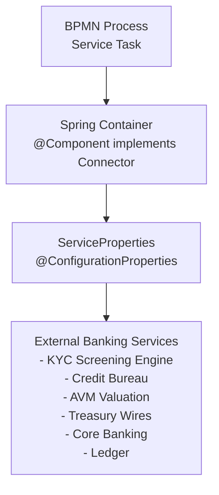

# Service Delegates

This document provides complete Java implementations for the key service delegates used in the Bank Loan Workflow. Each delegate implements the `Connector` interface and integrates with external banking services via configuration properties. All 18 delegates follow the same pattern; the remaining ones are listed at the end.

## Architecture Overview



## Connector Interface

All service delegates implement the Activiti `Connector` interface, which extends `java.util.function.Function<IntegrationContext, IntegrationContext>`:

```java
public interface Connector extends Function<IntegrationContext, IntegrationContext> {
    // Inherits apply(IntegrationContext) from Function
}
```

**Key `IntegrationContext` Methods:**
- `getInBoundVariables()` - Read all input variables as `Map<String, Object>`
- `getInBoundVariable(String name, Class<T> type)` - Access a specific input variable
- `addOutBoundVariable(String name, Object value)` - Set a single output variable
- `getProcessInstanceId()`, `getBusinessKey()` - Process instance metadata

Inbound/outbound variables flow through the process extension `mappings` for the task element (see [Process Extensions](process-extensions.md)).

---

## Service Delegate Implementations

### 1. KycScreeningService

**BPMN Task:** `kycScreeningTask` in `loanApprovalProcess` (async)

**Purpose:** Automated KYC/AML screening; throws a BPMN error when the screening engine is unavailable or non-decisive.

```java
package com.example.bankloan.services;

import com.example.bankloan.config.ServiceProperties;
import org.activiti.api.process.model.IntegrationContext;
import org.activiti.api.process.runtime.connector.Connector;
import org.activiti.engine.delegate.BpmnError;
import org.slf4j.Logger;
import org.slf4j.LoggerFactory;
import org.springframework.beans.factory.annotation.Autowired;
import org.springframework.stereotype.Component;

@Component("kycScreeningService")
public class KycScreeningService implements Connector {

    private static final Logger logger = LoggerFactory.getLogger(KycScreeningService.class);

    @Autowired
    private ServiceProperties serviceProperties;

    @Override
    public IntegrationContext apply(IntegrationContext integrationContext) {
        String customerName = (String) integrationContext.getInBoundVariables().get("customerName");
        String loanType = (String) integrationContext.getInBoundVariables().get("loanType");

        logger.info("Screening {} ({} loan) via {}",
            customerName, loanType, serviceProperties.getKyc().getScreeningEngineUrl());

        try {
            ScreeningResult result = callScreeningEngine(customerName, loanType);
            integrationContext.addOutBoundVariable("kycPassed", result.isPassed());
            integrationContext.addOutBoundVariable("kycReference", result.getReference());
        } catch (ScreeningException e) {
            // Business fault -> the error boundary event takes over
            throw new BpmnError("KYC001", "KYC screening failed: " + e.getMessage());
        }

        return integrationContext;
    }

    private ScreeningResult callScreeningEngine(String customerName, String loanType) {
        // In production: HTTP POST to serviceProperties.getKyc().getScreeningEngineUrl()
        // For demonstration, a deterministic pass
        return new ScreeningResult(true, "KYC-" + Math.abs(customerName.hashCode()));
    }
}
```

**Input Variables:**
- `customerName` - Applicant name
- `loanType` - Loan type

**Output Variables:**
- `kycPassed` - Screening result (boolean)
- `kycReference` - Screening case reference (String)

**Configuration Used:**
```yaml
services:
  kyc:
    screening-engine-url: https://kyc.bank.example/api/v2
    timeout: 30000
```

---

### 2. CreditScoringService

**BPMN Task:** `creditScoringTask` in `creditAssessmentSubProcess` (inside `loanApprovalProcess`)

**Purpose:** Computes the credit score and risk rating from the credit report, and derives the automated credit decision.

```java
package com.example.bankloan.services;

import com.example.bankloan.config.ServiceProperties;
import org.activiti.api.process.model.IntegrationContext;
import org.activiti.api.process.runtime.connector.Connector;
import org.slf4j.Logger;
import org.slf4j.LoggerFactory;
import org.springframework.beans.factory.annotation.Autowired;
import org.springframework.stereotype.Component;

import java.math.BigDecimal;

@Component("creditScoringService")
public class CreditScoringService implements Connector {

    private static final Logger logger = LoggerFactory.getLogger(CreditScoringService.class);

    @Autowired
    private ServiceProperties serviceProperties;

    @Override
    public IntegrationContext apply(IntegrationContext integrationContext) {
        // The report was pulled by pullCreditReportTask (same sub-process scope)
        Object reportObj = integrationContext.getInBoundVariables().get("creditReport");
        BigDecimal loanAmount = toBigDecimal(integrationContext.getInBoundVariables().get("loanAmount"));

        int score = scoreReport(reportObj, loanAmount);
        String riskRating = riskRating(score, loanAmount);
        int minScore = serviceProperties.getCreditBureau().getMinCreditScore();

        boolean approved = score >= minScore && !"HIGH".equals(riskRating);
        logger.info("Credit score: {}, risk: {}, approved: {}", score, riskRating, approved);

        integrationContext.addOutBoundVariable("creditScore", score);
        integrationContext.addOutBoundVariable("riskRating", riskRating);
        integrationContext.addOutBoundVariable("creditApproved", approved);

        return integrationContext;
    }

    private int scoreReport(Object creditReport, BigDecimal loanAmount) {
        // In production: a scoring model over the report (delinquencies, utilization, ...)
        int baseScore = 700;
        if (loanAmount.compareTo(new BigDecimal("100000")) > 0) {
            baseScore -= 20;
        }
        if (loanAmount.compareTo(new BigDecimal("500000")) > 0) {
            baseScore -= 30;
        }
        return baseScore;
    }

    private String riskRating(int score, BigDecimal loanAmount) {
        if (score >= 750) {
            return "LOW";
        }
        if (score >= 650) {
            return loanAmount.compareTo(new BigDecimal("250000")) > 0 ? "HIGH" : "MEDIUM";
        }
        return "HIGH";
    }

    private BigDecimal toBigDecimal(Object value) {
        return value instanceof BigDecimal ? (BigDecimal) value : new BigDecimal(value.toString());
    }
}
```

**Input Variables:**
- `creditReport` - Raw report payload (JSON)
- `loanAmount` - Requested amount (BigDecimal)

**Output Variables:**
- `creditScore` - Computed score (int)
- `riskRating` - LOW / MEDIUM / HIGH (String)
- `creditApproved` - Automated decision (boolean)

**Configuration Used:**
```yaml
services:
  credit-bureau:
    api-url: https://api.creditbureau.example/v1
    min-credit-score: 650
```

---

### 3. AutomatedValuationService

**BPMN Task:** `runAutomatedValuationTask` in `collateralValuationProcess` (async)

**Purpose:** Runs the automated valuation model and determines whether the result is within tolerance.

```java
package com.example.bankloan.services;

import com.example.bankloan.config.ServiceProperties;
import org.activiti.api.process.model.IntegrationContext;
import org.activiti.api.process.runtime.connector.Connector;
import org.springframework.beans.factory.annotation.Autowired;
import org.springframework.stereotype.Component;

import java.math.BigDecimal;

@Component("automatedValuationService")
public class AutomatedValuationService implements Connector {

    @Autowired
    private ServiceProperties serviceProperties;

    @Override
    public IntegrationContext apply(IntegrationContext integrationContext) {
        String loanApplicationId = (String) integrationContext.getInBoundVariables().get("loanApplicationId");
        BigDecimal loanAmount = toBigDecimal(integrationContext.getInBoundVariables().get("loanAmount"));
        String loanType = (String) integrationContext.getInBoundVariables().get("loanType");

        ValuationResult result = callAvm(loanApplicationId, loanAmount, loanType);

        double tolerance = serviceProperties.getValuation().getTolerance();
        boolean withinTolerance = result.getConfidence() >= (1 - tolerance);

        integrationContext.addOutBoundVariable("avmValue", result.getValue());
        integrationContext.addOutBoundVariable("avmWithinTolerance", withinTolerance);

        return integrationContext;
    }

    private ValuationResult callAvm(String loanApplicationId, BigDecimal loanAmount, String loanType) {
        // In production: HTTP POST to serviceProperties.getValuation().getAvmUrl()
        // For demonstration, 90% of the requested amount with 0.9 confidence
        return new ValuationResult(loanAmount.multiply(new BigDecimal("0.90")), 0.9);
    }

    private BigDecimal toBigDecimal(Object value) {
        return value instanceof BigDecimal ? (BigDecimal) value : new BigDecimal(value.toString());
    }
}
```

**Input Variables:**
- `loanApplicationId`, `loanAmount`, `loanType`

**Output Variables:**
- `avmValue` - Model valuation (BigDecimal)
- `avmWithinTolerance` - Tolerance check (boolean)

---

### 4. ValuationRecordingService

**BPMN Task:** `recordValuationTask` in `collateralValuationProcess`

**Purpose:** Records the final collateral value — manual appraisal wins when present, otherwise the AVM value stands.

```java
package com.example.bankloan.services;

import org.activiti.api.process.model.IntegrationContext;
import org.activiti.api.process.runtime.connector.Connector;
import org.springframework.stereotype.Component;

import java.math.BigDecimal;

@Component("valuationRecordingService")
public class ValuationRecordingService implements Connector {

    @Override
    public IntegrationContext apply(IntegrationContext integrationContext) {
        BigDecimal avmValue = toBigDecimal(integrationContext.getInBoundVariables().get("avmValue"));
        BigDecimal appraisalValue = toBigDecimal(integrationContext.getInBoundVariables().get("appraisalValue"));

        boolean manual = appraisalValue != null;
        BigDecimal collateralValue = manual ? appraisalValue : avmValue;

        // Write to the collateral registry (core banking sidecar system)
        recordCollateral(collateralValue, manual ? "MANUAL" : "AVM");

        integrationContext.addOutBoundVariable("collateralValue", collateralValue);
        integrationContext.addOutBoundVariable("valuationMethod", manual ? "MANUAL" : "AVM");

        return integrationContext;
    }

    private void recordCollateral(BigDecimal value, String method) {
        // In production: HTTP call to the collateral registry
    }

    private BigDecimal toBigDecimal(Object value) {
        return value instanceof BigDecimal ? (BigDecimal) value : (value == null ? null : new BigDecimal(value.toString()));
    }
}
```

**Input Variables:**
- `avmValue` - AVM valuation (may be absent if the AVM timed out)
- `appraisalValue` - Manual appraisal (may be absent if the AVM was within tolerance)

**Output Variables:**
- `collateralValue` - Recorded value (BigDecimal)
- `valuationMethod` - `AVM` or `MANUAL` (String)

---

### 5. FundDisbursementService

**BPMN Task:** `disburseFundsTask` in `loanDisbursementProcess` (async, dual boundaries)

**Purpose:** Executes the wire transfer; throws a BPMN error on rejection so the error boundary routes to the operations team.

```java
package com.example.bankloan.services;

import com.example.bankloan.config.ServiceProperties;
import org.activiti.api.process.model.IntegrationContext;
import org.activiti.api.process.runtime.connector.Connector;
import org.activiti.engine.delegate.BpmnError;
import org.springframework.beans.factory.annotation.Autowired;
import org.springframework.stereotype.Component;

import java.math.BigDecimal;

@Component("fundDisbursementService")
public class FundDisbursementService implements Connector {

    @Autowired
    private ServiceProperties serviceProperties;

    @Override
    public IntegrationContext apply(IntegrationContext integrationContext) {
        String loanApplicationId = (String) integrationContext.getInBoundVariables().get("loanApplicationId");
        String accountNumber = (String) integrationContext.getInBoundVariables().get("accountNumber");
        BigDecimal loanAmount = toBigDecimal(integrationContext.getInBoundVariables().get("loanAmount"));

        try {
            WireResult wire = callTreasury(loanApplicationId, accountNumber, loanAmount);
            integrationContext.addOutBoundVariable("disbursementStatus", "DISBURSED");
            integrationContext.addOutBoundVariable("disbursementReference", wire.getReference());
        } catch (WireException e) {
            // Business fault -> error boundary -> manual disbursement (ops team)
            throw new BpmnError("PAY001", "Wire transfer rejected: " + e.getMessage());
        }

        return integrationContext;
    }

    private WireResult callTreasury(String loanApplicationId, String accountNumber, BigDecimal amount) {
        // In production: HTTP POST to serviceProperties.getTreasury().getWireEndpoint()
        return new WireResult("SWIFT-" + Math.abs(loanApplicationId.hashCode()));
    }

    private BigDecimal toBigDecimal(Object value) {
        return value instanceof BigDecimal ? (BigDecimal) value : new BigDecimal(value.toString());
    }
}
```

**Input Variables:**
- `loanApplicationId`, `accountNumber`, `loanAmount`

**Output Variables:**
- `disbursementStatus` - `DISBURSED`
- `disbursementReference` - Wire reference

**Configuration Used:**
```yaml
services:
  treasury:
    wire-endpoint: https://treasury.bank.example/wires
```

---

### 6. InterestPostingService

**BPMN Task:** `postInterestTask` in `batchInterestPostingProcess` (async, **parallel multi-instance**)

**Purpose:** Posts interest for **one** account per parallel instance — the element variable `account` holds that instance's element.

```java
package com.example.bankloan.services;

import com.example.bankloan.config.ServiceProperties;
import org.activiti.api.process.model.IntegrationContext;
import org.activiti.api.process.runtime.connector.Connector;
import org.slf4j.Logger;
import org.slf4j.LoggerFactory;
import org.springframework.beans.factory.annotation.Autowired;
import org.springframework.stereotype.Component;

import java.math.BigDecimal;

@Component("interestPostingService")
public class InterestPostingService implements Connector {

    private static final Logger logger = LoggerFactory.getLogger(InterestPostingService.class);

    @Autowired
    private ServiceProperties serviceProperties;

    @Override
    public IntegrationContext apply(IntegrationContext integrationContext) {
        // The element variable: this parallel instance's single account
        AccountDue account = (AccountDue) integrationContext.getInBoundVariables().get("account");

        // Idempotent: the ledger keys the posting by (batchRunId, accountNumber),
        // so a retried job (failedJobRetryTimeCycle) cannot double-post
        BigDecimal interest = callLedgerPost(account);

        logger.info("Posted {} on account {}", interest, account.getAccountNumber());

        return integrationContext;
    }

    private BigDecimal callLedgerPost(AccountDue account) {
        // In production: HTTP POST to serviceProperties.getLedger().getApiUrl()
        return account.getInterestAmount();
    }
}
```

**Input Variables:**
- `account` - The multi-instance element variable (one `AccountDue` per parallel token)

**Output Variables:**
- none — the posting is an external side effect; the shared total is computed by reconciliation from the ledger (avoids parallel write races on process variables)

**Multi-Instance Note:** Because the task declares `activiti:collection="${accountsDue}"` and `activiti:elementVariable="account"`, each parallel instance sees exactly one account. The connector itself is completely unaware of the loop.

---

### 7. BatchReconciliationService

**BPMN Task:** `reconcileBatchTask` in `batchInterestPostingProcess`

**Purpose:** Reads the ledger back and verifies that the posted total matches the expected total from the extract.

```java
package com.example.bankloan.services;

import com.example.bankloan.config.ServiceProperties;
import org.activiti.api.process.model.IntegrationContext;
import org.activiti.api.process.runtime.connector.Connector;
import org.springframework.beans.factory.annotation.Autowired;
import org.springframework.stereotype.Component;

import java.math.BigDecimal;
import java.util.List;

@Component("batchReconciliationService")
public class BatchReconciliationService implements Connector {

    @Autowired
    private ServiceProperties serviceProperties;

    @Override
    public IntegrationContext apply(IntegrationContext integrationContext) {
        @SuppressWarnings("unchecked")
        List<AccountDue> accounts = (List<AccountDue>) integrationContext.getInBoundVariables().get("accountsDue");
        String batchRunId = (String) integrationContext.getInBoundVariables().get("batchRunId");

        BigDecimal expected = accounts.stream()
            .map(AccountDue::getInterestAmount)
            .reduce(BigDecimal.ZERO, BigDecimal::add);

        // Read back what the ledger actually posted for this run
        BigDecimal actual = readPostedTotal(batchRunId);

        boolean reconciled = expected.compareTo(actual) == 0;

        integrationContext.addOutBoundVariable("batchReconciled", reconciled);
        integrationContext.addOutBoundVariable("interestPosted", actual);

        return integrationContext;
    }

    private BigDecimal readPostedTotal(String batchRunId) {
        // In production: query the ledger by run id
        return BigDecimal.ZERO;
    }
}
```

**Input Variables:**
- `accountsDue` - The extract (to compute the expected total)
- `batchRunId` - Run identifier

**Output Variables:**
- `batchReconciled` - Reconciliation result (boolean)
- `interestPosted` - Actual posted total (BigDecimal)

---

## Remaining Service Delegates

The following service delegates follow the same pattern. Complete implementations are available in the example source code:

| Service | Component Name | BPMN Task | Purpose |
|---------|---------------|-----------|---------|
| `CreditReportService` | `creditReportService` | `pullCreditReportTask` | Pull credit bureau report (async) |
| `AccountSetupService` | `accountSetupService` | `setupLoanAccountTask` | Create loan account in core banking |
| `StatementService` | `statementService` | `issueStatementTask` | Issue the first loan statement |
| `TreasuryNotificationService` | `treasuryNotificationService` | `notifyTreasuryTask` | Notify treasury of the movement |
| `CreditBureauUpdateService` | `creditBureauUpdateService` | `updateCreditBureauTask` | Report the funded loan to the bureau |
| `CoreSystemRegistrationService` | `coreSystemRegistrationService` | `loanRegisteredTask` | Register the funded loan record |
| `AccountExtractService` | `accountExtractService` | `fetchAccountsDueTask` | Extract accounts with interest due (async) |
| `BatchReportService` | `batchReportService` | `generateBatchReportTask` | Generate the batch report |
| `BatchReportEmailService` | `batchReportEmailService` | `emailBatchReportTask` | Email the report to the finance team |
| `DisbursementPreparationService` | `disbursementPreparationService` | `prepareDisbursementTask` | Prepare funds and wire instruction (async) |
| `LoanCaseService` | `loanCaseService` | `loanClosedTask` | Close the loan case in the case system |

---

## ServiceProperties Configuration

All service delegates inject configuration via `ServiceProperties`:

```java
package com.example.bankloan.config;

import org.springframework.boot.context.properties.ConfigurationProperties;
import org.springframework.context.annotation.Configuration;

@Configuration
@ConfigurationProperties(prefix = "services")
public class ServiceProperties {

    private Kyc kyc;
    private CreditBureau creditBureau;
    private Valuation valuation;
    private Treasury treasury;
    private CoreBanking coreBanking;
    private Ledger ledger;
    private Email email;

    // Getters and setters
    public Kyc getKyc() { return kyc; }
    public void setKyc(Kyc kyc) { this.kyc = kyc; }

    public CreditBureau getCreditBureau() { return creditBureau; }
    public void setCreditBureau(CreditBureau creditBureau) { this.creditBureau = creditBureau; }

    public Valuation getValuation() { return valuation; }
    public void setValuation(Valuation valuation) { this.valuation = valuation; }

    public Treasury getTreasury() { return treasury; }
    public void setTreasury(Treasury treasury) { this.treasury = treasury; }

    public CoreBanking getCoreBanking() { return coreBanking; }
    public void setCoreBanking(CoreBanking coreBanking) { this.coreBanking = coreBanking; }

    public Ledger getLedger() { return ledger; }
    public void setLedger(Ledger ledger) { this.ledger = ledger; }

    public Email getEmail() { return email; }
    public void setEmail(Email email) { this.email = email; }

    // Nested configuration classes
    public static class Kyc {
        private String screeningEngineUrl;
        private int timeout;
        // getters/setters
    }

    public static class CreditBureau {
        private String apiUrl;
        private int minCreditScore;
        // getters/setters
    }

    public static class Valuation {
        private String avmUrl;
        private double tolerance;
        // getters/setters
    }

    public static class Treasury {
        private String wireEndpoint;
        // getters/setters
    }

    public static class CoreBanking {
        private String apiUrl;
        // getters/setters
    }

    public static class Ledger {
        private String apiUrl;
        // getters/setters
    }

    public static class Email {
        private String smtpServer;
        private String fromAddress;
        // getters/setters
    }
}
```

---

## Best Practices Illustrated

1. **Configuration Injection** - All external service configs via `@ConfigurationProperties`
2. **Business Faults as BPMN Errors** - `BpmnError` (thrown directly, never wrapped) with a stable error code that matches the `<error>` definition; error boundary events take over
3. **Logging** - Comprehensive logging for debugging and monitoring
4. **Idempotency for Retries** - The interest posting is keyed by (run, account) so `failedJobRetryTimeCycle` retries are safe
5. **Type Safety** - Proper type casting for process variables (`toBigDecimal` helper)
6. **Separation of Concerns** - Each service handles a single responsibility
7. **Testability** - Services can be unit tested independently

---

## Next Steps

- [Process Extensions](process-extensions.md) - Variable mappings and constants
- [REST API](rest-api.md) - HTTP integration

---

**Related Documentation:**
- [Service Tasks](../../bpmn/elements/service-task.md)
- [Connectors](../../bpmn/integration/connectors.md)
- [Error Handling](../../bpmn/reference/error-handling.md)
