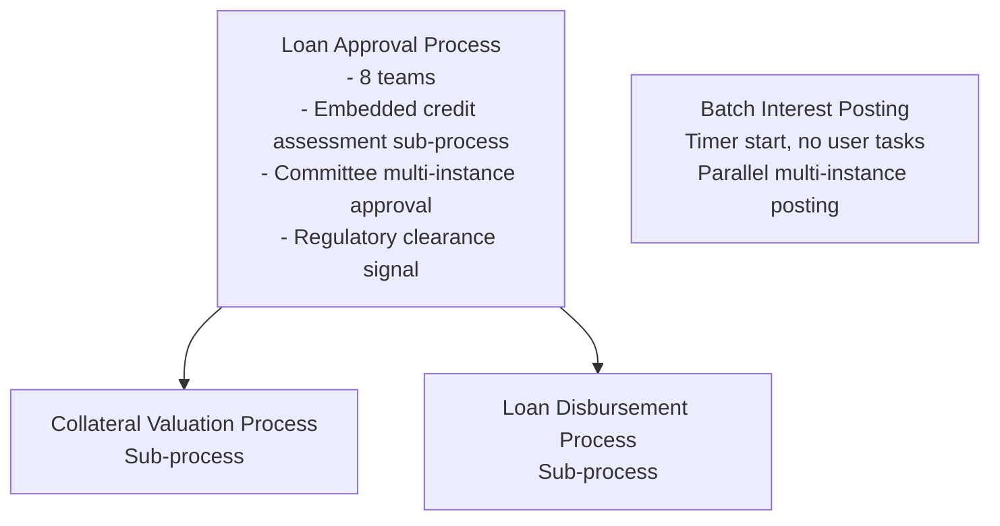

# Bank Loan Workflow - Overview

**Community-Maintained Example**

This example demonstrates a production-ready bank loan operations system built with Activiti. It showcases how to orchestrate a loan lifecycle that spans **eight different teams**, includes an **unattended batch process**, and combines embedded sub-processes, call activities, multi-instance approvals, signal events, and inclusive gateways.

> **Note:** This is community-contributed documentation. For official Activiti documentation, refer to the Activiti project repositories.

## What You'll Learn

This example demonstrates:

- **Multi-team routing** - Candidate groups route tasks to eight distinct teams (intake, supervisors, credit analysis, senior officers, risk committee, compliance, valuation, operations)
- **Embedded sub-process** - A credit assessment sub-process inside the main workflow
- **Call activities** - Invoking collateral valuation and disbursement sub-processes
- **Collection-based multi-instance** - Sequential risk committee approvals driven by a variable collection, with early exit on rejection
- **Signal events** - A regulatory clearance signal that pauses the process until sent from outside
- **Inclusive gateway** - Multiple conditional post-disbursement actions
- **Unattended batch process** - A timer (cron) start process with **no user tasks**, a parallel multi-instance loop, and automatic job retry
- **Error handling** - Boundary error events with manual fallback paths (not just termination)
- **Service delegates** - Spring beans implementing business logic as `Connector`s
- **Process extensions** - Variable definitions and mappings in JSON sidecars
- **REST integration** - HTTP API for process initiation, signals, and batch triggering

## Business Scenario

The Bank Loan Workflow handles the complete loan lifecycle at a mid-size bank:

1. **Intake review** - Intake team verifies the application is complete; timeouts escalate to loan supervisors
2. **KYC & AML screening** - Automated Know-Your-Customer / Anti-Money-Laundering screening
3. **Credit assessment** (embedded sub-process) - Pull the credit report, credit analysts assess it, the engine computes a score; a compliance flag can be raised mid-assessment
4. **Senior review fallback** - Borderline credit cases go to a senior credit officer
5. **Risk committee approval** - A sequential multi-instance task walks the loan through the committee members in order; any rejection exits immediately
6. **Collateral valuation** (sub-process) - Loans with collateral are valuated: automated valuation model first, manual appraisal when out of tolerance
7. **Regulatory clearance & disbursement preparation** - A signal event holds the loan until regulatory clearance is sent, while disbursement is prepared in parallel
8. **Disbursement** (sub-process) - Account setup, fund disbursement (with manual fallback on failure), and conditional post-disbursement actions
9. **Daily interest posting** (batch process) - Every night at 02:00 the engine fetches accounts with interest due and posts interest in parallel, with reconciliation and reporting — no human involved

## Architecture Overview



## Process Breakdown

| Process | Elements | Purpose |
|---------|----------|---------|
| **Loan Approval** | 36 | Main orchestration workflow (message start) |
| **Collateral Valuation** | 9 | AVM-first collateral valuation with manual fallback |
| **Loan Disbursement** | 15 | Account setup, disbursement, post-disbursement actions |
| **Batch Interest Posting** | 13 | Unattended nightly batch (timer start, no user tasks) |

## File Structure

```
bank-loan-workflow/
├── src/main/
│   ├── java/com/example/bankloan/
│   │   ├── BankLoanApplication.java
│   │   ├── config/
│   │   │   └── ServiceProperties.java
│   │   ├── controllers/
│   │   │   └── LoanController.java
│   │   └── services/                    # 18 service delegates
│   └── resources/
│       ├── processes/                   # Auto-deployed at startup
│       │   ├── loanApprovalProcess.bpmn
│       │   ├── loanApprovalProcess-extensions.json
│       │   ├── collateralValuationProcess.bpmn
│       │   ├── collateralValuationProcess-extensions.json
│       │   ├── loanDisbursementProcess.bpmn
│       │   ├── loanDisbursementProcess-extensions.json
│       │   ├── batchInterestPostingProcess.bpmn
│       │   └── batchInterestPostingProcess-extensions.json
│       └── application.yml
└── pom.xml
```

Each `-extensions.json` sidecar must sit **next to** its BPMN file — the extension finder scans the same resource prefix as the process definitions (default `classpath*:**/processes/`) for files ending in `*-extensions.json`.

## Key Features Demonstrated

### 1. Message-Driven Start

The main process starts with a message event, enabling external triggers:

```xml
<bpmn:startEvent id="startEvent" name="Loan Application Received">
  <bpmn:messageEventDefinition messageRef="loanApplicationMessage"/>
</bpmn:startEvent>
```

**Why use this?** Message start events allow your process to be triggered by:
- REST API calls
- Message queues (Kafka, RabbitMQ)
- Core banking system integration events
- File-drop or webhook integrations

### 2. Multi-Team Routing with Candidate Groups

Each human task belongs to a specific bank team via `activiti:candidateGroups`:

```xml
<bpmn:userTask id="creditAnalysisTask"
               name="Credit Analysis"
               activiti:candidateGroups="creditAnalysis">
</bpmn:userTask>
```

**Teams used in this example:**

| Team | Candidate Group | Tasks |
|------|-----------------|-------|
| Intake | `loanIntake` | Intake Review |
| Supervisors | `loanSupervisor` | Intake Escalation |
| Credit Analysis | `creditAnalysis` | Credit Analysis (in sub-process) |
| Senior Officers | `seniorCreditOfficer` | Senior Credit Review |
| Risk Committee | `riskCommittee` | Risk Committee Approval (multi-instance) |
| Compliance | `complianceTeam` | Compliance Review |
| Valuation | `valuationTeam` | Manual Appraisal |
| Operations | `opsTeam` | Manual Account Setup, Manual Disbursement |

**Why candidate groups?** Any member of the team can claim the task — this models how work is actually distributed across bank teams, and it survives staff turnover without redeploying the process.

### 3. Embedded Sub-Process

The credit assessment stage is an **embedded sub-process** — a self-contained flow inside the main process:

```xml
<bpmn:subProcess id="creditAssessmentSubProcess" name="Credit Assessment">
  <!-- pull credit report, credit analysis, compliance flag, scoring -->
</bpmn:subProcess>
```

**Why an embedded sub-process (vs. call activity)?**
- The credit assessment logic is **specific to this process** — not reused elsewhere
- It keeps the main diagram readable by collapsing related steps
- A call activity is used instead when the sub-flow is **reused** (collateral valuation, disbursement)

### 4. Collection-Based Multi-Instance Approval

The risk committee approval is a sequential multi-instance task driven by a variable collection:

```xml
<bpmn:userTask id="riskApprovalTask" name="Risk Committee Approval"
               activiti:candidateGroups="riskCommittee"
               activiti:assignee="${approver}">
  <bpmn:multiInstanceLoopCharacteristics isSequential="true"
                                         activiti:collection="${riskApprovers}"
                                         activiti:elementVariable="approver">
    <bpmn:completionCondition>${approved == false}</bpmn:completionCondition>
  </bpmn:multiInstanceLoopCharacteristics>
</bpmn:userTask>
```

**Why this pattern?**
- The approver list is data (`riskApprovers`), not model structure — the committee can change without redeploying
- `isSequential="true"` walks members in order (seniority order)
- The completion condition exits **immediately on any rejection** — no point asking the rest of the committee
- Each instance is assigned to its committee member via `activiti:assignee="${approver}"`

### 5. Signal Event (Regulatory Clearance)

Before funds move, the loan waits for an external regulatory clearance **signal**, while disbursement preparation runs in parallel:

```xml
<bpmn:intermediateCatchEvent id="regulatoryHoldEvent" name="Awaiting Regulatory Clearance">
  <bpmn:signalEventDefinition signalRef="regulatoryClearanceSignal"/>
</bpmn:intermediateCatchEvent>
```

**Runtime trigger:**
```java
processRuntime.signal(ProcessPayloadBuilder.signal()
    .withName("regulatoryClearance")
    .build());
```

**Why a signal?** A signal is broadcast and matches by name — it models an external regulatory state ("clearance granted for this product class") rather than a per-message event. The process simply waits until the signal arrives.

### 6. Inclusive Gateway

Post-disbursement, several independent actions may need to run based on conditions:

```xml
<bpmn:inclusiveGateway id="postDisbursementGateway" name="Post-Disbursement Actions"/>
```

**Why inclusive (vs. exclusive/parallel)?**
- Exclusive would force *exactly one* action
- Parallel would run *all* actions unconditionally
- Inclusive runs *every branch whose condition is true* — the right semantics for "issue a statement **and/or** notify treasury **and/or** update the credit bureau"

### 7. Unattended Batch Process

The nightly interest posting process has a **timer start event** and **no user tasks**:

```xml
<bpmn:startEvent id="batchStartEvent" name="Nightly Interest Batch">
  <bpmn:timerEventDefinition>
    <bpmn:timeCycle>0 0 2 * * ?</bpmn:timeCycle>
  </bpmn:timerEventDefinition>
</bpmn:startEvent>
```

**Why this pattern?**
- `timeCycle` with a Quartz cron expression schedules the process — no external job runner needed
- The loop over accounts is a **parallel multi-instance service task** over `${accountsDue}`
- `activiti:failedJobRetryTimeCycle="R3/PT5M"` retries a failed posting job 3 times at 5-minute intervals before surfacing the error
- Reconciliation at the end makes the batch auditable and safe

### 8. Error Boundaries with Manual Fallback

Instead of terminating on failure, disbursement errors route to a human fallback:

```xml
<bpmn:boundaryEvent id="disbursementError"
                    name="Disbursement Failed"
                    attachedToRef="disburseFundsTask">
  <bpmn:outgoing>flowToManualDisbursement</bpmn:outgoing>
  <bpmn:errorEventDefinition errorRef="disbursementErrorDef"/>
</bpmn:boundaryEvent>
```

**Why manual fallback?** A failed wire transfer is a business incident, not a dead end — the operations team takes over while the process (and all its context) is preserved.

## Process Variables

The workflow uses 25+ process variables for data flow:

| Variable | Type | Purpose |
|----------|------|---------|
| `loanApplicationId` | String | Unique application identifier (business key) |
| `customerName` | String | Applicant full name |
| `customerEmail` | String | Contact email |
| `loanAmount` | BigDecimal | Requested loan amount |
| `loanType` | String | PERSONAL, MORTGAGE, or BUSINESS |
| `hasCollateral` | Boolean | Whether the loan is secured |
| `applicationComplete` | Boolean | Intake verification result |
| `kycPassed` | Boolean | KYC/AML screening result |
| `kycReference` | String | Screening case reference |
| `creditReport` | JSON | Raw credit report payload |
| `creditScore` | Integer | Computed credit score |
| `riskRating` | String | LOW, MEDIUM, or HIGH |
| `creditApproved` | Boolean | Automated credit decision |
| `seniorReviewApproved` | Boolean | Senior officer decision |
| `riskApprovers` | Array | Ordered committee member IDs |
| `approved` | Boolean | Committee decision (last rejection wins) |
| `collateralValue` | BigDecimal | Valuated collateral amount |
| `valuationMethod` | String | AVM or MANUAL |
| `disbursementStatus` | String | DISBURSED or MANUAL_DISBURSED |
| `disbursementReference` | String | Wire reference |
| `accountsFound` | Boolean | Batch: whether accounts were due |
| `accountsDue` | Array | Batch: accounts to post interest on |
| `batchReconciled` | Boolean | Batch: reconciliation result |

## Service Delegates

18 Spring beans implement business logic:

- **KycScreeningService** - KYC/AML screening engine
- **CreditReportService** - Credit bureau report retrieval
- **CreditScoringService** - Score and risk rating computation
- **AutomatedValuationService** - AVM valuation
- **ValuationRecordingService** - Collateral value recording
- **AccountSetupService** - Core banking account creation
- **FundDisbursementService** - Wire transfer execution
- **StatementService** - Statement issuance
- **TreasuryNotificationService** - Treasury movement notice
- **CreditBureauUpdateService** - Credit bureau reporting
- **CoreSystemRegistrationService** - Core system loan registration
- **AccountExtractService** - Batch account extract
- **InterestPostingService** - Per-account interest posting (multi-instance)
- **BatchReconciliationService** - Batch total reconciliation
- **BatchReportService** - Batch report generation
- **BatchReportEmailService** - Finance team notification
- **DisbursementPreparationService** - Funds preparation
- **LoanCaseService** - Case closure

## Configuration

External services are configured via `application.yml`:

```yaml
services:
  kyc:
    screening-engine-url: https://kyc.bank.example/api/v2
    timeout: 30000
  credit-bureau:
    api-url: https://api.creditbureau.example/v1
    min-credit-score: 650
  valuation:
    avm-url: https://avm.bank.example/api
    tolerance: 0.15
  treasury:
    wire-endpoint: https://treasury.bank.example/wires
  core-banking:
    api-url: https://core.bank.example/api
  ledger:
    api-url: https://ledger.bank.example/api
  email:
    smtp-server: smtp.bank.example
    from-address: loans@bank.example
```

## Next Steps

Continue with the detailed process documentation:

1. [Loan Approval Process](loan-approval-process.md) - Complete walkthrough of the orchestration workflow
2. [Collateral Valuation Sub-Process](collateral-process.md) - AVM-first valuation with manual fallback
3. [Loan Disbursement Sub-Process](disbursement-process.md) - Disbursement with error fallback and inclusive gateway
4. [Batch Interest Posting Process](batch-processing-process.md) - The unattended nightly batch
5. [Complete BPMN Files](bpmn-files.md) - Full ready-to-deploy XML for all four processes
6. [Service Delegates](service-delegates.md) - Java implementation details
7. [Process Extensions](process-extensions.md) - Variable mappings and constants
8. [REST API](rest-api.md) - HTTP integration, signals, and batch triggering

## Running the Example

```bash
# Build the project
mvn clean package

# Run the application
mvn spring-boot:run

# Start a loan application
curl -X POST http://localhost:8080/api/loans \
  -H "Content-Type: application/json" \
  -d '{
    "loanApplicationId": "LN-001",
    "customerName": "Jane Smith",
    "customerEmail": "jane.smith@example.com",
    "loanAmount": 250000.00,
    "loanType": "MORTGAGE",
    "hasCollateral": true,
    "riskApprovers": ["r.chen", "m.okafor"]
  }'

# Send regulatory clearance (unblocks the signal wait)
curl -X POST http://localhost:8080/api/loans/LN-001/regulatory-clearance

# Trigger the batch process manually
curl -X POST http://localhost:8080/api/batch/interest-posting
```

---

**Related Documentation:**
- [Regular Sub-Processes](../../bpmn/subprocesses/regular-subprocess.md)
- [Multi-Instance](../../bpmn/reference/multi-instance.md)
- [Inclusive Gateways](../../bpmn/gateways/inclusive-gateway.md)
- [Start Events](../../bpmn/events/start-event.md)
