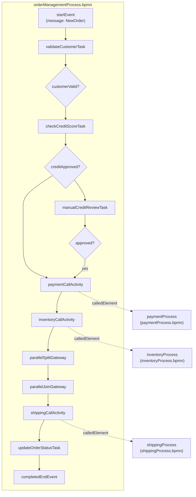

# Order Management - Complete BPMN Files

This page contains the full BPMN 2.0 XML for all four processes in the
[Order Management Workflow](summary.md) example. Save each block as the
corresponding file under `src/main/resources/processes/` (or `bpmn/`) and
deploy — no further editing is required.

| File | Process ID | Entry Point |
|------|-----------|-------------|
| `orderManagementProcess.bpmn` | `orderManagementProcess` | Message start event (`newOrderMessage`) |
| `paymentProcess.bpmn` | `paymentProcess` | Called via `paymentCallActivity` |
| `inventoryProcess.bpmn` | `inventoryProcess` | Called via `inventoryCallActivity` |
| `shippingProcess.bpmn` | `shippingProcess` | Called via `shippingCallActivity` |

> **Note:** Variable input/output mappings for the call activities are not
> encoded in the BPMN XML — they live in the extension JSON files described
> in [Process Extensions](process-extensions.md).

## Consistency Corrections

The walkthrough pages describe each element individually. To make these
files internally consistent and deployable, the following small corrections
were applied:

1. **orderManagementProcess** — The manual credit review approval path uses
   its own sequence flow (`flowToPaymentFromManual`), because
   `flowToPaymentCall` is already sourced from `creditApprovalGateway`. The
   invoice and email branches use distinct flow IDs into the parallel join
   (`flowToParallelJoinFromInvoice` / `flowToParallelJoinFromEmail`) to match
   the join's declared incoming flows. The non-cancelling escalation flow
   rejoins at `qualityCheckGateway`, so the quality task can continue.
2. **paymentProcess** — `retryPaymentTask` declares both incoming flows
   (from the timer boundary and from the payment result gateway).
3. **inventoryProcess** — The parallel join gateway has two incoming flows,
   one per parallel branch.
4. **shippingProcess** — The standard pickup path uses
   `flowToUpdateTrackingFromRegular` to match the tracking task's second
   incoming flow.

## orderManagementProcess.bpmn

```xml
<?xml version="1.0" encoding="UTF-8"?>
<bpmn:definitions xmlns:bpmn="http://www.omg.org/spec/BPMN/20100524/MODEL"
                  xmlns:activiti="http://activiti.org/bpmn">

  <bpmn:process id="orderManagementProcess" name="Order Management Process">

    <bpmn:message id="newOrderMessage" name="NewOrder"/>
    <bpmn:message id="escalationMessage" name="EscalationRequest"/>
    <bpmn:error id="creditServiceErrorDef" name="CreditServiceError" errorCode="CREDIT001"/>

    <bpmn:startEvent id="startEvent" name="Order Received">
      <bpmn:outgoing>flowToValidateCustomer</bpmn:outgoing>
      <bpmn:messageEventDefinition messageRef="newOrderMessage"/>
    </bpmn:startEvent>

    <bpmn:userTask id="validateCustomerTask"
                   name="Validate Customer Information"
                   activiti:assignee="customerValidator">
      <bpmn:incoming>flowToValidateCustomer</bpmn:incoming>
      <bpmn:outgoing>flowToCustomerGateway</bpmn:outgoing>
      <bpmn:extensionElements>
        <activiti:formProperty id="customerData" name="customerData" type="string"/>
      </bpmn:extensionElements>
    </bpmn:userTask>

    <bpmn:boundaryEvent id="validateCustomerTimeout"
                        name="Validation Timeout"
                        attachedToRef="validateCustomerTask"
                        cancelActivity="true">
      <bpmn:outgoing>flowToTimeoutHandler</bpmn:outgoing>
      <bpmn:timerEventDefinition>
        <bpmn:timeDuration>PT30M</bpmn:timeDuration>
      </bpmn:timerEventDefinition>
    </bpmn:boundaryEvent>

    <bpmn:exclusiveGateway id="customerValidationGateway" name="Customer Valid?">
      <bpmn:incoming>flowToCustomerGateway</bpmn:incoming>
      <bpmn:outgoing>flowToCreditCheck</bpmn:outgoing>
      <bpmn:outgoing>flowToCustomerError</bpmn:outgoing>
    </bpmn:exclusiveGateway>

    <bpmn:serviceTask id="checkCreditScoreTask"
                      name="Check Credit Score"
                      implementation="creditScoreService">
      <bpmn:incoming>flowToCreditCheck</bpmn:incoming>
      <bpmn:outgoing>flowToCreditGateway</bpmn:outgoing>
    </bpmn:serviceTask>

    <bpmn:boundaryEvent id="creditServiceError"
                        name="Credit Service Unavailable"
                        attachedToRef="checkCreditScoreTask">
      <bpmn:outgoing>flowToCreditErrorHandler</bpmn:outgoing>
      <bpmn:errorEventDefinition errorRef="creditServiceErrorDef"/>
    </bpmn:boundaryEvent>

    <bpmn:exclusiveGateway id="creditApprovalGateway" name="Credit Approved?">
      <bpmn:incoming>flowToCreditGateway</bpmn:incoming>
      <bpmn:outgoing>flowToPaymentCall</bpmn:outgoing>
      <bpmn:outgoing>flowToManualReview</bpmn:outgoing>
    </bpmn:exclusiveGateway>

    <bpmn:userTask id="manualCreditReviewTask"
                   name="Manual Credit Review"
                   activiti:assignee="creditManager">
      <bpmn:incoming>flowToManualReview</bpmn:incoming>
      <bpmn:outgoing>flowToManualReviewGateway</bpmn:outgoing>
    </bpmn:userTask>

    <bpmn:exclusiveGateway id="manualReviewGateway" name="Approved?">
      <bpmn:incoming>flowToManualReviewGateway</bpmn:incoming>
      <bpmn:outgoing>flowToPaymentFromManual</bpmn:outgoing>
      <bpmn:outgoing>flowToRejectedEnd</bpmn:outgoing>
    </bpmn:exclusiveGateway>

    <bpmn:callActivity id="paymentCallActivity"
                       name="Payment Process"
                       calledElement="paymentProcess">
      <bpmn:incoming>flowToPaymentCall</bpmn:incoming>
      <bpmn:incoming>flowToPaymentFromManual</bpmn:incoming>
      <bpmn:outgoing>flowToInventoryCall</bpmn:outgoing>
    </bpmn:callActivity>

    <bpmn:callActivity id="inventoryCallActivity"
                       name="Inventory Management"
                       calledElement="inventoryProcess">
      <bpmn:incoming>flowToInventoryCall</bpmn:incoming>
      <bpmn:outgoing>flowToParallelSplit</bpmn:outgoing>
    </bpmn:callActivity>

    <bpmn:parallelGateway id="parallelSplitGateway" name="">
      <bpmn:incoming>flowToParallelSplit</bpmn:incoming>
      <bpmn:outgoing>flowToGenerateInvoice</bpmn:outgoing>
      <bpmn:outgoing>flowToSendConfirmation</bpmn:outgoing>
      <bpmn:outgoing>flowToQualityCheck</bpmn:outgoing>
    </bpmn:parallelGateway>

    <bpmn:serviceTask id="generateInvoiceTask"
                      name="Generate Invoice"
                      implementation="invoiceService">
      <bpmn:incoming>flowToGenerateInvoice</bpmn:incoming>
      <bpmn:outgoing>flowToParallelJoinFromInvoice</bpmn:outgoing>
    </bpmn:serviceTask>

    <bpmn:serviceTask id="sendConfirmationTask"
                      name="Send Order Confirmation Email"
                      implementation="emailService">
      <bpmn:incoming>flowToSendConfirmation</bpmn:incoming>
      <bpmn:outgoing>flowToParallelJoinFromEmail</bpmn:outgoing>
    </bpmn:serviceTask>

    <bpmn:userTask id="qualityCheckTask"
                   name="Quality Check"
                   activiti:assignee="qualityTeam">
      <bpmn:incoming>flowToQualityCheck</bpmn:incoming>
      <bpmn:outgoing>flowToQualityGateway</bpmn:outgoing>
    </bpmn:userTask>

    <bpmn:boundaryEvent id="qualityEscalation"
                        name="Escalation Request"
                        attachedToRef="qualityCheckTask"
                        cancelActivity="false">
      <bpmn:outgoing>flowToEscalationHandler</bpmn:outgoing>
      <bpmn:messageEventDefinition messageRef="escalationMessage"/>
    </bpmn:boundaryEvent>

    <bpmn:exclusiveGateway id="qualityCheckGateway" name="Quality Passed?">
      <bpmn:incoming>flowToQualityGateway</bpmn:incoming>
      <bpmn:incoming>flowToEscalationHandler</bpmn:incoming>
      <bpmn:outgoing>flowToParallelJoin</bpmn:outgoing>
      <bpmn:outgoing>flowToQualityFail</bpmn:outgoing>
    </bpmn:exclusiveGateway>

    <bpmn:parallelGateway id="parallelJoinGateway" name="">
      <bpmn:incoming>flowToParallelJoin</bpmn:incoming>
      <bpmn:incoming>flowToParallelJoinFromInvoice</bpmn:incoming>
      <bpmn:incoming>flowToParallelJoinFromEmail</bpmn:incoming>
      <bpmn:outgoing>flowToShippingCall</bpmn:outgoing>
    </bpmn:parallelGateway>

    <bpmn:callActivity id="shippingCallActivity"
                       name="Shipping &amp; Delivery"
                       calledElement="shippingProcess">
      <bpmn:incoming>flowToShippingCall</bpmn:incoming>
      <bpmn:outgoing>flowToUpdateStatus</bpmn:outgoing>
    </bpmn:callActivity>

    <bpmn:serviceTask id="updateOrderStatusTask"
                      name="Update Order Status"
                      implementation="orderStatusService">
      <bpmn:incoming>flowToUpdateStatus</bpmn:incoming>
      <bpmn:outgoing>flowToCompletedEnd</bpmn:outgoing>
    </bpmn:serviceTask>

    <bpmn:endEvent id="timeoutEndEvent" name="Timeout">
      <bpmn:incoming>flowToTimeoutHandler</bpmn:incoming>
    </bpmn:endEvent>

    <bpmn:endEvent id="customerErrorEndEvent" name="Customer Error">
      <bpmn:incoming>flowToCustomerError</bpmn:incoming>
      <bpmn:terminateEventDefinition/>
    </bpmn:endEvent>

    <bpmn:endEvent id="serviceErrorEndEvent" name="Service Error">
      <bpmn:incoming>flowToCreditErrorHandler</bpmn:incoming>
      <bpmn:terminateEventDefinition/>
    </bpmn:endEvent>

    <bpmn:endEvent id="rejectedEndEvent" name="Rejected">
      <bpmn:incoming>flowToRejectedEnd</bpmn:incoming>
      <bpmn:terminateEventDefinition/>
    </bpmn:endEvent>

    <bpmn:endEvent id="qualityFailEndEvent" name="Quality Failed">
      <bpmn:incoming>flowToQualityFail</bpmn:incoming>
      <bpmn:terminateEventDefinition/>
    </bpmn:endEvent>

    <bpmn:endEvent id="completedEndEvent" name="Order Completed">
      <bpmn:incoming>flowToCompletedEnd</bpmn:incoming>
    </bpmn:endEvent>

    <bpmn:sequenceFlow id="flowToValidateCustomer" sourceRef="startEvent" targetRef="validateCustomerTask"/>
    <bpmn:sequenceFlow id="flowToTimeoutHandler" sourceRef="validateCustomerTimeout" targetRef="timeoutEndEvent"/>
    <bpmn:sequenceFlow id="flowToCustomerGateway" sourceRef="validateCustomerTask" targetRef="customerValidationGateway"/>

    <bpmn:sequenceFlow id="flowToCreditCheck" name="Yes"
                       sourceRef="customerValidationGateway" targetRef="checkCreditScoreTask">
      <bpmn:conditionExpression>${customerValid == true}</bpmn:conditionExpression>
    </bpmn:sequenceFlow>

    <bpmn:sequenceFlow id="flowToCustomerError" name="No"
                       sourceRef="customerValidationGateway" targetRef="customerErrorEndEvent">
      <bpmn:conditionExpression>${customerValid == false}</bpmn:conditionExpression>
    </bpmn:sequenceFlow>

    <bpmn:sequenceFlow id="flowToCreditGateway" sourceRef="checkCreditScoreTask" targetRef="creditApprovalGateway"/>
    <bpmn:sequenceFlow id="flowToCreditErrorHandler" sourceRef="creditServiceError" targetRef="serviceErrorEndEvent"/>

    <bpmn:sequenceFlow id="flowToPaymentCall" name="Approved"
                       sourceRef="creditApprovalGateway" targetRef="paymentCallActivity">
      <bpmn:conditionExpression>${creditApproved == true}</bpmn:conditionExpression>
    </bpmn:sequenceFlow>

    <bpmn:sequenceFlow id="flowToManualReview" name="Needs Review"
                       sourceRef="creditApprovalGateway" targetRef="manualCreditReviewTask">
      <bpmn:conditionExpression>${creditApproved == false}</bpmn:conditionExpression>
    </bpmn:sequenceFlow>

    <bpmn:sequenceFlow id="flowToManualReviewGateway" sourceRef="manualCreditReviewTask" targetRef="manualReviewGateway"/>

    <bpmn:sequenceFlow id="flowToPaymentFromManual" name="Approved"
                       sourceRef="manualReviewGateway" targetRef="paymentCallActivity">
      <bpmn:conditionExpression>${manualCreditApproved == true}</bpmn:conditionExpression>
    </bpmn:sequenceFlow>

    <bpmn:sequenceFlow id="flowToRejectedEnd" name="Rejected"
                       sourceRef="manualReviewGateway" targetRef="rejectedEndEvent">
      <bpmn:conditionExpression>${manualCreditApproved == false}</bpmn:conditionExpression>
    </bpmn:sequenceFlow>

    <bpmn:sequenceFlow id="flowToInventoryCall" sourceRef="paymentCallActivity" targetRef="inventoryCallActivity"/>
    <bpmn:sequenceFlow id="flowToParallelSplit" sourceRef="inventoryCallActivity" targetRef="parallelSplitGateway"/>

    <bpmn:sequenceFlow id="flowToGenerateInvoice" sourceRef="parallelSplitGateway" targetRef="generateInvoiceTask"/>
    <bpmn:sequenceFlow id="flowToSendConfirmation" sourceRef="parallelSplitGateway" targetRef="sendConfirmationTask"/>
    <bpmn:sequenceFlow id="flowToQualityCheck" sourceRef="parallelSplitGateway" targetRef="qualityCheckTask"/>

    <bpmn:sequenceFlow id="flowToParallelJoinFromInvoice" sourceRef="generateInvoiceTask" targetRef="parallelJoinGateway"/>
    <bpmn:sequenceFlow id="flowToParallelJoinFromEmail" sourceRef="sendConfirmationTask" targetRef="parallelJoinGateway"/>

    <bpmn:sequenceFlow id="flowToQualityGateway" sourceRef="qualityCheckTask" targetRef="qualityCheckGateway"/>
    <bpmn:sequenceFlow id="flowToEscalationHandler" sourceRef="qualityEscalation" targetRef="qualityCheckGateway"/>

    <bpmn:sequenceFlow id="flowToParallelJoin" name="Passed"
                       sourceRef="qualityCheckGateway" targetRef="parallelJoinGateway">
      <bpmn:conditionExpression>${qualityPassed == true}</bpmn:conditionExpression>
    </bpmn:sequenceFlow>

    <bpmn:sequenceFlow id="flowToQualityFail" name="Failed"
                       sourceRef="qualityCheckGateway" targetRef="qualityFailEndEvent">
      <bpmn:conditionExpression>${qualityPassed == false}</bpmn:conditionExpression>
    </bpmn:sequenceFlow>

    <bpmn:sequenceFlow id="flowToShippingCall" sourceRef="parallelJoinGateway" targetRef="shippingCallActivity"/>
    <bpmn:sequenceFlow id="flowToUpdateStatus" sourceRef="shippingCallActivity" targetRef="updateOrderStatusTask"/>
    <bpmn:sequenceFlow id="flowToCompletedEnd" sourceRef="updateOrderStatusTask" targetRef="completedEndEvent"/>

  </bpmn:process>
</bpmn:definitions>
```

## paymentProcess.bpmn

```xml
<?xml version="1.0" encoding="UTF-8"?>
<bpmn:definitions xmlns:bpmn="http://www.omg.org/spec/BPMN/20100524/MODEL"
                  xmlns:activiti="http://activiti.org/bpmn">

  <bpmn:process id="paymentProcess" name="Payment Process">

    <bpmn:startEvent id="paymentStartEvent" name="Payment Started">
      <bpmn:outgoing>flowToEnterPayment</bpmn:outgoing>
    </bpmn:startEvent>

    <bpmn:userTask id="enterPaymentDetailsTask"
                   name="Enter Payment Details"
                   activiti:assignee="paymentProcessor">
      <bpmn:incoming>flowToEnterPayment</bpmn:incoming>
      <bpmn:outgoing>flowToValidatePayment</bpmn:outgoing>
      <bpmn:extensionElements>
        <activiti:formProperty id="paymentMethod" name="paymentMethod" type="string"/>
        <activiti:formProperty id="cardNumber" name="cardNumber" type="string"/>
      </bpmn:extensionElements>
    </bpmn:userTask>

    <bpmn:serviceTask id="validatePaymentMethodTask"
                      name="Validate Payment Method"
                      implementation="paymentValidationService">
      <bpmn:incoming>flowToValidatePayment</bpmn:incoming>
      <bpmn:outgoing>flowToPaymentValidationGateway</bpmn:outgoing>
    </bpmn:serviceTask>

    <bpmn:exclusiveGateway id="paymentValidationGateway" name="Valid Payment?">
      <bpmn:incoming>flowToPaymentValidationGateway</bpmn:incoming>
      <bpmn:outgoing>flowToProcessPayment</bpmn:outgoing>
      <bpmn:outgoing>flowToPaymentFailed</bpmn:outgoing>
    </bpmn:exclusiveGateway>

    <bpmn:serviceTask id="processPaymentTask"
                      name="Process Payment"
                      implementation="paymentProcessingService"
                      activiti:async="true">
      <bpmn:incoming>flowToProcessPayment</bpmn:incoming>
      <bpmn:incoming>flowToProcessPaymentFromRetry</bpmn:incoming>
      <bpmn:incoming>flowToProcessPaymentFromRetry2</bpmn:incoming>
      <bpmn:outgoing>flowToPaymentResultGateway</bpmn:outgoing>
    </bpmn:serviceTask>

    <bpmn:boundaryEvent id="paymentTimeoutEvent"
                        name="Payment Timeout"
                        attachedToRef="processPaymentTask"
                        cancelActivity="true">
      <bpmn:outgoing>flowToRetryPayment</bpmn:outgoing>
      <bpmn:timerEventDefinition>
        <bpmn:timeDuration>PT2M</bpmn:timeDuration>
      </bpmn:timerEventDefinition>
    </bpmn:boundaryEvent>

    <bpmn:exclusiveGateway id="paymentResultGateway" name="Payment Success?">
      <bpmn:incoming>flowToPaymentResultGateway</bpmn:incoming>
      <bpmn:outgoing>flowToGenerateReceipt</bpmn:outgoing>
      <bpmn:outgoing>flowToRetryGateway</bpmn:outgoing>
    </bpmn:exclusiveGateway>

    <bpmn:userTask id="retryPaymentTask"
                   name="Retry Payment"
                   activiti:assignee="paymentProcessor">
      <bpmn:incoming>flowToRetryGateway</bpmn:incoming>
      <bpmn:incoming>flowToRetryPayment</bpmn:incoming>
      <bpmn:outgoing>flowToRetryValidation</bpmn:outgoing>
      <bpmn:multiInstanceLoopCharacteristics isSequential="true">
        <bpmn:loopCardinality>3</bpmn:loopCardinality>
        <bpmn:completionCondition>${nrOfCompletedInstances >= 1}</bpmn:completionCondition>
      </bpmn:multiInstanceLoopCharacteristics>
    </bpmn:userTask>

    <bpmn:exclusiveGateway id="retryValidationGateway" name="Retry Valid?">
      <bpmn:incoming>flowToRetryValidation</bpmn:incoming>
      <bpmn:outgoing>flowToProcessPaymentFromRetry</bpmn:outgoing>
      <bpmn:outgoing>flowToCheckRetryCount</bpmn:outgoing>
    </bpmn:exclusiveGateway>

    <bpmn:exclusiveGateway id="retryCountGateway" name="Retries Exhausted?">
      <bpmn:incoming>flowToCheckRetryCount</bpmn:incoming>
      <bpmn:outgoing>flowToProcessPaymentFromRetry2</bpmn:outgoing>
      <bpmn:outgoing>flowToPaymentFailedFromRetry</bpmn:outgoing>
    </bpmn:exclusiveGateway>

    <bpmn:serviceTask id="generateReceiptTask"
                      name="Generate Receipt"
                      implementation="receiptService">
      <bpmn:incoming>flowToGenerateReceipt</bpmn:incoming>
      <bpmn:outgoing>flowToNotifyAccounting</bpmn:outgoing>
    </bpmn:serviceTask>

    <bpmn:serviceTask id="notifyAccountingTask"
                      name="Notify Accounting System"
                      implementation="accountingNotificationService">
      <bpmn:incoming>flowToNotifyAccounting</bpmn:incoming>
      <bpmn:outgoing>flowToPaymentCompleted</bpmn:outgoing>
    </bpmn:serviceTask>

    <bpmn:endEvent id="paymentFailedEndEvent" name="Payment Failed">
      <bpmn:incoming>flowToPaymentFailed</bpmn:incoming>
      <bpmn:incoming>flowToPaymentFailedFromRetry</bpmn:incoming>
      <bpmn:terminateEventDefinition/>
    </bpmn:endEvent>

    <bpmn:endEvent id="paymentCompletedEndEvent" name="Payment Completed">
      <bpmn:incoming>flowToPaymentCompleted</bpmn:incoming>
    </bpmn:endEvent>

    <bpmn:sequenceFlow id="flowToEnterPayment" sourceRef="paymentStartEvent" targetRef="enterPaymentDetailsTask"/>
    <bpmn:sequenceFlow id="flowToValidatePayment" sourceRef="enterPaymentDetailsTask" targetRef="validatePaymentMethodTask"/>
    <bpmn:sequenceFlow id="flowToPaymentValidationGateway" sourceRef="validatePaymentMethodTask" targetRef="paymentValidationGateway"/>

    <bpmn:sequenceFlow id="flowToProcessPayment" name="Yes"
                       sourceRef="paymentValidationGateway" targetRef="processPaymentTask">
      <bpmn:conditionExpression>${paymentValid == true}</bpmn:conditionExpression>
    </bpmn:sequenceFlow>

    <bpmn:sequenceFlow id="flowToPaymentFailed" name="No"
                       sourceRef="paymentValidationGateway" targetRef="paymentFailedEndEvent">
      <bpmn:conditionExpression>${paymentValid == false}</bpmn:conditionExpression>
    </bpmn:sequenceFlow>

    <bpmn:sequenceFlow id="flowToPaymentResultGateway" sourceRef="processPaymentTask" targetRef="paymentResultGateway"/>
    <bpmn:sequenceFlow id="flowToRetryPayment" sourceRef="paymentTimeoutEvent" targetRef="retryPaymentTask"/>

    <bpmn:sequenceFlow id="flowToGenerateReceipt" name="Success"
                       sourceRef="paymentResultGateway" targetRef="generateReceiptTask">
      <bpmn:conditionExpression>${paymentSuccess == true}</bpmn:conditionExpression>
    </bpmn:sequenceFlow>

    <bpmn:sequenceFlow id="flowToRetryGateway" name="Failed"
                       sourceRef="paymentResultGateway" targetRef="retryPaymentTask">
      <bpmn:conditionExpression>${paymentSuccess == false}</bpmn:conditionExpression>
    </bpmn:sequenceFlow>

    <bpmn:sequenceFlow id="flowToRetryValidation" sourceRef="retryPaymentTask" targetRef="retryValidationGateway"/>

    <bpmn:sequenceFlow id="flowToProcessPaymentFromRetry" name="Valid"
                       sourceRef="retryValidationGateway" targetRef="processPaymentTask">
      <bpmn:conditionExpression>${retryValid == true}</bpmn:conditionExpression>
    </bpmn:sequenceFlow>

    <bpmn:sequenceFlow id="flowToCheckRetryCount" name="Invalid"
                       sourceRef="retryValidationGateway" targetRef="retryCountGateway">
      <bpmn:conditionExpression>${retryValid == false}</bpmn:conditionExpression>
    </bpmn:sequenceFlow>

    <bpmn:sequenceFlow id="flowToProcessPaymentFromRetry2" name="More Retries"
                       sourceRef="retryCountGateway" targetRef="processPaymentTask">
      <bpmn:conditionExpression>${retryCount &lt; 3}</bpmn:conditionExpression>
    </bpmn:sequenceFlow>

    <bpmn:sequenceFlow id="flowToPaymentFailedFromRetry" name="No More Retries"
                       sourceRef="retryCountGateway" targetRef="paymentFailedEndEvent">
      <bpmn:conditionExpression>${retryCount >= 3}</bpmn:conditionExpression>
    </bpmn:sequenceFlow>

    <bpmn:sequenceFlow id="flowToNotifyAccounting" sourceRef="generateReceiptTask" targetRef="notifyAccountingTask"/>
    <bpmn:sequenceFlow id="flowToPaymentCompleted" sourceRef="notifyAccountingTask" targetRef="paymentCompletedEndEvent"/>

  </bpmn:process>
</bpmn:definitions>
```

## inventoryProcess.bpmn

```xml
<?xml version="1.0" encoding="UTF-8"?>
<bpmn:definitions xmlns:bpmn="http://www.omg.org/spec/BPMN/20100524/MODEL"
                  xmlns:activiti="http://activiti.org/bpmn">

  <bpmn:process id="inventoryProcess" name="Inventory Process">

    <bpmn:startEvent id="inventoryStartEvent" name="Inventory Check Started">
      <bpmn:outgoing>flowToCheckStock</bpmn:outgoing>
    </bpmn:startEvent>

    <bpmn:serviceTask id="checkStockAvailabilityTask"
                      name="Check Stock Availability"
                      implementation="stockCheckService">
      <bpmn:incoming>flowToCheckStock</bpmn:incoming>
      <bpmn:outgoing>flowToStockGateway</bpmn:outgoing>
    </bpmn:serviceTask>

    <bpmn:exclusiveGateway id="stockAvailabilityGateway" name="In Stock?">
      <bpmn:incoming>flowToStockGateway</bpmn:incoming>
      <bpmn:outgoing>flowToReserveInventory</bpmn:outgoing>
      <bpmn:outgoing>flowToBackorderApproval</bpmn:outgoing>
    </bpmn:exclusiveGateway>

    <bpmn:serviceTask id="reserveInventoryTask"
                      name="Reserve Inventory"
                      implementation="inventoryReservationService">
      <bpmn:incoming>flowToReserveInventory</bpmn:incoming>
      <bpmn:outgoing>flowToParallelSplit</bpmn:outgoing>
    </bpmn:serviceTask>

    <bpmn:parallelGateway id="inventoryParallelSplitGateway" name="">
      <bpmn:incoming>flowToParallelSplit</bpmn:incoming>
      <bpmn:outgoing>flowToUpdateWarehouse</bpmn:outgoing>
      <bpmn:outgoing>flowToNotifySupplier</bpmn:outgoing>
    </bpmn:parallelGateway>

    <bpmn:serviceTask id="updateWarehouseSystemTask"
                      name="Update Warehouse System"
                      implementation="warehouseUpdateService">
      <bpmn:incoming>flowToUpdateWarehouse</bpmn:incoming>
      <bpmn:outgoing>flowToParallelJoinFromWarehouse</bpmn:outgoing>
    </bpmn:serviceTask>

    <bpmn:serviceTask id="notifySupplierTask"
                      name="Notify Supplier"
                      implementation="supplierNotificationService">
      <bpmn:incoming>flowToNotifySupplier</bpmn:incoming>
      <bpmn:outgoing>flowToParallelJoinFromSupplier</bpmn:outgoing>
    </bpmn:serviceTask>

    <bpmn:parallelGateway id="inventoryParallelJoinGateway" name="">
      <bpmn:incoming>flowToParallelJoinFromWarehouse</bpmn:incoming>
      <bpmn:incoming>flowToParallelJoinFromSupplier</bpmn:incoming>
      <bpmn:outgoing>flowToInventoryCompleted</bpmn:outgoing>
    </bpmn:parallelGateway>

    <bpmn:userTask id="backorderApprovalTask"
                   name="Backorder Approval"
                   activiti:assignee="${inventoryManager}">
      <bpmn:incoming>flowToBackorderApproval</bpmn:incoming>
      <bpmn:outgoing>flowToBackorderGateway</bpmn:outgoing>
    </bpmn:userTask>

    <bpmn:exclusiveGateway id="backorderDecisionGateway" name="Approve Backorder?">
      <bpmn:incoming>flowToBackorderGateway</bpmn:incoming>
      <bpmn:outgoing>flowToBackorderApproved</bpmn:outgoing>
      <bpmn:outgoing>flowToBackorderRejected</bpmn:outgoing>
    </bpmn:exclusiveGateway>

    <bpmn:endEvent id="inventoryCompletedEndEvent" name="Inventory Reserved">
      <bpmn:incoming>flowToInventoryCompleted</bpmn:incoming>
    </bpmn:endEvent>

    <bpmn:endEvent id="backorderApprovedEndEvent" name="Backorder Approved">
      <bpmn:incoming>flowToBackorderApproved</bpmn:incoming>
    </bpmn:endEvent>

    <bpmn:endEvent id="backorderRejectedEndEvent" name="Backorder Rejected">
      <bpmn:incoming>flowToBackorderRejected</bpmn:incoming>
      <bpmn:terminateEventDefinition/>
    </bpmn:endEvent>

    <bpmn:sequenceFlow id="flowToCheckStock" sourceRef="inventoryStartEvent" targetRef="checkStockAvailabilityTask"/>
    <bpmn:sequenceFlow id="flowToStockGateway" sourceRef="checkStockAvailabilityTask" targetRef="stockAvailabilityGateway"/>

    <bpmn:sequenceFlow id="flowToReserveInventory" name="Yes"
                       sourceRef="stockAvailabilityGateway" targetRef="reserveInventoryTask">
      <bpmn:conditionExpression>${inStock == true}</bpmn:conditionExpression>
    </bpmn:sequenceFlow>

    <bpmn:sequenceFlow id="flowToBackorderApproval" name="No"
                       sourceRef="stockAvailabilityGateway" targetRef="backorderApprovalTask">
      <bpmn:conditionExpression>${inStock == false}</bpmn:conditionExpression>
    </bpmn:sequenceFlow>

    <bpmn:sequenceFlow id="flowToParallelSplit" sourceRef="reserveInventoryTask" targetRef="inventoryParallelSplitGateway"/>
    <bpmn:sequenceFlow id="flowToUpdateWarehouse" sourceRef="inventoryParallelSplitGateway" targetRef="updateWarehouseSystemTask"/>
    <bpmn:sequenceFlow id="flowToNotifySupplier" sourceRef="inventoryParallelSplitGateway" targetRef="notifySupplierTask"/>

    <bpmn:sequenceFlow id="flowToParallelJoinFromWarehouse" sourceRef="updateWarehouseSystemTask" targetRef="inventoryParallelJoinGateway"/>
    <bpmn:sequenceFlow id="flowToParallelJoinFromSupplier" sourceRef="notifySupplierTask" targetRef="inventoryParallelJoinGateway"/>

    <bpmn:sequenceFlow id="flowToInventoryCompleted" sourceRef="inventoryParallelJoinGateway" targetRef="inventoryCompletedEndEvent"/>

    <bpmn:sequenceFlow id="flowToBackorderGateway" sourceRef="backorderApprovalTask" targetRef="backorderDecisionGateway"/>

    <bpmn:sequenceFlow id="flowToBackorderApproved" name="Yes"
                       sourceRef="backorderDecisionGateway" targetRef="backorderApprovedEndEvent">
      <bpmn:conditionExpression>${backorderApproved == true}</bpmn:conditionExpression>
    </bpmn:sequenceFlow>

    <bpmn:sequenceFlow id="flowToBackorderRejected" name="No"
                       sourceRef="backorderDecisionGateway" targetRef="backorderRejectedEndEvent">
      <bpmn:conditionExpression>${backorderApproved == false}</bpmn:conditionExpression>
    </bpmn:sequenceFlow>

  </bpmn:process>
</bpmn:definitions>
```

## shippingProcess.bpmn

```xml
<?xml version="1.0" encoding="UTF-8"?>
<bpmn:definitions xmlns:bpmn="http://www.omg.org/spec/BPMN/20100524/MODEL"
                  xmlns:activiti="http://activiti.org/bpmn">

  <bpmn:process id="shippingProcess" name="Shipping Process">

    <bpmn:message id="shipmentDeliveredMessage" name="ShipmentDelivered"/>

    <bpmn:startEvent id="shippingStartEvent" name="Shipping Started">
      <bpmn:outgoing>flowToPrepareShipment</bpmn:outgoing>
    </bpmn:startEvent>

    <bpmn:userTask id="prepareShipmentTask"
                   name="Prepare Shipment"
                   activiti:assignee="${warehouseTeam}">
      <bpmn:incoming>flowToPrepareShipment</bpmn:incoming>
      <bpmn:outgoing>flowToGenerateLabel</bpmn:outgoing>
      <bpmn:extensionElements>
        <activiti:formProperty id="packageDetails" name="packageDetails" type="string"/>
      </bpmn:extensionElements>
    </bpmn:userTask>

    <bpmn:serviceTask id="generateShippingLabelTask"
                      name="Generate Shipping Label"
                      implementation="shippingLabelService">
      <bpmn:incoming>flowToGenerateLabel</bpmn:incoming>
      <bpmn:outgoing>flowToShippingMethodGateway</bpmn:outgoing>
    </bpmn:serviceTask>

    <bpmn:exclusiveGateway id="shippingMethodGateway" name="Shipping Method?">
      <bpmn:incoming>flowToShippingMethodGateway</bpmn:incoming>
      <bpmn:outgoing>flowToPriorityPickup</bpmn:outgoing>
      <bpmn:outgoing>flowToRegularPickup</bpmn:outgoing>
      <bpmn:outgoing>flowToStorePickup</bpmn:outgoing>
    </bpmn:exclusiveGateway>

    <bpmn:serviceTask id="schedulePriorityPickupTask"
                      name="Schedule Priority Pickup"
                      implementation="priorityPickupService">
      <bpmn:incoming>flowToPriorityPickup</bpmn:incoming>
      <bpmn:outgoing>flowToUpdateTracking</bpmn:outgoing>
    </bpmn:serviceTask>

    <bpmn:serviceTask id="scheduleRegularPickupTask"
                      name="Schedule Regular Pickup"
                      implementation="regularPickupService">
      <bpmn:incoming>flowToRegularPickup</bpmn:incoming>
      <bpmn:outgoing>flowToUpdateTrackingFromRegular</bpmn:outgoing>
    </bpmn:serviceTask>

    <bpmn:userTask id="notifyStorePickupTask"
                   name="Notify Customer for Pickup"
                   activiti:assignee="${customerServiceTeam}">
      <bpmn:incoming>flowToStorePickup</bpmn:incoming>
      <bpmn:outgoing>flowToStorePickupComplete</bpmn:outgoing>
    </bpmn:userTask>

    <bpmn:serviceTask id="updateTrackingSystemTask"
                      name="Update Tracking System"
                      implementation="trackingUpdateService">
      <bpmn:incoming>flowToUpdateTracking</bpmn:incoming>
      <bpmn:incoming>flowToUpdateTrackingFromRegular</bpmn:incoming>
      <bpmn:outgoing>flowToDeliveryWait</bpmn:outgoing>
    </bpmn:serviceTask>

    <bpmn:intermediateCatchEvent id="waitForDeliveryEvent" name="Waiting for Delivery">
      <bpmn:incoming>flowToDeliveryWait</bpmn:incoming>
      <bpmn:outgoing>flowToSendConfirmation</bpmn:outgoing>
      <bpmn:messageEventDefinition messageRef="shipmentDeliveredMessage"/>
    </bpmn:intermediateCatchEvent>

    <bpmn:serviceTask id="sendDeliveryConfirmationTask"
                      name="Send Delivery Confirmation"
                      implementation="deliveryConfirmationService">
      <bpmn:incoming>flowToSendConfirmation</bpmn:incoming>
      <bpmn:outgoing>flowToShippingCompleted</bpmn:outgoing>
    </bpmn:serviceTask>

    <bpmn:endEvent id="shippingCompletedEndEvent" name="Shipping Completed">
      <bpmn:incoming>flowToShippingCompleted</bpmn:incoming>
      <bpmn:incoming>flowToStorePickupComplete</bpmn:incoming>
    </bpmn:endEvent>

    <bpmn:sequenceFlow id="flowToPrepareShipment" sourceRef="shippingStartEvent" targetRef="prepareShipmentTask"/>
    <bpmn:sequenceFlow id="flowToGenerateLabel" sourceRef="prepareShipmentTask" targetRef="generateShippingLabelTask"/>
    <bpmn:sequenceFlow id="flowToShippingMethodGateway" sourceRef="generateShippingLabelTask" targetRef="shippingMethodGateway"/>

    <bpmn:sequenceFlow id="flowToPriorityPickup" name="Express"
                       sourceRef="shippingMethodGateway" targetRef="schedulePriorityPickupTask">
      <bpmn:conditionExpression>${shippingMethod == 'EXPRESS'}</bpmn:conditionExpression>
    </bpmn:sequenceFlow>

    <bpmn:sequenceFlow id="flowToRegularPickup" name="Standard"
                       sourceRef="shippingMethodGateway" targetRef="scheduleRegularPickupTask">
      <bpmn:conditionExpression>${shippingMethod == 'STANDARD'}</bpmn:conditionExpression>
    </bpmn:sequenceFlow>

    <bpmn:sequenceFlow id="flowToStorePickup" name="Store Pickup"
                       sourceRef="shippingMethodGateway" targetRef="notifyStorePickupTask">
      <bpmn:conditionExpression>${shippingMethod == 'STORE_PICKUP'}</bpmn:conditionExpression>
    </bpmn:sequenceFlow>

    <bpmn:sequenceFlow id="flowToUpdateTracking" sourceRef="schedulePriorityPickupTask" targetRef="updateTrackingSystemTask"/>
    <bpmn:sequenceFlow id="flowToUpdateTrackingFromRegular" sourceRef="scheduleRegularPickupTask" targetRef="updateTrackingSystemTask"/>

    <bpmn:sequenceFlow id="flowToStorePickupComplete" sourceRef="notifyStorePickupTask" targetRef="shippingCompletedEndEvent"/>

    <bpmn:sequenceFlow id="flowToDeliveryWait" sourceRef="updateTrackingSystemTask" targetRef="waitForDeliveryEvent"/>
    <bpmn:sequenceFlow id="flowToSendConfirmation" sourceRef="waitForDeliveryEvent" targetRef="sendDeliveryConfirmationTask"/>
    <bpmn:sequenceFlow id="flowToShippingCompleted" sourceRef="sendDeliveryConfirmationTask" targetRef="shippingCompletedEndEvent"/>

  </bpmn:process>
</bpmn:definitions>
```

## How the Processes Connect



Each call activity resolves `calledElement` to the process definition key of
the corresponding file. All four files must be deployed for the workflow to
run end to end.

## Next Steps

- [Main Process Walkthrough](main-process.md)
- [Payment Sub-Process](payment-process.md)
- [Inventory Sub-Process](inventory-process.md)
- [Shipping Sub-Process](shipping-process.md)
- [Process Extensions](process-extensions.md) — variable mappings for the call activities
- [Service Delegates](service-delegates.md) — the `implementation` bean references
