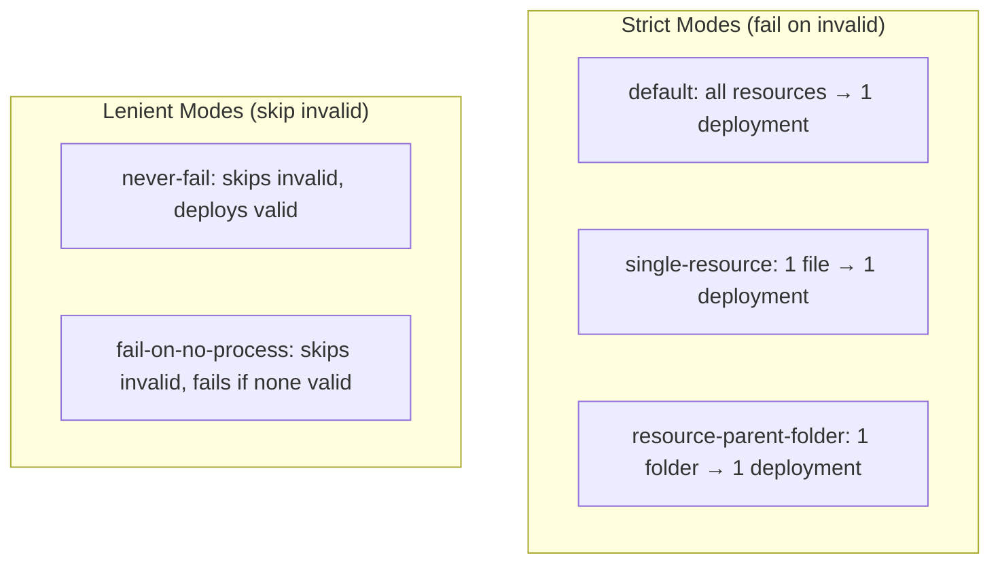
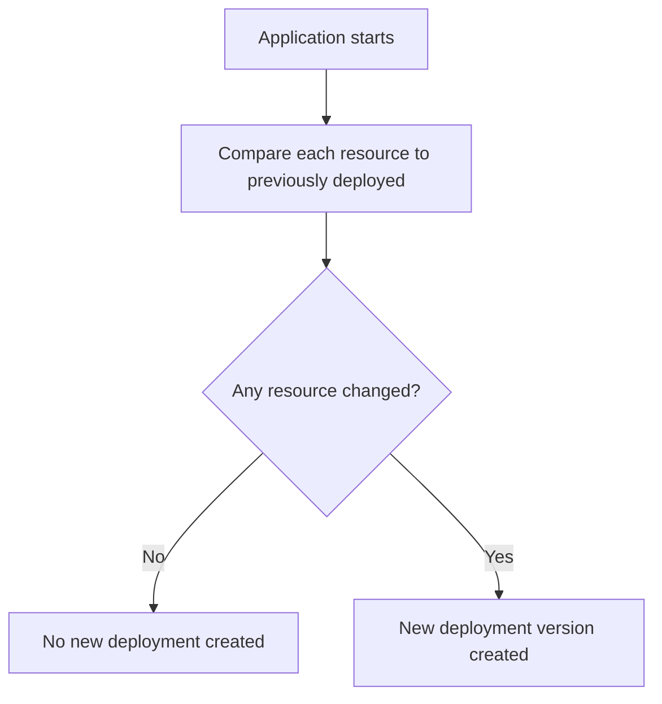

# Spring Auto-Deployment Modes

When using the Activiti Spring Boot starter, BPMN resources discovered on the classpath are automatically deployed at application startup. The `deploymentMode` property controls **how** resources are grouped into deployments, which directly affects versioning, activation behavior, and failure handling.

## Configuration

```yaml
# application.yml
activiti:
  deployment-mode: "default"
```

```java
// Or programmatically via ProcessEngineConfigurationConfigurer
@Bean
public ProcessEngineConfigurationConfigurer deploymentConfigurer() {
    return config -> config.setDeploymentMode("single-resource");
}
```

## Available Modes

### `default` (Single Deployment)

All discovered resources are grouped into **one deployment**. This is the simplest mode and matches legacy behavior.

- One deployment containing all BPMN files
- Duplicate filtering enabled — unchanged resources won't create a new version
- If any resource fails validation, the entire deployment fails and the application won't start

**Use when:** You want all processes versioned together and deployed atomically.

### `single-resource` (One per File)

Each BPMN resource is deployed in its **own separate deployment**.

- One deployment per `.bpmn` / `.bpmn20.xml` file
- Duplicate filtering per file — only changed files bump versions
- Independent versioning — modifying one process doesn't affect others

**Use when:** You frequently update individual processes and want granular version control.

### `resource-parent-folder` (Group by Directory)

Resources are grouped by their **parent folder** into separate deployments.

- One deployment per distinct parent directory
- Deployment names prefixed with the `deploymentName` hint
- Invalid resources in a folder only affect that folder's deployment

**Use when:** You organize processes by domain or module and want deployment boundaries to match.

### `never-fail` (Best-Effort)

Invalid resources are **skipped** — the application always starts.

- Validates each resource before adding to deployment
- Invalid resources are logged and excluded (not thrown)
- Only valid resources are included; if none are valid, no deployment is created
- Duplicate filtering enabled

**Use when:** You have optional process definitions (e.g., different environments, profiles) and don't want a missing file to prevent startup.

### `fail-on-no-process` (Strict Validation)

Similar to `never-fail` but **throws an exception** if zero valid processes are deployed.

- Validates and skips invalid resources (same as `never-fail`)
- Fails startup if no valid process definitions are found
- Prevents silent failures where the engine starts with nothing to run

**Use when:** Processes are mandatory — the application should fail fast if none are available.

## Mode Comparison

| Mode | Deployment Count | Invalid Resources | Version Control |
|------|-----------------|-------------------|-----------------|
| `default` | 1 | Fails startup | All-or-nothing |
| `single-resource` | 1 per file | Fails startup | Per file |
| `resource-parent-folder` | 1 per folder | Fails startup | Per folder |
| `never-fail` | 1 (if valid exist) | Skipped + logged | All-or-nothing |
| `fail-on-no-process` | 1 (if valid exist) | Skipped + logged | All-or-nothing |



## How Duplicate Filtering Works

All auto-deployment modes enable duplicate filtering by default. This prevents unnecessary version bumps on every restart:



## Custom Deployment Strategies

You can implement your own deployment strategy by extending `AbstractAutoDeploymentStrategy`:

```java
public class CustomDeploymentStrategy extends AbstractAutoDeploymentStrategy {

    public static final String DEPLOYMENT_MODE = "custom";

    public CustomDeploymentStrategy(ApplicationUpgradeContextService service) {
        super(service);
    }

    @Override
    protected String getDeploymentMode() {
        return DEPLOYMENT_MODE;
    }

    @Override
    public void deployResources(String nameHint, Resource[] resources,
            RepositoryService repositoryService) {
        // Custom grouping, validation, or deployment logic
    }
}
```

Register it by overriding `getAutoDeploymentStrategy` in a custom `SpringProcessEngineConfiguration`:

```java
public class CustomSpringProcessEngineConfiguration extends SpringProcessEngineConfiguration {

    private final Map<String, AutoDeploymentStrategy> customStrategies = new HashMap<>();

    public CustomSpringProcessEngineConfiguration(ApplicationUpgradeContextService service) {
        customStrategies.put("custom", new CustomDeploymentStrategy(service));
    }

    @Override
    protected AutoDeploymentStrategy getAutoDeploymentStrategy(String mode) {
        AutoDeploymentStrategy strategy = customStrategies.get(mode);
        return strategy != null ? strategy : super.getAutoDeploymentStrategy(mode);
    }
}
```

Then set `deploymentMode` to `"custom"` on the configuration.

## Resource Discovery

Resources are discovered via `ResourceFinder` configured in Spring Boot properties:

```yaml
activiti:
  resource-finder-descriptors:
    - paths:
        - 'classpath*:processes/*.bpmn'
        - 'classpath*:processes/*.bpmn20.xml'
```

The deployment mode then groups these discovered resources into deployments according to the selected strategy.

## Related Documentation

- [Configuration](../configuration.md) — Engine configuration overview
- [Advanced Deployment Builder](../advanced/deployment-builder.md) — Manual deployment API
