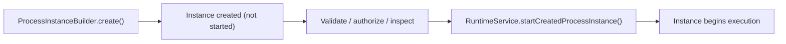
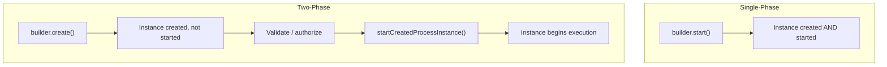

# Create-then-Start Process Instances

The create-then-start pattern allows a **two-phase process instance lifecycle**: first create the instance in a pre-started state, then start it explicitly. This is useful for pre-authorization, validation, or deferred execution scenarios.

## How It Works



A created instance has all its variables set and exists in the database, but its BPMN flow has not started executing yet.

## API

```java
// Phase 1: Create (pre-started)
ProcessInstance createdInstance = runtimeService.createProcessInstanceBuilder()
    .processDefinitionKey("orderProcess")
    .businessKey("ORD-12345")
    .variables(Map.of(
        "customerId", "CUST-001",
        "orderAmount", 5000L
    ))
    .create();  // Returns ProcessInstance in CREATED state

String instanceId = createdInstance.getId();

// ... validation, authorization, or inspection between phases ...

// Phase 2: Start (begins execution)
ProcessInstance runningInstance = runtimeService.startCreatedProcessInstance(
    createdInstance,
    Map.of("authorizedBy", "admin")  // Additional variables at start time
);
```

## Builder Options

The `ProcessInstanceBuilder` supports all standard options before either `create()` or `start()`:

```java
ProcessInstanceBuilder builder = runtimeService.createProcessInstanceBuilder();

// By key (latest version) or by explicit ID
builder.processDefinitionKey("myProcess");
builder.processDefinitionId("myProcess:3:45678");

// Business metadata
builder.businessKey("ORDER-001");
builder.name("Custom process instance name");
builder.tenantId("tenant-123");

// Variables
builder.variables(Map.of("var1", "value1"));
builder.variable("var2", "value2");
builder.transientVariables(Map.of("tempVar", "tempValue"));
builder.transientVariable("tempVar2", "tempValue2");

// Start via message
builder.messageName("startMessage");

// Execute
builder.create();   // Two-phase: create then start later
builder.start();    // Single-phase: create and start immediately
```

## Use Cases

### Pre-Authorization

```java
// Create the process with initial data
ProcessInstance created = runtimeService.createProcessInstanceBuilder()
    .processDefinitionKey("loanProcess")
    .variables(loanData)
    .create();

// A manager reviews and approves
if (managerApproves(created)) {
    runtimeService.startCreatedProcessInstance(created, Map.of("approvedBy", managerId));
} else {
    runtimeService.deleteProcessInstance(created.getId(), "Not authorized");
}
```

### Data Validation

```java
ProcessInstance created = runtimeService.createProcessInstanceBuilder()
    .processDefinitionKey("onboardingProcess")
    .variables(inputData)
    .create();

// Validate data against external systems before committing to execution
ValidationResult result = validateExternal(created.getId(), inputData);
if (result.isValid()) {
    runtimeService.startCreatedProcessInstance(created, null);
} else {
    runtimeService.deleteProcessInstance(created.getId(), result.getReason());
}
```

### Deferred Start

```java
// Create now, start later (e.g., after batch collection)
List<ProcessInstance> batch = new ArrayList<>();
for (Order order : incomingOrders) {
    batch.add(runtimeService.createProcessInstanceBuilder()
        .processDefinitionKey("orderProcess")
        .businessKey(order.getId())
        .variables(order.toMap())
        .create());
}

// Start all at once at optimal time
for (ProcessInstance pi : batch) {
    runtimeService.startCreatedProcessInstance(pi, null);
}
```

## Created Instance State

A process instance in the CREATED state:
- Exists in `ACT_RU_EXECUTION` and `ACT_RU_VARIABLE` tables
- Has variables populated but no activity started
- Does not execute timers or jobs
- Can be queried via `ProcessInstanceQuery`
- Can be deleted with `RuntimeService.deleteProcessInstance()`
- Can be started with `RuntimeService.startCreatedProcessInstance()`

## Comparison: create() vs start()

| Method | Lifecycle | Use Case |
|--------|-----------|----------|
| `builder.start()` | Single-phase | Standard process start |
| `builder.create()` then `startCreatedProcessInstance()` | Two-phase | Pre-authorization, validation |
| `startProcessInstanceByKey()` | Single-phase | Quick start by key |



## Related Documentation

- [Runtime Service API](../../api-reference/engine-api/runtime-service.md) — Full runtime operations
- [Process Instance Suspension](./process-instance-suspension.md) — Pausing instances
