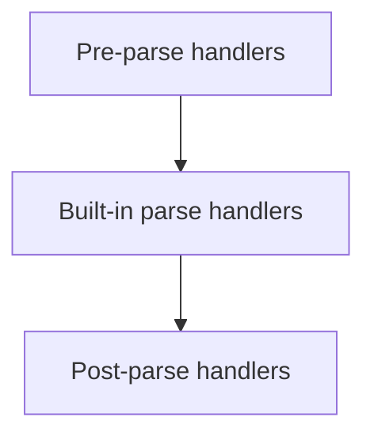
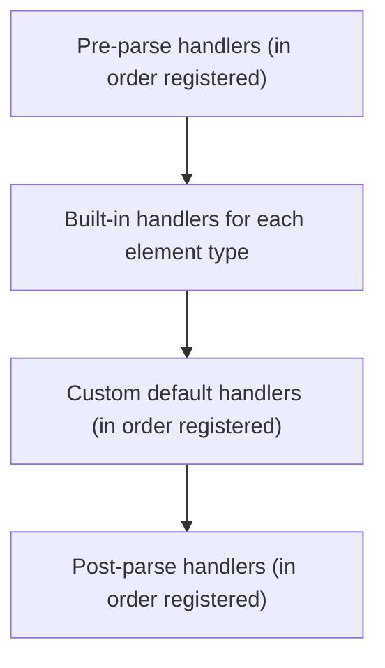

# Custom BPMN Parse Handlers

Parse handlers allow you to customize how BPMN elements are parsed when a process definition is deployed. This is the primary mechanism for adding support for custom BPMN extensions, modifying behavior of existing elements, or injecting custom activity behavior.

## How Parsing Works

When a process definition is deployed, the engine parses the BPMN XML and converts each element into executable behavior. The parsing pipeline has three stages:



Each handler is invoked for specific BPMN element types it declares interest in.

## Creating a Parse Handler

### Using the Abstract Base Class (Recommended)

```java
public class CustomUserTaskHandler extends AbstractBpmnParseHandler<UserTask> {

    @Override
    protected Class<? extends BaseElement> getHandledType() {
        return UserTask.class;
    }

    @Override
    protected void executeParse(BpmnParse bpmnParse, UserTask userTask) {
        // Access the BPMN model
        BpmnModel model = bpmnParse.getBpmnModel();

        // Modify the element directly — parse handlers set behavior on the model element
        userTask.setBehavior(bpmnParse.getActivityBehaviorFactory()
            .createUserTaskActivityBehavior(userTask));
    }
}
```

### Implementing the Interface Directly

```java
public class MultiTypeHandler implements BpmnParseHandler {

    @Override
    public Collection<Class<? extends BaseElement>> getHandledTypes() {
        Set<Class<? extends BaseElement>> types = new HashSet<>();
        types.add(UserTask.class);
        types.add(ServiceTask.class);
        types.add(Task.class);
        return types;
    }

    @Override
    public void parse(BpmnParse bpmnParse, BaseElement element) {
        if (element instanceof UserTask) {
            processUserTask(bpmnParse, (UserTask) element);
        } else if (element instanceof ServiceTask) {
            processServiceTask(bpmnParse, (ServiceTask) element);
        }
    }
}
```

## Registering Parse Handlers

### Programmatic Configuration

The `setPreBpmnParseHandlers`, `setCustomDefaultBpmnParseHandlers`, and `setPostBpmnParseHandlers` methods exist on `ProcessEngineConfigurationImpl` (not the `ProcessEngineConfiguration` interface):

```java
ProcessEngineConfigurationImpl config = new ProcessEngineConfigurationImpl();

// Pre-parse (runs before built-in handlers)
config.setPreBpmnParseHandlers(Arrays.asList(
    new CustomPreParseHandler()
));

// Custom default (runs alongside built-in handlers)
config.setCustomDefaultBpmnParseHandlers(Arrays.asList(
    new CustomUserTaskHandler()
));

// Post-parse (runs after all built-in handlers)
config.setPostBpmnParseHandlers(Arrays.asList(
    new CustomPostParseHandler()
));
```

### Spring Boot

```java
@Bean
public ProcessEngineConfigurationConfigurer parseHandlerConfigurer() {
    return config -> {
        // SpringProcessEngineConfiguration extends ProcessEngineConfigurationImpl,
        // so the setter methods are available
        config.setPreBpmnParseHandlers(Arrays.asList(
            new SecurityAnnotationHandler()
        ));
        config.setCustomDefaultBpmnParseHandlers(Arrays.asList(
            new CustomUserTaskHandler()
        ));
    };
}
```

## BpmnParse Context

The `BpmnParse` object passed to handlers provides access to parsing context:

```java
protected void executeParse(BpmnParse bpmnParse, UserTask userTask) {
    // BPMN model being parsed
    BpmnModel model = bpmnParse.getBpmnModel();

    // Process definition entity being built
    ProcessDefinitionEntity processDefinition = bpmnParse.getCurrentProcessDefinition();

    // Activity behavior factory — use this to create custom behaviors
    ActivityBehaviorFactory factory = bpmnParse.getActivityBehaviorFactory();
}
```

## Common Use Cases

### Wrapping Activity Behavior

The built-in parse handlers modify elements by calling `element.setBehavior()`:

```java
public class AuditUserTaskHandler extends AbstractBpmnParseHandler<UserTask> {

    @Override
    protected Class<? extends BaseElement> getHandledType() {
        return UserTask.class;
    }

    @Override
    protected void executeParse(BpmnParse bpmnParse, UserTask userTask) {
        // Wrap the default user task behavior with audit logic
        ActivityBehavior original = bpmnParse.getActivityBehaviorFactory()
            .createUserTaskActivityBehavior(userTask);

        userTask.setBehavior(new ActivityBehavior() {
            @Override
            public void execute(DelegateExecution execution) {
                // Pre-execution audit
                auditService.recordTaskStart(execution.getCurrentActivityId());
                original.execute(execution);
            }
        });
    }
}
```

### Adding Default Execution Listeners

```java
public class DefaultUserTaskHandler extends AbstractBpmnParseHandler<UserTask> {

    @Override
    protected Class<? extends BaseElement> getHandledType() {
        return UserTask.class;
    }

    @Override
    protected void executeParse(BpmnParse bpmnParse, UserTask userTask) {
        // Add a default execution listener to every user task
        ActivitiListener listener = new ActivitiListener();
        listener.setEvent("start");
        listener.setImplementationType("class");
        listener.setImplementation(DefaultTaskListener.class.getName());
        userTask.getExecutionListeners().add(listener);
    }
}
```

### Pre-Parse: Validate All Processes

```java
public class ProcessValidatorHandler implements BpmnParseHandler {

    @Override
    public Collection<Class<? extends BaseElement>> getHandledTypes() {
        return Arrays.asList(Process.class);
    }

    @Override
    public void parse(BpmnParse bpmnParse, BaseElement element) {
        if (element instanceof Process) {
            Process process = (Process) element;
            // Validate before built-in handlers run
            for (FlowElement flowElement : process.getFlowElements()) {
                if (flowElement instanceof UserTask) {
                    UserTask task = (UserTask) flowElement;
                    if (task.getName() == null || task.getName().isEmpty()) {
                        // Log warning — validation errors prevent deployment
                        log.warn("User task '{}' has no name", task.getId());
                    }
                }
            }
        }
    }
}
```

### Post-Parse: Modify All Behaviors

```java
public class TimeoutHandler implements BpmnParseHandler {

    @Override
    public Collection<Class<? extends BaseElement>> getHandledTypes() {
        return Arrays.asList(UserTask.class, ServiceTask.class);
    }

    @Override
    public void parse(BpmnParse bpmnParse, BaseElement element) {
        if (element instanceof Activity) {
            Activity activity = (Activity) element;
            // Ensure all activities have a default timeout
            if (activity.getDefaultTimeout() == null) {
                activity.setDefaultTimeout("PT30M"); // 30 minutes
            }
        }
    }
}
```

## Handler Execution Order



Handlers registered in the same phase execute in the order they were added to the configuration.

## Key Points

- Parse handlers modify the **BPMN model element** directly (e.g., `userTask.setBehavior()`), not a separate runtime activity object
- The `AbstractBpmnParseHandler<T>` base class provides `createExecutionListener()` for building listeners from `ActivitiListener` model objects
- Use **pre-parse** to transform the model before the engine processes it
- Use **custom default** to add to or replace behavior alongside built-in handlers
- Use **post-parse** to inspect and modify the final model after all built-in processing is complete

## Related Documentation

- [Process Validation](../../api-reference/engine-api/process-validation.md) — Custom validation rules
- [Configuration](../../configuration.md) — Engine configuration
- [Engine Event System](./engine-event-system.md) — Runtime events
