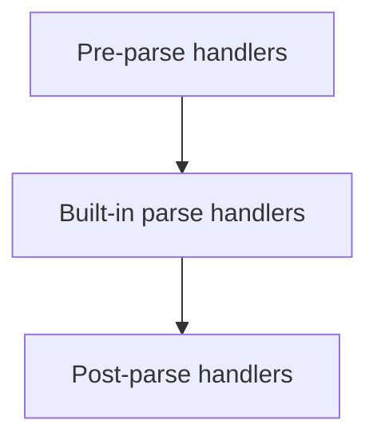
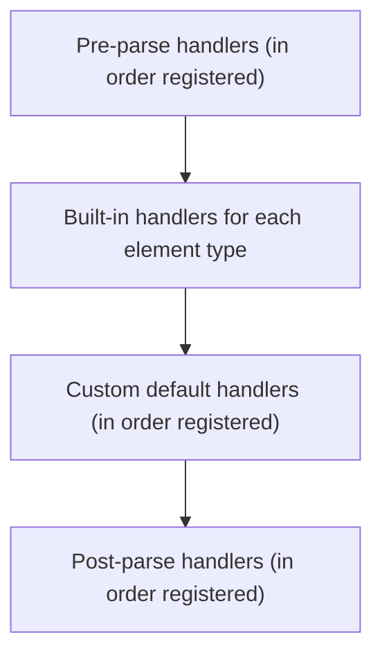

# Custom BPMN Parse Handlers

Parse handlers allow you to customize how BPMN elements are parsed when a process definition is deployed. This is the primary mechanism for adding support for custom BPMN extensions, modifying behavior of existing elements, or injecting custom activity behavior.

## How Parsing Works

When a process definition is deployed, the engine parses the BPMN XML and converts each element into executable behavior. The parsing pipeline has three stages:


```mermaid
flowchart TD
    A["Pre-parse handlers"] --> B["Built-in parse handlers"]
    B --> C["Post-parse handlers"]
```

Each handler is invoked for specific BPMN element types it declares interest in.

## Creating a Parse Handler

### Using the Abstract Base Class (Recommended)

```java
public class CustomUserTaskHandler extends AbstractBpmnParseHandler<UserTask> {

    @Override
    protected Class<? extends BaseElement> getHandledType() {
        return UserTask.class;
    }

    @Override
    protected void executeParse(BpmnParse bpmnParse, UserTask userTask) {
        // Access the BPMN model
        BpmnModel model = bpmnParse.getBpmnModel();

        // Modify the element directly — parse handlers set behavior on the model element
        userTask.setBehavior(bpmnParse.getActivityBehaviorFactory()
            .createUserTaskActivityBehavior(userTask));
    }
}
```

### Implementing the Interface Directly

```java
public class MultiTypeHandler implements BpmnParseHandler {

    @Override
    public Collection<Class<? extends BaseElement>> getHandledTypes() {
        Set<Class<? extends BaseElement>> types = new HashSet<>();
        types.add(UserTask.class);
        types.add(ServiceTask.class);
        types.add(Task.class);
        return types;
    }

    @Override
    public void parse(BpmnParse bpmnParse, BaseElement element) {
        if (element instanceof UserTask) {
            processUserTask(bpmnParse, (UserTask) element);
        } else if (element instanceof ServiceTask) {
            processServiceTask(bpmnParse, (ServiceTask) element);
        }
    }
}
```

## Registering Parse Handlers

### Programmatic Configuration

The `setPreBpmnParseHandlers`, `setCustomDefaultBpmnParseHandlers`, and `setPostBpmnParseHandlers` methods exist on `ProcessEngineConfigurationImpl` (not the `ProcessEngineConfiguration` interface):

```java
ProcessEngineConfigurationImpl config = new ProcessEngineConfigurationImpl();

// Pre-parse (runs before built-in handlers)
config.setPreBpmnParseHandlers(Arrays.asList(
    new CustomPreParseHandler()
));

// Custom default (runs alongside built-in handlers)
config.setCustomDefaultBpmnParseHandlers(Arrays.asList(
    new CustomUserTaskHandler()
));

// Post-parse (runs after all built-in handlers)
config.setPostBpmnParseHandlers(Arrays.asList(
    new CustomPostParseHandler()
));
```

### Spring Boot

```java
@Bean
public ProcessEngineConfigurationConfigurer parseHandlerConfigurer() {
    return config -> {
        // SpringProcessEngineConfiguration extends ProcessEngineConfigurationImpl,
        // so the setter methods are available
        config.setPreBpmnParseHandlers(Arrays.asList(
            new SecurityAnnotationHandler()
        ));
        config.setCustomDefaultBpmnParseHandlers(Arrays.asList(
            new CustomUserTaskHandler()
        ));
    };
}
```

## BpmnParse Context

The `BpmnParse` object passed to handlers provides access to parsing context:

```java
protected void executeParse(BpmnParse bpmnParse, UserTask userTask) {
    // BPMN model being parsed
    BpmnModel model = bpmnParse.getBpmnModel();

    // Process definition entity being built
    ProcessDefinitionEntity processDefinition = bpmnParse.getCurrentProcessDefinition();

    // Activity behavior factory — use this to create custom behaviors
    ActivityBehaviorFactory factory = bpmnParse.getActivityBehaviorFactory();
}
```

## Common Use Cases

### Wrapping Activity Behavior

The built-in parse handlers modify elements by calling `element.setBehavior()`:

```java
public class AuditUserTaskHandler extends AbstractBpmnParseHandler<UserTask> {

    @Override
    protected Class<? extends BaseElement> getHandledType() {
        return UserTask.class;
    }

    @Override
    protected void executeParse(BpmnParse bpmnParse, UserTask userTask) {
        // Wrap the default user task behavior with audit logic
        ActivityBehavior original = bpmnParse.getActivityBehaviorFactory()
            .createUserTaskActivityBehavior(userTask);

        userTask.setBehavior(new ActivityBehavior() {
            @Override
            public void execute(DelegateExecution execution) {
                // Pre-execution audit
                auditService.recordTaskStart(execution.getCurrentActivityId());
                original.execute(execution);
            }
        });
    }
}
```

### Adding Default Execution Listeners

```java
public class DefaultUserTaskHandler extends AbstractBpmnParseHandler<UserTask> {

    @Override
    protected Class<? extends BaseElement> getHandledType() {
        return UserTask.class;
    }

    @Override
    protected void executeParse(BpmnParse bpmnParse, UserTask userTask) {
        // Add a default execution listener to every user task
        ActivitiListener listener = new ActivitiListener();
        listener.setEvent("start");
        listener.setImplementationType("class");
        listener.setImplementation(DefaultTaskListener.class.getName());
        userTask.getExecutionListeners().add(listener);
    }
}
```

### Pre-Parse: Validate All Processes

```java
public class ProcessValidatorHandler implements BpmnParseHandler {

    @Override
    public Collection<Class<? extends BaseElement>> getHandledTypes() {
        return Arrays.asList(Process.class);
    }

    @Override
    public void parse(BpmnParse bpmnParse, BaseElement element) {
        if (element instanceof Process) {
            Process process = (Process) element;
            // Validate before built-in handlers run
            for (FlowElement flowElement : process.getFlowElements()) {
                if (flowElement instanceof UserTask) {
                    UserTask task = (UserTask) flowElement;
                    if (task.getName() == null || task.getName().isEmpty()) {
                        // Log warning — validation errors prevent deployment
                        log.warn("User task '{}' has no name", task.getId());
                    }
                }
            }
        }
    }
}
```

### Post-Parse: Modify All Behaviors

```java
public class DefaultDueDateHandler implements BpmnParseHandler {

    @Override
    public Collection<Class<? extends BaseElement>> getHandledTypes() {
        return Arrays.asList(UserTask.class);
    }

    @Override
    public void parse(BpmnParse bpmnParse, BaseElement element) {
        if (element instanceof UserTask) {
            UserTask userTask = (UserTask) element;
            // Ensure all user tasks have a default due date
            if (userTask.getDueDate() == null) {
                userTask.setDueDate("PT30M"); // 30 minutes
            }
        }
    }
}
```

## Handler Execution Order


```mermaid
flowchart TD
    A["Pre-parse handlers (in order registered)"] --> B["Built-in handlers for each element type"]
    B --> C["Custom default handlers (in order registered)"]
    C --> D["Post-parse handlers (in order registered)"]
```

Handlers registered in the same phase execute in the order they were added to the configuration.

## Key Points

- Parse handlers modify the **BPMN model element** directly (e.g., `userTask.setBehavior()`), not a separate runtime activity object
- The `AbstractBpmnParseHandler<T>` base class provides `createExecutionListener()` for building listeners from `ActivitiListener` model objects
- Use **pre-parse** to transform the model before the engine processes it
- Use **custom default** to add to or replace behavior alongside built-in handlers
- Use **post-parse** to inspect and modify the final model after all built-in processing is complete

## Implementing Custom ActivityBehavior

Parse handlers are one way to customize behavior. Another approach is to implement `ActivityBehavior` directly — the fundamental interface that every BPMN element executes through at runtime.

### The Class Hierarchy

```
ActivityBehavior (interface)
├── void execute(DelegateExecution execution)
│
└── FlowNodeActivityBehavior (abstract)
    ├── void execute(DelegateExecution) — plans to take outgoing sequence flows
    └── void leave(DelegateExecution) — triggers the flow
    │
    └── AbstractBpmnActivityBehavior (abstract)
        ├── MultiInstanceActivityBehavior multiInstanceActivityBehavior
        ├── void leave(DelegateExecution) — handles compensation boundary events + multi-instance
        ├── boolean hasLoopCharacteristics()
        ├── boolean hasMultiInstanceCharacteristics()
        └── void executeCompensateBoundaryEvents(...)
```

| Class | When to Use |
|-------|-------------|
| `ActivityBehavior` | Complete control over execution (rare) |
| `FlowNodeActivityBehavior` | Element that transitions to outgoing sequence flows |
| `AbstractBpmnActivityBehavior` | Activities that may have boundary events or multi-instance |

### The `leave()` Method

`AbstractBpmnActivityBehavior.leave()` is the recommended way to complete an activity. It handles:

1. **Compensation boundary events** — checks for non-interrupting compensate boundary events and schedules them
2. **Multi-instance completion** — delegates to `multiInstanceActivityBehavior.leave()` if the activity has loop characteristics
3. **Normal flow continuation** — calls `super.leave()` (which plans `TakeOutgoingSequenceFlowsOperation` on the agenda)

```java
public class CustomActivityBehavior extends AbstractBpmnActivityBehavior {
    @Override
    public void execute(DelegateExecution execution) {
        // Your custom logic here
        String result = myService.doWork(execution);
        execution.setVariable("result", result);

        // Complete the activity — handles compensation and multi-instance automatically
        leave(execution);
    }
}
```

If you need to **bypass** compensation or multi-instance handling, call `super.leave(execution)` instead (from `FlowNodeActivityBehavior`), or manually plan operations on the agenda.

### Wiring a Custom ActivityBehavior

In a parse handler:

```java
public class CustomElementHandler extends AbstractBpmnParseHandler<CustomElement> {

    @Override
    protected Class<? extends BaseElement> getHandledType() {
        return CustomElement.class;
    }

    @Override
    protected void executeParse(BpmnParse bpmnParse, CustomElement element) {
        element.setBehavior(new CustomActivityBehavior());
    }
}
```

Note that `setBehavior(Object)` is declared on `FlowNode`, not on `BaseElement` — a hypothetical custom element type such as `CustomElement` must extend `FlowNode` (directly, or via a subclass such as `UserTask`) for this to compile.

Or override the `ActivityBehaviorFactory`:

```java
ProcessEngineConfiguration config = ...;
config.setActivityBehaviorFactory(new CustomActivityBehaviorFactory());
```

### When to Call `leave()` vs Handle Manually

| Pattern | Code |
|---------|------|
| Activity completes normally | `leave(execution)` |
| Activity waits for external event | Set up `IntermediateCatchMessageEventActivityBehavior` or similar |
| Activity creates a sub-execution | Create a child execution and mark it as a scope: `Context.getCommandContext().getExecutionEntityManager().createChildExecution((ExecutionEntity) execution)` + `childExecution.setScope(true)` (the pattern the engine's own behaviors use) |
| Activity destroys its scope | Call `Context.getAgenda().planDestroyScopeOperation((ExecutionEntity) execution)` |
| Activity completes and triggers specific flow | Use `DelegateHelper.leaveDelegate(execution, sequenceFlowId)` |

## Related Documentation

- [Process Validation](../api-reference/engine-api/process-validation.md) — Custom validation rules
- [Configuration](../configuration.md) — Engine configuration
- [Engine Event System](./engine-event-system.md) — Runtime events
