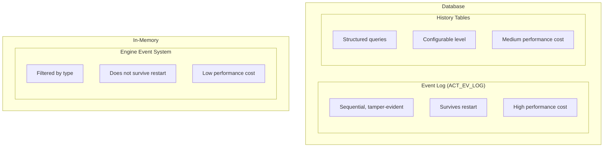
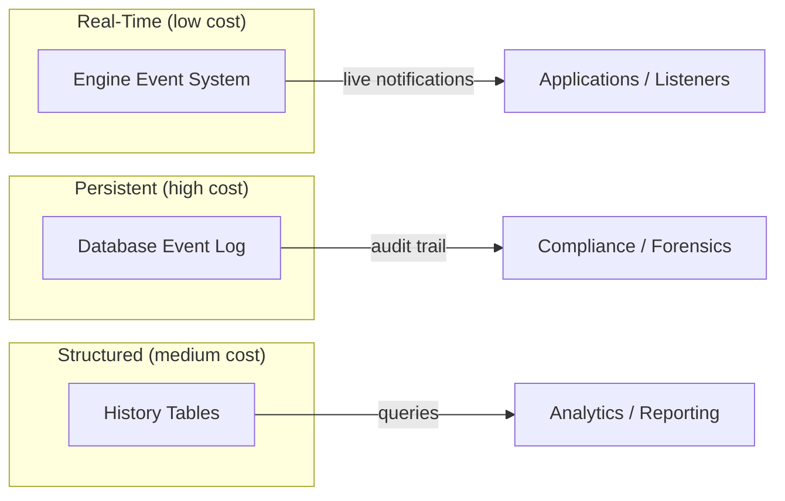

# Database Event Logging

Database event logging provides a persistent, sequential record of every operation performed by the engine. Unlike the in-memory event dispatcher (which notifies listeners), database event logging writes structured entries to the `ACT_EV_LOG` table that survive application restarts.

## Enabling Database Event Logging

```java
ProcessEngineConfiguration config = new ProcessEngineConfigurationImpl();
config.setEnableDatabaseEventLogging(true);
```

```xml
<!-- activiti.cfg.xml -->
<property name="enableDatabaseEventLogging" value="true"/>
```

This is **disabled by default** and should be used selectively due to the performance and storage overhead.

## Event Log Entry Structure

```java
public interface EventLogEntry {
    long   getLogNumber();           // Sequential log number
    String getType();                // Event type
    String getProcessDefinitionId(); // Process definition
    String getProcessInstanceId();   // Process instance
    String getExecutionId();         // Execution
    String getTaskId();              // Associated task (if any)
    Date   getTimeStamp();           // Event timestamp
    String getUserId();              // User who triggered the event
    byte[] getData();                // Serialized event data (binary payload)
}
```

## Querying Event Logs

```java
// Get the latest 100 entries
List<EventLogEntry> recentEntries = managementService
    .getEventLogEntries(null, 100L);

// Get entries for a specific process instance
List<EventLogEntry> processEntries = managementService
    .getEventLogEntriesByProcessInstanceId("processInstanceId");

// Paginated: start from log number 1000, get 50 entries
List<EventLogEntry> page = managementService
    .getEventLogEntries(1000L, 50L);

// Delete a specific entry (typically for testing)
managementService.deleteEventLogEntry(1000L);
```

## Use Cases

### Forensic Analysis

```java
// Reconstruct the full timeline of a process instance
List<EventLogEntry> timeline = managementService
    .getEventLogEntriesByProcessInstanceId(processInstanceId);

for (EventLogEntry entry : timeline) {
    System.out.printf("[%d] %s - %s (user: %s)%n",
        entry.getLogNumber(),
        entry.getTimeStamp(),
        entry.getType(),
        entry.getUserId());
}
```

### Compliance Audit

The sequential log numbers and timestamps provide a tamper-evident audit trail. Unlike history tables (which can be modified), event log entries are appended and assigned monotonically increasing sequence numbers.

```java
// Verify log continuity
List<EventLogEntry> allEntries = managementService.getEventLogEntries(null, null);
long expectedSeq = 1;
for (EventLogEntry entry : allEntries) {
    if (entry.getLogNumber() != expectedSeq) {
        log.warn("Gap in event log at sequence {}", expectedSeq);
    }
    expectedSeq++;
}
```

### Performance Diagnostics

```java
// Measure time between key events
List<EventLogEntry> entries = managementService
    .getEventLogEntriesByProcessInstanceId(processInstanceId);

LocalDateTime start = null, end = null;
for (EventLogEntry entry : entries) {
    if (entry.getType().contains("PROCESS_STARTED") && start == null) {
        start = LocalDateTime.ofInstant(entry.getTimeStamp().toInstant(), ZoneId.systemDefault());
    }
    if (entry.getType().contains("PROCESS_COMPLETED")) {
        end = LocalDateTime.ofInstant(entry.getTimeStamp().toInstant(), ZoneId.systemDefault());
    }
}
if (start != null && end != null) {
    Duration duration = Duration.between(start, end);
    System.out.println("Process duration: " + duration.toSeconds() + "s");
}
```

## Event Log vs History vs Engine Events

| Feature | Database Event Log | History Tables | Engine Event System |
|---------|-------------------|----------------|---------------------|
| Persistence | Database (sequential) | Database (structured) | In-memory listeners |
| Granularity | Every engine operation | Configured by level | Configured by listener |
| Tamper evidence | Sequential log numbers | No | No |
| Survives restart | Yes | Yes | No |
| Query flexibility | By log number, process ID | Rich query API | N/A (push model) |
| Performance cost | High | Medium (FULL level) | Low (filtered) |
| Enable | `setEnableDatabaseEventLogging` | `setHistoryLevel` | `setEnableEventDispatcher` |



## Best Practices

1. **Enable selectively** — Use in production only for compliance requirements or debugging specific issues
2. **Clean up periodically** — The log table grows without bound; implement retention policies
3. **Combine with engine events** — Use the event system for real-time processing and the DB log for persistence
4. **Monitor table size** — Check `ACT_EV_LOG` growth, especially with high-volume processes



## Related Documentation

- [Engine Event System](./engine-event-system.md) — In-memory event listeners
- [Historic Variable Updates](./historic-variable-updates.md) — Variable change tracking
- [Management Service API](../../api-reference/engine-api/management-service.md) — Management operations
