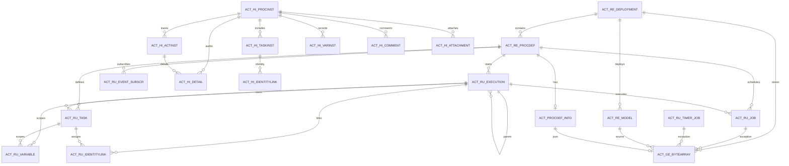
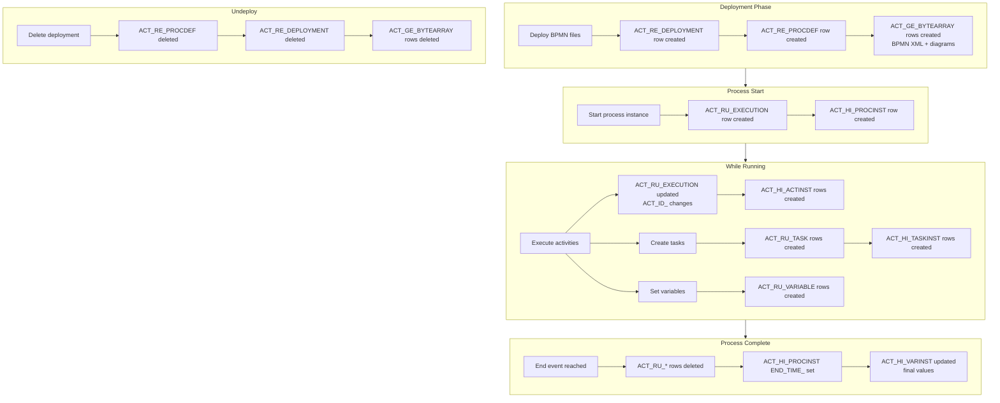

# Activiti Database Schema Reference

Activiti stores all persistent state in a set of database tables organized by four naming prefixes. Understanding this schema is essential for administration, debugging, auditing, and performance tuning.

All tables are created automatically when the engine starts with `databaseSchemaUpdate` enabled. The schema version is tracked in `ACT_GE_PROPERTY`.

## Table Naming Conventions

| Prefix | Category | Purpose |
|--------|----------|---------|
| `ACT_RE_*` | **Re**pository | Static data: process definitions, deployments, models |
| `ACT_RU_*` | **Ru**ntime | Execution data: running instances, tasks, jobs, variables |
| `ACT_HI_*` | **Hi**story | Historical records of completed processes and activities |
| `ACT_GE_*` | **Ge**neral | Shared data: properties, binary resources |

Additionally, Activiti uses tables without a prefix pattern for specific purposes:

| Table | Purpose |
|-------|---------|
| `ACT_PROCDEF_INFO` | Process definition extension info (form keys, modeler metadata) |
| `ACT_EVT_LOG` | Event logging for engine event audit trail |

## Schema Diagram



---

## Repository Tables (ACT_RE_*)

Repository tables store static, read-mostly data. Entries are created during deployment and remain until a deployment is deleted.

### ACT_RE_DEPLOYMENT

Deployment metadata. One row per deployment.

| Column | Type | Description |
|--------|------|-------------|
| `ID_` | VARCHAR(64) | Primary key |
| `NAME_` | VARCHAR(255) | Deployment name |
| `CATEGORY_` | VARCHAR(255) | Deployment category |
| `KEY_` | VARCHAR(255) | Deployment key |
| `TENANT_ID_` | VARCHAR(255) | Tenant ID (default `''`) |
| `DEPLOY_TIME_` | TIMESTAMP | Deployment timestamp |
| `ENGINE_VERSION_` | VARCHAR(255) | Activiti engine version |
| `VERSION_` | INTEGER | Deployment version number |
| `PROJECT_RELEASE_VERSION_` | VARCHAR(255) | Project release version |

### ACT_RE_PROCDEF

Process definitions. Multiple rows can exist for the same process key (different versions).

| Column | Type | Description |
|--------|------|-------------|
| `ID_` | VARCHAR(64) | Primary key (format: `key:version:deploymentId`) |
| `REV_` | INTEGER | Optimistic lock revision |
| `CATEGORY_` | VARCHAR(255) | Process category |
| `NAME_` | VARCHAR(255) | Process name |
| `KEY_` | VARCHAR(255) | Process definition key |
| `VERSION_` | INTEGER | Version number (auto-incremented per key) |
| `DEPLOYMENT_ID_` | VARCHAR(64) | FK to `ACT_RE_DEPLOYMENT` |
| `RESOURCE_NAME_` | VARCHAR(4000) | BPMN XML filename |
| `DGRM_RESOURCE_NAME_` | VARCHAR(4000) | Diagram (PNG/SVG) filename |
| `DESCRIPTION_` | VARCHAR(4000) | Process description |
| `HAS_START_FORM_KEY_` | BOOLEAN | Whether start form is defined |
| `HAS_GRAPHICAL_NOTATION_` | BOOLEAN | Whether diagram notation is present |
| `SUSPENSION_STATE_` | INTEGER | 1 = active, 2 = suspended |
| `TENANT_ID_` | VARCHAR(255) | Tenant ID (default `''`) |
| `ENGINE_VERSION_` | VARCHAR(255) | Engine version at deployment |
| `APP_VERSION_` | INTEGER | Application version |

**Indexes:**
- Unique: `(KEY_, VERSION_, TENANT_ID_)`

### ACT_RE_MODEL

Stored process models (e.g., from Modeler).

| Column | Type | Description |
|--------|------|-------------|
| `ID_` | VARCHAR(64) | Primary key |
| `REV_` | INTEGER | Optimistic lock revision |
| `NAME_` | VARCHAR(255) | Model name |
| `KEY_` | VARCHAR(255) | Model key |
| `CATEGORY_` | VARCHAR(255) | Model category |
| `CREATE_TIME_` | TIMESTAMP | Creation timestamp |
| `LAST_UPDATE_TIME_` | TIMESTAMP | Last modification timestamp |
| `VERSION_` | INTEGER | Version number |
| `META_INFO_` | VARCHAR(4000) | JSON metadata |
| `DEPLOYMENT_ID_` | VARCHAR(64) | FK to `ACT_RE_DEPLOYMENT` (when deployed) |
| `EDITOR_SOURCE_VALUE_ID_` | VARCHAR(64) | FK to `ACT_GE_BYTEARRAY` (BPMN XML) |
| `EDITOR_SOURCE_EXTRA_VALUE_ID_` | VARCHAR(64) | FK to `ACT_GE_BYTEARRAY` (stencil set) |
| `TENANT_ID_` | VARCHAR(255) | Tenant ID (default `''`) |

### ACT_PROCDEF_INFO

Per-process-definition extension information (form keys, modeler metadata, etc.).

| Column | Type | Description |
|--------|------|-------------|
| `ID_` | VARCHAR(64) | Primary key |
| `PROC_DEF_ID_` | VARCHAR(64) | FK to `ACT_RE_PROCDEF` (unique) |
| `REV_` | INTEGER | Optimistic lock revision |
| `INFO_JSON_ID_` | VARCHAR(64) | FK to `ACT_GE_BYTEARRAY` (JSON payload) |

**Indexes:**
- Unique: `(PROC_DEF_ID_)`

---

## Runtime Tables (ACT_RU_*)

Runtime tables hold state for currently executing processes. Rows are created when a process starts and removed when it completes. These tables represent the **live state** of the engine.

### ACT_RU_EXECUTION

Executions represent active points in a process. The root execution (where `PARENT_ID_` is NULL) is the process instance itself.

| Column | Type | Description |
|--------|------|-------------|
| `ID_` | VARCHAR(64) | Primary key |
| `REV_` | INTEGER | Optimistic lock revision |
| `PROC_INST_ID_` | VARCHAR(64) | FK to self (root execution). NULL for subprocess executions |
| `BUSINESS_KEY_` | VARCHAR(255) | Business key of the process instance |
| `PARENT_ID_` | VARCHAR(64) | FK to self (parent execution) |
| `PROC_DEF_ID_` | VARCHAR(64) | FK to `ACT_RE_PROCDEF` |
| `SUPER_EXEC_` | VARCHAR(64) | FK to self (super-process execution for call activities) |
| `ROOT_PROC_INST_ID_` | VARCHAR(64) | FK to self (root process instance in nested hierarchies) |
| `ACT_ID_` | VARCHAR(255) | Current activity ID |
| `IS_ACTIVE_` | BOOLEAN | Whether execution is active (vs. completed) |
| `IS_CONCURRENT_` | BOOLEAN | Whether execution is in a concurrent branch |
| `IS_SCOPE_` | BOOLEAN | Whether execution is a scope boundary |
| `IS_EVENT_SCOPE_` | BOOLEAN | Whether execution is an event scope |
| `IS_MI_ROOT_` | BOOLEAN | Whether execution is a multi-instance root |
| `SUSPENSION_STATE_` | INTEGER | 1 = active, 2 = suspended |
| `CACHED_ENT_STATE_` | INTEGER | Cached entity state |
| `TENANT_ID_` | VARCHAR(255) | Tenant ID |
| `NAME_` | VARCHAR(255) | Execution name |
| `START_TIME_` | TIMESTAMP | Start time |
| `START_USER_ID_` | VARCHAR(255) | User who started the process |
| `LOCK_TIME_` | TIMESTAMP | Lock time for optimistic locking |
| `IS_COUNT_ENABLED_` | BOOLEAN | Whether entity counts are maintained |
| `EVT_SUBSCR_COUNT_` | INTEGER | Cached event subscription count |
| `TASK_COUNT_` | INTEGER | Cached task count |
| `JOB_COUNT_` | INTEGER | Cached job count |
| `TIMER_JOB_COUNT_` | INTEGER | Cached timer job count |
| `SUSP_JOB_COUNT_` | INTEGER | Cached suspended job count |
| `DEADLETTER_JOB_COUNT_` | INTEGER | Cached dead letter job count |
| `VAR_COUNT_` | INTEGER | Cached variable count |
| `ID_LINK_COUNT_` | INTEGER | Cached identity link count |
| `APP_VERSION_` | INTEGER | Application version |

**Indexes:**
- `BUSINESS_KEY_`
- `ROOT_PROC_INST_ID_`

**Key relationships:**
- `PARENT_ID_` -> `ACT_RU_EXECUTION.ID_`
- `SUPER_EXEC_` -> `ACT_RU_EXECUTION.ID_`
- `PROC_INST_ID_` -> `ACT_RU_EXECUTION.ID_`
- `PROC_DEF_ID_` -> `ACT_RE_PROCDEF.ID_`

### ACT_RU_TASK

User tasks currently waiting for completion.

| Column | Type | Description |
|--------|------|-------------|
| `ID_` | VARCHAR(64) | Primary key |
| `REV_` | INTEGER | Optimistic lock revision |
| `NAME_` | VARCHAR(255) | Task name |
| `BUSINESS_KEY_` | VARCHAR(255) | Business key |
| `PARENT_TASK_ID_` | VARCHAR(64) | Parent task ID (subtasks) |
| `DESCRIPTION_` | VARCHAR(4000) | Task description |
| `PRIORITY_` | INTEGER | Task priority |
| `CREATE_TIME_` | TIMESTAMP | Creation timestamp |
| `OWNER_` | VARCHAR(255) | Task owner |
| `ASSIGNEE_` | VARCHAR(255) | Task assignee |
| `DELEGATION_` | VARCHAR(64) | Delegation state (`resolve`, `delegate`) |
| `EXECUTION_ID_` | VARCHAR(64) | FK to `ACT_RU_EXECUTION` |
| `PROC_INST_ID_` | VARCHAR(64) | FK to `ACT_RU_EXECUTION` (process instance) |
| `PROC_DEF_ID_` | VARCHAR(64) | FK to `ACT_RE_PROCDEF` |
| `TASK_DEF_KEY_` | VARCHAR(255) | Task definition key from BPMN |
| `DUE_DATE_` | TIMESTAMP | Due date |
| `CATEGORY_` | VARCHAR(255) | Task category |
| `SUSPENSION_STATE_` | INTEGER | 1 = active, 2 = suspended |
| `TENANT_ID_` | VARCHAR(255) | Tenant ID |
| `FORM_KEY_` | VARCHAR(255) | Form key |
| `CLAIM_TIME_` | TIMESTAMP | When the task was claimed |
| `APP_VERSION_` | INTEGER | Application version |

**Indexes:**
- `CREATE_TIME_`

### ACT_RU_IDENTITYLINK

Relationships between tasks/execution and users/groups (assignees, candidates, starters).

| Column | Type | Description |
|--------|------|-------------|
| `ID_` | VARCHAR(64) | Primary key |
| `REV_` | INTEGER | Optimistic lock revision |
| `GROUP_ID_` | VARCHAR(255) | Group ID (candidate group) |
| `TYPE_` | VARCHAR(255) | Link type: `candidate`, `owner`, `assignee`, `participant`, `starter` |
| `USER_ID_` | VARCHAR(255) | User ID (candidate user) |
| `TASK_ID_` | VARCHAR(64) | FK to `ACT_RU_TASK` |
| `PROC_INST_ID_` | VARCHAR(64) | FK to `ACT_RU_EXECUTION` |
| `PROC_DEF_ID_` | VARCHAR(64) | FK to `ACT_RE_PROCDEF` (authorization) |
| `DETAILS_` | BLOB | Additional details (JSON) |

**Indexes:**
- `USER_ID_`
- `GROUP_ID_`
- `PROC_DEF_ID_`

### ACT_RU_VARIABLE

Runtime process and task variables.

| Column | Type | Description |
|--------|------|-------------|
| `ID_` | VARCHAR(64) | Primary key |
| `REV_` | INTEGER | Optimistic lock revision |
| `TYPE_` | VARCHAR(255) | Variable type (`string`, `long`, `double`, `date`, `bytes`, `serializable`, etc.) |
| `NAME_` | VARCHAR(255) | Variable name |
| `EXECUTION_ID_` | VARCHAR(64) | FK to `ACT_RU_EXECUTION` (scope) |
| `PROC_INST_ID_` | VARCHAR(64) | FK to `ACT_RU_EXECUTION` (process instance) |
| `TASK_ID_` | VARCHAR(64) | FK to `ACT_RU_TASK` (null = process-scoped, not null = task-local) |
| `BYTEARRAY_ID_` | VARCHAR(64) | FK to `ACT_GE_BYTEARRAY` (for binary/serializable vars) |
| `DOUBLE_` | DOUBLE | Value if numeric |
| `LONG_` | BIGINT | Value if long |
| `TEXT_` | VARCHAR(4000) | Value if string/date |
| `TEXT2_` | VARCHAR(4000) | Secondary text value |

**Indexes:**
- `TASK_ID_`

### ACT_RU_JOB

Asynchronous jobs (continuations, service task retries).

| Column | Type | Description |
|--------|------|-------------|
| `ID_` | VARCHAR(64) | Primary key |
| `REV_` | INTEGER | Optimistic lock revision |
| `TYPE_` | VARCHAR(255) | Job type |
| `LOCK_EXP_TIME_` | TIMESTAMP | Lock expiration time |
| `LOCK_OWNER_` | VARCHAR(255) | Lock owner |
| `EXCLUSIVE_` | BOOLEAN | Whether job is exclusive |
| `EXECUTION_ID_` | VARCHAR(64) | FK to `ACT_RU_EXECUTION` |
| `PROCESS_INSTANCE_ID_` | VARCHAR(64) | FK to `ACT_RU_EXECUTION` |
| `PROC_DEF_ID_` | VARCHAR(64) | FK to `ACT_RE_PROCDEF` |
| `RETRIES_` | INTEGER | Remaining retry count |
| `EXCEPTION_STACK_ID_` | VARCHAR(64) | FK to `ACT_GE_BYTEARRAY` |
| `EXCEPTION_MSG_` | VARCHAR(4000) | Exception message |
| `DUEDATE_` | TIMESTAMP | Job due date |
| `REPEAT_` | VARCHAR(255) | Repeat interval |
| `HANDLER_TYPE_` | VARCHAR(255) | Handler class type |
| `HANDLER_CFG_` | VARCHAR(4000) | Handler configuration |
| `TENANT_ID_` | VARCHAR(255) | Tenant ID |

### ACT_RU_TIMER_JOB

Timer-related jobs (timer start events, intermediate timer events, boundary timer events).

| Column | Type | Description |
|--------|------|-------------|
| `ID_` | VARCHAR(64) | Primary key |
| `REV_` | INTEGER | Optimistic lock revision |
| `TYPE_` | VARCHAR(255) | Job type |
| `LOCK_EXP_TIME_` | TIMESTAMP | Lock expiration time |
| `LOCK_OWNER_` | VARCHAR(255) | Lock owner |
| `EXCLUSIVE_` | BOOLEAN | Whether job is exclusive |
| `EXECUTION_ID_` | VARCHAR(64) | FK to `ACT_RU_EXECUTION` |
| `PROCESS_INSTANCE_ID_` | VARCHAR(64) | FK to `ACT_RU_EXECUTION` |
| `PROC_DEF_ID_` | VARCHAR(64) | FK to `ACT_RE_PROCDEF` |
| `RETRIES_` | INTEGER | Remaining retry count |
| `EXCEPTION_STACK_ID_` | VARCHAR(64) | FK to `ACT_GE_BYTEARRAY` |
| `EXCEPTION_MSG_` | VARCHAR(4000) | Exception message |
| `DUEDATE_` | TIMESTAMP | Timer due date |
| `REPEAT_` | VARCHAR(255) | Repeat interval |
| `HANDLER_TYPE_` | VARCHAR(255) | Handler class type |
| `HANDLER_CFG_` | VARCHAR(4000) | Handler configuration |
| `TENANT_ID_` | VARCHAR(255) | Tenant ID |

### ACT_RU_SUSPENDED_JOB

Jobs that are temporarily suspended (e.g., when a process instance is suspended).

| Column | Type | Description |
|--------|------|-------------|
| `ID_` | VARCHAR(64) | Primary key |
| `REV_` | INTEGER | Optimistic lock revision |
| `TYPE_` | VARCHAR(255) | Job type |
| `EXCLUSIVE_` | BOOLEAN | Whether job is exclusive |
| `EXECUTION_ID_` | VARCHAR(64) | FK to `ACT_RU_EXECUTION` |
| `PROCESS_INSTANCE_ID_` | VARCHAR(64) | FK to `ACT_RU_EXECUTION` |
| `PROC_DEF_ID_` | VARCHAR(64) | FK to `ACT_RE_PROCDEF` |
| `RETRIES_` | INTEGER | Remaining retry count |
| `EXCEPTION_STACK_ID_` | VARCHAR(64) | FK to `ACT_GE_BYTEARRAY` |
| `EXCEPTION_MSG_` | VARCHAR(4000) | Exception message |
| `DUEDATE_` | TIMESTAMP | Job due date |
| `REPEAT_` | VARCHAR(255) | Repeat interval |
| `HANDLER_TYPE_` | VARCHAR(255) | Handler class type |
| `HANDLER_CFG_` | VARCHAR(4000) | Handler configuration |
| `TENANT_ID_` | VARCHAR(255) | Tenant ID |

### ACT_RU_DEADLETTER_JOB

Jobs that exhausted all retries. These require manual intervention or reconfiguration.

| Column | Type | Description |
|--------|------|-------------|
| `ID_` | VARCHAR(64) | Primary key |
| `REV_` | INTEGER | Optimistic lock revision |
| `TYPE_` | VARCHAR(255) | Job type |
| `EXCLUSIVE_` | BOOLEAN | Whether job is exclusive |
| `EXECUTION_ID_` | VARCHAR(64) | FK to `ACT_RU_EXECUTION` |
| `PROCESS_INSTANCE_ID_` | VARCHAR(64) | FK to `ACT_RU_EXECUTION` |
| `PROC_DEF_ID_` | VARCHAR(64) | FK to `ACT_RE_PROCDEF` |
| `EXCEPTION_STACK_ID_` | VARCHAR(64) | FK to `ACT_GE_BYTEARRAY` |
| `EXCEPTION_MSG_` | VARCHAR(4000) | Exception message |
| `DUEDATE_` | TIMESTAMP | Job due date |
| `REPEAT_` | VARCHAR(255) | Repeat interval |
| `HANDLER_TYPE_` | VARCHAR(255) | Handler class type |
| `HANDLER_CFG_` | VARCHAR(4000) | Handler configuration |
| `TENANT_ID_` | VARCHAR(255) | Tenant ID |

### ACT_RU_EVENT_SUBSCR

Runtime event subscriptions (message, signal, compensate events).

| Column | Type | Description |
|--------|------|-------------|
| `ID_` | VARCHAR(64) | Primary key |
| `REV_` | INTEGER | Optimistic lock revision |
| `EVENT_TYPE_` | VARCHAR(255) | `message`, `signal`, or `compensate` |
| `EVENT_NAME_` | VARCHAR(255) | Event name |
| `EXECUTION_ID_` | VARCHAR(64) | FK to `ACT_RU_EXECUTION` |
| `PROC_INST_ID_` | VARCHAR(64) | FK to `ACT_RU_EXECUTION` |
| `ACTIVITY_ID_` | VARCHAR(64) | Activity ID |
| `CONFIGURATION_` | VARCHAR(255) | Configuration (e.g., process definition ID for message start events) |
| `CREATED_` | TIMESTAMP | Creation timestamp |
| `PROC_DEF_ID_` | VARCHAR(64) | FK to `ACT_RE_PROCDEF` |
| `TENANT_ID_` | VARCHAR(255) | Tenant ID |

**Indexes:**
- `CONFIGURATION_`

### ACT_RU_INTEGRATION

Runtime integration contexts (used for external service integrations).

| Column | Type | Description |
|--------|------|-------------|
| `ID_` | VARCHAR(64) | Primary key |
| `EXECUTION_ID_` | VARCHAR(64) | FK to `ACT_RU_EXECUTION` (cascade delete) |
| `PROCESS_INSTANCE_ID_` | VARCHAR(64) | FK to `ACT_RU_EXECUTION` |
| `PROC_DEF_ID_` | VARCHAR(64) | FK to `ACT_RE_PROCDEF` |
| `FLOW_NODE_ID_` | VARCHAR(64) | Flow node ID |
| `CREATED_DATE_` | TIMESTAMP | Creation timestamp |

---

## History Tables (ACT_HI_*)

History tables are append-only records. Data persists after process instances complete. Which tables receive data depends on the **history level** configured in the engine.

### ACT_HI_PROCINST

Historic process instances. Created on start, updated on completion.

| Column | Type | Description |
|--------|------|-------------|
| `ID_` | VARCHAR(64) | Primary key |
| `PROC_INST_ID_` | VARCHAR(64) | Process instance ID (unique) |
| `BUSINESS_KEY_` | VARCHAR(255) | Business key |
| `PROC_DEF_ID_` | VARCHAR(64) | FK to `ACT_RE_PROCDEF` |
| `START_TIME_` | TIMESTAMP | Start timestamp |
| `END_TIME_` | TIMESTAMP | End timestamp (NULL if still running) |
| `DURATION_` | BIGINT | Duration in milliseconds |
| `START_USER_ID_` | VARCHAR(255) | User who started the process |
| `START_ACT_ID_` | VARCHAR(255) | Start activity ID |
| `END_ACT_ID_` | VARCHAR(255) | End activity ID |
| `SUPER_PROCESS_INSTANCE_ID_` | VARCHAR(64) | Super process instance ID |
| `DELETE_REASON_` | VARCHAR(4000) | Reason for deletion (e.g., error message) |
| `TENANT_ID_` | VARCHAR(255) | Tenant ID |
| `NAME_` | VARCHAR(255) | Process instance name |

**Indexes:**
- `END_TIME_`
- `BUSINESS_KEY_`

### ACT_HI_ACTINST

Historic activity instances. Records each activity entered and exited.

| Column | Type | Description |
|--------|------|-------------|
| `ID_` | VARCHAR(64) | Primary key |
| `PROC_DEF_ID_` | VARCHAR(64) | FK to `ACT_RE_PROCDEF` |
| `PROC_INST_ID_` | VARCHAR(64) | FK to `ACT_HI_PROCINST` |
| `EXECUTION_ID_` | VARCHAR(64) | FK to `ACT_RU_EXECUTION` |
| `ACT_ID_` | VARCHAR(255) | Activity ID |
| `TASK_ID_` | VARCHAR(64) | FK to `ACT_RU_TASK` (if user task) |
| `CALL_PROC_INST_ID_` | VARCHAR(64) | Called process instance ID (for call activities) |
| `ACT_NAME_` | VARCHAR(255) | Activity name |
| `ACT_TYPE_` | VARCHAR(255) | Activity type (e.g., `userTask`, `serviceTask`, `exclusiveGateway`) |
| `ASSIGNEE_` | VARCHAR(255) | Assignee (for user tasks) |
| `START_TIME_` | TIMESTAMP | Start timestamp |
| `END_TIME_` | TIMESTAMP | End timestamp |
| `DURATION_` | BIGINT | Duration in milliseconds |
| `DELETE_REASON_` | VARCHAR(4000) | Reason for deletion |
| `TENANT_ID_` | VARCHAR(255) | Tenant ID |

**Indexes:**
- `(PROC_INST_ID_, ACT_ID_)`
- `START_TIME_`
- `END_TIME_`
- `(EXECUTION_ID_, ACT_ID_)`

### ACT_HI_TASKINST

Historic task instances.

| Column | Type | Description |
|--------|------|-------------|
| `ID_` | VARCHAR(64) | Primary key |
| `PROC_DEF_ID_` | VARCHAR(64) | FK to `ACT_RE_PROCDEF` |
| `PROC_INST_ID_` | VARCHAR(64) | FK to `ACT_HI_PROCINST` |
| `EXECUTION_ID_` | VARCHAR(64) | FK to `ACT_RU_EXECUTION` |
| `NAME_` | VARCHAR(255) | Task name |
| `PARENT_TASK_ID_` | VARCHAR(64) | Parent task ID |
| `DESCRIPTION_` | VARCHAR(4000) | Task description |
| `OWNER_` | VARCHAR(255) | Task owner |
| `ASSIGNEE_` | VARCHAR(255) | Task assignee |
| `START_TIME_` | TIMESTAMP | Start timestamp |
| `CLAIM_TIME_` | TIMESTAMP | Claim timestamp |
| `END_TIME_` | TIMESTAMP | End timestamp |
| `DURATION_` | BIGINT | Duration in milliseconds |
| `DELETE_REASON_` | VARCHAR(4000) | Reason for deletion |
| `TASK_DEF_KEY_` | VARCHAR(255) | Task definition key |
| `FORM_KEY_` | VARCHAR(255) | Form key |
| `PRIORITY_` | INTEGER | Priority |
| `DUE_DATE_` | TIMESTAMP | Due date |
| `CATEGORY_` | VARCHAR(255) | Category |
| `TENANT_ID_` | VARCHAR(255) | Tenant ID |

**Indexes:**
- `PROC_INST_ID_`

### ACT_HI_VARINST

Historic variable instances. Stores the final value of each variable at process completion.

| Column | Type | Description |
|--------|------|-------------|
| `ID_` | VARCHAR(64) | Primary key |
| `PROC_INST_ID_` | VARCHAR(64) | FK to `ACT_HI_PROCINST` |
| `EXECUTION_ID_` | VARCHAR(64) | FK to `ACT_RU_EXECUTION` |
| `TASK_ID_` | VARCHAR(64) | FK to `ACT_RU_TASK` |
| `NAME_` | VARCHAR(255) | Variable name |
| `VAR_TYPE_` | VARCHAR(100) | Variable type |
| `REV_` | INTEGER | Revision |
| `BYTEARRAY_ID_` | VARCHAR(64) | FK to `ACT_GE_BYTEARRAY` |
| `DOUBLE_` | DOUBLE | Numeric value |
| `LONG_` | BIGINT | Long value |
| `TEXT_` | VARCHAR(4000) | Text value |
| `TEXT2_` | VARCHAR(4000) | Secondary text value |
| `CREATE_TIME_` | TIMESTAMP | Creation time |
| `LAST_UPDATED_TIME_` | TIMESTAMP | Last update time |

**Indexes:**
- `PROC_INST_ID_`
- `(NAME_, VAR_TYPE_)`
- `TASK_ID_`

### ACT_HI_DETAIL

Historic detail records. Captures fine-grained events (form properties, variable updates, assignments, transitions).

| Column | Type | Description |
|--------|------|-------------|
| `ID_` | VARCHAR(64) | Primary key |
| `TYPE_` | VARCHAR(255) | Detail type: `FormProperty`, `VariableUpdate`, `VariableCreate`, `Assignment`, `Transition` |
| `TIME_` | TIMESTAMP | Timestamp |
| `NAME_` | VARCHAR(255) | Name (property name, variable name, etc.) |
| `PROC_INST_ID_` | VARCHAR(64) | FK to `ACT_HI_PROCINST` |
| `EXECUTION_ID_` | VARCHAR(64) | FK to `ACT_RU_EXECUTION` |
| `TASK_ID_` | VARCHAR(64) | FK to `ACT_RU_TASK` |
| `ACT_INST_ID_` | VARCHAR(64) | FK to `ACT_HI_ACTINST` |
| `VAR_TYPE_` | VARCHAR(255) | Variable type (for VariableUpdate/Create) |
| `REV_` | INTEGER | Revision |
| `BYTEARRAY_ID_` | VARCHAR(64) | FK to `ACT_GE_BYTEARRAY` |
| `DOUBLE_` | DOUBLE | Numeric value |
| `LONG_` | BIGINT | Long value |
| `TEXT_` | VARCHAR(4000) | Text value |
| `TEXT2_` | VARCHAR(4000) | Secondary text value |

**Indexes:**
- `PROC_INST_ID_`
- `ACT_INST_ID_`
- `TIME_`
- `NAME_`
- `TASK_ID_`

### ACT_HI_COMMENT

Historic comments and events on tasks and process instances.

| Column | Type | Description |
|--------|------|-------------|
| `ID_` | VARCHAR(64) | Primary key |
| `TYPE_` | VARCHAR(255) | Comment type (`comment`, `event`, etc.) |
| `TIME_` | TIMESTAMP | Timestamp |
| `USER_ID_` | VARCHAR(255) | User who created the comment |
| `TASK_ID_` | VARCHAR(64) | FK to `ACT_RU_TASK` |
| `PROC_INST_ID_` | VARCHAR(64) | FK to `ACT_HI_PROCINST` |
| `ACTION_` | VARCHAR(255) | Action description |
| `MESSAGE_` | VARCHAR(4000) | Comment message |
| `FULL_MSG_` | BLOB | Full message content |

### ACT_HI_ATTACHMENT

Historic attachments on tasks and process instances.

| Column | Type | Description |
|--------|------|-------------|
| `ID_` | VARCHAR(64) | Primary key |
| `REV_` | INTEGER | Revision |
| `USER_ID_` | VARCHAR(255) | User who attached |
| `NAME_` | VARCHAR(255) | Attachment name |
| `DESCRIPTION_` | VARCHAR(4000) | Description |
| `TYPE_` | VARCHAR(255) | Attachment type |
| `TASK_ID_` | VARCHAR(64) | FK to `ACT_RU_TASK` |
| `PROC_INST_ID_` | VARCHAR(64) | FK to `ACT_HI_PROCINST` |
| `URL_` | VARCHAR(4000) | URL |
| `CONTENT_ID_` | VARCHAR(64) | FK to `ACT_GE_BYTEARRAY` |
| `TIME_` | TIMESTAMP | Attachment timestamp |

### ACT_HI_IDENTITYLINK

Historic identity links (users/groups associated with tasks or process instances).

| Column | Type | Description |
|--------|------|-------------|
| `ID_` | VARCHAR(64) | Primary key |
| `GROUP_ID_` | VARCHAR(255) | Group ID |
| `TYPE_` | VARCHAR(255) | Link type: `candidate`, `owner`, `assignee`, `participant`, `starter` |
| `USER_ID_` | VARCHAR(255) | User ID |
| `TASK_ID_` | VARCHAR(64) | FK to `ACT_RU_TASK` |
| `PROC_INST_ID_` | VARCHAR(64) | FK to `ACT_HI_PROCINST` |
| `DETAILS_` | BLOB | Additional details |

**Indexes:**
- `USER_ID_`
- `TASK_ID_`
- `PROC_INST_ID_`

---

## General Tables (ACT_GE_*)

Shared data used across all categories.

### ACT_GE_PROPERTY

Engine-level properties. Contains schema version and ID generation state.

| Column | Type | Description |
|--------|------|-------------|
| `NAME_` | VARCHAR(64) | Primary key (property name) |
| `VALUE_` | VARCHAR(300) | Property value |
| `REV_` | INTEGER | Optimistic lock revision |

**Default rows at startup:**

| NAME_ | VALUE_ |
|-------|--------|
| `schema.version` | `8.1.0` |
| `schema.history` | `create(8.1.0)` |
| `next.dbid` | `1` |

### ACT_GE_BYTEARRAY

Binary data storage. Used for BPMN XML, diagrams, serialized variables, exception stacks, and model source.

| Column | Type | Description |
|--------|------|-------------|
| `ID_` | VARCHAR(64) | Primary key |
| `REV_` | INTEGER | Optimistic lock revision |
| `NAME_` | VARCHAR(255) | Resource name |
| `DEPLOYMENT_ID_` | VARCHAR(64) | FK to `ACT_RE_DEPLOYMENT` |
| `BYTES_` | BLOB | Binary content |
| `GENERATED_` | BOOLEAN | Whether resource was generated by the engine |

---

## Event Log (ACT_EVT_LOG)

A separate audit table for engine-level events, used for distributed tracing and detailed event debugging.

| Column | Type | Description |
|--------|------|-------------|
| `LOG_NR_` | BIGINT | Auto-incrementing log number (primary key on most databases) |
| `TYPE_` | VARCHAR(64) | Event type |
| `PROC_DEF_ID_` | VARCHAR(64) | Process definition ID |
| `PROC_INST_ID_` | VARCHAR(64) | Process instance ID |
| `EXECUTION_ID_` | VARCHAR(64) | Execution ID |
| `TASK_ID_` | VARCHAR(64) | Task ID |
| `TIME_STAMP_` | TIMESTAMP | Event timestamp |
| `USER_ID_` | VARCHAR(255) | User ID |
| `DATA_` | BLOB | Event data (JSON) |
| `LOCK_OWNER_` | VARCHAR(255) | Lock owner |
| `LOCK_TIME_` | TIMESTAMP | Lock time |
| `IS_PROCESSED_` | BOOLEAN | Whether the event has been processed |

---

## History Levels and Table Population

The history level controls which `ACT_HI_*` tables receive data. The level is configured via `history` in `ProcessEngineConfiguration` (default: `audit`).

| History Level | ACT_HI_PROCINST | ACT_HI_ACTINST | ACT_HI_TASKINST | ACT_HI_VARINST | ACT_HI_IDENTITYLINK | ACT_HI_DETAIL |
|--------------|:---------------:|:--------------:|:---------------:|:--------------:|:--------------------:|:-------------:|
| `NONE` | No | No | No | No | No | No |
| `ACTIVITY` | Yes | Yes | No | No | No | No |
| `AUDIT` | Yes | Yes | Yes | Yes | Yes | Yes (FormProperty, VariableUpdate only) |
| `FULL` | Yes | Yes | Yes | Yes | Yes | Yes (all types: FormProperty, VariableUpdate, VariableCreate, Assignment, Transition) |

Configuration:

```java
// In ProcessEngineConfiguration or XML config
processEngineConfiguration.setHistory("audit");

// Available values: "none", "activity", "audit", "full"
```

The default history level is **AUDIT**, which captures process instances, activity instances, task instances, variable instances, identity links, and form properties/variable updates in detail records.

**AUDIT vs. FULL distinction:** The `ACT_HI_DETAIL` table is populated at both levels, but:
- `AUDIT` records `FormProperty` and `VariableUpdate` detail types
- `FULL` additionally records `VariableCreate`, `Assignment`, and `Transition` detail types

---

## Table Lifecycle: Runtime vs. Repository



**Key rules:**
- `ACT_RE_*` data persists until a deployment is explicitly deleted
- `ACT_RU_*` data is automatically cleaned up when a process instance completes
- `ACT_HI_*` data persists indefinitely unless manually purged
- `ACT_GE_BYTEARRAY` rows are cleaned up when their parent deployment is deleted

---

## Tenant-Aware Tables

The `TENANT_ID_` column is present on many tables to support multi-tenancy. When `TENANT_ID_` is null or empty (`''`), the record is considered tenant-agnostic (shared across all tenants).

**Tables with TENANT_ID_:**

| Table | Default Value |
|-------|--------------|
| `ACT_RE_DEPLOYMENT` | `''` |
| `ACT_RE_PROCDEF` | `''` |
| `ACT_RE_MODEL` | `''` |
| `ACT_RU_EXECUTION` | — |
| `ACT_RU_TASK` | `''` |
| `ACT_RU_JOB` | `''` |
| `ACT_RU_TIMER_JOB` | `''` |
| `ACT_RU_SUSPENDED_JOB` | `''` |
| `ACT_RU_DEADLETTER_JOB` | `''` |
| `ACT_RU_EVENT_SUBSCR` | `''` |
| `ACT_HI_PROCINST` | `''` |
| `ACT_HI_ACTINST` | `''` |
| `ACT_HI_TASKINST` | `''` |

Note: `ACT_RU_VARIABLE`, `ACT_RU_IDENTITYLINK`, and `ACT_HI_IDENTITYLINK` do **not** have a `TENANT_ID_` column directly — tenant filtering for these is done via join with their parent table.

---

## Administration and Debugging Queries

### Check Schema Version

```sql
SELECT NAME_, VALUE_ FROM ACT_GE_PROPERTY;
```

### Count Running Processes

```sql
SELECT COUNT(*) FROM ACT_RU_EXECUTION WHERE PARENT_ID_ IS NULL;
```

### Find Stuck Processes (running longer than expected)

```sql
SELECT E.ID_ AS EXECUTION_ID,
       E.PROC_DEF_ID_,
       E.BUSINESS_KEY_,
       E.START_TIME_,
       E.ACT_ID_ AS CURRENT_ACTIVITY,
       P.KEY_ AS PROCESS_KEY,
       P.NAME_ AS PROCESS_NAME
FROM ACT_RU_EXECUTION E
JOIN ACT_RE_PROCDEF P ON E.PROC_DEF_ID_ = P.ID_
WHERE E.PARENT_ID_ IS NULL
  AND E.START_TIME_ < CURRENT_TIMESTAMP - INTERVAL '24' HOUR
ORDER BY E.START_TIME_;
```

### List All Active User Tasks by Assignee

```sql
SELECT T.ID_ AS TASK_ID,
       T.NAME_ AS TASK_NAME,
       T.ASSIGNEE_,
       T.CREATE_TIME_,
       T.DUE_DATE_,
       E.BUSINESS_KEY_,
       P.KEY_ AS PROCESS_KEY
FROM ACT_RU_TASK T
JOIN ACT_RU_EXECUTION E ON T.PROC_INST_ID_ = E.ID_
JOIN ACT_RE_PROCDEF P ON T.PROC_DEF_ID_ = P.ID_
WHERE T.SUSPENSION_STATE_ = 1
ORDER BY T.DUE_DATE_;
```

### Find Deadletter Jobs (failed jobs with no retries left)

```sql
SELECT J.ID_ AS JOB_ID,
       J.EXECUTION_ID_,
       J.PROCESS_INSTANCE_ID_,
       J.PROC_DEF_ID_,
       J.EXCEPTION_MSG_,
       J.DUEDATE_,
       J.HANDLER_TYPE_
FROM ACT_RU_DEADLETTER_JOB J
ORDER BY J.DUEDATE_;
```

### Identify Orphaned Runtime Data (executions without process definitions)

```sql
SELECT E.ID_, E.PROC_DEF_ID_, E.BUSINESS_KEY_, E.START_TIME_
FROM ACT_RU_EXECUTION E
LEFT JOIN ACT_RE_PROCDEF P ON E.PROC_DEF_ID_ = P.ID_
WHERE P.ID_ IS NULL;
```

### Check History Table Sizes

```sql
SELECT 'ACT_HI_PROCINST' AS TABLE_NAME, COUNT(*) AS ROW_COUNT FROM ACT_HI_PROCINST
UNION ALL
SELECT 'ACT_HI_ACTINST', COUNT(*) FROM ACT_HI_ACTINST
UNION ALL
SELECT 'ACT_HI_TASKINST', COUNT(*) FROM ACT_HI_TASKINST
UNION ALL
SELECT 'ACT_HI_VARINST', COUNT(*) FROM ACT_HI_VARINST
UNION ALL
SELECT 'ACT_HI_DETAIL', COUNT(*) FROM ACT_HI_DETAIL
UNION ALL
SELECT 'ACT_HI_COMMENT', COUNT(*) FROM ACT_HI_COMMENT
UNION ALL
SELECT 'ACT_HI_ATTACHMENT', COUNT(*) FROM ACT_HI_ATTACHMENT
UNION ALL
SELECT 'ACT_HI_IDENTITYLINK', COUNT(*) FROM ACT_HI_IDENTITYLINK;
```

### Clean Up Old History Data

```sql
-- Delete history for completed processes older than 90 days
DELETE FROM ACT_HI_DETAIL WHERE PROC_INST_ID_ IN (
    SELECT ID_ FROM ACT_HI_PROCINST WHERE END_TIME_ < CURRENT_TIMESTAMP - INTERVAL '90' DAY
);
DELETE FROM ACT_HI_ACTINST WHERE PROC_INST_ID_ IN (
    SELECT ID_ FROM ACT_HI_PROCINST WHERE END_TIME_ < CURRENT_TIMESTAMP - INTERVAL '90' DAY
);
DELETE FROM ACT_HI_VARINST WHERE PROC_INST_ID_ IN (
    SELECT ID_ FROM ACT_HI_PROCINST WHERE END_TIME_ < CURRENT_TIMESTAMP - INTERVAL '90' DAY
);
DELETE FROM ACT_HI_PROCINST WHERE END_TIME_ < CURRENT_TIMESTAMP - INTERVAL '90' DAY;
```

**Warning:** Always delete from child history tables (`ACT_HI_DETAIL`, `ACT_HI_ACTINST`, `ACT_HI_VARINST`, `ACT_HI_TASKINST`, `ACT_HI_IDENTITYLINK`, `ACT_HI_COMMENT`, `ACT_HI_ATTACHMENT`) before deleting from `ACT_HI_PROCINST`.

### Find Processes Waiting on Specific Activity

```sql
SELECT E.ID_ AS EXECUTION_ID,
       E.BUSINESS_KEY_,
       P.KEY_ AS PROCESS_KEY,
       E.START_TIME_
FROM ACT_RU_EXECUTION E
JOIN ACT_RE_PROCDEF P ON E.PROC_DEF_ID_ = P.ID_
WHERE E.ACT_ID_ = 'waitForApproval'
  AND E.IS_ACTIVE_ = true;
```

---

## All Tables Summary

| Table | Prefix | Lifecycle | Description |
|-------|--------|-----------|-------------|
| `ACT_RE_DEPLOYMENT` | RE | Until deployment deleted | Deployment metadata |
| `ACT_RE_PROCDEF` | RE | Until deployment deleted | Process definitions |
| `ACT_RE_MODEL` | RE | Until model deleted | Stored process models |
| `ACT_PROCDEF_INFO` | — | Until deployment deleted | Process definition info |
| `ACT_RU_EXECUTION` | RU | Until process completes | Active executions |
| `ACT_RU_TASK` | RU | Until task completes | Active user tasks |
| `ACT_RU_IDENTITYLINK` | RU | Until process completes | Task/identity relationships |
| `ACT_RU_VARIABLE` | RU | Until process completes | Runtime variables |
| `ACT_RU_JOB` | RU | Until job completes/fails | Async jobs |
| `ACT_RU_TIMER_JOB` | RU | Until timer fires | Timer jobs |
| `ACT_RU_SUSPENDED_JOB` | RU | Until process resumed | Suspended jobs |
| `ACT_RU_DEADLETTER_JOB` | RU | Until manually handled | Failed jobs |
| `ACT_RU_EVENT_SUBSCR` | RU | Until event consumed | Event subscriptions |
| `ACT_RU_INTEGRATION` | RU | Until process completes | Integration contexts |
| `ACT_HI_PROCINST` | HI | Indefinite | Historic process instances |
| `ACT_HI_ACTINST` | HI | Indefinite | Historic activity instances |
| `ACT_HI_TASKINST` | HI | Indefinite | Historic task instances |
| `ACT_HI_VARINST` | HI | Indefinite | Historic variables |
| `ACT_HI_DETAIL` | HI | Indefinite | Historic details |
| `ACT_HI_COMMENT` | HI | Indefinite | Historic comments |
| `ACT_HI_ATTACHMENT` | HI | Indefinite | Historic attachments |
| `ACT_HI_IDENTITYLINK` | HI | Indefinite | Historic identity links |
| `ACT_EVT_LOG` | — | Indefinite | Engine event log |
| `ACT_GE_PROPERTY` | GE | Engine lifetime | Engine properties |
| `ACT_GE_BYTEARRAY` | GE | Until deployment deleted | Binary resources |

## ByteArrayEntity — Shared Blob Storage Architecture

`ACT_GE_BYTEARRAY` is the engine's **shared binary storage**. Many features store large data as `ByteArrayEntity` rows and reference them by ID from other tables. Understanding this architecture is important for storage management and cleanup.

### What's Stored

| Feature | Reference Column | Stored Content |
|---------|-----------------|----------------|
| Deployment resources | `ACT_RE_DEPLOYMENT` → query by `deploymentId` | BPMN XML, `.extension.json`, form files |
| Process variables | `ACT_RU_VARIABLE.BYTEARRAY_ID_` | Binary and serializable variables |
| Model editor source | `ACT_RE_MODEL.EDITOR_SOURCE_VALUE_ID_` | BPMN XML from modeler |
| Model editor extras | `ACT_RE_MODEL.EDITOR_SOURCE_EXTRA_VALUE_ID_` | Stencil set and metadata |
| Attachment content | Stored in `ByteArrayEntity` by `CreateAttachmentCmd` | File content from `createAttachment(..., InputStream)` |
| Process extension info | `ACT_PROCDEF_INFO.INFO_JSON_ID_` | Extension JSON payload |
| Job exceptions | `ACT_RU_TIMER_JOB.BYTEARRAY_ID_`, dead letter, suspended | Stack traces of failed jobs |
| History variables | `ACT_HI_VARINST.BYTEARRAY_ID_` | Historic binary variable values |
| Comment/Attachment history | `ACT_HI_COMMENT`, `ACT_HI_ATTACHMENT` | Large messages and files |

### Entity Fields

| Field | Description |
|-------|-------------|
| `getName()` | Logical name of the resource |
| `getBytes()` | The binary data |
| `getDeploymentId()` | Associated deployment (null for variables, attachments, etc.) |

### Lifecycle and Cascade Deletion

- **Deployment resources**: Deleted when the deployment is deleted (`repositoryService.deleteDeployment(..., cascade=true)`)
- **Variables**: When a variable is updated, the old `ByteArrayEntity` is deleted. When a process completes, runtime variable byte arrays are cleaned up.
- **Attachments**: Deleted explicitly via `taskService.deleteAttachment()`. The content `ByteArrayEntity` is cascaded.
- **Model sources**: Deleted when the model is deleted.

### Lazy Loading: ByteArrayRef

The engine uses `ByteArrayRef` for transparent lazy loading. When a variable or resource references a byte array, the actual bytes are loaded on first access. This avoids loading all binary data into memory during queries.

### Storage Growth Considerations

Binary variables and attachment content are common causes of unbounded database growth. Strategies:

- Use transient variables for large intermediate data (not persisted)
- Store large files externally (S3, filesystem) and reference by URL in process variables
- Implement periodic cleanup of old attachments and binary history variables
- Monitor `ACT_GE_BYTEARRAY` size regularly using the management service

## Related Documentation

- [Engine Events](./engine-event-system.md) — Engine event system vs. database event logging
- [Database Event Logging](./database-event-logging.md) — Configuring and querying ACT_EVT_LOG
- [Configuration](../configuration.md) — Setting history level and database schema update mode
- [History Cleanup and Data Retention](./history-cleanup.md) — Managing history table growth
- [Variables](../bpmn/reference/variables.md) — Variable types and storage
