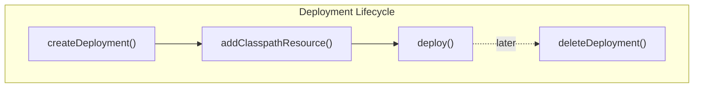

# Advanced Deployment Builder

The `DeploymentBuilder` API provides fine-grained control over process definition deployments beyond the default classpath scanning. It supports duplicate filtering, tenant isolation, scheduled activation, validation control, and more.

## Basic Deployment

```java
Deployment deployment = repositoryService.createDeployment()
    .addClasspathResource("process.bpmn")
    .name("My Deployment")
    .deploy();
```

## Resource Addition Methods

```java
repositoryService.createDeployment()
    // From classpath
    .addClasspathResource("process.bpmn")

    // From InputStream
    .addInputStream("custom.bpmn", new FileInputStream("custom.bpmn"))

    // From Spring Resource
    .addInputStream("resource.bpmn", springResource)

    // From string content
    .addString("inline.bpmn", bpmnXmlString)

    // From bytes
    .addBytes("binary.bpmn", bpmnBytes)

    // From ZIP archive
    .addZipInputStream(new ZipInputStream(zipStream))

    // From BpmnModel (programmatic)
    .addBpmnModel("generated.bpmn", bpmnModel)
    .deploy();
```

## Duplicate Filtering

Prevents creating a new version when resources haven't changed:

```java
Deployment deployment = repositoryService.createDeployment()
    .enableDuplicateFiltering()
    .addClasspathResource("process.bpmn")
    .deploy();

// If process.bpmn is identical to what's already deployed,
// the existing deployment is returned instead of creating a new version
```

When enabled, every resource is compared to previously deployed resources. Only changed resources trigger a new deployment version.

## Deployment Key

```java
repositoryService.createDeployment()
    .key("monthly-orders")
    .addClasspathResource("process.bpmn")
    .deploy();

// Query by key
List<Deployment> deployments = repositoryService.createDeploymentQuery()
    .deploymentKey("monthly-orders")
    .list();
```

The key provides a stable identifier across versions, useful for querying all deployments of a particular logical group.

## Tenant Isolation

```java
repositoryService.createDeployment()
    .tenantId("tenant-123")
    .addClasspathResource("process.bpmn")
    .deploy();

// Query tenant-specific deployments
repositoryService.createDeploymentQuery()
    .tenantIdIn("tenant-123")
    .list();
```

## Scheduled Activation

Deploy now, activate later:

```java
Date activationDate = new Date(System.currentTimeMillis() + 3600000); // 1 hour

repositoryService.createDeployment()
    .activateProcessDefinitionsOn(activationDate)
    .addClasspathResource("new-process.bpmn")
    .deploy();

// Process definitions are deployed but SUSPENDED until the activation date
// The async job executor activates them automatically
```

## Validation Control

```java
// Skip XML schema validation
repositoryService.createDeployment()
    .disableSchemaValidation()
    .addClasspathResource("process.bpmn")
    .deploy();

// Skip BPMN execution validation
repositoryService.createDeployment()
    .disableBpmnValidation()
    .addClasspathResource("process.bpmn")
    .deploy();

// Skip both (not recommended for production)
repositoryService.createDeployment()
    .disableSchemaValidation()
    .disableBpmnValidation()
    .addClasspathResource("process.bpmn")
    .deploy();
```

Disabling validation is useful for prototyping or when working with non-standard BPMN extensions that pass schema validation but fail execution validation.

## Deployment Properties

```java
repositoryService.createDeployment()
    .deploymentProperty("customProperty", "value")
    .addClasspathResource("process.bpmn")
    .deploy();
```

Deployment properties are key-value pairs attached to a deployment, accessible via the `Deployment` object. They can be used for metadata tracking, version correlation, or triggering custom deployment logic.

## Name and Category

```java
repositoryService.createDeployment()
    .name("Q4 Process Updates")
    .category("finance")
    .addClasspathResource("process.bpmn")
    .deploy();
```

## Deployment Object

After deploying, the `Deployment` object provides metadata:

```java
Deployment deployment = repositoryService.createDeployment()
    .name("My Deployment")
    .addClasspathResource("process.bpmn")
    .deploy();

String id = deployment.getId();
String name = deployment.getName();
Date deploymentTime = deployment.getDeploymentTime();
```

## Deleting Deployments

```java
// Delete deployment and its process definitions
repositoryService.deleteDeployment(deploymentId);

// Cascade: also delete running and historical process instances
repositoryService.deleteDeployment(deploymentId, true);
```



## Complete Example

```java
Deployment deployment = repositoryService.createDeployment()
    .name("Order Management v2.3")
    .key("order-management")
    .category("sales")
    .tenantId("tenant-001")
    .enableDuplicateFiltering()
    .activateProcessDefinitionsOn(futureDate)
    .deploymentProperty("changelog", "Added payment validation step")
    .addClasspathResource("processes/order.bpmn")
    .addClasspathResource("processes/payment.bpmn")
    .addString("override.bpmn", customBpmnXml)
    .deploy();

log.info("Deployed: {} (ID: {})", deployment.getName(), deployment.getId());
```

## Related Documentation

- [Spring Auto-Deployment Modes](./auto-deployment-modes.md) — Automatic classpath deployment
- [Process Instance Suspension](./process-instance-suspension.md) — Managing suspended definitions
