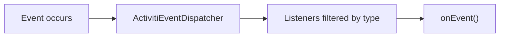
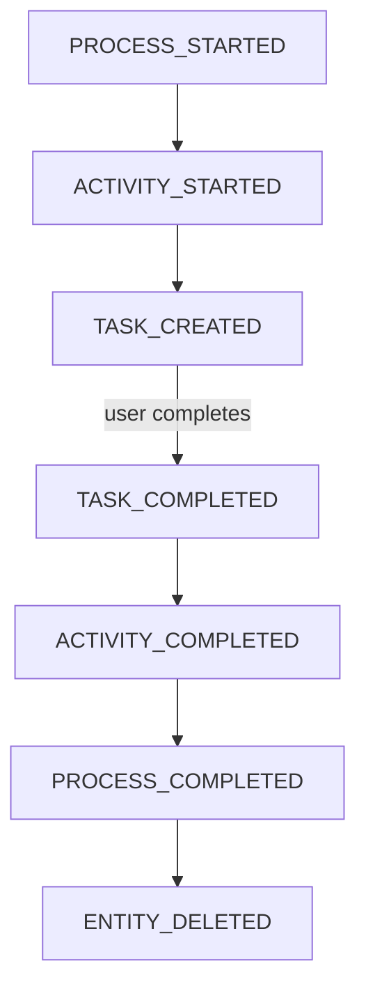

# Engine Event System

The engine event system provides a global, decoupled mechanism for monitoring all activity in the Activiti engine. Unlike execution listeners (which are defined per-BPMN element), engine events are dispatched globally for 35+ event types and can be registered programmatically without modifying process definitions.

## How It Works

When an event occurs, the engine dispatches an `ActivitiEvent` to all registered `ActivitiEventListener` instances. Listeners can be registered for all events or filtered to specific types.



## Event Types

### Entity Lifecycle Events

| Event | Description |
|-------|-------------|
| `ENTITY_CREATED` | New entity (process instance, task, etc.) created |
| `ENTITY_INITIALIZED` | Entity and all child entities fully initialized |
| `ENTITY_UPDATED` | Existing entity modified |
| `ENTITY_DELETED` | Existing entity removed |
| `ENTITY_SUSPENDED` | Entity suspended |
| `ENTITY_ACTIVATED` | Entity activated |

### Job and Timer Events

| Event | Description |
|-------|-------------|
| `TIMER_SCHEDULED` | Timer job scheduled |
| `TIMER_FIRED` | Timer fired successfully |
| `JOB_CANCELED` | Job canceled (e.g., task completed before deadline) |
| `JOB_EXECUTION_SUCCESS` | Job executed successfully |
| `JOB_EXECUTION_FAILURE` | Job failed — event is an `ActivitiExceptionEvent` |
| `JOB_RETRIES_DECREMENTED` | Job retry count decreased |

### Activity Events

| Event | Description |
|-------|-------------|
| `ACTIVITY_STARTED` | Activity execution begins |
| `ACTIVITY_COMPLETED` | Activity finished successfully |
| `ACTIVITY_CANCELLED` | Activity cancelled (boundary event) |
| `ACTIVITY_SIGNALED` | Activity received a signal |
| `ACTIVITY_COMPENSATE` | Activity about to execute compensation |
| `ACTIVITY_MESSAGE_SENT` | Message sent via throw/end event |
| `ACTIVITY_MESSAGE_WAITING` | Message catch event waiting for message |
| `ACTIVITY_MESSAGE_RECEIVED` | Activity received a message |
| `ACTIVITY_ERROR_RECEIVED` | Activity received an error |

### Process Events

| Event | Description |
|-------|-------------|
| `PROCESS_STARTED` | Process instance started (after `ENTITY_INITIALIZED`) |
| `PROCESS_COMPLETED` | Process instance completed |
| `PROCESS_COMPLETED_WITH_ERROR_END_EVENT` | Process completed via error end event |
| `PROCESS_CANCELLED` | Process instance deleted |

### Variable Events

| Event | Description |
|-------|-------------|
| `VARIABLE_CREATED` | New variable created |
| `VARIABLE_UPDATED` | Existing variable modified |
| `VARIABLE_DELETED` | Variable removed |

### Task Events

| Event | Description |
|-------|-------------|
| `TASK_CREATED` | Task created and fully initialized |
| `TASK_ASSIGNED` | Task assigned to user |
| `TASK_COMPLETED` | Task completed (before `ENTITY_DELETED`) |

### History Events (require history level >= ACTIVITY)

| Event | Description |
|-------|-------------|
| `HISTORIC_ACTIVITY_INSTANCE_CREATED` | Historic activity created |
| `HISTORIC_ACTIVITY_INSTANCE_ENDED` | Historic activity ended with duration |
| `HISTORIC_PROCESS_INSTANCE_CREATED` | Historic process instance created |
| `HISTORIC_PROCESS_INSTANCE_ENDED` | Historic process instance ended |

### Flow and Error Events

| Event | Description |
|-------|-------------|
| `SEQUENCEFLOW_TAKEN` | Sequence flow executed |
| `UNCAUGHT_BPMN_ERROR` | BPMN error thrown but not caught |

### Engine Lifecycle Events

| Event | Description |
|-------|-------------|
| `ENGINE_CREATED` | Process engine built and ready |
| `ENGINE_CLOSED` | Process engine shut down |

### Identity Events

| Event | Description |
|-------|-------------|
| `MEMBERSHIP_CREATED` | User-group membership added |
| `MEMBERSHIP_DELETED` | Single membership removed |
| `MEMBERSHIPS_DELETED` | All memberships for a group removed |

### Custom Events

| Event | Description |
|-------|-------------|
| `CUSTOM` | User-defined events dispatched via API |

## Event Classes

| Interface | Extends | Key Properties |
|-----------|---------|----------------|
| `ActivitiEvent` | — | Execution ID, process instance ID, process definition ID |
| `ActivitiEntityEvent` | `ActivitiEvent` | Entity reference via `getEntity()` |
| `ActivitiActivityEvent` | `ActivitiEvent` | Activity ID, activity name, activity type, behavior class |
| `ActivitiSequenceFlowTakenEvent` | `ActivitiEvent` | Source/target activity IDs and sequence flow ID |
| `ActivitiVariableEvent` | `ActivitiEvent` | `getVariableName()`, `getVariableValue()`, `getVariableType()` (returns `VariableType`), task ID |
| `ActivitiVariableUpdatedEvent` | `ActivitiVariableEvent` | `getVariablePreviousValue()` |
| `ActivitiExceptionEvent` | — | `getCause()` returns the `Throwable` that caused the event |
| `ActivitiProcessStartedEvent` | `ActivitiEntityWithVariablesEvent` | `getNestedProcessInstanceId()`, `getNestedProcessDefinitionId()` |
| `ActivitiErrorEvent` | `ActivitiActivityEvent` | `getErrorCode()`, `getErrorId()` |
| `ActivitiMessageEvent` | `ActivitiActivityEvent` | `getMessageName()`, `getMessageCorrelationKey()`, `getMessageData()` |
| `ActivitiSignalEvent` | `ActivitiActivityEvent` | `getSignalName()`, `getSignalData()` |

**Hierarchy:**
- `ActivitiProcessStartedEvent` → `ActivitiEntityWithVariablesEvent` → `ActivitiEntityEvent` → `ActivitiEvent`
- `ActivitiVariableUpdatedEvent` → `ActivitiVariableEvent` → `ActivitiEvent`
- `ActivitiMessageEvent` → `ActivitiActivityEvent` → `ActivitiEvent`
- `ActivitiSequenceFlowTakenEvent` → `ActivitiEvent` (direct, NOT via `ActivitiActivityEvent`)
- `ActivitiExceptionEvent` is a standalone interface with only `getCause()`

## Registering Listeners

### Programmatically via Configuration

```java
ProcessEngineConfiguration config = new ProcessEngineConfigurationImpl();

// Enable the event dispatcher
config.setEnableEventDispatcher(true);

// Register listeners
List<ActivitiEventListener> listeners = Arrays.asList(
    new ProcessMetricsListener(),
    new AuditLoggerListener()
);
config.setEventListeners(listeners);
```

### At Runtime via Event Dispatcher

```java
// Get the event dispatcher from the process engine
ActivitiEventDispatcher dispatcher = processEngine.getProcessEngineConfiguration()
    .getEventDispatcher();

// Register for all events
dispatcher.addEventListener(new AllEventListener());

// Register for specific event types only
dispatcher.addEventListener(new TaskListener(),
    ActivitiEventType.TASK_CREATED,
    ActivitiEventType.TASK_COMPLETED);

// Remove a listener
dispatcher.removeEventListener(listener);

// Enable/disable dispatching
dispatcher.setEnabled(false);
```

### Via Configuration Properties

```xml
<!-- activiti.cfg.xml -->
<property name="enableEventDispatcher" value="true"/>
<property name="eventListeners">
    <list>
        <bean class="com.example.AuditListener"/>
        <bean class="com.example.MetricsListener"/>
    </list>
</property>
```

### Spring Boot with ProcessEngineConfigurationConfigurer

```java
@Bean
public ProcessEngineConfigurationConfigurer eventConfigurer() {
    return config -> {
        config.setEnableEventDispatcher(true);
        ActivitiEventDispatcher dispatcher = config.getEventDispatcher();
        dispatcher.addEventListener(new MyAuditListener(),
            ActivitiEventType.PROCESS_STARTED,
            ActivitiEventType.PROCESS_COMPLETED,
            ActivitiEventType.TASK_CREATED);
    };
}
```

## Listener Interface

```java
public interface ActivitiEventListener {
    void onEvent(ActivitiEvent event);

    boolean isFailOnException();
}
```

### Key Decisions

**`isFailOnException()`** controls whether a listener exception aborts the engine operation:
- `true` — the engine operation fails and rolls back
- `false` — the exception is logged but the engine continues

### Complete Listener Example

```java
public class AuditEventListener implements ActivitiEventListener {

    private static final Logger log = LoggerFactory.getLogger(AuditEventListener.class);

    @Override
    public void onEvent(ActivitiEvent event) {
        switch (event.getType()) {
            case PROCESS_STARTED:
                if (event instanceof ActivitiProcessStartedEvent) {
                    ActivitiProcessStartedEvent started = (ActivitiProcessStartedEvent) event;
                    log.info("Process {} started, business key: {}",
                        started.getProcessInstanceId(),
                        started.getEntity().getBusinessKey());
                }
                break;

            case TASK_CREATED:
                if (event instanceof ActivitiEntityEvent) {
                    Task task = (Task) ((ActivitiEntityEvent) event).getEntity();
                    log.info("Task {} assigned to {} for process {}",
                        task.getName(), task.getAssignee(), task.getProcessInstanceId());
                }
                break;

            case VARIABLE_UPDATED:
                if (event instanceof ActivitiVariableUpdatedEvent) {
                    ActivitiVariableUpdatedEvent varEvent = (ActivitiVariableUpdatedEvent) event;
                    log.info("Variable '{}' updated to {} (previous: {}) in process {}",
                        varEvent.getVariableName(),
                        varEvent.getVariableValue(),
                        varEvent.getVariablePreviousValue(),
                        varEvent.getProcessInstanceId());
                }
                break;

            case ACTIVITY_COMPLETED:
                if (event instanceof ActivitiActivityEvent) {
                    ActivitiActivityEvent activity = (ActivitiActivityEvent) event;
                    log.info("Activity '{}' completed in process {}",
                        activity.getActivityName(),
                        activity.getProcessInstanceId());
                }
                break;

            case JOB_EXECUTION_FAILURE:
                if (event instanceof ActivitiExceptionEvent) {
                    ActivitiExceptionEvent failure = (ActivitiExceptionEvent) event;
                    log.error("Job execution failed in process {}: {}",
                        event.getProcessInstanceId(),
                        failure.getCause().getMessage());
                }
                break;
        }
    }

    // Don't let listener failures break the engine
    @Override
    public boolean isFailOnException() {
        return false;
    }
}
```

## Dispatching Custom Events

```java
// Get the event dispatcher
ActivitiEventDispatcher dispatcher = processEngine.getProcessEngineConfiguration()
    .getEventDispatcher();

// Create and dispatch a custom event
ActivitiEventImpl customEvent = new ActivitiEventImpl(
    ActivitiEventType.CUSTOM,
    executionId,
    processInstanceId,
    processDefinitionId
);

dispatcher.dispatchEvent(customEvent);
```

`ActivitiEventImpl` is the base implementation used for custom events. The `CUSTOM` type is never thrown by the engine itself, only by external API calls.

## Event Order Guarantees

The engine dispatches events in a defined order during process execution. The approximate order for a task-driven process is:



Note: entity-level events (`ENTITY_CREATED`, `ENTITY_INITIALIZED`, `ENTITY_DELETED`) are also dispatched alongside the process-specific events above.

## Performance Considerations

- **Filter by type**: Register listeners only for the events they need — reduces dispatch overhead
- **`isFailOnException() = false`**: Prevents listener bugs from breaking processes
- **Async dispatch**: For high-volume events (metrics, audit), consider wrapping listener logic in an async executor
- **Disable when not needed**: `setEnableEventDispatcher(false)` eliminates all event overhead

## Common Use Cases

### Audit Logging

```java
public class AuditListener implements ActivitiEventListener {
    public void onEvent(ActivitiEvent event) {
        // Log to audit database, external system, or message queue
    }
    public boolean isFailOnException() { return false; }
}
```

### Real-Time Metrics

```java
public class MetricsListener implements ActivitiEventListener {
    public void onEvent(ActivitiEvent event) {
        if (event.getType() == ActivitiEventType.ACTIVITY_COMPLETED
            && event instanceof ActivitiActivityEvent) {
            ActivitiActivityEvent ae = (ActivitiActivityEvent) event;
            // Record activity duration to metrics system
        }
    }
    public boolean isFailOnException() { return false; }
}
```

### External System Notification

```java
public class NotificationListener implements ActivitiEventListener {
    public void onEvent(ActivitiEvent event) {
        if (event.getType() == ActivitiEventType.TASK_CREATED) {
            // Send email, push notification, or message to external queue
        }
    }
    public boolean isFailOnException() { return false; }
}
```

## Related Documentation

- [Execution Listeners](../bpmn/reference/execution-listeners.md) — Element-level listeners
- [Task Listeners](../bpmn/reference/task-listeners.md) — Task-specific listeners
- [Database Event Logging](./database-event-logging.md) — Persistent DB audit trail
- [Configuration](../configuration.md) — Engine event configuration
