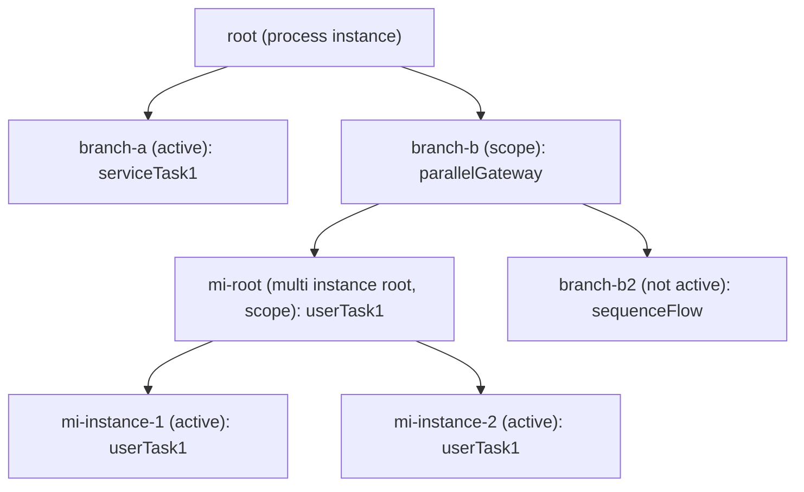

# Execution Debug Tree

The Execution Debug Tree provides a structured, tree-like representation of the execution hierarchy within a process instance. It is useful for debugging complex processes with parallel branches, subprocesses, and multi-instance activities.

## Components

| Class | Purpose |
|-------|---------|
| `ExecutionTree` | Root container with BFS iteration |
| `ExecutionTreeNode` | Individual node wrapping an `ExecutionEntity` |
| `ExecutionTreeBfsIterator` | Breadth-first traversal iterator |
| `ExecutionTreeUtil` | Factory for building trees from executions |

## Building an Execution Tree

`ExecutionTreeUtil` requires access to `ExecutionEntity` instances (internal class), so it must be called within a command context:

```java
ProcessEngineConfigurationImpl config = (ProcessEngineConfigurationImpl)
    processEngine.getProcessEngineConfiguration();

ExecutionTree tree = config.getCommandExecutor()
    .execute((Command<ExecutionTree>) commandContext -> {
        // Find executions by process instance
        List<ExecutionEntity> executions = config.getExecutionDataManager()
            .findExecutionsByProcessInstanceId("processInstanceId");
        return ExecutionTreeUtil.buildExecutionTreeForProcessInstance(executions);
    });
```

To build a tree from a single execution (e.g., from within a JavaDelegate):

```java
@Override
public void execute(DelegateExecution execution) {
    // DelegateExecution is an ExecutionEntity at runtime
    ExecutionTree tree = ExecutionTreeUtil.buildExecutionTree(
        (ExecutionEntity) execution);
    // tree.getRoot() is the process instance execution
}
```

## Tree Structure

Each `ExecutionTreeNode` contains:
- The underlying `ExecutionEntity` (ID, activity, variables, etc.)
- A reference to the parent node
- A list of child nodes
- The current flow element (activity or sequence flow)



## Traversal

### Breadth-First

```java
for (ExecutionTreeNode node : tree) {
    System.out.println(node);
}
```

### Leaf-First

```java
for (ExecutionTreeNode node : tree.leafsFirstIterator()) {
    System.out.println(node);
}
```

### Lookup by Execution ID

```java
ExecutionTreeNode node = tree.getTreeNode("executionId");
if (node != null) {
    ExecutionEntity entity = node.getExecutionEntity();
    System.out.println("Activity: " + entity.getActivityId());
    System.out.println("Active: " + entity.isActive());
    System.out.println("Scope: " + entity.isScope());
}
```

## Node Properties

```java
ExecutionTreeNode node = tree.getRoot();

// The underlying execution entity
ExecutionEntity entity = node.getExecutionEntity();

// Navigation
ExecutionTreeNode parent = node.getParent();
List<ExecutionTreeNode> children = node.getChildren();

// Execution state
boolean isActive = entity.isActive();
boolean isEnded = entity.isEnded();
boolean isScope = entity.isScope();
boolean isMultiInstanceRoot = entity.isMultiInstanceRoot();
boolean isProcessInstanceType = entity.isProcessInstanceType();

// Current position
FlowElement currentElement = entity.getCurrentFlowElement();
String activityId = entity.getActivityId();
```

## String Representation

`ExecutionTreeNode.toString()` produces a formatted tree diagram:

```java
System.out.println(tree);
```

Output:
```
12345 : theStart, parent id null (process instance)
└── 12346 : serviceTask1, parent id 12345 (active)
```

Each node shows: execution ID, current activity/flow, parent ID, and status flags (`active`, `scope`, `multi instance root`, `ended`, `not active`).

## Use Cases

### Debugging Parallel Processes

Identify which branches are active, which have completed, and where tokens are waiting:

```java
for (ExecutionTreeNode node : tree) {
    ExecutionEntity e = node.getExecutionEntity();
    if (e.isActive()) {
        System.out.println("ACTIVE: " + e.getActivityId()
            + " (execution: " + e.getId() + ")");
    }
}
```

### Multi-Instance Inspection

Count active instances within a multi-instance root:

```java
for (ExecutionTreeNode node : tree) {
    if (node.getExecutionEntity().isMultiInstanceRoot()) {
        int activeCount = node.getChildren().stream()
            .filter(c -> c.getExecutionEntity().isActive())
            .count();
        System.out.println("MI activity " + node.getExecutionEntity().getActivityId()
            + " has " + activeCount + " active instances");
    }
}
```

## Important Notes

- The execution tree API is **internal** (`org.activiti.engine.debug` package)
- `ExecutionEntity` is an internal class — you can only access it within a command context or by casting `DelegateExecution` in a JavaDelegate
- The tree reflects the **current state** of executions; it is not persisted
- For building operational consoles, execute the tree-building logic within a command context as shown above

## Related Documentation

- [Token Lifecycle](./token-lifecycle.md) — How tokens (executions) flow through processes, including gateway behavior and cleanup
- [Multi-Instance](../bpmn/reference/multi-instance.md) — Multi-instance activities
- [Variables and Variable Scope](../bpmn/reference/variables.md) — Execution-scoped variables
- [DelegateExecution API](../bpmn/reference/delegate-execution-api.md) — Execution management
