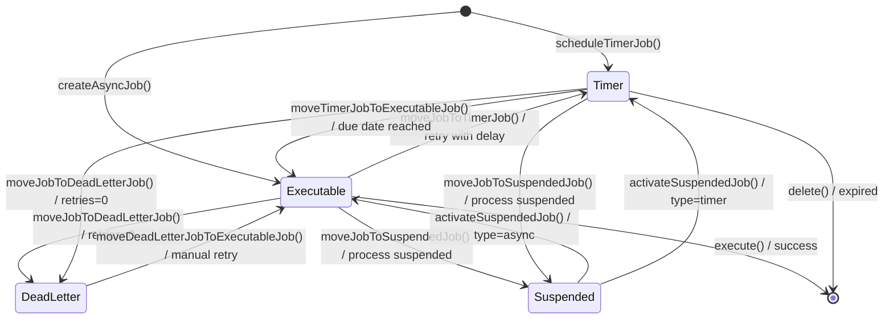
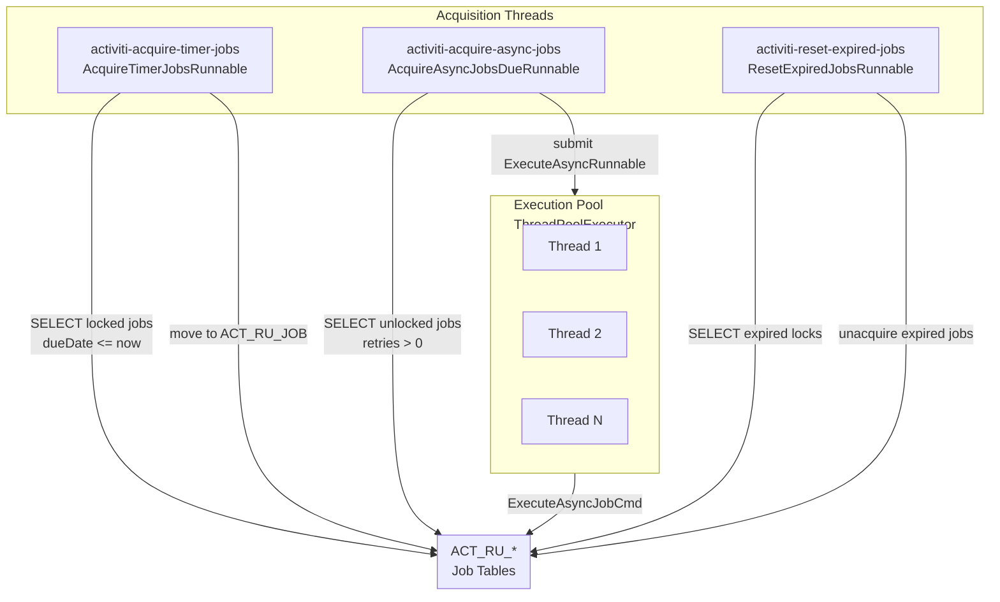

# Job Lifecycle and Failure Recovery

Activiti jobs represent units of asynchronous work: executing an async service task, firing a timer, processing a message, or continuing a suspended process. Understanding the job lifecycle, failure handling, and executor architecture is essential for building reliable, production-grade workflows.

## Overview

When a process encounters an async boundary (`activiti:async="true"`), the engine creates a **job** and persists it to the database. The job is then picked up and executed by a background thread, decoupling execution from the user-facing request.

```xml
<bpmn:serviceTask id="externalApi" 
                  name="Call External API" 
                  activiti:async="true"
                  activiti:class="com.example.ExternalApiService"/>
```

The async executor guarantees that:
- Jobs are persisted before the transaction commits
- Failed jobs are automatically retried with configurable policies
- Jobs survive engine restarts
- Multiple engine instances can safely share the same database

## Job States

Activiti defines four distinct job states, each stored in a separate database table to optimize query performance.

| State | Entity | Table | Description |
|-------|--------|-------|-------------|
| **Executable** | `JobEntity` | `ACT_RU_JOB` | Ready to execute or currently executing |
| **Timer** | `TimerJobEntity` | `ACT_RU_TIMER_JOB` | Scheduled with a due date, not yet fireable |
| **Suspended** | `SuspendedJobEntity` | `ACT_RU_SUSPENDED_JOB` | Temporarily paused, execution deferred |
| **Dead Letter** | `DeadLetterJobEntity` | `ACT_RU_DEADLETTER_JOB` | Retries exhausted, requires manual intervention |

All four states share a common set of properties defined by `AbstractJobEntity`:

| Property | Type | Description |
|----------|------|-------------|
| `duedate` | `Date` | When the job should fire (null = immediately) |
| `retries` | `int` | Remaining retry attempts |
| `jobHandlerType` | `String` | Handler identifier (e.g., `async-continuation`) |
| `jobHandlerConfiguration` | `String` | Handler-specific configuration |
| `jobType` | `String` | `timer` or `message` |
| `exceptionMessage` | `String` | Last failure message |
| `exceptionStacktrace` | `String` | Full exception stack trace |
| `executionId` | `String` | Associated execution |
| `processInstanceId` | `String` | Owning process instance |
| `exclusive` | `boolean` | Requires process-level lock |

`JobEntity` and `TimerJobEntity` additionally track distributed lock state:

| Property | Type | Description |
|----------|------|-------------|
| `lockOwner` | `String` | UUID of the executor instance holding the lock |
| `lockExpirationTime` | `Date` | When the lock expires |

### State Diagram



## Job Handlers

Each job has a `jobHandlerType` that determines how it is executed. The engine dispatches jobs to registered handlers via `JobManager.executeJobHandler()`.

| Handler Type | Class | Use Case |
|--------------|-------|----------|
| `async-continuation` | `AsyncContinuationJobHandler` | Resume process after async boundary |
| `timer-start-event` | `TimerStartEventJobHandler` | Start a new process instance via timer |
| `trigger-timer` | `TriggerTimerEventJobHandler` | Fire a boundary or intermediate timer |

### AsyncContinuationJobHandler

Created when a process hits an async boundary. On execution, it plans a `ContinueProcessSynchronousOperation` on the agenda, which resumes the process from where it left off.

```java
public void execute(JobEntity job, String configuration, ExecutionEntity execution,
                    CommandContext commandContext) {
    Context.getAgenda().planContinueProcessSynchronousOperation(execution);
}
```

### TimerStartEventJobHandler

Handles timer start events. Looks up the process definition, verifies it is not suspended, then creates and starts a new process instance with the matching initial flow element. Supports recurring timers via `repeat` and `maxIterations`.

### TriggerTimerEventJobHandler

Fires for boundary timer events and intermediate catch timer events. Plans a `TriggerExecutionOperation` on the agenda and dispatches a `TIMER_FIRED` event.

## Async Executor Architecture

`DefaultAsyncJobExecutor` is the backbone of asynchronous job processing. It runs three background threads plus a configurable execution thread pool.



### Thread 1: Timer Job Acquisition

`AcquireTimerJobsRunnable` periodically queries `ACT_RU_TIMER_JOB` for jobs whose `dueDate` has passed. Each acquired job is moved from the timer table to the executable table via `JobManager.moveTimerJobToExecutableJob()`, which:

1. Creates a new `JobEntity` with copied properties
2. Sets `lockOwner` to the executor's UUID
3. Sets `lockExpirationTime` to current time + `timerLockTimeInMillis`
4. Deletes the original timer job
5. Inserts the new executable job

**Key parameters:**
- `maxTimerJobsPerAcquisition` (default: 1) — jobs fetched per query
- `defaultTimerJobAcquireWaitTimeInMillis` (default: 10000) — sleep between queries

When the acquisition returns fewer jobs than `maxTimerJobsPerAcquisition`, the thread sleeps for the configured wait time. Otherwise, it queries again immediately.

### Thread 2: Async Job Acquisition

`AcquireAsyncJobsDueRunnable` queries `ACT_RU_JOB` for executable jobs (`retries > 0`, no due date or due date passed). Each acquired job is locked (lock owner and expiration set) and submitted to the execution thread pool via `AsyncExecutor.executeAsyncJob()`.

**Key parameters:**
- `maxAsyncJobsDuePerAcquisition` (default: 1) — jobs fetched per query
- `defaultAsyncJobAcquireWaitTimeInMillis` (default: 10000) — sleep between queries
- `defaultQueueSizeFullWaitTimeInMillis` (default: 0) — extra sleep when queue is full

When a `RejectedExecutionException` occurs (thread pool queue full), the job is unacquired — its lock is cleared so another executor can pick it up.

### Thread 3: Expired Lock Reset

`ResetExpiredJobsRunnable` detects jobs locked by executors that are no longer responsive and releases them. The recovery cycle:

1. Queries `ACT_RU_JOB` for jobs where `lockExpirationTime < now()` and `lockOwner` is set (`FindExpiredJobsCmd`)
2. Resets each expired job's lock via `JobManager.unacquire()`, which creates a fresh copy of the job with a new ID and cleared lock fields
3. Sleeps for `resetExpiredJobsInterval` (default: 60000ms = 1 minute)

**Key parameters:**
- `resetExpiredJobsInterval` (default: 60000) — check interval in milliseconds
- `resetExpiredJobsPageSize` (default: 3) — max jobs to reset per cycle

In message queue mode, expired jobs are simply unlocked rather than being reinserted, since the external queue handles redistribution.

### Execution Thread Pool

A `ThreadPoolExecutor` with:
- `corePoolSize` threads (default: 2)
- `maxPoolSize` threads (default: 10)
- `ArrayBlockingQueue` of `queueSize` capacity (default: 100)
- `keepAliveTime` of 5000ms for excess idle threads
- Thread naming pattern: `activiti-async-job-executor-thread-%d`

Each submitted job runs `ExecuteAsyncRunnable`, which:
1. Acquires an exclusive process lock if the job is exclusive
2. Executes the job via `ExecuteAsyncJobCmd`
3. Releases the exclusive lock
4. On failure, invokes `HandleFailedJobCmd` to manage retries

## Failed Job Handling

### Default Retry Behavior

When a job fails, `JobRetryCmd` determines the next action:

1. **Retries remaining** (`retries > 1`): Move the job to `ACT_RU_TIMER_JOB` with a new `dueDate` = now + `asyncFailedJobWaitTime` (default: 10 seconds). Decrement retries.

2. **No retries left** (`retries <= 1`): Move the job to `ACT_RU_DEADLETTER_JOB`. Store the exception message and stack trace.

The default number of retries is set by `asyncExecutorNumberOfRetries` (default: 3), configurable at engine level.

### FailedJobCommandFactory

`FailedJobCommandFactory` is the extension point for customizing failure handling. The engine calls `getCommand(jobId, exception)` to obtain the command that processes a failed job. The default implementation (`DefaultFailedJobCommandFactory`) returns a `JobRetryCmd`.

```java
public interface FailedJobCommandFactory {
    Command<Object> getCommand(String jobId, Throwable exception);
}
```

To implement custom failure handling:

```java
public class CustomFailedJobCommandFactory implements FailedJobCommandFactory {
    @Override
    public Command<Object> getCommand(String jobId, Throwable exception) {
        if (exception instanceof SpecificException) {
            return new NotifyAndRetryCmd(jobId, exception);
        }
        return new JobRetryCmd(jobId, exception);
    }
}
```

Configure the custom factory:

```java
@Bean
public ProcessEngineConfiguration processEngineConfiguration() {
    ProcessEngineConfigurationImpl config = ProcessEngineConfigurationImpl
        .createStandaloneInMemProcessEngineConfiguration();
    config.setFailedJobCommandFactory(new CustomFailedJobCommandFactory());
    return config;
}
```

### FailedJobListener

`FailedJobListener` is a `CommandContextCloseListener` registered during job execution. On success, it dispatches `JOB_EXECUTION_SUCCESS`. On failure (`closeFailure`), it:

1. Dispatches `JOB_EXECUTION_FAILURE` (an `ActivitiExceptionEvent` containing the exception)
2. Resolves the `FailedJobCommandFactory` from the command context
3. Executes the failure command in a new transaction (`transactionRequiresNew()`)

This ensures the failure handling runs in an independent transaction, even if the original execution transaction was rolled back.

## Custom Retry Cycles

The `activiti:failedJobRetryTimeCycle` attribute overrides the default retry behavior with an ISO 8601 repeat expression. Defined on a per-service-task basis, it provides fine-grained control over retry count and backoff timing.

### Syntax

The retry cycle uses ISO 8601 recurrence rule format, parsed by `DurationHelper`:

```
R[repeatCount]/[startDate]/[duration]/[endDate]
```

- `R` — Repeat indicator (required)
- `Rn` — Repeat exactly `n` times
- `R` without number — Repeat indefinitely (bounded by `Integer.MAX_VALUE - 1`)
- Multiple cycles separated by `;` for progressive backoff

### Examples

```xml
<!-- Retry 5 times immediately (0 delay between retries) -->
<serviceTask id="apiCall" activiti:async="true">
  <extensionElements>
    <activiti:failedJobRetryTimeCycle>R5</activiti:failedJobRetryTimeCycle>
  </extensionElements>
</serviceTask>

<!-- Retry 3 times with 1-minute interval -->
<serviceTask id="apiCall2" activiti:async="true">
  <extensionElements>
    <activiti:failedJobRetryTimeCycle>R3/PT1M</activiti:failedJobRetryTimeCycle>
  </extensionElements>
</serviceTask>

<!-- Progressive backoff: 3 retries @ 1min, 2 retries @ 5min, 2 retries @ 30min -->
<serviceTask id="resilientCall" activiti:async="true">
  <extensionElements>
    <activiti:failedJobRetryTimeCycle>R3/PT1M;R2/PT5M;R2/PT30M</activiti:failedJobRetryTimeCycle>
  </extensionElements>
</serviceTask>

<!-- Retry 10 times with 30-second interval, then 5 times with 5-minute interval -->
<serviceTask id="eventualCall" activiti:async="true">
  <extensionElements>
    <activiti:failedJobRetryTimeCycle>R10/PT30S;R5/PT5M</activiti:failedJobRetryTimeCycle>
  </extensionElements>
</serviceTask>
```

### How It Works

When `JobRetryCmd` executes and a `failedJobRetryTimeCycle` is defined:

1. **First failure** (`exceptionMessage` is null): The `DurationHelper` parses the expression, extracts the total retry count via `getTimes()`, and sets it on the job. The job is moved to the timer table with a `dueDate` calculated by `getDateAfter()`.

2. **Subsequent failures**: The retry count is simply decremented. The next `dueDate` is recalculated from the current cycle position.

3. **Retries exhausted** (`retries <= 1`): The job moves to the dead letter table.

The `DurationHelper` internally advances a calendar by the specified period (e.g., `PT1M` = add 1 minute) each time `getDateAfter()` is called, producing the next fire time.

## Distributed Lock Management

In clustered deployments, multiple engine instances share the same database. Locks prevent the same job from being executed concurrently by different instances.

### Lock Fields

| Field | Meaning |
|-------|---------|
| `lockOwner` | UUID identifying which executor instance acquired the job |
| `lockExpirationTime` | Timestamp after which the lock is considered expired |

### Lock Acquisition

When the async job acquisition thread queries `ACT_RU_JOB`, the `AcquireJobsCmd` sets `lockOwner` to the executor's UUID and `lockExpirationTime` to `now() + asyncJobLockTimeInMillis` (default: 5 minutes). The SQL uses optimistic locking (revision column) to ensure only one instance wins.

### Lock Recovery

If an executor crashes while processing a job:
1. The job remains locked with the stale `lockOwner`
2. After `lockExpirationTime` passes, `ResetExpiredJobsRunnable` finds it
3. The job is unacquired (lock fields cleared) and made available again

### Configuration

```java
// Custom lock owner for identification in logs and DB
config.setAsyncExecutorLockOwner("node-1-prod-us-east");

// Lock durations
config.setAsyncExecutorAsyncJobLockTimeInMillis(300000); // 5 min
config.setAsyncExecutorTimerLockTimeInMillis(300000);    // 5 min

// Expired lock recovery
config.setAsyncExecutorResetExpiredJobsInterval(60000);  // Check every 1 min
config.setAsyncExecutorResetExpiredJobsPageSize(10);     // Up to 10 per check
```

## Exclusive Jobs

When a job is marked as `exclusive=true`, it acquires an additional row-level lock on the process instance via `LockExclusiveJobCmd`. This guarantees that only one exclusive job per process instance executes at a time, preventing race conditions in workflows with multiple concurrent async paths.

**Behavior:**
- If the exclusive lock cannot be acquired, `ExecuteAsyncRunnable` calls `unacquire()` to release the job lock, allowing another executor to retry
- On successful execution, the exclusive lock is released via `UnlockExclusiveJobCmd`

## Message Queue Mode

Setting `asyncExecutorIsMessageQueueMode=true` disables the internal async job acquisition thread (`AcquireAsyncJobsDueRunnable`). Instead, jobs are dispatched to an external message queue (e.g., RabbitMQ, Kafka), and a separate consumer process picks them up for execution.

In this mode:
- `executeAsyncJob()` returns `true` without submitting to a thread pool
- `ResetExpiredJobsRunnable` calls `resetExpiredJob()` directly (simple unlock) rather than `unacquire()` (reinsert)
- The timer acquisition thread and expired lock reset thread still run

Message queue mode is designed for large-scale distributed deployments where the built-in thread pool is insufficient.

## Rejected Job Handling

**Note:** `SpringRejectedJobsHandler` is `@Deprecated @Internal` and its use is not recommended.

When the execution thread pool's queue is full, `executeAsyncJob()` catches `RejectedExecutionException` and unacquires the job. The Spring Boot integration provides `SpringCallerRunsRejectedJobsHandler`, which executes the rejected job directly in the caller's thread (the acquisition thread), effectively backpressuring job acquisition until the queue has capacity.

```java
public void jobRejected(AsyncExecutor asyncExecutor, Job job) {
    new ExecuteAsyncRunnable((JobEntity) job, 
        asyncExecutor.getProcessEngineConfiguration()).run();
}
```

This strategy ensures no job is lost but may slow down overall throughput when the queue is consistently full.

## Manual Recovery Procedures

### ManagementService API

The `ManagementService` provides programmatic job recovery operations:

```java
ManagementService managementService = processEngine.getManagementService();
```

### Querying Jobs by State

```java
// Executable jobs
List<Job> executableJobs = managementService.createJobQuery().list();

// Timer jobs
List<Job> timerJobs = managementService.createTimerJobQuery().list();

// Suspended jobs
List<Job> suspendedJobs = managementService.createSuspendedJobQuery().list();

// Dead letter jobs (failed, no retries left)
List<Job> deadLetterJobs = managementService.createDeadLetterJobQuery().list();

// Filter by process instance
List<Job> instanceJobs = managementService.createJobQuery()
    .processInstanceId("pid")
    .list();

// Filter by job handler type
List<Job> asyncJobs = managementService.createJobQuery()
    .jobHandlerType("async-continuation")
    .list();
```

### Moving a Dead Letter Job Back to Executable

```java
// Retry with 3 attempts
Job executable = managementService.moveDeadLetterJobToExecutableJob(deadLetterJobId, 3);
```

This copies the job to `ACT_RU_JOB`, sets retries to the specified value, and deletes the dead letter entry.

### Moving a Timer Job to Executable

```java
// Force immediate execution of a timer job
Job executable = managementService.moveTimerToExecutableJob(timerJobId);
```

### Inspecting Failed Jobs

```java
// Get exception details from any job state
String stacktrace = managementService.getJobExceptionStacktrace(jobId);
String timerStacktrace = managementService.getTimerJobExceptionStacktrace(timerJobId);
String deadLetterStacktrace = managementService.getDeadLetterJobExceptionStacktrace(dlJobId);
String suspendedStacktrace = managementService.getSuspendedJobExceptionStacktrace(suspendedJobId);
```

### Adjusting Retries

```java
// Increase retries on a failing job to buy more time
managementService.setJobRetries(jobId, 5);
managementService.setTimerJobRetries(timerJobId, 5);
```

### Forcing Job Execution

```java
// Execute a job synchronously, bypassing the async executor
managementService.executeJob(jobId);
```

### Deleting Stale Jobs

```java
// Remove jobs that can no longer execute (e.g., orphaned by deleted process instances)
managementService.deleteJob(jobId);
managementService.deleteTimerJob(timerJobId);
managementService.deleteDeadLetterJob(deadLetterJobId);
```

## Monitoring and Alerting

### Database Queries

Monitor job backlog with direct SQL against Activiti tables:

```sql
-- Count jobs by state
SELECT 
  (SELECT COUNT(*) FROM ACT_RU_JOB) as executable,
  (SELECT COUNT(*) FROM ACT_RU_TIMER_JOB) as timer,
  (SELECT COUNT(*) FROM ACT_RU_SUSPENDED_JOB) as suspended,
  (SELECT COUNT(*) FROM ACT_RU_DEADLETTER_JOB) as dead_letter;

-- Jobs locked for more than 5 minutes
SELECT ID_, LOCK_OWNER_, LOCK_EXP_TIME_, DUEDATE_, RETRIES_
FROM ACT_RU_JOB
WHERE LOCK_EXP_TIME_ IS NOT NULL 
  AND LOCK_EXP_TIME_ < NOW() - INTERVAL 5 MINUTE;

-- Dead letter jobs with exception details
SELECT d.ID_, d.EXCEPTION_MSG_, p.NAME_ as process_name, d.PROC_INST_ID_
FROM ACT_RU_DEADLETTER_JOB d
JOIN ACT_RE_PROC_DEF p ON d.PROC_DEF_ID_ = p.ID_;
```

### Event-Driven Monitoring

Register an engine event listener to receive real-time notifications:

```java
public class JobMonitor implements ActivitiEventListener {
    @Override
    public void onEvent(ActivitiEvent event) {
        switch (event.getType()) {
            case JOB_EXECUTION_FAILURE:
                // Log, alert, or trigger remediation
                ActivitiExceptionEvent failure = (ActivitiExceptionEvent) event;
                log.error("Job {} failed: {}", 
                    event.getEntity().getId(), 
                    failure.getException().getMessage());
                break;
            case JOB_RETRIES_DECREMENTED:
                // Track retry progress
                break;
            case JOB_EXECUTION_SUCCESS:
                // Measure completion metrics
                break;
            case TIMER_FIRED:
                // Track timer activity
                break;
        }
    }

    @Override
    public boolean isFailOnException() {
        return false; // Never let listener exceptions affect job execution
    }
}
```

### Thread State Monitoring

The async executor exposes thread references for diagnostics:

```java
AsyncExecutor executor = processEngine.getProcessEngineConfiguration().getAsyncExecutor();
Thread timerThread = executor.getTimerJobAcquisitionThread();
Thread asyncThread = executor.getAsyncJobAcquisitionThread();
Thread resetThread = executor.getResetExpiredJobThread();
ExecutorService pool = executor.getExecutorService();

// Check thread health
System.out.println("Timer thread alive: " + timerThread.isAlive());
System.out.println("Pool queue size: " + executor.getThreadPoolQueue().size());
```

## Async Executor Tuning

### Spring Boot Properties

```yaml
spring:
  activiti:
    async-executor-activate: true
    
    async-executor:
      # Thread pool
      core-pool-size: 4              # Minimum threads (default: 2)
      max-pool-size: 16             # Maximum threads (default: 10)
      queue-size: 500               # Pending job capacity (default: 100)
      
      # Lock management
      async-job-lock-time-in-millis: 300000  # 5 min (default)
      timer-lock-time-in-millis: 300000      # 5 min (default)
      
      # Acquisition tuning
      max-async-jobs-due-per-acquisition: 20  # Jobs per query (default: 1)
      default-async-job-acquire-wait-time-in-millis: 10000  # Sleep between queries
      max-timer-jobs-per-acquisition: 10       # Timers per query (default: 1)
      default-timer-job-acquire-wait-time-in-millis: 10000
      
      # Recovery
      reset-expired-jobs-interval: 60000       # Check every 1 min
      reset-expired-jobs-page-size: 10         # Batch size (default: 3)
      
      # Failure
      number-of-retries: 3                     # Default retry count
      retry-wait-time-in-millis: 5000          # Wait before retry — WARNING: property name says
                                               # "millis" but the engine interprets this value as
                                               # SECONDS (wired to setAsyncFailedJobWaitTime()).
                                               # 5000 here means ~83 minutes, not 5 seconds.
```

### Configuration Guidelines

| Scenario | Recommended Settings | Rationale |
|----------|---------------------|-----------|
| **High throughput** | `corePoolSize: 8`, `maxPoolSize: 32`, `queueSize: 1000`, `maxJobsPerAcquisition: 50` | Maximizes parallel job processing |
| **Resource constrained** | `corePoolSize: 2`, `maxPoolSize: 4`, `queueSize: 50` | Minimizes memory and thread overhead |
| **Heavy timer workloads** | `maxTimerJobsPerAcquisition: 100`, `defaultTimerJobAcquireWaitTime: 1000` | Processes timers more aggressively |
| **External MQ integration** | `message-queue-mode: true` | Disables internal async acquisition |
| **Clustered deployment** | `lockTime: 300000`, `resetInterval: 60000`, unique `lockOwner` | Ensures fast recovery of stalled nodes |

### Programmatic Configuration

```java
@Bean
public ProcessEngineConfiguration processEngineConfiguration() {
    ProcessEngineConfigurationImpl config = ProcessEngineConfigurationImpl
        .createStandaloneInMemProcessEngineConfiguration();
    
    config.setAsyncExecutorActivate(true);
    config.setAsyncExecutorCorePoolSize(4);
    config.setAsyncExecutorMaxPoolSize(16);
    config.setAsyncExecutorThreadPoolQueueSize(500);
    config.setAsyncExecutorNumberOfRetries(3);
    config.setAsyncFailedJobWaitTime(5000);
    config.setAsyncExecutorMaxAsyncJobsDuePerAcquisition(20);
    config.setAsyncExecutorMaxTimerJobsPerAcquisition(10);
    config.setAsyncExecutorResetExpiredJobsInterval(60000);
    config.setAsyncExecutorResetExpiredJobsPageSize(10);
    config.setAsyncExecutorLockOwner("prod-node-1");
    
    // Custom rejection handler — note: setRejectedJobsHandler() is on SpringAsyncExecutor,
    // not on ProcessEngineConfigurationImpl. Configure it on the SpringAsyncExecutor bean instead.
    
    // Custom failure handling
    config.setFailedJobCommandFactory(new CustomFailedJobCommandFactory());
    
    return config;
}
```

## Best Practices

### 1. Design Idempotent Jobs

Async jobs may be executed multiple times (retries, cluster recovery). Ensure job logic is idempotent or uses process variables to track completion state.

### 2. Set Appropriate Retry Policies

Use `activiti:failedJobRetryTimeCycle` for external system calls rather than relying on default retries. Implement progressive backoff to avoid overwhelming failing services.

```xml
<serviceTask id="paymentService" activiti:async="true">
  <extensionElements>
    <activiti:failedJobRetryTimeCycle>R3/PT10S;R5/PT1M;R2/PT5M</activiti:failedJobRetryTimeCycle>
  </extensionElements>
</serviceTask>
```

### 3. Monitor Dead Letter Jobs Proactively

Dead letter jobs represent permanently failed work. Set up automated monitoring and alerting:

```java
long deadLetterCount = managementService.createDeadLetterJobQuery().count();
if (deadLetterCount > threshold) {
    alert("Dead letter job count exceeds threshold: " + deadLetterCount);
}
```

### 4. Size the Thread Pool Correctly

- Match `corePoolSize` to the number of CPU cores for CPU-bound jobs
- Use larger pools for I/O-bound jobs (external API calls, database queries)
- Always set `queueSize` significantly larger than `maxPoolSize` to absorb bursts

### 5. Use Exclusive Jobs Sparingly

Exclusive jobs serialize execution within a process instance. Use them only when multiple async paths share mutable state. Unnecessary exclusivity reduces throughput.

### 6. Tune Lock Durations for Your Cluster

The default 5-minute lock is appropriate for most deployments. If jobs typically take longer, increase `asyncJobLockTimeInMillis` to avoid premature lock expiration and unnecessary job reassignment.

### 7. Enable Event Logging for Production

Register a `JOB_EXECUTION_FAILURE` listener to capture all job failures in real time. Set `isFailOnException()` to `false` to prevent listener failures from masking job issues.

### 8. Test Failure Scenarios

Validate that your retry policies work correctly under failure conditions:
- Simulate service timeouts to verify backoff behavior
- Kill the engine mid-execution to confirm lock recovery
- Deploy multiple instances to test distributed locking

## Common Pitfalls

### Stuck Jobs from Rapid Process Suspension

Suspending a process instance while jobs are being acquired can create a race condition. The job may already be locked by an executor when the suspension occurs. Ensure `moveJobToSuspendedJob()` handles locked jobs correctly by checking the lock state.

### Queue Overflow Under Load

When the execution pool queue reaches capacity, new jobs are unacquired and become available for re-competition. In a cluster, this causes unnecessary lock churn. Increase `queueSize` or scale `maxPoolSize` to match your workload.

### Dead Letter Accumulation

If jobs consistently fail and reach dead letter status, the `ACT_RU_DEADLETTER_JOB` table grows indefinitely. Implement periodic cleanup:

```java
List<Job> deadLetters = managementService.createDeadLetterJobQuery()
    .listPage(0, 100);
for (Job job : deadLetters) {
    // Analyze, fix root cause, then retry or delete
    String stacktrace = managementService.getDeadLetterJobExceptionStacktrace(job.getId());
    log.info("Dead letter {}: {}", job.getId(), stacktrace);
}
```

### Timer Storms

A large number of timers with the same due date can overwhelm the timer acquisition thread. Stagger timer due dates or increase `maxTimerJobsPerAcquisition` to handle bulk firings.

### Optimistic Locking in Clusters

`ActivitiOptimisticLockingException` during job acquisition is normal in clustered deployments — it indicates another node won the lock. Do not treat these as errors; they are expected coordination events.

## Related Documentation

- [Async Execution](../bpmn/reference/async-execution.md) — Basic async boundaries and retry policies
- [Engine Event System](./engine-event-system.md) — Event listeners for monitoring job lifecycle
- [Management Service](../api-reference/engine-api/management-service.md) — Administrative API for job operations
- [Boundary Events](../bpmn/events/boundary-event.md) — Timer and error boundary handling
- [Process Instance Suspension](./process-instance-suspension.md) — Impact of suspension on pending jobs
