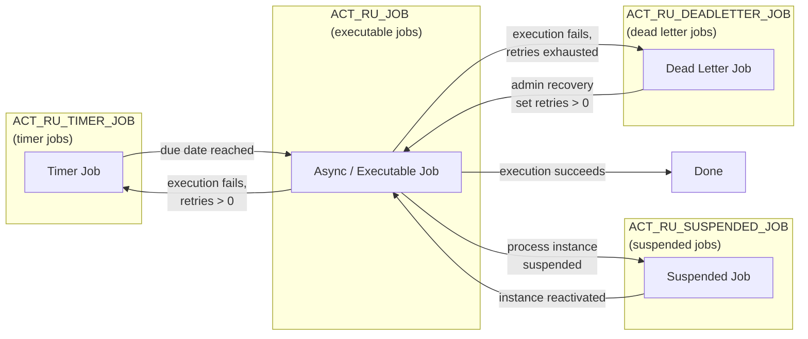
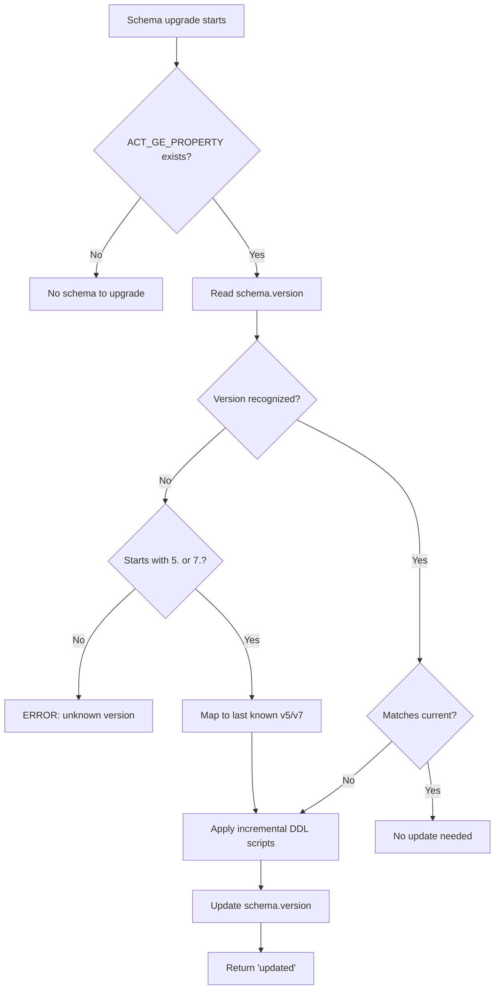

# Management Service and Administrative Operations

The `ManagementService` provides administrative and maintenance operations on the Activiti engine. Unlike the Runtime, Task, and History services designed for application logic, ManagementService operations are intended for system administration, troubleshooting, and operational control.

The service is marked `@Internal`, indicating it should not be used in business workflows but rather in admin tools, monitoring dashboards, and recovery scripts.

## Getting the ManagementService

```java
ProcessEngine processEngine = ProcessEngines.getDefaultProcessEngine();
ManagementService managementService = processEngine.getManagementService();
```

## Job Lifecycle Overview

Activiti jobs transition through several states stored in separate database tables:



### Job States

| State | Table | Description |
|-------|-------|-------------|
| Timer | `ACT_RU_TIMER_JOB` | Scheduled for future execution (timers, retry backoff) |
| Executable | `ACT_RU_JOB` | Ready for immediate execution by the async executor |
| Suspended | `ACT_RU_SUSPENDED_JOB` | Temporarily removed from execution (parent process instance suspended) |
| Dead Letter | `ACT_RU_DEADLETTER_JOB` | Retries exhausted, requires manual intervention |

## Querying Jobs

Four query types are available through `ManagementService`, one for each job state.

### Executable Jobs (JobQuery)

```java
// All executable jobs
List<Job> allJobs = managementService.createJobQuery().list();

// Failed jobs with exception
List<Job> failedJobs = managementService.createJobQuery()
    .withException()
    .list();

// Jobs for a specific process instance
List<Job> instanceJobs = managementService.createJobQuery()
    .processInstanceId("instanceId")
    .list();

// Jobs due within the next hour
Date oneHourFromNow = new Date(System.currentTimeMillis() + 3600000);
List<Job> upcomingJobs = managementService.createJobQuery()
    .duedateLowerThan(oneHourFromNow)
    .orderByJobDuedate().asc()
    .listPage(0, 50);
```

**JobQuery filters:**

| Method | Description |
|--------|-------------|
| `jobId(String)` | Exact job ID |
| `processInstanceId(String)` | Filter by process instance |
| `executionId(String)` | Filter by execution |
| `processDefinitionId(String)` | Filter by definition |
| `timers()` | Only timer-type jobs |
| `messages()` | Only message-type jobs |
| `duedateLowerThan(Date)` | Due before this date |
| `duedateHigherThan(Date)` | Due after this date |
| `withException()` | Jobs with failure messages |
| `exceptionMessage(String)` | Exact exception message |
| `jobTenantId(String)` | Exact tenant ID |
| `jobTenantIdLike(String)` | Tenant ID pattern |
| `jobWithoutTenantId()` | No tenant |
| `locked()` | Currently locked by executor |
| `unlocked()` | Not locked |

### Timer Jobs (TimerJobQuery)

```java
// All timer jobs
List<Job> timers = managementService.createTimerJobQuery().list();

// Executable timers (due date reached)
List<Job> readyTimers = managementService.createTimerJobQuery()
    .executable()
    .list();

// Timers for a process definition
List<Job> defTimers = managementService.createTimerJobQuery()
    .processDefinitionId("myProcess:1:12345")
    .orderByJobDuedate().asc()
    .list();
```

`TimerJobQuery` supports the same filters as `JobQuery` except `locked()`/`unlocked()`, plus:

| Method | Description |
|--------|-------------|
| `executable()` | Due date is null or in the past |

### Suspended Jobs (SuspendedJobQuery)

```java
// All suspended jobs
List<Job> suspended = managementService.createSuspendedJobQuery().list();

// Suspended jobs that still have retries
List<Job> retryable = managementService.createSuspendedJobQuery()
    .withRetriesLeft()
    .list();

// Suspended jobs exhausted
List<Job> exhausted = managementService.createSuspendedJobQuery()
    .noRetriesLeft()
    .list();
```

| Method | Description |
|--------|-------------|
| `withRetriesLeft()` | Retries > 0 |
| `noRetriesLeft()` | Retries = 0 |
| `executable()` | Retries > 0 and due date reached |

### Dead Letter Jobs (DeadLetterJobQuery)

```java
// All dead letter jobs
List<Job> deadLetters = managementService.createDeadLetterJobQuery().list();

// Dead letters with a specific exception
List<Job> specificError = managementService.createDeadLetterJobQuery()
    .exceptionMessage("Connection refused")
    .list();

// Dead letters for a tenant
List<Job> tenantDead = managementService.createDeadLetterJobQuery()
    .jobTenantId("tenant-1")
    .list();
```

## Job Properties

Each `Job` instance exposes:

```java
String jobId              = job.getId();
Date duedate              = job.getDuedate();
String processInstanceId  = job.getProcessInstanceId();
String executionId        = job.getExecutionId();
String processDefId       = job.getProcessDefinitionId();
int retries               = job.getRetries();
String exceptionMsg       = job.getExceptionMessage();
String tenantId           = job.getTenantId();
boolean exclusive         = job.isExclusive();
String jobType            = job.getJobType();          // "timer" or "message"
String handlerType        = job.getJobHandlerType();   // job handler class type
String handlerConfig      = job.getJobHandlerConfiguration();
```

## Forcing Job Execution

Execute a job immediately, bypassing suspension state and due date checks:

```java
managementService.executeJob("jobId");
```

Use cases:
- Testing async continuations without waiting for the executor
- Manual recovery of a stuck job
- Overriding suspension for a critical path

**Important:** `executeJob` wraps failures in `ActivitiException`. If the job fails, the exception is thrown synchronously and the job's retry counter is decremented via `JobRetryCmd` (see Failed Job Handling).

## Moving Jobs Between States

### Timer to Executable

Force a timer job to become executable immediately:

```java
Job executableJob = managementService.moveTimerToExecutableJob("timerJobId");
```

### Job to Dead Letter

Move an executable or timer job to dead letter without waiting for retries to exhaust:

```java
Job deadLetterJob = managementService.moveJobToDeadLetterJob("jobId");
```

This looks up the job in both `ACT_RU_JOB` and `ACT_RU_TIMER_JOB`.

### Dead Letter to Executable (Recovery)

Recover a dead letter job by restoring it with new retries:

```java
Job recoveredJob = managementService.moveDeadLetterJobToExecutableJob("deadLetterJobId", 3);
```

The `retries` parameter must be greater than 0. The job is removed from `ACT_RU_DEADLETTER_JOB` and inserted into `ACT_RU_JOB` with the specified retry count.

## Setting Job Retries

Adjust the retry counter on executable or timer jobs:

```java
// Extend retries on an executable job
managementService.setJobRetries("jobId", 5);

// Extend retries on a timer job
managementService.setTimerJobRetries("timerJobId", 3);
```

Both methods reject negative values with `ActivitiIllegalArgumentException`. A retry value of 0 marks the job for dead letter on next failure.

## Getting Exception Stack Traces

For diagnostic purposes, retrieve the full stack trace from failed jobs:

```java
// Executable job
String stack = managementService.getJobExceptionStacktrace("jobId");

// Timer job
String timerStack = managementService.getTimerJobExceptionStacktrace("timerJobId");

// Suspended job
String suspStack = managementService.getSuspendedJobExceptionStacktrace("suspendedJobId");

// Dead letter job
String deadStack = managementService.getDeadLetterJobExceptionStacktrace("deadLetterJobId");
```

Returns `null` when no exception has occurred, or the full multi-line stack trace string.

## Deleting Jobs

```java
managementService.deleteJob("jobId");
managementService.deleteTimerJob("timerJobId");
managementService.deleteDeadLetterJob("deadLetterJobId");
```

**Safety check:** `deleteJob` and `deleteTimerJob` throw `ActivitiException` if the job is currently locked (being executed by the async executor). Retry after the lock expires. `deleteDeadLetterJob` has no lock check since dead letter jobs are not picked up by the executor.

All deletion methods dispatch a `JOB_CANCELED` event.

## Dead Letter Job Handling

### When Jobs Enter Dead Letter

A job enters the dead letter table (`ACT_RU_DEADLETTER_JOB`) when:
1. Execution fails and `retries` decrements to 0
2. An admin explicitly moves it via `moveJobToDeadLetterJob()`

### Automatic Retry Behavior

When a job fails, `HandleFailedJobCmd` delegates to `FailedJobCommandFactory` (default: `DefaultFailedJobCommandFactory`), which creates a `JobRetryCmd`. The retry command:

1. Checks the service task's `failedJobRetryTimeCycle` attribute (R/IS/O syntax, e.g., `R5/PT10S`)
2. If configured, applies the custom retry schedule
3. Otherwise, uses engine defaults (`asyncFailedJobWaitTime` for message jobs, `defaultFailedJobWaitTime` for timer jobs)
4. If `retries <= 1` after decrement, moves to dead letter table
5. Otherwise, moves to timer table with a new due date for backoff

```java
// JobRetryCmd decision flow:
// retries <= 1 after decrement -> ACT_RU_DEADLETTER_JOB
// retries > 1 after decrement  -> ACT_RU_TIMER_JOB (with backoff duedate)
```

### Recovery Procedure

```java
// 1. Find dead letter jobs
List<Job> deadJobs = managementService.createDeadLetterJobQuery()
    .withException()
    .orderByJobId().asc()
    .list();

for (Job deadJob : deadJobs) {
    String stacktrace = managementService.getDeadLetterJobExceptionStacktrace(deadJob.getId());
    System.out.printf("[%s] Exception: %s%n", deadJob.getId(), deadJob.getExceptionMessage());
    System.out.println(stacktrace);

    // 2. Fix the underlying issue (external system, data, etc.)

    // 3. Move back to executable with retries
    managementService.moveDeadLetterJobToExecutableJob(deadJob.getId(), 3);

    // 4. Or delete if the job is no longer relevant
    // managementService.deleteDeadLetterJob(deadJob.getId());
}
```

### Custom Failed Job Command Factory

Replace the default retry behavior by implementing `FailedJobCommandFactory`:

```java
public class CustomFailedJobCommandFactory implements FailedJobCommandFactory {
    @Override
    public Command<Object> getCommand(String jobId, Throwable exception) {
        // Custom logic: escalate to dead letter immediately, log, alert, etc.
        return new JobRetryCmd(jobId, exception);
    }
}
```

```java
ProcessEngineConfiguration config = new ProcessEngineConfigurationImpl();
config.setFailedJobCommandFactory(new CustomFailedJobCommandFactory());
```

## Timer Job Management

### Viewing Upcoming Timers

```java
Date now = new Date();
List<Job> upcoming = managementService.createTimerJobQuery()
    .duedateHigherThan(now)
    .orderByJobDuedate().asc()
    .listPage(0, 100);

for (Job timer : upcoming) {
    System.out.printf("Timer %s: due %s, process %s%n",
        timer.getId(),
        timer.getDuedate(),
        timer.getProcessInstanceId());
}
```

### Canceling Timers

Timers can be canceled by deleting the timer job:

```java
managementService.deleteTimerJob("timerJobId");
```

This is distinct from canceling a process instance, which removes all associated timers as a side effect.

### Moving Timer to Executable

When a timer is due but the executor hasn't picked it up (e.g., after engine restart), you can force the transition:

```java
Job executableJob = managementService.moveTimerToExecutableJob("timerJobId");
managementService.executeJob(executableJob.getId());
```

## Suspended Job Activation

When a process instance is suspended, its active jobs move to `ACT_RU_SUSPENDED_JOB`. Reactivating the instance moves them back:

```java
// Suspend the instance
runtimeService.suspendProcessInstanceById("processInstanceId");

// ... maintenance ...

// Reactivate — suspended jobs return to executable/timer tables
runtimeService.activateProcessInstanceById("processInstanceId");
```

Internally, `activateSuspendedJob` (via `JobManager`) converts each `SuspendedJobEntity` back to either a `TimerJobEntity` (if `jobType == "timer"`) or a `JobEntity` (if `jobType == "message"`).

## Database Introspection

The ManagementService provides direct database inspection capabilities for monitoring and diagnostics.

### Table Counts

```java
Map<String, Long> counts = managementService.getTableCount();
for (Map.Entry<String, Long> entry : counts.entrySet()) {
    System.out.printf("%s: %d rows%n", entry.getKey(), entry.getValue());
}
```

Returns a map of all Activiti table names to their row counts. Useful for monitoring data volume and detecting anomalies (e.g., growing dead letter table).

### Table Name Resolution

```java
String taskTable = managementService.getTableName(TaskEntity.class);
String jobTable  = managementService.getTableName(JobEntity.class);
```

Returns the actual database table name including any configured prefix (e.g., `ACT_RU_TASK`).

### Table Metadata

```java
TableMetaData metaData = managementService.getTableMetaData("ACT_RU_TASK");
if (metaData != null) {
    System.out.println("Table: " + metaData.getTableName());
    List<String> columns = metaData.getColumnNames();
    List<String> types   = metaData.getColumnTypes();
    for (int i = 0; i < columns.size(); i++) {
        System.out.printf("  %s: %s%n", columns.get(i), types.get(i));
    }
}
```

Returns `null` if the table doesn't exist.

### Table Page Query

Paginated access to raw table data:

```java
TablePage page = managementService.createTablePageQuery()
    .tableName("ACT_RU_TASK")
    .orderAsc("NAME_")
    .listPage(0, 25);

System.out.println("Total rows: " + page.getTotal());
System.out.println("Page size:  " + page.getSize());

for (Map<String, Object> row : page.getRows()) {
    System.out.println(row);
}
```

Each row is a `Map<String, Object>` of column name to value. This provides low-level access when the standard APIs are insufficient.

```java
// TablePage properties:
long totalRows   = page.getTotal();         // total rows in table
long firstResult = page.getFirstResult();   // starting index of this page
long pageSize    = page.getSize();          // number of rows returned
List<Map<String, Object>> data = page.getRows(); // row data
String tableName = page.getTableName();
```

## Event Log Querying

The database event log (`ACT_EV_LOG`) records every engine operation. This requires `setEnableDatabaseEventLogging(true)` in the engine configuration.

```java
// Latest 100 entries
List<EventLogEntry> recent = managementService.getEventLogEntries(null, 100L);

// All entries for a process instance
List<EventLogEntry> processLog = managementService.getEventLogEntriesByProcessInstanceId("instanceId");

// Paginated from log number 500
List<EventLogEntry> page = managementService.getEventLogEntries(500L, 50L);
```

### EventLogEntry Fields

```java
long   logNumber = entry.getLogNumber();           // sequential number
String type      = entry.getType();                // event type string
String procDefId = entry.getProcessDefinitionId();
String procInstId= entry.getProcessInstanceId();
String execId    = entry.getExecutionId();
String taskId    = entry.getTaskId();
Date   timestamp = entry.getTimeStamp();
String userId    = entry.getUserId();
byte[] data      = entry.getData();                // serialized event details
```

### Forensic Analysis Example

```java
List<EventLogEntry> timeline = managementService
    .getEventLogEntriesByProcessInstanceId("instanceId");

for (EventLogEntry entry : timeline) {
    System.out.printf("[%d] %s | %s | user=%s%n",
        entry.getLogNumber(),
        entry.getTimeStamp(),
        entry.getType(),
        entry.getUserId());
}
```

### Deleting Event Log Entries

```java
managementService.deleteEventLogEntry(12345L);
```

This should only be used in testing. Deleting entries from a production audit log undermines its integrity.

## Custom SQL Execution

Execute custom SQL within the engine's transaction context using MyBatis mappers:

```java
// Define a mapper interface
public interface TaskMapper {
    @Select("SELECT COUNT(*) FROM #{prefix}ACT_RU_TASK WHERE ASSIGNEE_ = #{assignee}")
    int countTasksByAssignee(@Param("assignee") String assignee);
}

// Execute through ManagementService
int count = managementService.executeCustomSql(
    new CustomSqlExecution<TaskMapper, Integer>() {
        @Override
        public Class<TaskMapper> getMapperClass() {
            return TaskMapper.class;
        }

        @Override
        public Integer execute(TaskMapper mapper) {
            return mapper.countTasksByAssignee("john");
        }
    }
);
```

The `CustomSqlExecution` interface requires:
- `getMapperClass()` — the MyBatis mapper interface class
- `execute(Mapper)` — the SQL operation returning a result

**Important:** The mapper runs within the engine's database session and transaction. Use `#{prefix}` for table prefixes. This is marked `@Internal` and should be used cautiously — bypassing the ORM layer can lead to data inconsistencies if not carefully managed.

## Schema Management

### Engine Properties

```java
Map<String, String> props = managementService.getProperties();
for (Map.Entry<String, String> entry : props.entrySet()) {
    System.out.printf("%s = %s%n", entry.getKey(), entry.getValue());
}
```

Returns engine properties from `ACT_GE_PROPERTY`, including:
- `schema.version` — the Activiti schema version
- `schema.history` — schema migration history

### Database Schema Upgrade

Programmatic schema upgrade on a given connection:

```java
Connection connection = dataSource.getConnection();
String result = managementService.databaseSchemaUpgrade(connection, null, null);
// result is "updated" if schema was changed, or "no update" if already current
```

This method runs without a transaction (`transactionNotSupported()`), creates a `DbSqlSession` on the provided connection, and calls `dbSchemaUpdate()`.

### Schema Update Behavior

The engine checks `schema.version` against its known version sequence:
1. If version matches, no update needed
2. If version is older, incremental DDL scripts are applied
3. If version is unknown but starts with `5.` or `7.`, it assumes the last known version of that major line and upgrades from there
4. If version is completely unknown, throws `ActivitiException`



### DbSchemaUpdate Utility Class

A standalone utility is available at `org.activiti.engine.impl.db.DbSchemaUpdate` with a `main` method that upgrades the default process engine's schema:

```java
// Run as a standalone Java program
org.activiti.engine.impl.db.DbSchemaUpdate.main(args);
```

This executes `dbSchemaUpdate()` with `transactionNotSupported()` to prevent transaction rollback during schema changes.

## Command Execution

Direct command execution for advanced scenarios:

```java
// Default configuration
Object result = managementService.executeCommand(new MyCustomCommand());

// With custom transaction isolation
CommandConfig config = new CommandConfig()
    .transactionRequiresNew();
Object result2 = managementService.executeCommand(config, new MyCustomCommand());
```

`CommandConfig` options:
- `transactionNotSupported()` — runs outside a transaction
- `transactionRequiresNew()` — always starts a new transaction

## Exclusive Job Locking

Exclusive jobs prevent concurrent execution on the same process instance:

```java
// Lock an exclusive job (update process instance lock time)
managementService.executeCommand(new LockExclusiveJobCmd(job));

// Unlock an exclusive job (clear process instance lock time)
managementService.executeCommand(new UnlockExclusiveJobCmd(job));
```

When a job is exclusive (`isExclusive() == true`), the engine locks the parent process instance. Other exclusive jobs on the same instance must wait until the lock is released. By default, async jobs are exclusive (`Job.DEFAULT_EXCLUSIVE = true`).

## Operational Procedures

### Failed Job Triage

```java
// Step 1: Identify all failed jobs
List<Job> failed = managementService.createJobQuery()
    .withException()
    .orderByJobDuedate().asc()
    .list();

for (Job job : failed) {
    // Step 2: Read the stack trace
    String stacktrace = managementService.getJobExceptionStacktrace(job.getId());

    // Step 3: Classify the failure
    String msg = job.getExceptionMessage();
    if (msg.contains("Connection refused")) {
        // External system down — set retries, will auto-retry with backoff
        managementService.setJobRetries(job.getId(), 5);
    } else if (msg.contains("Constraint violation")) {
        // Data issue — fix data, then recover
        // managementService.moveDeadLetterJobToExecutableJob(job.getId(), 3);
    } else if (msg.contains("NullPointerException")) {
        // Bug — fix the code, delete stale job
        managementService.deleteJob(job.getId());
    }
}
```

### Stuck Process Recovery

```java
// Check for jobs that are locked but executor isn't running
List<Job> locked = managementService.createJobQuery()
    .locked()
    .list();

for (Job job : locked) {
    // If the engine was restarted, locks may be stale
    // The async executor will release expired locks on next acquisition
    System.out.printf("Locked job %s, lock owner: %s, expires: %s%n",
        job.getId(),
        ((JobEntity) job).getLockOwner(),
        ((JobEntity) job).getLockExpirationTime());
}

// For timer jobs that should have fired
List<Job> overdueTimers = managementService.createTimerJobQuery()
    .executable()
    .duedateLowerThan(new Date())
    .list();

for (Job timer : overdueTimers) {
    // Move to executable and run
    Job exec = managementService.moveTimerToExecutableJob(timer.getId());
    managementService.executeJob(exec.getId());
}
```

### Database Table Health Check

```java
Map<String, Long> counts = managementService.getTableCount();

// Check for abnormal dead letter growth
Long deadLetterCount = counts.get("ACT_RU_DEADLETTER_JOB");
if (deadLetterCount != null && deadLetterCount > 1000) {
    System.err.println("WARNING: Dead letter table has " + deadLetterCount + " entries");
}

// Check suspended jobs after reactivation
Long suspendedCount = counts.get("ACT_RU_SUSPENDED_JOB");
if (suspendedCount != null && suspendedCount > 0) {
    System.out.println("Info: " + suspendedCount + " suspended jobs in queue");
}

// Report all job-related counts
System.out.printf("Executable jobs:     %s%n", counts.get("ACT_RU_JOB"));
System.out.printf("Timer jobs:          %s%n", counts.get("ACT_RU_TIMER_JOB"));
System.out.printf("Dead letter jobs:    %s%n", counts.get("ACT_RU_DEADLETTER_JOB"));
System.out.printf("Suspended jobs:      %s%n", counts.get("ACT_RU_SUSPENDED_JOB"));
```

### Event Log Analysis for Incidents

```java
// Reconstruct what happened during a failure window
Date startTime = ...; // incident start
Date endTime   = ...; // incident end

List<EventLogEntry> allEntries = managementService.getEventLogEntries(null, null);

for (EventLogEntry entry : allEntries) {
    if (entry.getTimeStamp().after(startTime) && entry.getTimeStamp().before(endTime)) {
        System.out.printf("[%d] %s type=%s proc=%s user=%s%n",
            entry.getLogNumber(),
            entry.getTimeStamp(),
            entry.getType(),
            entry.getProcessInstanceId(),
            entry.getUserId());
    }
}
```

## Management Service in Distributed Environments

### Job Acquisition and Locking

In a multi-instance deployment, the async executor uses optimistic locking to prevent duplicate job execution:

1. `AcquireJobsCmd` fetches due jobs and sets a lock owner + expiration time
2. Each executor instance has a unique `lockOwner` (UUID-based)
3. Jobs are locked for `asyncJobLockTimeInMillis` (default: 300,000ms = 5 minutes)
4. If an executor crashes, its locked jobs expire and become available to other instances

### Exclusive Jobs

Exclusive jobs on the same process instance are serialized across all executor instances via a `LOCK_TIME_` column on `ACT_RU_EXECUTION`. The `LockExclusiveJobCmd` updates this timestamp; `UnlockExclusiveJobCmd` clears it.

### Timer Job Coordination

`AcquireTimerJobsCmd` uses the same lock-based mechanism for timer jobs. The `AcquireTimerJobsRunnable` periodically checks for timers whose due date has passed and moves them to executable jobs via `jobManager.moveTimerJobToExecutableJob()`.

### Dead Letter Safety

Dead letter jobs are not acquired by any executor, making them safe for admin manipulation in distributed environments. However, `moveDeadLetterJobToExecutableJob` triggers the async executor, so in a multi-instance setup, any instance can pick up the recovered job.

## Best Practices and Common Pitfalls

### Best Practices

1. **Monitor dead letter queue regularly** — A growing `ACT_RU_DEADLETTER_JOB` table indicates systemic issues
2. **Use `failedJobRetryTimeCycle` in BPMN** — Configure retry schedules at the service task level rather than relying on engine defaults:
   ```xml
   <serviceTask activiti:failedJobRetryTimeCycle="R5/PT10S" ...>
   ```
3. **Check exception stack traces before deleting** — A dead letter job may contain evidence of a recurring bug
4. **Enable event logging for critical processes** — The sequential log provides an audit trail for post-incident analysis
5. **Table page queries for monitoring** — Use `createTablePageQuery()` to inspect raw data when standard queries are insufficient

### Common Pitfalls

| Pitfall | Consequence | Mitigation |
|---------|-------------|------------|
| Deleting a locked job | `ActivitiException: Cannot delete job when the job is being executed` | Query `unlocked()` jobs only, or wait for lock expiry |
| Setting retries to 0 | Job goes to dead letter on next failure | Use `setJobRetries(jobId, retries)` with `retries >= 1` |
| Event log not populated | `getEventLogEntries()` returns empty list | Verify `setEnableDatabaseEventLogging(true)` is set |
| Custom SQL bypasses ORM | Risk of data inconsistency | Only use for read operations or carefully tested writes |
| Moving dead letter without fixing root cause | Job fails again and returns to dead letter | Always investigate stack trace before recovery |
| `getTableMetaData()` returns null | Table doesn't exist or name mismatch | Use `getTableName()` to verify actual table name with prefix |

## API Reference Summary

```java
// Table introspection
Map<String, Long>   managementService.getTableCount();
String              managementService.getTableName(Class<?> entityClass);
TableMetaData       managementService.getTableMetaData(String tableName);
TablePageQuery      managementService.createTablePageQuery();

// Job queries
JobQuery            managementService.createJobQuery();
TimerJobQuery       managementService.createTimerJobQuery();
SuspendedJobQuery   managementService.createSuspendedJobQuery();
DeadLetterJobQuery  managementService.createDeadLetterJobQuery();

// Job manipulation
void                managementService.executeJob(String jobId);
Job                 managementService.moveTimerToExecutableJob(String jobId);
Job                 managementService.moveJobToDeadLetterJob(String jobId);
Job                 managementService.moveDeadLetterJobToExecutableJob(String jobId, int retries);
void                managementService.deleteJob(String jobId);
void                managementService.deleteTimerJob(String jobId);
void                managementService.deleteDeadLetterJob(String jobId);
void                managementService.setJobRetries(String jobId, int retries);
void                managementService.setTimerJobRetries(String jobId, int retries);

// Exception diagnostics
String              managementService.getJobExceptionStacktrace(String jobId);
String              managementService.getTimerJobExceptionStacktrace(String jobId);
String              managementService.getSuspendedJobExceptionStacktrace(String jobId);
String              managementService.getDeadLetterJobExceptionStacktrace(String jobId);

// Properties and schema
Map<String, String> managementService.getProperties();
String              managementService.databaseSchemaUpgrade(Connection, String catalog, String schema);

// Custom SQL
<MapperType, ResultType> ResultType managementService.executeCustomSql(CustomSqlExecution<MapperType, ResultType> customSql);

// Event log
List<EventLogEntry> managementService.getEventLogEntries(Long startLogNr, Long pageSize);
List<EventLogEntry> managementService.getEventLogEntriesByProcessInstanceId(String processInstanceId);
void                managementService.deleteEventLogEntry(long logNr);

// Command execution
<T> T               managementService.executeCommand(Command<T> command);
<T> T               managementService.executeCommand(CommandConfig config, Command<T> command);
```

## Related Documentation

- [Process Instance Suspension](./process-instance-suspension.md) — Suspended and activated process instances
- [Async Execution](../bpmn/reference/async-execution.md) — Async job executor configuration
- [Database Event Logging](./database-event-logging.md) — Event log setup and querying
- [Engine Configuration](../configuration) — Engine setup and tuning
