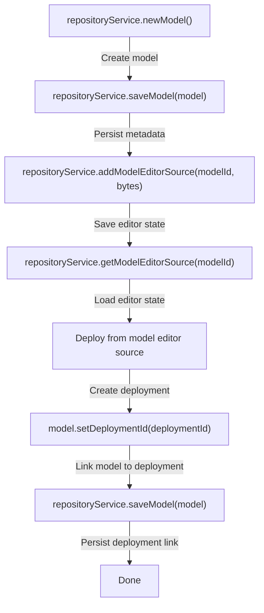

# Model API

The Model API provides a staging area for process models between editing and deployment. A Model is distinct from a deployed process definition — it represents a work-in-progress that can be edited, versioned, and eventually deployed.

This is the backbone of model-based BPMN editors (like Activiti Modeler).

## Model Entity

```java
public interface Model {
    String getId();
    String getName();         void setName(String name);
    String getKey();          void setKey(String key);
    String getCategory();     void setCategory(String category);
    Integer getVersion();     void setVersion(Integer version);
    String getMetaInfo();     void setMetaInfo(String metaInfo);
    String getDeploymentId(); void setDeploymentId(String deploymentId);
    String getTenantId();     void setTenantId(String tenantId);
    Date getCreateTime();
    Date getLastUpdateTime();
    boolean hasEditorSource();
    boolean hasEditorSourceExtra();
}
```

## Creating and Saving Models

```java
// Create a new model
Model model = repositoryService.newModel();
model.setName("Order Process");
model.setKey("orderProcess");
model.setCategory("sales");
model.setVersion(1);

// Meta info is JSON — store custom metadata
ObjectNode metaInfo = JsonNodeFactory.instance.objectNode();
metaInfo.put("description", "Process for handling customer orders");
metaInfo.put("author", "john.doe");
model.setMetaInfo(metaInfo.toString());

// Set tenant
model.setTenantId("tenant-123");

// Save
repositoryService.saveModel(model);
```

## Editor Source

Models have two byte[] storage fields for editor data:

```java
// Store the BPMN XML (or editor JSON state)
byte[] editorSource = bpmnXml.getBytes(StandardCharsets.UTF_8);
repositoryService.addModelEditorSource(modelId, editorSource);

// Store additional editor data (e.g., canvas positions, UI state)
byte[] editorSourceExtra = uiState.getBytes(StandardCharsets.UTF_8);
repositoryService.addModelEditorSourceExtra(modelId, editorSourceExtra);
```

## Retrieving Models

```java
// Get a model by ID
Model model = repositoryService.getModel(modelId);

// Query models
List<Model> models = repositoryService.createModelQuery()
    .modelKey("orderProcess")
    .modelCategoryLike("sales%")
    .orderByModelName().asc()
    .list();

// Latest version of a key
Model latest = repositoryService.createModelQuery()
    .modelKey("orderProcess")
    .latestVersion()
    .singleResult();
```

### Query Filters

| Method | Description |
|--------|-------------|
| `modelId(String)` | Exact model ID |
| `modelKey(String)` | Exact model key |
| `modelCategory(String)` | Exact category |
| `modelCategoryLike(String)` | Pattern match on category |
| `modelCategoryNotEquals(String)` | Category not equal to value |
| `modelName(String)` | Exact model name |
| `modelNameLike(String)` | Pattern match on name |
| `modelVersion(Integer)` | By version |
| `modelTenantId(String)` | By tenant |
| `modelTenantIdLike(String)` | Pattern match on tenant |
| `latestVersion()` | Latest version per key |
| `modelWithoutTenantId()` | Models with no tenant |
| `deploymentId(String)` | Models sourced from deployment |
| `deployed()` | Models that are deployed |
| `notDeployed()` | Models not yet deployed |

## Deploying a Model

Convert a model's editor source into a deployment:

```java
// Read the BPMN source from the model
byte[] modelSource = repositoryService.getModelEditorSource(model.getId());
if (modelSource == null) {
    throw new IllegalStateException("Model has no source");
}

// Deploy
Deployment deployment = repositoryService.createDeployment()
    .name(model.getName())
    .addInputStream(model.getName() + ".bpmn", new ByteArrayInputStream(modelSource))
    .deploy();

// Update the model to reference the deployment
model.setDeploymentId(deployment.getId());
model.setVersion(model.getVersion() + 1);
repositoryService.saveModel(model);
```

## Deleting Models

```java
repositoryService.deleteModel("modelId");
```

Deleting a model does not delete its deployment — the deployed process definitions remain active.

## Model to BpmnModel Conversion

```java
byte[] source = repositoryService.getModelEditorSource(modelId);
BpmnXMLConverter converter = new BpmnXMLConverter();
BpmnModel bpmnModel = converter.convertToBpmnModel(
    new ByteArrayInputStream(source), true, false);

// Now you can deploy programmatically
repositoryService.createDeployment()
    .addBpmnModel("converted.bpmn", bpmnModel)
    .deploy();
```

## Use Cases

### Model Editor Integration



### Model Versioning

```java
// Each model key can have multiple versions
Model v1 = repositoryService.createModelQuery()
    .modelKey("invoiceProcess").modelVersion(1).singleResult();

Model v2 = repositoryService.createModelQuery()
    .modelKey("invoiceProcess").modelVersion(2).singleResult();

Model latest = repositoryService.createModelQuery()
    .modelKey("invoiceProcess").latestVersion().singleResult();
```

### Staged Deployment Pipeline

```java
// Development: models are edited but not deployed
Model devModel = repositoryService.newModel();
devModel.setKey("newProcess");
devModel.setCategory("development");
repositoryService.saveModel(devModel);

// After review: deploy and update model
repositoryService.createDeployment()
    .addInputStream("newProcess.bpmn", getSource(devModel))
    .deploy();
```

## Related Documentation

- [Advanced Deployment Builder](./deployment-builder.md) — Deployment options
- [BPMN Model](../../api-reference/engine-api/bpmn-model.md) — Programmatic BPMN manipulation
