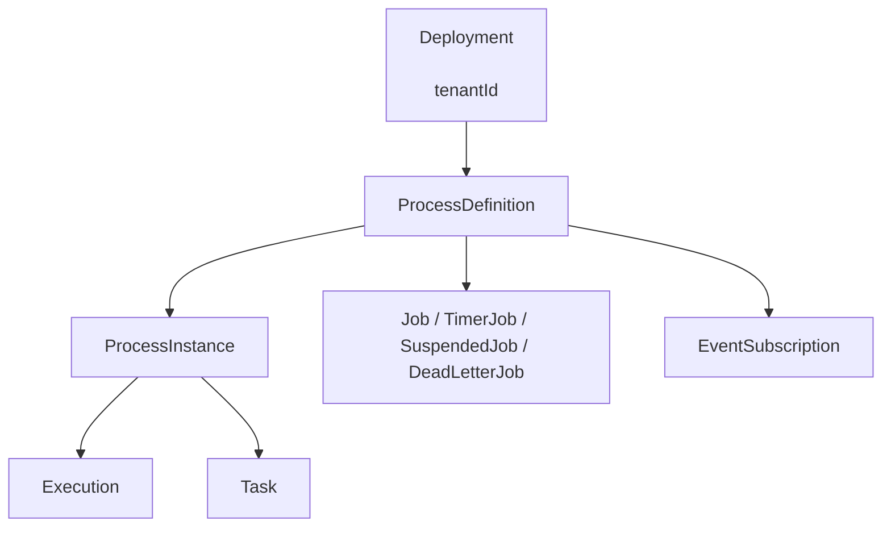
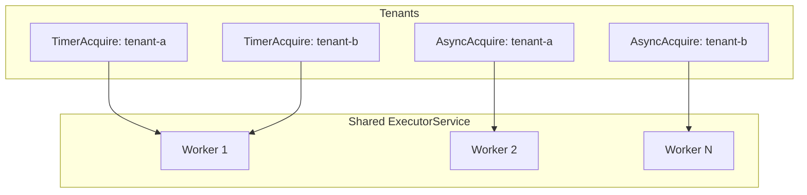

# Multi-Tenancy in Activiti

Multi-tenancy allows a single Activiti engine instance to serve multiple isolated tenants — separate organizations, customers, or business units — sharing the same process engine while maintaining data separation.

Activiti supports multi-tenancy at three levels: logical tenant IDs on deployments, separate database schemas per tenant, and fully independent databases. The default engine configuration provides out-of-the-box support for the most common scenario: a shared schema with tenant-based data filtering.

## Tenant ID Fundamentals

Every entity in Activiti carries an optional tenant identifier. Setting a tenant ID at the deployment level automatically propagates it downstream to process definitions, process instances, tasks, jobs, and event subscriptions.

```java
// Set tenant ID at deployment time
Deployment deployment = repositoryService.createDeployment()
    .tenantId("acme-corp")
    .addClasspathResource("approval-process.bpmn")
    .deploy();

// All resulting entities inherit the tenant ID
ProcessDefinition pd = repositoryService.createProcessDefinitionQuery()
    .deploymentId(deployment.getId())
    .singleResult();
System.out.println(pd.getTenantId()); // "acme-corp"
```

### Tenant ID Propagation



When a deployment is created with a tenant ID, the following entities inherit it automatically:

| Entity | Source | Query Filter |
|---|---|---|
| ProcessDefinition | Deployment | `processDefinitionTenantId()` |
| ProcessInstance | ProcessDefinition | `processInstanceTenantId()` |
| Task | ProcessInstance | `taskTenantId()` |
| Execution | ProcessInstance | `executionTenantId()` |
| Job (all types) | Deployment | `jobTenantId()` |
| EventSubscription | Deployment | `eventSubscriptionTenantId()` |
| HistoricProcessInstance | ProcessInstance | `processInstanceTenantId()` |
| HistoricTaskInstance | Task | `taskTenantId()` |

### Deployments Without a Tenant ID

A deployment created without a tenant ID results in all downstream entities having an empty string (`""`) as their tenant ID, which is the value of `ProcessEngineConfiguration.NO_TENANT_ID`. Queries for a specific tenant ID will not match these entities.

```java
// No tenant ID — entities get empty string tenant
repositoryService.createDeployment()
    .addClasspathResource("shared-process.bpmn")
    .deploy();

// These queries exclude non-tenant deployments
repositoryService.createProcessDefinitionQuery()
    .processDefinitionTenantId("acme-corp")  // won't match above
    .list();
```

## Starting Process Instances with Tenant ID

The `startProcessInstanceByKeyAndTenantId` method resolves the correct process definition for the given key and tenant. It returns the latest active version belonging to that tenant.

```java
ProcessInstance pi = runtimeService.startProcessInstanceByKeyAndTenantId(
    "approvalProcess",       // process definition key
    "acme-corp"              // tenant ID
);

// With variables
Map<String, Object> vars = new HashMap<>();
vars.put("orderId", 42);
ProcessInstance pi = runtimeService.startProcessInstanceByKeyAndTenantId(
    "approvalProcess",
    vars,
    "acme-corp"
);

// With business key and variables
ProcessInstance pi = runtimeService.startProcessInstanceByKeyAndTenantId(
    "approvalProcess",
    "order-42",              // business key
    vars,
    "acme-corp"
);
```

## Three Levels of Tenant Isolation

### Level 1: Shared Schema with Tenant IDs (Default)

The default `ProcessEngineConfigurationImpl` is multi-tenant enabled out of the box. All tenants share the same database schema, and data isolation is enforced through the `TENANT_ID_` column present on Activiti's runtime and history tables.

```java
// Standard standalone configuration — already multi-tenant aware
ProcessEngineConfiguration config = ProcessEngineConfiguration
    .createStandaloneProcessEngineConfiguration()
    .setJdbcUrl("jdbc:mysql://localhost/activiti")
    .setJdbcUsername("user")
    .setJdbcPassword("pass")
    .setDatabaseSchemaUpdate(ProcessEngineConfiguration.DB_SCHEMA_UPDATE_TRUE);

ProcessEngine engine = config.buildProcessEngine();

// Filter queries by tenant
List<Task> tasks = engine.getTaskService().createTaskQuery()
    .taskTenantId("acme-corp")
    .list();
```

**Characteristics:**
- Single datasource, single schema
- Tenant data separated by `TENANT_ID_` column
- Simplest to configure and operate
- Suitable for SaaS platforms with many tenants

### Level 2: Separate Schema Per Tenant

The `MultiSchemaMultiTenantProcessEngineConfiguration` assigns each tenant its own database schema. A `TenantAwareDataSource` routes connections to the correct schema based on the current tenant context held in a `TenantInfoHolder`.

```java
TenantInfoHolder tenantInfoHolder = new MyTenantInfoHolder();

MultiSchemaMultiTenantProcessEngineConfiguration config =
    new MultiSchemaMultiTenantProcessEngineConfiguration(tenantInfoHolder);

config.setDatabaseType("mysql");
config.setDatabaseSchemaUpdate(ProcessEngineConfiguration.DB_SCHEMA_UPDATE_TRUE);
config.setAsyncExecutorActivate(true);

// Register tenants with their own data sources
config.registerTenant("acme-corp", createDataSource("jdbc:mysql://localhost/acme_activiti"));
config.registerTenant("globex-inc", createDataSource("jdbc:mysql://localhost/globex_activiti"));

ProcessEngine engine = config.buildProcessEngine();
```

**Key implementation details:**

- **`TenantInfoHolder`**: A thread-local interface that determines the currently active tenant. Before any API call, set the tenant ID:

```java
tenantInfoHolder.setCurrentTenantId("acme-corp");
try {
    // All engine calls now route to the acme-corp schema
    engine.getTaskService().createTaskQuery().list();
} finally {
    tenantInfoHolder.clearCurrentTenantId();
}
```

- **`TenantAwareDataSource`**: Wraps multiple `DataSource` instances and delegates `getConnection()` calls to the data source matching the tenant ID from `TenantInfoHolder`. Throws `ActivitiException` if no data source is registered for the current tenant.

- **`StrongUuidGenerator`**: The multi-schema configuration uses UUIDs for ID generation instead of the default database-backed `DbIdGenerator`, because a global ID table is impossible when each tenant has its own schema.

- **`ExecuteSchemaOperationCommand`**: During engine boot, this command iterates each registered tenant, sets the current tenant context, and applies the configured schema operation (`create`, `update`, `validate`, etc.) to that tenant's schema individually.

- **Runtime tenant registration**: Tenants can be added after the engine boots via `config.registerTenant(tenantId, dataSource)`, which creates the schema, initializes the async executor, and runs post-processing for that tenant.

**Deprecated:** The `MultiSchemaMultiTenantProcessEngineConfiguration`, `TenantInfoHolder`, and `TenantAwareDataSource` are marked `@Deprecated` and will be removed in a future version of Activiti.

### Level 3: Separate Database Per Tenant

For maximum isolation, each tenant gets a fully independent database (potentially on different servers). This is achieved by configuring distinct data sources in the `TenantAwareDataSource` that point to separate databases:

```java
config.registerTenant("tenant-a", createDataSource("jdbc:postgresql://db-a/activiti"));
config.registerTenant("tenant-b", createDataSource("jdbc:postgresql://db-b/activiti"));
```

The engine architecture is identical to Level 2 — the `TenantAwareDataSource` simply routes to a different database server rather than a different schema on the same server.

## Async Executor Strategies

When using `MultiSchemaMultiTenantProcessEngineConfiguration`, the async job executor must be tenant-aware. Two implementations are available:

### SharedExecutorServiceAsyncExecutor

Each tenant has dedicated acquisition threads for timer jobs, async jobs, and expired job reset — but all acquired jobs execute on a shared `ExecutorService` thread pool.

```java
config.setAsyncExecutor(new SharedExecutorServiceAsyncExecutor(tenantInfoHolder));
```

**Architecture:**



- Per-tenant: `TenantAwareAcquireTimerJobsRunnable`, `TenantAwareAcquireAsyncJobsDueRunnable`, `TenantAwareResetExpiredJobsRunnable` threads
- Shared: Single `ExecutorService` for executing acquired jobs
- Each acquired job wraps in a `TenantAwareExecuteAsyncRunnable` that restores the tenant context before execution

### ExecutorPerTenantAsyncExecutor

Each tenant gets a fully independent `AsyncExecutor` instance with its own acquisition threads and its own execution thread pool.

```java
config.setAsyncExecutor(new ExecutorPerTenantAsyncExecutor(tenantInfoHolder));
```

- Per-tenant: Complete `DefaultAsyncJobExecutor` with dedicated thread pools
- Full resource isolation between tenants
- Higher overhead: more threads, more memory

**Tenant-aware factory:** Custom executor implementations per tenant can be provided through `TenantAwareAsyncExecutorFactory`:

```java
TenantAwareAsyncExecutorFactory factory = (tenantId) -> {
    DefaultAsyncJobExecutor executor = new DefaultAsyncJobExecutor();
    if ("premium-tenant".equals(tenantId)) {
        executor.setMaxAsyncJobsDuePerAcquisition(100);
    }
    return executor;
};

config.setAsyncExecutor(new ExecutorPerTenantAsyncExecutor(tenantInfoHolder, factory));
```

### Comparing Async Executors

| Feature | SharedExecutorService | ExecutorPerTenant |
|---|---|---|
| Acquisition threads | Per tenant | Per tenant |
| Execution thread pool | Shared | Per tenant |
| Memory overhead | Lower | Higher |
| Tenant isolation | Logical | Full |
| Custom executor per tenant | No | Yes (via factory) |

Both implementations use tenant-aware runnables that set and clear the `TenantInfoHolder` context:

- `TenantAwareAcquireTimerJobsRunnable` — acquires timer jobs for a specific tenant
- `TenantAwareAcquireAsyncJobsDueRunnable` — acquires async jobs for a specific tenant
- `TenantAwareResetExpiredJobsRunnable` — resets expired jobs for a specific tenant
- `TenantAwareExecuteAsyncRunnable` — executes a job with the correct tenant context restored

## Changing Deployment Tenant ID

The `RepositoryService.changeDeploymentTenantId()` method migrates all entities in a deployment to a new tenant. This is useful for tenant consolidation, data migration, or correcting misassigned deployments.

```java
repositoryService.changeDeploymentTenantId("deployment-id", "new-tenant-id");
```

**What gets updated** (via `ChangeDeploymentTenantIdCmd`):

| Entity | Update Method |
|---|---|
| Deployment | Direct setter |
| ProcessDefinition | SQL update + cache clear |
| Execution (process instances) | SQL update |
| Task | SQL update |
| Job (async, timer, suspended, dead letter) | SQL update |
| EventSubscription | SQL update by old tenant ID |

The process definition cache is fully cleared after migration. The method uses direct SQL updates for performance rather than loading entities into memory.

## Per-Tenant Mail Servers

Activiti supports configuring separate SMTP servers per tenant for email notifications. The `MailActivityBehavior` class resolves mail configuration in this priority:

1. Per-tenant JNDI mail session (`processEngineConfiguration.getMailSessionJndi(tenantId)`)
2. Per-tenant `MailServerInfo` (`processEngineConfiguration.getMailServer(tenantId)`)
3. Global JNDI mail session (`processEngineConfiguration.getMailSessionJndi()`)
4. Global mail properties (`processEngineConfiguration.getMailServerHost()`, etc.)

```java
// Configure per-tenant mail servers
Map<String, MailServerInfo> mailServers = new HashMap<>();

MailServerInfo acmeMail = new MailServerInfo();
acmeMail.setMailServerHost("smtp.acme-corp.com");
acmeMail.setMailServerPort(587);
acmeMail.setMailServerUsername("notifications@acme-corp.com");
acmeMail.setMailServerPassword("secret");
acmeMail.setMailServerUseTLS(true);
acmeMail.setMailServerDefaultFrom("activiti@acme-corp.com");

mailServers.put("acme-corp", acmeMail);

ProcessEngineConfiguration config = ProcessEngineConfiguration
    .createStandaloneProcessEngineConfiguration()
    .setMailServers(mailServers);
```

### MailServerInfo Properties

| Property | Type | Description |
|---|---|---|
| `mailServerHost` | String | SMTP host address |
| `mailServerPort` | int | SMTP port (default: 25) |
| `mailServerUsername` | String | Authentication username |
| `mailServerPassword` | String | Authentication password |
| `mailServerUseSSL` | boolean | SSL on connect |
| `mailServerUseTLS` | boolean | STARTTLS enabled |
| `mailServerDefaultFrom` | String | Default "from" address |

Per-tenant JNDI mail sessions are configured via `setMailSessionsJndi(Map<String, String>)` with the tenant ID as the key.

## Tenant Filtering in Queries

All Activiti query types support filtering by tenant ID and tenant ID pattern.

```java
// Exact tenant ID
List<Task> tasks = taskService.createTaskQuery()
    .taskTenantId("acme-corp")
    .list();

// Pattern matching (SQL LIKE)
List<Task> tasks = taskService.createTaskQuery()
    .taskTenantIdLike("acme%")
    .list();

// Process definitions by tenant
List<ProcessDefinition> defs = repositoryService.createProcessDefinitionQuery()
    .processDefinitionTenantId("acme-corp")
    .latestVersion()
    .list();

// Deployments by tenant
List<Deployment> deployments = repositoryService.createDeploymentQuery()
    .deploymentTenantId("acme-corp")
    .list();

// Process instances by tenant
List<ProcessInstance> instances = runtimeService.createProcessInstanceQuery()
    .processInstanceTenantId("acme-corp")
    .list();

// Historic tasks by tenant
List<HistoricTaskInstance> historic = historyService.createHistoricTaskInstanceQuery()
    .taskTenantId("acme-corp")
    .list();
```

### Tenant-Specific Suspension

Process definitions can be suspended for a specific tenant without affecting other tenants:

```java
// Suspend for one tenant only
repositoryService.suspendProcessDefinitionByKey(
    "approvalProcess",
    false,              // no cascade
    null,               // immediate
    "acme-corp"         // tenant-specific
);

// Other tenants can still start this process
runtimeService.startProcessInstanceByKeyAndTenantId(
    "approvalProcess",
    null,
    "globex-inc"        // still active for this tenant
);
```

## Tenant Info Holder Implementation

A `TenantInfoHolder` implementation typically uses `ThreadLocal` to store the current tenant ID. The `DummyTenantInfoHolder` from the test suite demonstrates the pattern:

```java
public class MyTenantInfoHolder implements TenantInfoHolder {

    private final ThreadLocal<String> currentTenantId = new ThreadLocal<>();
    private final Set<String> tenants = new HashSet<>();

    @Override
    public Collection<String> getAllTenants() {
        return Collections.unmodifiableSet(tenants);
    }

    @Override
    public void setCurrentTenantId(String tenantId) {
        currentTenantId.set(tenantId);
    }

    @Override
    public String getCurrentTenantId() {
        return currentTenantId.get();
    }

    @Override
    public void clearCurrentTenantId() {
        currentTenantId.remove();
    }

    public void addTenant(String tenantId) {
        tenants.add(tenantId);
    }
}
```

In a web application, a servlet filter or interceptor typically sets the tenant context at the beginning of each request and clears it in a `finally` block, often derived from the authenticated user's tenant association.

## Spring Boot Configuration

The Spring Boot starter (`ActivitiProperties`) supports standard mail server configuration under the `spring.activiti` prefix. However, it does not include dedicated multi-tenancy properties for the `MultiSchemaMultiTenantProcessEngineConfiguration` path.

```yaml
spring.activiti:
  mail-server-host: smtp.example.com
  mail-server-port: 587
  mail-server-user-name: notifications@example.com
  mail-server-password: secret
  mail-server-use-tls: true
  mail-server-default-from: activiti@example.com
```

### Basic Multi-Tenancy in Spring Boot

For the default shared-schema approach, no special configuration is required beyond setting tenant IDs on deployments:

```java
@Autowired
private RepositoryService repositoryService;

@Bean
public DeploymentBuilder tenantDeployment() {
    return repositoryService.createDeployment()
        .name("acme-deployment")
        .tenantId("acme-corp")
        .addClasspathResource("processes/acme.bpmn");
}
```

### Multi-Schema Configuration in Spring Boot

To use `MultiSchemaMultiTenantProcessEngineConfiguration`, define it as a `@Bean`:

```java
@Bean
public ProcessEngineConfiguration processEngineConfiguration(
        TenantInfoHolder tenantInfoHolder,
        Map<String, DataSource> tenantDataSources) {

    MultiSchemaMultiTenantProcessEngineConfiguration config =
        new MultiSchemaMultiTenantProcessEngineConfiguration(tenantInfoHolder);

    config.setDatabaseType("mysql");
    config.setDatabaseSchemaUpdate("true");
    config.setAsyncExecutorActivate(true);
    config.setAsyncExecutor(
        new SharedExecutorServiceAsyncExecutor(tenantInfoHolder));

    for (Map.Entry<String, DataSource> entry : tenantDataSources.entrySet()) {
        config.registerTenant(entry.getKey(), entry.getValue());
    }

    return config;
}
```

## Comparison of Isolation Strategies

| Feature | Shared Schema | Separate Schemas | Separate Databases |
|---|---|---|---|
| Data isolation | Tenant ID column | Schema boundary | Database boundary |
| Configuration | Default | MultiSchemaMultiTenantConfig | MultiSchemaMultiTenantConfig |
| ID generation | DbIdGenerator (default) | StrongUuidGenerator (required) | StrongUuidGenerator (required) |
| Tenant-aware queries | Yes (tenantId filter) | Yes (TenantInfoHolder context) | Yes (TenantInfoHolder context) |
| Per-tenant async executors | No | Yes | Yes |
| Cross-tenant visibility | Possible (no filter) | Impossible | Impossible |
| Deployment migration | `changeDeploymentTenantId` | N/A | N/A |
| Overhead | Minimal | Moderate | Highest |
| Best for | SaaS, many tenants | Mid-size tenants | Compliance, large tenants |

## Best Practices

### Always Clear Tenant Context

When using `TenantInfoHolder`, always clear the tenant ID after operations to prevent cross-tenant data leaks:

```java
tenantInfoHolder.setCurrentTenantId("acme-corp");
try {
    // Perform operations
    taskService.createTaskQuery().list();
} finally {
    tenantInfoHolder.clearCurrentTenantId();
}
```

### Set Tenant ID on All Deployments

Deployments created without a tenant ID cannot be migrated later with `changeDeploymentTenantId` in a meaningful way. Establish a convention or use deployment interceptors to ensure all deployments carry a tenant ID.

### Prefer SharedExecutorService for Many Tenants

When you have a large number of tenants, `SharedExecutorServiceAsyncExecutor` is more resource-efficient than `ExecutorPerTenantAsyncExecutor` because it shares the execution thread pool. Use `ExecutorPerTenantAsyncExecutor` only when you need full resource isolation between tenants or per-tenant executor customization.

### Use Tenant Filtering in All Queries

In a shared-schema setup, always include a tenant filter in queries. Without it, a user could potentially see data from other tenants:

```java
// Always filter by tenant in production
List<Task> tasks = taskService.createTaskQuery()
    .taskTenantId(currentTenant)
    .taskAssignee(userId)
    .list();
```

### Signal and Message Events Are Tenant-Aware

Message and signal events respect tenant boundaries. A signal thrown by one tenant will only be caught by processes deployed to the same tenant. This ensures inter-process communication does not leak across tenants.

### Test with Multiple Tenants

Use the `@Deployment(tenantId = "...")` annotation in tests to verify tenant isolation:

```java
@Deployment(tenantId = "test-tenant")
public void testTenantIsolation() {
    runtimeService.startProcessInstanceByKeyAndTenantId(
        "oneTaskProcess",
        "test-tenant"
    );

    Task task = taskService.createTaskQuery()
        .taskTenantId("test-tenant")
        .singleResult();

    assertNotNull(task);
}
```

## Common Pitfalls

**DbIdGenerator with multi-schema**: The default `DbIdGenerator` uses a shared database table for ID allocation. It cannot work with `MultiSchemaMultiTenantProcessEngineConfiguration`, which mandates `StrongUuidGenerator`. Attempting to use `DbIdGenerator` will cause conflicts.

**Missing tenant context in async threads**: When jobs execute asynchronously, the `TenantInfoHolder` context must be restored. The tenant-aware runnables (`TenantAwareExecuteAsyncRunnable`, etc.) handle this automatically, but custom async code must set and clear the tenant ID explicitly.

**Empty tenant ID vs null**: Entities without a tenant have an empty string (`""`) tenant ID, not `null`. Queries using `tenantId(null)` will not match non-tenant entities. Use `processDefinitionWithoutTenantId()` or equivalent "without" methods where available.

**Process definition cache**: After calling `changeDeploymentTenantId()`, the process definition cache is cleared. This may cause a brief performance impact as definitions are reloaded from the database.

**Deprecated multi-schema code**: The `MultiSchemaMultiTenantProcessEngineConfiguration` and related classes are deprecated and scheduled for removal. For new projects requiring strong isolation, consider the shared-schema approach with tenant ID filtering, which remains the supported strategy.

## Related Documentation

- [Advanced Deployment Builder](./deployment-builder.md) — Deployment with tenant IDs, filtering, and scheduling
- [Process Instance Suspension](./process-instance-suspension.md) — Tenant-specific suspension
- [Engine Event System](./engine-event-system.md) — Monitoring multi-tenant operations
- [Auto-Deployment Modes](./auto-deployment-modes.md) — Spring Boot deployment strategies
