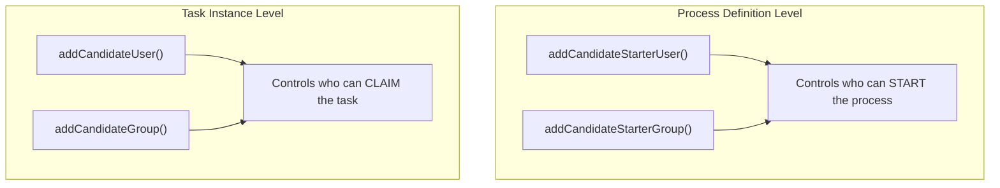

# Process Definition Candidate Starters

Candidate starters authorize specific users or groups to start a process definition. This is distinct from task-level identity links and provides a security layer at process-start time.

## API

```java
// Authorize a user to start a process definition
repositoryService.addCandidateStarterUser("processDefinitionId", "userId");

// Authorize a group to start a process definition
repositoryService.addCandidateStarterGroup("processDefinitionId", "groupId");

// Remove authorization
repositoryService.deleteCandidateStarterUser("processDefinitionId", "userId");
repositoryService.deleteCandidateStarterGroup("processDefinitionId", "groupId");

// Query authorized starters
List<IdentityLink> starters = repositoryService
    .getIdentityLinksForProcessDefinition("processDefinitionId");
```

## Use Cases

### Restricting Process Start

```java
// Only managers can start the budget approval process
ProcessDefinition def = repositoryService.createProcessDefinitionQuery()
    .processDefinitionKey("budgetApproval")
    .latestVersion()
    .singleResult();

repositoryService.addCandidateStarterGroup(def.getId(), "managers");
```

### Role-Based Process Access

```java
// HR can start onboarding, Finance can start budget review
repositoryService.addCandidateStarterGroup(hrProcessDef.getId(), "hr-team");
repositoryService.addCandidateStarterGroup(financeProcessDef.getId(), "finance-team");
```

### Dynamic Authorization

```java
// Authorize based on user's department
void authorizeUser(String userId, String department) {
    ProcessDefinition processDef = repositoryService.createProcessDefinitionQuery()
        .processDefinitionKey("expenseReport")
        .latestVersion()
        .singleResult();

    repositoryService.addCandidateStarterUser(processDef.getId(), userId);
}
```

## Candidate Starters vs Task Identity Links

| Feature | Candidate Starter | Task Identity Link |
|---------|------------------|-------------------|
| Scope | Process definition | Task instance |
| Action | Starting a process | Claiming/completing a task |
| Service | `RepositoryService` | `TaskService` / `RuntimeService` |
| Timing | Before process starts | After task is created |



## Related Documentation

- [Process-Level Identity Links](./process-identity-links.md) — Runtime identity management
- [Task Service API](../../api-reference/engine-api/task-service.md) — Task identity links
