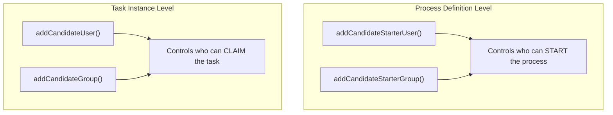

# Process Definition Candidate Starters

Candidate starters authorize specific users or groups to start a process definition. This is distinct from task-level identity links and provides a security layer at process-start time.

## API

```java
// Authorize a user to start a process definition
repositoryService.addCandidateStarterUser("processDefinitionId", "userId");

// Authorize a group to start a process definition
repositoryService.addCandidateStarterGroup("processDefinitionId", "groupId");

// Remove authorization
repositoryService.deleteCandidateStarterUser("processDefinitionId", "userId");
repositoryService.deleteCandidateStarterGroup("processDefinitionId", "groupId");

// Query authorized starters
List<IdentityLink> starters = repositoryService
    .getIdentityLinksForProcessDefinition("processDefinitionId");
```

## Use Cases

### Restricting Process Start

```java
// Only managers can start the budget approval process
ProcessDefinition def = repositoryService.createProcessDefinitionQuery()
    .processDefinitionKey("budgetApproval")
    .latestVersion()
    .singleResult();

repositoryService.addCandidateStarterGroup(def.getId(), "managers");
```

### Role-Based Process Access

```java
// HR can start onboarding, Finance can start budget review
repositoryService.addCandidateStarterGroup(hrProcessDef.getId(), "hr-team");
repositoryService.addCandidateStarterGroup(financeProcessDef.getId(), "finance-team");
```

### Dynamic Authorization

```java
// Authorize based on user's department
void authorizeUser(String userId, String department) {
    ProcessDefinition processDef = repositoryService.createProcessDefinitionQuery()
        .processDefinitionKey("expenseReport")
        .latestVersion()
        .singleResult();

    repositoryService.addCandidateStarterUser(processDef.getId(), userId);
}
```

## Candidate Starters vs Task Identity Links

| Feature | Candidate Starter | Task Identity Link |
|---------|------------------|-------------------|
| Scope | Process definition | Task instance |
| Action | Starting a process | Claiming/completing a task |
| Service | `RepositoryService` | `TaskService` / `RuntimeService` |
| Timing | Before process starts | After task is created |



## Candidate Starter Events

When candidate starters are added or removed, the engine publishes Spring events through `ProcessCandidateStartersEventProducer`. These enable **reactive authorization management** — for example, revoking access when a user changes departments.

### Available Events

| Event | Triggered When |
|-------|---------------|
| `ProcessCandidateStarterUserAddedEvent` | A user is authorized via `addCandidateStarterUser()` |
| `ProcessCandidateStarterUserRemovedEvent` | A user's authorization is removed via `deleteCandidateStarterUser()` |
| `ProcessCandidateStarterGroupAddedEvent` | A group is authorized via `addCandidateStarterGroup()` |
| `ProcessCandidateStarterGroupRemovedEvent` | A group's authorization is removed via `deleteCandidateStarterGroup()` |

### Listening to Events

```java
@Component
public class AuthorizationEventListener {

    @EventListener
    public void onUserAdded(ProcessCandidateStarterUserAddedEvent event) {
        String userId = event.getEntity().getUserId();
        String processDefId = event.getEntity().getProcessDefinitionId();
        log.info("User {} authorized to start process definition {}", userId, processDefId);

        // Example: audit the authorization change
        auditService.logAuthorizationChange(userId, processDefId, "GRANT");
    }

    @EventListener
    public void onUserRemoved(ProcessCandidateStarterUserRemovedEvent event) {
        String userId = event.getEntity().getUserId();
        String processDefId = event.getEntity().getProcessDefinitionId();
        // Example: notify the user their access was revoked
        notificationService.sendEmail(userId,
            "Process Start Access Revoked",
            "You no longer have access to start process definition " + processDefId);
    }
}
```

The event's `getEntity()` returns a `ProcessCandidateStarterUser` with `getUserId()` and `getProcessDefinitionId()`. There is no `getProcessDefinition()` method on the event — you would need to query `RepositoryService` separately if you need the full `ProcessDefinition` object.
```

### ProcessRuntime Authorization Filtering

When using the high-level `ProcessRuntime` API, candidate starters control which process definitions a user can see:

- A user who is **not** a candidate starter for a process definition will **not see it** in `ProcessRuntime.processDefinitions()` results
- The authorization check happens at query time, filtering out unauthorized definitions
- This provides transparent, definition-level access control without application logic

### Persistence

Candidate starter identity links are stored in `ACT_RU_IDENTITYLINK` with `TYPE_ = 'starter'` and a non-null `PROC_DEF_ID_`. They:

- Persist across process instance execution
- Are associated with the process **definition**, not the process instance
- Carry forward to new **versions** only if explicitly re-added (authorization does not auto-propagate across versions)
- Can be inspected via `repositoryService.getIdentityLinksForProcessDefinition(processDefinitionId)`, which returns `List<IdentityLink>` with `type`, `userId`, and `groupId` fields

### Versioning Considerations

When deploying a new version of a process definition, candidate starters from the old version do **not** carry over. You must re-authorize users/groups on the new version:

```java
// After deploying a new version, re-authorize
ProcessDefinition oldDef = repositoryService.createProcessDefinitionQuery()
    .processDefinitionKey("orderProcess")
    .latestVersion()
    .singleResult();

List<IdentityLink> oldStarters =
    repositoryService.getIdentityLinksForProcessDefinition(oldDef.getId());

ProcessDefinition newDef = repositoryService.createProcessDefinitionQuery()
    .processDefinitionKey("orderProcess")
    .latestVersion()
    .singleResult();

for (IdentityLink link : oldStarters) {
    if (link.getUserId() != null) {
        repositoryService.addCandidateStarterUser(newDef.getId(), link.getUserId());
    }
    if (link.getGroupId() != null) {
        repositoryService.addCandidateStarterGroup(newDef.getId(), link.getGroupId());
    }
}
```

## Related Documentation

- [Process-Level Identity Links](./process-identity-links.md) — Runtime identity management
- [Task Service API](../api-reference/engine-api/task-service.md) — Task identity links
- [Security Policies](./security-policies.md) — Declarative access control
- [Engine Events](./engine-event-system.md) — Event listener infrastructure
