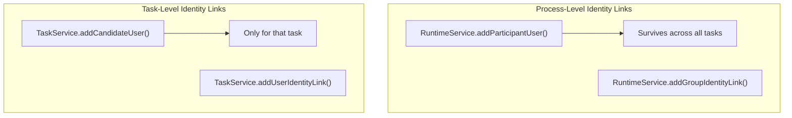

# Process-Level Identity Links

Identity links at the process instance level associate users and groups with running processes. This is separate from task-level identity links and enables process-wide access control, participation tracking, and audit information.

## API

### Adding Identity Links

```java
// Add a user with a specific link type
runtimeService.addUserIdentityLink(
    processInstanceId, "userId", "participant");

// Add a group
runtimeService.addGroupIdentityLink(
    processInstanceId, "groupId", "participant");

// Convenience methods (implicitly set type to "candidate")
runtimeService.addParticipantUser(processInstanceId, "userId");
runtimeService.addParticipantGroup(processInstanceId, "groupId");
```

### Removing Identity Links

```java
runtimeService.deleteUserIdentityLink(processInstanceId, "userId", "participant");
runtimeService.deleteGroupIdentityLink(processInstanceId, "groupId", "participant");

// Convenience methods
runtimeService.deleteParticipantUser(processInstanceId, "userId");
runtimeService.deleteParticipantGroup(processInstanceId, "groupId");
```

### Querying Identity Links

```java
List<IdentityLink> links = runtimeService
    .getIdentityLinksForProcessInstance(processInstanceId);

for (IdentityLink link : links) {
    System.out.println(link.getUserId() + " / " + link.getGroupId()
        + " - type: " + link.getType()
        + " - process: " + link.getProcessInstanceId());
}
```

## Identity Link Types

| Type | Constant | Purpose |
|------|----------|---------|
| `participant` | `IdentityLinkType.PARTICIPANT` | General participation |
| `candidate` | `IdentityLinkType.CANDIDATE` | Can claim tasks within process |
| `custom` | — | Application-specific types |

## Use Cases

### Tracking Process Participants

```java
// Record who is involved in this process
runtimeService.addParticipantUser(processInstanceId, "initiator");
runtimeService.addParticipantUser(processInstanceId, "reviewer");
runtimeService.addParticipantGroup(processInstanceId, "approval-team");

// Later: query for audit
List<IdentityLink> participants = runtimeService
    .getIdentityLinksForProcessInstance(processInstanceId);
```

### Process-Level Access Control

```java
// Only allow certain users to query or interact with the process
boolean canAccess(String userId, String processInstanceId) {
    List<IdentityLink> links = runtimeService
        .getIdentityLinksForProcessInstance(processInstanceId);
    return links.stream()
        .anyMatch(link -> userId.equals(link.getUserId()));
}
```

### Dynamic Group Association

```java
// Associate the department group with the process for visibility
runtimeService.addGroupIdentityLink(
    processInstanceId, "department-" + departmentId, "participant");
```

## Process vs Task Identity Links

| Aspect | Process Identity Link | Task Identity Link |
|--------|----------------------|-------------------|
| Scope | Entire process instance | Single task |
| API | `RuntimeService` | `TaskService` / `DelegateTask` |
| Persistence | Survives across tasks | Only for that task |
| Use case | Audit, access control | Claiming, assignment |



## Related Documentation

- [Process Definition Authorization](./process-definition-authorization.md) — Candidate starters
- [Variables and Variable Scope](../bpmn/reference/variables.md) — Task variables
