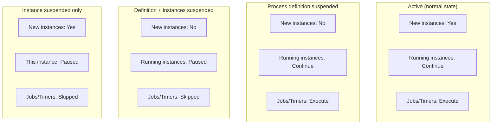
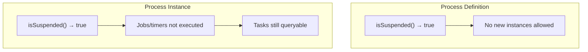

# Process Instance and Definition Suspension

Suspension controls whether a process instance can execute jobs (timers, async continuations) and whether a process definition can start new instances. This is useful for maintenance windows, emergency halts, and scheduled deployments.

## Process Instance Suspension

Suspending a process instance prevents execution of its timers and async jobs. The instance remains in the database and can be reactivated later.

```java
// Suspend a process instance
runtimeService.suspendProcessInstanceById("processInstanceId");

// Reactivate it
runtimeService.activateProcessInstanceById("processInstanceId");
```

**Key behavior:**
- Timers and async jobs on the instance are not executed while suspended
- The instance is not affected by process definition suspension
- In a hierarchy (e.g., subprocess), suspending one instance does not suspend related instances
- Active tasks remain queryable but the process cannot advance past wait states with timers

## Process Definition Suspension

Suspending a process definition prevents **new instances** from being started. Existing running instances continue unless explicitly cascaded.

### Basic Suspension

```java
// Suspend by ID — only this specific version
repositoryService.suspendProcessDefinitionById("processDefinitionId");

// Suspend by key — all versions with this key
repositoryService.suspendProcessDefinitionByKey("processDefinitionKey");

// Activate
repositoryService.activateProcessDefinitionById("processDefinitionId");
repositoryService.activateProcessDefinitionByKey("processDefinitionKey");
```

### With Cascade and Scheduled Date

```java
// Suspend immediately, including all running instances
repositoryService.suspendProcessDefinitionById(
    "processDefinitionId",
    true,          // cascade to all instances
    null           // immediate (null = now)
);

// Suspend at a future date
repositoryService.suspendProcessDefinitionByKey(
    "myProcess",
    true,                              // cascade to instances
    new Date(System.currentTimeMillis() + 3600000), // 1 hour from now
    null                                // tenant ID (null = all tenants)
);

// Activate at a future date
repositoryService.activateProcessDefinitionByKey(
    "myProcess",
    true,
    new Date(System.currentTimeMillis() + 7200000)  // 2 hours from now
);
```

**Note:** Scheduled suspension/activation requires the async job executor to be active (`setAsyncExecutorActivate(true)`).

### Tenant-Specific Suspension

```java
// Only suspend for a specific tenant
repositoryService.suspendProcessDefinitionByKey(
    "myProcess",
    "tenant-123"
);

// With cascade
repositoryService.suspendProcessDefinitionByKey(
    "myProcess",
    true,
    null,
    "tenant-123"
);
```

## Suspension States



## Checking Suspension Status

```java
ProcessDefinition pd = repositoryService.createProcessDefinitionQuery()
    .processDefinitionId("id")
    .singleResult();

boolean isSuspended = pd.isSuspended();

// For process instances
ProcessInstance pi = runtimeService.createProcessInstanceQuery()
    .processInstanceId("id")
    .singleResult();

boolean instanceSuspended = pi.isSuspended();
```



## Common Use Cases

### Emergency Halt

```java
// Immediately stop all versions of a critical process
repositoryService.suspendProcessDefinitionByKey("paymentProcess", true, null);
```

### Maintenance Window

```java
// Schedule suspension for tonight, reactivation in the morning
Date suspendTime = scheduleTime("22:00");
Date activateTime = scheduleTime("06:00");

repositoryService.suspendProcessDefinitionByKey("batchProcess", true, suspendTime);
repositoryService.activateProcessDefinitionByKey("batchProcess", true, activateTime);
```

### A/B Testing with Process Versions

```java
// Deploy new version but keep it suspended
repositoryService.createDeployment()
    .addClasspathResource("process-v2.bpmn")
    .activateProcessDefinitionsOn(null)  // active immediately
    .deploy();

// Suspend the new version until ready
repositoryService.suspendProcessDefinitionById("process-v2:2:12345");

// When ready, activate
repositoryService.activateProcessDefinitionById("process-v2:2:12345");
```

## Scheduled Activation via Deployment

When deploying, you can schedule when process definitions become active:

```java
repositoryService.createDeployment()
    .addClasspathResource("new-process.bpmn")
    .activateProcessDefinitionsOn(futureDate)  // suspended until this date
    .deploy();
```

The process definition is deployed but remains suspended until `futureDate`, at which point the async executor activates it automatically.

## Related Documentation

- [Advanced Deployment Builder](../advanced/deployment-builder.md) — Deployment with activation dates
- [Async Execution](../bpmn/reference/async-execution.md) — Job executor configuration
