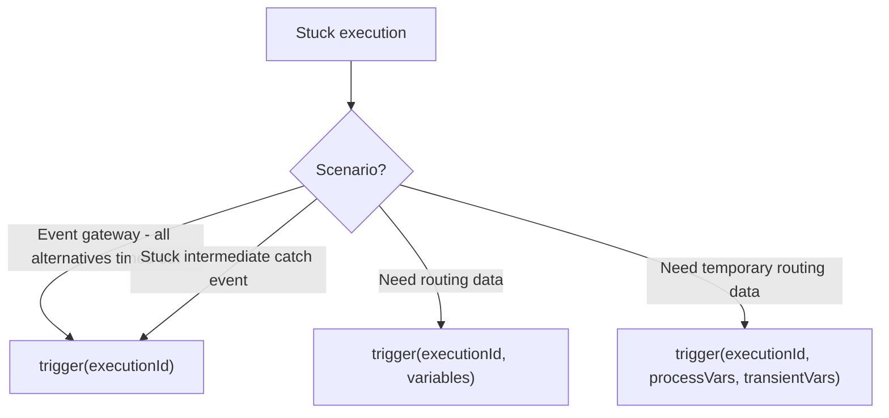

# Runtime Process Control

This page covers advanced `RuntimeService` operations for controlling running processes: updating business keys, triggering stuck executions, and managing process-level identity.

## Updating Business Key

The business key can be updated for a running process instance. This is useful when the original key needs correction or when the key changes during execution.

```java
// Update the business key of a running process instance
runtimeService.updateBusinessKey(
    "processInstanceId",
    "NEW-BUSINESS-KEY"
);
```

### Use Cases

- Correcting a business key set at process start
- Merging process instances and updating the key to reflect the merged entity
- Re-keying when the underlying business identifier changes

```java
// Example: update business key after order number is assigned
ProcessInstance pi = runtimeService.startProcessInstanceBuilder()
    .processDefinitionKey("orderProcess")
    .businessKey("TEMP-" + System.currentTimeMillis())
    .start();

// Later, when the real order number is available
String realOrderNumber = orderService.assignOrderNumber(pi.getBusinessKey());
runtimeService.updateBusinessKey(pi.getId(), realOrderNumber);
```

## Triggering Stuck Executions

The `trigger()` method advances an execution that is stuck at an activity that doesn't expect further input (e.g., an event gateway with expired alternatives).

### Basic Trigger

```java
// Advance execution with no additional variables
runtimeService.trigger("executionId");
```

### Trigger with Process Variables

```java
// Advance execution and set persistent variables
runtimeService.trigger("executionId", Map.of(
    "routeChoice", "expedited",
    "reasonCode", "VIP"
));
```

### Trigger with Transient Variables

```java
// Advance execution with both persistent and transient variables
runtimeService.trigger(
    "executionId",
    Map.of("routeChoice", "expedited"),        // persistent
    Map.of("evaluatedAt", System.currentTimeMillis()) // transient
);
```

Transient variables are useful for passing routing information that shouldn't be persisted in the process instance.

### When to Use Trigger



## Process-Level Identity Links

Associate users and groups with running process instances:

```java
// Add user/group associations
runtimeService.addParticipantUser(processInstanceId, "userId");
runtimeService.addParticipantGroup(processInstanceId, "groupId");

// Custom identity link type
runtimeService.addUserIdentityLink(processInstanceId, "userId", "reviewer");
runtimeService.addGroupIdentityLink(processInstanceId, "groupId", "auditor");

// Query
List<IdentityLink> links = runtimeService
    .getIdentityLinksForProcessInstance(processInstanceId);

// Remove
runtimeService.deleteParticipantUser(processInstanceId, "userId");
runtimeService.deleteUserIdentityLink(processInstanceId, "userId", "reviewer");
```

## Message and Signal Events

### Sending Messages to Running Instances

```java
// Send a message to a specific execution
runtimeService.messageEventReceived("messageName", "executionId");

// With variables
runtimeService.messageEventReceived("messageName", "executionId",
    Map.of("messagePayload", data));

// Start a process via message (if message start event exists)
ProcessInstance pi = runtimeService.startProcessInstanceByMessage("messageName");
ProcessInstance pi = runtimeService.startProcessInstanceByMessage(
    "messageName", Map.of("inputData", value));
```

### Sending Signals

```java
// Broadcast signal to all waiting executions
runtimeService.signalEventReceived("signalName");

// Signal a specific execution
runtimeService.signalEventReceived("signalName", "executionId");

// With variables
runtimeService.signalEventReceived("signalName", "executionId",
    Map.of("signalData", value));

// Async signal (non-blocking)
runtimeService.signalEventReceivedAsync("signalName");

// Tenant-scoped signal
runtimeService.signalEventReceivedWithTenantId("signalName", "tenantId");
```

## Related Documentation

- [Process-Level Identity Links](./process-identity-links.md) — Detailed identity management
- [Message Events](../bpmn/events/intermediate-events.md) — BPMN message handling
- [Variables](../bpmn/reference/variables.md) — Transient vs persistent variables
