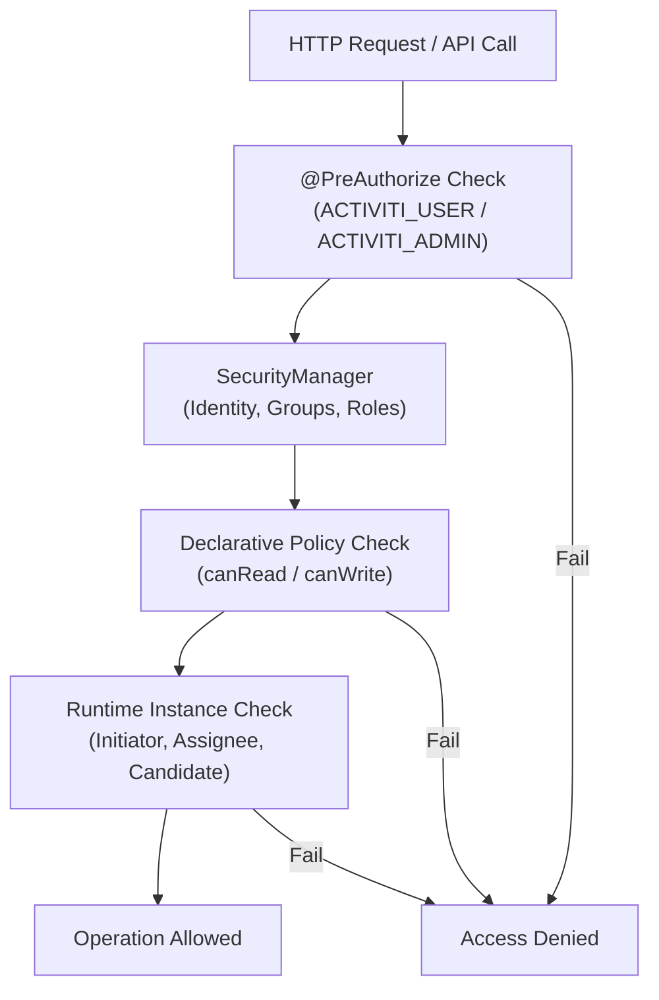
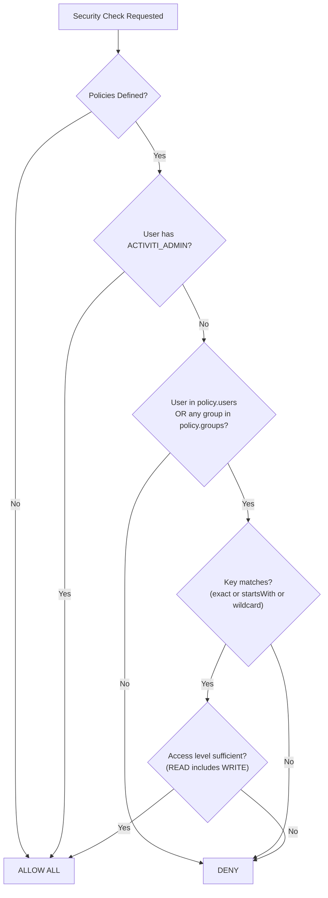

# Security Policies and Authorization

Activiti provides a layered security model combining Spring Security integration, declarative policies, and runtime permission checks. This guide covers the full security architecture from configuration to customization.

## Security Architecture Overview

Activiti security operates at three layers:

1. **Method-level access control** — `@PreAuthorize` annotations on runtime beans enforce minimum role requirements.
2. **Declarative security policies** — YAML properties restrict which process definitions a user can read or write, scoped per application.
3. **Runtime instance permissions** — Per-instance read/write checks based on initiator, assignee, and candidate relationships.



## SecurityManager and Providers

The `SecurityManager` is the central interface for accessing authenticated user identity:

```java
public interface SecurityManager {
    String getAuthenticatedUserId();
    List<String> getAuthenticatedUserGroups();
    List<String> getAuthenticatedUserRoles();
}
```

The default implementation, `LocalSpringSecurityManager`, delegates to four provider components:

| Provider | Interface | Default Implementation | Purpose |
|----------|-----------|----------------------|---------|
| Principal Provider | `SecurityContextPrincipalProvider` | `LocalSpringSecurityContextPrincipalProvider` | Extracts `Principal` from Spring `SecurityContextHolder` |
| Identity Provider | `PrincipalIdentityProvider` | `AuthenticationPrincipalIdentityProvider` | Extracts user ID from `Authentication.getName()` |
| Groups Provider | `PrincipalGroupsProvider` | `AuthenticationPrincipalGroupsProvider` | Extracts groups from granted authorities via `GrantedAuthoritiesGroupsMapper` |
| Roles Provider | `PrincipalRolesProvider` | `AuthenticationPrincipalRolesProvider` | Extracts roles from granted authorities via `GrantedAuthoritiesRolesMapper` |

All auto-configured in `ActivitiSpringSecurityAutoConfiguration` with `@ConditionalOnMissingBean`, allowing full replacement.

### Authority Mappers

Groups and roles are extracted from Spring Security `GrantedAuthority` objects by stripping prefixes:

- **`SimpleGrantedAuthoritiesGroupsMapper`** — filters authorities starting with `GROUP_` and strips the prefix
- **`SimpleGrantedAuthoritiesRolesMapper`** — filters authorities starting with `ROLE_` and strips the prefix

```java
// A user with these Spring Security authorities:
//   ROLE_ACTIVITI_USER, GROUP_engineers, GROUP_hr, ROLE_ACTIVITI_ADMIN
// Will be resolved as:
//   Roles: ["ACTIVITI_USER", "ACTIVITI_ADMIN"]
//   Groups: ["engineers", "hr"]
```

The prefix is configurable by passing a custom string to the mapper constructor, or by providing a custom `GrantedAuthoritiesGroupsMapper` / `GrantedAuthoritiesRolesMapper` bean.

The `UserGroupManager` interface (implemented by `ActivitiUserGroupManagerImpl`) provides lookup of groups and roles for any user by querying the `UserDetailsService`, applying the same `GROUP_`/`ROLE_` prefix stripping.

## Declarative Security Policies

Security policies are configured through `activiti.security.*` properties. The `SecurityPoliciesProperties` class binds a list of `SecurityPolicy` objects:

```yaml
activiti:
  security:
    policies:
      - name: "Engineering team write access"
        groups:
          - engineers
        users:
          - alice
        serviceName: "my-app"
        access: WRITE
        keys:
          - approvalProcess
          - purchaseOrder

      - name: "HR read-only access"
        groups:
          - hr
        users:
          - bob
        serviceName: "my-app"
        access: READ
        keys:
          - employeeOnboarding
```

### Properties format alternative

```properties
activiti.security.policies[0].name=Engineering Write
activiti.security.policies[0].groups=engineers, managers
activiti.security.policies[0].users=alice
activiti.security.policies[0].serviceName=my-app
activiti.security.policies[0].access=WRITE
activiti.security.policies[0].keys=approvalProcess, purchaseOrder
```

### SecurityPolicy Fields

| Field | Type | Description |
|-------|------|-------------|
| `name` | `String` | Human-readable policy identifier |
| `groups` | `List<String>` | Groups granted access under this policy |
| `users` | `List<String>` | Individual users granted access |
| `serviceName` | `String` | Application scope — policies are matched against `spring.application.name` |
| `access` | `SecurityPolicyAccess` | One of `NONE`, `READ`, `WRITE` |
| `keys` | `List<String>` | Process definition keys this policy applies to; `*` is a wildcard |

### Access Levels

| Level | Meaning |
|-------|---------|
| `NONE` | No access granted; used to explicitly deny |
| `READ` | Can read process definitions and instances |
| `WRITE` | Can read and write (start, modify, delete) |

A user with `WRITE` access implicitly has `READ` access. The `canRead()` method returns `true` for both `READ` and `WRITE` policies.

## Policy Evaluation Flow

When any security check is performed, the following evaluation order applies:

1. **No policies defined** — If `activiti.security.policies` is empty or absent, all users with the required role can access everything.
2. **ACTIVITI_ADMIN role** — Users with the `ACTIVITI_ADMIN` role bypass all declarative policies and have full access.
3. **User and group matching** — A policy matches if the authenticated user appears in `users` **or** any of their groups appears in `groups`.
4. **Key matching** — The `keys` list restricts which process definitions the policy applies to. The `ProcessSecurityPoliciesManagerImpl` uses **exact match** (`equalsIgnoreCase`) for process definition and instance keys. The base `BaseSecurityPoliciesManagerImpl` uses **prefix match** (`startsWith`), useful when audit queries receive full definition IDs (e.g., `myProcess:3:abc123`).
5. **Wildcard** — A `*` in the `keys` list grants access to all process definitions for that policy.



## Spring Security Integration

Activiti integrates with Spring Security through the `spring.activiti.security.enabled` property (defaults to `true`). When enabled, `ActivitiMethodSecurityAutoConfiguration` registers:

```java
@EnableGlobalMethodSecurity(prePostEnabled = true, securedEnabled = true, jsr250Enabled = true)
```

### Required Roles

| Runtime Bean | Annotation | Required Role |
|--------------|-----------|---------------|
| `ProcessRuntimeImpl` | `@PreAuthorize("hasRole('ACTIVITI_USER')")` | `ACTIVITI_USER` |
| `TaskRuntimeImpl` | `@PreAuthorize("hasRole('ACTIVITI_USER')")` | `ACTIVITI_USER` |
| `ProcessAdminRuntimeImpl` | `@PreAuthorize("hasAnyRole('ACTIVITI_ADMIN','APPLICATION_MANAGER')")` | `ACTIVITI_ADMIN` or `APPLICATION_MANAGER` |
| `TaskAdminRuntimeImpl` | `@PreAuthorize("hasAnyRole('ACTIVITI_ADMIN','APPLICATION_MANAGER')")` | `ACTIVITI_ADMIN` or `APPLICATION_MANAGER` |

The `@PreAuthorize` is applied at the class level, meaning **every method** on the bean requires the role. Admin runtimes additionally require `ACTIVITI_ADMIN` or `APPLICATION_MANAGER`.

### Disabling Activiti Method Security

```yaml
spring:
  activiti:
    security:
      enabled: false
```

When disabled, `@PreAuthorize` annotations are not evaluated, and no role checks occur. This is not recommended for production deployments.

## Process Instance Permissions

Beyond declarative policies, `ProcessRuntimeImpl` enforces per-instance checks for read and write operations:

### Read Permission (`canReadProcessInstance`)

A user can read a process instance if **both** conditions are met:

1. `securityPoliciesManager.canRead(processDefinitionKey)` — the declarative policy grants READ access for the definition key.
2. The user is either:
   - The **initiator** (`startUserId` matches the authenticated user), OR
   - A **candidate or assignee** of a task in the process instance (checked via `taskService.createTaskQuery().taskCandidateOrAssigned(...)`)

```java
// From ProcessRuntimeImpl
private boolean canReadProcessInstance(ProcessInstance pi) {
    return securityPoliciesManager.canRead(pi.getProcessDefinitionKey()) &&
        (securityManager.getAuthenticatedUserId().equals(pi.getStartUserId()) ||
         isATaskAssigneeOrACandidate(pi.getProcessInstanceId()));
}
```

### Write Permission (`canWriteProcessInstance`)

A user can write to a process instance (suspend, resume, delete, update, set/remove variables) if **both** conditions are met:

1. `securityPoliciesManager.canWrite(processDefinitionKey)` — the declarative policy grants WRITE access.
2. The user is the **initiator** of the process instance.

```java
// From ProcessRuntimeImpl
private boolean canWriteProcessInstance(ProcessInstance pi) {
    return securityPoliciesManager.canWrite(pi.getProcessDefinitionKey()) &&
        securityManager.getAuthenticatedUserId().equals(pi.getStartUserId());
}
```

**Note:** Only the initiator can perform write operations. A candidate user or assignee who can read the instance cannot modify or delete it.

### Query Filtering

When listing process definitions or instances, the `ProcessSecurityPoliciesManager` restricts queries to allowed keys. If no keys match the current user's policies, the query uses an unsatisfiable filter (`missing-<uuid>`) to return empty results.

```java
// From ProcessSecurityPoliciesManagerImpl
private <T> T restrictQuery(SecurityPoliciesRestrictionApplier<T> applier, SecurityPolicyAccess access) {
    if (!arePoliciesDefined()) {
        return applier.allowAll();
    }

    Set<String> keys = definitionKeysAllowedForApplicationPolicy(access);

    if (keys.contains(getSecurityPoliciesProperties().getWildcard())) {
        return applier.allowAll();
    }

    if (!keys.isEmpty()) {
        return applier.restrictToKeys(keys);
    }

    return applier.denyAll();
}
```

## SecurityPoliciesManager API

The `SecurityPoliciesManager` interface provides programmatic access to security checks:

```java
public interface SecurityPoliciesManager {
    boolean canRead(String processDefinitionKey);
    boolean canWrite(String processDefinitionKey);
    boolean canRead(String processDefinitionKey, String serviceName);
    boolean canWrite(String processDefinitionKey, String serviceName);
    boolean arePoliciesDefined();
    Map<String, Set<String>> getAllowedKeys(SecurityPolicyAccess... access);
}
```

The `ProcessSecurityPoliciesManager` extends it with query restriction methods:

```java
public interface ProcessSecurityPoliciesManager extends SecurityPoliciesManager {
    GetProcessDefinitionsPayload restrictProcessDefQuery(SecurityPolicyAccess access);
    GetProcessInstancesPayload restrictProcessInstQuery(SecurityPolicyAccess access);
}
```

### Usage Example

```java
@Autowired
private ProcessSecurityPoliciesManager securityPoliciesManager;

// Check if current user can read a process definition
if (securityPoliciesManager.canRead("leaveRequest")) {
    // proceed
}

// Get all keys the current user can write to, grouped by service name
Map<String, Set<String>> writeKeys = securityPoliciesManager
    .getAllowedKeys(SecurityPolicyAccess.WRITE);
```

## Customizing Security

All security components are auto-configured with `@ConditionalOnMissingBean`, making them easy to override.

### Custom Groups Mapper

```java
@Bean
public GrantedAuthoritiesGroupsMapper grantedAuthoritiesGroupsMapper() {
    return new SimpleGrantedAuthoritiesGroupsMapper("MEMBER_OF_");
}
```

### Custom Identity Provider

```java
@Bean
public PrincipalIdentityProvider principalIdentityProvider() {
    return new PrincipalIdentityProvider() {
        @Override
        public String getUserId(Principal principal) {
            // Custom identity extraction logic
            return extractCustomId(principal);
        }
    };
}
```

### Custom Restriction Appliers

```java
@Bean("processDefinitionRestrictionApplier")
public SecurityPoliciesRestrictionApplier<GetProcessDefinitionsPayload> processDefinitionRestrictionApplier() {
    return new SecurityPoliciesRestrictionApplier<GetProcessDefinitionsPayload>() {
        @Override
        public GetProcessDefinitionsPayload restrictToKeys(Set<String> keys) {
            return ProcessPayloadBuilder.processDefinitions()
                .withProcessDefinitionKeys(keys)
                .build();
        }

        @Override
        public GetProcessDefinitionsPayload denyAll() {
            return ProcessPayloadBuilder.processDefinitions()
                .withProcessDefinitionKey("__DENIED__")
                .build();
        }

        @Override
        public GetProcessDefinitionsPayload allowAll() {
            return ProcessPayloadBuilder.processDefinitions().build();
        }
    };
}
```

### Custom Security Policies Manager

Provide a custom `ProcessSecurityPoliciesManager` bean to replace the default:

```java
@Bean
public ProcessSecurityPoliciesManager processSecurityPoliciesManager(
        SecurityManager securityManager,
        SecurityPoliciesProperties properties,
        SecurityPoliciesRestrictionApplier<GetProcessDefinitionsPayload> defApplier,
        SecurityPoliciesRestrictionApplier<GetProcessInstancesPayload> instApplier) {
    return new CustomProcessSecurityPoliciesManager(
        securityManager, properties, defApplier, instApplier);
}
```

## Complete Working Example

### Application Configuration

```yaml
spring:
  application:
    name: hr-service
  activiti:
    security:
      enabled: true

activiti:
  security:
    policies:
      - name: "HR Managers Full Access"
        groups:
          - hr-managers
        access: WRITE
        serviceName: hr-service
        keys:
          - employeeOnboarding
          - performanceReview

      - name: "HR Staff Read Only"
        groups:
          - hr-staff
        access: READ
        serviceName: hr-service
        keys:
          - employeeOnboarding
          - performanceReview

      - name: "Employee Self Service"
        groups:
          - employees
        access: READ
        serviceName: hr-service
        keys:
          - vacationRequest

      - name: "System Admin Bypass"
        users:
          - system-admin
        access: WRITE
        serviceName: hr-service
        keys:
          - "*"
```

### Spring Security User Configuration

```java
@Configuration
public class SecurityConfig {

    @Bean
    public UserDetailsService userDetailsService() {
        InMemoryUserDetailsManager manager = new InMemoryUserDetailsManager();

        manager.createUser(User.withUsername("john")
            .password("{noop}password")
            .roles("ACTIVITI_USER")
            .authorities("GROUP_hr-managers", "GROUP_employees")
            .build());

        manager.createUser(User.withUsername("jane")
            .password("{noop}password")
            .roles("ACTIVITI_USER")
            .authorities("GROUP_hr-staff")
            .build());

        manager.createUser(User.withUsername("admin")
            .password("{noop}password")
            .roles("ACTIVITI_ADMIN", "ACTIVITI_USER")
            .build());

        return manager;
    }
}
```

### Behavior Summary

| User | Groups | Roles | employeeOnboarding | vacationRequest | performanceReview |
|------|--------|-------|-------------------|-----------------|-------------------|
| john | hr-managers, employees | ACTIVITI_USER | READ + WRITE | READ | READ + WRITE |
| jane | hr-staff | ACTIVITI_USER | READ | -- | READ |
| admin | -- | ACTIVITI_ADMIN | Bypass all | Bypass all | Bypass all |

## Best Practices

- **Use groups over users** in policies for maintainability. Individual user entries are harder to audit and update.
- **Scope policies with `serviceName`** when deploying multiple Activiti-enabled apps. Policies without matching `serviceName` are ignored for that application.
- **Prefer `READ` over `WRITE`** unless modification is genuinely required. The principle of least privilege reduces attack surface.
- **Remember `ACTIVITI_ADMIN` bypasses all policies.** Limit this role to service accounts and administrators, not regular users.
- **Test policy evaluation** with multiple group combinations. A user matching multiple policies accumulates keys from all matching policies.
- **The `*` wildcard is powerful but dangerous.** Use it only for administrative users and consider audit implications.
- **Write access requires being the initiator.** Even with `WRITE` policy access, a user cannot modify process instances they didn't start.
- **Process definition keys use exact matching** in `ProcessSecurityPoliciesManagerImpl`. If you have keys like `order` and `orderApproval`, a policy with key `order` will match both due to the `startsWith` behavior in the base class, but `ProcessSecurityPoliciesManagerImpl` overrides to exact matching to avoid this collision.

## Common Pitfalls

- **Missing `ROLE_` prefix** — Spring Security's `hasRole()` automatically prepends `ROLE_`, but Activiti's mappers strip it. Configure authorities with `ROLE_ACTIVITI_USER` in Spring Security.
- **Empty policies list** — If `activiti.security.policies` is defined but empty, `arePoliciesDefined()` returns `false` and all access is granted. Set at least one policy or remove the configuration entirely.
- **`serviceName` mismatch** — Policies with `serviceName` that doesn't match `spring.application.name` (case-insensitive, hyphens ignored) won't apply.
- **Not a process initiator** — Having `WRITE` policy access doesn't let a user modify someone else's process instance. Only the initiator can write.
- **Class-level `@PreAuthorize`** — All methods on `ProcessRuntimeImpl` and `TaskRuntimeImpl` require `ACTIVITI_USER`. Methods on admin runtimes require `ACTIVITI_ADMIN` or `APPLICATION_MANAGER`. There is no per-method granularity.

## Related Documentation

- [Process Definition Authorization](./process-definition-authorization.md) — Candidate starters for process-level access control
- [Process-Level Identity Links](./process-identity-links.md) — Runtime user/group associations with process instances
- [Task Delegation](./task-delegation.md) — Delegate-resolve pattern for approval workflows
