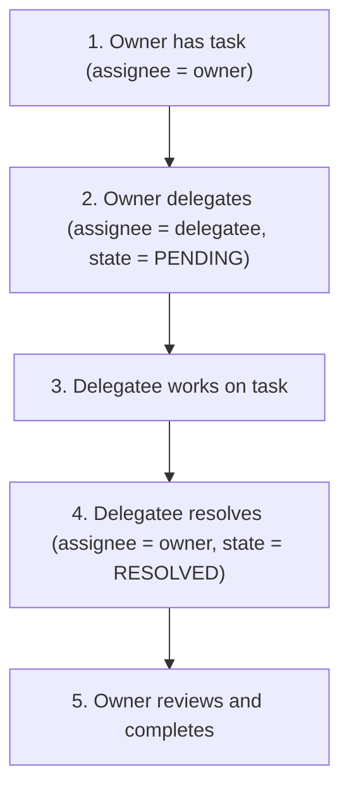
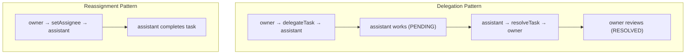

# Task Delegation Pattern

Task delegation is a distinct pattern from reassignment. When a task is delegated, the **owner retains oversight** while an **assignee performs the work**. Once the assignee resolves the task, it returns to the owner for review.

## Delegation States

| State | Meaning |
|-------|---------|
| `PENDING` | Owner delegated the task; assignee is working on it |
| `RESOLVED` | Assignee completed the work; task returned to owner for review |

## The Delegation Lifecycle



## API

### Delegating a Task

```java
// Delegate to another user
taskService.delegateTask(taskId, "delegateeUserId");

// After delegation:
// - The current assignee becomes the owner (if no owner was set)
// - The delegatee becomes the new assignee
// - DelegationState is set to PENDING
```

### Resolving a Delegated Task

```java
// Simple resolve — no additional data
taskService.resolveTask(taskId);

// Resolve with process variables
taskService.resolveTask(taskId, Map.of(
    "result", "COMPLETED",
    "notes", "Task finished successfully"
));

// Resolve with both persistent and transient variables
taskService.resolveTask(taskId,
    Map.of("result", "COMPLETED"),          // persistent
    Map.of("tempCalculation", 42)           // transient
);

// After resolve:
// - DelegationState is set to RESOLVED
// - The assignee is set back to the owner
// - The owner sees the task again for review
```

### Checking Delegation State

```java
Task task = taskService.createTaskQuery()
    .taskId(taskId)
    .singleResult();

DelegationState state = task.getDelegationState();

if (state == DelegationState.PENDING) {
    // Task is delegated, assignee can resolve it
} else if (state == DelegationState.RESOLVED) {
    // Task was resolved, owner can review and complete
} else {
    // No delegation, normal task
}
```

## Complete Example

```java
// 1. Manager has an approval task
Task task = taskService.createTaskQuery()
    .taskAssignee("manager")
    .singleResult();

// 2. Manager delegates to assistant
taskService.delegateTask(task.getId(), "assistant");

// Now: assignee = "assistant", owner = "manager", state = PENDING

// 3. Assistant completes work and resolves
taskService.resolveTask(task.getId(), Map.of(
    "assistantNotes", "I've reviewed the documents"
));

// Now: assignee = "manager", owner = "manager", state = RESOLVED

// 4. Manager reviews and completes
taskService.complete(task.getId(), Map.of(
    "finalDecision", "APPROVED"
));
```

## Delegation vs Reassignment

| Aspect | Delegation | Reassignment |
|--------|-----------|--------------|
| Method | `delegateTask(taskId, userId)` | `setAssignee(taskId, userId)` |
| Owner tracking | Current assignee becomes owner | No owner change |
| Return mechanism | `resolveTask()` returns to owner | Manual reassignment needed |
| State | `PENDING` / `RESOLVED` | No delegation state |
| Audit trail | Clear delegation history | No distinction |



## Delegation in Task Listeners

You can delegate tasks dynamically from within task listeners:

```java
public class AutoDelegateListener implements TaskListener {
    @Override
    public void notify(DelegateTask delegateTask) {
        if ("create".equals(delegateTask.getEventName())) {
            // Auto-delegate based on workload
            String leastLoadedAgent = findLeastLoadedAgent();
            delegateTask.setOwner(delegateTask.getAssignee());
            delegateTask.setAssignee(leastLoadedAgent);
        }
    }
}
```

Or from BPMN:

```xml
<userTask id="reviewTask" name="Review Documents">
  <extensionElements>
    <activiti:taskListener event="create"
        class="com.example.AutoDelegateListener"/>
  </extensionElements>
</userTask>
```

## Common Pitfalls

### Completing a Delegated Task

A task in `PENDING` delegation state cannot be completed — it must be resolved first:

```java
// This throws an exception if state is PENDING
taskService.complete(taskId);

// Correct: resolve first
taskService.resolveTask(taskId);
taskService.complete(taskId);
```

### Losing the Owner

If you set `assignee` after delegation, you overwrite the delegation state. Use `resolveTask()` to properly return the task to the owner.

## Related Documentation

- [Task Service API](../../api-reference/engine-api/task-service.md) — Full task operations
- [Task Listeners](../bpmn/advanced/task-listeners.md) — Dynamic delegation in listeners
