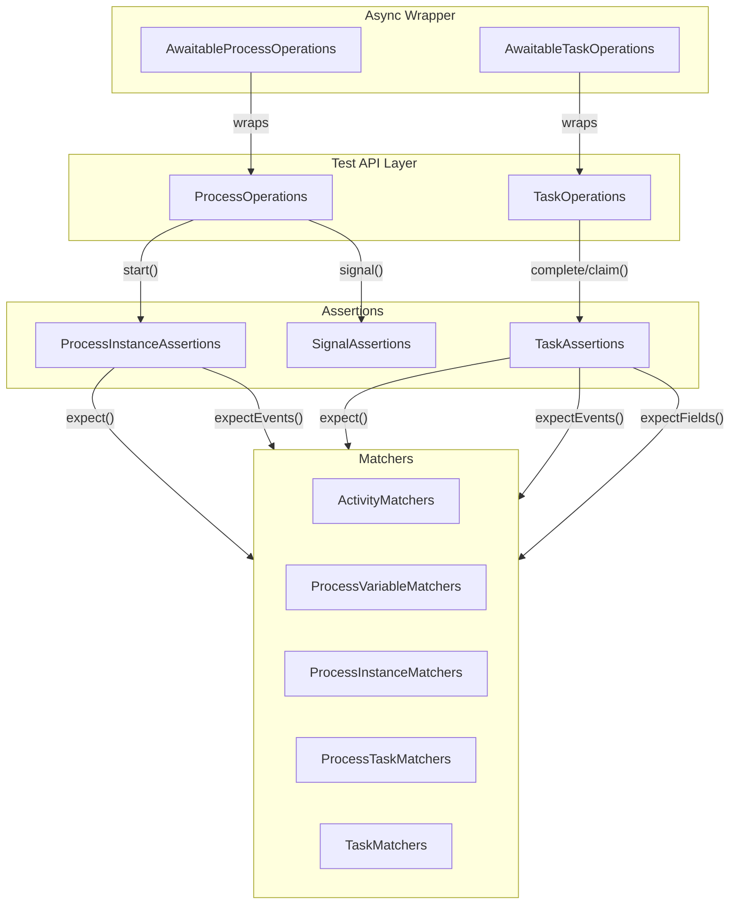
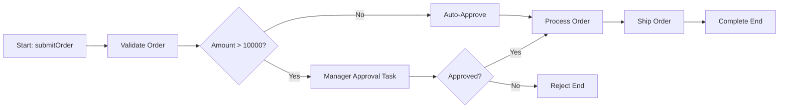

# Testing Infrastructure

Activiti provides a dedicated testing framework that makes it straightforward to write reliable, readable tests for your BPMN processes. The framework supports **BDD-style assertions**, **async-safe verification**, **service task mocking**, **Spring integration helpers**, and **database performance profiling**.

## Architecture Overview



## Philosophy

The Activiti testing framework follows these principles:

- **Event-driven verification**: Assertions work against the engine's event stream, not database state. This ensures tests verify *what happened*, not *what the database looks like at an arbitrary moment*.
- **Chainable BDD API**: Methods like `start()`, `expect()`, `expectEvents()` return assertion objects, enabling fluent test code that reads like specifications.
- **Async-safe by default**: The `Awaitable` wrapper uses Awaitility to poll assertions until they pass, eliminating flaky timing issues with async processes.
- **Layered abstraction**: The framework is split into two modules — `activiti-core-test-assertions` (interfaces and matchers) and `activiti-core-test-local-runtime` (Spring Boot auto-configuration with event listeners).

## Module Structure

| Module | Artifact ID | Purpose |
|--------|-------------|---------|
| Assertions | `activiti-core-test-assertions` | `ProcessOperations`, `TaskOperations`, assertion interfaces, all matchers, `Awaitable` wrappers |
| Local Runtime | `activiti-core-test-local-runtime` | `ProcessRuntimeOperations`, `TaskRuntimeOperations`, `LocalEventSource`, Spring Boot `@AutoConfiguration` beans |

The parent POM `activiti-core-test` aggregates both modules.

## Adding Dependencies

### For Spring Boot Projects

Include the local runtime module, which transitively brings in assertions and auto-configures the test beans:

```xml
<dependency>
    <groupId>org.activiti</groupId>
    <artifactId>activiti-core-test-local-runtime</artifactId>
    <version>8.7.1</version>
    <scope>test</scope>
</dependency>
```

### For Non-Spring / Standalone Projects

Use the assertions module directly and wire up your own `EventSource` and `TaskSource` implementations:

```xml
<dependency>
    <groupId>org.activiti</groupId>
    <artifactId>activiti-core-test-assertions</artifactId>
    <version>8.7.1</version>
    <scope>test</scope>
</dependency>
```

---

## BDD-Style Assertions

The core testing API revolves around two interfaces injected into your test class:

| Interface | Methods | Purpose |
|-----------|---------|---------|
| `ProcessOperations` | `start()`, `signal()` | Start processes and send signals |
| `TaskOperations` | `complete()`, `claim()` | Complete and claim tasks |

Each method returns an assertion object that supports three verification modes:

| Method | Matcher Type | What It Checks |
|--------|-------------|----------------|
| `expectFields(...)` | `ProcessResultMatcher` / `TaskResultMatcher` | Properties on the returned entity (status, name, assignee, etc.) |
| `expectEvents(...)` | `OperationScopeMatcher` | Events in the runtime event stream (activities started/completed, variables created, flows taken) |
| `expect(...)` | `ProcessTaskMatcher` | Task-level assertions (task existence, status, assignee) |

### Fluent API Example

```java
@Autowired
private ProcessOperations processOperations;

@Autowired
private TaskOperations taskOperations;

@Test
void shouldProcessOrder() {
    ProcessInstance pi = processOperations.start(
            new StartProcessPayloadBuilder()
                .withProcessDefinitionKey("orderProcess")
                .withVariable("orderId", "ORD-123")
                .build())
        .expectFields(processInstance().businessKey("ORD-123"))
        .expectEvents(endEvent("orderCompleted").hasBeenCompleted())
        .expect(processInstance().hasTask("Review Order", Task.TaskStatus.CREATED))
        .andReturn();

    // Get the task ID from the task runtime or assertion scope
    taskOperations.complete(
            new CompleteTaskPayloadBuilder()
                .withTaskId(taskId)
                .build())
        .expectEvents(endEvent("reviewDone").hasBeenCompleted());
}
```

### Accessing the Returned Entity

Each assertion chain terminates with `andReturn()`, which gives you the underlying entity:

```java
ProcessInstance pi = processOperations.start(
        new StartProcessPayloadBuilder()
            .withProcessDefinitionKey("myProcess")
            .build())
    .expectEvents(endEvent("end").hasBeenCompleted())
    .andReturn();

// Use pi.getId(), pi.getStatus(), etc.
```

---

## Matchers Reference

### Process Instance Matchers (`processInstance()`)

| Matcher | Returns | Verifies |
|---------|---------|----------|
| `hasBeenStarted()` | `OperationScopeMatcher` | `PROCESS_CREATED` and `PROCESS_STARTED` events exist |
| `hasBeenCompleted()` | `OperationScopeMatcher` | `PROCESS_COMPLETED` event exists |
| `status(ProcessInstanceStatus)` | `ProcessResultMatcher` | Process instance has the given status (`COMPLETED`, `RUNNING`, `CANCELED`, `SUSPENDED`) |
| `name(String)` | `ProcessResultMatcher` | Process definition name matches |
| `businessKey(String)` | `ProcessResultMatcher` | Business key matches |
| `hasTask(taskName, taskStatus, matchers...)` | `ProcessTaskMatcher` | A task with the given name and status exists; optional `TaskResultMatcher`s applied |

```java
processOperations.start(payload)
    .expectFields(
        processInstance().status(ProcessInstance.ProcessInstanceStatus.RUNNING),
        processInstance().businessKey("BK-001"))
    .expect(
        processInstance().hasTask("Approve", Task.TaskStatus.CREATED,
            TaskMatchers.withAssignee("manager")));
```

### Activity Matchers

All activity matchers provide two methods:

| Method | Verifies |
|--------|----------|
| `hasBeenStarted()` | The activity's `ACTIVITY_STARTED` event was emitted |
| `hasBeenCompleted()` | Both `ACTIVITY_STARTED` and `ACTIVITY_COMPLETED` events were emitted |

#### Available Activity Matchers

| Factory Method | Activity Type | Example |
|---------------|---------------|---------|
| `endEvent("id")` | `endEvent` | `endEvent("end").hasBeenCompleted()` |
| `startEvent("id")` | `startEvent` | `startEvent("start").hasBeenStarted()` |
| `exclusiveGateway("id")` | `exclusiveGateway` | `exclusiveGateway("decision").hasBeenStarted()` |
| `inclusiveGateway("id")` | `inclusiveGateway` | `inclusiveGateway("parallel").hasBeenCompleted()` |
| `intermediateCatchEvent("id")` | `intermediateCatchEvent` | `intermediateCatchEvent("timerWait").hasBeenStarted()` |
| `manualTask("id")` | `manualTask` | `manualTask("sendEmail").hasBeenCompleted()` |
| `throwEvent("id")` | `throwEvent` | `throwEvent("signalThrow").hasBeenStarted()` |

```java
processOperations.start(payload)
    .expectEvents(
        startEvent("start").hasBeenStarted(),
        exclusiveGateway("checkCredit").hasBeenStarted(),
        endEvent("approved").hasBeenCompleted());
```

### Task Matchers

#### `ProcessTaskMatchers` — Task-Level Assertions by Name

| Matcher | Returns | Verifies |
|---------|---------|----------|
| `taskWithName("name")` | — | Entry point for named task matchers |
| `.hasBeenCreated()` | `OperationScopeMatcher` | Both `ACTIVITY_STARTED` and `TASK_CREATED` events exist |
| `.hasBeenAssigned()` | `OperationScopeMatcher` | The `TASK_ASSIGNED` event exists |

#### `TaskMatchers` — Task Object Assertions by ID

| Matcher | Returns | Verifies |
|---------|---------|----------|
| `task()` | — | Entry point |
| `hasBeenAssigned()` | `OperationScopeMatcher` | The `TASK_ASSIGNED` event exists for this task ID |
| `hasBeenCompleted()` | `OperationScopeMatcher` | The `TASK_COMPLETED` event exists for this task ID |
| `withAssignee("name")` | `TaskResultMatcher` | Task's assignee matches |
| `assignee("name")` | `TaskResultMatcher` | Alias for `withAssignee` |

```java
taskOperations.complete(payload)
    .expectEvents(
        ProcessTaskMatchers.taskWithName("Approve")
            .hasBeenCreated())
    .expectFields(
        TaskMatchers.withAssignee("manager"));
```

### Variable Matchers

```java
import static org.activiti.test.matchers.ProcessVariableMatchers.*;

processOperations.start(payload)
    .expectEvents(
        processVariable("orderId", "ORD-123").hasBeenCreated(),
        processVariable("approved", true).hasBeenCreated());
```

The `hasBeenCreated()` matcher verifies a `VARIABLE_CREATED` event exists for the given variable name and value, scoped to the current process instance.

### Sequence Flow Matchers

```java
import static org.activiti.test.matchers.SequenceFlowMatchers.*;

processOperations.start(payload)
    .expectEvents(
        sequenceFlow("approvedFlow").hasBeenTaken());
```

### Signal Matchers

```java
import static org.activiti.test.matchers.SignalMatchers.*;

processOperations.signal(
        new SignalPayloadBuilder()
            .withName("orderReceived")
            .build())
    .expectEventsOnProcessInstance(processInstance,
        signal("orderReceived").hasBeenReceived());
```

---

## Async Testing with Awaitable Operations

When your process uses **async continuations** (`activiti:async="true"`), events are emitted asynchronously. Without special handling, assertions would fail because the event hasn't arrived yet.

### How Awaitable Works

`AwaitableProcessOperations` and `AwaitableTaskOperations` wrap the underlying operations and assert interfaces. When `awaitEnabled` is `true`, every `expectFields()`, `expectEvents()`, and `expect()` call is wrapped in:

```java
await().untilAsserted(() -> underlyingAssertion);
```

This uses [Awaitility](https://github.com/awaitility/awaitility) to poll the assertion until it passes or a timeout occurs.

### Enabling Await Mode

In Spring Boot, set the property:

```yaml
# application-test.yml or @TestPropertySource
activiti:
  assertions:
    await:
      enabled: true
```

The `AssertionsAPIAutoConfiguration` class reads `${activiti.assertions.await.enabled:false}` and wraps `ProcessRuntimeOperations` and `TaskRuntimeOperations` in the awaitable variants.

### Manual Configuration

Without auto-configuration, wrap operations manually:

```java
// AwaitableProcessOperations constructor: (ProcessOperations, boolean)
ProcessOperations awaitableProcessOps =
    new AwaitableProcessOperations(processOps, true);

TaskOperations awaitableTaskOps =
    new AwaitableTaskOperations(taskOps, true);
```

### Async Test Example

```java
@TestPropertySource(properties = "activiti.assertions.await.enabled=true")
@SpringBootTest
class AsyncProcessTest {

    @Autowired
    private ProcessOperations processOperations;

    @Autowired
    private TaskOperations taskOperations;

    @Test
    void asyncServiceTaskCompletes() {
        processOperations.start(
                new StartProcessPayloadBuilder()
                    .withProcessDefinitionKey("asyncProcess")
                    .build())
            // These assertions will poll until the async job completes
            .expectEvents(
                endEvent("end").hasBeenCompleted())
            .expectFields(
                processInstance().status(
                    ProcessInstance.ProcessInstanceStatus.COMPLETED));
    }
}
```

### Awaitable Assertions Classes

| Await Class | Wraps | Adds Polling To |
|-------------|-------|-----------------|
| `AwaitProcessInstanceAssertions` | `ProcessInstanceAssertions` | `expectFields`, `expectEvents`, `expect` |
| `AwaitTaskAssertions` | `TaskAssertions` | `expectFields`, `expectEvents`, `expect` |
| `AwaitSignalAssertions` | `SignalAssertions` | `expectEventsOnProcessInstance` |

---

## Spring Integration Testing

### Event Collection: LocalEventSource

The `activiti-core-test-local-runtime` module auto-configures `LocalEventSource`, an in-memory event collector. It registers listeners for 25+ event types via `ActivitiAssertionsAutoConfiguration`:

**Process events:**
`ProcessCreated`, `ProcessStarted`, `ProcessCompleted`, `ProcessCancelled`, `ProcessSuspended`, `ProcessResumed`

**BPMN element events:**
`BPMNActivityStarted`, `BPMNActivityCompleted`, `BPMNActivityCancelled`, `BPMNSequenceFlowTaken`, `BPMNSignalReceived`

**Task events:**
`TaskCreated`, `TaskCompleted`, `TaskAssigned`, `TaskCancelled`, `TaskUpdated`, `TaskSuspended`

**Variable events:**
`VariableCreated`, `VariableUpdated`, `VariableDeleted`

**Timer events:**
`BPMNTimerScheduled`, `BPMNTimerFired`, `BPMNTimerExecuted`, `BPMNTimerFailed`, `BPMNTimerCancelled`

**Error events:**
`BPMNErrorReceived`

`LocalEventSource` provides utility methods for direct event inspection:

```java
@Autowired
private LocalEventSource eventSource;

@Test
void inspectEvents() {
    processOperations.start(payload);

    List<RuntimeEvent<?, ?>> allEvents = eventSource.getEvents();
    List<RuntimeEvent<?, ?>> taskEvents = eventSource.getTaskEvents();
    List<RuntimeEvent<?, ?>> processEvents = eventSource.getProcessInstanceEvents();
    List<BPMNTimerFiredEvent> timerFired = eventSource.getTimerFiredEvents();

    eventSource.clearEvents();
}
```

### Spring Boot Test Setup

Minimal Spring Boot test class:

```java
@SpringBootTest
@ActiveProfiles("test")
class OrderProcessTest {

    @Autowired
    private ProcessOperations processOperations;

    @Autowired
    private TaskOperations taskOperations;

    @Test
    void simpleProcess() {
        processOperations.start(
                new StartProcessPayloadBuilder()
                    .withProcessDefinitionKey("orderProcess")
                    .withVariable("amount", 150)
                    .build())
            .expectFields(
                processInstance().status(ProcessInstance.ProcessInstanceStatus.COMPLETED))
            .expectEvents(
                endEvent("end").hasBeenCompleted());
    }
}
```

With `activiti-core-test-local-runtime` on the classpath, Spring Boot auto-configuration provides all beans.

### Legacy Spring: SpringActivitiTestCase

For projects using JUnit 4 with XML-based Spring context (not Spring Boot), extend `SpringActivitiTestCase`:

```java
package org.activiti.spring.impl.test;

@TestExecutionListeners(DependencyInjectionTestExecutionListener.class)
public abstract class SpringActivitiTestCase
    extends AbstractActivitiTestCase
    implements ApplicationContextAware {

    @Autowired
    protected ApplicationContext applicationContext;

    protected ProcessEngine processEngine;
}
```

Key behaviors:
- Integrates with Spring's `TestContextManager` for dependency injection
- Autowires `ApplicationContext` for bean lookups
- Obtains `ProcessEngine` from the Spring context
- Caches process engines by `@ContextConfiguration` value for reuse across test methods

**Usage:**

```java
@RunWith(SpringJUnit4ClassRunner.class)
@ContextConfiguration("classpath:test-context.xml")
public class MyProcessTest extends SpringActivitiTestCase {

    @Autowired
    protected RuntimeService runtimeService;

    @Autowired
    protected TaskService taskService;

    @Deployment
    public void testProcess() {
        ProcessInstance pi = runtimeService.startProcessInstanceByKey("myProcess");
        // assert using legacy services...
    }
}
```

### CleanTestExecutionListener

`CleanTestExecutionListener` removes all deployments after a test class finishes, preventing deployment leaks between test classes:

```java
@TestExecutionListeners(CleanTestExecutionListener.class)
@ContextConfiguration("classpath:test-context.xml")
@RunWith(SpringJUnit4ClassRunner.class)
public class AsyncExecutorTest extends SpringActivitiTestCase {
    // Deployments are cleaned up after this class completes
}
```

It works by querying `RepositoryService` for all deployments and deleting them (cascade) in `afterTestClass()`.

---

## Mocking Infrastructure

Activiti's engine-level test framework provides two mocking approaches for legacy API testing (`activiti-engine` module).

### MockServiceTasks Annotation

Replace service task implementations during tests:

```java
@MockServiceTask(
    originalClassName = "com.example.RealPaymentService",
    mockedClassName = "com.example.test.MockPaymentService"
)
public void testWithMockedPayment() {
    // RealPaymentService is replaced by MockPaymentService for this test
    runtimeService.startProcessInstanceByKey("checkout");
}
```

Mock by service task ID instead:

```java
@MockServiceTask(
    id = "paymentTask",
    mockedClassName = "com.example.test.MockPaymentService"
)
public void testByTaskId() { ... }
```

Multiple mocks with `@MockServiceTasks`:

```java
@MockServiceTasks({
    @MockServiceTask(
        originalClassName = "com.example.PaymentService",
        mockedClassName = "com.example.test.MockPayment"
    ),
    @MockServiceTask(
        originalClassName = "com.example.ShippingService",
        mockedClassName = "com.example.test.MockShipping"
    )
})
public void testWithMultipleMocks() { ... }
```

### NoOpServiceTasks

Replace all service tasks with no-op implementations to isolate flow logic:

```java
@NoOpServiceTasks
public void testFlowWithoutServiceTasks() {
    runtimeService.startProcessInstanceByKey("myProcess");
    // All service tasks execute as no-ops

    // Inspect which service tasks ran
    int count = mockSupport().getNrOfNoOpServiceTaskExecutions();
    List<String> delegateClasses = mockSupport().getExecutedNoOpServiceTaskDelegateClassNames();
}
```

Selective no-op by IDs or class names:

```java
@NoOpServiceTasks(
    ids = {"task1", "task3"},
    classNames = {"com.example.AnotherDelegate"}
)
public void testSelectiveNoOp() { ... }
```

### MockExpressionManager and Mocks Registry

`MockExpressionManager` replaces the standard expression resolver to support mock lookups via EL expressions:

```java
// In your engine configuration (test-context.xml or programmatically):
<bean class="org.activiti.engine.test.mock.MockExpressionManager"/>

// Register mocks at test runtime:
Mocks.register("myService", myMockService);
```

Then in BPMN expressions like `${myService.process()}`, the engine resolves `myService` from the mock registry instead of the actual Spring context.

```java
Mocks.reset(); // Clear all mocks
```

The `Mocks` class stores mocks in a `ThreadLocal<Map<String, Object>>`, so each test thread gets its own mock container.

### Programmatic Mock Support

The `ActivitiMockSupport` provides programmatic alternatives to annotations:

```java
@Override
protected void setUp() throws Exception {
    super.setUp();
    mockSupport().mockServiceTaskWithClassDelegate(
        "com.example.RealDelegate", MockDelegate.class);
}
```

Available mock support methods:

| Method | Purpose |
|--------|---------|
| `mockServiceTaskWithClassDelegate(className, mockClass)` | Replace delegate by class |
| `mockServiceTaskWithClassDelegate(className, mockClassName)` | Replace delegate by class name string |
| `setAllServiceTasksNoOp()` | Replace all service tasks with no-ops |
| `addNoOpServiceTaskById(id)` | Single task no-op by BPMN id |
| `addNoOpServiceTaskByClassName(className)` | Single task no-op by delegate class |
| `reset()` | Clear all mocks |
| `getNrOfNoOpServiceTaskExecutions()` | Count no-op executions |
| `getExecutedNoOpServiceTaskDelegateClassNames()` | List executed no-op delegate classes |

### Testing Legacy API with ActivitiRule / ActivitiTestCase

For non-Spring projects using the legacy engine API:

```java
public class LegacyProcessTest extends ActivitiTestCase {

    @Deployment
    public void testSimpleProcess() {
        runtimeService.startProcessInstanceByKey("myProcess");
        // ...
    }
}
```

Or with JUnit Rule:

```java
public class RuleBasedTest {

    @Rule
    public ActivitiRule activitiRule = new ActivitiRule(
        "activiti.cfg.xml");

    @Deployment
    @Test
    public void testProcess() {
        activitiRule.getRuntimeService()
            .startProcessInstanceByKey("myProcess");
    }
}
```

The `@Deployment` annotation auto-deploys the BPMN file named after the test method (convention: `TestClass.methodName.bpmn20.xml`) and cleans up after the test.

---

## Performance Testing with ActivitiProfiler

`ActivitiProfiler` measures database operations and command execution times for process execution. It is a `ProcessEngineConfigurator` that installs:

1. **`TotalExecutionTimeCommandInterceptor`** — wraps every command execution, tracking start/end time and delegating to a `ProfileSession`
2. **`ProfilingDbSqlSessionFactory`** — produces `ProfilingDbSqlSession` instances that count every SQL SELECT, INSERT, UPDATE, and DELETE by statement ID

### Setup

Register the profiler as a process engine configurator:

```xml
<!-- activiti.cfg.xml -->
<property name="configurators">
    <list>
        <bean class="org.activiti.engine.test.profiler.ActivitiProfiler"/>
    </list>
</property>
```

Or programmatically:

```java
ProcessEngineConfigurationImpl config = new ProcessEngineConfigurationImpl();
config.getConfigurators().add(ActivitiProfiler.getInstance());
```

### Usage

```java
ActivitiProfiler profiler = ActivitiProfiler.getInstance();

// Reset any previous profiling data
profiler.reset();

// Start a named profile session
profiler.startProfileSession("Checkout Process");

// Execute the process
runtimeService.startProcessInstanceByKey("checkout");

// Stop the session and print results
profiler.stopCurrentProfileSession();
new ConsoleLogger(profiler).log();
```

### Analyzing Results

```java
ProfileSession session = profiler.getProfileSessions().get(0);

// Summary statistics per command
Map<String, CommandStats> stats = session.calculateSummaryStatistics();

for (Map.Entry<String, CommandStats> entry : stats.entrySet()) {
    String commandName = entry.getKey();
    CommandStats commandStats = entry.getValue();

    System.out.println(commandName + ":");
    System.out.println("  Executions: " + commandStats.getCount());
    System.out.println("  Avg time: " + commandStats.getAverageExecutionTime() + "ms");
    System.out.println("  DB selects: " + commandStats.getDbSelects());
    System.out.println("  DB inserts: " + commandStats.getDbInserts());
    System.out.println("  DB updates: " + commandStats.getDbUpdates());
    System.out.println("  DB deletes: " + commandStats.getDbDeletes());
}
```

### Assertions Against Database Operations

Common pattern: assert the number of database operations a process execution performs:

```java
public void testStartToEnd() {
    ActivitiProfiler profiler = ActivitiProfiler.getInstance();
    profiler.reset();
    profiler.startProfileSession("test");

    runtimeService.startProcessInstanceByKey("simpleProcess");
    profiler.stopCurrentProfileSession();

    ProfileSession session = profiler.getProfileSessions().get(0);
    Map<String, CommandStats> allStats = session.calculateSummaryStatistics();

    CommandStats startStats = allStats.get("org.activiti.engine.impl.cmd.StartProcessInstanceCmd");
    assertThat(startStats.getDbSelects().get("selectLatestProcessDefinitionByKey")).isEqualTo(1L);
    assertThat(startStats.getDbInserts()).containsKey(
        "org.activiti.engine.impl.persistence.entity.HistoricProcessInstanceEntityImpl");
}
```

### ConsoleLogger Output

`ConsoleLogger.log()` prints formatted output to stdout:

```
#############################################
Checkout Process
#############################################

Start time: 2024-01-15 10:30:00
End time: 2024-01-15 10:30:01
Total time: 1250 ms

Command class: org.activiti.engine.impl.cmd.StartProcessInstanceCmd
Number of times invoked: 1
45.2% of profile session was spent executing this command
Average execution time: 565 ms (Average database time: 312 ms (55.2%))
Database selects:
  selectLatestProcessDefinitionByKey : 1
...
```

### Profiler Components

| Class | Role |
|-------|------|
| `ActivitiProfiler` | Singleton; installs interceptors; manages `ProfileSession`s |
| `ProfileSession` | Stores command execution results and database operations for a named session |
| `CommandStats` | Aggregates statistics for a single command class: count, total time, DB operations |
| `CommandExecutionResult` | Individual execution result with timing and DB operation details |
| `TotalExecutionTimeCommandInterceptor` | Pre-command interceptor that starts/stops timing per command |
| `ProfilingDbSqlSessionFactory` | Factory for `ProfilingDbSqlSession` |
| `ProfilingDbSqlSession` | Wraps database operations, recording each SQL statement |
| `ConsoleLogger` | Formats and prints profile session results |

---

## Testing Different Element Types

### Testing Gateways

```java
// Exclusive gateway — verify the correct flow was taken
processOperations.start(payload)
    .expectEvents(
        exclusiveGateway("amountCheck").hasBeenStarted(),
        sequenceFlow("highAmount").hasBeenTaken(),
        endEvent("requiresApproval").hasBeenCompleted());

// Inclusive gateway — verify convergence
processOperations.start(payload)
    .expectEvents(
        inclusiveGateway("fork").hasBeenStarted(),
        inclusiveGateway("join").hasBeenCompleted());
```

### Testing Timer Events

```java
// Verify timer was scheduled
processOperations.start(payload)
    .expectEvents(
        intermediateCatchEvent("paymentTimer").hasBeenStarted());

// After time manipulation, verify timer fired
// (Use a test clock or time manipulation service)
eventSource.getTimerScheduledEvents();
eventSource.getTimerFiredEvents();
```

### Testing Boundary Events

```java
processOperations.start(payload)
    .expectEvents(
        throwEvent("errorThrow").hasBeenStarted(),
        endEvent("errorHandled").hasBeenCompleted());
```

### Testing Signals

```java
ProcessInstance pi = processOperations.start(
        new StartProcessPayloadBuilder()
            .withProcessDefinitionKey("signalProcess")
            .build())
    .andReturn();

processOperations.signal(
        new SignalPayloadBuilder()
            .withName("orderCompleteSignal")
            .build())
    .expectEventsOnProcessInstance(pi,
        signal("orderCompleteSignal").hasBeenReceived(),
        endEvent("end").hasBeenCompleted());
```

### Testing Multi-Instance Tasks

```java
processOperations.start(
        new StartProcessPayloadBuilder()
            .withProcessDefinitionKey("miProcess")
            .withVariable("items", Arrays.asList("A", "B", "C"))
            .build())
    .expect(
        processInstance().hasTask("Review Item", Task.TaskStatus.CREATED));
```

---

## Unit vs Integration Testing Strategies

### Unit Testing Service Tasks

Test `JavaDelegate` implementations in isolation — no engine needed:

```java
class OrderDelegateTest {

    @Mock
    private OrderService orderService;

    @Mock
    private DelegateExecution execution;

    @InjectMocks
    private OrderProcessingDelegate delegate;

    @Test
    void shouldSetVariables() {
        when(execution.getVariable("orderId")).thenReturn("ORD-1");
        when(orderService.findById("ORD-1")).thenReturn(createOrder());

        delegate.execute(execution);

        verify(execution).setVariable("status", "APPROVED");
        verify(execution).setVariable("total", 99.99);
    }
}
```

### Integration Testing Full Flows

Use the BDD test framework to verify end-to-end process behavior:

```java
@SpringBootTest
class OrderProcessIntegrationTest {

    @Autowired
    private ProcessOperations processOperations;

    @Autowired
    private TaskOperations taskOperations;

    @Test
    void shouldApproveHighValueOrder() {
        String orderId = UUID.randomUUID().toString();

        ProcessInstance pi = processOperations.start(
                new StartProcessPayloadBuilder()
                    .withProcessDefinitionKey("orderProcess")
                    .withVariable("orderId", orderId)
                    .withVariable("amount", 15000)
                    .build())
            .expectFields(
                processInstance().status(ProcessInstance.ProcessInstanceStatus.RUNNING))
            .expectEvents(
                processVariable("orderId", orderId).hasBeenCreated())
            .expect(
                processInstance().hasTask("Manager Approval", Task.TaskStatus.CREATED))
            .andReturn();

        // Complete the approval task — taskId must be the actual task UUID
        taskOperations.complete(
                new CompleteTaskPayloadBuilder()
                    .withTaskId(taskId)
                    .withVariable("approved", true)
                    .build())
            .expectEvents(
                endEvent("orderProcessed").hasBeenCompleted(),
                processVariable("finalStatus", "SHIPPED").hasBeenCreated());
    }
}
```

### Strategy Matrix

| Level | What to Test | Tool | Speed |
|-------|-------------|------|-------|
| **Unit** | Individual `JavaDelegate` logic, variable manipulation | JUnit + Mockito | Fast |
| **Integration** | Full process flow, gateways, task assignment | BDD test framework + Spring Boot | Medium |
| **Async Integration** | Processes with async continuations | Awaitable operations + Awaitility | Medium |
| **Performance** | Database operation counts, execution time | ActivitiProfiler | Slow |

---

## Complete End-to-End Example

### The Process

An order approval workflow:



### The Test

```java
@SpringBootTest
@TestPropertySource(properties = "activiti.assertions.await.enabled=true")
class OrderApprovalTest {

    @Autowired
    private ProcessOperations processOperations;

    @Autowired
    private TaskOperations taskOperations;

    @Autowired
    private LocalEventSource eventSource;

    @Autowired
    private TaskRuntime taskRuntime;

    @BeforeEach
    void setUp() {
        eventSource.clearEvents();
    }

    @Test
    void shouldAutoApproveLowValueOrder() {
        processOperations.start(
                new StartProcessPayloadBuilder()
                    .withProcessDefinitionKey("orderApproval")
                    .withVariable("orderId", "ORD-001")
                    .withVariable("amount", 500)
                    .build())
            .expectFields(
                processInstance().status(ProcessInstance.ProcessInstanceStatus.COMPLETED))
            .expectEvents(
                startEvent("submitOrder").hasBeenStarted(),
                exclusiveGateway("amountCheck").hasBeenStarted(),
                sequenceFlow("autoApprove").hasBeenTaken(),
                manualTask("processOrder").hasBeenCompleted(),
                endEvent("complete").hasBeenCompleted(),
                processVariable("status", "SHIPPED").hasBeenCreated());
    }

    @Test
    void shouldRequireManagerApprovalForHighValueOrder() {
        eventSource.clearEvents();

        ProcessInstance pi = processOperations.start(
                new StartProcessPayloadBuilder()
                    .withProcessDefinitionKey("orderApproval")
                    .withVariable("orderId", "ORD-002")
                    .withVariable("amount", 15000)
                    .build())
            .expectFields(
                processInstance().status(ProcessInstance.ProcessInstanceStatus.RUNNING))
            .expectEvents(
                sequenceFlow("managerApproval").hasBeenTaken())
            .expect(
                processInstance().hasTask(
                    "Manager Approval", Task.TaskStatus.CREATED,
                    TaskMatchers.withAssignee("manager")))
            .andReturn();

        // Get the task UUID from the task runtime query
        String taskId = taskRuntime.getTasks(pi.getId()).get(0).getId();

        // Manager approves
        taskOperations.complete(
                new CompleteTaskPayloadBuilder()
                    .withTaskId(taskId)
                    .withVariable("approved", true)
                    .build())
            .expectEvents(
                ProcessTaskMatchers.taskWithName("Manager Approval")
                    .hasBeenAssigned(),
                task().hasBeenCompleted());

        // Process continues to completion — assertions poll for async completion
        // With await enabled, the above assertions will wait for the process to finish
    }

    @Test
    void shouldRejectWhenManagerDeclines() {
        eventSource.clearEvents();

        ProcessInstance pi = processOperations.start(
                new StartProcessPayloadBuilder()
                    .withProcessDefinitionKey("orderApproval")
                    .withVariable("orderId", "ORD-003")
                    .withVariable("amount", 50000)
                    .build())
            .expect(
                processInstance().hasTask(
                    "Manager Approval", Task.TaskStatus.CREATED))
            .andReturn();

        // Get the task UUID from the task runtime query
        String taskId = taskRuntime.getTasks(pi.getId()).get(0).getId();

        taskOperations.complete(
                new CompleteTaskPayloadBuilder()
                    .withTaskId(taskId)
                    .withVariable("approved", false)
                    .build())
            .expectEvents(
                endEvent("rejected").hasBeenCompleted(),
                processVariable("status", "REJECTED").hasBeenCreated());
    }
}
```

---

## Best Practices

### 1. Assert Against Events, Not Database Queries

**Good** — event-based assertions are deterministic and fast:
```java
.expectEvents(endEvent("end").hasBeenCompleted())
```

**Avoid** — database queries add timing dependencies:
```java
// Don't do this in tests
assertThat(runtimeService.createProcessInstanceQuery()
    .processInstanceId(id).singleResult()).isNull();
```

### 2. Clear Events Between Test Methods

`LocalEventSource` accumulates events across test methods within a class. Clear before each test:

```java
@Autowired
private LocalEventSource eventSource;

@BeforeEach
void setUp() {
    eventSource.clearEvents();
}
```

### 3. Use Await Mode for Async Processes

Enable `activiti.assertions.await.enabled=true` for processes with async continuations, timer events, or message intermediates to avoid flaky tests.

### 4. Prefer Mocking Over Real Dependencies

When testing process flow, mock service tasks to avoid calling external systems:

```java
// In legacy API tests
@NoOpServiceTasks
public void testFlowLogic() { ... }

// In Spring API tests — use test Spring profiles with mock beans
@TestPropertySource(properties = "spring.profiles.active=test")
```

### 5. One Process Key Per Test Method

Isolate test scenarios to single process definitions. The `@Deployment` annotation in legacy tests, or Spring Boot's auto-deployment, handles per-method cleanup.

### 6. Verify Both Positive and Negative Paths

Test the happy path and error/rejection paths:

```java
@Test void happyPath() { ... }
@Test void rejectionPath() { ... }
@Test void errorBoundaryPath() { ... }
```

### 7. Use Meaningful Variable Assertions

Assert that critical variables are set correctly after process completion:

```java
.expectEvents(
    processVariable("orderStatus", "SHIPPED").hasBeenCreated(),
    processVariable("trackingNumber", "TRK-12345").hasBeenCreated())
```

---

## Common Pitfalls

### Flaky Async Tests

**Problem**: Assertions fail intermittently because async jobs haven't completed.

**Solution**: Enable await mode or manually use Awaitility:
```java
@TestPropertySource(properties = "activiti.assertions.await.enabled=true")
```

### Stale Events

**Problem**: Events from a previous test affect assertions.

**Solution**: Clear the event source in `@BeforeEach`:
```java
@BeforeEach void clear() { eventSource.clearEvents(); }
```

### Wrong Activity Type

**Problem**: `hasBeenCompleted()` fails because the activity type constant doesn't match.

**Solution**: Use the correct factory method for the BPMN element type:
- User tasks → `ProcessTaskMatchers.taskWithName("name")` or `processInstance().hasTask(...)`
- Service tasks → `exclusiveGateway`, `endEvent`, `manualTask`, etc. based on the BPMN type
- The activity type strings are: `startEvent`, `endEvent`, `userTask`, `serviceTask`, `exclusiveGateway`, `inclusiveGateway`, `parallelGateway`, `intermediateCatchEvent`, `intermediateThrowEvent`, `manualTask`, `throwEvent`, `boundaryEvent`, `subProcess`, `callActivity`, `scriptTask`, `receiveTask`, `sendTask`

### Deployment Leakage

**Problem**: Deployments from one test class remain and affect another.

**Solution**: Use `CleanTestExecutionListener` for legacy Spring tests, or Spring Boot's `@AutoConfigureMockMvc`/auto-deployment for Boot tests.

### MockRegistry ThreadLocal Leakage

**Problem**: `Mocks.register()` uses a `ThreadLocal`; mocks leak between test methods on thread pools.

**Solution**: Always call `Mocks.reset()` in `@AfterEach`:
```java
@AfterEach void cleanup() { Mocks.reset(); }
```

---

## API Summary

### Injected Beans (Spring Boot auto-configured)

| Bean | Type | Purpose |
|------|------|---------|
| `processOperations` | `ProcessOperations` | Start processes, send signals |
| `taskOperations` | `TaskOperations` | Complete and claim tasks |
| `eventSource` | `LocalEventSource` | Direct event inspection and clearing |
| `localTaskProvider` | `TaskSource` / `LocalTaskSource` | Task query for assertions |

### Static Matcher Factories

Import statically for concise test code:

```java
import static org.activiti.test.matchers.BPMNStartEventMatchers.*;
import static org.activiti.test.matchers.EndEventMatchers.*;
import static org.activiti.test.matchers.ExclusiveGatewayMatchers.*;
import static org.activiti.test.matchers.InclusiveGatewayMatchers.*;
import static org.activiti.test.matchers.IntermediateCatchEventMatchers.*;
import static org.activiti.test.matchers.ManualTaskMatchers.*;
import static org.activiti.test.matchers.ThrowEventMatchers.*;
import static org.activiti.test.matchers.SequenceFlowMatchers.*;
import static org.activiti.test.matchers.SignalMatchers.*;
import static org.activiti.test.matchers.ProcessInstanceMatchers.*;
import static org.activiti.test.matchers.ProcessTaskMatchers.*;
import static org.activiti.test.matchers.TaskMatchers.*;
import static org.activiti.test.matchers.ProcessVariableMatchers.*;
```

### Process Configuration

| Property | Default | Effect |
|----------|---------|--------|
| `activiti.assertions.await.enabled` | `false` | Wraps operations in Awaitility polling |

## Testing Timers with Clock Manipulation

Timer-based workflows are difficult to test because real timers require waiting. The engine's `Clock` system lets you **set a fixed time** and advance it programmatically.

```java
import org.activiti.engine.runtime.Clock;

@BeforeEach
void setUp(ProcessEngineConfiguration config) {
    // Obtain the Clock from the engine configuration
    Clock clock = config.getClock();
    // Fix time so timers are deterministic
    clock.setCurrentTime(new Date());
}

@Test
void testTimerFires(ProcessEngine engine) {
    RuntimeService runtime = engine.getRuntimeService();
    ManagementService mgmt = engine.getManagementService();
    ProcessEngineConfiguration config = engine.getProcessEngineConfiguration();

    // Start process with a 1-hour timer
    runtime.startProcessInstanceByKey("timerProcess");

    // Advance clock by 2 hours
    Clock clock = config.getClock();
    Calendar cal = clock.getCurrentCalendar();
    cal.add(Calendar.HOUR_OF_DAY, 2);
    clock.setCurrentCalendar(cal);

    // Find and execute the due timer job individually
    // ManagementService.executeJob(jobId) executes a single job by ID
    String jobId = mgmt.createTimerJobQuery().singleResult().getId();
    mgmt.executeJob(jobId);

    // Assert the timer fired and process moved forward
    assertThat(runtime.createExecutionQuery()
        .activityId("afterTimer").count()).isEqualTo(1);

    // Critical: reset the clock
    clock.reset();
}
```

**Important:** `DefaultClockImpl.CURRENT_TIME` is a `volatile static Calendar`. Setting the clock affects every `ProcessEngine` in the JVM. Always call `clock.reset()` after each test, especially with parallel test execution.

`ManagementService` does not have a bulk timer execution method like `executeTimerJobs()` — use `executeJob(String jobId)` on individual jobs, or let the async executor acquire and execute them automatically.

For more detail on calendars, timer expressions, and clock integration, see [Business Calendars](../bpmn/reference/business-calendars.md#clock-manipulation-for-testing).

---

**Source:** `org.activiti.test` package, `ActivitiAssertionsAutoConfiguration`, `AssertionsAPIAutoConfiguration`, `org.activiti.engine.test.profiler`, `org.activiti.engine.test.mock`, `org.activiti.engine.runtime.Clock`, `org.activiti.engine.impl.util.DefaultClockImpl`
