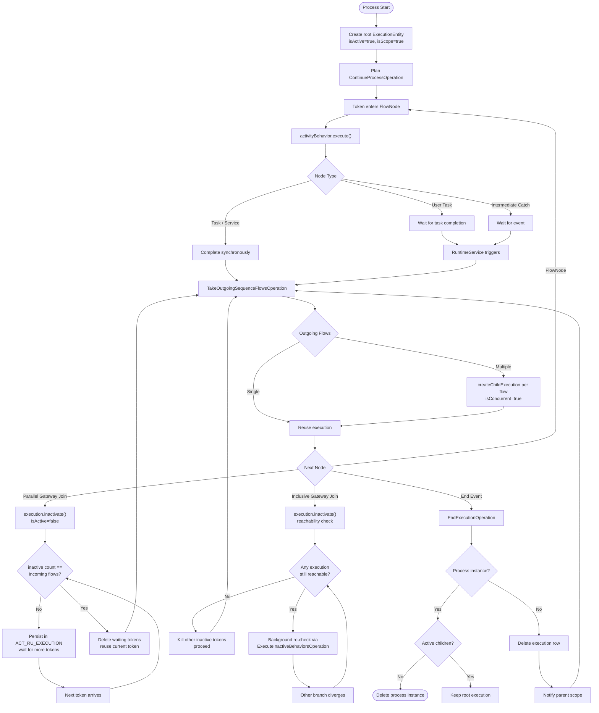
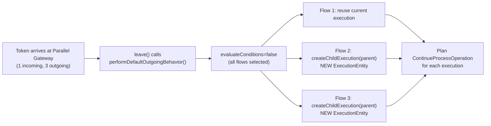
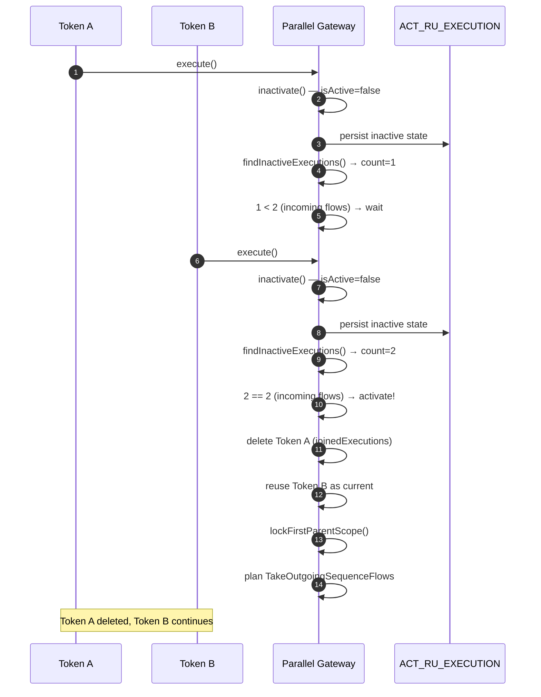
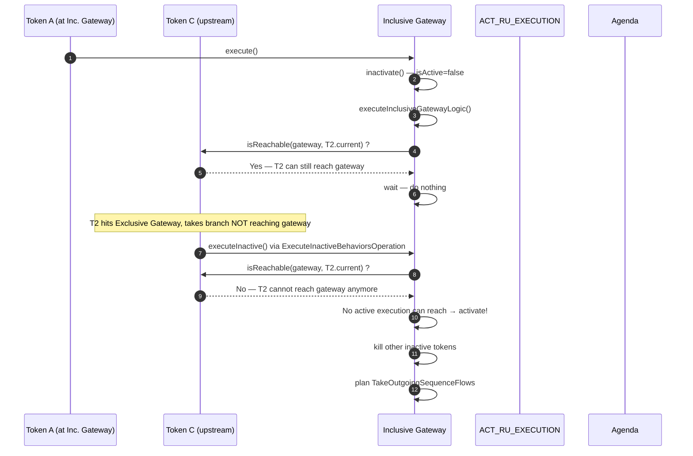
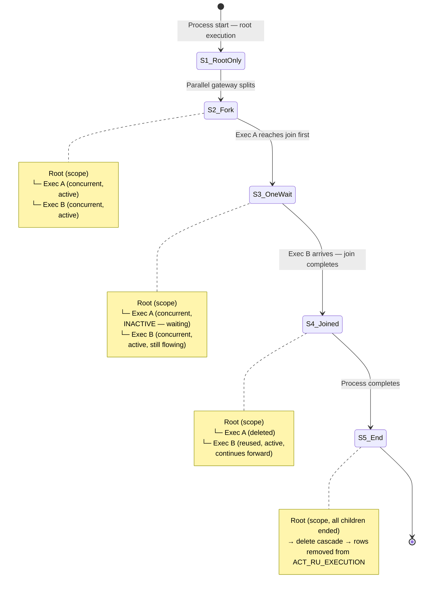

# Token Lifecycle in Activiti

In BPMN terminology, a **token** represents a unit of progress through a process. Activiti implements tokens as `ExecutionEntity` objects — there is no separate `Token` class. Each execution entity *is* a token.

When a process instance starts, the engine creates a root execution (the process instance itself). As tokens encounter parallel gateways, subprocesses, or multi-instance activities, child executions are spawned. When tokens converge, some are deleted and one is reused to continue forward.

## Key Fields on ExecutionEntity

| Field | Type | Meaning |
|-------|------|---------|
| `isActive` | `boolean` | `true` = token is flowing; `false` = token waiting at a join |
| `isConcurrent` | `boolean` | `true` = token belongs to a parallel branch |
| `isScope` | `boolean` | `true` = token defines a variable/event scope boundary |
| `isEnded` | `boolean` | `true` = token has completed and will be cleaned up |
| `isEventScope` | `boolean` | `true` = token waiting for message, signal, or timer |
| `currentFlowElement` | `FlowElement` | Current BPMN element position of this token |
| `parentId` | `String` | Parent execution ID; `null` = root process instance |

## Token Lifecycle Overview



## Agenda-Based Processing

Tokens advance through a FIFO operation queue managed by the engine's **agenda** (`DefaultActivitiEngineAgenda`). Each command execution drains this queue. The `CommandInvoker` processes operations in two phases:

1. **Active phase:** drain the agenda, executing `ContinueProcessOperation`, `TakeOutgoingSequenceFlowsOperation`, etc.
2. **Inactive phase:** if executions were involved, schedule `ExecuteInactiveBehaviorsOperation` and drain again to re-check waiting tokens (used by the inclusive gateway).

| Operation | Purpose |
|-----------|---------|
| `ContinueProcessOperation` | Token enters a BPMN element; calls `activityBehavior.execute()` |
| `TakeOutgoingSequenceFlowsOperation` | Token leaves a node; forks new child executions for parallel paths |
| `EndExecutionOperation` | Token completes an execution; cascades cleanup up the tree |
| `ExecuteInactiveBehaviorsOperation` | Re-evaluates inactive tokens (inclusive gateway join logic) |

The engine never blocks threads on token waits — inactive tokens persist in `ACT_RU_EXECUTION` and are resumed when the next relevant command runs.

## Gateway Fork Mechanism



Key details from `TakeOutgoingSequenceFlowsOperation.leaveFlowNode()`:

- The **first** outgoing flow reuses the current execution (renamed, not recreated).
- Each **additional** outgoing flow creates a new child via `executionEntityManager.createChildExecution(parent)`.
- Every resulting execution gets `planContinueProcessOperation` scheduled.
- For parallel gateways, `evaluateConditions=false` — all flows are taken unconditionally.
- For inclusive gateways, conditions are evaluated — only `true` flows are taken.

## Gateway Join Comparison

| Aspect | Parallel (AND) | Inclusive (OR) | Exclusive (XOR) |
|--------|---------------|---------------|----------------|
| **Join trigger** | `inactive count == incoming flows` | No active execution reachable | Pass-through, no wait |
| **Wait mechanism** | `inactivate()`, count check | `inactivate()`, reachability + background re-check | None |
| **Re-evaluation** | Only when new token arrives | After *any* command on the process instance | N/A |
| **Source class** | `ParallelGatewayActivityBehavior` | `InclusiveGatewayActivityBehavior` | `ExclusiveGatewayActivityBehavior` |

The inclusive gateway implements `InactiveActivityBehavior`, which allows it to be re-checked after other tokens move. This is critical because an exclusive gateway upstream might take a branch that bypasses the inclusive gateway entirely — the inclusive gateway must detect this and activate even though no new token has arrived at it.

## Parallel Gateway Join — Token Synchronization



## Inclusive Gateway Join — Reachability Check



Key: `ExecutionGraphUtil.isReachable()` performs a DFS through the BPMN process graph to determine if a token at its current position can reach the inclusive gateway, accounting for subprocess boundaries, link events, and loop detection.

## Execution Tree State Changes



## Database Representation

Tokens are persisted in the `ACT_RU_EXECUTION` table. Key columns:

| Column | Token Meaning |
|--------|---------------|
| `ID_` | Unique execution/token ID |
| `PARENT_ID_` | `NULL` = root process instance; otherwise parent execution |
| `IS_ACTIVE_` | Whether the token is flowing or waiting at a join |
| `IS_CONCURRENT_` | Whether the token is in a parallel branch |
| `IS_SCOPE_` | Whether the token defines a variable/event scope boundary |
| `IS_MI_ROOT_` | Whether the token is a multi-instance root |
| `ACT_ID_` | Current BPMN activity where the token resides |
| `ROOT_PROC_INST_ID_` | Topmost root process instance (for nested call activities) |

The `ExecutionEntityManagerImpl` builds the in-memory tree from these flat rows via `processExecutionTree()`, wiring parent-child and super-subprocess references.

## Variable Scope and Token Merging

Variables set on a child execution (a parallel branch token) are **lost** when that branch completes and merges at a gateway join. This happens because the merged executions are deleted — only the reused execution's data survives.

To share data between parallel branches, set variables on the parent scope:

```java
// In a JavaDelegate:
execution.setVariable("sharedKey", value); // sets on highest scope
```

Variables set with `setVariable()` propagate up to the highest scope where they already exist. Variables set with `setVariableLocal()` remain on the current execution and will be lost at a join if that execution is deleted.

## Related Documentation

- [Execution Debug Tree](./execution-debug-tree.md) — Tree visualization for inspecting token state at runtime
- [Multi-Instance](../bpmn/reference/multi-instance.md) — Token multiplication in multi-instance activities
- [Variables and Variable Scope](../bpmn/reference/variables.md) — How variable scoping interacts with token hierarchy
- [Gateways](../bpmn/gateways/index.md) — BPMN elements that control token flow
- [Runtime Service](../api-reference/engine-api/runtime-service.md) — Public API for execution/token management
