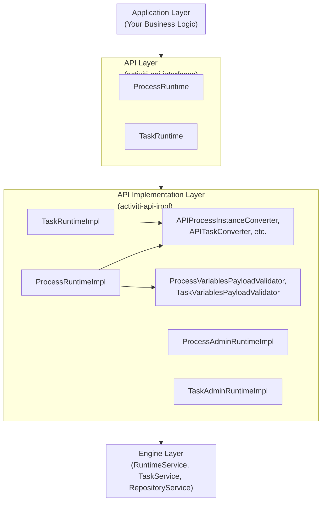
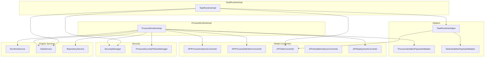

# Activiti API Implementation Module - Technical Documentation

**Module:** `activiti-core/activiti-api-impl`

---

## Table of Contents

- [Overview](#overview)
- [Architecture](#architecture)
- [API Implementation Strategy](#api-implementation-strategy)
- [Process Runtime Implementation](#process-runtime-implementation)
- [Task Runtime Implementation](#task-runtime-implementation)
- [Model Converters](#model-converters)
- [Event Converters](#event-converters)
- [Variable Validation](#variable-validation)
- [Performance Considerations](#performance-considerations)
- [Error Handling](#error-handling)
- [Testing Strategy](#testing-strategy)
- [Migration Guide](#migration-guide)
- [API Reference](#api-reference)

---

## Overview

The **activiti-api-impl** module provides the concrete implementation of the Activiti API interfaces defined in the `activiti-api` module. It bridges the high-level API with the underlying engine implementation, providing a clean, type-safe interface for developers.

### Key Responsibilities

1. **API Implementation**: Concrete implementations of all API interfaces (`ProcessRuntime`, `TaskRuntime`, etc.)
2. **Model Conversion**: Transform between engine models and API models via `ModelConverter` implementations
3. **Event Mapping**: Map engine events to API events through dedicated event converters
4. **Error Handling**: Translate engine exceptions to API exceptions (`NotFoundException`, `UnprocessableEntityException`)
5. **Validation**: Variable type checking against process extension definitions
6. **Security**: User-based access control via `SecurityManager` and `ProcessSecurityPoliciesManager`

### Design Principles

- **Facade Pattern**: Hide engine complexity behind runtime interfaces
- **Converter Pattern**: Dedicated `ModelConverter` implementations for each model type
- **Builder Pattern**: `ProcessPayloadBuilder` and `TaskPayloadBuilder` for fluent payload construction
- **Event-Driven Architecture**: Spring `ApplicationEventPublisher` for process and task events
- **Security-First**: `@PreAuthorize("hasRole('ACTIVITI_USER')")` on all runtime implementations

---

## Key Classes and Their Responsibilities

### ProcessRuntimeImpl

**Purpose:** Implements the `ProcessRuntime` interface to manage process instance lifecycle operations.

**Location:** `activiti-api-process-runtime-impl/src/main/java/org/activiti/runtime/api/impl/ProcessRuntimeImpl.java`

**Responsibilities:**
- Starting new process instances with variables and business keys
- Creating suspended process instances (via `create()`)
- Sending signal and message events through Spring event publishing
- Querying process definitions and instances with pagination
- Managing process instance state (suspend, activate, delete)
- Handling process variables (get, set, remove)
- Security checks via `ProcessSecurityPoliciesManager` and `SecurityManager`

**Key Methods (from interface):**
- `start(StartProcessPayload)` - Initiates a new process instance
- `signal(SignalPayload)` - Broadcasts signals to waiting processes
- `receive(ReceiveMessagePayload)` - Sends targeted messages to processes
- `processInstance(String)` - Retrieves a single process instance
- `processInstances(Pageable)` - Returns paged process instances
- `processDefinition(String)` - Retrieves process definition metadata
- `suspend(SuspendProcessPayload)` - Suspends a running process
- `resume(ResumeProcessPayload)` - Resumes a suspended process
- `delete(DeleteProcessPayload)` - Deletes a process instance

**Dependencies:**
- `RepositoryService` - Process definition queries
- `RuntimeService` - Engine runtime operations
- `TaskService` - Task queries for security checks
- `APIProcessInstanceConverter` - Converts engine instances to API models
- `APIProcessDefinitionConverter` - Converts engine definitions to API models
- `APIVariableInstanceConverter` - Converts engine variables to API models
- `APIDeploymentConverter` - Converts engine deployments to API models
- `ProcessVariablesPayloadValidator` - Validates variable payloads
- `ProcessSecurityPoliciesManager` - Security policy enforcement
- `SecurityManager` - Authenticated user context
- `ApplicationEventPublisher` - Event publishing

---

### TaskRuntimeImpl

**Purpose:** Implements the `TaskRuntime` interface to manage user task lifecycle operations.

**Location:** `activiti-api-task-runtime-impl/src/main/java/org/activiti/runtime/api/impl/TaskRuntimeImpl.java`

**Responsibilities:**
- Querying tasks with pagination by assignee, candidate, process instance
- Claiming and releasing tasks
- Completing tasks with optional variables
- Updating task properties (name, description, priority, due date)
- Managing task candidate users and groups
- Creating ad-hoc tasks
- Handling task variables (create, update, get)

**Key Methods (from interface):**
- `task(String)` - Retrieves a specific task
- `tasks(Pageable)` - Queries tasks with pagination for authenticated user
- `complete(CompleteTaskPayload)` - Completes a task
- `claim(ClaimTaskPayload)` - Claims a task for authenticated user
- `release(ReleaseTaskPayload)` - Releases a claimed task
- `update(UpdateTaskPayload)` - Updates task properties
- `assign(AssignTaskPayload)` - Reassigns a task to another candidate user
- `create(CreateTaskPayload)` - Creates an ad-hoc task

**Dependencies:**
- `TaskService` - Underlying engine service
- `APITaskConverter` - Converts engine tasks to API models
- `APIVariableInstanceConverter` - Converts engine variables to API models
- `TaskRuntimeHelper` - Shared task operations (update, variable handling, security)
- `SecurityManager` - Authenticated user context

---

### APIProcessInstanceConverter

**Purpose:** Transforms engine `ProcessInstance` objects to API `ProcessInstance` models.

**Location:** `activiti-api-process-runtime-impl/src/main/java/org/activiti/runtime/api/model/impl/APIProcessInstanceConverter.java`

**Base Classes:** Extends `ListConverter<ProcessInstance, ProcessInstance>` and implements `ModelConverter<ProcessInstance, ProcessInstance>`.

**Key Methods:**
- `from(engine.ProcessInstance)` - Converts single engine instance to API model
- `from(Collection<engine.ProcessInstance>)` - Inherited from `ListConverter`, converts collections

**Conversion Logic:**
- Maps all standard fields (id, name, businessKey, processDefinitionId, etc.)
- Calculates status: `RUNNING`, `CREATED`, `SUSPENDED`, or `COMPLETED` based on engine state
- Creates `ProcessInstanceImpl` as the target API model

---

### APITaskConverter

**Purpose:** Transforms engine `Task` objects to API `Task` models.

**Location:** `activiti-api-task-runtime-impl/src/main/java/org/activiti/runtime/api/model/impl/APITaskConverter.java`

**Base Classes:** Extends `ListConverter<Task, Task>` and implements `ModelConverter<Task, Task>`.

**Key Methods:**
- `from(engine.Task)` - Converts engine task to API model
- `fromWithCandidates(engine.Task)` - Converts with identity link extraction for candidate users/groups
- `fromWithCompletedBy(engine.Task, status, completedBy)` - Converts with completion metadata

**Conversion Logic:**
- Calculates status: `CREATED`, `ASSIGNED`, `SUSPENDED`, or `CANCELLED`
- Creates `TaskImpl` as the target API model
- Extracts `CandidateUsers` and `CandidateGroups` from `IdentityLink` entries

---

### ProcessVariablesPayloadValidator

**Purpose:** Validates variable payloads against process extension definitions.

**Location:** `activiti-api-process-runtime-impl/src/main/java/org/activiti/runtime/api/impl/ProcessVariablesPayloadValidator.java`

**Responsibilities:**
- Checking variable names against naming conventions
- Validating variable types against process extension schema (`VariableDefinition`)
- Parsing date strings to `java.util.Date` objects
- Detecting and rejecting expression-based variable values
- Converting string variables to dates when no schema definition exists

**Key Methods:**
- `checkStartProcessPayloadVariables(StartProcessPayload, processDefinitionId)`
- `checkPayloadVariables(SetProcessVariablesPayload, processDefinitionId)`
- `checkSignalPayloadVariables(SignalPayload, processDefinitionId)`
- `checkReceiveMessagePayloadVariables(ReceiveMessagePayload, processDefinitionId)`
- `checkStartMessagePayloadVariables(StartMessagePayload, processDefinitionId)`

---

### TaskRuntimeHelper

**Purpose:** Shared helper class for task runtime operations.

**Location:** `activiti-api-task-runtime-impl/src/main/java/org/activiti/runtime/api/impl/TaskRuntimeHelper.java`

**Responsibilities:**
- Applying `UpdateTaskPayload` to engine tasks (name, description, priority, due date, form key, parent task)
- Task lookup with security checks (`getInternalTaskWithChecks`)
- Variable creation and update with validation
- Handling complete and save task payloads

**Key Methods:**
- `applyUpdateTaskPayload(isAdmin, UpdateTaskPayload)`
- `getInternalTaskWithChecks(taskId)` - Finds task with security access verification
- `getInternalTask(taskId)` - Admin lookup without security checks
- `createVariable(isAdmin, CreateTaskVariablePayload)`
- `updateVariable(isAdmin, UpdateTaskVariablePayload)`
- `handleCompleteTaskPayload(CompleteTaskPayload)`
- `handleSaveTaskPayload(SaveTaskPayload)`

---

### ProcessAdminRuntimeImpl

**Purpose:** Admin-level process operations bypassing user security checks.

**Location:** `activiti-api-process-runtime-impl/src/main/java/org/activiti/runtime/api/impl/ProcessAdminRuntimeImpl.java`

**Responsibilities:**
- Starting processes without security policy restrictions
- Deleting process instances at admin level
- All operations use `ProcessVariablesPayloadValidator` for variable validation

---

### TaskAdminRuntimeImpl

**Purpose:** Admin-level task operations bypassing user security checks.

**Location:** `activiti-api-task-runtime-impl/src/main/java/org/activiti/runtime/api/impl/TaskAdminRuntimeImpl.java`

**Responsibilities:**
- Completing, claiming, releasing, updating tasks without assignee restrictions
- Variable operations without security checks

---

## Architecture

### Layer Architecture



### Component Diagram



---

## API Implementation Strategy

### Implementation Pattern

```java
// API Interface (from activiti-api-process-runtime)
public interface ProcessRuntime {
    ProcessInstance start(StartProcessPayload startProcessPayload);
    ProcessInstance processInstance(String processInstanceId);
    Page<ProcessInstance> processInstances(Pageable pageable);
    void signal(SignalPayload signalPayload);
    void receive(ReceiveMessagePayload messagePayload);
}

// Implementation (in activiti-api-impl/activiti-api-process-runtime-impl)
@PreAuthorize("hasRole('ACTIVITI_USER')")
public class ProcessRuntimeImpl implements ProcessRuntime {

    private final RuntimeService runtimeService;
    private final RepositoryService repositoryService;
    private final APIProcessInstanceConverter processInstanceConverter;
    private final APIProcessDefinitionConverter processDefinitionConverter;
    private final ProcessVariablesPayloadValidator processVariablesValidator;
    private final ProcessSecurityPoliciesManager securityPoliciesManager;
    private final SecurityManager securityManager;
    private final ApplicationEventPublisher eventPublisher;
    // ... other dependencies

    @Override
    public ProcessInstance start(StartProcessPayload startProcessPayload) {
        return processInstanceConverter.from(
            this.createProcessInstanceBuilder(startProcessPayload).start()
        );
    }

    private ProcessInstanceBuilder createProcessInstanceBuilder(StartProcessPayload payload) {
        ProcessDefinition processDefinition = getProcessDefinitionAndCheckUserHasRights(
            payload.getProcessDefinitionId(),
            payload.getProcessDefinitionKey()
        );

        processVariablesValidator.checkStartProcessPayloadVariables(
            payload, processDefinition.getId()
        );

        return runtimeService
            .createProcessInstanceBuilder()
            .processDefinitionId(processDefinition.getId())
            .processDefinitionKey(processDefinition.getKey())
            .businessKey(payload.getBusinessKey())
            .variables(payload.getVariables())
            .name(payload.getName());
    }

    @Override
    @Transactional
    public void signal(SignalPayload signalPayload) {
        processVariablesValidator.checkSignalPayloadVariables(signalPayload, null);
        eventPublisher.publishEvent(signalPayload);
    }
}
```

### Spring Auto-Configuration

Runtime beans are configured via `ProcessRuntimeAutoConfiguration` and equivalent task configuration:

```java
@Configuration
public class ProcessRuntimeAutoConfiguration {

    @Bean
    public ProcessRuntime processRuntime(
        RepositoryService repositoryService,
        APIProcessDefinitionConverter processDefinitionConverter,
        RuntimeService runtimeService,
        TaskService taskService,
        ProcessSecurityPoliciesManager securityPoliciesManager,
        APIProcessInstanceConverter processInstanceConverter,
        APIVariableInstanceConverter variableInstanceConverter,
        APIDeploymentConverter deploymentConverter,
        ProcessRuntimeConfiguration configuration,
        ApplicationEventPublisher eventPublisher,
        ProcessVariablesPayloadValidator processVariablesValidator,
        SecurityManager securityManager
    ) {
        return new ProcessRuntimeImpl(
            repositoryService, processDefinitionConverter, runtimeService,
            taskService, securityPoliciesManager, processInstanceConverter,
            variableInstanceConverter, deploymentConverter, configuration,
            eventPublisher, processVariablesValidator, securityManager
        );
    }

    @Bean
    public ProcessVariablesPayloadValidator processVariablesValidator(
        DateFormatterProvider dateFormatterProvider,
        ProcessExtensionService processExtensionService,
        VariableValidationService variableValidationService,
        VariableNameValidator variableNameValidator,
        ExpressionResolver expressionResolver
    ) {
        return new ProcessVariablesPayloadValidator(
            dateFormatterProvider, processExtensionService,
            variableValidationService, variableNameValidator, expressionResolver
        );
    }
}
```

---

## Process Runtime Implementation

### Start Process Implementation

```java
public class ProcessRuntimeImpl implements ProcessRuntime {

    @Override
    public ProcessInstance start(StartProcessPayload startProcessPayload) {
        return processInstanceConverter.from(
            this.createProcessInstanceBuilder(startProcessPayload).start()
        );
    }

    private ProcessInstanceBuilder createProcessInstanceBuilder(StartProcessPayload payload) {
        ProcessDefinition processDefinition = getProcessDefinitionAndCheckUserHasRights(
            payload.getProcessDefinitionId(),
            payload.getProcessDefinitionKey()
        );

        processVariablesValidator.checkStartProcessPayloadVariables(
            payload, processDefinition.getId()
        );

        return runtimeService
            .createProcessInstanceBuilder()
            .processDefinitionId(processDefinition.getId())
            .processDefinitionKey(processDefinition.getKey())
            .businessKey(payload.getBusinessKey())
            .variables(payload.getVariables())
            .name(payload.getName());
    }

    protected ProcessDefinition getProcessDefinitionAndCheckUserHasRights(
            String processDefinitionId, String processDefinitionKey) {

        String checkId = processDefinitionKey != null ? processDefinitionKey : processDefinitionId;
        ProcessDefinition processDefinition = processDefinition(checkId);

        if (processDefinition == null) {
            throw new IllegalStateException(
                "At least Process Definition Id or Key needs to be provided to start a process");
        }

        checkUserCanWritePermissionOnProcessDefinition(processDefinition.getKey());
        return processDefinition;
    }
}
```

### Signal Event Implementation

Signals are published through Spring's `ApplicationEventPublisher` rather than directly calling the engine:

```java
@Override
@Transactional
public void signal(SignalPayload signalPayload) {
    processVariablesValidator.checkSignalPayloadVariables(signalPayload, null);
    eventPublisher.publishEvent(signalPayload);
}
```

The `SignalPayloadEventListener` subscribes to the published event and routes it to the engine.

### Message Event Implementation

Messages are similarly published through Spring events:

```java
@Override
@Transactional
public void receive(ReceiveMessagePayload messagePayload) {
    processVariablesValidator.checkReceiveMessagePayloadVariables(messagePayload, null);
    eventPublisher.publishEvent(messagePayload);
}
```

The `ReceiveMessagePayloadEventListener` handles the event dispatch.

### Process Instance Queries

```java
@Override
public Page<ProcessInstance> processInstances(Pageable pageable,
                                              GetProcessInstancesPayload getProcessInstancesPayload) {
    org.activiti.engine.runtime.ProcessInstanceQuery internalQuery =
        runtimeService.createProcessInstanceQuery();

    String currentUserId = securityManager.getAuthenticatedUserId();
    internalQuery.involvedUser(currentUserId);

    if (getProcessInstancesPayload.getProcessDefinitionKeys() != null
        && !getProcessInstancesPayload.getProcessDefinitionKeys().isEmpty()) {
        internalQuery.processDefinitionKeys(
            getProcessInstancesPayload.getProcessDefinitionKeys());
    }
    if (getProcessInstancesPayload.getBusinessKey() != null
        && !getProcessInstancesPayload.getBusinessKey().isEmpty()) {
        internalQuery.processInstanceBusinessKey(
            getProcessInstancesPayload.getBusinessKey());
    }
    if (getProcessInstancesPayload.isSuspendedOnly()) {
        internalQuery.suspended();
    }
    if (getProcessInstancesPayload.isActiveOnly()) {
        internalQuery.active();
    }

    return new PageImpl<>(
        processInstanceConverter.from(internalQuery.listPage(
            pageable.getStartIndex(), pageable.getMaxItems())),
        Math.toIntExact(internalQuery.count())
    );
}
```

---

## Task Runtime Implementation

### Task Query Implementation

```java
public class TaskRuntimeImpl implements TaskRuntime {

    private final TaskService taskService;
    private final APITaskConverter taskConverter;
    private final TaskRuntimeHelper taskRuntimeHelper;
    private final SecurityManager securityManager;

    @Override
    public Task task(String taskId) {
        return taskConverter.fromWithCandidates(
            taskRuntimeHelper.getInternalTaskWithChecks(taskId)
        );
    }

    @Override
    public Page<Task> tasks(Pageable pageable, GetTasksPayload getTasksPayload) {
        TaskQuery taskQuery = taskService.createTaskQuery();

        String authenticatedUserId = securityManager.getAuthenticatedUserId();
        List<String> userGroups = securityManager.getAuthenticatedUserGroups();

        taskQuery = taskQuery.or()
            .taskCandidateOrAssigned(authenticatedUserId, userGroups)
            .taskOwner(authenticatedUserId)
            .endOr();

        if (getTasksPayload.getProcessInstanceId() != null) {
            taskQuery = taskQuery.processInstanceId(getTasksPayload.getProcessInstanceId());
        }
        if (getTasksPayload.getParentTaskId() != null) {
            taskQuery = taskQuery.taskParentTaskId(getTasksPayload.getParentTaskId());
        }

        List<Task> tasks = taskConverter.from(
            taskQuery.listPage(pageable.getStartIndex(), pageable.getMaxItems())
        );
        return new PageImpl<>(tasks, Math.toIntExact(taskQuery.count()));
    }
}
```

### Task Completion Implementation

```java
@Override
public Task complete(CompleteTaskPayload completeTaskPayload) {
    Task task;
    try {
        task = task(completeTaskPayload.getTaskId());
    } catch (IllegalStateException ex) {
        throw new IllegalStateException(
            "The authenticated user cannot complete task "
            + completeTaskPayload.getTaskId() + " due he/she cannot access to the task");
    }

    if (task.getAssignee() == null || task.getAssignee().isEmpty()) {
        throw new IllegalStateException(
            "The task needs to be claimed before trying to complete it");
    }
    if (!task.getAssignee().equals(securityManager.getAuthenticatedUserId())) {
        throw new IllegalStateException(
            "You cannot complete the task if you are not assigned to it");
    }

    taskRuntimeHelper.handleCompleteTaskPayload(completeTaskPayload);
    taskService.complete(completeTaskPayload.getTaskId(),
                         completeTaskPayload.getVariables(), true);

    ((TaskImpl) task).setCompletedBy(securityManager.getAuthenticatedUserId());
    ((TaskImpl) task).setStatus(Task.TaskStatus.COMPLETED);
    return task;
}
```

### Task Claim Implementation

```java
@Override
public Task claim(ClaimTaskPayload claimTaskPayload) {
    Task task;
    try {
        task = task(claimTaskPayload.getTaskId());
    } catch (IllegalStateException ex) {
        throw new IllegalStateException(
            "The authenticated user cannot claim task "
            + claimTaskPayload.getTaskId()
            + " due it is not a candidate for it");
    }

    if (task.getAssignee() != null && !task.getAssignee().isEmpty()) {
        throw new IllegalStateException(
            "The task was already claimed, the assignee of this task "
            + "needs to release it first for you to claim it");
    }

    String authenticatedUserId = securityManager.getAuthenticatedUserId();
    claimTaskPayload.setAssignee(authenticatedUserId);
    taskService.claim(claimTaskPayload.getTaskId(), claimTaskPayload.getAssignee());
    return task(claimTaskPayload.getTaskId());
}
```

---

## Model Converters

### ModelConverter Interface

All model converters implement the `ModelConverter` interface:

```java
public interface ModelConverter<SourceT, TargetT> {
    TargetT from(SourceT source);
    List<TargetT> from(Collection<SourceT> sources);
}
```

### Available Converters

| Converter | Converts From | Converts To |
|---|---|---|
| `APIProcessInstanceConverter` | `engine.runtime.ProcessInstance` | `api.ProcessInstance` |
| `APIProcessDefinitionConverter` | `engine.repository.ProcessDefinition` | `api.ProcessDefinition` |
| `APITaskConverter` | `engine.task.Task` | `api.Task` |
| `APIVariableInstanceConverter` | `engine.persistence.entity.VariableInstance` | `api.VariableInstance` |
| `APIDeploymentConverter` | `engine.repository.Deployment` | `api.Deployment` |
| `APIProcessCandidateStarterUserConverter` | `engine.repository.ProcessDefinition` | `api.ProcessCandidateStarterUser` |
| `APIProcessCandidateStarterGroupConverter` | `engine.repository.ProcessDefinition` | `api.ProcessCandidateStarterGroup` |
| `ToSignalConverter` | `engine.SignalEventSubscription` | `api.BPMNSignal` |
| `ToActivityConverter` | `engine.ActivitiActivity` | `api.BPMNActivity` |

### Converter Usage Pattern

```java
// Single entity conversion
ProcessInstance apiInstance = processInstanceConverter.from(engineInstance);

// Batch conversion (via ListConverter inheritance)
List<Task> apiTasks = taskConverter.from(engineTaskList);
```

---

## Event Converters

### Event Conversion Architecture

Events use the Spring `ApplicationEventPublisher` pattern. Each event type has a dedicated converter and listener delegate.

### Process Event Converters

| Converter | Engine Event | API Event |
|---|---|---|
| `ToAPIProcessCreatedEventConverter` | `ENGINE_PROCESS_CREATED` | `ProcessCreatedEvent` |
| `ToAPIProcessStartedEventConverter` | `ENGINE_PROCESS_STARTED` | `ProcessStartedEvent` |
| `ToProcessCompletedConverter` | `ENGINE_PROCESS_COMPLETED` | `ProcessCompleted` |
| `ToProcessCancelledConverter` | `ENGINE_PROCESS_CANCELLED` | `ProcessCancelled` |
| `ToProcessUpdatedConverter` | `ENGINE_PROCESS_UPDATED` | `ProcessUpdated` |
| `ToProcessSuspendedConverter` | `ENGINE_PROCESS_SUSPENDED` | `ProcessSuspended` |
| `ToProcessResumedConverter` | `ENGINE_PROCESS_RESUMED` | `ProcessResumed` |

### Task Event Converters

| Converter | Engine Event | API Event |
|---|---|---|
| `ToAPITaskCreatedEventConverter` | `ENGINE_TASK_CREATED` | `TaskCreatedEvent` |
| `ToTaskCompletedConverter` | `ENGINE_TASK_COMPLETED` | `TaskCompleted` |
| `ToTaskCancelledConverter` | `ENGINE_TASK_CANCELLED` | `TaskCancelled` |
| `ToAPITaskUpdatedEventConverter` | `ENGINE_TASK_UPDATED` | `TaskUpdated` |
| `ToAPITaskAssignedEventConverter` | `ENGINE_TASK_ASSIGNED` | `TaskAssignedEvent` |
| `ToTaskActivatedConverter` | `ENGINE_TASK_ACTIVATED` | `TaskActivated` |
| `ToTaskSuspendedConverter` | `ENGINE_TASK_SUSPENDED` | `TaskSuspended` |

### BPMN Activity Event Converters

| Converter | Engine Event | API Event |
|---|---|---|
| `ToActivityStartedConverter` | `ACTIVITY_STARTED` | `BPMNActivityStartedEvent` |
| `ToActivityCompletedConverter` | `ACTIVITY_COMPLETED` | `BPMNActivityCompletedEvent` |
| `ToActivityCancelledConverter` | `ACTIVITY_CANCELLED` | `BPMNActivityCancelledEvent` |
| `ToSequenceFlowTakenConverter` | `SEQUENCE_FLOW_TAKEN` | `BPMNSequenceFlowTaken` |

### Timer, Signal, and Message Converters

| Converter | API Event |
|---|---|
| `ToTimerScheduledConverter` | `BPMNTimerScheduledEvent` |
| `ToTimerFiredConverter` | `BPMNTimerFiredEvent` |
| `ToTimerCancelledConverter` | `BPMNTimerCancelledEvent` |
| `ToTimerFailedConverter` | `BPMNTimerFailedEvent` |
| `ToTimerExecutedConverter` | `BPMNTimerExecutedEvent` |
| `ToTimerRetriesDecrementedConverter` | `BPMNTimerRetriesDecrementedEvent` |
| `ToSignalReceivedConverter` | `BPMNSignalReceivedEvent` |
| `ToMessageReceivedConverter` | `BPMNMessageReceivedEvent` |
| `ToMessageSentConverter` | `BPMNMessageSentEvent` |
| `ToMessageWaitingConverter` | `BPMNMessageWaitingEvent` |
| `ToErrorReceivedConverter` | `BPMNErrorReceivedEvent` |

### Event Listener Delegates

Each event type has a corresponding `*ListenerDelegate` that receives the engine event, converts it using the appropriate converter, and publishes the API event through `ApplicationEventPublisher`.

```java
// Example listener delegate pattern
public class ProcessCreatedListenerDelegate {
    private final ApplicationEventPublisher eventPublisher;
    private final ProcessRuntimeConfiguration configuration;

    public void handle(ActivitiEvent event) {
        ProcessCreatedEvent apiEvent =
            new ToAPIProcessCreatedEventConverter(event).toAPIEvent();
        configuration.processEventListeners().forEach(
            listener -> listener.onEvent(apiEvent));
        eventPublisher.publishEvent(apiEvent);
    }
}
```

---

## Variable Validation

### ProcessVariablesPayloadValidator

Validates process-level variable payloads against process extension definitions:

```java
public class ProcessVariablesPayloadValidator {

    private final DateFormatterProvider dateFormatterProvider;
    private final ProcessExtensionService processExtensionService;
    private final VariableValidationService variableValidationService;
    private final VariableNameValidator variableNameValidator;
    private final ExpressionResolver expressionResolver;

    public void checkStartProcessPayloadVariables(
            StartProcessPayload payload, String processDefinitionId) {
        checkPayloadVariables(payload.getVariables(), processDefinitionId);
    }

    public void checkPayloadVariables(
            SetProcessVariablesPayload payload, String processDefinitionId) {
        checkPayloadVariables(payload.getVariables(), processDefinitionId);
    }
}
```

### TaskVariablesPayloadValidator

Validates task-level variable payloads:

```java
public class TaskVariablesPayloadValidator {

    private final DateFormatterProvider dateFormatterProvider;
    private final VariableNameValidator variableNameValidator;
    private final ExpressionResolver expressionResolver;

    public void handleCreateTaskVariablePayload(CreateTaskVariablePayload payload) {
        // Validate name and convert value types
    }

    public Map<String, Object> handlePayloadVariables(Map<String, Object> variables) {
        // Convert date strings, validate names
    }
}
```

### VariableNameValidator

Standalone validator for variable name format:

```java
public class VariableNameValidator {
    public boolean validate(String name);
}
```

---

## Performance Considerations

### 1. Paged Queries

All list operations return `Page<T>` with pagination support:

```java
// Process instances
Page<ProcessInstance> instances = processRuntime.processInstances(
    Pageable.of(0, 20),
    ProcessPayloadBuilder.processInstances()
        .withProcessDefinitionKey("orderProcess")
        .build()
);

// Tasks
Page<Task> tasks = taskRuntime.tasks(
    Pageable.of(0, 20),
    TaskPayloadBuilder.tasks()
        .withAssignee("john")
        .build()
);
```

### 2. Converter Batch Operations

Converters extend `ListConverter` which provides batch conversion:

```java
// APIProcessInstanceConverter extends ListConverter and implements ModelConverter
List<ProcessInstance> apiInstances = processInstanceConverter.from(engineInstances);
```

### 3. Security-Filtered Queries

Process queries use `involvedUser` to leverage engine indexes:

```java
internalQuery.involvedUser(currentUserId);
```

Task queries use `taskCandidateOrAssigned` for efficient lookup:

```java
taskQuery.or()
    .taskCandidateOrAssigned(authenticatedUserId, userGroups)
    .taskOwner(authenticatedUserId)
    .endOr();
```

---

## Error Handling

### Exception Types

The API implementation uses a minimal set of exception types:

| Exception | Package | Usage |
|---|---|---|
| `NotFoundException` | `org.activiti.api.runtime.shared` | Resource not found (process instance, task, etc.) |
| `UnprocessableEntityException` | `org.activiti.api.runtime.shared` | Entity exists but cannot be processed (e.g., wrong app version) |
| `IllegalStateException` | `java.lang` | Invalid state (null payloads, missing assignee, unauthorized operation) |
| `ActivitiObjectNotFoundException` | `org.activiti.engine` | Engine-level not found (wraps to `NotFoundException`) |
| `ActivitiForbiddenException` | `org.activiti.core.common.spring.security.policies` | Security policy violation |

### Error Handling Patterns

**Not Found:**
```java
// ProcessRuntimeImpl.internalProcessInstance()
if (internalProcessInstance == null) {
    throw new NotFoundException(
        "Unable to find process instance for the given id:'" + processInstanceId + "'");
}

// TaskRuntimeHelper.getInternalTask()
if (internalTask == null) {
    throw new NotFoundException(
        "Unable to find task for the given id: " + taskId);
}
```

**Security Violation:**
```java
// ProcessRuntimeImpl - process definition write permission
if (!securityPoliciesManager.canWrite(processDefinitionKey)) {
    throw new ActivitiForbiddenException(
        "Operation not permitted for " + processDefinitionKey
        + " due security policy violation");
}

// TaskRuntimeImpl - task completion authorization
if (!task.getAssignee().equals(authenticatedUserId)) {
    throw new IllegalStateException(
        "You cannot complete the task if you are not assigned to it");
}
```

**Invalid Payload:**
```java
// ProcessRuntimeImpl - required fields
if (payload.getProcessDefinitionKeys() == null) {
    throw new IllegalStateException("payload cannot be null");
}

// TaskRuntimeImpl - task claim validation
if (task.getAssignee() != null && !task.getAssignee().isEmpty()) {
    throw new IllegalStateException(
        "The task was already claimed, the assignee of this task "
        + "needs to release it first for you to claim it");
}
```

**App Version Mismatch:**
```java
// ProcessRuntimeImpl.checkProcessDefinitionBelongsToLatestDeployment()
if (appVersion != null && !selectLatestDeployment().getVersion().equals(appVersion)) {
    throw new UnprocessableEntityException(
        "Process definition with the given id:'" + processDefinition.getId()
        + "' belongs to a different application version.");
}
```

---

## Testing Strategy

### Unit Testing

```java
@ExtendWith(MockitoExtension.class)
class ProcessRuntimeImplTest {

    @Mock
    private RuntimeService runtimeService;

    @Mock
    private RepositoryService repositoryService;

    @Mock
    private APIProcessInstanceConverter processInstanceConverter;

    @Mock
    private APIProcessDefinitionConverter processDefinitionConverter;

    @Mock
    private ProcessVariablesPayloadValidator processVariablesValidator;

    @Mock
    private ProcessSecurityPoliciesManager securityPoliciesManager;

    @Mock
    private SecurityManager securityManager;

    @Mock
    private ApplicationEventPublisher eventPublisher;

    @InjectMocks
    private ProcessRuntimeImpl processRuntime;

    @Test
    void testStartProcess() {
        StartProcessPayload payload = ProcessPayloadBuilder.start()
            .withProcessDefinitionKey("testProcess")
            .build();

        ProcessInstance engineInstance = mock(ProcessInstance.class);
        when(runtimeService.createProcessInstanceBuilder())
            .thenReturn(mock(ProcessInstanceBuilder.class));
        when(processInstanceConverter.from(engineInstance))
            .thenReturn(mock(api.ProcessInstance.class));

        api.ProcessInstance result = processRuntime.start(payload);

        verify(processVariablesValidator)
            .checkStartProcessPayloadVariables(payload, anyString());
        assertNotNull(result);
    }
}
```

### Integration Testing

```java
@SpringBootTest
class ProcessRuntimeIntegrationTest {

    @Autowired
    private ProcessRuntime processRuntime;

    @Autowired
    private TaskRuntime taskRuntime;

    @Test
    void testEndToEnd() {
        ProcessInstance instance = processRuntime.start(
            ProcessPayloadBuilder.start()
                .withProcessDefinitionKey("testProcess")
                .build()
        );

        assertNotNull(instance.getId());

        Page<Task> tasks = taskRuntime.tasks(Pageable.of(0, 10));
        assertTrue(tasks.getItems().size() > 0);
    }
}
```

---

## Migration Guide

### From Engine API to Activiti API

**Before (Engine API):**
```java
@Autowired
private RuntimeService runtimeService;

public void startProcess() {
    ProcessInstance instance = runtimeService
        .startProcessInstanceByKey("orderProcess");
}
```

**After (Activiti API):**
```java
@Autowired
private ProcessRuntime processRuntime;

public void startProcess() {
    ProcessInstance instance = processRuntime.start(
        ProcessPayloadBuilder.start()
            .withProcessDefinitionKey("orderProcess")
            .build()
    );
}
```

### Benefits

- Type-safe payloads with builders
- Built-in security checks on every operation
- Paginated queries via `Page<T>` return type
- Event-driven architecture with Spring integration
- Consistent model representation across process and task domains

---

## API Reference

### Core Interfaces

- `ProcessRuntime` - Process instance management (`activiti-api-process-runtime`)
- `TaskRuntime` - Task management (`activiti-api-task-runtime`)
- `ProcessAdminRuntime` - Admin-level process operations
- `TaskAdminRuntime` - Admin-level task operations

### Runtime Implementations

- `ProcessRuntimeImpl` - Default process runtime
- `TaskRuntimeImpl` - Default task runtime
- `ProcessAdminRuntimeImpl` - Admin process runtime
- `TaskAdminRuntimeImpl` - Admin task runtime

### Model Converters

- `APIProcessInstanceConverter` - Engine to API process instance
- `APIProcessDefinitionConverter` - Engine to API process definition
- `APITaskConverter` - Engine to API task
- `APIVariableInstanceConverter` - Engine to API variable
- `APIDeploymentConverter` - Engine to API deployment

### Payload Builders

- `ProcessPayloadBuilder` - Process payloads (`start()`, `signal()`, `processInstances()`, etc.)
- `TaskPayloadBuilder` - Task payloads (`tasks()`, `complete()`, `claim()`, etc.)

### Validators

- `ProcessVariablesPayloadValidator` - Process variable validation
- `TaskVariablesPayloadValidator` - Task variable validation
- `VariableNameValidator` - Variable name format validation

### Helpers

- `TaskRuntimeHelper` - Shared task operations

### Configuration

- `ProcessRuntimeConfigurationImpl` - Process event listener configuration
- `TaskRuntimeConfigurationImpl` - Task event listener configuration

### Exception Classes

- `NotFoundException` - Resource not found
- `UnprocessableEntityException` - Entity in invalid state
- `ActivitiForbiddenException` - Security policy violation
- `IllegalStateException` - Invalid operation state

### Event Listener Delegates

- `ProcessCreatedListenerDelegate`, `ProcessStartedListenerDelegate`, `ProcessCompletedListenerDelegate`, etc.
- `TaskCreatedListenerDelegate`, `TaskCompletedListenerDelegate`, etc.
- `ActivityStartedListenerDelegate`, `ActivityCompletedListenerDelegate`, etc.
- `SignalReceivedListenerDelegate`, `MessageReceivedListenerDelegate`, etc.

---

## See Also

- [Parent Module Documentation](../overview.md)
- [Engine Documentation](../engine-api/README.md)
- [API Module Documentation](./README.md)
