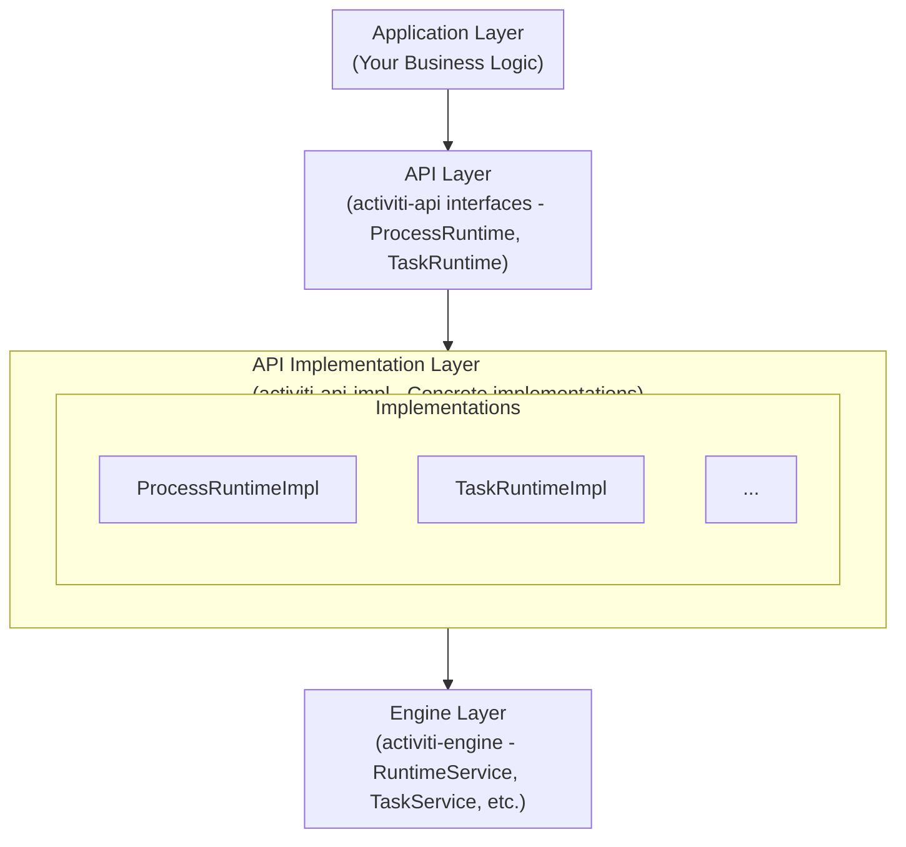
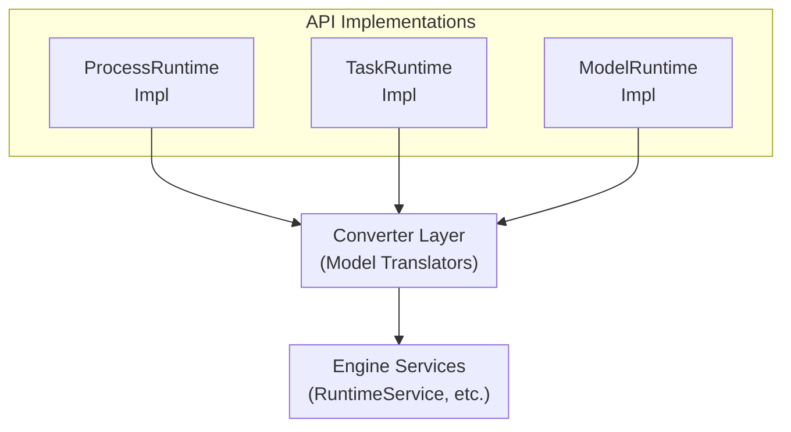

# Activiti API Implementation Module - Technical Documentation

**Module:** `activiti-core/activiti-api-impl`

---

## Table of Contents

- [Overview](#overview)
- [Architecture](#architecture)
- [API Implementation Strategy](#api-implementation-strategy)
- [Process Runtime Implementation](#process-runtime-implementation)
- [Task Runtime Implementation](#task-runtime-implementation)
- [Model Implementation](#model-implementation)
- [Query Implementation](#query-implementation)
- [Event Implementation](#event-implementation)
- [Converter Implementation](#converter-implementation)
- [Performance Considerations](#performance-considerations)
- [Error Handling](#error-handling)
- [Testing Strategy](#testing-strategy)
- [Migration Guide](#migration-guide)
- [API Reference](#api-reference)

---

## Overview

The **activiti-api-impl** module provides the concrete implementation of the Activiti API interfaces defined in the `activiti-api` module. It bridges the high-level API with the underlying engine implementation, providing a clean, type-safe interface for developers.

### Key Responsibilities

1. **API Implementation**: Concrete implementations of all API interfaces
2. **Model Conversion**: Transform between API models and engine models
3. **Query Translation**: Convert API queries to engine queries
4. **Event Mapping**: Map engine events to API events
5. **Error Handling**: Translate engine exceptions to API exceptions
6. **Validation**: Input validation and business rule enforcement

### Design Principles

- **Facade Pattern**: Hide engine complexity
- **Adapter Pattern**: Bridge API and engine
- **Builder Pattern**: Fluent API construction
- **Immutable Models**: Type-safe data structures
- **Fail-Fast**: Early validation and error detection

---

## Key Classes and Their Responsibilities

### ProcessRuntimeImpl

**Purpose:** Implements the `ProcessRuntime` interface to manage process instance lifecycle operations.

**Responsibilities:**
- Starting new process instances with variables and business keys
- Sending signal and message events to running processes
- Querying process instances and definitions
- Managing process instance state (suspend, activate, delete)
- Handling process variables at instance and execution level

**Key Methods:**
- `start(StartProcessPayload)` - Initiates a new process instance
- `signal(SignalEventPayload)` - Broadcasts signals to waiting processes
- `message(MessageEventPayload)` - Sends targeted messages to processes
- `processInstances()` - Returns query builder for process instances
- `processDefinition(String id)` - Retrieves process definition metadata

**When to Use:** For all process instance management operations in your application. This is the primary entry point for workflow execution.

**Dependencies:**
- `RuntimeService` - Underlying engine service
- `ProcessPayloadConverter` - Converts API payloads to engine commands
- `ProcessInstanceConverter` - Converts engine instances to API models

---

### TaskRuntimeImpl

**Purpose:** Implements the `TaskRuntime` interface to manage user task lifecycle operations.

**Responsibilities:**
- Querying tasks by various criteria (assignee, candidate, process instance)
- Claiming and assigning tasks to users
- Completing tasks with optional variables
- Updating task properties (assignee, due date, priority)
- Managing task candidates (users and groups)
- Handling task variables and comments

**Key Methods:**
- `task(String taskId)` - Retrieves a specific task
- `tasks(TaskQueryPayload)` - Queries tasks with filters
- `complete(CompleteTaskPayload)` - Completes a task
- `claim(ClaimTaskPayload)` - Claims a task for a user
- `assign(AssignTaskPayload)` - Assigns task to user
- `addCandidate(AddCandidatePayload)` - Adds candidate user/group

**When to Use:** For all task management operations. Use this when you need to interact with user tasks in a process.

**Dependencies:**
- `TaskService` - Underlying engine service
- `TaskPayloadConverter` - Converts API payloads to engine commands
- `TaskConverter` - Converts engine tasks to API models

---

### ProcessPayloadConverter

**Purpose:** Transforms API payload objects into engine-compatible command objects.

**Responsibilities:**
- Converting `StartProcessPayload` to engine start commands
- Mapping API variables to engine variable format
- Resolving process definition IDs from keys
- Validating payload structure before conversion
- Handling optional fields and defaults

**Key Methods:**
- `toCommand(StartProcessPayload)` - Converts start payload to command
- `toEngineVariables(Map<String, Object>)` - Converts API variables
- `resolveProcessDefinitionId(String key)` - Finds definition by key
- `validate(StartProcessPayload)` - Validates payload structure

**When to Use:** Internally by runtime implementations. You typically don't use this directly.

**Design Pattern:** Converter/Translator pattern - bridges API and engine models

---

### ProcessInstanceConverter

**Purpose:** Transforms engine `ProcessInstance` objects to API `ProcessInstance` models.

**Responsibilities:**
- Mapping engine fields to API fields
- Converting engine state enums to API state enums
- Transforming Date objects to Instant
- Handling null values appropriately
- Creating immutable API model instances

**Key Methods:**
- `toApiProcessInstance(engine.ProcessInstance)` - Converts engine to API
- `convertState(String engineState)` - Maps state values
- `convertDate(Date engineDate)` - Converts to Instant

**When to Use:** Internally by runtime implementations. Ensures API consumers get consistent, type-safe models.

**Design Pattern:** Converter pattern with immutable target models

---

### TaskPayloadConverter

**Purpose:** Transforms API task payloads into engine-compatible commands.

**Responsibilities:**
- Converting `CompleteTaskPayload` to engine complete commands
- Mapping `ClaimTaskPayload` to engine claim operations
- Transforming task variable payloads
- Validating task operation parameters
- Handling candidate user/group payloads

**Key Methods:**
- `toCompleteCommand(CompleteTaskPayload)` - Converts completion payload
- `toClaimCommand(ClaimTaskPayload)` - Converts claim payload
- `toEngineVariables(Map<String, Object>)` - Converts variables
- `validate(TaskPayload)` - Validates payload structure

**When to Use:** Internally by TaskRuntimeImpl. Ensures task operations are properly formatted.

---

### ProcessInstanceQueryImpl

**Purpose:** Implements fluent query builder for process instance queries.

**Responsibilities:**
- Building complex queries with multiple filters
- Translating API query criteria to engine query
- Handling pagination (firstResult, maxResults)
- Ordering results by various fields
- Executing queries and converting results

**Key Methods:**
- `processDefinitionKey(String key)` - Filter by definition key
- `processInstanceId(String id)` - Filter by instance ID
- `businessKey(String key)` - Filter by business key
- `active()` - Filter for active instances only
- `list()` - Execute query and return results
- `singleResult()` - Execute and return single result

**When to Use:** When you need to search for process instances with specific criteria.

**Design Pattern:** Query Object pattern with fluent interface

---

### EventConverter

**Purpose:** Maps engine runtime events to API event models.

**Responsibilities:**
- Converting engine event types to API event types
- Transforming event entity data
- Creating appropriate API event instances
- Handling event payload conversion
- Managing event metadata

**Key Methods:**
- `convert(engine.RuntimeEvent)` - Converts engine event to API event
- `convertCreatedEvent(engine.RuntimeEvent)` - Handles creation events
- `convertUpdatedEvent(engine.RuntimeEvent)` - Handles update events
- `convertDeletedEvent(engine.RuntimeEvent)` - Handles deletion events

**When to Use:** Internally by event listeners. Ensures consistent event representation.

---

### ApiExceptionHandler

**Purpose:** Translates engine exceptions to API-specific exceptions.

**Responsibilities:**
- Catching and wrapping engine exceptions
- Creating appropriate API exception types
- Preserving exception chains for debugging
- Adding context to error messages
- Handling validation errors

**Key Methods:**
- `translate(Exception)` - Converts any exception to API exception
- `translateActivitiException(ActivitiException)` - Handles engine exceptions
- `createNotFoundException(String message)` - Creates not found exception
- `createAuthorizationException(String message)` - Creates auth exception

**When to Use:** Internally by runtime implementations. Provides consistent error handling.

**Design Pattern:** Exception Translation pattern

---

### PayloadValidator

**Purpose:** Validates API payloads before processing.

**Responsibilities:**
- Checking required fields are present
- Validating field formats and values
- Ensuring business rule compliance
- Providing clear error messages
- Fail-fast validation

**Key Methods:**
- `validate(StartProcessPayload)` - Validates start payload
- `validate(CompleteTaskPayload)` - Validates completion payload
- `checkRequiredFields(Payload)` - Ensures required fields exist
- `checkFieldFormats(Payload)` - Validates field formats

**When to Use:** At the beginning of runtime operations. Catches errors early.

**Design Pattern:** Validator pattern with fail-fast principle

---

## Architecture

### Layer Architecture



### Component Diagram



---

## API Implementation Strategy

### Implementation Pattern

```java
// API Interface (from activiti-api)
public interface ProcessRuntime {
    ProcessInstance start(StartProcessPayload payload);
    void signal(SignalEventPayload payload);
    void message(MessageEventPayload payload);
}

// Implementation (in activiti-api-impl)
@Component
public class ProcessRuntimeImpl implements ProcessRuntime {
    
    @Autowired
    private RuntimeService runtimeService;
    
    @Autowired
    private ProcessPayloadConverter processPayloadConverter;
    
    @Override
    public ProcessInstance start(StartProcessPayload payload) {
        // 1. Validate payload
        validatePayload(payload);
        
        // 2. Convert to engine model
        StartProcessCommand command = 
            processPayloadConverter.toCommand(payload);
        
        // 3. Execute on engine
        ProcessInstance engineInstance = 
            runtimeService.startProcessInstanceById(command.getProcessDefinitionId());
        
        // 4. Convert back to API model
        return processPayloadConverter.toApiModel(engineInstance);
    }
    
    private void validatePayload(StartProcessPayload payload) {
        if (payload.getProcessDefinitionKey() == null) {
            throw new IllegalArgumentException("Process definition key is required");
        }
    }
}
```

### Dependency Injection

```java
@Configuration
public class ApiImplConfig {
    
    @Autowired
    private ProcessEngine processEngine;
    
    @Bean
    public ProcessRuntime processRuntime() {
        return new ProcessRuntimeImpl(
            processEngine.getRuntimeService(),
            processPayloadConverter()
        );
    }
    
    @Bean
    public TaskRuntime taskRuntime() {
        return new TaskRuntimeImpl(
            processEngine.getTaskService(),
            taskPayloadConverter()
        );
    }
    
    @Bean
    private ProcessPayloadConverter processPayloadConverter() {
        return new DefaultProcessPayloadConverter();
    }
}
```

---

## Process Runtime Implementation

### Start Process Implementation

```java
public class ProcessRuntimeImpl implements ProcessRuntime {
    
    private final RuntimeService runtimeService;
    private final ProcessPayloadConverter converter;
    
    @Override
    public ProcessInstance start(StartProcessPayload payload) {
        try {
            // Validate
            Assert.notNull(payload.getProcessDefinitionKey(), 
                "Process definition key is required");
            
            // Build variables map
            Map<String, Object> variables = buildVariables(payload);
            
            // Start process
            String processDefinitionId = resolveProcessDefinitionId(payload);
            
            org.activiti.engine.ProcessInstance engineInstance = 
                runtimeService.startProcessInstanceById(
                    processDefinitionId, 
                    payload.getBusinessKey(),
                    variables
                );
            
            // Convert to API model
            return converter.toApiProcessInstance(engineInstance);
            
        } catch (ActivitiException e) {
            throw new ProcessEngineException("Failed to start process", e);
        }
    }
    
    private Map<String, Object> buildVariables(StartProcessPayload payload) {
        Map<String, Object> variables = new HashMap<>();
        if (payload.getVariables() != null) {
            payload.getVariables().forEach(variables::put);
        }
        return variables;
    }
    
    private String resolveProcessDefinitionId(StartProcessPayload payload) {
        if (payload.getProcessDefinitionId() != null) {
            return payload.getProcessDefinitionId();
        }
        
        // Find by key and version
        return runtimeService.createProcessDefinitionQuery()
            .processDefinitionKey(payload.getProcessDefinitionKey())
            .latestVersion()
            .singleResult()
            .getId();
    }
}
```

### Signal Event Implementation

```java
@Override
public void signal(SignalEventPayload payload) {
    try {
        Assert.notNull(payload.getSignalName(), 
            "Signal name is required");
        
        runtimeService.signalEventReceived(
            payload.getSignalName(),
            payload.getData()
        );
        
    } catch (ActivitiException e) {
        throw new SignalEventException("Failed to send signal", e);
    }
}
```

### Message Event Implementation

```java
@Override
public void message(MessageEventPayload payload) {
    try {
        Assert.notNull(payload.getMessageName(), 
            "Message name is required");
        
        runtimeService.messageEventReceived(
            payload.getMessageName(),
            payload.getProcessInstanceId(),
            payload.getData()
        );
        
    } catch (ActivitiException e) {
        throw new MessageEventException("Failed to send message", e);
    }
}
```

---

## Task Runtime Implementation

### Task Query Implementation

```java
public class TaskRuntimeImpl implements TaskRuntime {
    
    private final TaskService taskService;
    private final TaskPayloadConverter converter;
    
    @Override
    public Task task(String taskId) {
        try {
            org.activiti.engine.Task engineTask = 
                taskService.createTaskQuery()
                    .taskId(taskId)
                    .singleResult();
            
            if (engineTask == null) {
                throw new TaskNotFoundException(taskId);
            }
            
            return converter.toApiTask(engineTask);
            
        } catch (ActivitiException e) {
            throw new TaskServiceException("Failed to get task", e);
        }
    }
    
    @Override
    public List<Task> tasks(TaskQueryPayload payload) {
        TaskQuery query = taskService.createTaskQuery();
        
        // Apply filters
        applyFilters(query, payload);
        
        // Execute query
        List<org.activiti.engine.Task> engineTasks = query.list();
        
        // Convert results
        return engineTasks.stream()
            .map(converter::toApiTask)
            .collect(Collectors.toList());
    }
    
    private void applyFilters(TaskQuery query, TaskQueryPayload payload) {
        if (payload.getProcessInstanceId() != null) {
            query.processInstanceId(payload.getProcessInstanceId());
        }
        if (payload.getAssignee() != null) {
            query.taskAssignee(payload.getAssignee());
        }
        if (payload.getCandidateUser() != null) {
            query.candidateUser(payload.getCandidateUser());
        }
        // ... more filters
    }
}
```

### Task Completion Implementation

```java
@Override
public void complete(CompleteTaskPayload payload) {
    try {
        Assert.notNull(payload.getTaskId(), "Task ID is required");
        
        Map<String, Object> variables = 
            payload.getVariables() != null ? 
            payload.getVariables() : new HashMap<>();
        
        taskService.complete(payload.getTaskId(), variables);
        
    } catch (ActivitiException e) {
        throw new TaskCompletionException("Failed to complete task", e);
    }
}
```

### Task Claim Implementation

```java
@Override
public Task claim(ClaimTaskPayload payload) {
    try {
        Assert.notNull(payload.getTaskId(), "Task ID is required");
        Assert.notNull(payload.getAssignee(), "Assignee is required");
        
        taskService.claim(payload.getTaskId(), payload.getAssignee());
        
        return task(payload.getTaskId());
        
    } catch (ActivitiException e) {
        throw new TaskClaimException("Failed to claim task", e);
    }
}
```

---

## Model Implementation

### Payload Builders

```java
public final class StartProcessPayloadBuilder {
    
    private String processDefinitionKey;
    private String processDefinitionId;
    private String businessKey;
    private Map<String, Object> variables;
    
    public StartProcessPayloadBuilder withProcessDefinitionKey(String key) {
        this.processDefinitionKey = key;
        return this;
    }
    
    public StartProcessPayloadBuilder withProcessDefinitionId(String id) {
        this.processDefinitionId = id;
        return this;
    }
    
    public StartProcessPayloadBuilder withBusinessKey(String key) {
        this.businessKey = key;
        return this;
    }
    
    public StartProcessPayloadBuilder withVariable(String name, Object value) {
        if (this.variables == null) {
            this.variables = new HashMap<>();
        }
        this.variables.put(name, value);
        return this;
    }
    
    public StartProcessPayloadBuilder withVariables(Map<String, Object> variables) {
        this.variables = variables;
        return this;
    }
    
    public StartProcessPayload build() {
        validate();
        return new StartProcessPayload(
            processDefinitionKey,
            processDefinitionId,
            businessKey,
            variables
        );
    }
    
    private void validate() {
        if (processDefinitionKey == null && processDefinitionId == null) {
            throw new IllegalStateException(
                "Either processDefinitionKey or processDefinitionId must be set");
        }
    }
}
```

### Immutable Models

```java
public final class ProcessInstance {
    
    private final String id;
    private final String processDefinitionId;
    private final String businessKey;
    private final String name;
    private final Instant startTime;
    private final ProcessInstanceState state;
    
    private ProcessInstance(Builder builder) {
        this.id = builder.id;
        this.processDefinitionId = builder.processDefinitionId;
        this.businessKey = builder.businessKey;
        this.name = builder.name;
        this.startTime = builder.startTime;
        this.state = builder.state;
    }
    
    // Getters (no setters - immutable)
    
    public static Builder builder() {
        return new Builder();
    }
    
    public static class Builder {
        private String id;
        private String processDefinitionId;
        // ... other fields
        
        public Builder id(String id) {
            this.id = id;
            return this;
        }
        
        public ProcessInstance build() {
            return new ProcessInstance(this);
        }
    }
}
```

---

## Query Implementation

### Query Builder Pattern

```java
public class ProcessInstanceQueryImpl implements ProcessInstanceQuery {
    
    private final RuntimeService runtimeService;
    private String processDefinitionKey;
    private String processInstanceId;
    private String businessKey;
    private List<String> executionIds;
    private Integer firstResult;
    private Integer maxResults;
    
    @Override
    public ProcessInstanceQuery processDefinitionKey(String key) {
        this.processDefinitionKey = key;
        return this;
    }
    
    @Override
    public ProcessInstanceQuery processInstanceId(String id) {
        this.processInstanceId = id;
        return this;
    }
    
    @Override
    public ProcessInstanceQuery businessKey(String key) {
        this.businessKey = key;
        return this;
    }
    
    @Override
    public ProcessInstanceQuery listPage(int page, int size) {
        this.firstResult = page * size;
        this.maxResults = size;
        return this;
    }
    
    @Override
    public List<ProcessInstance> list() {
        org.activiti.engine.impl.ProcessInstanceQuery engineQuery = 
            runtimeService.createProcessInstanceQuery();
        
        applyFilters(engineQuery);
        
        List<org.activiti.engine.ProcessInstance> results = 
            engineQuery.listPage(firstResult, maxResults);
        
        return convertResults(results);
    }
    
    private void applyFilters(org.activiti.engine.impl.ProcessInstanceQuery query) {
        if (processDefinitionKey != null) {
            query.processDefinitionKey(processDefinitionKey);
        }
        if (processInstanceId != null) {
            query.processInstanceId(processInstanceId);
        }
        if (businessKey != null) {
            query.businessKey(businessKey);
        }
    }
    
    private List<ProcessInstance> convertResults(
            List<org.activiti.engine.ProcessInstance> engineResults) {
        return engineResults.stream()
            .map(this::convertToApiModel)
            .collect(Collectors.toList());
    }
}
```

---

## Event Implementation

### Event Converter

```java
@Component
public class EventConverter {
    
    public ApiEvent convert(org.activiti.engine.event.RuntimeEvent engineEvent) {
        switch (engineEvent.getType()) {
            case ENTITY_CREATED:
                return convertCreatedEvent(engineEvent);
            case ENTITY_DELETED:
                return convertDeletedEvent(engineEvent);
            case ENTITY_UPDATED:
                return convertUpdatedEvent(engineEvent);
            default:
                return new GenericApiEvent(engineEvent);
        }
    }
    
    private ApiEvent convertCreatedEvent(
            org.activiti.engine.event.RuntimeEvent event) {
        Object entity = event.getEntity();
        
        if (entity instanceof ProcessInstance) {
            return new ProcessInstanceCreatedEvent(
                ((ProcessInstance) entity).getId());
        }
        if (entity instanceof Task) {
            return new TaskCreatedEvent(
                ((Task) entity).getId());
        }
        
        return new EntityCreatedEvent(entity.getClass().getName());
    }
}
```

### Event Publisher

```java
@Component
public class ApiEventPublisher {
    
    @Autowired
    private ApplicationEventPublisher springEventPublisher;
    
    public void publish(ApiEvent event) {
        // Publish to Spring event system
        springEventPublisher.publishEvent(event);
        
        // Also publish to Activiti event system
        // (if needed for backward compatibility)
    }
}
```

---

## Converter Implementation

### Model Converter Strategy

```java
public interface ModelConverter<FROM, TO> {
    TO convert(FROM source);
    FROM reverse(TO target);
}

@Component
public class ProcessInstanceConverter 
    implements ModelConverter<
        org.activiti.engine.ProcessInstance, 
        api.ProcessInstance> {
    
    @Override
    public api.ProcessInstance convert(
            org.activiti.engine.ProcessInstance engineInstance) {
        
        return api.ProcessInstance.builder()
            .id(engineInstance.getId())
            .processDefinitionId(engineInstance.getProcessDefinitionId())
            .businessKey(engineInstance.getBusinessKey())
            .name(engineInstance.getName())
            .startTime(Instant.ofEpochMilli(
                engineInstance.getStartTime().getTime()))
            .state(convertState(engineInstance.getState()))
            .build();
    }
    
    @Override
    public org.activiti.engine.ProcessInstance reverse(
            api.ProcessInstance apiInstance) {
        // For read-only models, reverse may not be needed
        throw new UnsupportedOperationException(
            "Reverse conversion not supported for ProcessInstance");
    }
    
    private ProcessInstanceState convertState(String engineState) {
        switch (engineState) {
            case "ACTIVE":
                return ProcessInstanceState.ACTIVE;
            case "SUSPENDED":
                return ProcessInstanceState.SUSPENDED;
            default:
                return ProcessInstanceState.UNKNOWN;
        }
    }
}
```

---

## Performance Considerations

### 1. Lazy Loading

```java
public class TaskImpl implements Task {
    
    private final String taskId;
    private final TaskService taskService;
    private org.activiti.engine.Task engineTask;
    
    // Lazy load engine task
    private org.activiti.engine.Task getEngineTask() {
        if (engineTask == null) {
            engineTask = taskService.createTaskQuery()
                .taskId(taskId)
                .singleResult();
        }
        return engineTask;
    }
    
    @Override
    public String getAssignee() {
        return getEngineTask().getAssignee();
    }
}
```

### 2. Batch Operations

```java
@Override
public List<Task> tasks(TaskQueryPayload payload) {
    // Use batch fetching for better performance
    return taskService.createTaskQuery()
        .listPage(payload.getFirstResult(), payload.getMaxResults())
        .stream()
        .map(converter::toApiTask)
        .collect(Collectors.toList());
}
```

### 3. Caching

```java
@Component
public class CachedProcessDefinitionConverter {
    
    @Cacheable(value = "processDefinitions", key = "#engineDefinition.id")
    public api.ProcessDefinition convert(
            org.activiti.engine.ProcessDefinition engineDefinition) {
        // Conversion logic
    }
}
```

---

## Error Handling

### Exception Translation

```java
public class ApiExceptionHandler {
    
    public static ApiException translate(Exception e) {
        if (e instanceof ActivitiException) {
            return translateActivitiException((ActivitiException) e);
        }
        if (e instanceof IllegalArgumentException) {
            return new InvalidPayloadException(e.getMessage(), e);
        }
        return new UnknownApiException("Unexpected error", e);
    }
    
    private static ApiException translateActivitiException(
            ActivitiException e) {
        if (e instanceof ActivitiObjectNotFoundException) {
            return new ResourceNotFoundException(e.getMessage(), e);
        }
        if (e instanceof ActivitiAuthorizationException) {
            return new AuthorizationException(e.getMessage(), e);
        }
        if (e instanceof ActivitiExecutionException) {
            return new ProcessExecutionException(e.getMessage(), e);
        }
        return new EngineException(e.getMessage(), e);
    }
}
```

### Validation

```java
public class PayloadValidator {
    
    public static void validate(StartProcessPayload payload) {
        Assert.notNull(payload, "Payload cannot be null");
        Assert.hasText(payload.getProcessDefinitionKey(), 
            "Process definition key is required");
        
        if (payload.getVariables() != null) {
            payload.getVariables().forEach((key, value) -> {
                Assert.hasText(key, "Variable key cannot be empty");
            });
        }
    }
}
```

---

## Testing Strategy

### Unit Testing

```java
@ExtendWith(MockitoExtension.class)
class ProcessRuntimeImplTest {
    
    @Mock
    private RuntimeService runtimeService;
    
    @Mock
    private ProcessPayloadConverter converter;
    
    @InjectMocks
    private ProcessRuntimeImpl processRuntime;
    
    @Test
    void testStartProcess() {
        // Arrange
        StartProcessPayload payload = StartProcessPayloadBuilder.start()
            .withProcessDefinitionKey("testProcess")
            .build();
        
        when(runtimeService.startProcessInstanceByKey("testProcess"))
            .thenReturn(mock(org.activiti.engine.ProcessInstance.class));
        
        // Act
        ProcessInstance result = processRuntime.start(payload);
        
        // Assert
        verify(runtimeService).startProcessInstanceByKey("testProcess");
        assertNotNull(result);
    }
}
```

### Integration Testing

```java
@SpringBootTest
class ProcessRuntimeIntegrationTest {
    
    @Autowired
    private ProcessRuntime processRuntime;
    
    @Test
    void testEndToEnd() {
        // Start process
        ProcessInstance instance = processRuntime.start(
            StartProcessPayloadBuilder.start()
                .withProcessDefinitionKey("testProcess")
                .build()
        );
        
        assertNotNull(instance.getId());
        
        // Query process
        List<ProcessInstance> instances = processRuntime.processInstances()
            .processInstanceId(instance.getId())
            .list();
        
        assertEquals(1, instances.size());
    }
}
```

---

## Migration Guide

### From Engine API to Activiti API

**Before (Engine API):**
```java
@Autowired
private RuntimeService runtimeService;

public void startProcess() {
    ProcessInstance instance = runtimeService
        .startProcessInstanceByKey("orderProcess");
}
```

**After (Activiti API):**
```java
@Autowired
private ProcessRuntime processRuntime;

public void startProcess() {
    ProcessInstance instance = processRuntime.start(
        StartProcessPayloadBuilder.start()
            .withProcessDefinitionKey("orderProcess")
            .build()
    );
}
```

### Benefits

- Type-safe payloads
- Better IDE support
- Clearer API contracts
- Easier testing
- Future-proof

---

## API Reference

### Core Interfaces

- `ProcessRuntime` - Process instance management
- `TaskRuntime` - Task management
- `ModelRuntime` - Model management
- `ProcessInstanceQuery` - Process instance queries
- `TaskQuery` - Task queries

### Payload Classes

- `StartProcessPayload` - Start process parameters
- `CompleteTaskPayload` - Complete task parameters
- `SignalEventPayload` - Signal event parameters
- `MessageEventPayload` - Message event parameters

### Builder Classes

- `StartProcessPayloadBuilder`
- `CompleteTaskPayloadBuilder`
- `SignalEventPayloadBuilder`
- `MessageEventPayloadBuilder`

### Exception Classes

- `ApiException` - Base API exception
- `ProcessEngineException` - Process execution errors
- `TaskServiceException` - Task service errors
- `ResourceNotFoundException` - Resource not found
- `AuthorizationException` - Authorization errors

---

## See Also

- [Parent Module Documentation](../overview.md)
- [Engine Documentation](../engine-api/README.md)
- [API Module Documentation](./README.md)
