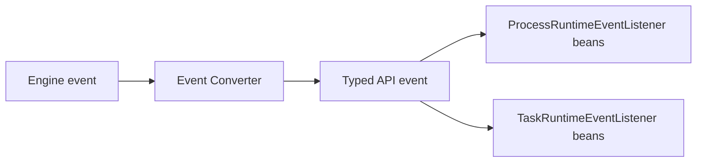

# Activiti API Runtime Events

The Activiti API exposes a modern, type-safe event system that is the recommended way for application code to react to process, task, and variable lifecycle changes. Unlike the [legacy engine event system](../../advanced/engine-event-system.md) (which dispatches raw `ActivitiEvent` objects), these are typed events that carry strongly-modeled entities.

## Event Model

All runtime events derive from `RuntimeEvent<ENTITY, TYPE>`:

```java
public interface RuntimeEvent<ENTITY, TYPE> {
    String getId();
    ENTITY getEntity();
    TYPE getEventType();
    Long getTimestamp();
    String getProcessInstanceId();
    String getProcessDefinitionId();
    String getProcessDefinitionKey();
    String getParentProcessInstanceId();
}
```

The core event families are:

| Family | Parent interface | Entity type | Event types |
|--------|------------------|-------------|-------------|
| **Process** | `ProcessRuntimeEvent<T>` | `ProcessInstance` | `PROCESS_CREATED`, `PROCESS_STARTED`, `PROCESS_COMPLETED`, `PROCESS_CANCELLED`, `PROCESS_SUSPENDED`, `PROCESS_RESUMED`, `PROCESS_UPDATED` |
| **Task** | `TaskRuntimeEvent<T>` | `Task` | `TASK_CREATED`, `TASK_ASSIGNED`, `TASK_COMPLETED`, `TASK_UPDATED`, `TASK_ACTIVATED`, `TASK_SUSPENDED`, `TASK_CANCELLED` |
| **Variable** | `VariableEvent` | `VariableInstance` | `VARIABLE_CREATED`, `VARIABLE_UPDATED`, `VARIABLE_DELETED` |
| **BPMN** | `ExtendedProcessRuntimeEvent<T>` | `BPMNElement` | Element-specific (see below) |

## Process Events

Located in `org.activiti.api.process.runtime.events` (and the process model events package). Concrete interfaces for process lifecycle:

- `ProcessCreatedEvent` — a process instance was created
- `ProcessStartedEvent` — a process instance started execution
- `ProcessCompletedEvent` — a process instance completed
- `ProcessCancelledEvent` — a process instance was deleted/cancelled
- `ProcessSuspendedEvent` — a process instance was suspended
- `ProcessResumedEvent` — a suspended process instance resumed
- `ProcessUpdatedEvent` — process metadata was updated

```java
@Autowired
ProcessRuntime processRuntime;

// The API emits typed events automatically when operations run
```

### Consuming Process Events

```java
@Component
public class ProcessLifecycleListener implements ProcessEventListener<ProcessCompletedEvent> {

    @Override
    public void onEvent(ProcessCompletedEvent event) {
        ProcessInstance process = event.getEntity();
        archiveProcessData(process.getId());
        sendCompletionNotification(process.getBusinessKey());
    }
}
```

The `ProcessEventListener` listener type is used for process events. To receive all process events, listen to `ProcessEvents` via the `ProcessRuntimeEventListener` base.

## Task Events

Located in `org.activiti.api.task.runtime.events`:

- `TaskCreatedEvent` — a task was created
- `TaskAssignedEvent` — a task was assigned to a user
- `TaskUpdatedEvent` — task metadata was updated
- `TaskCompletedEvent` — a task was completed
- `TaskCancelledEvent` — a task was deleted
- `TaskActivatedEvent` — a task was activated
- `TaskSuspendedEvent` — a task was suspended

### Consuming Task Events

```java
@Component
public class TaskAssignListener implements TaskEventListener<TaskAssignedEvent> {

    @Override
    public void onEvent(TaskAssignedEvent event) {
        Task task = event.getEntity();
        notifyAssignee(task.getAssignee(), task.getName());
    }
}
```

## Variable Events

Located in `org.activiti.api.model.shared.event`:

- `VariableCreatedEvent`
- `VariableUpdatedEvent`
- `VariableDeletedEvent`

### Consuming Variable Events

```java
@Component
public class SensitiveVariableListener implements VariableEventListener<VariableUpdatedEvent> {

    @Override
    public void onEvent(VariableUpdatedEvent event) {
        VariableInstance variable = event.getEntity();
        if (isSensitive(variable.getName())) {
            auditVariableChange(variable);
        }
    }
}
```

## BPMN Events

Located in `org.activiti.api.process.model.events`. These events are dispatched as element-level events during execution:

- **Activity**: `BPMNActivityStartedEvent`, `BPMNActivityCompletedEvent`, `BPMNActivityCancelledEvent`
- **Timer**: `BPMNTimerScheduledEvent`, `BPMNTimerFiredEvent`, `BPMNTimerExecutedEvent`, `BPMNTimerCancelledEvent`, `BPMNTimerFailedEvent`, `BPMNTimerRetriesDecrementedEvent`
- **Message**: `BPMNMessageReceivedEvent`, `BPMNMessageSentEvent`, `BPMNMessageWaitingEvent`
- **Signal**: `BPMNSignalReceivedEvent`
- **Error**: `BPMNErrorReceivedEvent`
- **Sequence Flow**: `BPMNSequenceFlowTakenEvent`

### Consuming BPMN Events

```java
@Component
public class TimerMonitor implements BPMNElementEventListener<BPMNTimerFiredEvent> {

    @Override
    public void onEvent(BPMNTimerFiredEvent event) {
        BPMNTimer timer = (BPMNTimer) event.getEntity();
        recordTimerFired(timer.getElementId());
    }
}
```

## Listener Interfaces

The event system is built around typed listener interfaces in the `events.listener` package:

| Listener | Event family |
|----------|--------------|
| `ProcessRuntimeEventListener<E>` | Base for all process runtime events |
| `ProcessEventListener<E>` | Process instance events |
| `BPMNElementEventListener<E>` | BPMN element events |
| `ProcessCandidateStarterEventListener<E>` | Candidate starter events |
| `TaskRuntimeEventListener<E>` | Base for all task runtime events |
| `TaskEventListener<E>` | Task events |
| `TaskCandidateEventListener<E>` | Task candidate events |
| `VariableEventListener<E>` | Variable events |

All events also implement the **typed event interfaces** such as `ProcessEventListener`, `BPMNElementEventListener`, `VariableEventListener`.

## Consuming Events in Spring Boot

Process, task, variable, and BPMN lifecycle events are **not** Spring application events — they are dispatched only to typed listener beans (e.g. `ProcessRuntimeEventListener`, `TaskRuntimeEventListener`) registered in the Spring context. Only signal and message payloads (`SignalPayload`, `ReceiveMessagePayload`) are also published as Spring application events, so `@EventListener` works for those.

```java
@Component
public class OrderProcessSubscriber implements ProcessRuntimeEventListener<ProcessStartedEvent> {

    @Override
    public void onEvent(ProcessStartedEvent event) {
        ProcessInstance process = event.getEntity();
        sendOrderConfirmation(process.getId());
    }
}
```

### Transactional Semantics

- Only signal and message payloads are Spring events (published from the runtime's `@Transactional` methods), so `@TransactionalEventListener` with `AFTER_COMMIT` can defer side effects until that transaction commits — useful for sending notifications, emitting analytics, or calling external systems without holding the DB transaction open.
- `@EventListener` (no transaction phase) executes synchronously inside the caller's transaction by default.

### Registering Configuration Listeners

The `ProcessRuntimeConfiguration` interface allows you to explicitly register process and variable listeners:

```java
@Configuration
public class ActivitiRuntimeConfig implements ProcessRuntimeConfiguration {

    @Bean
    public ProcessEventListener<ProcessCompletedEvent> processCompletionListener() {
        return new ProcessCompletionListener();
    }

    @Override
    public List<ProcessRuntimeEventListener<?>> processEventListeners() {
        return List.of(processCompletionListener());
    }

    @Override
    public List<VariableEventListener<?>> variableEventListeners() {
        return List.of(new SensitiveVariableListener());
    }
}
```

## Event to Listener Dispatch

When an engine event occurs, the API layer converts the raw engine event into a typed API event and notifies registered listeners. The dispatch flow is:



The converters live in the `event.impl` package (`ToVariableCreatedConverter`, `ToVariableUpdatedConverter`, `ToVariableDeletedConverter`, etc.) and map engine events to API events.

## Best Practices

1. **Process events idempotently** — event delivery can fire more than once on retries:
```java
@Component
public class ProcessCompletionListener
    implements ProcessRuntimeEventListener<ProcessCompletedEvent> {

    @Override
    public void onEvent(ProcessCompletedEvent event) {
        if (alreadyProcessed(event.getId())) {
            return;
        }
        processEvent(event);
        markAsProcessed(event.getId());
    }
}
```
2. **Use `AFTER_COMMIT`** for external side effects (notifications, emails, metrics) on the signal/message payloads that are Spring events.
3. **Keep listeners fast** — they run in the caller's thread; offload heavy work to async (`@Async`) or a queue.
4. **Prefer typed listeners** (`ProcessEventListener`, `BPMNElementEventListener`) over raw `RuntimeEvent` for clarity.

## Related Documentation

- [Process Runtime](./process-runtime.mdx) — API operations that emit these events
- [Task Runtime](./task-runtime.mdx) — task operations that emit task events
- [Process Model](./process-model.mdx) — the process/BPMN entity models referenced by events
- [API Implementation](./api-implementation.md) — event converter details
- [Engine Event System](../../advanced/engine-event-system.md) — the legacy `ActivitiEvent`-based engine event system

---
