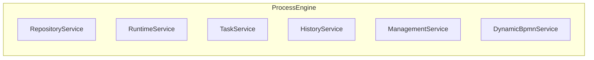

# Engine API Reference

The Activiti Engine API provides the core services for workflow execution, task management, and process automation. This documentation covers the traditional engine-based approach.

## Engine Architecture



## Available Services

| Service                | Purpose                             | Documentation                        |
|------------------------|-------------------------------------|--------------------------------------|
| **Repository Service** | Process definitions and deployments | [View Docs](./repository-service.md) |
| **Runtime Service**    | Process instance execution          | [View Docs](./runtime-service.md)    |
| **Task Service**       | User task management                | [View Docs](./task-service.md)       |
| **History Service**    | Historical data and auditing        | [View Docs](./history-service.md)    |
| **Management Service** | Engine administration               | [View Docs](./management-service.md) |

## ProcessEngine Interface

The `ProcessEngine` is the main entry point to the Activiti engine:

```java
public interface ProcessEngine {
    RepositoryService getRepositoryService();
    RuntimeService getRuntimeService();
    TaskService getTaskService();
    HistoryService getHistoryService();
    ManagementService getManagementService();
    DynamicBpmnService getDynamicBpmnService();
    ProcessEngineConfiguration getProcessEngineConfiguration();
    String getName();
    void close();
}
```

### Getting the Engine

```java
// Default engine (from configuration)
ProcessEngine engine = ProcessEngines.getDefaultProcessEngine();

// Named engine
ProcessEngine engine = ProcessEngines.getProcessEngine("myEngine");

// Spring injection
@Autowired
private ProcessEngine processEngine;
```

## Service Overview

### Repository Service

Manages process definitions and deployments:

```java
RepositoryService repositoryService = engine.getRepositoryService();

// Deploy process
Deployment deployment = repositoryService.createDeployment()
    .addClasspathResource("process.bpmn")
    .deploy();

// Query definitions
List<ProcessDefinition> definitions = repositoryService
    .createProcessDefinitionQuery()
    .processDefinitionKey("orderProcess")
    .list();
```

**See:** [Repository Service Documentation](./repository-service.md)

### Runtime Service

Executes process instances:

```java
RuntimeService runtimeService = engine.getRuntimeService();

// Start process
ProcessInstance processInstance = runtimeService.startProcessInstanceByKey("orderProcess");
String processInstanceId = processInstance.getId();

// Query instances
List<ProcessInstance> instances = runtimeService
    .createProcessInstanceQuery()
    .processDefinitionKey("orderProcess")
    .list();

// Set variables
runtimeService.setVariable(processInstanceId, "amount", 1000);
```

**See:** [Runtime Service Documentation](./runtime-service.md)

### Task Service

Manages user tasks:

```java
TaskService taskService = engine.getTaskService();

// Query tasks
List<Task> tasks = taskService.createTaskQuery()
    .taskAssignee("john.doe")
    .list();

// Claim task
taskService.claim(taskId, "john.doe");

// Complete task
taskService.complete(taskId, variables);
```

**See:** [Task Service Documentation](./task-service.md)

### History Service

Provides historical data and auditing:

```java
HistoryService historyService = engine.getHistoryService();

// Query historic process instances
List<HistoricProcessInstance> instances = historyService
    .createHistoricProcessInstanceQuery()
    .finished()
    .list();

// Query historic tasks
List<HistoricTaskInstance> tasks = historyService
    .createHistoricTaskInstanceQuery()
    .taskAssignee("john.doe")
    .list();

// Get process instance history log
ProcessInstanceHistoryLog log = historyService
    .createProcessInstanceHistoryLogQuery("process-id")
    .includeTasks()
    .includeActivities()
    .includeVariables()
    .singleResult();

// Get historic identity links
List<HistoricIdentityLink> links = historyService
    .getHistoricIdentityLinksForTask("task-id");
```

**See:** [History Service Documentation](./history-service.md) *Rewritten and verified*

### Management Service

Engine administration and maintenance:

```java
ManagementService managementService = engine.getManagementService();

// Get database table counts
Map<String, Long> tableCounts = managementService.getTableCount();

// Query jobs
List<Job> jobs = managementService.createJobQuery()
    .processInstanceId(instanceId)
    .list();

// Execute a specific job
managementService.executeJob(jobId);

// Set job retries
managementService.setJobRetries(jobId, 3);

// Get job exception stacktrace
String stacktrace = managementService.getJobExceptionStacktrace(jobId);

// Move dead letter job back to executable
Job restored = managementService.moveDeadLetterJobToExecutableJob(jobId, 3);

// Query dead letter jobs
List<Job> deadLetterJobs = managementService.createDeadLetterJobQuery().list();
```

**See:** [Management Service Documentation](./management-service.md) *Rewritten and verified*

## Configuration

### Basic Configuration

```java
ProcessEngineConfiguration configuration = ProcessEngineConfiguration
    .createStandaloneInMemProcessEngineConfiguration();

configuration.setJdbcUrl("jdbc:h2:mem:activiti");
configuration.setJdbcUsername("sa");
configuration.setJdbcPassword("");
configuration.setDatabaseSchemaUpdate(ProcessEngineConfiguration.DB_SCHEMA_UPDATE_TRUE);

ProcessEngine engine = configuration.buildProcessEngine();
```

### Spring Boot Configuration

```yaml
spring:
  datasource:
    url: jdbc:mysql://localhost:3306/activiti
    username: activiti
    password: activiti

spring:
  activiti:
    database-schema-update: true
    async-executor-activate: true
```

**See:** [Configuration Guide](../../configuration.md)

## API Comparison

### Engine API vs Activiti API

| Feature | Engine API | Activiti API |
|---------|-----------|--------------|
| **Style** | Service-based | Interface-driven |
| **Access** | Direct service calls | Payload builders |
| **Events** | Limited | Rich event system |
| **Testing** | Harder to mock | Easy to mock |
| **Versioning** | Monolithic | Modular |
| **Use Case** | Legacy, simple apps | Modern, complex apps |

### When to Use Each

**Use Engine API when:**
- Working with existing Activiti codebase
- Simple workflow requirements
- Direct database access needed
- Quick prototyping

**Use Activiti API when:**
- Building new applications
- Need rich event handling
- Require better testability
- Multi-tenant applications
- Microservices architecture

## Common Patterns

### 1. Process Deployment and Execution

```java
// Deploy
repositoryService.createDeployment()
    .addClasspathResource("process.bpmn")
    .deploy();

// Start
String processInstanceId = runtimeService
    .startProcessInstanceByKey("orderProcess");

// Get task
Task task = taskService.createTaskQuery()
    .processInstanceId(processInstanceId)
    .singleResult();

// Complete
taskService.complete(task.getId());
```

### 2. Variable Management

```java
// Set process variable
runtimeService.setVariable(processInstanceId, "orderAmount", 1000);

// Set task variable
taskService.setVariable(taskId, "reviewerComment", "Approved");

// Get variables
Map<String, Object> processVars = runtimeService.getVariables(processInstanceId);
Map<String, Object> taskVars = taskService.getVariables(taskId);
```

### 3. Task Assignment

```java
// Claim task
taskService.claim(taskId, "john.doe");

// Set assignee
taskService.setAssignee(taskId, "jane.doe");

// Release task
taskService.unclaim(taskId);
```

### 4. History Queries

```java
// Process instance history
HistoricProcessInstance instance = historyService
    .createHistoricProcessInstanceQuery()
    .processInstanceId(processInstanceId)
    .singleResult();

// Task history
List<HistoricTaskInstance> tasks = historyService
    .createHistoricTaskInstanceQuery()
    .processInstanceId(processInstanceId)
    .orderByTaskCreateTime().desc()
    .list();

// Variable history
List<HistoricVariableInstance> variables = historyService
    .createHistoricVariableInstanceQuery()
    .processInstanceId(processInstanceId)
    .list();
```

## Error Handling

### Common Exceptions

```java
// Process not found
try {
    runtimeService.startProcessInstanceByKey("nonExistent");
} catch (ActivitiObjectNotFoundException e) {
    log.error("Process definition not found", e);
}

// Task already completed
try {
    taskService.complete(taskId);
} catch (ActivitiException e) {
    log.error("Failed to complete task", e);
}

// Invalid BPMN
try {
    repositoryService.createDeployment()
        .addString("invalid.bpmn", bpmnContent)
        .deploy();
} catch (ActivitiBadUserRequestException e) {
    log.error("Invalid BPMN", e);
}
```

### Transaction Management

```java
@Transactional
public void executeProcess() {
    try {
        runtimeService.startProcessInstanceByKey("orderProcess");
        // Other operations
    } catch (ActivitiException e) {
        // Transaction will rollback
        throw e;
    }
}
```

## Performance Tips

### 1. Batch Operations

```java
// Use batch for multiple tasks
List<String> taskIds = getTaskIds();
for (String taskId : taskIds) {
    taskService.complete(taskId);
}
```

### 2. Query Optimization

```java
// Add indexes for common queries
taskService.createTaskQuery()
    .taskAssignee("john.doe")  // Indexed
    .processDefinitionKey("order")  // Indexed
    .list();
```

### 3. History Level

```java
// Configure appropriate history level
configuration.setHistory(HistoryLevel.FULL);  // Full auditing
// or
configuration.setHistory(HistoryLevel.ACTIVITY);  // Activity only
```

## Migration Guide

### From Activiti 5/6

```java
// Old (Activiti 5)
TaskService taskService = processEngine.getTaskService();
List<Task> tasks = taskService.createTaskQuery().list();

// New (Activiti 7/8)
// Same API, but with improvements
TaskService taskService = processEngine.getTaskService();
List<Task> tasks = taskService.createTaskQuery().list();
```

### To Activiti API

```java
// Engine API
TaskService taskService = engine.getTaskService();
List<Task> tasks = taskService.createTaskQuery().list();

// Activiti API
@Autowired
private TaskRuntime taskRuntime;
Page<Task> tasks = taskRuntime.tasks(Pageable.of(0, 100));
```

## Best Practices

1. **Use try-catch blocks** for all engine operations
2. **Manage transactions** properly
3. **Index frequently queried fields**
4. **Use appropriate history level**
5. **Batch operations** when possible
6. **Cache process definitions**
7. **Monitor job executor**
8. **Use connection pooling**

## Troubleshooting

### Common Issues

**Issue:** "Database table not found"
**Solution:** Enable schema update or run migration

**Issue:** "Job executor not running"
**Solution:** Enable async executor in configuration

**Issue:** "Task not found"
**Solution:** Check task ID and query parameters

**See:** [Troubleshooting Guide](../../troubleshooting/overview.md)

## Next Steps

1. **Start with verified core services:**
   - [Repository Service](./repository-service.md)
   - [Runtime Service](./runtime-service.md)
   - [Task Service](./task-service.md)

2. **Learn advanced topics (all verified):**
   - [History Service](./history-service.md) *Rewritten March 2024*
   - [Management Service](./management-service.md) *Rewritten March 2024*

3. **Explore modern API:**
   - [Activiti API Reference](../activiti-api/README.md)

---

## See Also

- [Activiti API](../activiti-api/README.md) - Modern interface-driven API
- [Configuration Guide](../../configuration.md) - Quick start guide
- [Best Practices](../../best-practices/overview.md) - Performance optimization
