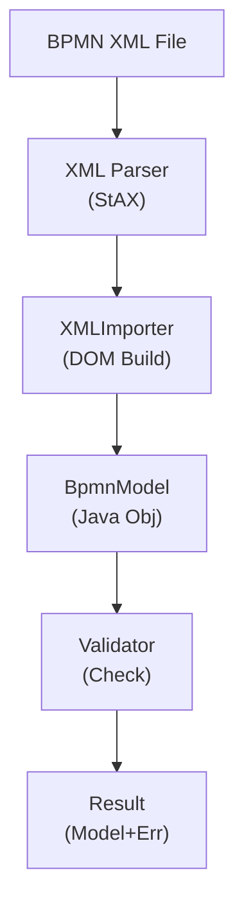
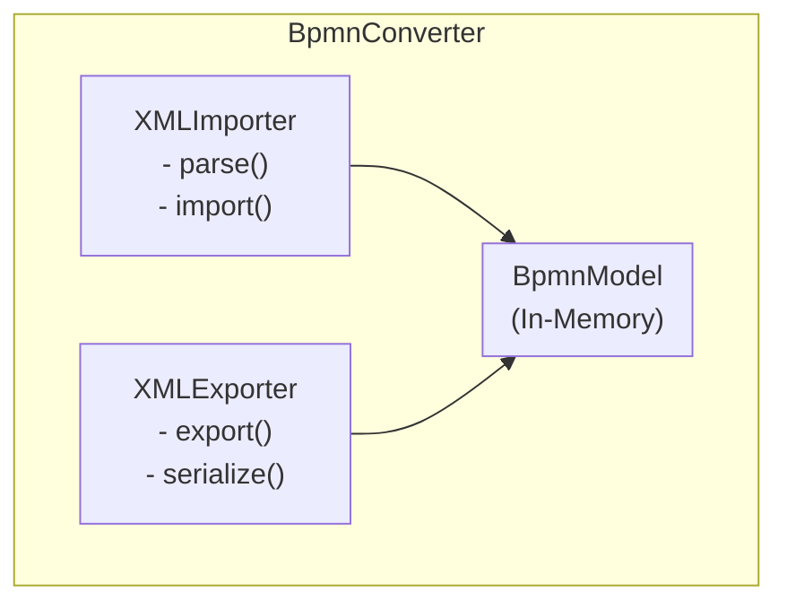

# Activiti BPMN Converter Module - Technical Documentation

**Module:** `activiti-core/activiti-bpmn-converter`

---

## Table of Contents

- [Overview](#overview)
- [Architecture](#architecture)
- [XML Import/Export](#xml-importexport)
- [Model Conversion](#model-conversion)
- [Validation Rules](#validation-rules)
- [Custom Extensions](#custom-extensions)
- [Error Handling](#error-handling)
- [Performance](#performance)
- [Usage Examples](#usage-examples)
- [Best Practices](#best-practices)
- [API Reference](#api-reference)

---

## Overview

The **activiti-bpmn-converter** module handles the conversion between BPMN XML files and the in-memory Java model. It provides parsing, validation, and serialization capabilities for BPMN 2.0 diagrams.

### Key Features

- **XML Parsing**: Convert BPMN XML to Java model
- **Model Export**: Serialize Java model to XML
- **Validation**: Check model correctness
- **Error Reporting**: Detailed parse errors
- **Extension Support**: Custom BPMN elements
- **Namespace Handling**: BPMN 2.0 namespaces

### Module Structure

```
activiti-bpmn-converter/
├── src/main/java/org/activiti/bpmn/converter/
│   ├── BpmnConverter.java              # Main converter
│   ├── XMLImporter.java                # XML parser
│   ├── XMLExporter.java                # XML serializer
│   ├── ModelValidator.java             # Validation
│   └── error/
│       ├── ParseError.java             # Error representation
│       └── ErrorCollector.java         # Error collection
└── src/test/java/
```

---

## Architecture

### Conversion Flow



### Component Diagram



---

## XML Import/Export

### XMLImporter

```java
public class XMLImporter {
    
    private final BpmnModel model;
    private final List<ParseError> errors = new ArrayList<>();
    
    public void parse(InputStream bpmnStream) throws IOException {
        // 1. Create XML reader
        XMLInputFactory inputFactory = XMLInputFactory.newInstance();
        XMLEventReader eventReader = inputFactory.createXMLEventReader(bpmnStream);
        
        // 2. Parse events
        while (eventReader.hasNext()) {
            XMLEvent event = eventReader.nextEvent();
            
            if (event.isStartElement()) {
                handleStartElement(event.asStartElement());
            } else if (event.isEndElement()) {
                handleEndElement(event.asEndElement());
            } else if (event.isCharacters()) {
                handleCharacters(event.asCharacters());
            }
        }
        
        // 3. Validate model
        validateModel();
    }
    
    private void handleStartElementStartElement() {
        String localName = startElement.getName().getLocalPart();
        
        switch (localName) {
            case "definitions":
                parseDefinitions(startElement);
                break;
            case "process":
                parseProcess(startElement);
                break;
            case "task":
                parseTask(startElement);
                break;
            // ... more elements
        }
    }
    
    public List<ParseError> getErrors() {
        return errors;
    }
    
    public BpmnModel getModel() {
        return model;
    }
}
```

### XMLExporter

```java
public class XMLExporter {
    
    public void export(BpmnModel model, OutputStream output) throws IOException {
        // 1. Create XML writer
        XMLOutputFactory outputFactory = XMLOutputFactory.newInstance();
        XMLStreamWriter xmlWriter = outputFactory.createXMLStreamWriter(output);
        
        // 2. Write XML declaration
        xmlWriter.writeStartDocument("UTF-8", "1.0");
        
        // 3. Write definitions
        xmlWriter.writeStartElement("definitions");
        xmlWriter.writeNamespace("http://www.omg.org/spec/BPMN/20100524/MODEL");
        
        // 4. Write processes
        for (Process process : model.getProcesses()) {
            writeProcess(xmlWriter, process);
        }
        
        // 5. Close document
        xmlWriter.writeEndElement();
        xmlWriter.writeEndDocument();
        xmlWriter.flush();
        xmlWriter.close();
    }
    
    private void writeProcess(XMLStreamWriter writer, Process process) 
            throws XMLStreamException {
        
        writer.writeStartElement("process");
        writer.writeAttribute("id", process.getId());
        writer.writeAttribute("name", process.getName());
        writer.writeAttribute("isExecutable", 
            String.valueOf(process.isExecutable()));
        
        // Write flow elements
        for (FlowElement element : process.getFlowElements()) {
            writeFlowElement(writer, element);
        }
        
        writer.writeEndElement();
    }
}
```

---

## Model Conversion

### BpmnConverter

```java
public class BpmnConverter {
    
    private final XMLImporter importer;
    private final XMLExporter exporter;
    
    public BpmnModel convert(InputStream bpmnStream) throws ConverterException {
        try {
            // 1. Import XML
            importer.parse(bpmnStream);
            
            // 2. Check for errors
            List<ParseError> errors = importer.getErrors();
            if (!errors.isEmpty()) {
                throw new ConverterException("Parse errors: " + errors);
            }
            
            // 3. Return model
            return importer.getModel();
            
        } catch (IOException e) {
            throw new ConverterException("Failed to convert BPMN", e);
        }
    }
    
    public void export(BpmnModel model, OutputStream output) throws ConverterException {
        try {
            exporter.export(model, output);
        } catch (IOException e) {
            throw new ConverterException("Failed to export BPMN", e);
        }
    }
}
```

### Element Conversion

```java
public class ElementConverter {
    
    public FlowElement convertStartElement(StartElement element, 
                                           BpmnModel model) {
        String localName = element.getName().getLocalPart();
        
        switch (localName) {
            case "userTask":
                return convertUserTask(element, model);
            case "serviceTask":
                return convertServiceTask(element, model);
            case "exclusiveGateway":
                return convertExclusiveGateway(element, model);
            case "sequenceFlow":
                return convertSequenceFlow(element, model);
            // ... more conversions
            default:
                throw new ParseError("Unknown element: " + localName);
        }
    }
    
    private UserTask convertUserTaskStartElement(), 
                                        BpmnModel model) {
        UserTask task = new UserTask();
        
        // Set attributes
        task.setId(getAttribute(element, "id"));
        task.setName(getAttribute(element, "name"));
        
        // Parse children
        for (int i = 0; i < element.getChildCount(); i++) {
            Node child = element.getChild(i);
            if (child instanceof StartElement) {
                parseChildElement((StartElement) child, task, model);
            }
        }
        
        return task;
    }
}
```

---

## Validation Rules

### ModelValidator

```java
public class ModelValidator {
    
    public ValidationResult validate(BpmnModel model) {
        ValidationResult result = new ValidationResult();
        
        // 1. Check for required elements
        validateRequiredElements(model, result);
        
        // 2. Check for duplicate IDs
        validateDuplicateIds(model, result);
        
        // 3. Check for valid connections
        validateConnections(model, result);
        
        // 4. Check for orphaned elements
        validateOrphanedElements(model, result);
        
        // 5. Check business rules
        validateBusinessRules(model, result);
        
        return result;
    }
    
    private void validateRequiredElements(
            BpmnModel model, 
            ValidationResult result) {
        
        for (Process process : model.getProcesses()) {
            if (process.getId() == null || process.getId().isEmpty()) {
                result.addError("Process must have an ID");
            }
            
            boolean hasStartEvent = false;
            boolean hasEndEvent = false;
            
            for (FlowElement element : process.getFlowElements()) {
                if (element instanceof StartEvent) {
                    hasStartEvent = true;
                }
                if (element instanceof EndEvent) {
                    hasEndEvent = true;
                }
            }
            
            if (!hasStartEvent) {
                result.addWarning("Process has no start event");
            }
            if (!hasEndEvent) {
                result.addWarning("Process has no end event");
            }
        }
    }
    
    private void validateConnections(
            BpmnModel model, 
            ValidationResult result) {
        
        for (Process process : model.getProcesses()) {
            for (FlowElement element : process.getFlowElements()) {
                if (element instanceof SequenceFlow) {
                    SequenceFlow flow = (SequenceFlow) element;
                    
                    if (flow.getSourceRef() == null) {
                        result.addError(
                            "Sequence flow " + flow.getId() + 
                            " has no source");
                    }
                    if (flow.getTargetRef() == null) {
                        result.addError(
                            "Sequence flow " + flow.getId() + 
                            " has no target");
                    }
                }
            }
        }
    }
}
```

---

## Custom Extensions

### Extension Element Support

```java
public class ExtensionElement {
    
    private String namespace;
    private String name;
    private Map<String, String> attributes = new HashMap<>();
    private List<ExtensionElement> children = new ArrayList<>();
    
    public void addAttribute(String name, String value) {
        attributes.put(name, value);
    }
    
    public String getAttribute(String name) {
        return attributes.get(name);
    }
    
    public void addChild(ExtensionElement child) {
        children.add(child);
    }
}
```

### Custom Parser

```java
public class CustomExtensionParser {
    
    public void parseExtension(StartElement element, 
                              BaseElement baseElement) {
        if (isCustomNamespace(element)) {
            ExtensionExtension();
            extension.setNamespace(getNamespace(element));
            extension.setName(element.getName().getLocalPart());
            
            // Parse attributes
            for (int i = 0; i < element.getAttributeCount(); i++) {
                Attr attr = (Attr) element.getAttributes().getItem(i);
                extension.addAttribute(attr.getName(), attr.getValue());
            }
            
            // Add to base element
            baseElement.addExtension(extension);
        }
    }
}
```

---

## Error Handling

### ParseError

```java
public class ParseError {
    
    private final String message;
    private final int line;
    private final int column;
    private final String elementId;
    private final Severity severity;
    
    public enum Severity {
        ERROR,
        WARNING,
        INFO
    }
    
    public ParseError(String message, int line, int column) {
        this.message = message;
        this.line = line;
        this.column = column;
        this.severity = Severity.ERROR;
    }
    
    public String getMessage() {
        return message;
    }
    
    @Override
    public String toString() {
        return String.format("[%s:%d:%d] %s", 
            severity, line, column, message);
    }
}
```

### ErrorCollector

```java
public class ErrorCollector {
    
    private final List<ParseError> errors = new ArrayList<>();
    private final List<ParseError> warnings = new ArrayList<>();
    
    public void addError(ParseError error) {
        errors.add(error);
    }
    
    public void addWarning(ParseError warning) {
        warnings.add(warning);
    }
    
    public boolean hasErrors() {
        return !errors.isEmpty();
    }
    
    public List<ParseError> getAllErrors() {
        List<ParseError> all = new ArrayList<>(errors);
        all.addAll(warnings);
        return all;
    }
}
```

---

## Performance

### Streaming Parser

```java
public class StreamingBpmnParser {
    
    public BpmnModel parseLargeFile(InputStream input) throws IOException {
        // Use StAX for memory-efficient parsing
        XMLInputFactory factory = XMLInputFactory.newInstance();
        factory.setProperty(XMLInputFactory.IS_COALESCING, true);
        
        XMLEventReader reader = factory.createXMLEventReader(input);
        
        BpmnModel model = new BpmnModel();
        
        while (reader.hasNext()) {
            XMLEvent event = reader.nextEvent();
            processEvent(event, model);
        }
        
        return model;
    }
}
```

### Caching

```java
public class CachedBpmnConverter {
    
    private final Map<String, BpmnModel> cache = new ConcurrentHashMap<>();
    
    public BpmnModel convert(String key, InputStream bpmnStream) {
        return cache.computeIfAbsent(key, k -> {
            try {
                return doConvert(bpmnStream);
            } catch (Exception e) {
                throw new ConverterException("Conversion failed", e);
            }
        });
    }
}
```

---

## Usage Examples

### Basic Conversion

```java
public class ConversionExample {
    
    public void convertBpmnFile() throws IOException {
        BpmnConverter converter = new BpmnConverter();
        
        try (InputStream input = new FileInputStream("process.bpmn")) {
            BpmnModel model = converter.convert(input);
            
            // Use the model
            System.out.println("Processes: " + model.getProcesses().size());
        }
    }
    
    public void exportBpmnModel() throws IOException {
        BpmnConverter converter = new BpmnConverter();
        
        BpmnModel model = createModel();
        
        try (OutputStream output = new FileOutputStream("output.bpmn")) {
            converter.export(model, output);
        }
    }
}
```

### Validation

```java
public class ValidationExample {
    
    public void validateBpmnFile() throws IOException {
        BpmnConverter converter = new BpmnConverter();
        
        try (InputStream input = new FileInputStream("process.bpmn")) {
            BpmnModel model = converter.convert(input);
            
            ModelValidator validator = new ModelValidator();
            ValidationResult result = validator.validate(model);
            
            if (!result.isValid()) {
                System.err.println("Validation failed:");
                for (ParseError error : result.getErrors()) {
                    System.err.println("  " + error);
                }
            }
        }
    }
}
```

---

## Best Practices

### 1. Handle Errors Gracefully

```java
try {
    BpmnModel model = converter.convert(inputStream);
} catch (ConverterException e) {
    log.error("Failed to convert BPMN", e);
    // Handle error appropriately
}
```

### 2. Validate Before Use

```java
BpmnModel model = converter.convert(inputStream);
ValidationResult result = validator.validate(model);

if (!result.isValid()) {
    throw new IllegalStateException("Invalid BPMN model");
}
```

### 3. Use Try-With-Resources

```java
try (InputStream input = Files.newInputStream(path)) {
    BpmnModel model = converter.convert(input);
}
```

### 4. Cache Converted Models

```java
@Cacheable(value = "bpmnModels", key = "#bpmnKey")
public BpmnModel getBpmnModel(String bpmnKey) {
    return converter.convert(getBpmnStream(bpmnKey));
}
```

---

## API Reference

### Key Classes

- `BpmnConverter` - Main conversion API
- `XMLImporter` - XML parsing
- `XMLExporter` - XML serialization
- `ModelValidator` - Model validation
- `ParseError` - Error representation

### Key Methods

```java
// Conversion
BpmnModel convert(InputStream bpmnStream)
void export(BpmnModel model, OutputStream output)

// Validation
ValidationResult validate(BpmnModel model)

// Error handling
List<ParseError> getErrors()
boolean hasErrors()
```

---

## See Also

- [Parent Module Documentation](../overview.md)
- [BPMN Model](../engine-api/bpmn-model.md)
- [Engine Documentation](../engine-api/README.md)
