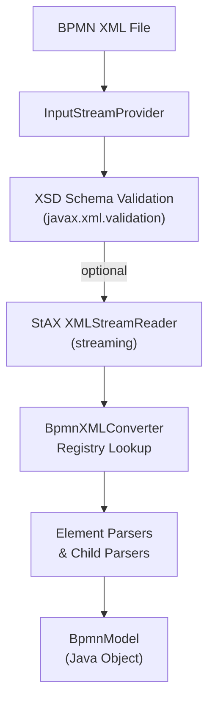
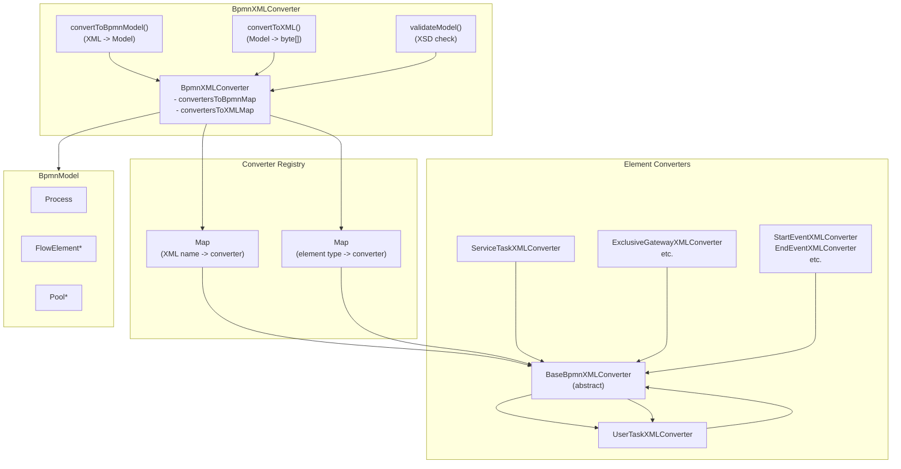

# Activiti BPMN Converter Module - Technical Documentation

**Module:** `activiti-core/activiti-bpmn-converter`

---

## Table of Contents

- [Overview](#overview)
- [Architecture](#architecture)
- [Converter Registry](#converter-registry)
- [XML Import](#xml-import)
- [XML Export](#xml-export)
- [Schema Validation](#schema-validation)
- [Child Element Parsers](#child-element-parsers)
- [Error Handling](#error-handling)
- [Extension Elements](#extension-elements)
- [Usage Examples](#usage-examples)
- [API Reference](#api-reference)

---

## Overview

The **activiti-bpmn-converter** module handles the conversion between BPMN XML files and the in-memory Java model. It provides parsing, serialization, and XML schema validation capabilities for BPMN 2.0 diagrams.

### Key Features

- **XML Parsing**: Convert BPMN XML to `BpmnModel` via StAX streaming
- **Model Export**: Serialize `BpmnModel` to BPMN XML as `byte[]`
- **XSD Validation**: Validate BPMN XML against BPMN 2.0 XSD schema
- **Extension Support**: Custom Activiti-specific elements and attributes
- **Converter Registry**: Plugin architecture with one converter per BPMN element type
- **Namespace Handling**: BPMN 2.0 and Activiti extension namespaces

### Module Structure

```
activiti-bpmn-converter/
src/main/java/org/activiti/bpmn/
├── converter/
│   ├── BpmnXMLConverter.java          # Main converter + registry
│   ├── BaseBpmnXMLConverter.java       # Abstract base for element converters
│   ├── UserTaskXMLConverter.java      # <userTask> converter
│   ├── ServiceTaskXMLConverter.java   # <serviceTask> converter
│   ├── StartEventXMLConverter.java    # <startEvent> converter
│   ├── EndEventXMLConverter.java      # <endEvent> converter
│   ├── ... (one per BPMN element)     # All element converters
│   ├── child/                          # Child element parsers
│   │   ├── BaseChildElementParser.java
│   │   ├── ElementParser.java          # Generic element parser interface
│   │   ├── MultiInstanceParser.java
│   │   ├── DocumentationParser.java
│   │   └── ... (more parsers)
│   ├── export/                         # Export helpers
│   │   ├── DefinitionsRootExport.java
│   │   ├── ProcessExport.java
│   │   ├── BPMNDIExport.java
│   │   ├── MultiInstanceExport.java
│   │   ├── ActivitiListenerExport.java
│   │   └── ... (more exporters)
│   ├── parser/                         # Top-level XML parsers
│   │   ├── DefinitionsParser.java
│   │   ├── ProcessParser.java
│   │   ├── ExtensionElementsParser.java
│   │   └── ... (more parsers)
│   ├── util/
│   │   ├── BpmnXMLUtil.java
│   │   ├── CommaSplitter.java
│   │   └── InputStreamProvider.java
│   ├── DelegatingXMLStreamWriter.java
│   ├── IndentingXMLStreamWriter.java
│   └── XMLStreamReaderUtil.java
└── exceptions/
    └── XMLException.java                  # Converter exception
```

---

## Architecture

### Conversion Flow



### Component Diagram



### Design Pattern: Registry of Converters

The architecture uses a **registry pattern**. `BpmnXMLConverter` maintains two static maps:

- `convertersToBpmnMap`: Maps XML element names (e.g., `"userTask"`) to `BaseBpmnXMLConverter` instances for XML -> Model conversion.
- `convertersToXMLMap`: Maps Java element types (e.g., `UserTask.class`) to `BaseBpmnXMLConverter` instances for Model -> XML conversion.

Each BPMN element type has its own converter subclass that extends `BaseBpmnXMLConverter`. Converters are registered in a static initializer block.

---

## Converter Registry

### BpmnXMLConverter

`BpmnXMLConverter` is the central class responsible for:
- Maintaining the registry of element-specific converters
- Coordinating XML-to-model and model-to-XML conversion
- Performing XSD schema validation

```java
public class BpmnXMLConverter implements BpmnXMLConstants {

  // Registry: XML element name -> converter (for parsing)
  protected static Map<String, BaseBpmnXMLConverter> convertersToBpmnMap = new HashMap<>();

  // Registry: Java element type -> converter (for export)
  protected static Map<Class<? extends BaseElement>, BaseBpmnXMLConverter> convertersToXMLMap = new HashMap<>();

  protected ClassLoader classloader;
  protected List<String> userTaskFormTypes;
  protected List<String> startEventFormTypes;

  // Child element parsers used during conversion
  protected DefinitionsParser definitionsParser;
  protected ProcessParser processParser;
  protected ExtensionElementsParser extensionElementsParser;
  // ... more parsers

  static {
    // Each converter is registered for its XML element name
    addConverter(new UserTaskXMLConverter());
    addConverter(new ServiceTaskXMLConverter());
    addConverter(new StartEventXMLConverter());
    addConverter(new EndEventXMLConverter());
    addConverter(new ExclusiveGatewayXMLConverter());
    addConverter(new ParallelGatewayXMLConverter());
    addConverter(new SequenceFlowXMLConverter());
    // ... all other converters
  }

  public static void addConverter(BaseBpmnXMLConverter converter) {
    addConverter(converter, converter.getBpmnElementType());
  }

  public static void addConverter(BaseBpmnXMLConverter converter, Class<? extends BaseElement> elementType) {
    convertersToBpmnMap.put(converter.getXMLElementName(), converter);
    convertersToXMLMap.put(elementType, converter);
  }
}
```

### BaseBpmnXMLConverter

Abstract base class that every element converter extends. Defines the contract for bidirectional conversion:

```java
public abstract class BaseBpmnXMLConverter implements BpmnXMLConstants {

  // Convert XML element to a BaseElement, attach to process/subprocess
  public void convertToBpmnModel(XMLStreamReader xtr, BpmnModel model,
      Process activeProcess, List<SubProcess> activeSubProcessList) throws Exception {
    String elementId = xtr.getAttributeValue(null, ATTRIBUTE_ID);
    String elementName = xtr.getAttributeValue(null, ATTRIBUTE_NAME);
    boolean async = parseAsync(xtr);
    boolean notExclusive = parseNotExclusive(xtr);

    BaseElement parsedElement = convertXMLToElement(xtr, model);

    if (parsedElement instanceof FlowElement) {
      FlowElement currentFlowElement = (FlowElement) parsedElement;
      currentFlowElement.setId(elementId);
      currentFlowElement.setName(elementName);

      if (currentFlowElement instanceof FlowNode) {
        FlowNode flowNode = (FlowNode) currentFlowElement;
        flowNode.setAsynchronous(async);
        flowNode.setNotExclusive(notExclusive);
        // ... additional type-specific handling
      }

      if (!activeSubProcessList.isEmpty()) {
        activeSubProcessList.get(activeSubProcessList.size() - 1).addFlowElement(currentFlowElement);
      } else {
        activeProcess.addFlowElement(currentFlowElement);
      }
    }
  }

  // Convert a BaseElement to XML
  public void convertToXML(XMLStreamWriter xtw, BaseElement baseElement, BpmnModel model) throws Exception {
    xtw.writeStartElement(BPMN2_PREFIX, getXMLElementName(), BPMN2_NAMESPACE);
    writeDefaultAttribute(ATTRIBUTE_ID, baseElement.getId(), xtw);
    // ... write attributes, child elements, extensions
    writeAdditionalAttributes(baseElement, model, xtw);
    writeAdditionalChildElements(baseElement, model, xtw);
    xtw.writeEndElement();
  }

  // Abstract methods each subclass implements
  protected abstract Class<? extends BaseElement> getBpmnElementType();
  protected abstract BaseElement convertXMLToElement(XMLStreamReader xtr, BpmnModel model) throws Exception;
  protected abstract String getXMLElementName();
  protected abstract void writeAdditionalAttributes(BaseElement element, BpmnModel model, XMLStreamWriter xtw) throws Exception;
  protected abstract void writeAdditionalChildElements(BaseElement element, BpmnModel model, XMLStreamWriter xtw) throws Exception;
}
```

### Element-Specific Converter Example: UserTaskXMLConverter

```java
public class UserTaskXMLConverter extends BaseBpmnXMLConverter {

  protected Map<String, BaseChildElementParser> childParserMap = new HashMap<>();

  public UserTaskXMLConverter() {
    childParserMap.put(new HumanPerformerParser().getElementName(), new HumanPerformerParser());
    childParserMap.put(new PotentialOwnerParser().getElementName(), new PotentialOwnerParser());
    childParserMap.put(new CustomIdentityLinkParser().getElementName(), new CustomIdentityLinkParser());
  }

  @Override
  public Class<? extends BaseElement> getBpmnElementType() {
    return UserTask.class;
  }

  @Override
  protected String getXMLElementName() {
    return ELEMENT_TASK_USER;
  }

  @Override
  protected BaseElement convertXMLToElement(XMLStreamReader xtr, BpmnModel model) throws Exception {
    UserTask userTask = new UserTask();
    BpmnXMLUtil.addXMLLocation(userTask, xtr);

    userTask.setAssignee(xtr.getAttributeValue(ACTIVITI_EXTENSIONS_NAMESPACE, ATTRIBUTE_TASK_USER_ASSIGNEE));
    userTask.setOwner(xtr.getAttributeValue(ACTIVITI_EXTENSIONS_NAMESPACE, ATTRIBUTE_TASK_USER_OWNER));
    userTask.setFormKey(xtr.getAttributeValue(ACTIVITI_EXTENSIONS_NAMESPACE, ATTRIBUTE_FORM_FORMKEY));
    // ... parse all attributes

    parseChildElements(getXMLElementName(), userTask, childParserMap, model, xtr);
    return userTask;
  }

  @Override
  protected void writeAdditionalAttributes(BaseElement element, BpmnModel model, XMLStreamWriter xtw) throws Exception {
    UserTask userTask = (UserTask) element;
    writeQualifiedAttribute(ATTRIBUTE_TASK_USER_ASSIGNEE, userTask.getAssignee(), xtw);
    writeQualifiedAttribute(ATTRIBUTE_TASK_USER_OWNER, userTask.getOwner(), xtw);
    // ... write all attributes
  }
}
```

---

## XML Import

### Entry Point: `convertToBpmnModel`

The primary import method accepts an `InputStreamProvider`, optionally validates against XSD, and returns a `BpmnModel`:

```java
public BpmnModel convertToBpmnModel(InputStreamProvider inputStreamProvider,
    boolean validateSchema, boolean enableSafeBpmnXml) {
  return convertToBpmnModel(inputStreamProvider, validateSchema, enableSafeBpmnXml, "UTF-8");
}

public BpmnModel convertToBpmnModel(InputStreamProvider inputStreamProvider,
    boolean validateSchema, boolean enableSafeBpmnXml, String encoding) {
  XMLInputFactory xif = XMLInputFactory.newInstance();
  xif.setProperty(XMLInputFactory.IS_REPLACING_ENTITY_REFERENCES, false);
  xif.setProperty(XMLInputFactory.IS_SUPPORTING_EXTERNAL_ENTITIES, false);
  xif.setProperty(XMLInputFactory.SUPPORT_DTD, false);

  InputStreamReader in = new InputStreamReader(inputStreamProvider.getInputStream(), encoding);
  XMLStreamReader xtr = xif.createXMLStreamReader(in);

  if (validateSchema) {
    validateModel(xtr);
    // Recreate reader after validation consumes the stream
    in = new InputStreamReader(inputStreamProvider.getInputStream(), encoding);
    xtr = xif.createXMLStreamReader(in);
  }

  return convertToBpmnModel(xtr);
}
```

### Core Parsing Loop

`convertToBpmnModel(XMLStreamReader)` iterates over StAX events, dispatching to registered converters and parsers:

```java
public BpmnModel convertToBpmnModel(XMLStreamReader xtr) {
  BpmnModel model = new BpmnModel();
  Process activeProcess = null;
  List<SubProcess> activeSubProcessList = new ArrayList<>();

  while (xtr.hasNext()) {
    xtr.next();

    if (xtr.isEndElement() && isSubProcessEnd(xtr)) {
      activeSubProcessList.remove(activeSubProcessList.size() - 1);
    }

    if (!xtr.isStartElement()) {
      continue;
    }

    if (ELEMENT_DEFINITIONS.equals(xtr.getLocalName())) {
      definitionsParser.parse(xtr, model);
    } else if (ELEMENT_PROCESS.equals(xtr.getLocalName())) {
      Process process = processParser.parse(xtr, model);
      if (process != null) {
        activeProcess = process;
      }
    } else if (convertersToBpmnMap.containsKey(xtr.getLocalName())) {
      if (activeProcess != null) {
        BaseBpmnXMLConverter converter = convertersToBpmnMap.get(xtr.getLocalName());
        converter.convertToBpmnModel(xtr, model, activeProcess, activeSubProcessList);
      }
    }
    // ... more element dispatches
  }

  // Post-processing: wire sequence flows and boundary events
  for (Process process : model.getProcesses()) {
    processFlowElements(process.getFlowElements(), process);
  }

  return model;
}
```

### Post-Processing

After the initial XML pass, `processFlowElements` wires together references:

```java
protected void processFlowElements(Collection<FlowElement> flowElementList, BaseElement parentScope) {
  for (FlowElement flowElement : flowElementList) {
    if (flowElement instanceof SequenceFlow) {
      SequenceFlow sequenceFlow = (SequenceFlow) flowElement;
      FlowNode sourceNode = getFlowNodeFromScope(sequenceFlow.getSourceRef(), parentScope);
      if (sourceNode != null) {
        sourceNode.getOutgoingFlows().add(sequenceFlow);
        sequenceFlow.setSourceFlowElement(sourceNode);
      }
      FlowNode targetNode = getFlowNodeFromScope(sequenceFlow.getTargetRef(), parentScope);
      if (targetNode != null) {
        targetNode.getIncomingFlows().add(sequenceFlow);
        sequenceFlow.setTargetFlowElement(targetNode);
      }
    } else if (flowElement instanceof BoundaryEvent) {
      // Wire boundary event to attached activity
    } else if (flowElement instanceof SubProcess) {
      // Recursively process sub-process flow elements
      processFlowElements(subProcess.getFlowElements(), subProcess);
    }
  }
}
```

---

## XML Export

### Entry Point: `convertToXML`

The export method writes the model to a `ByteArrayOutputStream` using StAX:

```java
public byte[] convertToXML(BpmnModel model) {
  return convertToXML(model, "UTF-8");
}

public byte[] convertToXML(BpmnModel model, String encoding) {
  ByteArrayOutputStream outputStream = new ByteArrayOutputStream();
  XMLOutputFactory xof = XMLOutputFactory.newInstance();
  OutputStreamWriter out = new OutputStreamWriter(outputStream, encoding);
  XMLStreamWriter writer = xof.createXMLStreamWriter(out);
  XMLStreamWriter xtw = new IndentingXMLStreamWriter(writer);

  // Write document root
  DefinitionsRootExport.writeRootElement(model, xtw, encoding);
  CollaborationExport.writePools(model, xtw);
  DataStoreExport.writeDataStores(model, xtw);
  SignalAndMessageDefinitionExport.writeSignalsAndMessages(model, xtw);

  // Write each process
  for (Process process : model.getProcesses()) {
    if (process.getFlowElements().isEmpty() && process.getLanes().isEmpty()) {
      continue;
    }
    ProcessExport.writeProcess(process, xtw);

    for (FlowElement flowElement : process.getFlowElements()) {
      createXML(flowElement, model, xtw);
    }

    for (Artifact artifact : process.getArtifacts()) {
      createXML(artifact, model, xtw);
    }

    xtw.writeEndElement(); // end process
  }

  ErrorExport.writeError(model, xtw);
  BPMNDIExport.writeBPMNDI(model, xtw);

  xtw.writeEndElement(); // end definitions
  xtw.writeEndDocument();
  xtw.flush();

  return outputStream.toByteArray();
}
```

### Element Dispatch During Export

Non-subprocess elements are dispatched through `convertersToXMLMap`:

```java
protected void createXML(FlowElement flowElement, BpmnModel model, XMLStreamWriter xtw) throws Exception {
  if (flowElement instanceof SubProcess) {
    // Subprocesses are written inline by BpmnXMLConverter itself
    // (handles transaction, adhoc, event subprocess variants)
  } else {
    BaseBpmnXMLConverter converter = convertersToXMLMap.get(flowElement.getClass());
    if (converter == null) {
      throw new XMLException("No converter for " + flowElement.getClass() + " found");
    }
    converter.convertToXML(xtw, flowElement, model);
  }
}
```

---

## Schema Validation

### XSD Validation in BpmnXMLConverter

The converter includes XML schema validation against `BPMN20.xsd`:

```java
public void validateModel(InputStreamProvider inputStreamProvider) throws Exception {
  Schema schema = createSchema();
  Validator validator = schema.newValidator();
  validator.validate(new StreamSource(inputStreamProvider.getInputStream()));
}

public void validateModel(XMLStreamReader xmlStreamReader) throws Exception {
  Schema schema = createSchema();
  Validator validator = schema.newValidator();
  validator.validate(new StAXSource(xmlStreamReader));
}

protected Schema createSchema() throws SAXException {
  SchemaFactory factory = SchemaFactory.newInstance(XMLConstants.W3C_XML_SCHEMA_NS_URI);
  URL xsdUrl = classloader.getResource("org/activiti/impl/bpmn/parser/BPMN20.xsd");
  if (xsdUrl == null) {
    xsdUrl = BpmnXMLConverter.class.getClassLoader().getResource("org/activiti/impl/bpmn/parser/BPMN20.xsd");
  }
  if (xsdUrl == null) {
    throw new XMLException("BPMN XSD could not be found");
  }
  return factory.newSchema(new StreamSource(xsdUrl.toURI().toASCIIString()));
}
```

### Semantic Validation: `activiti-process-validation` Module

Semantic validation of the `BpmnModel` (e.g., checking that sequence flows reference valid source/target elements, that service tasks have implementations, etc.) is handled by the separate **activiti-process-validation** module:

```java
// In activiti-process-validation module
public interface ProcessValidator {
  List<ValidationError> validate(BpmnModel bpmnModel);
  List<ValidatorSet> getValidatorSets();
}

public class ProcessValidatorImpl implements ProcessValidator {
  private List<ValidatorSet> validatorSets;

  @Override
  public List<ValidationError> validate(BpmnModel bpmnModel) {
    List<ValidationError> errors = new ArrayList<>();
    for (ValidatorSet validatorSet : validatorSets) {
      for (Validator validator : validatorSet.getValidators()) {
        errors.addAll(validator.validate(bpmnModel, validatorSet));
      }
    }
    return errors;
  }
}
```

Key validators include `UserTaskValidator`, `ServiceTaskValidator`, `SequenceflowValidator`, `StartEventValidator`, `ExclusiveGatewayValidator`, and many more. Validation problems are defined as string constants in `Problems` (e.g., `SEQ_FLOW_INVALID_SRC`, `SERVICE_TASK_MISSING_IMPLEMENTATION`).

---

## Child Element Parsers

### BaseChildElementParser

Each element converter defines child element parsers that extend `BaseChildElementParser`:

```java
public abstract class BaseChildElementParser implements BpmnXMLConstants {

  public abstract String getElementName();

  public abstract void parseChildElement(XMLStreamReader xtr, BaseElement parentElement, BpmnModel model) throws Exception;

  protected void parseChildElements(XMLStreamReader xtr, BaseElement parentElement,
      BpmnModel model, BaseChildElementParser parser) throws Exception {
    boolean readyWithChildElements = false;
    while (!readyWithChildElements && xtr.hasNext()) {
      xtr.next();
      if (xtr.isStartElement()) {
        if (parser.getElementName().equals(xtr.getLocalName())) {
          parser.parseChildElement(xtr, parentElement, model);
        }
      } else if (xtr.isEndElement() && getElementName().equalsIgnoreCase(xtr.getLocalName())) {
        readyWithChildElements = true;
      }
    }
  }
}
```

Child parsers are registered per-element. For example, `UserTaskXMLConverter` registers `HumanPerformerParser`, `PotentialOwnerParser`, and `CustomIdentityLinkParser`. `BaseBpmnXMLConverter.parseChildElements()` dispatches by element name through a `Map<String, BaseChildElementParser>`.

### ElementParser Interface

A generic parser interface used by `BpmnXMLUtil.parseChildElements()`:

```java
public interface ElementParser<T> {
  boolean canParseCurrentElement(XMLStreamReader reader);
  void setInformation(XMLStreamReader reader, T informationContainer) throws XMLStreamException;
}
```

`BpmnXMLConverter` maintains a `List<ElementParser>` for top-level parsing coordination through `BpmnXMLUtil`.

---

## Error Handling

### XMLException

The converter module uses `org.activiti.bpmn.exceptions.XMLException` for all conversion errors:

```java
package org.activiti.bpmn.exceptions;

public class XMLException extends RuntimeException {

  public XMLException(String message) {
    super(message);
  }

  public XMLException(String message, Throwable t) {
    super(message, t);
  }
}
```

`XMLException` is thrown for:
- Missing BPMN XSD schema
- Malformed XML during reading
- Missing converters for element types
- Export failures

```java
// Thrown during import if XML is malformed
throw new XMLException("Error while reading the BPMN 2.0 XML", e);

// Thrown during export if no converter found
throw new XMLException("No converter for " + flowElement.getClass() + " found");

// Thrown during export on writer failure
throw new XMLException("Error writing BPMN XML", e);
```

### ValidationError

Semantic validation errors from `activiti-process-validation` are reported as `ValidationError` objects:

```java
package org.activiti.validation;

public class ValidationError {
  protected String validatorSetName;
  protected String problem;                    // e.g., Problems.SEQ_FLOW_INVALID_SRC
  protected String defaultDescription;
  protected String processDefinitionId;
  protected String processDefinitionName;
  protected int xmlLineNumber;
  protected int xmlColumnNumber;
  protected String activityId;
  protected String activityName;
  protected boolean isWarning;
  protected String key;
  protected Map<String, String> params;
  // ... getters and setters
}
```

---

## Extension Elements

### Parsing Extensions

`BaseBpmnXMLConverter.parseExtensionElement()` recursively parses custom extension elements:

```java
protected ExtensionElement parseExtensionElement(XMLStreamReader xtr) throws Exception {
  ExtensionElement extensionElement = new ExtensionElement();
  extensionElement.setName(xtr.getLocalName());
  extensionElement.setNamespace(xtr.getNamespaceURI());
  extensionElement.setNamespacePrefix(xtr.getPrefix());

  BpmnXMLUtil.addCustomAttributes(xtr, extensionElement, defaultElementAttributes);

  while (xtr.hasNext()) {
    xtr.next();
    if (xtr.isCharacters() || xtr.getEventType() == XMLStreamReader.CDATA) {
      extensionElement.setElementText(xtr.getText().trim());
    } else if (xtr.isStartElement()) {
      extensionElement.addChildElement(parseExtensionElement(xtr));
    } else if (xtr.isEndElement() && extensionElement.getName().equalsIgnoreCase(xtr.getLocalName())) {
      break;
    }
  }
  return extensionElement;
}
```

### ExtensionElement Model

```java
// In org.activiti.bpmn.model.ExtensionElement
public class ExtensionElement extends BaseElement {
  protected String namespace;
  protected String namespacePrefix;
  protected String elementText;
  protected List<ExtensionAttribute> attributes = new ArrayList<>();
  protected List<ExtensionElement> childElements = new ArrayList<>();

  public void addChildElement(ExtensionElement childElement) {
    childElements.add(childElement);
  }
}
```

### Writing Extensions

`BpmnXMLUtil.writeExtensionElements()` serializes extension elements attached to any `BaseElement`:

```java
// In BaseBpmnXMLConverter.convertToXML():
didWriteExtensionStartElement = BpmnXMLUtil.writeExtensionElements(
    baseElement, didWriteExtensionStartElement, model.getNamespaces(), xtw);
```

---

## Usage Examples

### Basic Import

```java
BpmnXMLConverter converter = new BpmnXMLConverter();

// Wrap input stream in InputStreamProvider
InputStreamProvider provider = new InputStreamProvider() {
  private final InputStream stream;
  provider(InputStream s) { this.stream = s; }
  @Override public InputStream getInputStream() { return stream; }
};

// Convert with schema validation
BpmnModel model = converter.convertToBpmnModel(provider, true, false);

// Or convert without validation
BpmnModel model = converter.convertToBpmnModel(provider, false, false);
```

### Basic Export

```java
BpmnXMLConverter converter = new BpmnXMLConverter();

BpmnModel model = ...; // obtain model

byte[] xml = converter.convertToXML(model);

// Write to file
Files.write(Paths.get("output.bpmn"), xml);
```

### Semantic Validation

```java
import org.activiti.validation.ProcessValidator;
import org.activiti.validation.ProcessValidatorFactory;
import org.activiti.validation.ValidationError;

BpmnXMLConverter converter = new BpmnXMLConverter();
BpmnModel model = converter.convertToBpmnModel(inputStreamProvider, false, false);

// Semantic validation is a separate step via ProcessValidator
ProcessValidator validator = ProcessValidatorFactory.createProcessValidator();
List<ValidationError> errors = validator.validate(model);

if (!errors.isEmpty()) {
  for (ValidationError error : errors) {
    System.err.println(error.getDefaultDescription());
  }
}
```

### Adding Custom Converter

```java
public class CustomTaskXMLConverter extends BaseBpmnXMLConverter {

  @Override
  public Class<? extends BaseElement> getBpmnElementType() {
    return CustomTask.class;
  }

  @Override
  protected String getXMLElementName() {
    return "customTask";
  }

  @Override
  protected BaseElement convertXMLToElement(XMLStreamReader xtr, BpmnModel model) throws Exception {
    CustomTask task = new CustomTask();
    // parse custom attributes
    return task;
  }

  @Override
  protected void writeAdditionalAttributes(BaseElement element, BpmnModel model, XMLStreamWriter xtw) throws Exception {
    // write custom attributes
  }

  @Override
  protected void writeAdditionalChildElements(BaseElement element, BpmnModel model, XMLStreamWriter xtw) throws Exception {
    // write custom child elements
  }
}

// Register the converter
BpmnXMLConverter.addConverter(new CustomTaskXMLConverter());
```

### Safe XML Parsing

```java
BpmnXMLConverter converter = new BpmnXMLConverter();

// enableSafeBpmnXml=true uses StAXSource for validation instead of StreamSource,
// which avoids re-reading the input stream
BpmnModel model = converter.convertToBpmnModel(inputStreamProvider, true, true);
```

---

## API Reference

### Key Classes

| Class | Package | Description |
|-------|---------|-------------|
| `BpmnXMLConverter` | `org.activiti.bpmn.converter` | Main converter; maintains registry, orchestrates import/export |
| `BaseBpmnXMLConverter` | `org.activiti.bpmn.converter` | Abstract base for all element converters |
| `BaseChildElementParser` | `org.activiti.bpmn.converter.child` | Abstract base for child element parsers |
| `ElementParser` | `org.activiti.bpmn.converter.child` | Generic interface for element parsing |
| `BpmnXMLUtil` | `org.activiti.bpmn.converter.util` | Utility methods for attribute parsing/writing |
| `IndentingXMLStreamWriter` | `org.activiti.bpmn.converter` | Decorator for pretty-printed XML output |
| `XMLException` | `org.activiti.bpmn.exceptions` | Runtime exception for conversion errors |

### Process Validation (separate module)

| Class | Package | Description |
|-------|---------|-------------|
| `ProcessValidator` | `org.activiti.validation` | Interface for semantic validation |
| `ProcessValidatorImpl` | `org.activiti.validation` | Default validator implementation |
| `ValidationError` | `org.activiti.validation` | Single validation error with context |
| `ValidatorSet` | `org.activiti.validation.validator` | Group of validators |
| `Problems` | `org.activiti.validation.validator` | Problem ID constants |

### Key Methods

```java
// Import (XML -> Model)
BpmnModel convertToBpmnModel(InputStreamProvider provider, boolean validateSchema, boolean enableSafeBpmnXml)
BpmnModel convertToBpmnModel(XMLStreamReader xtr)

// Export (Model -> XML)
byte[] convertToXML(BpmnModel model)
byte[] convertToXML(BpmnModel model, String encoding)

// XSD Validation
void validateModel(InputStreamProvider inputStreamProvider)
void validateModel(XMLStreamReader xmlStreamReader)

// Converter Registration
static void addConverter(BaseBpmnXMLConverter converter)
static void addConverter(BaseBpmnXMLConverter converter, Class<? extends BaseElement> elementType)

// Semantic Validation (ProcessValidator in activiti-process-validation)
List<ValidationError> validate(BpmnModel bpmnModel)
List<ValidatorSet> getValidatorSets()
```

### Available Element Converters

| Converter | XML Element | Java Type |
|-----------|-------------|-----------|
| `UserTaskXMLConverter` | `userTask` | `UserTask` |
| `ServiceTaskXMLConverter` | `serviceTask` | `ServiceTask` |
| `ScriptTaskXMLConverter` | `scriptTask` | `ScriptTask` |
| `SendTaskXMLConverter` | `sendTask` | `SendTask` |
| `ReceiveTaskXMLConverter` | `receiveTask` | `ReceiveTask` |
| `ManualTaskXMLConverter` | `manualTask` | `ManualTask` |
| `BusinessRuleTaskXMLConverter` | `businessRuleTask` | `BusinessRuleTask` |
| `TaskXMLConverter` | `task` | `Task` |
| `CallActivityXMLConverter` | `callActivity` | `CallActivity` |
| `StartEventXMLConverter` | `startEvent` | `StartEvent` |
| `EndEventXMLConverter` | `endEvent` | `EndEvent` |
| `BoundaryEventXMLConverter` | `boundaryEvent` | `BoundaryEvent` |
| `CatchEventXMLConverter` | intermediate catch events | `IntermediateCatchEvent` |
| `ThrowEventXMLConverter` | intermediate throw events | `IntermediateThrowEvent` |
| `ExclusiveGatewayXMLConverter` | `exclusiveGateway` | `ExclusiveGateway` |
| `ParallelGatewayXMLConverter` | `parallelGateway` | `ParallelGateway` |
| `InclusiveGatewayXMLConverter` | `inclusiveGateway` | `InclusiveGateway` |
| `ComplexGatewayXMLConverter` | `complexGateway` | `ComplexGateway` |
| `EventGatewayXMLConverter` | `eventBasedGateway` | `EventBasedGateway` |
| `SequenceFlowXMLConverter` | `sequenceFlow` | `SequenceFlow` |
| `TextAnnotationXMLConverter` | `textAnnotation` | `TextAnnotation` |
| `AssociationXMLConverter` | `association` | `Association` |
| `SubprocessXMLConverter` | `subProcess` | `SubProcess` |
| `DataStoreReferenceXMLConverter` | `dataStoreReference` | `DataStoreReference` |
| `ValuedDataObjectXMLConverter` | `dataObject` | `StringDataObject`, `BooleanDataObject`, etc. |
| `LinkEventDefinitionXMLConverter` | link event definitions | `LinkEventDefinition` |
| `AlfrescoStartEventXMLConverter` | `startEvent` (alfresco) | `AlfrescoStartEvent` |
| `AlfrescoUserTaskXMLConverter` | `userTask` (alfresco) | `AlfrescoUserTask` |

---

## See Also

- [Parent Module Documentation](../overview.md)
- [BPMN Model](./bpmn-model.md)
- [Process Validation](./process-validation.md)
- [Engine Documentation](./README.md)
