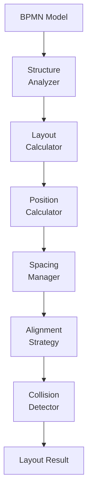
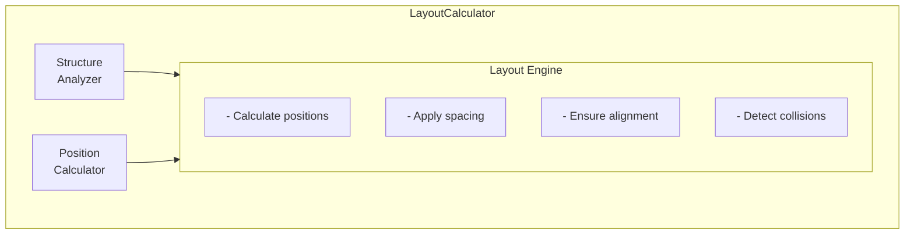

# Activiti BPMN Layout Module - Technical Documentation

**Module:** `activiti-core/activiti-bpmn-layout`

---

## Table of Contents

- [Overview](#overview)
- [Architecture](#architecture)
- [Layout Algorithms](#layout-algorithms)
- [Position Calculation](#position-calculation)
- [Diagram Optimization](#diagram-optimization)
- [Integration Points](#integration-points)
- [Performance Considerations](#performance-considerations)
- [Usage Examples](#usage-examples)
- [Customization](#customization)
- [Best Practices](#best-practices)
- [API Reference](#api-reference)

---

## Overview

The **activiti-bpmn-layout** module provides algorithms and utilities for calculating optimal positions and layouts for BPMN diagram elements. It ensures that process diagrams are rendered clearly and efficiently, with proper spacing and alignment.

### Key Features

- **Automatic Layout**: Calculate optimal element positions
- **Spacing Management**: Ensure proper distances between elements
- **Alignment**: Align elements for visual clarity
- **Collision Detection**: Prevent overlapping elements
- **Hierarchical Layout**: Handle sub-processes and nested structures
- **Performance Optimized**: Efficient algorithms for large diagrams

### Module Structure

```
activiti-bpmn-layout/
├── src/main/java/org/activiti/bpmn/layout/
│   ├── LayoutCalculator.java          # Main layout engine
│   ├── PositionCalculator.java        # Position algorithms
│   ├── SpacingManager.java            # Spacing calculations
│   ├── AlignmentStrategy.java         # Alignment logic
│   ├── CollisionDetector.java         # Overlap prevention
│   └── HierarchicalLayout.java        # Nested structure layout
└── src/test/java/
```

---

## Architecture

### Layout Pipeline



### Component Diagram



---

## Layout Algorithms

### Hierarchical Layout Algorithm

```java
public class HierarchicalLayoutAlgorithm {
    
    public LayoutResult calculateLayout(BpmnModel model) {
        // 1. Analyze structure
        StructureAnalysis analysis = analyzeStructure(model);
        
        // 2. Create hierarchy
        LayoutHierarchy hierarchy = buildHierarchy(analysis);
        
        // 3. Calculate levels
        List<LayoutLevel> levels = calculateLevels(hierarchy);
        
        // 4. Assign positions
        assignPositions(levels);
        
        // 5. Optimize layout
        optimizeLayout(levels);
        
        return new LayoutResult(levels, hierarchy);
    }
    
    private StructureAnalysis analyzeStructure(BpmnModel model) {
        StructureAnalysis analysis = new StructureAnalysis();
        
        for (Process process : model.getProcesses()) {
            analyzeProcess(process, analysis);
        }
        
        return analysis;
    }
    
    private void analyzeProcess(Process process, StructureAnalysis analysis) {
        // Identify start events
        List<StartEvent> startEvents = process.getFlowElements().stream()
            .filter(e -> e instanceof StartEvent)
            .map(e -> (StartEvent) e)
            .collect(Collectors.toList());
        
        // Build dependency graph
        DependencyGraph graph = new DependencyGraph();
        for (FlowElement element : process.getFlowElements()) {
            buildDependencies(element, graph);
        }
        
        analysis.setStartEvents(startEvents);
        analysis.setDependencyGraph(graph);
    }
}
```

### Force-Directed Layout

```java
public class ForceDirectedLayoutAlgorithm {
    
    private static final double SPRING_LENGTH = 100.0;
    private static final double REPULSION_STRENGTH = 5000.0;
    private static final double ATTRACTION_STRENGTH = 0.01;
    private static final int MAX_ITERATIONS = 500;
    
    public LayoutResult calculateLayout(List<FlowElement> elements) {
        // Initialize positions randomly
        initializePositions(elements);
        
        // Iteratively improve layout
        for (int iteration = 0; iteration < MAX_ITERATIONS; iteration++) {
            applyRepulsionForces(elements);
            applyAttractionForces(elements);
            applyCenterForce(elements);
            updatePositions(elements);
            
            // Check convergence
            if (isConverged(elements)) {
                break;
            }
        }
        
        return new LayoutResult(elements);
    }
    
    private void applyRepulsionForce(List<FlowElement> elements) {
        for (int i = 0; i < elements.size(); i++) {
            for (int j = i + 1; j < elements.size(); j++) {
                FlowElement e1 = elements.get(i);
                FlowElement e2 = elements.get(j);
                
                double distance = calculateDistance(e1, e2);
                double force = REPULSION_STRENGTH / (distance * distance);
                
                applyForce(e1, e2, force, true);
                applyForce(e2, e1, force, true);
            }
        }
    }
    
    private void applyAttractionForces(List<FlowElement> elements) {
        for (FlowElement element : elements) {
            if (element instanceof Activity) {
                Activity activity = (Activity) element;
                
                for (SequenceFlow flow : activity.getOutgoing()) {
                    FlowElement target = flow.getTargetRef();
                    
                    double distance = calculateDistance(activity, target);
                    double force = ATTRACTION_STRENGTH * (distance - SPRING_LENGTH);
                    
                    applyForce(activity, target, force, false);
                    applyForce(target, activity, force, false);
                }
            }
        }
    }
}
```

### Grid-Based Layout

```java
public class GridBasedLayoutAlgorithm {
    
    private static final int GRID_SIZE = 50;
    
    public LayoutResult calculateLayout(BpmnModel model) {
        GridLayout grid = new GridLayout();
        
        // Place elements on grid
        for (Process process : model.getProcesses()) {
            int currentX = 0;
            int currentY = 0;
            
            for (FlowElement element : process.getFlowElements()) {
                GridPosition position = findNextPosition(grid, currentX, currentY);
                
                grid.placeElement(element, position);
                
                // Update current position
                currentX = position.getX() + 1;
                if (currentX >= grid.getWidth()) {
                    currentX = 0;
                    currentY++;
                }
            }
        }
        
        return convertToLayoutResult(grid);
    }
    
    private GridPosition findNextPosition(GridLayout grid, int startX, int startY) {
        for (int y = startY; y < grid.getHeight(); y++) {
            for (int x = startX; x < grid.getWidth(); x++) {
                if (grid.isEmpty(x, y)) {
                    return new GridPosition(x * GRID_SIZE, y * GRID_SIZE);
                }
            }
            startX = 0;
        }
        
        throw new IllegalStateException("No available grid position");
    }
}
```

---

## Position Calculation

### Position Calculator

```java
public class PositionCalculator {
    
    public Point calculatePosition(FlowElement element, 
                                   List<FlowElement> siblings,
                                   LayoutContext context) {
        
        // Get element dimensions
        Dimension dimensions = getElementDimensions(element);
        
        // Calculate base position
        Point basePosition = calculateBasePosition(element, context);
        
        // Apply offset for siblings
        Point offset = calculateSiblingOffset(element, siblings, dimensions);
        
        // Final position
        return new Point(
            basePosition.getX() + offset.getX(),
            basePosition.getY() + offset.getY()
        );
    }
    
    private Dimension getElementDimensions(FlowElement element) {
        if (element instanceof Activity) {
            return new Dimension(120, 60);
        } else if (element instanceof Gateway) {
            return new Dimension(50, 50);
        } else if (element instanceof BPMNEvent) {
            return new Dimension(36, 36);
        }
        
        return new Dimension(80, 40);
    }
    
    private Point calculateBasePosition(FlowElement element, 
                                        LayoutContext context) {
        // Use element's existing position if available
        if (context.hasExistingPosition(element)) {
            return context.getExistingPosition(element);
        }
        
        // Calculate based on flow
        return calculateFromFlow(element, context);
    }
    
    private Point calculateFromFlow(FlowElement element, LayoutContext context) {
        // Find incoming flows
        List<SequenceFlow> incoming = element.getIncoming();
        
        if (incoming.isEmpty()) {
            // Start element
            return new Point(50, 50);
        }
        
        // Calculate average of source positions
        double avgX = 0;
        double avgY = 0;
        
        for (SequenceFlow flow : incoming) {
            Point sourcePos = context.getPosition(flow.getSourceRef());
            avgX += sourcePos.getX();
            avgY += sourcePos.getY();
        }
        
        avgX /= incoming.size();
        avgY /= incoming.size();
        
        return new Point((int) avgX, (int) avgY);
    }
}
```

---

## Diagram Optimization

### Spacing Manager

```java
public class SpacingManager {
    
    private static final int MIN_HORIZONTAL_SPACING = 100;
    private static final int MIN_VERTICAL_SPACING = 80;
    
    public void optimizeSpacing(List<LayoutElement> elements) {
        // Check horizontal spacing
        for (int i = 0; i < elements.size(); i++) {
            for (int j = i + 1; j < elements.size(); j++) {
                LayoutElement e1 = elements.get(i);
                LayoutElement e2 = elements.get(j);
                
                if (areOnSameRow(e1, e2)) {
                    ensureHorizontalSpacing(e1, e2);
                }
                
                if (areOnSameColumn(e1, e2)) {
                    ensureVerticalSpacing(e1, e2);
                }
            }
        }
    }
    
    private void ensureHorizontalSpacing(LayoutElement e1, LayoutElement e2) {
        int currentSpacing = Math.abs(e2.getX() - e1.getX()) 
                           - (e1.getWidth() + e2.getWidth()) / 2;
        
        if (currentSpacing < MIN_HORIZONTAL_SPACING) {
            int neededSpacing = MIN_HORIZONTAL_SPACING - currentSpacing;
            e2.setX(e2.getX() + neededSpacing);
        }
    }
    
    private void ensureVerticalSpacing(LayoutElement e1, LayoutElement e2) {
        int currentSpacing = Math.abs(e2.getY() - e1.getY()) 
                           - (e1.getHeight() + e2.getHeight()) / 2;
        
        if (currentSpacing < MIN_VERTICAL_SPACING) {
            int neededSpacing = MIN_VERTICAL_SPACING - currentSpacing;
            e2.setY(e2.getY() + neededSpacing);
        }
    }
    
    private boolean areOnSameRow(LayoutElement e1, LayoutElement e2) {
        return Math.abs(e1.getY() - e2.getY()) < 20;
    }
    
    private boolean areOnSameColumn(LayoutElement e1, LayoutElement e2) {
        return Math.abs(e1.getX() - e2.getX()) < 20;
    }
}
```

### Alignment Strategy

```java
public class AlignmentStrategy {
    
    public void alignElements(List<LayoutElement> elements, 
                              AlignmentType alignment) {
        switch (alignment) {
            case LEFT:
                alignLeft(elements);
                break;
            case RIGHT:
                alignRight(elements);
                break;
            case CENTER:
                alignCenter(elements);
                break;
            case TOP:
                alignTop(elements);
                break;
            case BOTTOM:
                alignBottom(elements);
                break;
            case MIDDLE:
                alignMiddle(elements);
                break;
        }
    }
    
    private void alignLeft(List<LayoutElement> elements) {
        int minX = elements.stream()
            .mapToInt(e -> e.getX())
            .min()
            .orElse(0);
        
        for (LayoutElement element : elements) {
            element.setX(minX);
        }
    }
    
    private void alignCenter(List<LayoutElement> elements) {
        int totalWidth = elements.stream()
            .mapToInt(e -> e.getWidth())
            .sum();
        
        int centerX = totalWidth / 2;
        int offset = 0;
        
        for (LayoutElement element : elements) {
            element.setX(centerX - element.getWidth() / 2 + offset);
            offset += element.getWidth();
        }
    }
    
    private void alignTop(List<LayoutElement> elements) {
        int minY = elements.stream()
            .mapToInt(e -> e.getY())
            .min()
            .orElse(0);
        
        for (LayoutElement element : elements) {
            element.setY(minY);
        }
    }
}
```

---

## Integration Points

### With BPMN Model

```java
public class LayoutModelIntegration {
    
    public void applyLayout(BpmnModel model, LayoutResult layout) {
        for (LayoutElement element : layout.getElements()) {
            FlowElement flowElement = model.getElementById(element.getId());
            
            if (flowElement != null) {
                // Apply position
                flowElement.setX(element.getX());
                flowElement.setY(element.getY());
                
                // Apply dimensions
                flowElement.setWidth(element.getWidth());
                flowElement.setHeight(element.getHeight());
            }
        }
    }
    
    public BpmnModel extractModel(LayoutResult layout) {
        BpmnModel model = new BpmnModel();
        
        for (LayoutElement element : layout.getElements()) {
            FlowElement flowElement = createFlowElement(element);
            model.addFlowElement(flowElement);
        }
        
        return model;
    }
}
```

### With Image Generator

```java
public class LayoutImageIntegration {
    
    public BufferedImage generateImage(BpmnModel model, LayoutResult layout) {
        // Calculate canvas size
        int canvasWidth = calculateCanvasWidth(layout);
        int canvasHeight = calculateCanvasHeight(layout);
        
        BufferedImage image = new BufferedImage(
            canvasWidth, canvasHeight, BufferedImage.TYPE_INT_RGB);
        
        Graphics2D graphics = image.createGraphics();
        graphics.setColor(Color.WHITE);
        graphics.fillRect(0, 0, canvasWidth, canvasHeight);
        
        // Draw elements
        for (LayoutElement element : layout.getElements()) {
            drawElement(graphics, element);
        }
        
        // Draw connections
        for (LayoutConnection connection : layout.getConnections()) {
            drawConnection(graphics, connection);
        }
        
        graphics.dispose();
        return image;
    }
}
```

---

## Performance Considerations

### Large Diagram Optimization

```java
public class PerformanceOptimizedLayout {
    
    public LayoutResult calculateLayout(BpmnModel model) {
        int elementCount = countElements(model);
        
        if (elementCount > 1000) {
            // Use simplified algorithm for large diagrams
            return calculateSimplifiedLayout(model);
        } else if (elementCount > 100) {
            // Use standard algorithm
            return calculateStandardLayout(model);
        } else {
            // Use detailed algorithm for small diagrams
            return calculateDetailedLayout(model);
        }
    }
    
    private LayoutResult calculateSimplifiedLayout(BpmnModel model) {
        // Grid-based layout for performance
        return new GridBasedLayoutAlgorithm().calculateLayout(model);
    }
    
    private LayoutResult calculateStandardLayout(BpmnModel model) {
        // Hierarchical layout
        return new HierarchicalLayoutAlgorithm().calculateLayout(model);
    }
    
    private LayoutResult calculateDetailedLayout(BpmnModel model) {
        // Force-directed layout for best results
        return new ForceDirectedLayoutAlgorithm().calculateLayout(model);
    }
}
```

### Caching Strategy

```java
public class CachedLayoutCalculator {
    
    private final Map<String, LayoutResult> cache = new ConcurrentHashMap<>();
    
    public LayoutResult calculateLayout(String modelId, BpmnModel model) {
        return cache.computeIfAbsent(modelId, id -> {
            // Calculate layout
            return doCalculateLayout(model);
        });
    }
    
    public void invalidateCache(String modelId) {
        cache.remove(modelId);
    }
    
    public void clearCache() {
        cache.clear();
    }
}
```

---

## Usage Examples

### Basic Layout Calculation

```java
public class LayoutExample {
    
    public void calculateLayout() throws IOException {
        // Load BPMN model
        BpmnModel model = loadBpmnModel("process.bpmn");
        
        // Create layout calculator
        LayoutCalculator calculator = new LayoutCalculator();
        
        // Calculate layout
        LayoutResult layout = calculator.calculateLayout(model);
        
        // Apply layout to model
        applyLayout(model, layout);
        
        // Save updated model
        saveBpmnModel(model, "process-laidout.bpmn");
    }
}
```

### Custom Layout Algorithm

```java
public class CustomLayoutExample {
    
    public void useCustomLayout() {
        LayoutCalculator calculator = new LayoutCalculator();
        
        // Register custom algorithm
        calculator.registerAlgorithm("custom", new CustomLayoutAlgorithm());
        
        // Use custom algorithm
        LayoutResult layout = calculator.calculateLayout(
            model, "custom");
    }
}
```

---

## Customization

### Custom Layout Algorithm

```java
public class CustomLayoutAlgorithm implements LayoutAlgorithm {
    
    @Override
    public LayoutResult calculateLayout(BpmnModel model) {
        // Custom layout logic
        LayoutResult result = new LayoutResult();
        
        // Implement your algorithm here
        for (Process process : model.getProcesses()) {
            layoutProcess(process, result);
        }
        
        return result;
    }
    
    private void layoutProcess(Process process, LayoutResult result) {
        // Custom process layout
    }
}
```

### Custom Spacing Rules

```java
public class CustomSpacingRules implements SpacingRules {
    
    @Override
    public int getHorizontalSpacing(FlowElement e1, FlowElement e2) {
        // Custom horizontal spacing logic
        if (e1 instanceof UserTask && e2 instanceof UserTask) {
            return 150; // More space between user tasks
        }
        return 100; // Default spacing
    }
    
    @Override
    public int getVerticalSpacing(FlowElement e1, FlowElement e2) {
        // Custom vertical spacing logic
        return 80;
    }
}
```

---

## Best Practices

### 1. Choose Appropriate Algorithm

```java
// For simple linear processes
useHierarchicalLayout();

// For complex branching processes
useForceDirectedLayout();

// For large diagrams (>1000 elements)
useGridBasedLayout();
```

### 2. Optimize for Performance

```java
// Cache layout results
@Cacheable(value = "layouts", key = "#model.id")
public LayoutResult calculateLayout(BpmnModel model) {
    return layoutCalculator.calculateLayout(model);
}
```

### 3. Validate Layout

```java
LayoutResult layout = calculator.calculateLayout(model);
LayoutValidation validation = validator.validate(layout);

if (!validation.isValid()) {
    log.error("Layout validation failed: {}", validation.getErrors());
}
```

### 4. Handle Edge Cases

```java
try {
    LayoutResult layout = calculator.calculateLayout(model);
} catch (LayoutException e) {
    // Fallback to default layout
    LayoutResult defaultLayout = createDefaultLayout(model);
}
```

---

## API Reference

### Key Classes

- `LayoutCalculator` - Main layout engine
- `PositionCalculator` - Position algorithms
- `SpacingManager` - Spacing calculations
- `AlignmentStrategy` - Alignment logic
- `CollisionDetector` - Overlap prevention
- `LayoutResult` - Layout output

### Key Interfaces

- `LayoutAlgorithm` - Layout algorithm contract
- `SpacingRules` - Spacing configuration
- `LayoutElement` - Layout element representation

### Layout Algorithms

- `HierarchicalLayoutAlgorithm` - Tree-based layout
- `ForceDirectedLayoutAlgorithm` - Physics-based layout
- `GridBasedLayoutAlgorithm` - Grid-based layout

---

## See Also

- [Parent Module Documentation](../overview.md)
- [BPMN Model](../engine-api/bpmn-model.md)
- [Image Generator](../engine-api/image-generator.md)
