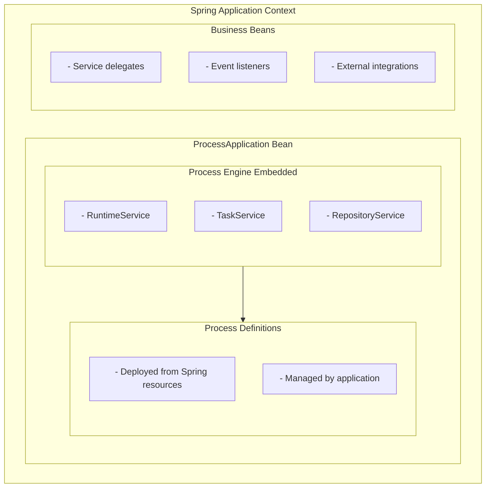
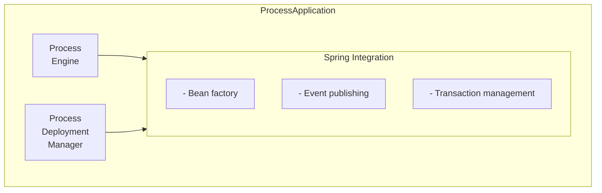

# Activiti Spring App Process Module - Technical Documentation

**Module:** `activiti-core/activiti-spring-app-process`

---

## Table of Contents

- [Overview](#overview)
- [Architecture](#architecture)
- [Process Application Context](#process-application-context)
- [Spring Bean Integration](#spring-bean-integration)
- [Process Deployment](#process-deployment)
- [Multi-Application Support](#multi-application-support)
- [Configuration](#configuration)
- [Usage Examples](#usage-examples)
- [Best Practices](#best-practices)
- [API Reference](#api-reference)

---

## Overview

The **activiti-spring-app-process** module provides support for running Activiti processes within Spring application contexts. It enables process applications to be deployed and managed as Spring beans, with full integration into the Spring lifecycle.

### Key Features

- **Spring Application Context**: Process apps as Spring contexts
- **Bean Integration**: Full Spring bean lifecycle support
- **Process Deployment**: Deploy processes from Spring resources
- **Multi-Application**: Support for multiple process applications
- **Configuration Management**: Spring-based configuration
- **Lifecycle Management**: Proper startup/shutdown

### Module Structure

```
activiti-spring-app-process/
├── src/main/java/org/activiti/spring/app/
│   ├── ProcessApplication.java          # Main application interface
│   ├── ProcessApplicationContext.java    # Spring context for processes
│   ├── ProcessDeploymentManager.java     # Deployment management
│   └── config/
│       ├── ProcessAppConfiguration.java
│       └── ProcessAppAutoConfiguration.java
└── src/test/java/
```

---

## Architecture

### Process Application Architecture



### Component Diagram



---

## Process Application Context

### ProcessApplication Interface

```java
public interface ProcessApplication {
    
    /**
     * Get the application ID
     */
    String getApplicationId();
    
    /**
     * Get the process engine
     */
    ProcessEngine getProcessEngine();
    
    /**
     * Start the application
     */
    void start();
    
    /**
     * Stop the application
     */
    void stop();
    
    /**
     * Check if application is running
     */
    boolean isRunning();
}
```

### ProcessApplicationContext

```java
public class ProcessApplicationContext 
    extends AnnotationConfigApplicationContext 
    implements ProcessApplication {
    
    private final String applicationId;
    private ProcessEngine processEngine;
    private boolean running = false;
    
    public ProcessApplicationContext(String applicationId, 
                                     Class<?>... configurationClasses) {
        super(configurationClasses);
        this.applicationId = applicationId;
    }
    
    @Override
    public void start() {
        if (running) {
            return;
        }
        
        // Start parent context
        super.start();
        
        // Initialize process engine
        processEngine = getBean(ProcessEngine.class);
        
        // Deploy processes
        deployProcesses();
        
        running = true;
        log.info("Process application started: {}", applicationId);
    }
    
    @Override
    public void stop() {
        if (!running) {
            return;
        }
        
        running = false;
        
        // Close process engine
        if (processEngine != null) {
            processEngine.close();
        }
        
        // Stop parent context
        super.close();
        
        log.info("Process application stopped: {}", applicationId);
    }
    
    private void deployProcesses() {
        // Find process resources
        ResourcePatternResolver resolver = 
            new PathMatchingResourcePatternResolver();
        
        try {
            Resource[] resources = resolver.getResources(
                "classpath*:bpmn/*.bpmn");
            
            for (Resource resource : resources) {
                deployResource(resource);
            }
        } catch (IOException e) {
            throw new ActivitiException(
                "Failed to deploy processes", e);
        }
    }
    
    private void deployResource(Resource resource) {
        try {
            RepositoryService repoService = 
                processEngine.getRepositoryService();
            
            repoService.createDeployment()
                .addInputStream(resource.getFilename(), 
                               resource.getInputStream())
                .deploy();
            
            log.info("Deployed: {}", resource.getFilename());
        } catch (IOException e) {
            throw new ActivitiException(
                "Failed to deploy " + resource, e);
        }
    }
}
```

---

## Spring Bean Integration

### Process Delegate as Spring Bean

```java
@Component
public class OrderServiceDelegate implements JavaDelegate {
    
    @Autowired
    private OrderRepository orderRepository;
    
    @Autowired
    private EmailService emailService;
    
    @Override
    public void execute(DelegateExecution execution) {
        String orderId = (String) execution.getVariable("orderId");
        
        // Use Spring beans directly
        Order order = orderRepository.findById(orderId)
            .orElseThrow(() -> new OrderNotFoundException(orderId));
        
        // Process order
        order.process();
        orderRepository.save(order);
        
        // Send notification
        emailService.sendOrderNotification(order);
        
        // Set output variables
        execution.setVariable("processedOrder", order);
    }
}
```

### Event Listener as Spring Bean

```java
@Component
public class OrderProcessEventListener 
    implements ProcessEventListener {
    
    @Autowired
    private ApplicationEventPublisher eventPublisher;
    
    @Autowired
    private MetricsService metricsService;
    
    @Override
    public void onEvent(ProcessEngineEvent event) {
        if (event.getType() == ProcessEngineEventType.PROCESS_START) {
            ProcessInstance instance = 
                (ProcessInstance) event.getEntity();
            
            // Publish Spring event
            eventPublisher.publishEvent(
                new OrderProcessStartedEvent(this, instance));
            
            // Record metrics
            metricsService.recordProcessStart(
                instance.getProcessDefinitionKey());
        }
    }
}
```

---

## Process Deployment

### Auto-Deployment

```java
@Configuration
public class ProcessDeploymentConfig {
    
    @Bean
    public DeploymentListener autoDeploymentListener(
            ProcessEngine processEngine) {
        
        return new DeploymentListener() {
            @Override
            public void notifyBeforeDeploy(Deployment deployment) {
                // Pre-deployment validation
                validateDeployment(deployment);
            }
            
            @Override
            public void notifyDeployed(Deployment deployment) {
                // Post-deployment actions
                logProcesses(deployment, processEngine);
            }
        };
    }
    
    private void validateDeployment(Deployment deployment) {
        // Custom validation logic
    }
    
    private void logProcesses(Deployment deployment, 
                             ProcessEngine processEngine) {
        RepositoryService repoService = 
            processEngine.getRepositoryService();
        
        List<ProcessDefinition> processes = repoService
            .createProcessDefinitionQuery()
            .deploymentId(deployment.getId())
            .list();
        
        log.info("Deployed {} processes", processes.size());
    }
}
```

### Manual Deployment

```java
@Service
public class ProcessDeploymentService {
    
    @Autowired
    private ProcessApplication processApplication;
    
    public void deployProcess(Resource resource) {
        ProcessEngine engine = processApplication.getProcessEngine();
        
        engine.getRepositoryService()
            .createDeployment()
            .addInputStream(resource.getFilename(), 
                           resource.getInputStream())
            .deploy();
    }
    
    public void undeployProcess(String deploymentId) {
        ProcessEngine engine = processApplication.getProcessEngine();
        
        engine.getRepositoryService()
            .deleteDeployment(deploymentId);
    }
}
```

---

## Multi-Application Support

### Application Registry

```java
@Component
public class ProcessApplicationRegistry {
    
    private final Map<String, ProcessApplication> applications = 
        new ConcurrentHashMap<>();
    
    public void register(ProcessApplication application) {
        applications.put(application.getApplicationId(), application);
        log.info("Registered application: {}", 
                 application.getApplicationId());
    }
    
    public void unregister(String applicationId) {
        ProcessApplication app = applications.remove(applicationId);
        if (app != null) {
            app.stop();
            log.info("Unregistered application: {}", applicationId);
        }
    }
    
    public ProcessApplication getApplication(String applicationId) {
        return applications.get(applicationId);
    }
    
    public Collection<ProcessApplication> getAllApplications() {
        return Collections.unmodifiableCollection(applications.values());
    }
}
```

### Multiple Applications

```java
@Configuration
public class MultiAppConfig {
    
    @Autowired
    private ProcessApplicationRegistry registry;
    
    @Bean
    public ProcessApplication orderApplication() {
        ProcessApplicationContext app = new ProcessApplicationContext(
            "order-app",
            OrderAppConfiguration.class);
        
        registry.register(app);
        app.start();
        
        return app;
    }
    
    @Bean
    public ProcessApplication hrApplication() {
        ProcessApplicationContext app = new ProcessApplicationContext(
            "hr-app",
            HrAppConfiguration.class);
        
        registry.register(app);
        app.start();
        
        return app;
    }
}
```

---

## Configuration

### Application Configuration

```java
@Configuration
@EnableTransactionManagement
public class OrderAppConfiguration {
    
    @Bean
    public ProcessEngineConfiguration processEngineConfiguration(
            DataSource dataSource) {
        
        SpringProcessEngineConfiguration cfg = 
            new SpringProcessEngineConfiguration();
        
        cfg.setDataSource(dataSource);
        cfg.setProcessEngineName("order-engine");
        cfg.setDatabaseSchemaUpdate(
            ProcessEngineConfiguration.DB_SCHEMA_UPDATE_TRUE);
        cfg.setHistoryLevel(ProcessEngineConfiguration.HISTORY_FULL);
        cfg.setAsyncExecutorActivate(true);
        
        return cfg;
    }
    
    @Bean
    public JavaDelegate orderProcessingDelegate() {
        return new OrderProcessingDelegate();
    }
}
```

### Properties Configuration

```yaml
activiti:
  app:
    order-app:
      enabled: true
      engine-name: order-engine
      history-level: full
      async-executor: true
      deployment:
        package: com.example.order.bpmn
        auto-deploy: true
    
    hr-app:
      enabled: true
      engine-name: hr-engine
      history-level: audit
      async-executor: true
```

---

## Usage Examples

### Simple Process Application

```java
@SpringBootApplication
public class OrderProcessApplication {
    
    public static void main(String[] args) {
        // Create and start process application
        ProcessApplicationContext app = new ProcessApplicationContext(
            "order-app",
            OrderAppConfiguration.class);
        
        app.start();
        
        // Keep application running
        try {
            Thread.currentThread().join();
        } catch (InterruptedException e) {
            Thread.currentThread().interrupt();
        } finally {
            app.stop();
        }
    }
}
```

### Using Process Application

```java
@Service
public class OrderService {
    
    @Autowired
    @Qualifier("orderApplication")
    private ProcessApplication processApplication;
    
    public void createOrder(Order order) {
        ProcessEngine engine = processApplication.getProcessEngine();
        
        // Start process
        ProcessInstance instance = engine.getRuntimeService()
            .startProcessInstanceByKey("orderProcess", order.getId());
        
        log.info("Started order process: {}", instance.getId());
    }
}
```

---

## Best Practices

### 1. Use Descriptive Application IDs

```java
// GOOD
new ProcessApplicationContext("order-management-app");

// BAD
new ProcessApplicationContext("app1");
```

### 2. Proper Lifecycle Management

```java
@PreDestroy
public void cleanup() {
    if (processApplication.isRunning()) {
        processApplication.stop();
    }
}
```

### 3. Isolate Process Applications

```java
// Each application should have its own configuration
@Bean
public ProcessEngineConfiguration orderEngineConfig() {
    // Order-specific configuration
}

@Bean
public ProcessEngineConfiguration hrEngineConfig() {
    // HR-specific configuration
}
```

### 4. Monitor Applications

```java
@Component
public class ApplicationMonitor {
    
    @Autowired
    private ProcessApplicationRegistry registry;
    
    @Scheduled(fixedRate = 60000)
    public void checkApplications() {
        for (ProcessApplication app : registry.getAllApplications()) {
            if (!app.isRunning()) {
                log.error("Application stopped unexpectedly: {}", 
                         app.getApplicationId());
                // Alert or restart
            }
        }
    }
}
```

---

## API Reference

### Key Classes

- `ProcessApplication` - Application interface
- `ProcessApplicationContext` - Spring context implementation
- `ProcessApplicationRegistry` - Application management
- `DeploymentListener` - Deployment events

### Key Methods

```java
// Application lifecycle
void start()
void stop()
boolean isRunning()

// Engine access
ProcessEngine getProcessEngine()
String getApplicationId()

// Registry operations
void register(ProcessApplication app)
void unregister(String appId)
ProcessApplication getApplication(String appId)
```

---

## See Also

- [Parent Module Documentation](../overview.md)
- [Spring Integration](../engine-api/spring-integration.md)
- [Engine Documentation](../engine-api/README.md)
