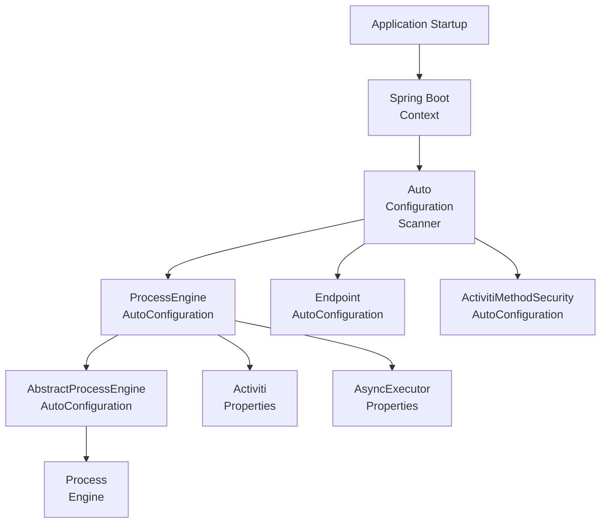
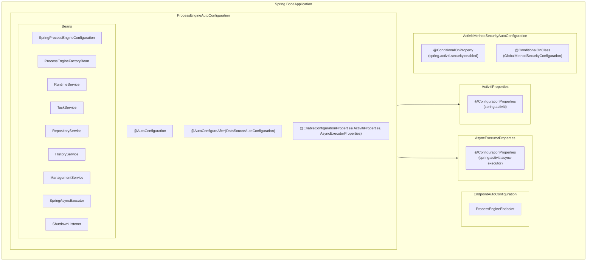

# Activiti Spring Boot Starter Module - Technical Documentation

**Module:** `activiti-core/activiti-spring-boot-starter`

---

## Table of Contents

- [Overview](#overview)
- [Architecture](#architecture)
- [Auto-Configuration](#auto-configuration)
- [Properties Reference](#properties-reference)
- [Async Executor Properties](#async-executor-properties)
- [Quick Start](#quick-start)
- [Advanced Configuration](#advanced-configuration)
- [Customization](#customization)
- [Production Deployment](#production-deployment)
- [Monitoring & Observability](#monitoring--observability)
- [Troubleshooting](#troubleshooting)
- [Best Practices](#best-practices)
- [API Reference](#api-reference)

---

## Overview

The **activiti-spring-boot-starter** module provides seamless integration of Activiti workflow engine with Spring Boot applications. It offers auto-configuration, property binding, and production-ready features out of the box.

### Key Features

- **Auto-Configuration**: Zero-configuration startup using Spring Boot 3.x `@AutoConfiguration`
- **Property Binding**: Externalized configuration under `spring.activiti` prefix
- **Actuator Integration**: Process engine endpoint via `ProcessEngineEndpoint`
- **Method Security**: Automatic Spring Security method-level configuration
- **Lifecycle Management**: Proper startup/shutdown via `ShutdownListener`

### Module Structure

<DirectoryTree rootName="activiti-spring-boot-starter" expandAll>
  <DirectoryTree.Dir name="src">
    <DirectoryTree.Dir name="main">
      <DirectoryTree.Dir name="java">
        <DirectoryTree.Dir name="org">
          <DirectoryTree.Dir name="activiti">
            <DirectoryTree.Dir name="spring">
              <DirectoryTree.Dir name="boot">
                <DirectoryTree.File name="ProcessEngineAutoConfiguration.java" />
                <DirectoryTree.File name="AbstractProcessEngineAutoConfiguration.java" />
                <DirectoryTree.File name="AbstractProcessEngineConfiguration.java" />
                <DirectoryTree.File name="ActivitiProperties.java" />
                <DirectoryTree.File name="AsyncExecutorProperties.java" />
                <DirectoryTree.File name="EndpointAutoConfiguration.java" />
                <DirectoryTree.File name="ActivitiMethodSecurityAutoConfiguration.java" />
                <DirectoryTree.File name="ShutdownListener.java" />
                <DirectoryTree.File name="ProcessEngineConfigurationConfigurer.java" />
                <DirectoryTree.File name="DefaultActivityBehaviorFactoryMappingConfigurer.java" />
                <DirectoryTree.File name="CandidateStartersDeploymentConfigurer.java" />
                <DirectoryTree.File name="ProcessDefinitionResourceFinderDescriptor.java" />
                <DirectoryTree.Dir name="actuate">
                  <DirectoryTree.Dir name="endpoint">
                    <DirectoryTree.File name="ProcessEngineEndpoint.java" />
                  </DirectoryTree.Dir>
                </DirectoryTree.Dir>
                <DirectoryTree.Dir name="process">
                  <DirectoryTree.Dir name="validation">
                    <DirectoryTree.File name="AsyncPropertyValidator.java" />
                  </DirectoryTree.Dir>
                </DirectoryTree.Dir>
              </DirectoryTree.Dir>
            </DirectoryTree.Dir>
          </DirectoryTree.Dir>
        </DirectoryTree.Dir>
      </DirectoryTree.Dir>
      <DirectoryTree.Dir name="resources">
        <DirectoryTree.Dir name="META-INF">
          <DirectoryTree.Dir name="spring">
            <DirectoryTree.File name="org.springframework.boot.autoconfigure.AutoConfiguration.imports" />
          </DirectoryTree.Dir>
        </DirectoryTree.Dir>
      </DirectoryTree.Dir>
    </DirectoryTree.Dir>
  </DirectoryTree.Dir>
</DirectoryTree>

The auto-configuration uses Spring Boot 3.x `@AutoConfiguration` annotation and registers the following in `org.springframework.boot.autoconfigure.AutoConfiguration.imports`:

```
org.activiti.spring.boot.ActivitiMethodSecurityAutoConfiguration
org.activiti.spring.boot.EndpointAutoConfiguration
org.activiti.spring.boot.ProcessEngineAutoConfiguration
```

---

## Architecture

### Auto-Configuration Flow



### Component Diagram



---

## Auto-Configuration

### Main Auto-Configuration Class

`ProcessEngineAutoConfiguration` (`org.activiti.spring.boot.ProcessEngineAutoConfiguration`) extends `AbstractProcessEngineAutoConfiguration` and is annotated with:

- `@AutoConfiguration` - Spring Boot 3.x auto-configuration registration
- `@AutoConfigureAfter(DataSourceAutoConfiguration, TaskExecutionAutoConfiguration)`
- `@EnableConfigurationProperties(ActivitiProperties.class, AsyncExecutorProperties.class)`

It creates the following beans:

- `SpringProcessEngineConfiguration` — the core engine configuration, wired with `DataSource`, `PlatformTransactionManager`, `SpringAsyncExecutor`, and all `ActivitiProperties` values
- `ProcessEngineFactoryBean` (via `AbstractProcessEngineAutoConfiguration`) — wraps the configuration
- `RuntimeService`, `TaskService`, `RepositoryService`, `HistoryService`, `ManagementService` (via `AbstractProcessEngineAutoConfiguration`) — exposed from `ProcessEngine`
- `SpringAsyncExecutor` (via `AbstractProcessEngineAutoConfiguration`) — async job executor
- `ShutdownListener` — listens for `ContextClosedEvent` to shut down the async executor
- `ProcessDefinitionResourceFinderDescriptor` — discovers BPMN resources for auto-deployment
- `ProcessExtensionResourceFinderDescriptor` — discovers process extension JSON files
- `ProcessDeployedEventProducer`, `ProcessCandidateStartersEventProducer`, `StartMessageDeployedEventProducer`, `ApplicationDeployedEventProducer` — event producers for deployment lifecycle
- `DefaultActivityBehaviorFactoryMappingConfigurer` — configures variable mapping for activity behaviors
- `CandidateStartersDeploymentConfigurer` — sets up default candidate starter authorizations
- `asyncExecutorPropertiesConfigurer` — `ProcessEngineConfigurationConfigurer` that applies `AsyncExecutorProperties`

### ProcessEngineConfigurationConfigurer Extension Point

The `ProcessEngineConfigurationConfigurer` interface allows customizing the `SpringProcessEngineConfiguration` after auto-configuration has set defaults:

```java
public interface ProcessEngineConfigurationConfigurer {
    void configure(SpringProcessEngineConfiguration processEngineConfiguration);
}
```

Define a bean of this type to apply custom configuration.

### Security Auto-Configuration

`ActivitiMethodSecurityAutoConfiguration` (`org.activiti.spring.boot.ActivitiMethodSecurityAutoConfiguration`) enables method-level security when:

- `spring.activiti.security.enabled` is `true` (default)
- `GlobalMethodSecurityConfiguration` is on the classpath
- No existing `@EnableGlobalMethodSecurity` bean is defined

It configures `prePostEnabled`, `securedEnabled`, and `jsr250Enabled`.

### AbstractProcessEngineAutoConfiguration

`AbstractProcessEngineAutoConfiguration` (`org.activiti.spring.boot.AbstractProcessEngineAutoConfiguration`) extends `AbstractProcessEngineConfiguration` and provides shared bean definitions:

- `SpringAsyncExecutor` — async executor with configurable rejection handler
- `SpringCallerRunsRejectedJobsHandler` — default rejected job handler
- `ProcessEngineFactoryBean` — factory for the process engine
- Service beans: `RuntimeService`, `RepositoryService`, `TaskService`, `HistoryService`, `ManagementService`
- `TaskExecutor` — default `SimpleAsyncTaskExecutor`
- `IntegrationContextManager`, `IntegrationContextService` — integration context beans

---

## Properties Reference

All properties use the prefix **`spring.activiti`** (not `activiti`).

### Core Properties (`ActivitiProperties`)

```yaml
spring:
  activiti:
    # Whether to scan for process definitions to auto-deploy. Default: true
    check-process-definitions: true

    # Whether to activate the async executor for timer and async jobs. Default: true
    async-executor-activate: true

    # Name used when deploying process definitions. Default: "SpringAutoDeployment"
    deployment-name: "SpringAutoDeployment"

    # Database schema update strategy. Default: "true"
    # Options: true, false, create-drop, create, validate
    database-schema-update: true

    # Database schema name (for databases that support schemas). Default: null
    database-schema:

    # Whether to use the database history tables. Default: false
    db-history-used: false

    # History level. Default: NONE
    # Options: NONE, ACTIVITY, AUDIT, FULL
    history-level: NONE

    # Location prefix for auto-discovering process definitions.
    # Default: "classpath*:**/processes/"
    process-definition-location-prefix: "classpath*:**/processes/"

    # File suffixes for process definition discovery.
    # Default: ["**.bpmn20.xml", "**.bpmn"]
    process-definition-location-suffixes:
      - "**.bpmn20.xml"
      - "**.bpmn"

    # Custom MyBatis mapper class names (fully qualified). Default: null
    custom-mybatis-mappers:
      - "com.example.MyCustomMapper"

    # Custom MyBatis XML mapper resource paths. Default: null
    custom-mybatis-xml-mappers:
      - "mappers/custom-mapper.xml"

    # Whether to use strong UUIDs for generated IDs. Default: true
    use-strong-uuids: true

    # Whether to copy process variables to local scope when a task is created. Default: true
    copy-variables-to-local-for-tasks: true

    # Deployment mode. Default: "default"
    deployment-mode: "default"

    # Whether to serialize POJOs in variables to JSON. Default: true
    serialize-po-jos-in-variables-to-json: true

    # Jackson type identifier property name for polymorphic serialization.
    # Default: "@class"
    java-class-field-for-jackson: "@class"

    # Maximum number of process definitions to cache. Default: null (no limit)
    process-definition-cache-limit:

    # Name of the Spring CacheManager cache to use for process definitions.
    # When set, a SpringProcessDefinitionCache bean is created.
    process-definition-cache-name:

    # Mail server configuration
    mail-server-host: "localhost"
    mail-server-port: 1025
    mail-server-user-name:
    mail-server-password:
    mail-server-default-from:
    mail-server-use-ssl: false
    mail-server-use-tls: false

    # Security
    security:
      enabled: true
```

### Process Extensions

Process extension JSON files are discovered based on:

- Prefix: same as `process-definition-location-prefix` (overridable via `spring.activiti.process.extensions.dir`)
- Suffix: default `"**\-extensions.json"` (overridable via `spring.activiti.process.extensions.suffix`)

---

## Async Executor Properties

`AsyncExecutorProperties` uses the prefix **`spring.activiti.async-executor`**:

```yaml
spring:
  activiti:
    async-executor:
      # Retry wait time in milliseconds for failed jobs. Default: 500
      retry-wait-time-in-millis: 500

      # Number of retries for a job. Default: 3
      number-of-retries: 3

      # Core pool size for async job execution threads. Default: 2
      core-pool-size: 2

      # Maximum pool size for async job execution threads. Default: 10
      max-pool-size: 10

      # Thread keep-alive time in milliseconds. Default: 5000
      keep-alive-time: 5000

      # Queue size for the job execution queue. Default: 100
      queue-size: 100

      # Seconds to wait for graceful shutdown. Default: 60
      seconds-to-wait-on-shutdown: 60

      # Max timer jobs per acquisition query. Default: 1
      max-timer-jobs-per-acquisition: 1

      # Max async jobs due per acquisition query. Default: 1
      max-async-jobs-due-per-acquisition: 1

      # Timer job acquisition wait time in milliseconds. Default: 10000
      default-timer-job-acquire-wait-time-in-millis: 10000

      # Async job acquisition wait time in milliseconds. Default: 10000
      default-async-job-acquire-wait-time-in-millis: 10000

      # Wait time when queue is full. Default: 0
      default-queue-size-full-wait-time: 0

      # Timer job lock time in milliseconds. Default: 300000 (5 min)
      timer-lock-time-in-millis: 300000

      # Async job lock time in milliseconds. Default: 300000 (5 min)
      async-job-lock-time-in-millis: 300000

      # Interval between expired job checks in milliseconds. Default: 60000 (1 min)
      reset-expired-jobs-interval: 60000

      # Page size for expired job reset queries. Default: 3
      reset-expired-jobs-page-size: 3

      # Use message queue mode. Default: false
      message-queue-mode: false
```

---

## Quick Start

### 1. Add Dependency

**Maven:**
```xml
<dependency>
    <groupId>org.activiti</groupId>
    <artifactId>activiti-spring-boot-starter</artifactId>
    <version>${activiti.version}</version>
</dependency>
```

**Gradle:**
```groovy
implementation "org.activiti:activiti-spring-boot-starter:${activitiVersion}"
```

### 2. Create Application

```java
@SpringBootApplication
public class ActivitiApplication {
    public static void main(String[] args) {
        SpringApplication.run(ActivitiApplication.class, args);
    }
}
```

### 3. Configure application.yml

```yaml
spring:
  datasource:
    url: jdbc:postgresql://localhost:5432/activiti
    username: postgres
    password: password
    driver-class-name: org.postgresql.Driver

  activiti:
    database-schema-update: true
    history-level: FULL
    async-executor-activate: true
```

### 4. Use Services

```java
@Service
public class WorkflowService {

    private final RuntimeService runtimeService;
    private final TaskService taskService;

    public WorkflowService(RuntimeService runtimeService, TaskService taskService) {
        this.runtimeService = runtimeService;
        this.taskService = taskService;
    }

    public void startProcess() {
        ProcessInstance instance = runtimeService
            .startProcessInstanceByKey("orderProcess");
    }

    public void completeTask(String taskId) {
        taskService.complete(taskId);
    }
}
```

---

## Advanced Configuration

### Custom ProcessEngineConfiguration via Configurer

```java
@Configuration
public class CustomActivitiConfig {

    @Bean
    public ProcessEngineConfigurationConfigurer customConfigurer() {
        return (configuration) -> {
            // Apply custom settings after auto-configuration defaults
            configuration.setActivityBehaviorFactory(new CustomActivityBehaviorFactory());
        };
    }
}
```

### Custom Resource Finder Descriptors

To deploy process definitions from additional locations:

```java
@Configuration
public class CustomResourceConfig {

    @Bean
    public ResourceFinderDescriptor customResourceFinderDescriptor() {
        return new ResourceFinderDescriptor() {
            @Override
            public String getLocationPrefix() {
                return "classpath*:**/custom-processes/";
            }

            @Override
            public List<String> getLocationSuffixes() {
                return List.of("*.bpmn");
            }

            @Override
            public boolean shouldLookUpResources() {
                return true;
            }

            @Override
            public String getMsgForEmptyResources() {
                return "No custom process definitions found";
            }

            @Override
            public String getMsgForResourcesFound(List<String> foundResources) {
                return "Found custom process definitions: " + foundResources;
            }

            @Override
            public void validate(List<Resource> resources) {
                // Validation logic
            }
        };
    }
}
```

### Profile-Specific Configuration

```yaml
# application-dev.yml
spring:
  activiti:
    database-schema-update: create-drop
    history-level: FULL
    async-executor-activate: true

# application-prod.yml
spring:
  activiti:
    database-schema-update: validate
    history-level: AUDIT
    async-executor-activate: true
    async-executor:
      core-pool-size: 4
      max-pool-size: 20
```

---

## Customization

### Custom Event Listeners

Implement `ProcessRuntimeEventListener` for specific event types and register as beans:

```java
@Component
public class CustomProcessDeployedListener
    implements ProcessRuntimeEventListener<ProcessDeployedEvent> {

    @Override
    public void onEvent(ProcessDeployedEvent event) {
        log.info("Process deployed: {}", event.getProcessDefinition().getKey());
    }
}
```

### Custom Async Executor

Replace the default `SpringAsyncExecutor` by providing a custom bean:

```java
@Configuration
public class CustomAsyncExecutorConfig {

    @Bean
    public SpringAsyncExecutor springAsyncExecutor(TaskExecutor taskExecutor) {
        return new SpringAsyncExecutor(taskExecutor, new CustomRejectedJobsHandler());
    }
}
```

### Custom Process Definition Cache

Configure a Spring-based cache for process definitions:

```yaml
spring:
  activiti:
    process-definition-cache-limit: 50
    process-definition-cache-name: processDefinitions
```

Provide a `CacheManager` with a cache named `processDefinitions`.

---

## Production Deployment

### 1. Database Configuration

```yaml
spring:
  datasource:
    url: jdbc:postgresql://db-host:5432/activiti
    username: ${DB_USERNAME}
    password: ${DB_PASSWORD}
    driver-class-name: org.postgresql.Driver
    hikari:
      maximum-pool-size: 20
      minimum-idle: 5
      connection-timeout: 30000
      idle-timeout: 600000
      max-lifetime: 1800000
```

### 2. Async Executor Tuning

```yaml
spring:
  activiti:
    async-executor-activate: true
    async-executor:
      core-pool-size: 4
      max-pool-size: 20
      queue-size: 500
      max-async-jobs-due-per-acquisition: 5
      max-timer-jobs-per-acquisition: 5
```

### 3. Deployment Validation

```yaml
spring:
  activiti:
    database-schema-update: validate
    check-process-definitions: true
```

---

## Monitoring & Observability

### ProcessEngineEndpoint

The starter provides a Spring Boot Actuator endpoint (`ProcessEngineEndpoint`) registered under the ID `activiti`. It returns:

- `processDefinitionCount` — total deployed process definitions
- `deployedProcessDefinitions` — list of keys and versions
- `runningProcessInstanceCount` — per-definition running instance counts
- `completedProcessInstanceCount` — per-definition completed instance counts
- `openTaskCount` — total open tasks
- `completedTaskCount` — total completed tasks
- `completedTaskCountToday` — tasks completed in the last 24 hours
- `completedActivities` — total completed activity instances
- `cachedProcessDefinitionCount` — process definitions in cache (if using `DefaultDeploymentCache`)

### Enabling the Endpoint

```yaml
management:
  endpoints:
    web:
      exposure:
        include: activiti
  endpoint:
    activiti:
      enabled: true
```

Access via `GET /actuator/activiti`.

### Endpoint Configuration

```yaml
endpoints:
  activiti:
    # Endpoint configuration via ConfigurationProperties
```

### Shutdown Listener

`ShutdownListener` automatically registers on `ContextClosedEvent` and:

1. Shuts down the async executor
2. Sets `ApplicationStatusHolder` to shutdown state

This ensures in-progress jobs are handled gracefully during application shutdown.

---

## Troubleshooting

### Common Issues

#### 1. Engine Not Starting

**Symptom:** Application fails to start with "Cannot create ProcessEngine"

**Solution:**
```yaml
# Ensure datasource is configured correctly
spring:
  datasource:
    url: jdbc:postgresql://localhost:5432/activiti
    username: postgres
    password: password
```

#### 2. Database Schema Errors

**Symptom:** "Table doesn't exist" errors

**Solution:**
```yaml
spring:
  activiti:
    database-schema-update: true  # Enable auto-update during development
```

#### 3. Jobs Not Executing

**Symptom:** Async tasks not running

**Solution:**
```yaml
spring:
  activiti:
    async-executor-activate: true
    async-executor:
      core-pool-size: 2
      max-pool-size: 10
```

#### 4. Process Definitions Not Auto-Deployed

**Symptom:** No processes found after startup

**Solution:**
```yaml
spring:
  activiti:
    check-process-definitions: true
    process-definition-location-prefix: "classpath*:**/processes/"
    process-definition-location-suffixes:
      - "**.bpmn20.xml"
      - "**.bpmn"
```

#### 5. Security Not Enabled

**Symptom:** Method-level security annotations not working

**Solution:**
```yaml
spring:
  activiti:
    security:
      enabled: true
```

Ensure `GlobalMethodSecurityConfiguration` is on the classpath.

### Debug Mode

```yaml
logging:
  level:
    org.activiti: DEBUG
    org.activiti.engine.impl: DEBUG
```

---

## Best Practices

### 1. Use Environment Variables

```yaml
spring:
  datasource:
    url: ${DATABASE_URL}
    username: ${DATABASE_USERNAME}
    password: ${DATABASE_PASSWORD}
```

### 2. Enable the Actuator Endpoint

```yaml
management:
  endpoints:
    web:
      exposure:
        include: activiti,health,info
```

### 3. Configure Proper History Level

```yaml
# Development
spring:
  activiti:
    history-level: FULL

# Production
spring:
  activiti:
    history-level: AUDIT
```

### 4. Tune Async Executor for Production

```yaml
spring:
  activiti:
    async-executor:
      core-pool-size: 4
      max-pool-size: 20
      queue-size: 500
```

### 5. Validate Schema in Production

```yaml
spring:
  activiti:
    database-schema-update: validate
```

---

## API Reference

### Configuration Classes

| Class | Package | Description |
|-------|---------|-------------|
| `ProcessEngineAutoConfiguration` | `org.activiti.spring.boot` | Main auto-configuration. Creates `SpringProcessEngineConfiguration`, event producers, and resource finder descriptors. |
| `AbstractProcessEngineAutoConfiguration` | `org.activiti.spring.boot` | Provides shared beans: `SpringAsyncExecutor`, `ProcessEngineFactoryBean`, service beans, `TaskExecutor`, integration context. |
| `AbstractProcessEngineConfiguration` | `org.activiti.spring.boot` | Base class with service bean factory methods: `runtimeServiceBean`, `repositoryServiceBean`, `taskServiceBean`, etc. |
| `EndpointAutoConfiguration` | `org.activiti.spring.boot` | Registers `ProcessEngineEndpoint` for Spring Boot Actuator. |
| `ActivitiMethodSecurityAutoConfiguration` | `org.activiti.spring.boot` | Enables method-level security when `spring.activiti.security.enabled=true` and Spring Security is on classpath. |

### Properties Classes

| Class | Prefix | Description |
|-------|--------|-------------|
| `ActivitiProperties` | `spring.activiti` | Core engine configuration: schema, history, deployment, mail, serialization, caching. |
| `AsyncExecutorProperties` | `spring.activiti.async-executor` | Async job executor: pool sizes, queue, retries, timeouts, acquisition settings. |

### Support Classes

| Class | Package | Description |
|-------|---------|-------------|
| `ShutdownListener` | `org.activiti.spring.boot` | Listens for `ContextClosedEvent`, shuts down async executor and sets application status. |
| `ProcessEngineConfigurationConfigurer` | `org.activiti.spring.boot` | Extension point interface for custom engine configuration. |
| `DefaultActivityBehaviorFactoryMappingConfigurer` | `org.activiti.spring.boot` | Configures variable mapping and activity behavior factory. |
| `CandidateStartersDeploymentConfigurer` | `org.activiti.spring.boot` | Sets up default candidate starter group authorizations. |
| `ProcessDefinitionResourceFinderDescriptor` | `org.activiti.spring.boot` | Discovers BPMN process definition resources for auto-deployment. |
| `ProcessEngineEndpoint` | `org.activiti.spring.boot.actuate.endpoint` | Actuator endpoint exposing process engine metrics. |
| `AsyncPropertyValidator` | `org.activiti.spring.boot.process.validation` | BPMN validator that checks async properties when async executor is disabled. |

### Bean Extension Points

- **`ProcessEngineConfigurationConfigurer`** — implement to customize `SpringProcessEngineConfiguration`
- **`ResourceFinderDescriptor`** — register beans to add custom process definition locations
- **`ProcessEngineConfigurator`** — Activiti-level configurator for deep engine customization
- **`DeploymentCache<ProcessDefinitionCacheEntry>`** — provide custom process definition cache (requires `spring.activiti.process-definition-cache-name` property)

---

## See Also

- [Parent Module Documentation](../overview.md)
- [Spring Integration](./spring-integration.mdx)
- [Engine Documentation](./README.md)
- [Spring Boot Documentation](https://spring.io/projects/spring-boot)
