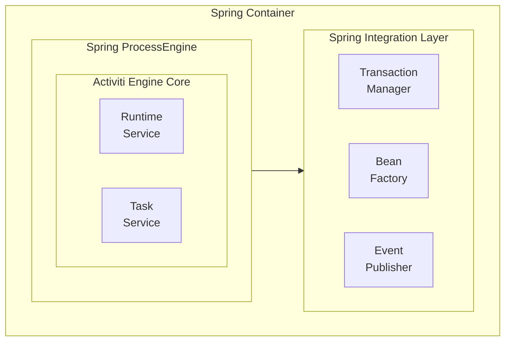
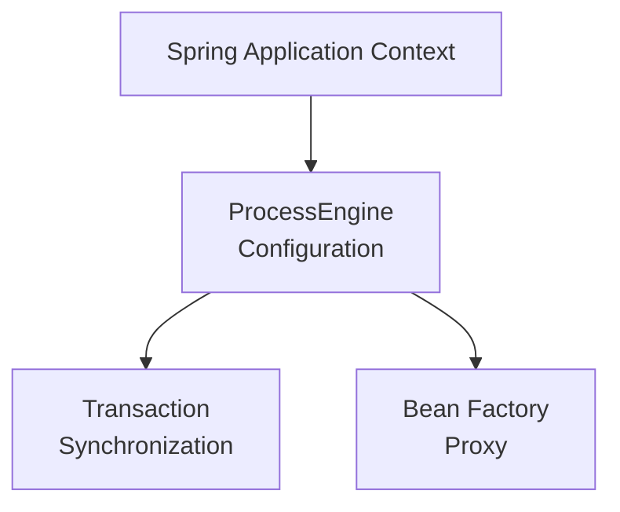

# Activiti Spring Module - Technical Documentation

**Module:** `activiti-core/activiti-spring`

---

## Table of Contents

- [Overview](#overview)
- [Architecture](#architecture)
- [Spring Integration Points](#spring-integration-points)
- [ProcessEngineConfiguration](#processengineconfiguration)
- [Transaction Management](#transaction-management)
- [Bean Factory Integration](#bean-factory-integration)
- [Expression Language](#expression-language)
- [Event Integration](#event-integration)
- [Async Execution](#async-execution)
- [Configuration Examples](#configuration-examples)
- [Best Practices](#best-practices)
- [Common Issues](#common-issues)
- [Testing](#testing)
- [API Reference](#api-reference)

---

## Overview

The **activiti-spring** module provides seamless integration between Activiti workflow engine and the Spring Framework. It enables dependency injection, transaction management, and Spring context awareness within the workflow engine.

### Key Features

- **Spring ProcessEngineConfiguration**: Full Spring integration
- **Transaction Synchronization**: JTA and Spring transaction support
- **Bean Factory Integration**: Access Spring beans from processes
- **Expression Language**: Spring EL support
- **Event Publishing**: Spring ApplicationEvent integration
- **Auto-Configuration**: Spring Boot ready

### Module Structure

```
activiti-spring/
├── src/main/java/org/activiti/spring/
│   ├── SpringProcessEngineConfiguration.java
│   ├── SpringBeanFactoryProxyMap.java
│   ├── transaction/
│   │   ├── SpringTransactionContext.java
│   │   └── SpringTransactionSynchronization.java
│   ├── el/
│   │   └── SpringExpressionManager.java
│   └── event/
│       └── SpringEventPublisher.java
└── src/test/java/
```

---

## Key Classes and Their Responsibilities

### SpringProcessEngineConfiguration

**Purpose:** Extends ProcessEngineConfiguration with Spring-specific features and integration.

**Responsibilities:**
- Integrating with Spring's bean factory
- Managing Spring transaction synchronization
- Configuring Spring expression language
- Handling Spring event publishing
- Managing Spring resource loading
- Providing Spring-aware command execution

**Key Properties:**
- `beanFactory` - Spring ConfigurableListableBeanFactory
- `transactionManager` - Spring PlatformTransactionManager
- `expressionManager` - Spring ExpressionManager
- `eventPublisher` - Spring ApplicationEventPublisher

**Key Methods:**
- `setBeanFactory(ConfigurableListableBeanFactory)` - Inject bean factory
- `setTransactionManager(PlatformTransactionManager)` - Set transaction manager
- `createCommandExecutor()` - Create Spring-aware executor
- `buildProcessEngine()` - Build engine with Spring integration

**When to Use:** Instead of StandaloneProcessEngineConfiguration when using Spring. This is the recommended configuration for Spring applications.

**Design Pattern:** Template Method - extends base configuration with Spring features

**Important:** Must have a bean factory set for Spring integration to work

---

### SpringTransactionContext

**Purpose:** Manages transactions using Spring's transaction infrastructure.

**Responsibilities:**
- Integrating with Spring's transaction manager
- Synchronizing with Spring transaction lifecycle
- Managing transaction status
- Handling commit and rollback
- Supporting transaction propagation
- Managing transaction listeners

**Key Methods:**
- `beginTransaction()` - Begin Spring transaction
- `commitTransaction()` - Commit via Spring manager
- `rollbackTransaction()` - Rollback via Spring manager
- `isActive()` - Check if transaction active
- `getStatus()` - Get transaction status

**When to Use:** Automatically used when SpringProcessEngineConfiguration is configured with a transaction manager.

**Design Pattern:** Transaction Script with Spring integration

**Thread Safety:** Uses Spring's TransactionSynchronizationManager - thread-safe

---

### SpringTransactionSynchronization

**Purpose:** Synchronizes Activiti operations with Spring transaction lifecycle.

**Responsibilities:**
- Registering callbacks with Spring transaction
- Flushing jobs before commit
- Publishing events after commit
- Handling rollback scenarios
- Managing transaction phases
- Coordinating multiple resources

**Key Methods:**
- `beforeCommit()` - Flush pending operations
- `afterCommit()` - Publish events
- `beforeRollback()` - Handle rollback prep
- `afterRollback()` - Cleanup on rollback
- `afterCompletion(int status)` - Post-transaction handling

**When to Use:** Internally by SpringTransactionContext. Ensures proper transaction ordering.

**Design Pattern:** Callback pattern for transaction lifecycle

**Important:** Ensures jobs are executed before transaction commits

---

### SpringBeanFactoryProxyMap

**Purpose:** Provides access to Spring beans from within the workflow engine.

**Responsibilities:**
- Resolving bean names to instances
- Managing bean proxies
- Handling bean lifecycle
- Providing type-safe bean access
- Caching bean references
- Supporting lazy initialization

**Key Methods:**
- `getBean(String name)` - Get bean by name
- `getBean(String name, Class<T> type)` - Get typed bean
- `containsBean(String name)` - Check bean existence
- `getBeansWithAnnotation(Class<?>)` - Find by annotation
- `registerBean(String, Object)` - Register custom bean

**When to Use:** Internally by expression language and delegate resolution. Allows processes to access Spring beans.

**Design Pattern:** Proxy pattern for bean access

**Thread Safety:** Thread-safe bean access from Spring container

---

### SpringExpressionManager

**Purpose:** Provides Spring Expression Language (SpEL) support for workflow expressions.

**Responsibilities:**
- Evaluating SpEL expressions
- Resolving beans in expressions
- Managing expression context
- Handling expression errors
- Caching parsed expressions
- Supporting custom functions

**Key Methods:**
- `evaluate(String expression)` - Evaluate expression
- `evaluate(String, Object rootObject)` - Evaluate with context
- `parseExpression(String)` - Parse expression
- `setBeanResolver(BeanResolver)` - Set bean resolver
- `registerFunction(String, Method)` - Register custom function

**When to Use:** For evaluating expressions in BPMN (assignee, candidate users, conditions).

**Design Pattern:** Interpreter pattern for expression evaluation

**Example:** `${myService.getMethod()}` in BPMN uses this

---

### SpringEventPublisher

**Purpose:** Publishes Activiti events as Spring ApplicationEvents.

**Responsibilities:**
- Converting Activiti events to Spring events
- Publishing via ApplicationEventPublisher
- Managing event listeners
- Handling event filtering
- Supporting async event publishing
- Integrating with Spring event system

**Key Methods:**
- `publishEvent(RuntimeEvent)` - Publish Activiti event
- `convertToSpringEvent(RuntimeEvent)` - Convert event type
- `addListener(ApplicationListener)` - Add Spring listener
- `publishAsync(RuntimeEvent)` - Publish asynchronously

**When to Use:** Automatically when Spring integration is enabled. Allows Spring components to react to workflow events.

**Design Pattern:** Publisher-Subscriber pattern

**Benefit:** Enables loose coupling between workflow and business logic

---

### SpringCommandExecutor

**Purpose:** Executes commands within Spring transaction context.

**Responsibilities:**
- Wrapping commands in Spring transactions
- Managing command context
- Handling transaction propagation
- Supporting read-only transactions
- Managing interceptor chains
- Providing Spring-aware execution

**Key Methods:**
- `execute(Command<T>)` - Execute with Spring transaction
- `createCommandContext()` - Create Spring context
- `setTransactionPropagation(Propagation)` - Set propagation
- `setReadOnly(boolean)` - Set read-only mode

**When to Use:** Internally by SpringProcessEngineConfiguration. Ensures all operations use Spring transactions.

**Design Pattern:** Command pattern with Spring transaction management

**Important:** All service operations go through this executor

---

### ProcessEngineConfigurationImpl (Spring Extension)

**Purpose:** Base configuration extended by SpringProcessEngineConfiguration.

**Responsibilities:**
- Providing base engine configuration
- Managing database settings
- Configuring job executor
- Setting history options
- Managing security settings
- Providing extension points

**Key Properties:**
- `dataSource` - Database connection
- `dbSchemaUpdate` - Auto-update setting
- `historyLevel` - History tracking
- `jobExecutorActivate` - Async execution
- `authorizationManager` - Security manager

**When to Use:** As base class. SpringProcessEngineConfiguration extends this.

**Design Pattern:** Template Method - defines configuration structure

---

## Architecture

### Integration Architecture



### Component Diagram



---

## Spring Integration Points

### 1. Dependency Injection

**Problem:** How to inject Spring beans into process delegates?

**Solution:**
```java
@Component
public class OrderService implements JavaDelegate {
    
    @Autowired
    private EmailService emailService;
    
    @Autowired
    private InventoryService inventoryService;
    
    @Override
    public void execute(DelegateExecution execution) {
        // Use Spring beans directly
        String orderId = (String) execution.getVariable("orderId");
        inventoryService.checkStock(orderId);
        emailService.sendNotification(orderId);
    }
}
```

### 2. Transaction Management

**Problem:** How to ensure workflow operations participate in Spring transactions?

**Solution:**
```java
@Service
public class OrderProcessService {
    
    @Autowired
    private RuntimeService runtimeService;
    
    @Transactional
    public void createOrder(Order order) {
        // Database operation
        orderRepository.save(order);
        
        // Workflow operation (same transaction)
        runtimeService.startProcessInstanceByKey("orderProcess");
    }
}
```

### 3. Event Publishing

**Problem:** How to publish Spring events from workflow?

**Solution:**
```java
@Component
public class ProcessEventListener implements ActivitiEventListener {
    
    @Autowired
    private ApplicationEventPublisher eventPublisher;
    
    @Override
    public void onEvent(ActivitiEvent event) {
        if (event.getType() == ProcessEvents.PROCESS_COMPLETED) {
            eventPublisher.publishEvent(
                new OrderCompletedEvent(this, event.getProcessInstance()));
        }
    }
}
```

---

## ProcessEngineConfiguration

### SpringProcessEngineConfiguration

```java
public class SpringProcessEngineConfiguration 
    extends ProcessEngineConfigurationImpl {
    
    private ConfigurableListableBeanFactory beanFactory;
    private PlatformTransactionManager transactionManager;
    
    @Override
    public void setBeanFactory(ConfigurableListableBeanFactory beanFactory) {
        this.beanFactory = beanFactory;
        // Integrate with Spring bean factory
    }
    
    @Override
    public void setTransactionManager(PlatformTransactionManager transactionManager) {
        this.transactionManager = transactionManager;
        // Use Spring transaction manager
    }
    
    @Override
    protected CommandExecutor createCommandExecutor() {
        return new SpringCommandExecutor(this);
    }
}
```

### Configuration Bean

```java
@Configuration
public class ActivitiConfig {
    
    @Autowired
    private DataSource dataSource;
    
    @Autowired
    private PlatformTransactionManager transactionManager;
    
    @Bean
    public ProcessEngine processEngine() {
        SpringProcessEngineConfiguration cfg = 
            new SpringProcessEngineConfiguration();
        
        cfg.setDataSource(dataSource);
        cfg.setTransactionManager(transactionManager);
        cfg.setDatabaseSchemaUpdate(
            ProcessEngineConfiguration.DB_SCHEMA_UPDATE_TRUE);
        cfg.setHistoryLevel(ProcessEngineConfiguration.HISTORY_FULL);
        cfg.setAsyncExecutorActivate(true);
        
        return cfg.buildProcessEngine();
    }
}
```

---

## Transaction Management

### Spring Transaction Context

```java
public class SpringTransactionContext implements TransactionContext {
    
    private final PlatformTransactionManager transactionManager;
    private TransactionStatus transactionStatus;
    private final List<TransactionSynchronization> synchronizations = 
        new ArrayList<>();
    
    @Override
    public void beginTransaction() {
        transactionStatus = transactionManager.getTransaction(
            new DefaultTransactionDefinition());
        
        // Register synchronization
        TransactionSynchronizationManager.registerSynchronization(
            new SpringTransactionSynchronization(this));
    }
    
    @Override
    public void commitTransaction() {
        // Notify synchronizations
        for (TransactionSynchronization sync : synchronizations) {
            sync.beforeCommit();
            sync.afterCommit();
        }
        
        // Commit transaction
        transactionManager.commit(transactionStatus);
    }
    
    @Override
    public void rollbackTransaction() {
        // Notify synchronizations
        for (TransactionSynchronization sync : synchronizations) {
            sync.beforeRollback();
            sync.afterRollback();
        }
        
        // Rollback transaction
        transactionManager.rollback(transactionStatus);
    }
}
```

### Transaction Synchronization

```java
public class SpringTransactionSynchronization 
    implements TransactionSynchronization {
    
    private final SpringTransactionContext context;
    
    @Override
    public void beforeCommit() {
        // Flush jobs, events, etc.
        context.flushJobs();
        context.flushEvents();
    }
    
    @Override
    public void afterCommit() {
        // Post-commit actions
        context.notifyCommitListeners();
    }
    
    @Override
    public void afterCompletion(int status) {
        if (status == STATUS_ROLLED_BACK) {
            context.handleRollback();
        }
    }
}
```

### Transaction Propagation

```java
@Service
public class WorkflowService {
    
    @Autowired
    private RuntimeService runtimeService;
    
    // Default: REQUIRED - join existing transaction
    @Transactional
    public void startProcess() {
        runtimeService.startProcessInstanceByKey("processKey");
    }
    
    // REQUIRES_NEW - always create new transaction
    @Transactional(propagation = Propagation.REQUIRES_NEW)
    public void startProcessIsolated() {
        runtimeService.startProcessInstanceByKey("processKey");
    }
    
    // NOT_SUPPORTED - execute without transaction
    @Transactional(propagation = Propagation.NOT_SUPPORTED)
    public void queryProcess() {
        runtimeService.createProcessInstanceQuery().list();
    }
}
```

---

## Bean Factory Integration

### SpringBeanFactoryProxyMap

```java
public class SpringBeanFactoryProxyMap {
    
    private final ConfigurableListableBeanFactory beanFactory;
    private final Map<String, Object> proxyCache = new ConcurrentHashMap<>();
    
    public Object getBean(String beanName) {
        return beanFactory.getBean(beanName);
    }
    
    public <T> T getBean(String beanName, Class<T> type) {
        return beanFactory.getBean(beanName, type);
    }
    
    public boolean containsBean(String beanName) {
        return beanFactory.containsBean(beanName);
    }
    
    public Map<String, Object> getAllBeans() {
        return beanFactory.getBeansWithAnnotation(Component.class);
    }
}
```

### Accessing Beans from Process

```java
// In BPMN: <delegateExpression="${springBean('orderService')}"/>
// Or in JavaDelegate:
@Component
public class MyDelegate implements JavaDelegate {
    
    @Autowired
    private OrderService orderService;
    
    @Override
    public void execute(DelegateExecution execution) {
        orderService.processOrder();
    }
}
```

### Custom Bean Resolution

```java
public class CustomBeanFactory implements BeanFactory {
    
    @Override
    public Object resolveExpression(String expression, 
                                    DelegateExecution execution) {
        // Custom resolution logic
        if (expression.startsWith("spring:")) {
            String beanName = expression.substring(7);
            return getBean(beanName);
        }
        return null;
    }
}
```

---

## Expression Language

### Spring EL Integration

```java
public class SpringExpressionManager implements ExpressionManager {
    
    private final ConfigurableListableBeanFactory beanFactory;
    private final StandardExpressionParser parser = 
        new StandardExpressionParser();
    
    @Override
    public Object evaluate(String expression, 
                          DelegateExecution execution) {
        // Create evaluation context
        SpringEvaluationContext context = 
            new SpringEvaluationContext(execution, beanFactory);
        
        // Parse and evaluate
        Expression exp = parser.parseExpression(expression);
        return exp.getValue(context, Object.class);
    }
}
```

### Usage in BPMN

```xml
<!-- Access Spring bean -->
<userTask name="Approve Order">
  <extensionElements>
    <activiti:field name="assignee">
      <activiti:string>${springBean('userService').getApprover()}</activiti:string>
    </activiti:field>
  </extensionElements>
</userTask>

<!-- Call bean method -->
<serviceTask name="Send Email">
  <extensionElements>
    <activiti:delegateExpression>${emailService.send()}</activiti:delegateExpression>
  </extensionElements>
</serviceTask>
```

### Custom EL Resolvers

```java
public class CustomElResolver implements ELResolver {
    
    @Override
    public Object getValue(ELContext context, Object base, Object property) {
        if (base == null && "custom".equals(property)) {
            context.setPropertyResolved(true);
            return getCustomObject();
        }
        return super.getValue(context, base, property);
    }
}
```

---

## Event Integration

### Spring ApplicationEvent Publisher

```java
public class SpringEventPublisher implements EventPublisher {
    
    @Autowired
    private ApplicationEventPublisher eventPublisher;
    
    @Override
    public void publishEvent(RuntimeEvent event) {
        // Convert to Spring event
        ApplicationEvent springEvent = convertToSpringEvent(event);
        
        // Publish
        eventPublisher.publishEvent(springEvent);
    }
    
    private ApplicationEvent convertToSpringEvent(RuntimeEvent event) {
        switch (event.getEventType()) {
            case PROCESS_STARTED:
                return new ProcessStartedSpringEvent(event);
            case PROCESS_COMPLETED:
                return new ProcessCompletedSpringEvent(event);
            case TASK_CREATED:
                return new TaskCreatedSpringEvent(event);
            default:
                return new GenericActivitiSpringEvent(event);
        }
    }
}
```

### Custom Spring Events

```java
public class ProcessStartedSpringEvent extends ApplicationEvent {
    
    private final ProcessInstance processInstance;
    
    public ProcessStartedSpringEvent(Object source, 
                                     ProcessInstance processInstance) {
        super(source);
        this.processInstance = processInstance;
    }
    
    public ProcessInstance getProcessInstance() {
        return processInstance;
    }
}
```

### Event Listeners

```java
@Component
public class ProcessEventListener {
    
    @EventListener
    public void handleProcessStarted(ProcessStartedSpringEvent event) {
        ProcessInstance instance = event.getProcessInstance();
        log.info("Process started: {}", instance.getId());
        
        // Perform additional actions
        sendNotification(instance);
        updateDashboard(instance);
    }
    
    @EventListener(condition = "#event.processInstance.processDefinitionKey == 'orderProcess'")
    public void handleOrderProcess(ProcessStartedSpringEvent event) {
        // Handle only order processes
    }
}
```

---

## Async Execution

### Spring Async Integration

```java
@Configuration
@EnableAsync
public class AsyncConfig {
    
    @Bean(name = "taskExecutor")
    public Executor taskExecutor() {
        ThreadPoolTaskExecutor executor = new ThreadPoolTaskExecutor();
        executor.setCorePoolSize(10);
        executor.setMaxPoolSize(20);
        executor.setQueueCapacity(100);
        executor.setThreadNamePrefix("Activiti-Async-");
        executor.initialize();
        return executor;
    }
}
```

### Async Process Execution

```java
@Service
public class AsyncWorkflowService {
    
    @Autowired
    private RuntimeService runtimeService;
    
    @Async("taskExecutor")
    public void startProcessAsync(String processKey, 
                                  Map<String, Object> variables) {
        // Non-blocking process start
        runtimeService.startProcessInstanceByKey(processKey, variables);
    }
    
    @Async("taskExecutor")
    @Transactional(propagation = Propagation.REQUIRES_NEW)
    public void completeTaskAsync(String taskId, 
                                 Map<String, Object> variables) {
        taskService.complete(taskId, variables);
    }
}
```

---

## Configuration Examples

### XML Configuration (Legacy)

```xml
<?xml version="1.0" encoding="UTF-8"?>
<beans xmlns="http://www.springframework.org/schema/beans"
       xmlns:xsi="http://www.w3.org/2001/XMLSchema-instance"
       xsi:schemaLocation="
           http://www.springframework.org/schema/beans
           http://www.springframework.org/schema/beans/spring-beans.xsd">
    
    <bean id="processEngineConfiguration" 
          class="org.activiti.spring.SpringProcessEngineConfiguration">
        <property name="dataSource" ref="dataSource"/>
        <property name="transactionManager" ref="transactionManager"/>
        <property name="databaseSchemaUpdate" value="true"/>
        <property name="historyLevel" value="full"/>
    </bean>
    
    <bean id="processEngine" 
          factory-bean="processEngineConfiguration"
          factory-method="buildProcessEngine"/>
</beans>
```

### Java Configuration

```java
@Configuration
@EnableTransactionManagement
public class ActivitiSpringConfig {
    
    @Autowired
    private DataSource dataSource;
    
    @Bean
    public PlatformTransactionManager transactionManager() {
        return new DataSourceTransactionManager(dataSource);
    }
    
    @Bean
    public ProcessEngine processEngine() {
        SpringProcessEngineConfiguration cfg = 
            new SpringProcessEngineConfiguration();
        
        cfg.setDataSource(dataSource);
        cfg.setTransactionManager(transactionManager());
        cfg.setDatabaseSchemaUpdate(
            ProcessEngineConfiguration.DB_SCHEMA_UPDATE_TRUE);
        cfg.setHistoryLevel(ProcessEngineConfiguration.HISTORY_FULL);
        cfg.setAsyncExecutorActivate(true);
        cfg.setJobExecutorActivate(true);
        
        return cfg.buildProcessEngine();
    }
    
    @Bean
    public RuntimeService runtimeService(ProcessEngine processEngine) {
        return processEngine.getRuntimeService();
    }
    
    @Bean
    public TaskService taskService(ProcessEngine processEngine) {
        return processEngine.getTaskService();
    }
}
```

### Spring Boot Configuration

```java
@SpringBootApplication
public class ActivitiApplication {
    public static void main(String[] args) {
        SpringApplication.run(ActivitiApplication.class, args);
    }
}

application.yml:
activiti:
  database-schema-update: true
  history-level: full
  async-executor-activate: true
  job-executor-threads: 10
  basic-auth:
    enabled: false
```

---

## Best Practices

### 1. Transaction Boundaries

```java
// GOOD: Clear transaction boundaries
@Service
public class OrderService {
    
    @Transactional
    public void createOrder(Order order) {
        orderRepository.save(order);
        runtimeService.startProcessInstanceByKey("orderProcess");
    }
}

// BAD: Unclear transaction scope
public void createOrder(Order order) {
    orderRepository.save(order);
    runtimeService.startProcessInstanceByKey("orderProcess");
    // Which transaction?
}
```

### 2. Bean Lifecycle

```java
// GOOD: Use Spring-managed beans
@Component
public class MyDelegate implements JavaDelegate {
    
    @Autowired
    private SomeService service;
    
    @Override
    public void execute(DelegateExecution execution) {
        service.doSomething();
    }
}

// BAD: Manual bean creation
public void execute(DelegateExecution execution) {
    SomeService service = new SomeService();
    service.doSomething();
}
```

### 3. Error Handling

```java
@Service
public class WorkflowService {
    
    @Transactional
    @Retryable(value = ActivitiException.class, maxAttempts = 3)
    public void startProcess(String processKey) {
        runtimeService.startProcessInstanceByKey(processKey);
    }
    
    @Recover
    public void recover(ActivitiException e, String processKey) {
        log.error("Failed to start process: {}", processKey, e);
        // Handle recovery
    }
}
```

### 4. Testing

```java
@SpringBootTest
@AutoConfigureTestDatabase
public class WorkflowServiceTest {
    
    @Autowired
    private TestRestTemplate restTemplate;
    
    @Autowired
    private RuntimeService runtimeService;
    
    @Test
    public void testProcessExecution() {
        // Arrange
        Deployment deployment = runtimeService.createDeployment()
            .addClasspathResource("test-process.bpmn")
            .deploy();
        
        // Act
        ProcessInstance instance = runtimeService
            .startProcessInstanceById(
                deployment.getProcessDefinitionId());
        
        // Assert
        assertNotNull(instance);
    }
}
```

---

## Common Issues

### 1. Transaction Not Propagating

**Problem:** Workflow operations not in same transaction

**Solution:**
```java
@Transactional // Ensure this annotation is present
public void myMethod() {
    runtimeService.startProcessInstanceByKey("key");
}
```

### 2. Bean Not Available

**Problem:** Spring bean not injected into delegate

**Solution:**
```java
@Component // Ensure component scanning
public class MyDelegate implements JavaDelegate {
    @Autowired
    private SomeService service;
}
```

### 3. Circular Dependencies

**Problem:** ProcessEngine depends on beans that depend on ProcessEngine

**Solution:**
```java
@Autowired(required = false)
private RuntimeService runtimeService;
```

### 4. Event Not Published

**Problem:** Spring events not firing

**Solution:**
```java
// Ensure event publisher is configured
@Bean
public SpringEventPublisher eventPublisher() {
    return new SpringEventPublisher(applicationEventPublisher);
}
```

---

## Testing

### Unit Testing with Mocks

```java
@ExtendWith(MockitoExtension.class)
public class WorkflowServiceTest {
    
    @Mock
    private RuntimeService runtimeService;
    
    @Mock
    private PlatformTransactionManager transactionManager;
    
    @InjectMocks
    private WorkflowService workflowService;
    
    @Test
    public void testStartProcess() {
        when(runtimeService.startProcessInstanceByKey("key"))
            .thenReturn(new ProcessInstanceImpl("1"));
        
        ProcessInstance instance = workflowService.startProcess("key");
        
        assertNotNull(instance);
        verify(runtimeService).startProcessInstanceByKey("key");
    }
}
```

### Integration Testing

```java
@SpringBootTest
@AutoConfigureTestDatabase(replace = AutoConfigureTestDatabase.Replace.NONE)
public class WorkflowIntegrationTest {
    
    @Autowired
    private ProcessEngine processEngine;
    
    @BeforeEach
    public void setup() {
        // Deploy test processes
    }
    
    @Test
    public void testFullWorkflow() {
        // Test complete workflow
    }
    
    @AfterEach
    public void cleanup() {
        // Clean up test data
    }
}
```

---

## API Reference

### Key Classes

- `SpringProcessEngineConfiguration` - Spring-aware engine config
- `SpringTransactionContext` - Spring transaction integration
- `SpringBeanFactoryProxyMap` - Bean factory access
- `SpringExpressionManager` - Spring EL support

### Key Interfaces

- `TransactionSynchronization` - Transaction sync callback
- `EventPublisher` - Event publishing interface

### Configuration Properties

```yaml
activiti:
  database-schema-update: true|false|create-drop
  history-level: none|activity|audit|full
  async-executor-activate: true|false
  job-executor-threads: 10
  transaction:
    manager: platformTransactionManager
    propagation: REQUIRED
```

---

## See Also

- [Parent Module Documentation](../overview.md)
- [Engine Documentation](../engine-api/README.md)
- [Spring Boot Starter](../engine-api/spring-boot-starter.md)
