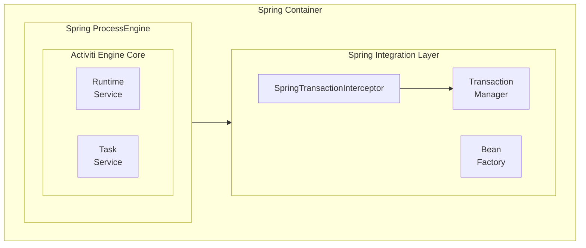
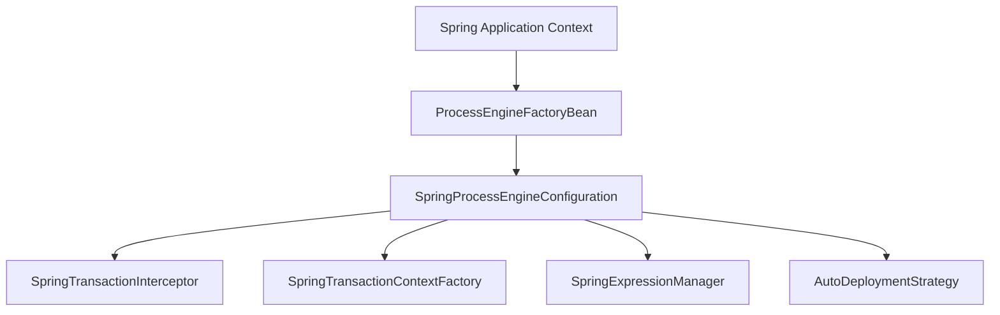

# Activiti Spring Module - Technical Documentation

**Module:** `activiti-core/activiti-spring`

---

## Table of Contents

- [Overview](#overview)
- [Architecture](#architecture)
- [Spring Integration Points](#spring-integration-points)
- [ProcessEngineConfiguration](#processengineconfiguration)
- [Transaction Management](#transaction-management)
- [Bean Factory Integration](#bean-factory-integration)
- [Expression Language](#expression-language)
- [Auto-Deployment](#auto-deployment)
- [Async Execution](#async-execution)
- [Configuration Examples](#configuration-examples)
- [Best Practices](#best-practices)
- [Testing](#testing)
- [API Reference](#api-reference)

---

## Overview

The **activiti-spring** module provides seamless integration between Activiti workflow engine and the Spring Framework. It enables dependency injection, transaction management, and Spring context awareness within the workflow engine.

### Key Features

- **SpringProcessEngineConfiguration**: Full Spring integration
- **Transaction Management**: Spring transaction synchronization
- **Bean Factory Integration**: Access Spring beans from processes
- **Expression Language**: Spring ApplicationContext EL support
- **Auto-Deployment**: Automatic deployment of BPMN resources
- **Async Execution**: Spring TaskExecutor-based job execution

### Module Structure

```
activiti-spring/
├── src/main/java/org/activiti/spring/
│   ├── SpringProcessEngineConfiguration.java
│   ├── ProcessEngineFactoryBean.java
│   ├── SpringTransactionContext.java
│   ├── SpringTransactionContextFactory.java
│   ├── SpringTransactionInterceptor.java
│   ├── SpringExpressionManager.java
│   ├── ApplicationContextElResolver.java
│   ├── SpringConfigurationHelper.java
│   ├── SpringAsyncExecutor.java
│   ├── SpringRejectedJobsHandler.java
│   ├── SpringCallerRunsRejectedJobsHandler.java
│   ├── SpringEntityManagerSessionFactory.java
│   ├── SpringAdvancedBusinessCalendarManagerFactory.java
│   ├── autodeployment/
│   │   ├── AutoDeploymentStrategy.java
│   │   ├── AbstractAutoDeploymentStrategy.java
│   │   ├── DefaultAutoDeploymentStrategy.java
│   │   ├── SingleResourceAutoDeploymentStrategy.java
│   │   ├── ResourceParentFolderAutoDeploymentStrategy.java
│   │   ├── FailOnNoProcessAutoDeploymentStrategy.java
│   │   └── NeverFailAutoDeploymentStrategy.java
│   └── impl/test/
│       ├── SpringActivitiTestCase.java
│       └── CleanTestExecutionListener.java
└── src/test/java/
```

Note: `SpringBeanFactoryProxyMap` resides in `org.activiti.engine.impl.cfg` (the `activiti-engine` module), not in `org.activiti.spring`.

---

## Key Classes and Their Responsibilities

### SpringProcessEngineConfiguration

**Purpose:** Extends ProcessEngineConfigurationImpl with Spring-specific features and integration.

**Responsibilities:**
- Integrating with Spring's bean factory
- Managing Spring transaction synchronization via `SpringTransactionInterceptor` and `SpringTransactionContext`
- Configuring Spring expression language through `SpringExpressionManager`
- Auto-deploying BPMN resources from Spring Resource arrays
- Wrapping DataSource in Spring's `TransactionAwareDataSourceProxy`

**Key Properties:**
- `transactionManager` - Spring PlatformTransactionManager
- `applicationContext` - Spring ApplicationContext
- `deploymentName` - Name for auto-deployment (default: "SpringAutoDeployment")
- `deploymentResources` - Array of Spring Resources to auto-deploy
- `deploymentMode` - Auto-deployment strategy mode (default, single-resource, etc.)
- `transactionSynchronizationAdapterOrder` - Ordering for transaction synchronization

**Key Methods:**
- `setTransactionManager(PlatformTransactionManager)` - Set transaction manager
- `setDeploymentResources(Resource[])` - Set resources to auto-deploy
- `setDeploymentMode(String)` - Set auto-deployment strategy mode
- `setTransactionSynchronizationAdapterOrder(Integer)` - Set synchronization order
- `buildProcessEngine()` - Build engine with Spring integration and auto-deploy resources
- `createTransactionInterceptor()` - Creates `SpringTransactionInterceptor`
- `initTransactionContextFactory()` - Initializes `SpringTransactionContextFactory`
- `setDataSource(DataSource)` - Wraps DataSource in `TransactionAwareDataSourceProxy`

**When to Use:** Instead of StandaloneProcessEngineConfiguration when using Spring. This is the recommended configuration for Spring applications.

**Design Pattern:** Template Method - extends base configuration with Spring features

**Important:** Must have a transaction manager set for Spring transaction integration to work

---

### ProcessEngineFactoryBean

**Purpose:** Spring FactoryBean that creates and configures a ProcessEngine instance.

**Responsibilities:**
- Creating the ProcessEngine bean for Spring context
- Configuring the expression manager with Spring integration
- Setting up SpringBeanFactoryProxyMap for bean access
- Detecting and enabling externally managed transactions

**Key Properties:**
- `processEngineConfiguration` - ProcessEngineConfigurationImpl instance

**Key Methods:**
- `getObject()` - Returns the configured ProcessEngine
- `setProcessEngineConfiguration(ProcessEngineConfigurationImpl)` - Inject configuration
- `destroy()` - Closes the process engine on context shutdown

**When to Use:** With traditional Spring XML or Java configuration where you want Spring to manage the ProcessEngine lifecycle.

**Design Pattern:** FactoryBean pattern

**Important:** Automatically configures `SpringExpressionManager` and `SpringBeanFactoryProxyMap` if not already set

---

### SpringTransactionContext

**Purpose:** Integrates Activiti's transaction context with Spring's transaction management. Transactions are managed entirely by Spring; this class delegates to Spring rather than managing transactions directly.

**Responsibilities:**
- Delegating commit to Spring (no-op, since Spring manages the transaction)
- Marking rollback when requested
- Registering transaction listeners with Spring's `TransactionSynchronizationManager`

**Key Methods:**
- `commit()` - No-op. Transaction is managed by Spring.
- `rollback()` - Marks the current Spring transaction as rollback-only.
- `addTransactionListener(TransactionState state, TransactionListener listener)` - Registers a callback with Spring's `TransactionSynchronizationManager` for the given state (COMMITTING, COMMITTED, ROLLINGBACK, ROLLED_BACK).

**When to Use:** Automatically used when `SpringProcessEngineConfiguration` is configured with a transaction manager. Created by `SpringTransactionContextFactory`.

**Design Pattern:** Delegation to Spring's TransactionSynchronizationManager

**Thread Safety:** Uses Spring's `TransactionSynchronizationManager` - thread-safe

**Important:** Unlike standalone mode, transactions are NOT started, committed, or rolled back here. Spring controls the full transaction lifecycle.

---

### SpringTransactionContextFactory

**Purpose:** Factory for creating `SpringTransactionContext` instances.

**Key Methods:**
- `openTransactionContext(CommandContext)` - Creates a new `SpringTransactionContext`

---

### SpringTransactionInterceptor

**Purpose:** Command interceptor that wraps Activiti command execution in Spring transactions using `TransactionTemplate`.

**Responsibilities:**
- Creating a `TransactionTemplate` from the configured `PlatformTransactionManager`
- Mapping Activiti's `TransactionPropagation` to Spring's propagation behavior
- Executing the next command interceptor within the Spring transaction

**Supported Propagation:**
- `REQUIRED` - Default, joins existing or creates new transaction
- `REQUIRES_NEW` - Suspends current, creates new transaction
- `NOT_SUPPORTED` - Executes outside transaction

**Important:** This replaces the standard `LoggingCommandInterceptor` when Spring integration is enabled.

---

### SpringBeanFactoryProxyMap

**Package:** `org.activiti.engine.impl.cfg` (not `org.activiti.spring`)

**Purpose:** Provides read-only access to Spring beans from within the workflow engine, implementing `Map<Object, Object>`.

**Responsibilities:**
- Resolving bean names to instances via `BeanFactory.getBean()`
- Checking bean existence via `BeanFactory.containsBean()`

**Key Methods:**
- `get(Object key)` - Returns bean by name (key must be String)
- `containsKey(Object key)` - Checks if bean exists (key must be String)

**Unsupported Operations:** `keySet()`, `values()`, `entrySet()`, `size()`, `isEmpty()`, `put()`, `remove()`, `putAll()`, `clear()` all throw `ActivitiException`.

**When to Use:** Used internally by expression evaluation and delegate resolution. Configured by `ProcessEngineFactoryBean` as the beans map.

**Design Pattern:** Proxy pattern for read-only bean access

**Thread Safety:** Thread-safe bean access from Spring container

---

### SpringExpressionManager

**Purpose:** Extends `ExpressionManager` to expose Spring ApplicationContext beans in workflow expressions.

**Responsibilities:**
- Adding the Spring ApplicationContext as an EL resolver
- Optionally limiting exposed beans to a custom subset

**Key Methods:**
- Constructor `(ApplicationContext, Map<Object, Object>)` - If map is non-null, only those beans are exposed; otherwise the full ApplicationContext is available.
- `addBeansResolver(CompositeELResolver)` - Overrides base to add `ApplicationContextElResolver` or `ReadOnlyMapELResolver`.

**When to Use:** Automatically configured by `ProcessEngineFactoryBean` or when setting up Spring integration manually.

**Important:** This class does NOT have `evaluate()`, `parseExpression()`, `setBeanResolver()`, or `registerFunction()` methods. Expression evaluation is handled by the parent `ExpressionManager` (`createExpression()` and `getElContext()`).

---

### ApplicationContextElResolver

**Purpose:** EL resolver that looks up beans from the Spring `ApplicationContext`.

**Key Methods:**
- `getValue(ELContext, Object base, Object property)` - Resolves bean names when base is null
- `setValue(ELContext, Object base, Object property, Object value)` - Throws `ActivitiException` (beans are read-only)
- `isReadOnly(ELContext, Object base, Object property)` - Returns true

---

### SpringConfigurationHelper

**Purpose:** Utility for loading a ProcessEngine from a Spring XML configuration file.

**Key Methods:**
- `buildProcessEngine(URL)` - Loads an XML config, creates the ApplicationContext, and returns the `ProcessEngine` bean.

---

### SpringAsyncExecutor

**Purpose:** Spring-based async job executor that uses `TaskExecutor` instead of raw threads.

**Responsibilities:**
- Delegates job execution to a Spring `TaskExecutor`
- Handles rejected jobs via `SpringRejectedJobsHandler`

**Key Properties:**
- `taskExecutor` - Spring `TaskExecutor` for running jobs
- `rejectedJobsHandler` - Handler for jobs rejected by the executor

**Key Methods:**
- `setTaskExecutor(TaskExecutor)` - Inject the task executor
- `setRejectedJobsHandler(SpringRejectedJobsHandler)` - Inject the rejected handler
- `executeAsyncJob(Job)` - Executes a job through the task executor

**When to Use:** In application server environments where unmanaged threads are discouraged. Use a Spring-managed thread pool (e.g., `ThreadPoolTaskExecutor`).

---

### SpringRejectedJobsHandler

**Purpose:** Strategy interface for handling jobs rejected by the async executor (e.g., when queue is full).

**Note:** Deprecated. Activiti recommends against using the legacy Job Executor.

**Key Methods:**
- `jobRejected(AsyncExecutor, Job)` - Called when a job is rejected

---

### SpringCallerRunsRejectedJobsHandler

**Purpose:** Default implementation of `SpringRejectedJobsHandler` that executes rejected jobs in the caller's thread.

**Behavior:** Runs the rejected job synchronously in the calling thread, which may block job acquisition.

---

### SpringEntityManagerSessionFactory

**Purpose:** Session factory for JPA `EntityManager` when managed by Spring.

**Responsibilities:**
- Retrieving the thread-bound `EntityManager` via `EntityManagerFactoryUtils`
- Creating `EntityManagerSessionImpl` with Spring-managed entity manager

**When to Use:** When the `EntityManagerFactory` is managed by Spring (e.g., via `LocalContainerEntityManagerFactoryBean`).

---

### SpringAdvancedBusinessCalendarManagerFactory

**Purpose:** Creates a business calendar manager with support for advanced cycle calendars that handle daylight savings.

**Key Methods:**
- `getBusinessCalendarManager()` - Returns a `MapBusinessCalendarManager` with Duration, DueDate, and AdvancedCycle calendars configured
- `setDefaultScheduleVersion(Integer)` / `setClock(Clock)` - Configuration properties

**When to Use:** When processes use cycle date patterns and the server timezone differs from the scheduled timezone.

---

## Architecture

### Integration Architecture



### Component Diagram



---

## Spring Integration Points

### 1. Dependency Injection

**Problem:** How to inject Spring beans into process delegates?

**Solution:**
```java
@Component
public class OrderService implements JavaDelegate {

    @Autowired
    private EmailService emailService;

    @Autowired
    private InventoryService inventoryService;

    @Override
    public void execute(DelegateExecution execution) {
        // Use Spring beans directly
        String orderId = (String) execution.getVariable("orderId");
        inventoryService.checkStock(orderId);
        emailService.sendNotification(orderId);
    }
}
```

### 2. Transaction Management

**Problem:** How to ensure workflow operations participate in Spring transactions?

**Solution:**
```java
@Service
public class OrderProcessService {

    @Autowired
    private RuntimeService runtimeService;

    @Transactional
    public void createOrder(Order order) {
        // Database operation
        orderRepository.save(order);

        // Workflow operation (same transaction)
        runtimeService.startProcessInstanceByKey("orderProcess");
    }
}
```

### 3. Accessing Spring Beans from BPMN Expressions

**Problem:** How to reference Spring beans in BPMN XML?

**Solution:** Spring beans are available by name in EL expressions when `SpringExpressionManager` is configured.

```xml
<?xml version="1.0" encoding="UTF-8"?>
<definitions xmlns="http://www.omg.org/spec/BPMN/20100524/MODEL"
             xmlns:activiti="http://activiti.org/bpmn"
             targetNamespace="Examples">

  <process id="orderProcess">
    <userTask id="approve" name="Approve Order"
              activiti:assignee="${userService.getApprover()}"/>

    <serviceTask id="sendEmail" name="Send Email"
                 activiti:delegateExpression="${emailService}"/>
  </process>
</definitions>
```

---

## ProcessEngineConfiguration

### SpringProcessEngineConfiguration

```java
public class SpringProcessEngineConfiguration
    extends ProcessEngineConfigurationImpl implements ApplicationContextAware {

    protected PlatformTransactionManager transactionManager;
    protected String deploymentName = "SpringAutoDeployment";
    protected Resource[] deploymentResources = new Resource[0];
    protected String deploymentMode = "default";
    protected ApplicationContext applicationContext;

    @Override
    public void setDataSource(DataSource dataSource) {
        // Wraps in TransactionAwareDataSourceProxy
    }

    @Override
    public CommandInterceptor createTransactionInterceptor() {
        // Returns new SpringTransactionInterceptor(transactionManager)
    }

    @Override
    public void initTransactionContextFactory() {
        // Returns new SpringTransactionContextFactory(transactionManager, ...)
    }

    @Override
    public ProcessEngine buildProcessEngine() {
        ProcessEngine processEngine = super.buildProcessEngine();
        autoDeployResources(processEngine);
        return processEngine;
    }
}
```

### ProcessEngineFactoryBean

```java
public class ProcessEngineFactoryBean
    implements FactoryBean<ProcessEngine>, DisposableBean, ApplicationContextAware {

    protected ProcessEngineConfigurationImpl processEngineConfiguration;
    protected ApplicationContext applicationContext;

    public ProcessEngine getObject() throws Exception {
        configureExpressionManager();
        configureExternallyManagedTransactions();

        if (processEngineConfiguration.getBeans() == null) {
            processEngineConfiguration.setBeans(
                new SpringBeanFactoryProxyMap(applicationContext));
        }

        return processEngineConfiguration.buildProcessEngine();
    }

    public void destroy() throws Exception {
        processEngine.close();
    }
}
```

### Configuration Bean

```java
@Configuration
public class ActivitiConfig {

    @Autowired
    private DataSource dataSource;

    @Autowired
    private PlatformTransactionManager transactionManager;

    @Bean
    public ProcessEngine processEngine() {
        SpringProcessEngineConfiguration cfg =
            new SpringProcessEngineConfiguration();

        cfg.setDataSource(dataSource);
        cfg.setTransactionManager(transactionManager);
        cfg.setDatabaseSchemaUpdate(
            ProcessEngineConfiguration.DB_SCHEMA_UPDATE_TRUE);
        cfg.setHistoryLevel(ProcessEngineConfiguration.HISTORY_FULL);
        cfg.setAsyncExecutorActivate(true);

        return cfg.buildProcessEngine();
    }
}
```

---

## Transaction Management

### How Spring Transactions Work with Activiti

Activiti's transaction management is fully delegated to Spring. The `SpringTransactionInterceptor` wraps each command in a Spring `TransactionTemplate`, and `SpringTransactionContext` provides no-op commit and rollback-only behavior.

```java
// SpringTransactionInterceptor - wraps commands in Spring transactions
public class SpringTransactionInterceptor extends AbstractCommandInterceptor {
    public <T> T execute(CommandConfig config, Command<T> command) {
        TransactionTemplate template = new TransactionTemplate(transactionManager);
        template.setPropagationBehavior(getPropagation(config));
        return template.execute(status -> next.execute(config, command));
    }
}

// SpringTransactionContext - delegates to Spring
public class SpringTransactionContext implements TransactionContext {
    public void commit() {
        // Do nothing, transaction is managed by Spring
    }

    public void rollback() {
        // Mark the Spring transaction as rollback-only
        transactionManager.getTransaction(null).setRollbackOnly();
    }

    public void addTransactionListener(TransactionState state, TransactionListener listener) {
        // Registers a callback with Spring's TransactionSynchronizationManager
    }
}
```

### Transaction Propagation

```java
@Service
public class WorkflowService {

    @Autowired
    private RuntimeService runtimeService;

    // Default: REQUIRED - join existing transaction
    @Transactional
    public void startProcess() {
        runtimeService.startProcessInstanceByKey("processKey");
    }

    // REQUIRES_NEW - always create new transaction
    @Transactional(propagation = Propagation.REQUIRES_NEW)
    public void startProcessIsolated() {
        runtimeService.startProcessInstanceByKey("processKey");
    }

    // NOT_SUPPORTED - execute without transaction
    @Transactional(propagation = Propagation.NOT_SUPPORTED)
    public void queryProcess() {
        runtimeService.createProcessInstanceQuery().list();
    }
}
```

---

## Bean Factory Integration

### SpringBeanFactoryProxyMap

**Package:** `org.activiti.engine.impl.cfg`

```java
public class SpringBeanFactoryProxyMap implements Map<Object, Object> {

    protected BeanFactory beanFactory;

    public SpringBeanFactoryProxyMap(BeanFactory beanFactory) {
        this.beanFactory = beanFactory;
    }

    public Object get(Object key) {
        return beanFactory.getBean((String) key);
    }

    public boolean containsKey(Object key) {
        return beanFactory.containsBean((String) key);
    }

    // keySet(), values(), entrySet(), size(), isEmpty(),
    // put(), remove(), putAll(), clear() all throw ActivitiException
}
```

### Accessing Beans from Process

```java
// In BPMN: activiti:delegateExpression="${myBean}"
// Or in JavaDelegate:
@Component
public class MyDelegate implements JavaDelegate {

    @Autowired
    private OrderService orderService;

    @Override
    public void execute(DelegateExecution execution) {
        orderService.processOrder();
    }
}
```

---

## Expression Language

### SpringExpressionManager

```java
public class SpringExpressionManager extends ExpressionManager {

    protected ApplicationContext applicationContext;

    public SpringExpressionManager(ApplicationContext applicationContext, Map<Object, Object> beans) {
        super(beans);
        this.applicationContext = applicationContext;
    }

    @Override
    protected void addBeansResolver(CompositeELResolver elResolver) {
        if (beans != null) {
            // Only expose limited set of beans in expressions
            elResolver.add(new ReadOnlyMapELResolver(beans));
        } else {
            // Expose full application-context in expressions
            elResolver.add(new ApplicationContextElResolver(applicationContext));
        }
    }
}
```

### Usage in BPMN

```xml
<?xml version="1.0" encoding="UTF-8"?>
<definitions xmlns="http://www.omg.org/spec/BPMN/20100524/MODEL"
             xmlns:activiti="http://activiti.org/bpmn"
             targetNamespace="Examples">

  <process id="orderProcess">
    <!-- Spring bean available by name in expressions -->
    <userTask id="approve" name="Approve Order"
              activiti:assignee="${userService.getApprover()}"/>

    <!-- Call Spring bean via delegate expression -->
    <serviceTask id="sendEmail" name="Send Email"
                 activiti:delegateExpression="${emailService}"/>
  </process>
</definitions>
```

### ApplicationContextElResolver

```java
public class ApplicationContextElResolver extends ELResolver {

    protected ApplicationContext applicationContext;

    public Object getValue(ELContext context, Object base, Object property) {
        if (base == null && applicationContext.containsBean((String) property)) {
            context.setPropertyResolved(true);
            return applicationContext.getBean((String) property);
        }
        return null;
    }

    public boolean isReadOnly(ELContext context, Object base, Object property) {
        return true;
    }

    public void setValue(ELContext context, Object base, Object property, Object value) {
        // Throws ActivitiException - beans are read-only
    }
}
```

---

## Auto-Deployment

`SpringProcessEngineConfiguration` supports auto-deploying BPMN resources at startup. Configure via `deploymentResources` and `deploymentMode`.

### AutoDeploymentStrategy Interface

```java
public interface AutoDeploymentStrategy {
    boolean handlesMode(String mode);
    void deployResources(String deploymentNameHint, Resource[] resources, RepositoryService repositoryService);
}
```

### Available Strategies

| Class | Mode | Behavior |
|---|---|---|
| `DefaultAutoDeploymentStrategy` | `default` | Groups all resources into a single deployment |
| `SingleResourceAutoDeploymentStrategy` | `single-resource` | Creates a separate deployment for each resource |
| `ResourceParentFolderAutoDeploymentStrategy` | `resource-parent-folder` | Groups resources by parent folder into separate deployments |
| `FailOnNoProcessAutoDeploymentStrategy` | `fail-on-no-process` | Deploys valid resources; throws exception if none are valid |
| `NeverFailAutoDeploymentStrategy` | `never-fail` | Skips invalid resources and deploys the rest |

### Configuration

```java
SpringProcessEngineConfiguration cfg = new SpringProcessEngineConfiguration();
cfg.setDataSource(dataSource);
cfg.setTransactionManager(transactionManager);
cfg.setDeploymentName("myProcesses");
cfg.setDeploymentResources(new Resource[]{
    new ClassPathResource("processes/order.bpmn"),
    new ClassPathResource("processes/approval.bpmn")
});
cfg.setDeploymentMode("default");
```

### DefaultAutoDeploymentStrategy

Groups all configured resources into a single deployment with duplicate filtering enabled.

```java
public class DefaultAutoDeploymentStrategy extends AbstractAutoDeploymentStrategy {
    public static final String DEPLOYMENT_MODE = "default";

    @Override
    public void deployResources(String deploymentNameHint, Resource[] resources, RepositoryService repositoryService) {
        DeploymentBuilder builder = repositoryService.createDeployment()
            .enableDuplicateFiltering()
            .name(deploymentNameHint);

        for (Resource resource : resources) {
            builder.addInputStream(determineResourceName(resource), resource);
        }
        loadApplicationUpgradeContext(builder).deploy();
    }
}
```

### SingleResourceAutoDeploymentStrategy

Creates a separate deployment for each resource, using the resource name as the deployment name.

### ResourceParentFolderAutoDeploymentStrategy

Groups resources by their parent folder and creates one deployment per folder. The deployment name is `{deploymentNameHint}.{folderName}`.

### NeverFailAutoDeploymentStrategy

Validates each resource before deployment and skips invalid ones. Only deploys if at least one valid process definition is found.

### FailOnNoProcessAutoDeploymentStrategy

Similar to `NeverFailAutoDeploymentStrategy`, but throws an `ActivitiException` if no valid process definitions are deployed.

---

## Async Execution

### SpringAsyncExecutor

The `SpringAsyncExecutor` delegates job execution to a Spring `TaskExecutor`, allowing integration with managed thread pools in application servers.

```java
public class SpringAsyncExecutor extends DefaultAsyncJobExecutor {

    protected TaskExecutor taskExecutor;
    protected SpringRejectedJobsHandler rejectedJobsHandler;

    public void setTaskExecutor(TaskExecutor taskExecutor) {
        this.taskExecutor = taskExecutor;
    }

    public void setRejectedJobsHandler(SpringRejectedJobsHandler rejectedJobsHandler) {
        this.rejectedJobsHandler = rejectedJobsHandler;
    }

    @Override
    public boolean executeAsyncJob(Job job) {
        try {
            taskExecutor.execute(new ExecuteAsyncRunnable((JobEntity) job, processEngineConfiguration));
            return true;
        } catch (RejectedExecutionException e) {
            rejectedJobsHandler.jobRejected(this, job);
            return false;
        }
    }
}
```

### Spring Caller-Runs Rejected Jobs Handler

```java
public class SpringCallerRunsRejectedJobsHandler implements SpringRejectedJobsHandler {

    public void jobRejected(AsyncExecutor asyncExecutor, Job job) {
        // Execute rejected job in the caller's thread
        new ExecuteAsyncRunnable((JobEntity) job, asyncExecutor.getProcessEngineConfiguration()).run();
    }
}
```

---

## Configuration Examples

### XML Configuration (Legacy)

```xml
<?xml version="1.0" encoding="UTF-8"?>
<beans xmlns="http://www.springframework.org/schema/beans"
       xmlns:xsi="http://www.w3.org/2001/XMLSchema-instance"
       xsi:schemaLocation="
           http://www.springframework.org/schema/beans
           http://www.springframework.org/schema/beans/spring-beans.xsd">

    <bean id="processEngineConfiguration"
          class="org.activiti.spring.SpringProcessEngineConfiguration">
        <property name="dataSource" ref="dataSource"/>
        <property name="transactionManager" ref="transactionManager"/>
        <property name="databaseSchemaUpdate" value="true"/>
        <property name="historyLevel" value="full"/>
    </bean>

    <bean id="processEngine"
          class="org.activiti.spring.ProcessEngineFactoryBean">
        <property name="processEngineConfiguration" ref="processEngineConfiguration"/>
    </bean>
</beans>
```

### Java Configuration

```java
@Configuration
@EnableTransactionManagement
public class ActivitiSpringConfig {

    @Autowired
    private DataSource dataSource;

    @Bean
    public PlatformTransactionManager transactionManager() {
        return new DataSourceTransactionManager(dataSource);
    }

    @Bean
    public SpringProcessEngineConfiguration processEngineConfiguration() {
        SpringProcessEngineConfiguration cfg =
            new SpringProcessEngineConfiguration();

        cfg.setDataSource(dataSource);
        cfg.setTransactionManager(transactionManager());
        cfg.setDatabaseSchemaUpdate(
            ProcessEngineConfiguration.DB_SCHEMA_UPDATE_TRUE);
        cfg.setHistoryLevel(ProcessEngineConfiguration.HISTORY_FULL);

        return cfg;
    }

    @Bean
    public ProcessEngineFactoryBean processEngine() {
        ProcessEngineFactoryBean factory = new ProcessEngineFactoryBean();
        factory.setProcessEngineConfiguration(processEngineConfiguration());
        return factory;
    }

    @Bean
    public RuntimeService runtimeService(ProcessEngine processEngine) {
        return processEngine.getRuntimeService();
    }

    @Bean
    public TaskService taskService(ProcessEngine processEngine) {
        return processEngine.getTaskService();
    }
}
```

### Spring Boot Configuration

```java
@SpringBootApplication
public class ActivitiApplication {
    public static void main(String[] args) {
        SpringApplication.run(ActivitiApplication.class, args);
    }
}
```

```yaml
activiti:
  database-schema-update: true
  history-level: full
  async-executor-activate: true
```

---

## Best Practices

### 1. Transaction Boundaries

```java
// GOOD: Clear transaction boundaries
@Service
public class OrderService {

    @Transactional
    public void createOrder(Order order) {
        orderRepository.save(order);
        runtimeService.startProcessInstanceByKey("orderProcess");
    }
}

// BAD: Unclear transaction scope
public void createOrder(Order order) {
    orderRepository.save(order);
    runtimeService.startProcessInstanceByKey("orderProcess");
    // Which transaction?
}
```

### 2. Bean Lifecycle

```java
// GOOD: Use Spring-managed beans
@Component
public class MyDelegate implements JavaDelegate {

    @Autowired
    private SomeService service;

    @Override
    public void execute(DelegateExecution execution) {
        service.doSomething();
    }
}

// BAD: Manual bean creation
public void execute(DelegateExecution execution) {
    SomeService service = new SomeService();
    service.doSomething();
}
```

### 3. Error Handling

```java
@Service
public class WorkflowService {

    @Transactional
    @Retryable(value = ActivitiException.class, maxAttempts = 3)
    public void startProcess(String processKey) {
        runtimeService.startProcessInstanceByKey(processKey);
    }

    @Recover
    public void recover(ActivitiException e, String processKey) {
        log.error("Failed to start process: {}", processKey, e);
        // Handle recovery
    }
}
```

---

## Common Issues

### 1. Transaction Not Propagating

**Problem:** Workflow operations not in same transaction

**Solution:**
```java
@Transactional // Ensure this annotation is present
public void myMethod() {
    runtimeService.startProcessInstanceByKey("key");
}
```

### 2. Bean Not Available

**Problem:** Spring bean not injected into delegate

**Solution:**
```java
@Component // Ensure component scanning
public class MyDelegate implements JavaDelegate {
    @Autowired
    private SomeService service;
}
```

### 3. Circular Dependencies

**Problem:** ProcessEngine depends on beans that depend on ProcessEngine

**Solution:**
```java
@Autowired(required = false)
private RuntimeService runtimeService;
```

---

## Testing

### SpringActivitiTestCase

Abstract test case for JUnit-based tests with Spring integration.

```java
@ContextConfiguration("test-context.xml")
public class MySpringTest extends SpringActivitiTestCase {

    @Override
    protected void setUpProcessEngine() throws Throwable {
        // ProcessEngine is loaded from Spring context
    }

    public void testProcessExecution() {
        // Test with Spring-managed engine
    }
}
```

### CleanTestExecutionListener

Test execution listener that removes all deployments after a test class completes.

```java
@RunWith(SpringJUnit4ClassRunner.class)
@TestExecutionListeners(CleanTestExecutionListener.class)
@ContextConfiguration("test-context.xml")
public class MyIntegrationTest {
    // All deployments are cleaned up after the test class
}
```

### Unit Testing with Mocks

```java
@ExtendWith(MockitoExtension.class)
public class WorkflowServiceTest {

    @Mock
    private RuntimeService runtimeService;

    @Mock
    private PlatformTransactionManager transactionManager;

    @InjectMocks
    private WorkflowService workflowService;

    @Test
    public void testStartProcess() {
        when(runtimeService.startProcessInstanceByKey("key"))
            .thenReturn(new ProcessInstanceImpl("1"));

        ProcessInstance instance = workflowService.startProcess("key");

        assertNotNull(instance);
        verify(runtimeService).startProcessInstanceByKey("key");
    }
}
```

### Integration Testing

```java
@SpringBootTest
@AutoConfigureTestDatabase(replace = AutoConfigureTestDatabase.Replace.NONE)
public class WorkflowIntegrationTest {

    @Autowired
    private ProcessEngine processEngine;

    @BeforeEach
    public void setup() {
        // Deploy test processes
    }

    @Test
    public void testFullWorkflow() {
        // Test complete workflow
    }

    @AfterEach
    public void cleanup() {
        // Clean up test data
    }
}
```

---

## API Reference

### Core Classes

| Class | Package | Description |
|---|---|---|
| `SpringProcessEngineConfiguration` | `org.activiti.spring` | Spring-aware engine configuration |
| `ProcessEngineFactoryBean` | `org.activiti.spring` | FactoryBean for ProcessEngine |
| `SpringTransactionContext` | `org.activiti.spring` | Delegates transaction management to Spring |
| `SpringTransactionContextFactory` | `org.activiti.spring` | Creates SpringTransactionContext instances |
| `SpringTransactionInterceptor` | `org.activiti.spring` | Wraps commands in Spring transactions |
| `SpringExpressionManager` | `org.activiti.spring` | Extends ExpressionManager with Spring beans |
| `ApplicationContextElResolver` | `org.activiti.spring` | EL resolver for Spring ApplicationContext |
| `SpringConfigurationHelper` | `org.activiti.spring` | Utility to load engine from XML config |
| `SpringBeanFactoryProxyMap` | `org.activiti.engine.impl.cfg` | Read-only Map proxy to Spring BeanFactory |

### Async Execution

| Class | Package | Description |
|---|---|---|
| `SpringAsyncExecutor` | `org.activiti.spring` | Spring TaskExecutor-based job executor |
| `SpringRejectedJobsHandler` | `org.activiti.spring` | Interface for handling rejected jobs (deprecated) |
| `SpringCallerRunsRejectedJobsHandler` | `org.activiti.spring` | Default rejected jobs handler |

### Auto-Deployment

| Class | Package | Mode |
|---|---|---|
| `AutoDeploymentStrategy` | `org.activiti.spring.autodeployment` | Interface |
| `AbstractAutoDeploymentStrategy` | `org.activiti.spring.autodeployment` | Base class |
| `DefaultAutoDeploymentStrategy` | `org.activiti.spring.autodeployment` | `default` |
| `SingleResourceAutoDeploymentStrategy` | `org.activiti.spring.autodeployment` | `single-resource` |
| `ResourceParentFolderAutoDeploymentStrategy` | `org.activiti.spring.autodeployment` | `resource-parent-folder` |
| `FailOnNoProcessAutoDeploymentStrategy` | `org.activiti.spring.autodeployment` | `fail-on-no-process` |
| `NeverFailAutoDeploymentStrategy` | `org.activiti.spring.autodeployment` | `never-fail` |

### Additional Classes

| Class | Package | Description |
|---|---|---|
| `SpringEntityManagerSessionFactory` | `org.activiti.spring` | JPA EntityManager session factory for Spring |
| `SpringAdvancedBusinessCalendarManagerFactory` | `org.activiti.spring` | Creates advanced business calendar manager |

### Test Support

| Class | Package | Description |
|---|---|---|
| `SpringActivitiTestCase` | `org.activiti.spring.impl.test` | Abstract JUnit test case with Spring integration |
| `CleanTestExecutionListener` | `org.activiti.spring.impl.test` | Removes all deployments after test class |

### Configuration Properties

```yaml
activiti:
  database-schema-update: true|false|create-drop
  history-level: none|activity|audit|full
  async-executor-activate: true|false
```

### SpringProcessEngineConfiguration Properties

| Property | Type | Description |
|---|---|---|
| `transactionManager` | `PlatformTransactionManager` | Spring transaction manager (required) |
| `deploymentName` | `String` | Name for auto-deployment (default: "SpringAutoDeployment") |
| `deploymentResources` | `Resource[]` | BPMN resources to auto-deploy |
| `deploymentMode` | `String` | Auto-deployment strategy mode |
| `transactionSynchronizationAdapterOrder` | `Integer` | Ordering for transaction synchronization callbacks |

---

## See Also

- [Parent Module Documentation](../overview.md)
- [Engine Documentation](./README.md)
- [Spring Boot Starter](./spring-boot-starter.md)
