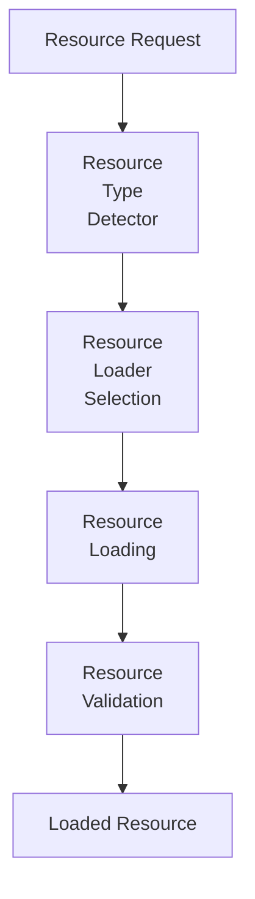
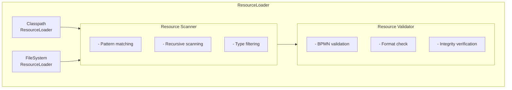

# Activiti Spring Resource Loader Module - Technical Documentation

**Module:** `activiti-core/activiti-spring-resource-loader`

**Target Audience:** Senior Software Engineers, Spring Developers

**Version:** 8.7.2-SNAPSHOT

---

## Table of Contents

- [Overview](#overview)
- [Architecture](#architecture)
- [Resource Loading Strategies](#resource-loading-strategies)
- [Classpath Scanning](#classpath-scanning)
- [Deployment Resources](#deployment-resources)
- [Custom Resource Loaders](#custom-resource-loaders)
- [Performance Optimization](#performance-optimization)
- [Usage Examples](#usage-examples)
- [Best Practices](#best-practices)
- [API Reference](#api-reference)

---

## Overview

The **activiti-spring-resource-loader** module provides utilities for loading BPMN resources from various sources within Spring applications. It supports classpath scanning, external file systems, and custom resource locations for process deployment.

### Key Features

- **Multiple Resource Types**: Classpath, filesystem, URL
- **Pattern Matching**: Ant-style path patterns
- **Classpath Scanning**: Recursive resource discovery
- **Deployment Support**: Direct deployment integration
- **Custom Loaders**: Extensible resource loading
- **Spring Integration**: Full Spring Resource support

### Module Structure

```
activiti-spring-resource-loader/
├── src/main/java/org/activiti/spring/loader/
│   ├── ResourceLoader.java                # Main loader interface
│   ├── ClasspathResourceLoader.java       # Classpath loading
│   ├── FileSystemResourceLoader.java      # File system loading
│   ├── UrlResourceLoader.java             # URL loading
│   ├── DeploymentResourceScanner.java     # Resource scanning
│   └── config/
│       ├── ResourceLoaderConfig.java
│       └── ResourceLoaderAutoConfiguration.java
└── src/test/java/
```

---

## Architecture

### Resource Loading Pipeline



### Component Diagram



---

## Resource Loading Strategies

### Classpath Resource Loader

```java
public class ClasspathResourceLoader implements ResourceLoader {
    
    private final ResourcePatternResolver patternResolver;
    
    public ClasspathResourceLoader() {
        this.patternResolver = 
            new PathMatchingResourcePatternResolver();
    }
    
    @Override
    public Resource[] loadResources(String locationPattern) 
            throws IOException {
        
        return patternResolver.getResources(locationPattern);
    }
    
    @Override
    public Resource loadResource(String location) {
        return new ClassPathResource(location);
    }
    
    @Override
    public boolean supports(String location) {
        return location.startsWith("classpath:") || 
               location.startsWith("classpath*:") ||
               location.startsWith("/");
    }
}
```

### FileSystem Resource Loader

```java
public class FileSystemResourceLoader implements ResourceLoader {
    
    @Override
    public Resource[] loadResources(String locationPattern) 
            throws IOException {
        
        FileSystem fileSystem = 
            FileSystems.getDefault();
        
        Path basePath = fileSystem.getPath(locationPattern);
        
        if (!Files.exists(basePath)) {
            return new Resource[0];
        }
        
        List<Resource> resources = new ArrayList<>();
        
        try (Stream<Path> paths = Files.walk(basePath)) {
            paths.filter(Files::isRegularFile)
                 .filter(this::isBpmnFile)
                 .forEach(path -> 
                     resources.add(new FileSystemResource(path)));
        }
        
        return resources.toArray(new Resource[0]);
    }
    
    @Override
    public Resource loadResource(String location) {
        return new FileSystemResource(location);
    }
    
    @Override
    public boolean supports(String location) {
        return !location.startsWith("classpath:") &&
               !location.startsWith("http://") &&
               !location.startsWith("https://");
    }
    
    private boolean isBpmnFile(Path path) {
        String filename = path.getFileName().toString().toLowerCase();
        return filename.endsWith(".bpmn") || 
               filename.endsWith(".bpmn20.xml") ||
               filename.endsWith(".xml");
    }
}
```

### URL Resource Loader

```java
public class UrlResourceLoader implements ResourceLoader {
    
    private final RestTemplate restTemplate;
    
    public UrlResourceLoader() {
        this.restTemplate = new RestTemplate();
    }
    
    @Override
    public Resource[] loadResources(String urlPattern) 
            throws IOException {
        
        URL url = new URL(urlPattern);
        
        if (url.getProtocol().equals("http") || 
            url.getProtocol().equals("https")) {
            return loadFromHttp(url);
        } else if (url.getProtocol().equals("file")) {
            return loadFromFile(url);
        }
        
        return new Resource[0];
    }
    
    private Resource[] loadFromHttp(URL url) throws IOException {
        try {
            ResponseEntity<byte[]> response = restTemplate.getForEntity(
                url, 
                byte[].class);
            
            if (response.getStatusCode().is2xxSuccessful()) {
                byte[] content = response.getBody();
                return new Resource[] {
                    new ByteArrayResource(content, url.getPath())
                };
            }
        } catch (HttpClientErrorException e) {
            log.warn("Failed to load resource from {}", url, e);
        }
        
        return new Resource[0];
    }
    
    @Override
    public boolean supports(String location) {
        return location.startsWith("http://") || 
               location.startsWith("https://");
    }
}
```

---

## Classpath Scanning

### Deployment Resource Scanner

```java
public class DeploymentResourceScanner {
    
    private final ResourceLoader resourceLoader;
    private final List<String> patterns;
    
    public DeploymentResourceScanner(ResourceLoader resourceLoader, 
                                     List<String> patterns) {
        this.resourceLoader = resourceLoader;
        this.patterns = patterns;
    }
    
    public Resource[] scan() throws IOException {
        List<Resource> allResources = new ArrayList<>();
        
        for (String pattern : patterns) {
            Resource[] resources = resourceLoader.loadResources(pattern);
            allResources.addAll(Arrays.asList(resources));
        }
        
        // Remove duplicates
        allResources = allResources.stream()
            .distinct()
            .collect(Collectors.toList());
        
        return allResources.toArray(new Resource[0]);
    }
    
    public Resource[] scanForBpmnFiles() throws IOException {
        Resource[] allResources = scan();
        
        return Arrays.stream(allResources)
            .filter(this::isBpmnFile)
            .toArray(Resource[]::new);
    }
    
    private boolean isBpmnFile(Resource resource) {
        try {
            String filename = resource.getFilename().toLowerCase();
            return filename.endsWith(".bpmn") || 
                   filename.endsWith(".bpmn20.xml");
        } catch (IOException e) {
            return false;
        }
    }
}
```

### Recursive Scanning

```java
public class RecursiveResourceScanner {
    
    public Resource[] scanRecursively(String baseLocation) 
            throws IOException {
        
        List<Resource> resources = new ArrayList<>();
        
        scanDirectory(baseLocation, resources);
        
        return resources.toArray(new Resource[0]);
    }
    
    private void scanDirectory(String location, 
                              List<Resource> resources) 
                    throws IOException {
        
        Resource dirResource = new FileSystemResource(location);
        
        if (!dirResource.exists() || !dirResource.isDirectory()) {
            return;
        }
        
        Resource[] children = dirResource.getFileSystem().listChildren();
        
        for (Resource child : children) {
            if (child.isDirectory()) {
                scanDirectory(child.getURI().toString(), resources);
            } else if (isBpmnFile(child)) {
                resources.add(child);
            }
        }
    }
}
```

---

## Deployment Resources

### Auto-Deployment

```java
@Component
public class AutoDeploymentManager {
    
    @Autowired
    private DeploymentResourceScanner resourceScanner;
    
    @Autowired
    private ProcessEngine processEngine;
    
    @Autowired
    private List<String> deploymentPatterns;
    
    @PostConstruct
    public void autoDeploy() {
        try {
            Resource[] resources = resourceScanner.scanForBpmnFiles();
            
            if (resources.length > 0) {
                deployResources(resources);
            }
        } catch (IOException e) {
            throw new ActivitiException(
                "Failed to auto-deploy resources", e);
        }
    }
    
    private void deployResources(Resource[] resources) {
        RepositoryService repoService = 
            processEngine.getRepositoryService();
        
        DeploymentBuilder deployment = repoService.createDeployment();
        
        for (Resource resource : resources) {
            try {
                deployment.addInputStream(
                    resource.getFilename(),
                    resource.getInputStream());
            } catch (IOException e) {
                log.error("Failed to add resource: {}", 
                         resource, e);
            }
        }
        
        deployment.deploy();
        log.info("Deployed {} resources", resources.length);
    }
}
```

### Deployment Configuration

```java
@ConfigurationProperties(prefix = "activiti.deployment")
public class DeploymentProperties {
    
    private boolean autoDeploy = true;
    private List<String> patterns = Arrays.asList(
        "classpath:bpmn/*.bpmn",
        "classpath:bpmn/**/*.bpmn"
    );
    private String deploymentName = "auto-deployment";
    private boolean cleanDeployment = false;
    
    // Getters and setters
}
```

---

## Custom Resource Loaders

### Custom Loader Implementation

```java
public class CustomResourceLoader implements ResourceLoader {
    
    @Override
    public Resource[] loadResources(String location) 
            throws IOException {
        
        // Custom loading logic
        // e.g., load from database, external API, etc.
        
        List<Resource> resources = new ArrayList<>();
        
        // Example: Load from database
        List<BpmnResource> dbResources = 
            bpmnResourceRepository.findByLocation(location);
        
        for (BpmnResource dbResource : dbResources) {
            resources.add(new ByteArrayResource(
                dbResource.getContent(),
                dbResource.getName()));
        }
        
        return resources.toArray(new Resource[0]);
    }
    
    @Override
    public boolean supports(String location) {
        return location.startsWith("db:");
    }
}
```

### Resource Loader Factory

```java
@Component
public class ResourceLoaderFactory {
    
    private final Map<String, ResourceLoader> loaders = 
        new HashMap<>();
    
    public ResourceLoaderFactory(List<ResourceLoader> allLoaders) {
        for (ResourceLoader loader : allLoaders) {
            loaders.put(loader.getClass().getName(), loader);
        }
    }
    
    public ResourceLoader getLoader(String location) {
        for (ResourceLoader loader : loaders.values()) {
            if (loader.supports(location)) {
                return loader;
            }
        }
        
        throw new IllegalArgumentException(
            "No loader supports: " + location);
    }
}
```

---

## Performance Optimization

### Resource Caching

```java
public class CachedResourceLoader implements ResourceLoader {
    
    private final ResourceLoader delegate;
    private final Cache<String, Resource[]> resourceCache;
    
    public CachedResourceLoader(ResourceLoader delegate, 
                               Cache resourceCache) {
        this.delegate = delegate;
        this.resourceCache = resourceCache;
    }
    
    @Override
    @Cacheable(value = "resources", key = "#location")
    public Resource[] loadResources(String location) 
            throws IOException {
        
        return delegate.loadResources(location);
    }
    
    public void invalidateCache(String location) {
        resourceCache.evict(location);
    }
}
```

### Lazy Loading

```java
public class LazyResourceLoader implements ResourceLoader {
    
    private final ResourceLoader delegate;
    private final ExecutorService executor;
    
    @Override
    public CompletableFuture<Resource[]> loadResourcesAsync(
            String location) {
        
        return CompletableFuture.supplyAsync(() -> {
            try {
                return delegate.loadResources(location);
            } catch (IOException e) {
                throw new CompletionException(e);
            }
        }, executor);
    }
}
```

---

## Usage Examples

### Basic Resource Loading

```java
@Service
public class ResourceLoadingService {
    
    @Autowired
    private ResourceLoader resourceLoader;
    
    public void loadBpmnFiles() throws IOException {
        Resource[] resources = resourceLoader.loadResources(
            "classpath:bpmn/*.bpmn");
        
        for (Resource resource : resources) {
            System.out.println("Loaded: " + resource.getFilename());
        }
    }
}
```

### Deployment from Resources

```java
@Service
public class DeploymentService {
    
    @Autowired
    private DeploymentResourceScanner scanner;
    
    @Autowired
    private ProcessEngine processEngine;
    
    public void deployAllBpmnFiles() throws IOException {
        Resource[] resources = scanner.scanForBpmnFiles();
        
        RepositoryService repoService = 
            processEngine.getRepositoryService();
        
        DeploymentBuilder deployment = 
            repoService.createDeployment();
        
        for (Resource resource : resources) {
            deployment.addInputStream(
                resource.getFilename(),
                resource.getInputStream());
        }
        
        deployment.deploy();
    }
}
```

---

## Best Practices

### 1. Use Specific Patterns

```java
// GOOD
"classpath:bpmn/orders/*.bpmn"

// BAD
"classpath:**/*"
```

### 2. Validate Resources

```java
Resource[] resources = loader.loadResources(pattern);

for (Resource resource : resources) {
    if (!validateBpmn(resource)) {
        log.warn("Invalid BPMN: {}", resource.getFilename());
    }
}
```

### 3. Handle Errors Gracefully

```java
try {
    Resource[] resources = loader.loadResources(pattern);
} catch (IOException e) {
    log.error("Failed to load resources", e);
    // Fallback or retry
}
```

### 4. Cache When Appropriate

```java
@Cacheable(value = "bpmnResources", key = "#pattern")
public Resource[] loadResources(String pattern) {
    return resourceLoader.loadResources(pattern);
}
```

---

## API Reference

### Key Classes

- `ResourceLoader` - Main loader interface
- `ClasspathResourceLoader` - Classpath loading
- `FileSystemResourceLoader` - File system loading
- `DeploymentResourceScanner` - Resource scanning
- `AutoDeploymentManager` - Auto-deployment

### Key Methods

```java
// Resource loading
Resource[] loadResources(String location)
Resource loadResource(String location)
boolean supports(String location)

// Scanning
Resource[] scan()
Resource[] scanForBpmnFiles()

// Deployment
void autoDeploy()
void deployResources(Resource[] resources)
```

---

## See Also

- [Parent Module Documentation](../overview.md)
- [Spring Integration](../engine-api/spring-integration.md)
- [Engine Documentation](../engine-api/README.md)
