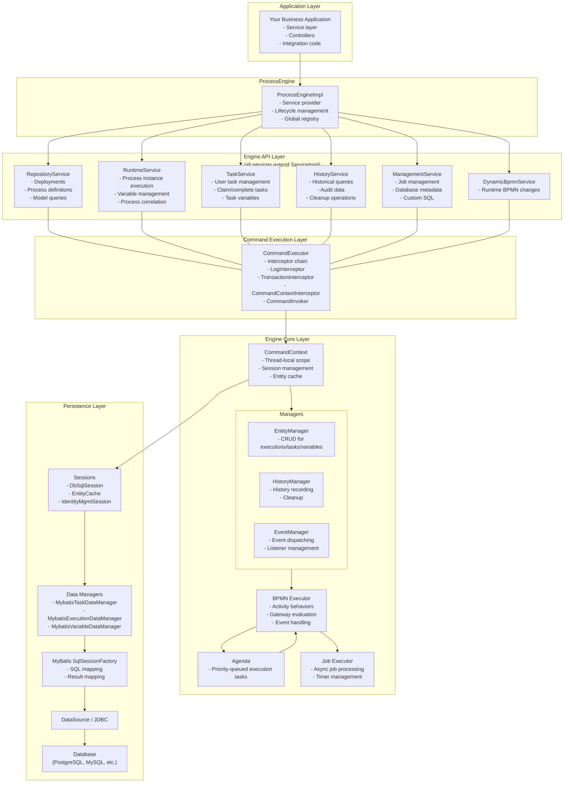
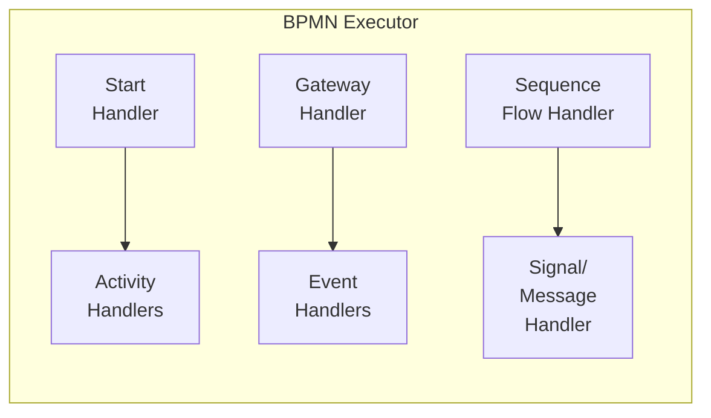
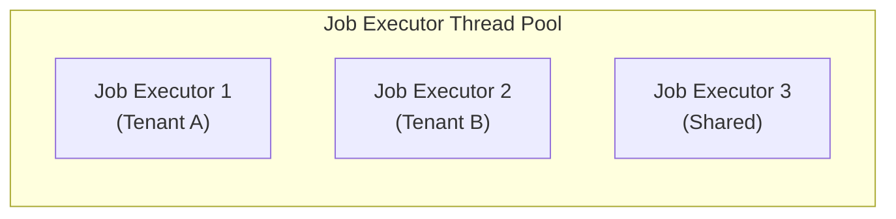
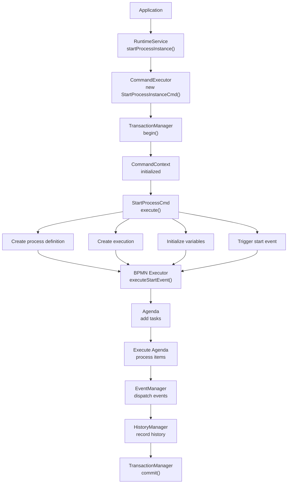
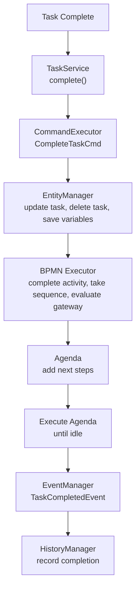
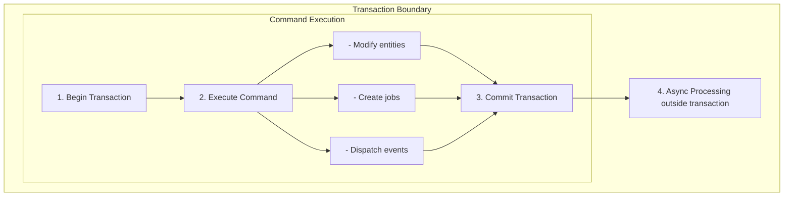
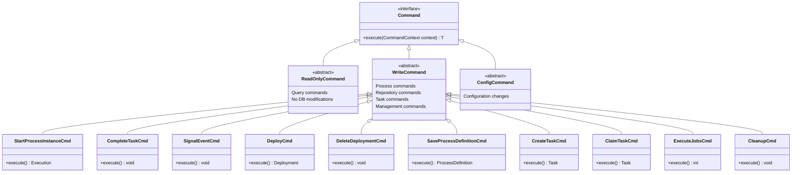
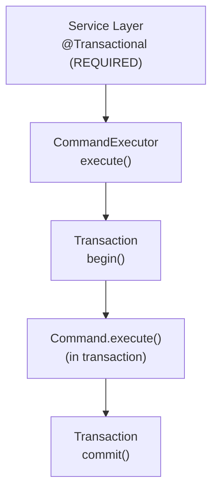
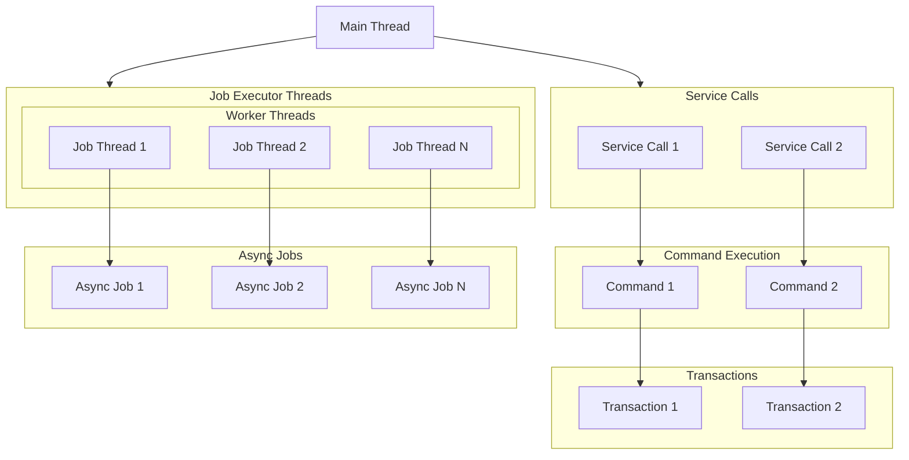
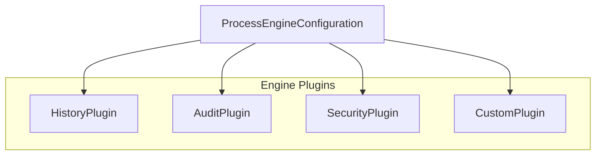

# Activiti Engine Architecture

**Module:** `activiti-core/activiti-engine`

---

## Table of Contents

- [System Overview](#system-overview)
- [Core Components](#core-components)
- [Component Interactions](#component-interactions)
- [Execution Flow](#execution-flow)
- [Command Pattern](#command-pattern)
- [Transaction Management](#transaction-management)
- [Threading Model](#threading-model)
- [Memory Management](#memory-management)
- [Extension Points](#extension-points)

---

## System Overview

The Activiti Engine is built on a layered architecture that separates concerns and provides clear extension points. The design follows established patterns while optimizing for BPMN 2.0 execution requirements.

### Architectural Principles

1. **Separation of Concerns** - Clear boundaries between services, execution, and persistence layers
2. **Command Pattern** - All operations go through a centralized command manager for consistency
3. **Transaction Safety** - ACID compliance for all engine operations
4. **Extensibility** - Pluggable components for customization without modifying core code
5. **Performance** - Optimized for high-throughput process execution
6. **Observability** - Comprehensive eventing and history tracking for monitoring

### High-Level Architecture



---

## Core Components

### 1. ProcessEngine

**Purpose:** Central coordinator and service provider

**Responsibilities:**
- Manage engine lifecycle (start/stop)
- Provide access to all services
- Configure and initialize components
- Manage thread pools and resources

**Key Methods:**
```java
public String getName();
public void close();
public RepositoryService getRepositoryService();
public RuntimeService getRuntimeService();
public TaskService getTaskService();
public HistoryService getHistoryService();
public ManagementService getManagementService();
public DynamicBpmnService getDynamicBpmnService();
public ProcessEngineConfiguration getProcessEngineConfiguration();
```

**Design Pattern:** Service Locator + Singleton

### 2. ProcessEngineConfiguration

**Purpose:** Central configuration hub

**Responsibilities:**
- Configure all engine components
- Manage database connections
- Set up transaction managers
- Configure job executor
- Enable/disable features

**Configuration Categories:**
```java
// Database
setJdbcUrl(), setJdbcDriver(), setJdbcUsername(), setJdbcPassword()
setDatabaseSchemaUpdate(), setDatabaseSchemaCheck()

// Job Executor
setAsyncExecutorActivate(), setAsyncExecutorAcquireFrequency()
setJobExecutorThreads(), setJobExecutorQueueSize()

// History
setHistoryLevel(), setEnableHistoryAudit()

// Security
setAuthorizationManager(), setPermissionFactory()

// Custom
setCustomLogger(), setCustomTaskListener()
```

**Design Pattern:** Builder + Configuration

### 3. Command Manager

**Purpose:** Central gateway for all engine operations

**Responsibilities:**
- Execute commands with proper transaction handling
- Manage command context
- Ensure thread safety
- Handle retries and error propagation

**Command Execution Flow:**
```
1. Command submitted
2. Transaction started (if needed)
3. Context initialized
4. Command executed
5. Events dispatched
6. Transaction committed/rolled back
7. Context cleared
```

**Key Interface:**
```java
public interface Command<T> {
    T execute(CommandContext context);
}
```

**Design Pattern:** Command + Template Method

### 4. Entity Manager

**Purpose:** Persistence operations for runtime entities

**Responsibilities:**
- CRUD operations for executions, tasks, variables
- Entity caching and lifecycle management
- Database query optimization
- Multi-tenancy support

**Managed Entities:**
- `ExecutionEntity` - Process executions
- `TaskEntity` - User tasks
- `VariableInstanceEntity` - Variables
- `JobEntity` - Async jobs

**Design Pattern:** Repository + Unit of Work

### 5. History Manager

**Purpose:** Historical data management

**Responsibilities:**
- Record process instance history
- Track task history
- Store variable history
- Manage history cleanup

**History Levels:**
```java
public enum HistoryLevel {
    NONE,           // No history
    ACTIVITY,       // Activity instances only
    AUDIT,          // + Task instances, variables
    FULL            // + Detailed execution history
}
```

**Design Pattern:** Event Sourcing (partial)

### 6. Event Manager

**Purpose:** Event dispatching and listener management

**Responsibilities:**
- Dispatch engine events
- Manage event listeners
- Support synchronous/asynchronous events
- Event filtering and routing

**Event Types:**
```java
// Task events
TaskCreatedEvent, TaskCompletedEvent, TaskAssignedEvent

// Process events
ProcessStartedEvent, ProcessCompletedEvent, ActivityTakenEvent

// Job events
JobExecutedEvent, JobExecutionFailedEvent

// Variable events
VariableCreatedEvent, VariableUpdatedEvent
```

**Design Pattern:** Publisher-Subscriber

### 7. BPMN Executor

**Purpose:** Core BPMN 2.0 execution engine

**Responsibilities:**
- Parse BPMN definitions
- Execute process flows
- Handle gateways and events
- Manage parallel execution
- Process business rules

**Components:**



**Design Pattern:** Strategy + Chain of Responsibility

### 8. Agenda

**Purpose:** Execution task management

**Responsibilities:**
- Queue execution tasks
- Prioritize work items
- Manage execution order
- Handle exceptions

**Agenda Items:**
```java
- TakeSequenceFlow
- ActivateExecution
- CompleteActivity
- EvaluateGateway
- SignalEvent
- ThrowException
```

**Design Pattern:** Priority Queue

### 9. Job Executor

**Purpose:** Asynchronous job processing

**Responsibilities:**
- Execute timer jobs
- Process async service tasks
- Handle job retries
- Manage job queues
- Multi-tenant job isolation

**Job Types:**
```java
- TimerStartJob - Start process on timer
- TimerCatchJob - Wait for timer in process
- ServiceJob - Async service task
- SignalJob - Send signal
- Job - Generic async job
```

**Threading Model:**



**Design Pattern:** Thread Pool + Worker

---

## Component Interactions

### Process Start Flow



### Task Completion Flow



---

## Execution Flow

### Command Execution Context

```java
public class CommandContext implements InMemoryObjectCache {
    
    private EntityManager entityManager;
    private HistoryManager historyManager;
    private EventManager eventManager;
    private Agenda agenda;
    private JobManager jobManager;
    
    // Thread-local storage for engine state
    private static final ThreadLocal<CommandContext> context = 
        new ThreadLocal<>();
    
    public static CommandContext getContext() {
        return context.get();
    }
}
```

### Transaction Boundaries



---

## Command Pattern

### Command Hierarchy



### Command Implementation Example

```java
public class StartProcessInstanceCmd<T> implements WriteCommand<T> {
    
    private String processDefinitionKey;
    private String businessKey;
    private Map<String, Object> variables;
    
    @Override
    public T execute(CommandContext context) {
        // 1. Get process definition
        ProcessDefinitionEntity def = context.getEntityManager()
            .findLatestProcessDefinitionByKey(processDefinitionKey);
        
        // 2. Create root execution
        ExecutionEntity execution = context.getEntityManager()
            .createRootExecution(def);
        
        // 3. Set business key
        execution.setBusinessKey(businessKey);
        
        // 4. Initialize variables
        for (Map.Entry<String, Object> entry : variables.entrySet()) {
            context.getEntityManager().createVariable(execution, entry);
        }
        
        // 5. Trigger start event
        context.getBpmnExecutor().executeStartEvent(execution);
        
        // 6. Execute agenda
        context.getAgenda().execute();
        
        // 7. Return process instance
        return (T) execution;
    }
}
```

---

## Transaction Management

### Transaction Strategy

```java
public interface TransactionStrategy {
    void begin();
    void commit();
    void rollback();
    boolean isActive();
}
```

### Built-in Strategies

1. **JdbcTransactionStrategy** - JDBC transactions
2. **JtaTransactionStrategy** - JTA distributed transactions
3. **SpringTransactionStrategy** - Spring transaction management

### Transaction Propagation



---

## Threading Model

### Thread Safety

```java
// Thread-safe components
- ProcessEngine (singleton)
- Services (stateless)
- CommandManager (synchronized)

// Thread-local storage
- CommandContext
- Engine state
- Transaction context

// Not thread-safe
- Query objects
- Builder objects
```

### Concurrency Control



---

## Memory Management

### Caching Strategy

```java
// First-level cache (transaction-scoped)
- Entity cache
- Variable cache
- Execution cache

// Second-level cache (engine-scoped)
- Process definition cache
- Deployment cache
- BPMN model cache
```

### Memory Optimization

1. **Lazy Loading**: Load entities on demand
2. **Batch Operations**: Process multiple items together
3. **Connection Pooling**: Reuse database connections
4. **History Cleanup**: Remove old history data
5. **Variable Serialization**: Efficient storage

---

## Extension Points

### Custom Components

```java
// 1. Custom Activity Behavior
public class CustomActivityBehavior implements ActivityBehavior {
    public void execute(Execution execution) { ... }
}

// 2. Custom Task Listener
public class CustomTaskListener implements TaskListener {
    public void notify(DelegateTask task) { ... }
}

// 3. Custom Event Listener
public class CustomEventListener implements EngineEventListener {
    public void notify(EngineEvent event) { ... }
}

// 4. Custom Job Handler
public class CustomJobHandler implements JobHandler {
    public void execute(JobJob job) { ... }
}

// 5. Custom History Provider
public class CustomHistoryProvider implements HistoryProvider {
    public void recordHistory(Execution execution) { ... }
}
```

### Plugin Architecture



---

## Performance Considerations

### Optimization Strategies

1. **Batch Processing**: Use batch operations for bulk updates
2. **Query Optimization**: Index frequently queried columns
3. **Connection Pooling**: Configure appropriate pool sizes
4. **Async Execution**: Use async for long-running tasks
5. **History Level**: Choose appropriate history level
6. **Caching**: Enable definition caching

### Monitoring

```java
// Key metrics to monitor
- Command execution time
- Transaction duration
- Database connection usage
- Job queue size
- Memory usage
- Thread pool utilization
```

---

## See Also

- [Engine Configuration](../configuration.md)
- [Engine API Overview](../api-reference/engine-api/README.md)
- [Repository Service](../api-reference/engine-api/repository-service.md)
- [Runtime Service](../api-reference/engine-api/runtime-service.md)
- [Task Service](../api-reference/engine-api/task-service.md)
- [Best Practices](../best-practices/overview.md)
