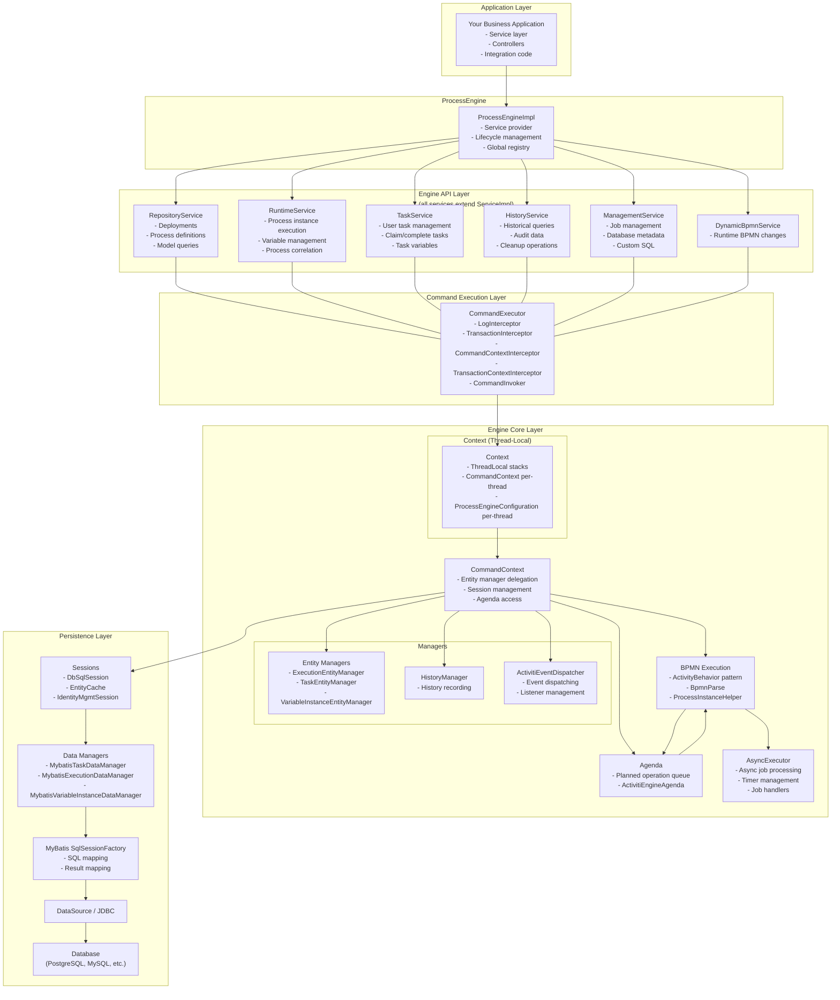
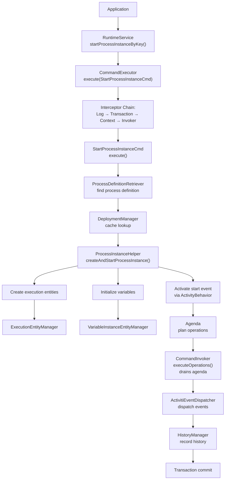
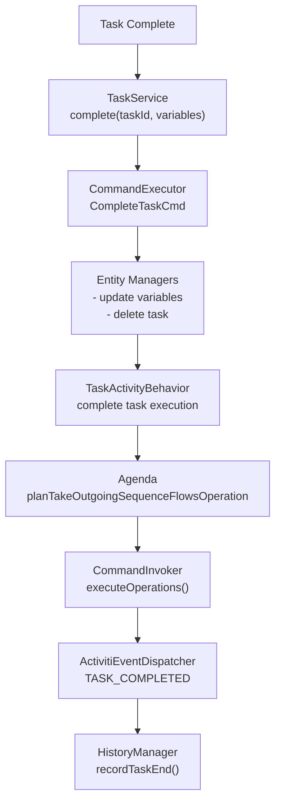
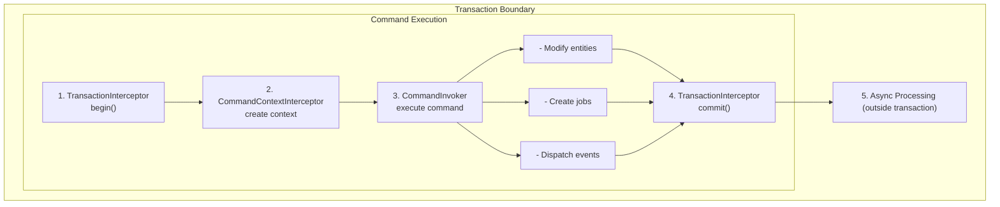
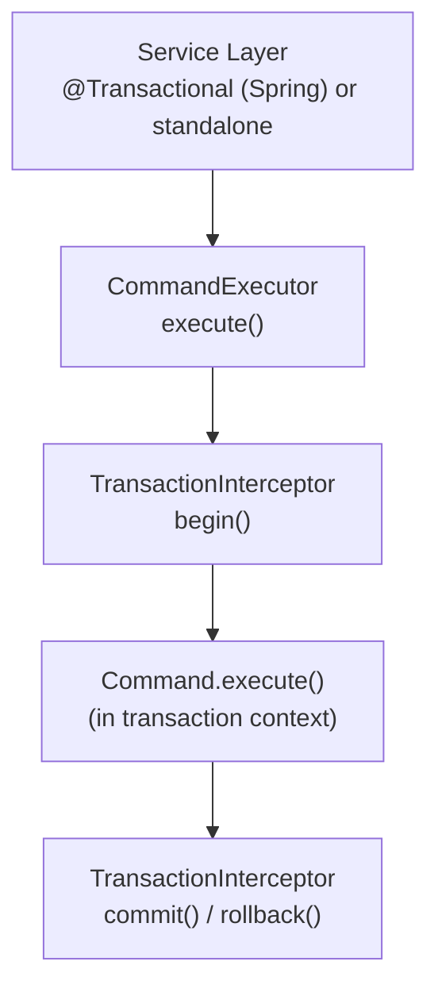
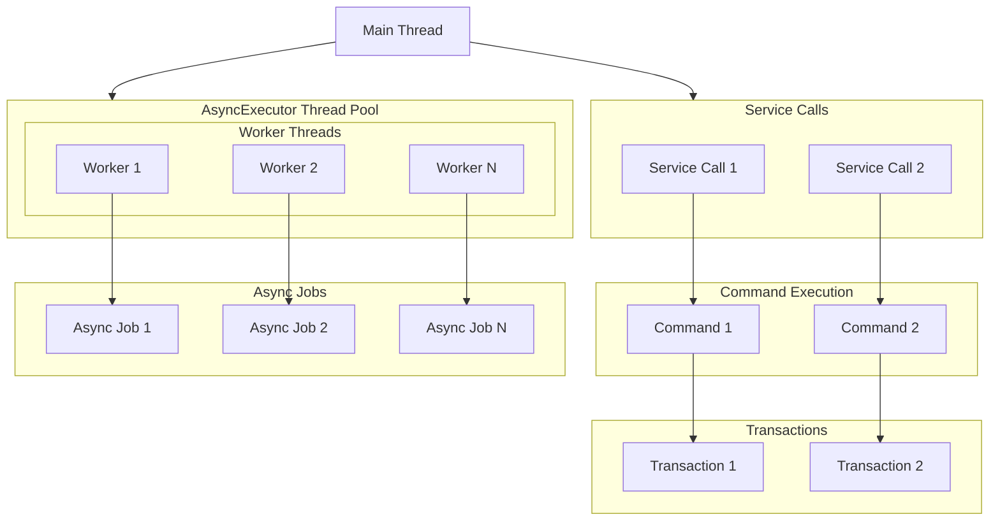

# Architecture Overview

**Module:** `activiti-core/activiti-engine`

---

## Table of Contents

- [System Overview](#system-overview)
- [Core Components](#core-components)
- [Component Interactions](#component-interactions)
- [Execution Flow](#execution-flow)
- [Command Pattern](#command-pattern)
- [Transaction Management](#transaction-management)
- [Threading Model](#threading-model)
- [Memory Management](#memory-management)
- [Extension Points](#extension-points)

---

## System Overview

The Activiti Engine is built on a layered architecture that separates concerns and provides clear extension points. The design follows established patterns while optimizing for BPMN 2.0 execution requirements.

### Architectural Principles

1. **Separation of Concerns** - Clear boundaries between services, execution, and persistence layers
2. **Command Pattern** - All operations go through a centralized command executor for consistency
3. **Transaction Safety** - ACID compliance for all engine operations
4. **Extensibility** - Pluggable components for customization without modifying core code
5. **Performance** - Optimized for high-throughput process execution
6. **Observability** - Comprehensive eventing and history tracking for monitoring

### High-Level Architecture



---

## Core Components

### 1. ProcessEngine

**Purpose:** Central coordinator and service provider

**Source:** `org.activiti.engine.ProcessEngine`

**Responsibilities:**
- Manage engine lifecycle (start/stop)
- Provide access to all services
- Configure and initialize components
- Manage thread pools and resources

**Key Methods:**
```java
public String getName();
public void close();
public RepositoryService getRepositoryService();
public RuntimeService getRuntimeService();
public TaskService getTaskService();
public HistoryService getHistoryService();
public ManagementService getManagementService();
public DynamicBpmnService getDynamicBpmnService();
public ProcessEngineConfiguration getProcessEngineConfiguration();
```

**Design Pattern:** Service Locator + Singleton

### 2. ProcessEngineConfiguration

**Purpose:** Central configuration hub

**Source:** `org.activiti.engine.ProcessEngineConfiguration` (abstract base) and `org.activiti.engine.impl.cfg.ProcessEngineConfigurationImpl`

**Responsibilities:**
- Configure all engine components
- Manage database connections
- Set up transaction management
- Configure async executor
- Enable/disable features

**Configuration Categories:**
```java
// Database
setJdbcDriver(), setJdbcUrl(), setJdbcUsername(), setJdbcPassword()
setDatabaseSchemaUpdate(), setDatabaseType(), setDatabaseTablePrefix()

// Async Executor
setAsyncExecutorActivate(), setAsyncExecutorCorePoolSize(), setAsyncExecutorMaxPoolSize()
setAsyncExecutorThreadPoolQueueSize(), setAsyncExecutorDefaultAsyncJobAcquireWaitTime()

// History
setHistoryLevel(HistoryLevel)

// Transaction
createTransactionInterceptor() // overridden per environment (Standalone, JTA, Spring)
```

**Design Pattern:** Builder + Configuration

### 3. Command Executor

**Purpose:** Central gateway for all engine operations

**Source:** `org.activiti.engine.impl.interceptor.CommandExecutor`

**Responsibilities:**
- Execute commands with proper transaction handling
- Manage command context
- Ensure thread safety
- Handle retries and error propagation

**Command Interceptor Chain:**
```
1. LogInterceptor — debug logging of command start/finish
2. TransactionInterceptor — begins/commits/rollbacks transaction (environment-specific)
3. CommandContextInterceptor — creates and manages CommandContext
4. TransactionContextInterceptor — manages transaction context resources
5. CommandInvoker — executes command, processes agenda operations
```

**Key Interface:**
```java
public interface CommandExecutor {
    CommandConfig getDefaultConfig();
    <T> T execute(CommandConfig config, Command<T> command);
    <T> T execute(Command<T> command);
}
```

**Design Pattern:** Command + Interceptor Chain

### 4. Entity Managers

**Purpose:** Persistence operations for runtime entities

**Source:** `org.activiti.engine.impl.persistence.entity.EntityManager<EntityImpl extends Entity>` (generic base)

**Responsibilities:**
- CRUD operations for entities
- Entity caching and lifecycle management
- Database query optimization

**Base Interface:**
```java
public interface EntityManager<EntityImpl extends Entity> {
    EntityImpl create();
    EntityImpl findById(String entityId);
    void insert(EntityImpl entity);
    void insert(EntityImpl entity, boolean fireCreateEvent);
    EntityImpl update(EntityImpl entity);
    EntityImpl update(EntityImpl entity, boolean fireUpdateEvent);
    void delete(String id);
    void delete(EntityImpl entity);
    void delete(EntityImpl entity, boolean fireDeleteEvent);
}
```

**Per-Entity-Type Managers:**
- `ExecutionEntityManager` — Process executions (`ExecutionEntity`)
- `TaskEntityManager` — User tasks (`TaskEntity`)
- `VariableInstanceEntityManager` — Variables (`VariableInstanceEntity`)
- `JobEntityManager` — Async jobs (`JobEntity`)

**Design Pattern:** Repository + Unit of Work + Generic CRUD

### 5. History Manager

**Purpose:** Historical data recording

**Source:** `org.activiti.engine.impl.history.HistoryManager`

**Responsibilities:**
- Record process instance history
- Track task history
- Store variable history
- Record activity instance data

**History Levels:**
```java
public enum HistoryLevel {
    NONE,     // No history
    ACTIVITY, // Activity instances only
    AUDIT,    // + Task instances, variables
    FULL      // + Detailed execution history
}
```

**Key Methods (representative):**
```java
    void recordProcessInstanceStart(ExecutionEntity processInstance, FlowElement startElement);
    void recordProcessInstanceEnd(String processInstanceId, String deleteReason, String activityId);
    void recordTaskCreated(TaskEntity task, ExecutionEntity execution);
    void recordTaskEnd(String taskId, String deleteReason);
    void recordVariableCreate(VariableInstanceEntity variable);
    void recordVariableUpdate(VariableInstanceEntity variable);
```

**Design Pattern:** Recorder (not Event Sourcing — stores structured history tables)

### 6. ActivitiEventDispatcher

**Purpose:** Event dispatching and listener management

**Source:** `org.activiti.engine.delegate.event.ActivitiEventDispatcher`

**Responsibilities:**
- Dispatch engine events
- Manage event listeners
- Support event filtering
- Handle listener exceptions

**Event Types (ActivitiEventType enum, representative):**
```java
// Entity lifecycle
ENTITY_CREATED, ENTITY_INITIALIZED, ENTITY_UPDATED, ENTITY_DELETED

// Task events
TASK_CREATED, TASK_ASSIGNED, TASK_COMPLETED

// Process events
PROCESS_STARTED, PROCESS_COMPLETED, PROCESS_COMPLETED_WITH_ERROR_END_EVENT, PROCESS_CANCELLED

// Activity events
ACTIVITY_STARTED, ACTIVITY_COMPLETED, ACTIVITY_CANCELLED, ACTIVITY_SIGNALED

// Sequence flow
SEQUENCEFLOW_TAKEN

// Variable events
VARIABLE_CREATED, VARIABLE_UPDATED, VARIABLE_DELETED

// Job events
JOB_EXECUTION_SUCCESS, JOB_EXECUTION_FAILURE, JOB_RETRIES_DECREMENTED, JOB_CANCELED

// Timer events
TIMER_SCHEDULED, TIMER_FIRED

// Engine lifecycle
ENGINE_CREATED, ENGINE_CLOSED
```

**Listener Interface:**
```java
public interface ActivitiEventListener {
    void onEvent(ActivitiEvent event);
    boolean isFailOnException();
}
```

**Design Pattern:** Publisher-Subscriber

### 7. BPMN Execution — ActivityBehavior Pattern

**Purpose:** Core BPMN 2.0 execution engine

**Source:** `org.activiti.engine.impl.delegate.ActivityBehavior` (interface), `org.activiti.engine.impl.bpmn.parser.BpmnParse` (parser)

**Responsibilities:**
- Parse BPMN definitions (`BpmnParse`)
- Execute process flows via activity behaviors
- Handle gateways and events
- Manage parallel execution
- Process business rules

**Architecture:**

Each BPMN element has a corresponding `ActivityBehavior` implementation that defines what happens when the engine reaches that element. Behaviors are created by `ActivityBehaviorFactory` during parsing.

```java
public interface ActivityBehavior {
    void execute(DelegateExecution execution);
}
```

**Key Behavior Classes:**
- `StartEventActivityBehavior` — Process start
- `EndEventActivityBehavior` — Process end
- `TaskActivityBehavior` — User/service tasks
- `ExclusiveGatewayActivityBehavior` — XOR gateway
- `ParallelGatewayActivityBehavior` — AND gateway
- `SubProcessActivityBehavior` — Embedded/called sub-processes
- `IntermediateCatchEventActivityBehavior` — Signal/message/timer catches
- `BoundaryEventActivityBehavior` — Boundary events

**Process Startup:**
`ProcessInstanceHelper.createAndStartProcessInstance()` orchestrates execution creation and initial element activation.

**Design Pattern:** Strategy + Element-specific behaviors

### 8. Agenda

**Purpose:** Execution task management via planned operations

**Source:** `org.activiti.engine.ActivitiEngineAgenda` (interface), `org.activiti.engine.impl.agenda.DefaultActivitiEngineAgenda` (implementation)

**Responsibilities:**
- Queue execution operations
- Manage execution order
- Handle operation completion

**Operations (planned via agenda):**
```java
void planContinueProcessOperation(ExecutionEntity execution);
void planContinueProcessSynchronousOperation(ExecutionEntity execution);
void planContinueProcessInCompensation(ExecutionEntity execution);
void planContinueMultiInstanceOperation(ExecutionEntity execution);
void planTakeOutgoingSequenceFlowsOperation(ExecutionEntity execution, boolean evaluateConditions);
void planEndExecutionOperation(ExecutionEntity execution);
void planTriggerExecutionOperation(ExecutionEntity execution);
void planDestroyScopeOperation(ExecutionEntity execution);
void planExecuteInactiveBehaviorsOperation();
```

**Execution:** Operations are retrieved via `getNextOperation()` and executed by `CommandInvoker.executeOperations()`, which drains the agenda until empty.

**Design Pattern:** Operation Queue

### 9. AsyncExecutor

**Purpose:** Asynchronous job processing

**Source:** `org.activiti.engine.impl.asyncexecutor.AsyncExecutor` (interface), `DefaultAsyncJobExecutor` / `ManagedAsyncJobExecutor`

**Responsibilities:**
- Execute timer jobs
- Process async service tasks
- Handle job retries
- Manage job queues

**Job Handlers:**
- `TimerStartEventJobHandler` — Starts process on timer (`"timer-start-event"`)
- `TriggerTimerEventJobHandler` — Fires timer boundary/intermediate events (`"trigger-timer"`)
- `AsyncContinuationJobHandler` — Continues async service tasks (`"async-continuation"`)
- `ProcessEventJobHandler` — Fires process events (signal/message) (`"process-event"`)
- `TimerSuspendProcessDefinitionHandler` — Suspends process definition on timer
- `TimerActivateProcessDefinitionHandler` — Activates process definition on timer

**Configuration:**
```java
setAsyncExecutorCorePoolSize(int)
setAsyncExecutorMaxPoolSize(int)
setAsyncExecutorThreadPoolQueueSize(int)
setAsyncExecutorDefaultAsyncJobAcquireWaitTime(int)
setAsyncExecutorDefaultTimerJobAcquireWaitTime(int)
setAsyncExecutorNumberOfRetries(int)
```

**Design Pattern:** Thread Pool + Worker

---

## Component Interactions

### Process Start Flow



### Task Completion Flow



---

## Execution Flow

### Command Execution Context

The `Context` class manages thread-local stacks for engine state. `CommandContext` holds per-command state and delegates manager access to `ProcessEngineConfigurationImpl`.

```java
// Context.java — thread-local storage
public class Context {
    protected static ThreadLocal<Stack<CommandContext>> commandContextThreadLocal =
        new ThreadLocal<>();

    protected static ThreadLocal<Stack<ProcessEngineConfigurationImpl>>
        processEngineConfigurationStackThreadLocal = new ThreadLocal<>();

    public static CommandContext getCommandContext() {
        Stack<CommandContext> commandContextStack = commandContextThreadLocal.get();
        if (commandContextStack != null && !commandContextStack.isEmpty()) {
            return commandContextStack.peek();
        }
        return null;
    }
}

// CommandContext.java — delegates managers to configuration
public class CommandContext {
    private ProcessEngineConfigurationImpl processEngineConfiguration;
    private ActivitiEngineAgenda agenda;

    // Manager access delegates to configuration
    public ExecutionEntityManager getExecutionEntityManager() {
        return getProcessEngineConfiguration().getExecutionEntityManager();
    }

    public TaskEntityManager getTaskEntityManager() {
        return getProcessEngineConfiguration().getTaskEntityManager();
    }

    public VariableInstanceEntityManager getVariableInstanceEntityManager() {
        return getProcessEngineConfiguration().getVariableInstanceEntityManager();
    }

    public HistoryManager getHistoryManager() {
        return getProcessEngineConfiguration().getHistoryManager();
    }

    public ActivitiEventDispatcher getEventDispatcher() {
        return getProcessEngineConfiguration().getEventDispatcher();
    }
}
```

### Transaction Boundaries



---

## Command Pattern

### Single Command Interface

All engine operations implement the single `Command<T>` interface. There is no hierarchy of command types — `StartProcessInstanceCmd`, `CompleteTaskCmd`, `DeployCmd`, etc. all implement `Command<T>` directly.

```java
@Internal
public interface Command<T> {
    T execute(CommandContext commandContext);
}
```

### Command Examples by Service

```java
// RuntimeService commands
StartProcessInstanceCmd<T>     // starts a process instance
SignalEventReceivedCmd         // signals an event to an execution
SetVariableCmd                 // sets a process variable
DeleteProcessInstanceCmd       // deletes a process instance

// TaskService commands
CompleteTaskCmd                // completes a task
SetAssigneeTaskCmd             // assigns a task
AddCandidateUserTaskCmd        // adds a candidate user

// RepositoryService commands
DeployCmd                      // deploys a process archive
DeleteDeploymentCmd            // deletes a deployment
SaveProcessDefinitionCmd       // saves a process definition

// ManagementService commands
ExecuteJobsCmd                 // executes due jobs
CleanupCmd                     // cleans up expired history
```

### Command Implementation Example

```java
public class StartProcessInstanceCmd<T> implements Command<ProcessInstance>, Serializable {

    protected String processDefinitionKey;
    protected String processDefinitionId;
    protected String businessKey;
    protected Map<String, Object> variables;
    protected Map<String, Object> transientVariables;
    protected String tenantId;
    protected ProcessInstanceHelper processInstanceHelper;

    public StartProcessInstanceCmd(String processDefinitionKey, String processDefinitionId,
                                   String businessKey, Map<String, Object> variables) {
        this.processDefinitionKey = processDefinitionKey;
        this.processDefinitionId = processDefinitionId;
        this.businessKey = businessKey;
        this.variables = variables;
    }

    public ProcessInstance execute(CommandContext commandContext) {
        // 1. Resolve process definition from cache
        DeploymentManager deploymentCache = commandContext.getProcessEngineConfiguration()
            .getDeploymentManager();
        ProcessDefinitionRetriever processRetriever =
            new ProcessDefinitionRetriever(this.tenantId, deploymentCache);
        ProcessDefinition processDefinition = processRetriever.getProcessDefinition(
            this.processDefinitionId, this.processDefinitionKey);

        // 2. Create and start process instance via helper
        processInstanceHelper = commandContext.getProcessEngineConfiguration()
            .getProcessInstanceHelper();
        ProcessInstance processInstance = processInstanceHelper.createAndStartProcessInstance(
            processDefinition, businessKey, processInstanceName, variables, transientVariables);

        return processInstance;
    }
}
```

---

## Transaction Management

### Interceptor-Based Approach

Transaction management is handled through the command interceptor chain. The `ProcessEngineConfiguration` subclass determines the transaction strategy by overriding `createTransactionInterceptor()`.

```java
// ProcessEngineConfigurationImpl
public abstract CommandInterceptor createTransactionInterceptor();
```

### Environment-Specific Implementations

```java
// StandaloneProcessEngineConfiguration — JDBC transactions
@Override
public CommandInterceptor createTransactionInterceptor() {
    return new TransactionInterceptor(
        new JdbcTransactionFactory(dataSource, autoCommit),
        this
    );
}

// SpringProcessEngineConfiguration — Spring PlatformTransactionManager
@Override
public CommandInterceptor createTransactionInterceptor() {
    return new SpringTransactionInterceptor(transactionManager);
}

// JtaProcessEngineConfiguration — JTA UserTransaction
@Override
public CommandInterceptor createTransactionInterceptor() {
    return new JtaTransactionInterceptor(userTransaction);
}
```

### Transaction Propagation



---

## Threading Model

### Thread Safety

```java
// Thread-safe components
- ProcessEngine (singleton)
- Services (stateless delegates to CommandExecutor)
- CommandExecutor (interceptor chain, thread-safe)

// Thread-local storage (Context class)
- CommandContext stack
- ProcessEngineConfiguration
- TransactionContext
- BPMN override context

// Not thread-safe
- Query objects (single-use per query)
- Builder objects (e.g., ProcessInstanceBuilder)
```

### Concurrency Control



---

## Memory Management

### Caching Strategy

```java
// Transaction-scoped cache (CommandContext level)
- Entity cache via DbSqlSession.insertNewEntity()
- Entities inserted within a command are cached to avoid duplicate DB reads

// Engine-scoped cache (ProcessEngineConfiguration level)
- DeploymentManager — caches process definitions and BPMN models
- ProcessDefinition cache — in-memory by deployment
```

### Memory Optimization

1. **Lazy Loading**: Load entities on demand through entity managers
2. **Batch Operations**: Process multiple items together where possible
3. **Connection Pooling**: Reuse database connections via configured DataSource
4. **History Cleanup**: Remove old history data using `ManagementService.executeCustomSql()` or history cleanup commands
5. **Variable Serialization**: Efficient storage of typed variables

---

## Extension Points

### Custom Activity Behavior

```java
// 1. Custom Activity Behavior
@Internal
public interface ActivityBehavior {
    void execute(DelegateExecution execution);
}

// Implementation example:
public class CustomActivityBehavior implements ActivityBehavior {
    @Override
    public void execute(DelegateExecution execution) {
        // Custom logic
        execution.setVariable("result", "done");
        // Continue to next element
        ((ActivitiExecutionEntity) execution).setActive(true);
    }
}
```

### Custom Task Listener

```java
// 2. Custom Task Listener
public interface TaskListener extends BaseTaskListener {
    void notify(DelegateTask delegateTask);
}

// Implementation example:
public class CustomTaskListener implements TaskListener {
    @Override
    public void notify(DelegateTask delegateTask) {
        // Custom logic on create/assignment/complete events
    }
}
```

### Custom Event Listener

```java
// 3. Custom Event Listener
public interface ActivitiEventListener {
    void onEvent(ActivitiEvent event);
    boolean isFailOnException();
}

// Implementation example:
public class CustomEventListener implements ActivitiEventListener {
    @Override
    public void onEvent(ActivitiEvent event) {
        if (event.getType() == ActivitiEventType.TASK_COMPLETED) {
            // Handle task completion
        }
    }

    @Override
    public boolean isFailOnException() {
        return false; // Don't fail the engine on listener exceptions
    }
}
```

### Custom Execution Listener

```java
// 4. Custom Execution Listener (for BPMN events)
public interface ExecutionListener extends BaseExecutionListener {
    void notify(DelegateExecution execution);
}
```

### Custom Job Handler

```java
// 5. Custom Job Handler (internal API)
@Internal
public interface JobHandler {
    String getType();
    void execute(JobEntity job, String configuration, ExecutionEntity execution, CommandContext commandContext);
}
```

---

## Performance Considerations

### Optimization Strategies

1. **Batch Processing**: Use batch operations for bulk updates
2. **Query Optimization**: Index frequently queried columns; use typed queries over native SQL
3. **Connection Pooling**: Configure appropriate pool sizes in DataSource
4. **Async Execution**: Use async continuations for long-running tasks to reduce transaction scope
5. **History Level**: Choose appropriate history level — `NONE` for maximum performance, `FULL` for complete audit
6. **Caching**: Process definitions are cached in memory after deployment — no reload needed

### Monitoring

```java
// Key metrics to monitor
- Command execution time
- Transaction duration
- Database connection usage
- AsyncExecutor job queue size
- Memory usage (entity cache, definition cache)
- Thread pool utilization (AsyncExecutor threads)
```

---

## Related Documentation

- [Engine Configuration](../configuration.md)
- [Engine API Overview](../api-reference/engine-api/README.md)
- [Repository Service](../api-reference/engine-api/repository-service.md)
- [Runtime Service](../api-reference/engine-api/runtime-service.md)
- [Task Service](../api-reference/engine-api/task-service.md)
- [Best Practices](../best-practices/guide.md)
