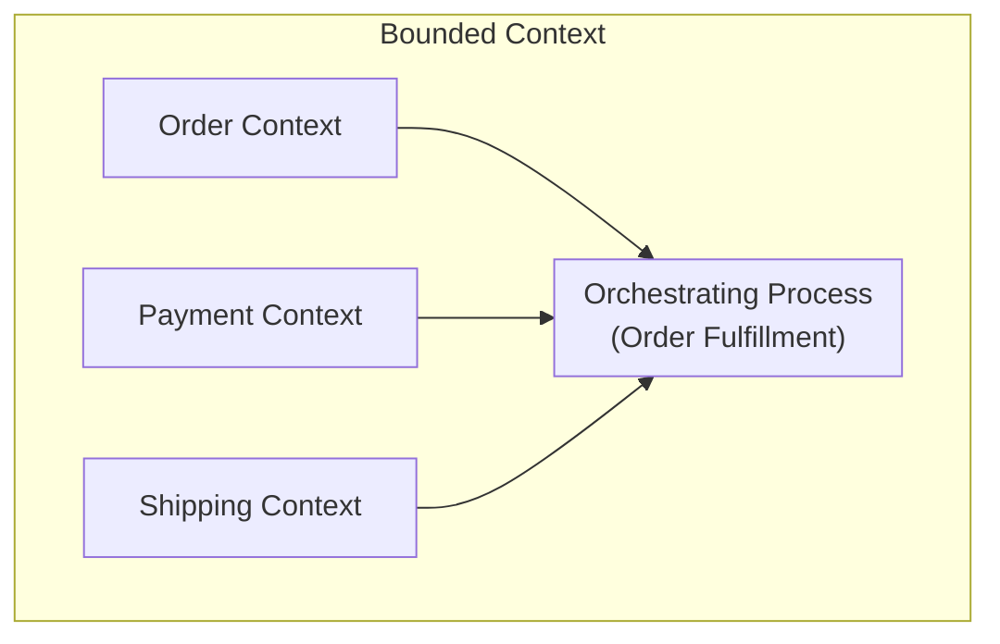
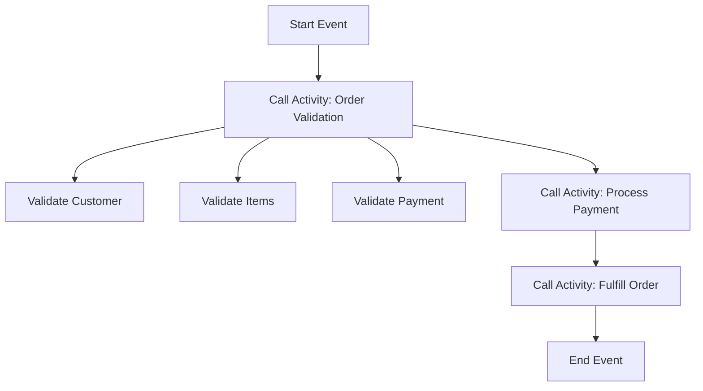
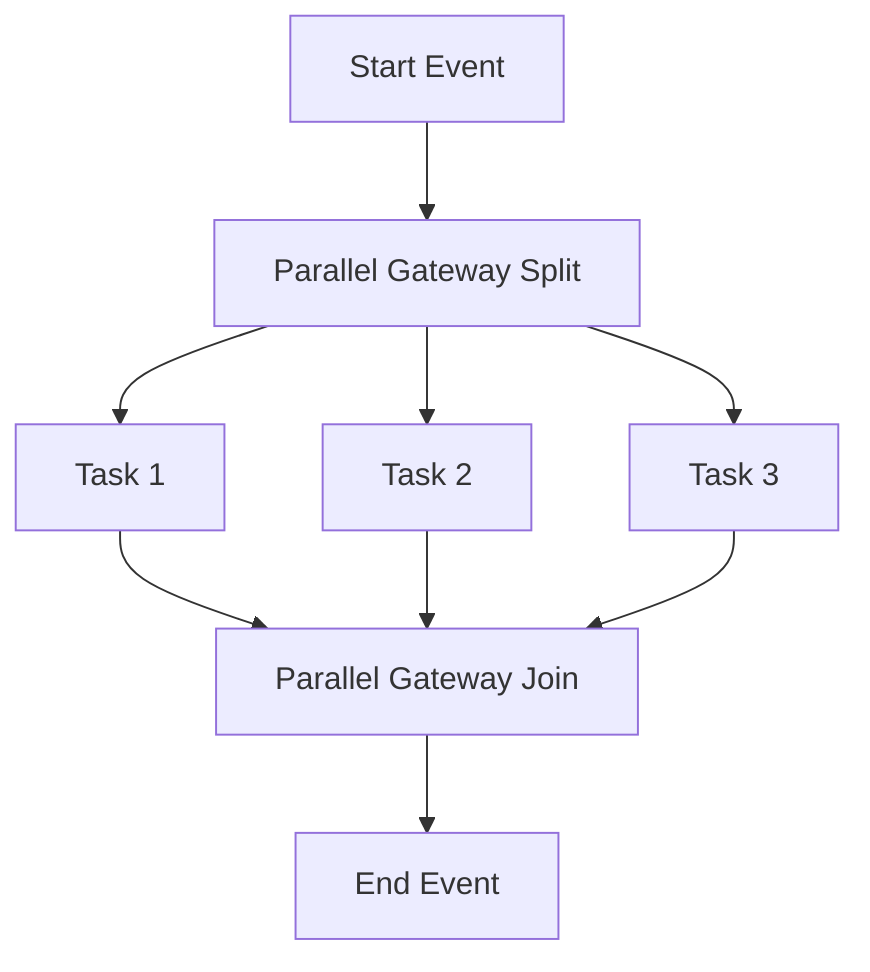
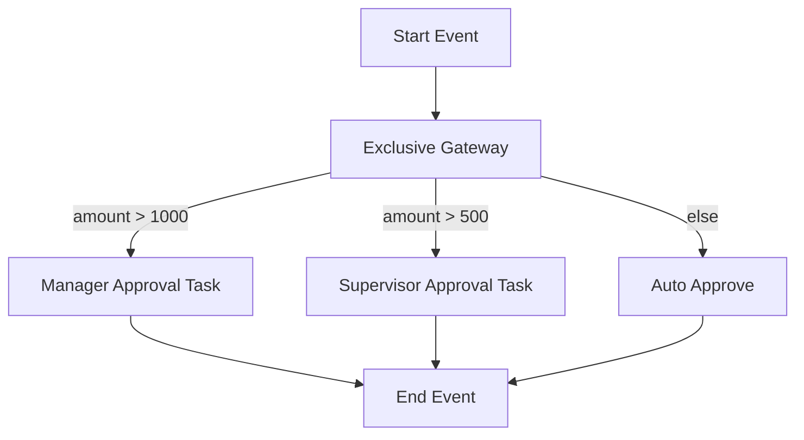

# Best Practices Guide

**Community-Maintained Guide**

This comprehensive guide provides proven patterns and recommendations for building production-ready workflow automation solutions with Activiti.

> **Note:** This is community-contributed documentation and is not officially maintained by the Activiti team. For official documentation, please refer to the Activiti project repositories.

## Table of Contents

- [Architecture & Design](#architecture--design)
- [Performance Optimization](#performance-optimization)
- [Security Best Practices](#security-best-practices)
- [Error Handling](#error-handling)
- [Testing Strategies](#testing-strategies)
- [Monitoring & Observability](#monitoring--observability)
- [Code Organization](#code-organization)
- [BPMN Design Patterns](#bpmn-design-patterns)

---

## Architecture & Design

### 1. Separate Concerns

**Principle:** Organize code by responsibility to improve maintainability and testability.

**Recommended Approach:**

```java
// Service layer: Business logic orchestration
@Service
public class OrderService {
    @Autowired
    private ProcessRuntime processRuntime;
    
    public void createOrder(Order order) {
        validateOrder(order);
        startOrderProcess(order);
        notifyCustomer(order);
    }
    
    private void startOrderProcess(Order order) {
        // Process orchestration logic
    }
}

// Event listener layer: Reactive business logic
@Service
public class OrderEventListener {
    @EventListener
    public void onOrderCompleted(ProcessCompletedEvent event) {
        // Event handling logic
    }
}
```

**❌ Anti-Pattern to Avoid:**

```java
// Mixing business logic, process logic, and notifications
@Service
public class OrderService {
    public void createOrder(Order order) {
        // Validation, process start, notifications, 
        // database updates, email sending - all in one method!
    }
}
```

**Benefits:**
- Improved code maintainability
- Easier unit testing
- Clearer separation of responsibilities
- Better team collaboration

### 2. Use Repository Pattern

**Principle:** Abstract process operations behind interfaces to enable testing and implementation swapping.

**Recommended Approach:**

```java
// Interface: Define contract
public interface ProcessRepository {
    ProcessInstance startProcess(String key, Map<String, Object> variables);
    ProcessInstance getProcessInstance(String id);
    List<ProcessInstance> getActiveProcesses();
    void cancelProcess(String id, String reason);
}

// Implementation: Activiti-specific logic
@Service
public class ActivitiProcessRepository implements ProcessRepository {
    @Autowired
    private ProcessRuntime processRuntime;
    
    @Override
    public ProcessInstance startProcess(String key, Map<String, Object> variables) {
        return processRuntime.start(
            ProcessPayloadBuilder.start()
                .withProcessDefinitionKey(key)
                .withVariables(variables)
                .build()
        );
    }
    
    // Other implementations...
}
```

**Benefits:**
- Easy to write unit tests with mock implementations
- Can swap implementations without changing business logic
- Clear contract between layers
- Supports multiple workflow engines if needed

### 3. Implement Domain-Driven Design

**DO:** Align processes with domain concepts



```java
// Order Context
@Service
public class OrderContextService {
    public Order createOrder(OrderData orderData) {
        // Order-specific logic
    }
}

// Payment Context
@Service
public class PaymentContextService {
    public Payment processPayment(PaymentData paymentData) {
        // Payment-specific logic
    }
}

// Orchestrating Process
// BPMN process that coordinates both contexts
```

### 4. Use Anti-Corruption Layer

**DO:** Isolate external systems

```java
@Service
public class ExternalSystemAdapter {
    
    @Autowired
    private LegacySystemClient legacyClient;
    
    public OrderDTO convertToOrder(LegacyOrder legacyOrder) {
        // Transform legacy format to domain model
        return OrderDTO.builder()
            .id(legacyOrder.getId())
            .customerName(legacyOrder.getCustomerName())
            .items(legacyOrder.getItems().stream()
                .map(this::convertItem)
                .collect(Collectors.toList()))
            .build();
    }
}
```

**Benefit:** Protects your domain from external system changes.

---

## Performance Optimization

### 1. Implement Efficient Pagination

**DO:** Always use pagination for queries

```java
@Service
public class TaskQueryService {
    
    public List<Task> getAllTasksForUser(String userId) {
        List<Task> allTasks = new ArrayList<>();
        int page = 0;
        int pageSize = 100;
        boolean hasMore = true;
        
        while (hasMore) {
            Page<Task> tasks = taskRuntime.tasks(
                Pageable.of(page * pageSize, pageSize),
                TaskPayloadBuilder.tasks()
                    .withAssignee(userId)
                    .build()
            );
            
            allTasks.addAll(tasks.getContent());
            hasMore = tasks.getTotalItems() > (page + 1) * pageSize;
            page++;
        }
        
        return allTasks;
    }
}
```

**❌ DON'T:** Load all records at once

```java
// Bad: Memory issues with large datasets
Page<Task> allTasks = taskRuntime.tasks(Pageable.of(0, Integer.MAX_VALUE));
```

### 2. Use Async Processing

**DO:** Configure async for long-running tasks

```xml
<!-- BPMN Configuration -->
<serviceTask id="externalCall" 
             name="Call External API"
             activiti:async="true"
             activiti:jobPriority="5">
    <extensionElements>
        <activiti:connector connectorRef="apiConnector"/>
    </extensionElements>
</serviceTask>
```

**DO:** Implement async event listeners

```java
@Component
public class AsyncEventListener {
    
    @Autowired
    private TaskExecutor taskExecutor;
    
    @EventListener
    public void onProcessCompleted(ProcessCompletedEvent event) {
        taskExecutor.execute(() -> {
            // Heavy processing outside event thread
            archiveProcessData(event.getEntity());
            sendNotifications(event.getEntity());
            updateAnalytics(event.getEntity());
        });
    }
}
```

### 3. Implement Caching Strategy

**DO:** Cache frequently accessed data

```java
@Service
@CacheConfig(cacheNames = "processDefinitions")
public class ProcessDefinitionService {
    
    @Cacheable(key = "#processDefinitionKey")
    public ProcessDefinition getProcessDefinition(String processDefinitionKey) {
        return processRuntime.processDefinition(processDefinitionKey);
    }
    
    @CacheEvict(allEntries = true)
    public void deployNewProcess() {
        // Deployment logic
    }
    
    @CachePut(key = "#processDefinitionKey")
    public ProcessDefinition updateProcessDefinition(String processDefinitionKey) {
        // Update logic
    }
}
```

**DO:** Use distributed cache for clustered environments

```java
@Configuration
public class CacheConfig {
    
    @Bean
    public CacheManager cacheManager() {
        ConcurrentMapCacheManager cacheManager = new ConcurrentMapCacheManager();
        cacheManager.setCacheNames(Arrays.asList("processDefinitions", "tasks", "variables"));
        return cacheManager;
    }
    
    // For Redis:
    @Bean
    public RedisCacheManager redisCacheManager(RedisConnectionFactory factory) {
        return RedisCacheManager.builder(factory)
            .transactionAware()
            .build();
    }
}
```

### 4. Optimize Variable Storage

**DO:** Store references, not large objects

```java
// Good: Store document reference
processRuntime.setVariables(
    ProcessPayloadBuilder.setVariables()
        .withProcessInstanceId(instanceId)
        .withVariable("documentId", "doc-123")
        .withVariable("documentUrl", "https://storage.example.com/docs/123")
        .withVariable("documentSize", 1024)
        .build()
);

// Bad: Store entire document content
processRuntime.setVariables(
    ProcessPayloadBuilder.setVariables()
        .withProcessInstanceId(instanceId)
        .withVariable("documentContent", largeByteArray)  // Avoid!
        .build()
);
```

### 5. Batch Operations

**DO:** Use batch operations when available

```java
@Service
public class BatchTaskService {
    
    public void assignTasksToUser(List<String> taskIds, String assignee) {
        // Batch assignment instead of individual calls
        taskAdminRuntime.assignMultiple(
            TaskPayloadBuilder.assignMultiple()
                .withTaskIds(taskIds)
                .withAssignee(assignee)
                .build()
        );
    }
}
```

### 6. Database Optimization

**DO:** Configure connection pool properly

```yaml
# application.yml
spring:
  datasource:
    hikari:
      maximum-pool-size: 20
      minimum-idle: 5
      connection-timeout: 30000
      idle-timeout: 600000
      max-lifetime: 1800000
```

**DO:** Add indexes for frequently queried fields

```sql
-- Example indexes for performance
CREATE INDEX idx_task_assignee ON ACT_RU_TASK(ASSIGNEE_);
CREATE INDEX idx_task_process_instance ON ACT_RU_TASK(PROC_INST_ID_;
CREATE INDEX idx_process_instance_status ON ACT_RU_EXECUTION(PROC_INST_ID_, SUSPENDED_);
```

---

## Security Best Practices

### 1. Implement Principle of Least Privilege

**DO:** Use appropriate runtime based on user role

```java
@Service
public class TaskService {
    
    @Autowired
    private TaskRuntime taskRuntime;
    @Autowired
    private TaskAdminRuntime taskAdminRuntime;
    @Autowired
    private SecurityManager securityManager;
    
    public void deleteTask(String taskId) {
        if (securityManager.hasRole("admin")) {
            // Admin can delete any task
            taskAdminRuntime.delete(
                TaskPayloadBuilder.delete()
                    .withTaskId(taskId)
                    .build()
            );
        } else {
            // Regular users can only delete their own tasks
            taskRuntime.delete(
                TaskPayloadBuilder.delete()
                    .withTaskId(taskId)
                    .build()
            );
        }
    }
}
```

### 2. Validate All Inputs

**DO:** Sanitize and validate user input

```java
@Service
public class SecureProcessService {
    
    public void startProcess(String processKey, Map<String, Object> variables) {
        // Validate process key
        if (!isValidProcessKey(processKey)) {
            throw new SecurityException("Invalid process key");
        }
        
        // Sanitize variables
        Map<String, Object> sanitizedVariables = sanitizeVariables(variables);
        
        // Check for sensitive data
        if (containsSensitiveData(sanitizedVariables)) {
            log.warn("Attempt to store sensitive data detected");
        }
        
        processRuntime.start(
            ProcessPayloadBuilder.start()
                .withProcessDefinitionKey(processKey)
                .withVariables(sanitizedVariables)
                .build()
        );
    }
    
    private Map<String, Object> sanitizeVariables(Map<String, Object> variables) {
        // Remove or encrypt sensitive data
        variables.remove("password");
        variables.remove("creditCardNumber");
        return variables;
    }
}
```

### 3. Implement Audit Logging

**DO:** Log all security-relevant events

```java
@Component
public class SecurityAuditListener {
    
    @Autowired
    private AuditLogService auditLogService;
    
    @EventListener
    public void onTaskAssigned(TaskAssignedEvent event) {
        Task task = event.getEntity();
        auditLogService.log(
            "TASK_ASSIGNED",
            task.getProcessInstanceId(),
            task.getAssignee(),
            task.getId(),
            SecurityContextHolder.getContext().getAuthentication().getName()
        );
    }
    
    @EventListener
    public void onProcessDeleted(ProcessCancelledEvent event) {
        ProcessInstance process = event.getEntity();
        auditLogService.log(
            "PROCESS_DELETED",
            process.getId(),
            process.getBusinessKey(),
            event.getCause(),
            SecurityContextHolder.getContext().getAuthentication().getName()
        );
    }
}
```

### 4. Secure API Endpoints

**DO:** Implement proper authorization

```java
@RestController
@RequestMapping("/api/process")
public class ProcessController {
    
    @PreAuthorize("hasRole('PROCESS_STARTER')")
    @PostMapping("/start")
    public ResponseEntity<ProcessInstance> startProcess(@RequestBody StartProcessRequest request) {
        // Start process logic
    }
    
    @PreAuthorize("hasRole('ADMIN') or #taskId == authentication.principal.taskId")
    @PutMapping("/tasks/{taskId}/complete")
    public ResponseEntity<Task> completeTask(@PathVariable String taskId) {
        // Complete task logic
    }
    
    @PreAuthorize("hasRole('ADMIN')")
    @DeleteMapping("/instances/{instanceId}")
    public ResponseEntity<Void> deleteProcess(@PathVariable String instanceId) {
        // Delete process logic
    }
}
```

### 5. Implement Rate Limiting

**DO:** Prevent abuse with rate limiting

```java
@Configuration
public class RateLimitConfig {
    
    @Bean
    public KeyResolver userKeyResolver() {
        return exchange -> {
            Authentication auth = SecurityContextHolder.getContext().getAuthentication();
            return auth != null ? auth.getName() : exchange.getRequest().getRemoteAddress().toString();
        };
    }
    
    @Bean
    public GatewayFiltersFactory<RateLimiterSpec> rateLimiter() {
        return new RateLimiterGatewayFiltersFactory(
            new RedisRateLimiter(10, 1)  // 10 requests per second
        );
    }
}
```

---

## Error Handling

### 1. Implement Comprehensive Error Handling

**DO:** Use specific exception types

```java
@Service
public class RobustProcessService {
    
    public void startProcess(String processKey, Map<String, Object> variables) {
        try {
            ProcessInstance instance = processRuntime.start(
                ProcessPayloadBuilder.start()
                    .withProcessDefinitionKey(processKey)
                    .withVariables(variables)
                    .build()
            );
            
            log.info("Process started successfully: {}", instance.getId());
            
        } catch (NotFoundException e) {
            log.error("Process definition not found: {}", processKey, e);
            throw new BusinessException("PROCESS_NOT_FOUND", "The requested process is not available");
            
        } catch (UnprocessableEntityException e) {
            log.error("Invalid process data: {}", e.getMessage(), e);
            throw new ValidationException("INVALID_DATA", e.getMessage());
            
        } catch (SecurityException e) {
            log.error("Security violation: {}", e.getMessage(), e);
            throw new AccessDeniedException("ACCESS_DENIED", "You don't have permission to start this process");
            
        } catch (Exception e) {
            log.error("Unexpected error starting process", e);
            throw new BusinessException("PROCESS_START_FAILED", "Failed to start process");
        }
    }
}
```

### 2. Implement Retry Logic

**DO:** Use retry for transient failures

```java
@Service
public class RetryableProcessService {
    
    @Retryable(
        value = {TransientException.class},
        maxAttempts = 3,
        backoff = @Backoff(delay = 2000, multiplier = 2)
    )
    public void startProcessWithRetry(String processKey, Map<String, Object> variables) {
        try {
            processRuntime.start(
                ProcessPayloadBuilder.start()
                    .withProcessDefinitionKey(processKey)
                    .withVariables(variables)
                    .build()
            );
        } catch (Exception e) {
            throw new TransientException("Failed to start process", e);
        }
    }
    
    @Recover
    public void recover(TransientException e, String processKey, Map<String, Object> variables) {
        log.error("All retry attempts failed for process: {}", processKey, e);
        // Send alert, log to dead letter queue, etc.
    }
}
```

### 3. Implement Compensation

**DO:** Handle failed processes with compensation

```java
@Component
public class CompensationHandler {
    
    @EventListener
    public void onProcessCancelled(ProcessCancelledEvent event) {
        ProcessInstance process = event.getEntity();
        
        try {
            // Execute compensation logic
            compensateOrderProcess(process);
            compensatePaymentProcess(process);
            compensateInventoryProcess(process);
            
            log.info("Compensation completed for process: {}", process.getId());
            
        } catch (Exception e) {
            log.error("Compensation failed for process: {}", process.getId(), e);
            // Alert operations team
        }
    }
    
    private void compensateOrderProcess(ProcessInstance process) {
        // Rollback order creation
    }
    
    private void compensatePaymentProcess(ProcessInstance process) {
        // Refund payment
    }
}
```

### 4. Implement Circuit Breaker

**DO:** Protect against cascading failures

```java
@Service
public class CircuitBreakerService {
    
    @CircuitBreaker(name = "externalApi", fallbackMethod = "fallbackProcess")
    public void callExternalApi(String data) {
        // External API call
        externalClient.call(data);
    }
    
    private void fallbackProcess(String data, Exception ex) {
        log.error("External API unavailable, using fallback", ex);
        // Use cached data or default behavior
    }
}
```

---

## Testing Strategies

### 1. Unit Testing

**DO:** Mock runtime dependencies

```java
@ExtendWith(MockitoExtension.class)
class OrderServiceTest {
    
    @Mock
    private ProcessRuntime processRuntime;
    
    @Mock
    private TaskRuntime taskRuntime;
    
    @InjectMocks
    private OrderService orderService;
    
    @Test
    void shouldStartOrderProcess() {
        // Arrange
        ProcessInstance mockInstance = Mockito.mock(ProcessInstance.class);
        when(mockInstance.getId()).thenReturn("instance-123");
        when(processRuntime.start(any(StartProcessPayload.class))).thenReturn(mockInstance);
        
        // Act
        ProcessInstance result = orderService.createOrder("ORDER-001", 100.00);
        
        // Assert
        assertEquals("instance-123", result.getId());
        verify(processRuntime).start(any(StartProcessPayload.class));
    }
}
```

### 2. Integration Testing

**DO:** Test with real runtime in test database

```java
@SpringBootTest
@AutoConfigureTestDatabase(replace = AutoConfigureTestDatabase.Replace.ANY)
class ProcessIntegrationTest {
    
    @Autowired
    private ProcessRuntime processRuntime;
    
    @Autowired
    private TaskRuntime taskRuntime;
    
    @Autowired
    private TestRestTemplate restTemplate;
    
    @Test
    void shouldExecuteFullOrderProcess() {
        // Start process
        ProcessInstance instance = processRuntime.start(
            ProcessPayloadBuilder.start()
                .withProcessDefinitionKey("orderProcess")
                .withVariable("orderId", "ORDER-001")
                .build()
        );
        
        assertNotNull(instance.getId());
        
        // Get and complete tasks
        Page<Task> tasks = taskRuntime.tasks(Pageable.of(0, 10));
        assertEquals(1, tasks.getContent().size());
        
        Task task = tasks.getContent().get(0);
        taskRuntime.complete(
            TaskPayloadBuilder.complete()
                .withTaskId(task.getId())
                .build()
        );
        
        // Verify completion
        ProcessInstance completed = processRuntime.processInstance(instance.getId());
        assertEquals(ProcessInstanceStatus.COMPLETED, completed.getStatus());
    }
}
```

### 3. Contract Testing

**DO:** Test API contracts

```java
@ExtendWith(SpringCloudContractVerifierExtension.class)
class ProcessControllerContractTest {
    
    @Value("${contracts.test.location}")
    private String testLocation;
    
    @Test
    @Verify
    void shouldReturnProcessInstance() {
        ContractVerifier.verify(new MakeRequest()
            .GET("/api/process/instance-123")
            .withConsumerRequest()
            .withExpectedResponse(HttpStatus.OK)
        );
    }
}
```

### 4. Performance Testing

**DO:** Test under load

```java
@SpringBootTest
class ProcessPerformanceTest {
    
    @Autowired
    private ProcessRuntime processRuntime;
    
    @Test
    @RepeatedIfExceptionsTest(repeats = 100)
    void shouldHandleConcurrentProcessStarts() throws InterruptedException {
        CountDownLatch latch = new CountDownLatch(10);
        ExecutorService executor = Executors.newFixedThreadPool(10);
        
        for (int i = 0; i < 10; i++) {
            executor.submit(() -> {
                try {
                    processRuntime.start(
                        ProcessPayloadBuilder.start()
                            .withProcessDefinitionKey("testProcess")
                            .build()
                    );
                } finally {
                    latch.countDown();
                }
            });
        }
        
        latch.await(30, TimeUnit.SECONDS);
        executor.shutdown();
    }
}
```

---

## Monitoring & Observability

### 1. Implement Health Checks

**DO:** Create comprehensive health indicators

```java
@Component
public class ActivitiHealthIndicator implements HealthIndicator {
    
    @Autowired
    private ProcessRuntime processRuntime;
    
    @Autowired
    private TaskRuntime taskRuntime;
    
    @Override
    public Health health() {
        try {
            // Test process runtime
            processRuntime.processDefinitions(Pageable.of(0, 1));
            
            // Test task runtime
            taskRuntime.tasks(Pageable.of(0, 1));
            
            return Health.up()
                .withDetail("processRuntime", "available")
                .withDetail("taskRuntime", "available")
                .build();
                
        } catch (Exception e) {
            return Health.down(e)
                .withDetail("error", e.getMessage())
                .build();
        }
    }
}
```

### 2. Implement Metrics

**DO:** Track key performance indicators

```java
@Component
public class ProcessMetrics {
    
    @Autowired
    private MeterRegistry meterRegistry;
    
    public void recordProcessStart(String processKey) {
        meterRegistry.counter("process.starts.total", "key", processKey).increment();
    }
    
    public void recordProcessCompletion(String processKey, long durationMs) {
        meterRegistry.counter("process.completions.total", "key", processKey).increment();
        meterRegistry.timer("process.duration", "key", processKey)
            .record(durationMs, TimeUnit.MILLISECONDS);
    }
    
    public void recordTaskCompletion(String taskType) {
        meterRegistry.counter("task.completions.total", "type", taskType).increment();
    }
    
    public void recordError(String errorType) {
        meterRegistry.counter("errors.total", "type", errorType).increment();
    }
}
```

### 3. Implement Distributed Tracing

**DO:** Add tracing to process execution

```java
@Component
public class TracingProcessListener implements ProcessEventListener<ProcessStartedEvent> {
    
    @Autowired
    private Tracer tracer;
    
    @Override
    public void onEvent(ProcessStartedEvent event) {
        ProcessInstance process = event.getEntity();
        
        Span span = tracer.buildSpan("process-execution")
            .withTag("process.id", process.getId())
            .withTag("process.key", process.getProcessDefinitionKey())
            .withTag("business.key", process.getBusinessKey())
            .start();
        
        try (Scope scope = tracer.activateSpan(span)) {
            // Process execution continues
        } finally {
            span.finish();
        }
    }
    
    @Override
    public ProcessEvents getEventType() {
        return ProcessEvents.PROCESS_STARTED;
    }
}
```

### 4. Implement Logging Best Practices

**DO:** Use structured logging

```java
@Service
public class LoggingService {
    
    private static final Logger log = LoggerFactory.getLogger(LoggingService.class);
    
    public void startProcess(String processKey, Map<String, Object> variables) {
        MDC.put("processKey", processKey);
        MDC.put("userId", SecurityContextHolder.getContext().getAuthentication().getName());
        
        try {
            log.info("Starting process", () -> new HashMap<String, Object>() {{
                put("processKey", processKey);
                put("variableCount", variables.size());
            }});
            
            // Process logic
            
            log.info("Process started successfully", () -> new HashMap<String, Object>() {{
                put("processInstanceId", instanceId);
            }});
            
        } catch (Exception e) {
            log.error("Failed to start process", () -> new HashMap<String, Object>() {{
                put("processKey", processKey);
                put("error", e.getMessage());
            }}, e);
            throw e;
        } finally {
            MDC.clear();
        }
    }
}
```

---

## Code Organization

### 1. Project Structure

**DO:** Follow consistent structure

```
src/
├── main/
│   ├── java/
│   │   └── com/example/workflow/
│   │       ├── WorkflowApplication.java
│   │       ├── config/
│   │       │   ├── ActivitiConfig.java
│   │       │   ├── SecurityConfig.java
│   │       │   └── CacheConfig.java
│   │       ├── controller/
│   │       │   ├── ProcessController.java
│   │       │   └── TaskController.java
│   │       ├── service/
│   │       │   ├── ProcessService.java
│   │       │   ├── TaskService.java
│   │       │   └── BusinessRuleService.java
│   │       ├── repository/
│   │       │   ├── ProcessRepository.java
│   │       │   └── ActivitiProcessRepository.java
│   │       ├── listener/
│   │       │   ├── ProcessEventListener.java
│   │       │   └── TaskEventListener.java
│   │       ├── model/
│   │       │   ├── Order.java
│   │       │   └── Payment.java
│   │       └── dto/
│   │           ├── StartProcessRequest.java
│   │           └── ProcessResponse.java
│   └── resources/
│       ├── application.yml
│       ├── bpmn/
│       │   ├── order-process.bpmn
│       │   └── payment-process.bpmn
│       └── forms/
│           └── order-form.html
└── test/
    ├── java/
    │   └── com/example/workflow/
    │       ├── controller/
    │       ├── service/
    │       └── integration/
    └── resources/
        ├── application-test.yml
        └── test-data/
```

### 2. Naming Conventions

**DO:** Use descriptive names

```java
// Good
ProcessInstance orderProcessInstance = processRuntime.start(...);
Task approvalTask = taskRuntime.task(taskId);
List<VariableInstance> paymentVariables = processRuntime.variables(...);

// Bad
p = processRuntime.start(...);
t = taskRuntime.task(id);
v = processRuntime.variables(...);
```

### 3. Documentation

**DO:** Document complex logic

```java
/**
 * Starts the order fulfillment process.
 * <p>
 * This method:
 * <ul>
 *   <li>Validates the order data</li>
 *   <li>Checks inventory availability</li>
 *   <li>Starts the BPMN process with order variables</li>
 *   <li>Sends confirmation notification</li>
 * </ul>
 *
 * @param order the order to process
 * @return the started process instance
 * @throws BusinessException if order validation fails
 * @throws InventoryException if items are not available
 */
public ProcessInstance startOrderFulfillment(Order order) {
    // Implementation
}
```

---

## BPMN Design Patterns

### 1. Subprocess Pattern

**DO:** Use subprocesses for complex logic



**Benefit:** Improves readability and maintainability.

### 2. Error Handling Pattern

**DO:** Implement proper error handling

```xml
<sequenceFlow sourceRef="task1" targetRef="errorBoundary"/>
<bpmn:errorEvent id="errorBoundary" 
                 cancelActivity="true">
    <bpmn:error errorRef="error1"/>
</bpmn:errorEvent>
<sequenceFlow sourceRef="errorBoundary" targetRef="errorHandler"/>
<bpmn:task id="errorHandler" name="Handle Error">
    <!-- Error recovery logic -->
</bpmn:task>
```

### 3. Parallel Processing Pattern

**DO:** Use parallel gateways for concurrent tasks



### 4. Conditional Flow Pattern

**DO:** Use exclusive gateways for decisions



---

## Summary Checklist

### Architecture
- [ ] Separate concerns (service, repository, listener)
- [ ] Use domain-driven design
- [ ] Implement anti-corruption layers
- [ ] Follow repository pattern

### Performance
- [ ] Use pagination for all queries
- [ ] Implement async processing
- [ ] Add caching where appropriate
- [ ] Store references, not large objects
- [ ] Use batch operations

### Security
- [ ] Implement least privilege
- [ ] Validate all inputs
- [ ] Add audit logging
- [ ] Secure API endpoints
- [ ] Implement rate limiting

### Error Handling
- [ ] Use specific exception types
- [ ] Implement retry logic
- [ ] Add compensation handlers
- [ ] Use circuit breakers

### Testing
- [ ] Write unit tests
- [ ] Create integration tests
- [ ] Implement contract tests
- [ ] Add performance tests

### Monitoring
- [ ] Create health checks
- [ ] Implement metrics
- [ ] Add distributed tracing
- [ ] Use structured logging

### Code Quality
- [ ] Follow project structure
- [ ] Use descriptive names
- [ ] Document complex logic
- [ ] Review BPMN designs

---

**Remember:** Best practices evolve with your specific use case. Adapt these guidelines to fit your organization's needs and constraints.
