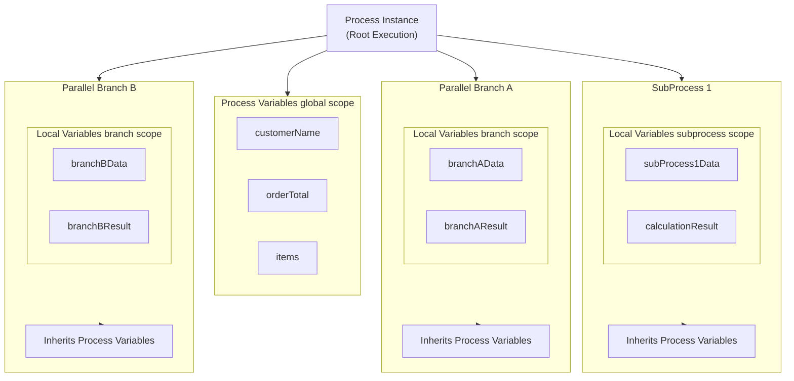

# Variables and Variable Scope

Variables in Activiti are used to **store and pass data** throughout the process lifecycle. Understanding variable scope is crucial for effective process design and data management.

## Overview

```java
// Setting a process variable
execution.setVariable("orderId", "ORD-12345");

// Getting a variable
String orderId = (String) execution.getVariable("orderId");

// Setting a local variable (subprocess only)
execution.setVariableLocal("subProcessData", data);
```

**Key Concepts:**
- **Process Variables** - Available throughout the entire process instance
- **Local Variables** - Scoped to specific executions (subprocesses)
- **Task Variables** - Associated with user tasks
- **Transient Variables** - Temporary, not persisted to database

## Variable Types

### Process Variables

Available to **all activities** in the process instance.

```java
// Set on process instance level
execution.setVariable("customerName", "John Doe");
execution.setVariable("orderTotal", 999.99);
execution.setVariable("items", orderItems);

// Access from any activity
String customer = (String) execution.getVariable("customerName");
```

**Characteristics:**
- Stored on the root execution (process instance)
- Accessible from any activity in the process
- Persisted to database (`ACT_RU_VARIABLE`)
- Available in history (`ACT_HI_VARINST`)

### Local Variables

Scoped to **specific executions** (e.g., subprocesses, parallel branches).

```java
// Set local to subprocess
subExecution.setVariableLocal("subProcessData", data);

// Access local variable
Object localData = subExecution.getVariableLocal("subProcessData");

// Check if local variable exists
boolean hasLocal = subExecution.hasVariableLocal("subProcessData");
```

**Characteristics:**
- Stored on specific execution (not root)
- Only accessible within that execution scope
- Shadows process variable with same name
- Useful for parallel branches and subprocesses

### Task Variables

Associated with **user tasks** specifically.

```java
// Set task variable
taskService.setVariable("taskId", "approverComment", "Looks good");

// Get task variable
String comment = (String) taskService.getVariable("taskId", "approverComment");

// Get all task variables
Map<String, Object> taskVars = taskService.getVariables("taskId");
```

**Characteristics:**
- Linked to specific task instance
- Accessible via TaskService
- Useful for form data and task-specific information
- Separate from process execution variables

### Transient Variables

**Temporary variables** that are not persisted.

```java
// Set transient variable (not saved to DB)
execution.setTransientVariable("tempCalculation", result);

// Get transient variable
Object temp = execution.getTransientVariable("tempCalculation");

// Transient shadows persistent
execution.setVariable("myVar", "persistent");
execution.setTransientVariable("myVar", "temporary");
// getVariable("myVar") returns "temporary"
```

**Characteristics:**
- Not stored in database
- Lost after wait state (user task, timer, etc.)
- Useful for intermediate calculations
- Better performance for temporary data

## Variable Scope Hierarchy



### Scope Resolution Order

When calling `getVariable("name")`:

1. **Check current execution** for local variable
2. **Check parent execution** for local variable
3. **Continue up hierarchy** to root execution
4. **Return process variable** if found
5. **Return null** if not found anywhere

```java
// Example: Variable shadowing
execution.setVariable("myVar", "process-level");      // Set on process
subExecution.setVariableLocal("myVar", "subprocess"); // Set local to subprocess

// From subprocess:
subExecution.getVariable("myVar");        // Returns "subprocess" (local)
subExecution.getVariableLocal("myVar");   // Returns "subprocess" (local only)
rootExecution.getVariable("myVar");       // Returns "process-level"
```

## Variable Operations

### Setting Variables

```java
// Single variable
execution.setVariable("name", value);

// Multiple variables
execution.setVariables(Map.of(
    "var1", value1,
    "var2", value2,
    "var3", value3
));

// Local variables
execution.setVariableLocal("localName", localValue);
execution.setVariablesLocal(localMap);

// Transient variables
execution.setTransientVariable("temp", temporaryValue);
execution.setTransientVariables(tempMap);

// With fetch optimization
execution.setVariable("name", value, false); // Don't fetch all variables
```

### Getting Variables

```java
// Single variable
Object value = execution.getVariable("name");
String typedValue = execution.getVariable("name", String.class);

// Multiple variables
Map<String, Object> vars = execution.getVariables();
Map<String, Object> specific = execution.getVariables(List.of("var1", "var2"));

// Local variables only
Object local = execution.getVariableLocal("name");
Map<String, Object> locals = execution.getVariablesLocal();

// Transient variables
Object temp = execution.getTransientVariable("name");
Map<String, Object> temps = execution.getTransientVariables();

// Variable instances (with metadata)
VariableInstance vi = execution.getVariableInstance("name");
Map<String, VariableInstance> instances = execution.getVariableInstances();

// With fetch optimization
Object value = execution.getVariable("name", false); // Don't fetch all
```

### Checking Variables

```java
// Check existence
boolean hasVar = execution.hasVariable("name");
boolean hasLocal = execution.hasVariableLocal("name");
boolean hasAny = execution.hasVariables();
boolean hasAnyLocal = execution.hasVariablesLocal();

// Get variable names
Set<String> allNames = execution.getVariableNames();
Set<String> localNames = execution.getVariableNamesLocal();
```

### Removing Variables

```java
// Remove single variable
execution.removeVariable("name");

// Remove multiple variables
execution.removeVariables(List.of("var1", "var2"));

// Remove local variables
execution.removeVariableLocal("localName");
execution.removeVariablesLocal(localNames);

// Remove transient variables
execution.removeTransientVariable("temp");
execution.removeTransientVariables();

// Remove all variables
execution.removeVariables();
execution.removeVariablesLocal();
```

## BPMN Variable Usage

### Start Event with Variables

```xml
<!-- Message start event with variables -->
<startEvent id="messageStart">
  <messageEventDefinition messageRef="orderMessage"/>
</startEvent>

<!-- Runtime: Start with variables -->
runtimeService.startProcessInstanceByKey("orderProcess", 
    Map.of("orderId", "123", "customer", "John"));
```

### Service Task Variables

```xml
<serviceTask id="processOrder" 
             activiti:class="com.example.OrderService">
  
  <!-- Input/output mappings handled in Java delegate -->
</serviceTask>
```

```java
public class OrderService implements JavaDelegate {
    @Override
    public void execute(DelegateExecution execution) {
        // Get input variables
        String orderId = (String) execution.getVariable("orderId");
        Customer customer = execution.getVariable("customer", Customer.class);
        
        // Process order
        Order order = processOrder(orderId, customer);
        
        // Set output variables
        execution.setVariable("order", order);
        execution.setVariable("orderStatus", "PROCESSED");
    }
}
```

### User Task Variables

```xml
<userTask id="approvalTask" 
          activiti:assignee="${manager}"
          activiti:formKey="approval-form">
  
  <!-- Form properties map to task variables -->
  <activiti:formProperty name="approvalComment" type="string"/>
  <activiti:formProperty name="approved" type="bool"/>
  
</userTask>
```

```java
// Complete task with variables
taskService.complete(taskId, Map.of(
    "approved", true,
    "approvalComment", "Approved by manager"
));
```

### Gateway Conditions with Variables

```xml
<exclusiveGateway id="amountGateway"/>

<sequenceFlow id="highValue" 
              sourceRef="amountGateway" 
              targetRef="managerApproval">
  <conditionExpression>${orderTotal > 1000}</conditionExpression>
</sequenceFlow>

<sequenceFlow id="lowValue" 
              sourceRef="amountGateway" 
              targetRef="autoApprove">
  <conditionExpression>${orderTotal <= 1000}</conditionExpression>
</sequenceFlow>
```

### Subprocess Variable Isolation

```xml
<subProcess id="paymentSubProcess">
  
  <!-- Variables set here are local to subprocess -->
  <serviceTask id="processPayment">
    <!-- Sets paymentData as local variable -->
  </serviceTask>
  
</subProcess>
```

```java
// In subprocess
subExecution.setVariableLocal("paymentData", data); // Local to subprocess
subExecution.setVariable("orderId", id);            // On process instance

// After subprocess completes
// paymentData is no longer accessible (was local)
// orderId is still accessible (process variable)
```

## Variable Lifecycle

### 1. Process Start

```java
// Variables created at process start
Map<String, Object> startVars = Map.of(
    "orderId", "ORD-123",
    "customer", customerObject
);

runtimeService.startProcessInstanceByKey("orderProcess", startVars);

// All variables stored on root execution (process instance level)
```

### 2. During Execution

```java
// Variables can be added/modified at any point
execution.setVariable("intermediateResult", result);

// Local variables in subprocesses
subExecution.setVariableLocal("subData", data);

// Transient variables for temporary data
execution.setTransientVariable("calcTemp", temp);
```

### 3. Wait States

```java
// At user task, timer, or message event:
// - Persistent variables remain in database
// - Transient variables are lost
// - Local variables remain on their execution

// After wait state completes, persistent variables are restored
```

### 4. Process Completion

```java
// When process completes:
// - All variable data moved to history tables
// - ACT_HI_VARINST contains historical variable data
// - ACT_RU_VARIABLE entries are cleaned up

// Historical variables remain queryable
historyService.createHistoricVariableInstanceQuery()
    .processInstanceId(processId)
    .list();
```

## Database Storage

### Runtime Variables

**Table:** `ACT_RU_VARIABLE`

| Column | Description |
|--------|-------------|
| `ID_` | Variable instance ID |
| `TYPE_` | Variable type (string, long, date, bytes, etc.) |
| `NAME_` | Variable name |
| `EXECUTION_ID_` | Execution ID (null = process instance level) |
| `TASK_ID_` | Task ID (if task variable) |
| `TEXT_` | String value |
| `TEXT2_` | Secondary string value |
| `LONG_VALUE_` | Long numeric value |
| `DOUBLE_VALUE_` | Double numeric value |
| `TIMESTAMP_` | Date/time value |
| `BYTES_` | Blob/serialized object |

### Historical Variables

**Table:** `ACT_HI_VARINST`

Same structure as runtime variables, plus:
- `PROC_INST_ID_` - Process instance ID
- `PROC_DEF_ID_` - Process definition ID
- `REV_` - Revision number

## Best Practices

### 1. Use Meaningful Variable Names

```java
// GOOD
execution.setVariable("customerOrderId", orderId);
execution.setVariable("paymentAmount", amount);

// BAD
execution.setVariable("o", orderId);
execution.setVariable("x", amount);
```

### 2. Choose Appropriate Scope

```java
// Process-level data
execution.setVariable("customerId", id);        // Accessible everywhere

// Subprocess-specific data
subExecution.setVariableLocal("subResult", r);  // Only in subprocess

// Temporary calculations
execution.setTransientVariable("tempSum", sum); // Not persisted
```

### 3. Use Typed Variables

```java
// GOOD - Type safety
Customer customer = execution.getVariable("customer", Customer.class);
Double amount = execution.getVariable("totalAmount", Double.class);

// BAD - Manual casting
Object obj = execution.getVariable("customer");
Customer customer = (Customer) obj; // Risk of ClassCastException
```

### 4. Minimize Variable Count

```java
// GOOD - Use objects
Order order = new Order(id, customer, items);
execution.setVariable("order", order);

// BAD - Many separate variables
execution.setVariable("orderId", id);
execution.setVariable("orderCustomer", customer);
execution.setVariable("orderItems", items);
execution.setVariable("orderTotal", total);
```

### 5. Clean Up Unneeded Variables

```java
// Remove temporary variables
execution.removeVariable("tempCalculation");

// Remove large objects when done
execution.removeVariable("largeDataSet");
```

### 6. Use Transient Variables Wisely

```java
// GOOD - Intermediate calculation
execution.setTransientVariable("calcResult", result);
// Used immediately, not needed after wait state

// BAD - Data needed later
execution.setTransientVariable("customerData", data);
// Lost after user task, but needed later!
```

### 7. Optimize Variable Fetching

```java
// GOOD - Fetch only needed variable
Object var = execution.getVariable("specificVar", false);

// BAD - Fetches all variables (performance hit)
Object var = execution.getVariable("specificVar"); // fetchAll=true by default
```

## Common Pitfalls

### 1. Variable Shadowing Confusion

```java
// Process level
execution.setVariable("myVar", "process");

// Subprocess level
subExecution.setVariable("myVar", "subprocess");

// From subprocess:
subExecution.getVariable("myVar");  // "subprocess" (local shadows process)
rootExecution.getVariable("myVar"); // "process"

// After subprocess completes, "subprocess" value is lost!
```

**Solution:** Use explicit `getVariableLocal()` or different variable names.

### 2. Losing Transient Variables

```java
// Before user task
execution.setTransientVariable("tempData", data);

// User task (wait state)
// ... user completes task ...

// After user task
execution.getTransientVariable("tempData"); // NULL! Lost during wait state
```

**Solution:** Use persistent variables for data needed after wait states.

### 3. Null Pointer Exceptions

```java
// BAD - No null check
String value = (String) execution.getVariable("myVar");
value.toUpperCase(); // NPE if variable doesn't exist

// GOOD - Check existence
if (execution.hasVariable("myVar")) {
    String value = execution.getVariable("myVar", String.class);
    value.toUpperCase();
}
```

### 4. Type Mismatch

```java
// Set as String
execution.setVariable("count", "5");

// Try to get as Integer
Integer count = execution.getVariable("count", Integer.class); // Returns null!

// Correct approach
execution.setVariable("count", 5); // Set as Integer
Integer count = execution.getVariable("count", Integer.class); // Works
```

### 5. Performance Issues

```java
// BAD - Fetching all variables repeatedly
for (int i = 0; i < 100; i++) {
    Object var = execution.getVariable("specificVar"); // Fetches ALL each time
}

// GOOD - Fetch once or use optimization
Map<String, Object> allVars = execution.getVariables();
// or
Object var = execution.getVariable("specificVar", false); // Don't fetch all
```

## Variable Inspection

### Runtime Inspection

```java
// Get all variable names
Set<String> varNames = execution.getVariableNames();

// Get variable instances with metadata
Map<String, VariableInstance> instances = execution.getVariableInstances();

for (VariableInstance vi : instances.values()) {
    System.out.println("Name: " + vi.getName());
    System.out.println("Type: " + vi.getType());
    System.out.println("Execution: " + vi.getExecutionId());
    System.out.println("Task: " + vi.getTaskId());
}
```

### Historical Inspection

```java
// Query historical variables
List<HistoricVariableInstance> history = historyService
    .createHistoricVariableInstanceQuery()
    .processInstanceId(processId)
    .variableName("orderId")
    .list();

// Get variable updates
List<HistoricVariableUpdate> updates = historyService
    .createHistoricVariableUpdateQuery()
    .processInstanceId(processId)
    .list();
```

## Related Documentation

- [Expression Language](../../api-reference/core-common/expression-language.md) - Using variables in expressions
- [Service Task](../elements/service-task.md) - Variable usage in delegates
- [User Task](../elements/user-task.md) - Task variables and forms
- [Common Features](../common-features.md) - Multi-instance variables

---

**Last Updated: 2026
