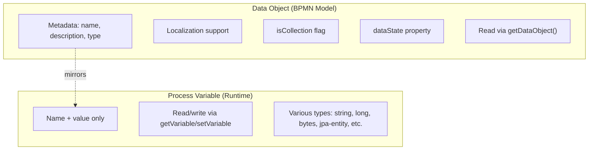

# Data Objects and Data Stores

BPMN Data Objects and Data Stores provide a way to model data associated with a process at the diagram level, carrying metadata such as name, description, type, and collection status. They are distinct from process variables — data objects represent the **data model** of a process, while variables hold the **runtime values**.

## Data Object

A Data Object represents a piece of data relevant to the process. It carries metadata about the data item, including localization support for name and description.

```xml
<dataObject id="orderData" name="Order Data">
  <dataState name="draft"/>
</dataObject>
```

### Data Object Properties

| Property | Description |
|----------|-------------|
| `name` | Display name with localization support |
| `description` | Human-readable description with localization |
| `itemSubjectRef` | Reference to a data type definition |
| `dataState` | Current state (e.g., `draft`, `confirmed`, `archived`) |
| `isCollection` | Whether the data object represents a collection |

### Valued Data Objects

Data objects with initial values:

```xml
<stringDataObject id="defaultName" name="Default Name" value="Unknown"/>
<integerDataObject id="maxRetries" name="Max Retries" value="3"/>
<booleanDataObject id="isActive" name="Is Active" value="true"/>
```

Supported valued types: `string`, `boolean`, `integer`, `long`, `double`, `date`.

## Data Store

A Data Store represents an external repository of data that the process reads from or writes to. Unlike data objects (which are process-scoped), data stores are **process-independent**.

```xml
<dataStore id="customerDb" name="Customer Database" itemSubjectRef="jdbc://customers"/>
```

### Data Store Reference

A Data Store Reference links a process activity to an external data store:

```xml
<dataStoreReference id="refCustomerDb" name="Customer DB Ref" dataStoreRef="customerDb"/>
```

## Runtime API

### Querying Data Objects

Data objects are **read-only at runtime** — they mirror process variables and are populated automatically from BPMN-valued data objects.

```java
// Get a specific data object by name
DataObject dataObject = runtimeService.getDataObject(
    processInstanceId, "orderData");

// Get all data objects
Map<String, DataObject> allDataObjects = runtimeService.getDataObjects(processInstanceId);

// Get local data objects (scoped to execution)
DataObject localObj = runtimeService.getDataObjectLocal(executionId, "tempData");
```

To set or delete data, use standard process variables:

```java
// Set the underlying variable (data object will reflect it)
runtimeService.setVariable(processInstanceId, "orderData", orderObject);

// Delete the underlying variable
runtimeService.removeVariable(processInstanceId, "orderData");
```

### Data Object Interface

```java
public interface DataObject {
    String getName();                       // Name with locale fallback
    String getLocalizedName();              // Localized display name
    String getDescription();                // Human-readable description
    Object getValue();                      // Runtime value
    String getType();                       // Data type name
    String getDataObjectDefinitionKey();    // BPMN element ID that defined this
}
```

## Data Objects vs Process Variables

| Aspect | Data Object | Process Variable |
|--------|-------------|------------------|
| Metadata | Name, description, type, localization | Name and value only |
| BPMN modeling | Visible in process diagram | Not modeled in BPMN |
| API | `getDataObject()` (read-only); use `setVariable()`/`removeVariable()` to modify | `getVariable()`, `setVariable()` |
| Collection flag | `isCollection` property | Not tracked |
| Data state | `dataState` property | Not tracked |



## Use Cases

### Documenting Process Data Model

```xml
<process id="orderProcess">
  <!-- Data objects document what data the process handles -->
  <dataObject id="order" name="Order" isCollection="false">
    <documentation>Customer order with line items</documentation>
  </dataObject>
  <dataObject id="shipments" name="Shipments" isCollection="true">
    <documentation>Related shipments for this order</documentation>
  </dataObject>
  <dataObject id="payments" name="Payments" isCollection="true"/>
  ...
</process>
```

### External System Reference

```xml
<!-- Reference to external data source -->
<dataStore id="erpSystem" name="ERP System" itemSubjectRef="rest://erp/api/v1"/>

<dataStoreReference id="erpRef" name="ERP Data" dataStoreRef="erpSystem"/>
```

## Related Documentation

- [Variables and Variable Scope](../advanced/variables.md) — Process variables
- [Service Task](./service-task.md) — Reading/writing data objects in delegates
